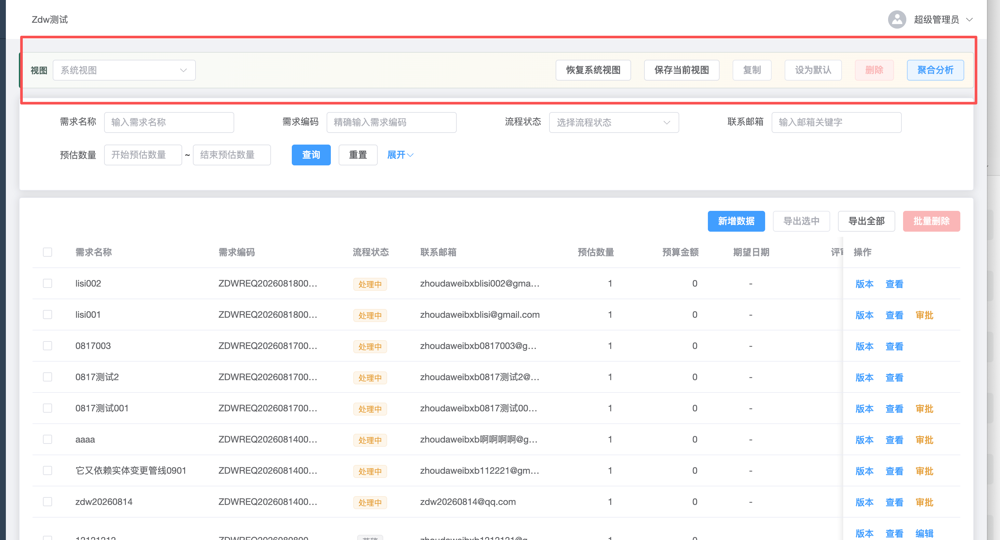

# 实体列表视图工具栏调查与单屏审查

日期：2026-08-24

## 结论

截图中的工具栏在调查开始时是本地工作区尚未提交的 P2“列表个人/共享视图、聚合和多视图”功能，现已从运行时代码撤下。前端组件于 2026-08-22 22:55 左右创建，并约在 22:59 接入通用实体列表；Git 中没有对应提交、作者或正式上线记录。

撤下前的实现不只是视觉突兀，还存在父子组件 props/emit 契约错配。截图中下拉框只有“系统视图”，且“复制 / 设为默认 / 删除”始终禁用，正是视图列表未能加载的可见结果。

## 截图证据

## 功能意图

- 保存当前筛选、分页、列布局和显示方式为个人或共享视图。
- 复制、设为默认、删除自己的保存视图。
- 清除个人默认并切回系统列表配置。
- 按字段执行 COUNT、SUM、AVG、MIN、MAX 临时聚合。
- 支持表格、图表、看板、日历显示方式。

## 撤下前的关键问题

1. `EntityDataList.vue` 传 `entity-id/list-config-id/release-id/current-view`，`EntityListViewToolbar.vue` 实际要求 `entityCode/listKey/currentConfig`，导致加载直接返回，保存、恢复和聚合请求也缺少关键路径参数。
2. 工具栏无功能开关、权限和列表级配置门控，所有普通已发布实体列表都会出现。
3. 多视图组件的 props 和事件也与父页面不一致，看板更新调用参数顺序亦有问题。
4. PERSONAL 按用户、实体编码和列表键保存；所谓 TEAM 没有团队或组织维度，实际是同一实体列表下的全局共享。
5. 聚合先分页读取受权明细，再在 Java 内存中计算，超限会返回截断样本，不适合作为精确全量报表。
6. 当时宣称的排序、列拖动、显隐、宽度保存并没有完整交互闭环。

## 单屏审查

步骤 1：进入业务列表，先看到视图管理横条，再看到筛选区和数据表格。健康度：较差。

- 结构问题：在标准筛选卡片与表格卡片外增加第三层独立命令区，打断“筛选 → 查看/操作数据”的主路径。
- 层级问题：视图选择、视图 CRUD、默认设置、破坏性删除和聚合分析被平铺在同一行。
- 状态问题：系统视图初始态仍长期展示多个禁用操作，有效操作密度低，呈现半成品感。
- 一致性问题：硬编码绿色左边框和米黄渐变偏离运行页的 Element Plus 中性卡片与蓝色主色。
- 语义问题：“系统视图”只是空 placeholder；“恢复系统视图”实际还会清除个人默认，且没有确认。
- 可访问性风险：可见“视图”文本没有与选择器建立可访问名称；固定宽度弹窗、键盘焦点、缩放重排和实际对比度仍需运行态验证。

## 建议

处理结果：已按 P0 建议撤下该功能的前后端运行时代码、数据表和权限，保留同包中仍被平台能力中心使用的索引顾问与配置引用能力。

重新开放时，把视图选择并入表格卡片工具栏；顶层仅保留“当前视图”和“保存/另存为”，按使用频率决定是否保留“分析”。复制、设为默认、恢复和删除收入“更多”菜单，并按状态隐藏无效项。将系统视图做成显式选项，把“切换系统视图”和“清除个人默认”拆开；去掉渐变和左色条，统一使用项目的 `--el-*` 设计变量。

## 证据限制

本次以用户提供的单张稳定截图、调查开始时的工作区源码、Git 状态和本地文件时间为证据。未进行键盘、读屏、窄屏、真实权限账户及端到端 API 操作验证；文件创建时间只能辅助估算本地加入时间，不能证明作者身份。

## Flyway 说明

V058 已在数据库执行，必须保持原文件名 `V058__list_experience_and_config_references.sql` 和 checksum `854403987` 不变。列表保存视图表、审计表和 `list-view:*` 权限改由新增的 `V060__remove_list_saved_view_feature.sql` 前向撤除；索引建议、配置引用与平台能力中心相关结构继续保留。未修改、删除或重命名任何已执行迁移，也未使用 `flyway repair`。
