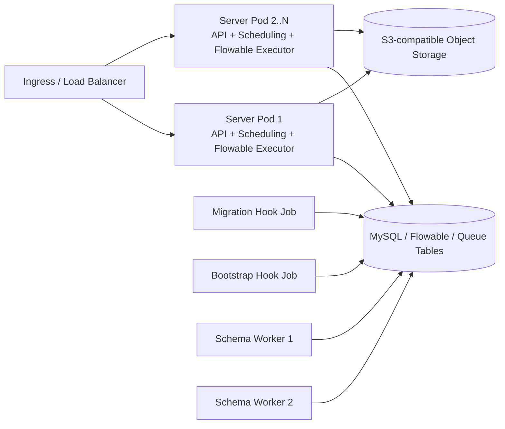

# 后端集群部署设计走查报告

> - 走查日期：2026-08-14
> - 走查对象：当前工作区后端代码、数据库迁移、Docker Compose、Helm Chart、GitHub Actions 与部署文档
> - 代码基准：`main@681b819cc103906b54e39137883adc1fa211b0c7` 加当前未提交工作区
> - 走查方式：两轮静态代码与配置审计；第二轮深入租约/线程池、事务边界、滚动升级及测试覆盖；未连接真实生产集群，未执行破坏性故障注入
> - 结论状态：**当前版本不建议直接按多副本生产集群上线**

## 1. 结论摘要

项目已经具备一部分集群基础：核心数据存储在 MySQL，Flowable 使用数据库作业锁，Outbox、Webhook、流程动作和 Schema 队列大多实现了数据库 claim、租约、owner/token fencing，Helm 也为 Server/Web 配置了滚动升级、HPA、PDB 和健康检查。

当前保留一项条件性集群上线阻断：仓库内默认自动发布链路执行的是单机 `compose.ecs.yml`，而不是文档声称的 Helm 集群拓扑。该 Compose 没有关闭 Server 内的迁移、Bootstrap、调度和直接 DDL 能力，并使用本地文件卷与单机 MySQL，不能直接横向扩容。静态仓库无法证明真实生产一定使用该工作流；若外部平台另有发布链路，需要单独核对。

走查期间，尚未合并的 V043 和 V045 已被修正：V043 的 `data_key` 现保持 nullable 以兼容旧 Pod，V045 counter 现按真实 MAX 持续向上自愈。报告在 6.1/6.2 将它们作为已校准项记录，不再列为当前 P0；相应的 N/N-1 混部测试仍必须进入发布门禁。

关于“任务或调度会不会重复执行”，答案是：

- **调度入口会重复运行。** 项目中 15 个 `@Scheduled` 方法会在每个 Server Pod 各自触发，因为只有全局开关，没有 leader election 或分布式调度锁。
- **正常认领不等于 exactly-once。** Outbox、Webhook、流程动作和 Flowable Job 正常情况下只由一个 Pod 认领，但在“外部副作用已完成、数据库 ACK 尚未提交”时进程退出，任务仍会重放。
- **Task SLA 当前存在实质并发重复窗口。** 它有 120 秒租约却没有 heartbeat，旧执行在租约被另一 Pod 回收后仍可提交转办、加签等业务副作用，而且 ACK 更新失败被忽略。
- **批量队列又存在“先租走、后排 JVM 队列”的容量漏洞。** Outbox、Webhook 和 FlowAction 都在任务真正开始执行后才 heartbeat；默认 Webhook 一次 claim 100 条、4 线程、30 秒租约，尾部任务可在启动前就失租。
- **部分事件还有漏执行或 fail-open 风险。** 自动知会、任务镜像存在明确持久化缺口；人员解析、自动跳过等监听器吞异常后会继续流程，可能产生错误流程语义。
- **有两个名为“提交后”的路径实际没有可恢复的提交边界。** ChangeTarget 会在 Flowable 外层事务提交前用 `REQUIRES_NEW` 先写 `APPLIED`；MutationPipeline 则直接同步调用 `AFTER_COMMIT` step。外层回滚或 step 中途失败时，可以出现业务永久漏执行或外部副作用无法回滚。
- **维护任务多为“重复执行但结果基本幂等”。** 多 Pod 会同时扫描、统计或 DELETE，主要风险是数据库峰值、锁等待和长事务，而不是同一业务动作重复发生。

系统当前应统一定义为 **at-least-once（至少一次）处理模型**。在业务动作收据、稳定幂等键和故障恢复测试完成前，不应对外宣称 exactly-once。

## 2. 目标拓扑与实际发布路径

### 2.1 Helm 目标拓扑



该拓扑中，Server Pod 不是纯 API 节点：每个副本同时运行 Spring Scheduling、Flowable Async Executor、Outbox、Webhook、流程动作和 SLA Worker。副本数从 2 扩展到 6 时，后台轮询、线程池和数据库连接也随之放大。

### 2.2 仓库默认自动发布路径

`.github/workflows/deploy.yml:159-192` 上传并执行 `deploy/compose.ecs.yml`；但 `deploy/scripts/validate-manifests.sh:331-346` 校验的却是 `compose.prod.yml`。因此“CI 验证对象”和“实际部署对象”不是同一个清单。

`compose.ecs.yml` 当前具有以下单机假设：

- 单 MySQL 容器和本地数据卷：`deploy/compose.ecs.yml:3-23`；
- Server 使用同一数据库/Schema 身份：`deploy/compose.ecs.yml:33-53`；
- 文件存储为本地 uploads volume；
- 未激活 `production` profile；
- 未覆盖应用默认的 Flyway、Flowable Schema 自动更新、Bootstrap、Scheduling 和 direct schema publisher：`workflow-server/workflow-app/src/main/resources/application.yml:56-101,227-239`。

结论：单实例运行时不一定发生重复，但**若沿用仓库默认自动发布路径，它本身不具备集群安全性**。集群生产发布必须统一到 Helm 或等价的分组件拓扑，并让 CI 校验实际使用的同一份 values/rendered manifest；若生产由仓库外系统发布，应以其实际清单重新验收。

## 3. 风险分级

分级标准：

- **P0 / 阻断**：在当前发布方式或常规滚动升级中可直接导致故障，不应带风险上线。
- **P1 / 高**：多副本、故障恢复、扩缩容或并发请求下可造成重复副作用、数据错误、永久漏处理或大面积不可用。
- **P2 / 中**：通常不会立即破坏业务正确性，但会降低容量、可运维性和故障恢复能力。
- **P3 / 低**：架构债务或防御性增强。

| ID | 级别 | 主题 | 核心影响 |
|---|---|---|---|
| C-01 | P0 | 默认自动发布仍走单机 Compose | 若沿用该工作流，直接横向扩容会并发迁移/DDL、文件不一致，并保留单点 MySQL |
| T-01 | P1 | Task SLA 租约无 heartbeat | 转办、加签等可在两个 Pod 上重复产生副作用 |
| T-02 | P1 | 外部副作用仅 at-least-once | HTTP、通知、Webhook 在“成功后 ACK 前崩溃”时重放 |
| T-03 | P1 | 提交后持久化缺口与监听器 fail-open | 自动知会/任务镜像可能漏执行；其他监听器可能产生错误流程语义 |
| T-04 | P1 | 批量 claim 后在 JVM 队列无 heartbeat 等待 | 任务未开始就失租，形成回收/重认领抖动、重复窗口和无效 SQL |
| T-05 | P1 | 事务“提交后”边界不成立 | ChangeTarget 可永久漏生效，Mutation step 可漏执行或在回滚后留下副作用 |
| S-01 | P1 | UI 数据源 JVM 缓存键不完整 | 跨操作/跨分页串缓存；多 Pod miss 时 WRITE 可重复调用 |
| S-02 | P1 | 实体 Schema 发布锁过早释放 | 第二个 Pod 可基于旧元数据重复发布，DDL 又无法随事务回滚 |
| S-03 | P1 | 权限草稿/发布缺少统一并发控制 | 丢失更新、旧快照覆盖、新绑定悬空 |
| S-04 | P1 | UI 超时不取消且共享流程作业线程池 | 请求已返回后 WRITE 仍可晚到，慢 Connector 可阻塞 Flowable Job |
| D-01 | P1 | Schema Worker 假健康且不 drain | 滚动更新可中断 DDL并触发租约重放 |
| D-02 | P1 | V043/V045 在线迁移过重 | metadata lock、超时和部分 DDL 生效后重跑失败 |
| D-03 | P1 | Schema 第 5 次认领崩溃会永久卡死 | RUNNING 记录不再可 claim，且 active hash 阻止新请求 |
| D-04 | P1 | Schema 请求与发布事务非原子 | 等待超时/中断后 DDL 仍可生效，元数据却已回滚 |
| D-05 | P1 | V046 收紧幂等唯一键不兼容 N-1 | 预检与 ALTER 间旧 Pod 可再写重复；ALTER 后旧代码可遇到无法识别的唯一键失败 |
| O-01 | P1 | 数据库容量与 HPA/Readiness 正反馈 | 扩容和 rollout 放大连接，池饱和时所有 Pod 可能同步摘流 |
| O-02 | P1 | 新旧消费者混跑 | 旧代码可能消费新 payload/新语义任务，数据库租约无法解决版本兼容 |
| O-03 | P1 | JWT Secret 轮换混钥 | 新旧 Pod 互不认可 Token，表现为随机掉登录 |
| O-04 | P2 | 文件与数据库跨资源非原子 | 崩溃或补偿失败时产生孤儿对象，或数据库显示有效但对象已删除 |
| O-05 | P1 | Open API 租约没有续租 | 长请求可被另一 Pod 接管，幂等与并发配额均可能失效 |
| O-06 | P1 | runtime/schema 网络边界未真正拆分 | Server 与高权限 Schema 组件仍共享 DB endpoint，策略与文档不符 |
| O-07 | P1 | Webhook 全量排序与租约恢复惊群 | 积压/断库恢复时，副本越多反而放大全局查询、热点行竞争和失租 |
| M-01 | P2 | 维护调度无集群互斥 | 重复扫描、无界 DELETE、长事务和数据库尖峰 |
| M-02 | P2 | 集群观测默认关闭且指标不全 | 租约恢复、fencing 拒绝、Schema 队列假健康难以及时发现 |
| M-03 | P2 | 时区与停机窗口不统一 | 租约/清理/审计时间偏移，在途任务来不及优雅结束 |
| M-04 | P2 | 本地字典缓存与 ASSIGN_ID 节点派生 | 潜在副本不一致和 Snowflake 节点冲突风险 |

## 4. 调度与任务重复执行专项

### 4.1 为什么 15 个定时入口都会在每个 Pod 运行

`SchedulingConfiguration.java:10-16` 只根据 `workflow.scheduling.enabled` 开启 Spring Scheduling；Helm 的每个 Server Pod 都把该开关设为 `true`，同时开启 Flowable Async Executor：`deploy/helm/flow/templates/server-deployment.yaml:62-73`。项目中没有发现 ShedLock、leader election、独立 scheduler Deployment 或全局调度锁。

因此，N 个 Server Pod 会产生 N 份定时触发。是否造成业务重复，要看每个任务内部是否使用数据库原子 claim、唯一键、租约和幂等业务收据。

### 4.2 15 个 `@Scheduled` 入口清单

| # | 调度入口 | 集群行为 | 当前保护 | 判断 |
|---|---|---|---|---|
| 1 | `SystemAuditRetentionService`，每日 03:30 | 每 Pod 同时清理 | 时间条件 DELETE | 结果幂等；无界删除可能造成长事务/锁等待 |
| 2 | `AuthSessionService`，每日 04:15 | 每 Pod 同时清理 | 删除过期/撤销会话 | 结果幂等；重复负载 |
| 3 | `LoginThrottleService`，每日 03:45 | 每 Pod 同时清理 | 时间条件 DELETE | 结果幂等；重复负载 |
| 4 | `AsyncQueueMetrics`，周期刷新 | 每 Pod 查询同一全局队列 | 只读 | 不重复业务动作；增加查询 |
| 5 | `OutboxRetentionService`，每日 03:15 | 每 Pod 同时清理 | 仅删已处理记录 | 无 LIMIT 的重复 DELETE，可能形成 IO 峰值 |
| 6 | `OutboxWorker`，每 3 秒 | 每 Pod 轮询并消费 | 原子 claim、owner/token、租约、heartbeat、fenced ACK | 正常互斥；外部成功后 ACK 前崩溃会重放 |
| 7 | `OpenIdempotencyService`，每日 03:35 | 每 Pod 循环清理 | 每批 1000 | 外层事务可能很长；重复扫描 |
| 8 | `IntegrationRateLimitService`，每日 03:20 | 每 Pod 同时清理 | 过期桶 DELETE | 结果幂等；重复负载 |
| 9 | `OpenApiConcurrencyLeaseService`，每 10 分钟 | 每 Pod 同时清理 | 每批 1000 | 清理基本安全；业务租约本身没有 heartbeat |
| 10 | `WebhookRetentionService`，每日 03:37 | 每 Pod 同时清理 | 单动作最多 500 条 | 容量随副本变化，积压时可能长期追不上 |
| 11 | `WebhookBacklogMetrics`，周期刷新 | 每 Pod 查询同一全局队列 | 只读 | 不重复业务动作；指标必须按 `max` 聚合而非 `sum` |
| 12 | `WebhookDeliveryWorker`，每 1 秒 | 每 Pod 轮询并投递 | 条件 claim、token、租约、heartbeat、fenced ACK | HTTP 明确是 at-least-once；接收方须按稳定事件 ID 去重 |
| 13 | `FlowActionExecutionWorker`，每 5 秒 | 每 Pod 轮询并执行 | claim、token、租约、heartbeat、fenced ACK | 单行正常互斥；逻辑事件 key 随机，重分发可绕过去重 |
| 14 | `TaskSlaEventWorker`，每 5 秒 | 每 Pod 轮询并执行 | claim、token、120 秒租约；**无 heartbeat** | **存在实质重复业务动作窗口** |
| 15 | `ProcessStatusReconciliationWorker`，每分钟 | 每 Pod 扫描相同流程 | 补发 Outbox 使用稳定 key/唯一约束 | 业务重复可消除；仍有重复扫描和日志噪声 |

注：Flowable 全局事件监听器虽然在每个 Pod 注册，但一次引擎命令只会在实际执行该命令的 Pod 上触发，不会仅因为有 N 个 Pod 就天然回调 N 次。Flowable Job/Timer 正常认领也由引擎数据库锁协调；锁过期、事务回滚和外部副作用仍按 at-least-once 处理。

### 4.3 T-01：Task SLA 可在租约过期后重复执行业务动作

证据链：

1. `TaskSlaEventWorker.java:31-55` 在每个 Pod 上先恢复过期租约、claim，再同步调用 Processor；默认租约 120 秒，整个过程没有 heartbeat。
2. `ProcessTaskSlaEventMapper.java:107-128` 可将过期 RUNNING 记录恢复，另一个 Pod 随后重新 claim 并增加 `lease_token`。
3. `markSuccess/markFailure` 虽校验 owner/token，但成功 SQL没有要求 `lease_until > NOW()`；`TaskSlaEventProcessor.java:86-92,393-397` 又完全忽略更新行数。
4. 新 Pod 接管后，旧执行 ACK 会更新 0 行，但旧事务不会因此回滚。转办、加签等副作用仍可能提交。
5. `process_task_sla_event.idempotency_key` 唯一约束只防止事件被重复创建，不能证明该事件只执行一次。通知有部分去重，TRANSFER、ADD_SIGN 没有按 SLA event key 建独立业务收据。
6. `TaskSlaEventProcessor.process()` 在 `REQUIRES_NEW` 事务内捕获所有异常、写 FAILED/DEAD 后正常返回。若下层异常没有把事务标为 rollback-only，异常前已完成的数据库变更仍可能提交，事件随后又会重试，形成“部分提交 + 重放”。

必须同时处理：

- 增加 heartbeat，失去租约后停止发起后续可停止动作；
- `markSuccess/markFailure` 强制检查 `updated == 1`，fencing 失败使动作事务回滚；
- 业务异常回滚动作事务，再用独立事务记录 FAILED；
- TRANSFER、ADD_SIGN 以 SLA event idempotency key 建唯一执行收据；
- 对 `lease_recovered`、`fencing_rejected`、处理耗时超过租约建立告警和故障测试。

### 4.4 T-02：队列认领安全不等于外部副作用只发生一次

通用失败窗口如下：

```text
Pod A claim -> 调用外部系统成功 -> Pod A 在数据库 ACK 前退出
                                      |
                                      v
租约到期 -> Pod B reclaim -> 再次调用外部系统
```

具体问题：

- **Outbox**：`OutboxRecordMapper` 和 `OutboxProcessor` 的 claim、heartbeat、fencing 较完整，但 Handler 契约本身要求按 `eventKey` 业务幂等。知会渠道可以用稳定的 `record.id + channel` 推导当前 eventKey，但 `ProcessCcNotificationOutboxHandler` 没有把 Outbox ID/eventKey 显式传给 `CcNotificationChannel`，接口也没有强制渠道实现幂等，未来邮件/IM/SMS 实现很容易遗漏该要求。
- **Webhook**：HTTP 请求携带稳定 `Flow-Webhook-Id = eventId`，这是正确设计；但 `WebhookDeliveryExecutionConfiguration` 停机时不等待执行线程或 heartbeat，滚动升级会放大重复投递概率。接收方必须持久化去重该 ID。
- **流程动作**：`FlowActionEventDispatcher.java:76-86` 每次分发使用随机 UUID 作为幂等键。同一逻辑 Flowable 事件被重试或重新分发时会生成新 key，唯一约束无法识别重复。
- **事务内流程动作**：外部系统调用若发生在 Flowable 事务中，外部成功后本地事务回滚，审计记录/key 也可能回滚；下一次引擎重试会再次调用。应禁止不可回滚的外部副作用使用 `IN_TRANSACTION` 模式。
- **REST Service Task**：`RestServiceTaskDelegate` 发送的 `Idempotency-Key` 由 `processInstanceId:activityId` 构成。它能覆盖同一次重试，却对循环、多实例或重复进入同一节点过粗，会把合法的不同调用错误合并；如果下游忽略 key，Flowable 重试又会重复外部动作。

建议定义统一的“逻辑动作身份”：

```text
processInstanceId + executionId/taskId + elementId + triggerTiming + occurrence/revision
```

该 key 必须稳定穿透队列表、日志、HTTP Header 和下游业务收据；相同逻辑动作重试使用同一 key，循环/多实例的合法新动作使用不同 key。

### 4.5 T-03：提交后持久化缺口与 fail-open 监听器

- **明确的持久化缺口**：`ProcessCcEventListener.java:174-187` 在 Flowable 事务 `COMMITTED` 后才写知会记录和 Outbox；回调异常被捕获，且 `isFailOnException=false`。Pod 在主事务提交后、知会持久化前退出，会永久漏通知。
- 自动知会 key 为 `AUTO:processInstanceId:nodeId:timing:userId`，缺少 taskId/executionId；循环流程再次进入同一节点时，后一次合法通知会被当成重复。
- **明确的镜像缺口**：`TaskCreateListener.java:34-54` 创建本地任务镜像失败后只记录日志。Flowable 任务可成功提交，而本地 `process_task` 永久缺失，项目中没有发现持续对账任务。
- **fail-open 语义偏差**：`PersonResolverTaskAssignmentListener`、`WorkflowAutoSkipService`、`MultiInstanceCollectionListener` 均存在吞异常并继续流程的路径。它们不一定“漏掉一个持久事件”，但可能留下未正确分配、未自动跳过或集合准备错误的流程状态，且没有补偿闭环。

这些问题不能仅靠多副本恢复。应在主事务内持久化“待处理意图”，再由可重试消费者执行；或至少增加 Flowable runtime/history 与本地镜像/知会的周期对账。

### 4.6 T-04：批量 claim 把数据库队列提前搬进无 heartbeat 的 JVM 队列

Outbox、Webhook 和 FlowAction 都先在数据库一次认领一批记录，再逐条提交到本地 executor；heartbeat 要到 Processor 真正获得线程后才开始。当前默认容量是：

| 队列 | 单 Pod 批次 | 执行线程 / JVM 队列 | 租约 | 尾部启动风险 |
|---|---:|---:|---:|---|
| Outbox | 100 | 4 / 200 | 120s，HB=40s | 要让单批尾部首次 HB 早于到期，平均单件需 <3.3s；handler 无硬上限 |
| Webhook | 100 | 4 / 200 | 30s，HB=10s | 单批全安全要求平均 <0.83s；HTTP 单次最长 10s 时，尾部约 240s 后才启动 |
| FlowAction | 50 | 4 / 100 | 300s，HB=100s | 单批全安全要求平均 <16.7s；handler 无硬上限 |

证据分别位于 `OutboxWorker.java:49-84`、`WebhookDeliveryWorker.java:46-89`、`FlowActionExecutionWorker.java:56-83` 及各自 Processor 的 heartbeat 注册处。旧 runnable 开始时会再检查 owner/token/租约，因此正常 fencing 能阻止大部分过期任务直接执行；但连续积压时会形成“认领—失租—回收—再认领”的租约抖动、大量空跑和 SQL 竞争，并放大已开始外部副作用的 at-least-once 窗口。

应将 claim 数量限制为 executor 当前可用槽位，更稳妥的做法是只小量 prefetch，让数据库队列保留真正背压。若必须预取，则从 claim 时就续租，并保证“最大排队时间 < 2/3 租约”。监控必须增加 executor active/queue/rejection、queued-claim age 和 heartbeat lag；当前 `oldest_ready` 在任务被提前改成 RUNNING 后会反而显得健康。

### 4.7 T-05：`APPLIED` 和 `AFTER_COMMIT` 没有真实的可恢复提交边界

**ChangeTarget 永久漏生效时序：**

```text
Flowable 外层事务
  -> Entity mutation + receipt（REQUIRED，尚未提交）
  -> ChangeTarget status = APPLIED（REQUIRES_NEW，先独立提交）
  -> status Outbox / Flowable flush / commit 失败
  -> mutation + receipt 回滚，APPLIED 保留
  -> 重试因 APPLIED 被过滤，目标变更永久遗漏
```

`ProcessEndListener.java:100-127` 明确先同步 apply 再发布状态 Outbox；`EntityMutationTransactionExecutor.java:47-59` 使用默认 REQUIRED；`EntityChangeTargetService.java:198-207` 调用的状态服务却在 `EntityChangeTargetInstanceStatusService.java:20-30` 使用 `REQUIRES_NEW`。成功状态必须与实体变更同事务；更稳妥的模式是 Flowable 事务只写 apply-intent Outbox，由 Worker 原子执行变更与终态。

**MutationPipeline 的“AFTER_COMMIT”实际是普通同步调用：** `EntityMutationPipeline.java:31-45,49-103` 在事务执行器返回后直接运行 step，并对 `replayed` 结果全部跳过。它会产生三种故障：

- 有外层事务时，step 在真正 commit 前就产生不可回滚副作用；
- 变更和 receipt 已提交后，多个 step 中途失败，重试因 `replayed` 跳过，剩余 step 永久丢失；
- `atomic=false` 批次的前几项可已分别提交，后项抛错后整个 `afterCommit()` 不会运行，重试又会跳过前项。

另外，PREPARE step 在 receipt acquire 之前运行；若 Managed Interface 的 PREPARE 调用可产生远端写副作用，已成功的本地幂等 receipt 也阻止不了它再次调用。根本修复是在 mutation 事务内为每个 `(mutationReceiptId, stepId)` 写持久 Outbox/step receipt，由可幂等消费者逐步落状态；仅换成 `TransactionSynchronization.afterCommit` 无法解决 JVM 崩溃和中途失败。

## 5. 副本状态、缓存与并发一致性

### 5.1 S-01：UI 数据源缓存可能串操作、串分页和重复 WRITE

`UiDataSourceService.java:126-127` 使用进程内 `ConcurrentHashMap`；命中只检查 TTL，`get/put` 之外没有最大容量、过期淘汰或主动清理。

当前缓存键 `UiDataSourceService.java:928-952` 缺少：

- `operationCode` / `operationKind`；
- 操作级配置哈希；
- `bindingPath`、`targetType`、`targetKey`；
- `pageNum`、`pageSize`。

但 `resolveOperationDefinition` 会按 operation 合并配置、Schema 和 READ/WRITE 类型，分页也会实际进入调用上下文。结果是同一服务的不同操作、不同页可能命中同一 key。该服务又允许 WRITE 操作配置缓存，多 Pod 同时 miss 时会并发调用外部 Provider/Connector，造成重复写副作用。

此外，Connector 幂等键 `UiDataSourceService.java:977-995` 同样缺少 operation/target/page 等逻辑身份，可能把两个不同写操作错误视为相同请求。高基数用户、输入和上下文的过期项永久驻留，还会导致每个副本堆内存持续增长。

整改：只允许 READ 启用结果缓存；补齐完整操作与授权作用域；使用有 `maximumSize` 和 `expireAfterWrite` 的有界缓存；按需引入 Redis/版本化共享缓存；相同 key 使用 single-flight；WRITE 使用持久化业务幂等记录。

### 5.2 S-02：实体 Schema 发布锁在 Spring 事务提交前释放

`EntityDefinitionService.java:567` 的发布方法带 `@Transactional`，但在 `573-581` 的 `finally` 中调用 `EntitySchemaPublishLock.release()`。Spring 事务实际在方法正常返回后才提交，所以 named lock 会先释放、业务事务后提交。

同时：

- DDL 通过 `DriverManagerDataSource` 独立连接执行，不属于业务事务；
- 发布历史版本使用 `MAX(version)+1` 计算；
- 第二个 Pod 获得 named lock 后，可能仍读到第一个事务提交前的旧元数据；
- 即使最终唯一约束让第二个事务失败，其独立连接上的 DDL 也已可能生效，不能随事务回滚。

整改：所有入口先锁同一实体根记录 `SELECT ... FOR UPDATE`，让锁自然持有到提交；或用外层非事务方法持有专用 named-lock 连接，在内部 `TransactionTemplate` 提交完成后再释放。DDL 发布应建可恢复状态机并配对账：`PENDING -> APPLYING -> APPLIED -> METADATA_COMMITTED`。

锁释放到事务提交之间通常是窄窗口，但并发请求可以命中，而且 DDL 不可随业务事务回滚。应先增加可重复的双 Pod 并发发布测试；若生产入口已有更上层的可靠串行化，可据实下调该项优先级。

### 5.3 S-03：权限草稿保存、绑定、删除和发布没有统一并发协议

`EntityListScopeService` 的保存路径在内存中递增 version 后使用无 version 条件的 `updateById`；绑定更新也没有 revision/行锁。发布虽锁实体，保存路径却没有使用同一把锁。删除则先统计绑定数量再逻辑删除，而绑定表没有外键。

多 Pod 并发可导致：

- 两个编辑者都从版本 N 写到 N+1，后提交者静默覆盖；
- 发布读取旧对象，生成旧快照或覆盖新草稿；
- 删除判断“无引用”后，另一 Pod 新增绑定，最终留下活动悬空绑定。

整改：统一使用 `UPDATE ... WHERE id=? AND version=?` 并检查影响行数；保存、删除、发布先锁同一聚合根；绑定增加 revision；可行时增加数据库外键或原子条件删除。

### 5.4 其他共享状态结论

- 登录 refresh session、登录限流、Open API 分钟限流均使用共享数据库与原子 SQL，不依赖粘性会话，方向正确。
- 未发现业务依赖 `HttpSession`、WebSocket/SSE 本地连接状态或 Spring Cache；主要可变 JVM 缓存是 UI 数据源缓存与字典缓存。
- `DictCacheService` 是每 Pod 独立的两个 Map，只有启动/手工 reload，无 TTL 或跨副本失效；部分写路径不 reload，事务回滚时内存更新也不会回滚。当前未发现关键业务读链路实际调用，属于潜伏风险。
- MyBatis-Plus 大量实体显式使用 `ASSIGN_ID`，但没有显式协调 Snowflake datacenter/worker。这是需要核对节点派生策略的概率性风险，不等于已证明必然冲突；本次新版本/ChangeTarget 相关实体本身使用 UUID。建议显式配置并校验 worker/datacenter，或改用 UUIDv7/ULID。
- COMPOSITION 关系发布时没有图环检查，运行时只在发现循环后跳过。A→B 与 B→A 存在时，两个 Pod 分别修改 A/B 可按相反顺序锁父根和自身，造成 InnoDB 死锁与重试风暴。应在发布时拒绝组合环，或把所有父根与目标记录合并后按全局键排序一次加锁。

### 5.5 S-04：UI 超时只停止等待，不停止真正执行

`UiDataSourceService.java:545-583` 通过 `CompletableFuture.supplyAsync(...).get(timeoutMs)` 实现上层默认 3 秒超时，但没有保留 Future，超时后也没有 `cancel(true)`。因此应用已经向用户返回 fallback/错误后，Provider、Connector 甚至 WRITE 仍可在后台继续；用户重试时，第一次请求可晚到成功，形成重复或“幽灵成功”。Connector 的稳定幂等键只能在下游确实持久去重时缓解该问题，对一般 Provider 不成立。

该服务明确注入 `applicationTaskExecutor`：`UiDataSourceService.java:159`。当前依赖的 Flowable 7.2 自动配置也把这个 executor 包装成 Process Async Job 的 task executor；而应用默认只有 core=4、max=16、queue=100，Helm 只覆盖 max。大量已对用户超时却仍占用线程的 Connector 可填满该池，并连带阻塞 Flowable timer/job。

整改要求：UI Provider/Connector 与 Flowable 分独立 bulkhead；超时后取消 Future，底层 HTTP/SQL 超时必须更短并响应中断；WRITE 按稳定逻辑动作键建持久收据；对 executor active/queue/rejection 告警。

### 5.6 ChangeTarget 还缺少 claim/CAS 和真实的行版本令牌

`EntityChangeTargetInstanceMapper.java:19-30` 用普通 SELECT 读取所有目标，`50-58` 又无条件覆盖状态。两个 Pod 可同时读到 FROZEN/FAILED 后执行：调用方使用不同幂等键时可双重生效，使用相同键时 loser 也可用 `REQUIRES_NEW` 覆盖 winner 的状态。应用条件更新抢占 `APPLYING(owner, token)`，终态必须按 token fencing，并为每个 target 生成与调用方无关的稳定 apply-operation key。

冻结时保存的 `baselineVersionNo` 也不是数据行 revision：它只有在版本策略命中时才增加。冻结后另一 Pod 若做了未命中版本策略的编辑，`MAX(entity_record_version.version_no)` 不变，apply 仍会通过并覆盖新值。动态实体行应增加单调 revision 并执行 `UPDATE ... WHERE revision=?`，或冻结规范化 data hash、加锁后重算并比较。

## 6. 数据库、DDL 与滚动升级

### 6.1 校准项：V043 已采用兼容旧 Pod 的 expand 迁移

Helm 的 migration 是 `pre-upgrade` hook；迁移执行时旧 Pod 仍继续服务：`deploy/helm/flow/templates/migration-job.yaml:8-15`、`deploy/runbooks/deployment.md:17-23`。因此迁移必须允许 N/N-1 同时写入。

当前未合并的 `V043__decouple_entity_relations.sql` 已按这一原则修正：`4-7` 行新增的 `data_key` 保持 `DEFAULT NULL`，`9-12` 行只回填已有数据，`23-24` 行明确说明本发布不收紧非空约束。新运行时又在 `EntityRelationRuntimeService.java:504-515` 按 `data_key → parent_field_code → relation_code` 回退。旧 Pod 不写 `data_key` 时 INSERT 仍能成功，因此走查早期发现的“迁移后旧 Pod 立即写失败”P0 已不适用于当前工作区。

剩余风险转为在线建约束竞态：`BusinessMigrationPreflight.java:22-50` 会在 Flyway 迁移前检查重复关系编码和有效数据键，但预检与 `V043:14-17` 创建唯一索引之间没有阻止旧 Pod 继续写入。旧 Pod 若在该窗口新增冲突行，ALTER 仍会失败；而前面的加列和回填可能已经生效。该风险并入 D-02，发布前应：

1. 保留当前 nullable expand 和运行时回退，所有新代码持续写 `data_key`；
2. 用真实 MySQL 执行“迁移同时旧 Pod 持续建关系”的 N/N-1 测试，并准备部分 DDL 成功后的恢复手册；
3. 仅在旧 Pod 全部退出、空值为零且重复检查通过后的后续独立迁移中收紧 `NOT NULL`，不得回改已合并迁移。

### 6.2 校准项：V045 counter 已有运行时自愈，但必须保留 N/N-1 回归

`V045__entity_version_scope_snapshot_v2.sql:74-86` 创建 `entity_record_version_counter`，并在迁移时按真实 `MAX(version_no)` 回填。N-1 代码仍使用 `MAX+1` 且不写 counter，因此混部时确实需要新代码持续校准，不能只依赖迁移时的一次回填。

当前工作区已对这个问题做了有效修正：`EntityRecordVersionService.java:530-539` 每次分配前先读真实 MAX；`EntityRecordVersionCounterMapper.java:14-28` 使用 `ON DUPLICATE KEY UPDATE last_version_no = GREATEST(last_version_no, VALUES(last_version_no))`，已存在的 counter 会向上自愈，随后再 `FOR UPDATE` 锁定并递增。所以早先“counter 永久陈旧、每次重试都持续失败”的判断已不适用当前代码，不再列为阻断项。

仍需保留混部回归：证明所有生产版本创建入口都持有与 N-1 共用的实体行/根锁，并测试“迁移回填 → 旧 Pod 写 Vn+1 → 新 Pod 写 Vn+2”。该测试是防止未来回归的发布门禁，不是当前已证实的 P0。

### 6.3 D-02：当前重迁移不适合与旧 Pod 持续流量并行

`V043` 包含多次 ALTER、回填和唯一索引；`V045__entity_version_scope_snapshot_v2.sql:1-34` 包含多次 ALTER 和全表 UPDATE，`82-86` 又进行 GROUP BY 回填。Migration Job deadline 固定 900 秒。

在大表或有长事务的生产库中，这些操作可能等待 metadata lock、超过 hook deadline，或在 MySQL 已完成部分 DDL 后失败。重跑时又可能遇到列/索引已存在。发布前至少应：

- 对表规模、历史重复/空值、metadata lock 和预估时长做预检；
- 拆分 expand、分批/后台回填、索引创建、约束收紧；
- 避免把全量回填和最终约束同时放在单个 pre-upgrade 窗口；
- 在 N-1 版本持续写入条件下执行迁移兼容测试；
- 明确部分成功后的恢复手册，不能用 `flyway repair` 掩盖迁移变化。

### 6.4 D-01：Schema Worker 的数据库认领较完整，但运维生命周期不完整

已有保护：

- `FOR UPDATE SKIP LOCKED` claim；
- 默认 120 秒租约、30 秒 heartbeat；
- owner/token fenced ACK；
- 活动 DDL 哈希唯一去重；
- 部分“对象已存在/不存在”错误被识别为幂等重放。

剩余风险：

- Deployment 没有 startup/readiness/liveness probe、PDB 或强制跨节点约束；
- 所有 SQLException 只打印并每 500ms 永久重试，Kubernetes 仍显示 Ready/Available；
- shutdown hook 只设置 `running=false` 后立即返回，不等待正在执行的 DDL；
- heartbeat 丢失不能取消正在运行的 MySQL DDL，另一个 Worker 可能租约到期后重放；
- 空闲 Worker 每 500ms 通过 `DriverManager` 建立一次新连接，默认两副本约 4 次连接握手/秒；
- 错误码启发式不能证明目标 Schema 已达到预期状态。

整改：增加数据库就绪/worker heartbeat/队列水位指标；先停止认领再有界等待当前 DDL；配置 PDB、拓扑约束、小连接池和指数退避；重放后按 information_schema 验证目标状态，而不是仅按错误码标记成功。

### 6.5 D-03：第 5 次认领后崩溃会把 Schema 请求永久卡死

`SchemaChangeWorker.java:80-89` 只认领 `attempt < 5` 的 PENDING/RUNNING 记录，`99-127` 在 claim 时就把 attempt 加一并改为 RUNNING。只有进程内抛异常的 `failOrRetry()` 才会在达到上限时转 FAILED 并清理 `active_hash`。

因此，attempt=4 的请求第 5 次被认领后，若 Pod 被 kill 或节点掉线，它会留下 `RUNNING + attempt=5`。租约过期也无法再被查询选中，`V012__schema_change_active_deduplication.sql:3,6-11` 建立的唯一 active hash 却继续被占用；`QueuedSchemaDdlExecutor.java:126-139` 会一直找到该记录，每次等待都只能超时，相同 DDL 也无法新建。

恢复逻辑必须能处理“RUNNING 已过期且达到上限”，在短事务内原子转 FAILED 并清 active hash。更好地将 claim generation 与真正 execution attempt 分开计数。必须增加“连续 5 次在 claim 后 kill”的真实 MySQL 故障测试。

### 6.6 D-04：动态发布与 DDL 队列非原子，且同步等待占用业务连接

实体发布方法在一个外层事务中持有 Hikari 连接、实体/named lock，顺序提交多个 DDL并轮询 Schema 队列；`QueuedSchemaDdlExecutor` 又用直接物理连接每 500ms 查询状态。并发发布不同实体时，HTTP 线程、业务连接和额外直连会一起增长，并与 `/healthz` 争抢资源。

`QueuedSchemaDdlExecutor.java:59-89` 通过独立 `DriverManagerDataSource` 先插入 Schema 请求，`92-149` 最多等待 120 秒。超时或线程中断只会让外层实体发布事务回滚，不会取消已入队或已开始的 DDL。该 DDL 后续仍可 APPLIED，形成“真实 Schema 已改、元数据已回滚”的幽灵发布；再次发布又可因 APPLIED 记录不在 active hash 查询范围内而新建相同 DDL。

建议把发布改成异步 saga/status API：请求只持久化发布意图，Worker 执行 DDL，最终原子推进元数据状态；客户端轮询或订阅发布状态，不在 HTTP 事务内同步等待多个 DDL。

`DynamicTableService` 对 MODIFY COLUMN 异常存在记录后继续的路径，可能让元数据被标记为发布成功而真实表结构未完成；必须把目标 Schema 验证作为发布成功条件。

### 6.7 D-05：V046 全局幂等唯一键需要跨发布切换

走查收口期间工作区新增了未跟踪的 `V046__record_version_global_idempotency.sql`。它在 `5-8` 行将唯一键从 `(entity_code, record_id, scenario_code, idempotency_key)` 收紧为 `(entity_code, record_id, idempotency_key)`。历史重复预检已移到 Flyway 运行前的 `BusinessMigrationPreflight.java:52-66`。

N-1 代码仍按 `scenario_code + idempotency_key` 查找：它认为同一 key 在不同 scenario 下是不同记录，遇到 DuplicateKey 后也只回查当前 scenario。因此：

- 预检通过后到 ALTER 加新索引前，仍在服务的旧 Pod 可再插入跨 scenario 重复，使 ALTER 失败；
- ALTER 成功后，旧 Pod 遇到已被其他 scenario 占用的 key 时会插入失败，且回查不到可重放记录，最终向上抛出数据库冲突。

这项语义收紧应跨两个发布：第一版在旧索引上先部署“全局查找 + 同记录串行 + 幂等冲突显式处理”的兼容代码；旧 Pod 全部退出后再处理历史重复、创建新唯一键。不应在 migration-first 的同一次滚动中同时改代码和约束。

## 7. 部署、容量与可运维性

### 7.1 O-01：数据库连接容量漏算 rollout 峰值，Readiness 可能放大故障

默认配置：HPA 最大 6 个 Server、`maxSurge=1`、每 Pod Hikari `maximumPoolSize=20`。滚动升级时至少可能同时存在 7 个 Server，即 140 个池上限；终止中的旧 Pod 还可能暂时持有连接。此外还要加上 migration、bootstrap、Schema Worker、直接 `DriverManager` 连接和运维连接。

当前 `deploy/README.md:115-121` 只按 `maxReplicas * pool` 计算，低估实际峰值。HPA 又只看 CPU/内存，数据库饱和时可能继续扩容并增加连接与后台消费者。

`HealthController.java:31-65` 的 `/healthz` 从业务 Hikari 池取连接并执行 `isValid(2)` 与 Bootstrap SQL；池 acquisition timeout 与 K8s readiness timeout 都是 3 秒。池饱和时所有 Pod 的探针可能同步超时、同时被摘流，形成正反馈。

容量门槛应按以下公式：

```text
(HPA max + maxSurge + terminating overlap) * poolPerServer
+ schema workers + migration/bootstrap + direct DDL connections + ops reserve
```

同时应给数据库连接/队列水位设置 HPA 护栏；Readiness 使用专用或保留连接的轻量检查，给 SQL 明确 query timeout，并区分“数据库断连”和“业务池饱和”。

### 7.2 O-02：滚动升级中新旧消费者共享同一批任务

Server rollout 使用 `maxUnavailable=0/maxSurge=1`，所以 N 和 N-1 版本会并存。两边同时启用 Spring Scheduling 与 Flowable Async Executor，共享相同队列表和 Flowable 作业表。

数据库租约只保证“同一时刻谁拿到行”，不能解决：

- 旧代码消费新格式 payload；
- 新旧 JavaDelegate 对同一 Flowable Job 语义不同；
- 新版本外部副作用协议与旧版本不兼容；
- 新数据库结构不再支持旧代码读写。

发布门禁必须包含队列 payload、Flowable delegate 和数据库的 N/N-1 双向兼容测试。若无法保证，应把 worker 从 API Deployment 拆出，支持停止 claim、drain、版本化队列和独立升级顺序。

### 7.3 O-03：JWT Secret 两阶段轮换缺失

JWT Secret 以环境变量注入；Secret 内容变化不会更新旧 Pod，也没有 checksum/reloader 自动触发。HPA 扩容或滚动发布后，新 Pod 读取新值、旧 Pod 仍保留旧值，两批 Pod 会随机拒绝对方签发的 Token。

应在 Token 中加入 `kid`，签名使用 current key，验证同时接受 current/previous key，按“发布双验 -> 切换签发 -> 等旧 Token 过期 -> 移除旧钥”两阶段轮换。若暂不支持双钥，只能维护窗口一次性切换所有 Pod，不能在正常滚动过程中直接替换 Secret。

### 7.4 O-04：文件对象与数据库元数据不是原子资源

生产 profile 已强制使用 S3，这是正确方向。`FileController` 上传时先写对象、后登记数据库；登记失败时已有主动删除对象的进程内补偿。残余窗口是 Pod 在两步之间退出，或补偿删除本身失败。删除路径则先删对象、后标记数据库；进程在两步之间退出会出现数据库仍显示有效而对象已不存在。

建议数据库先写 `UPLOADING/DELETING`，通过 Outbox 完成对象操作；object not found 视为幂等删除成功；增加超时状态与 S3 对账/生命周期策略。

若误用默认 local storage，多副本下上传落到 A、读取落到 B 会直接 404。集群清单必须强制 `production` profile 和 `FILE_STORAGE_TYPE=s3`，或明确使用 ReadWriteMany 共享卷；粘性会话不是解决方案。

### 7.5 O-05：Open API 幂等与并发租约均无续租

- 幂等请求 `PROCESSING` 固定 120 秒后可被另一 Pod 接管；处理过程没有 heartbeat。
- 并发配额租约固定 60 秒；HTTP 请求超过 60 秒仍在执行时，另一 Pod 可以清理租约并接纳新请求。

长时间同步 Delegate、Connector 或数据库阻塞会触发接管。旧事务最终可能因 fencing 失败回滚数据库变更，但已经产生的 HTTP/通知无法回滚。

整改：处理期间续租；强制请求超时小于租约；失去租约后取消后续处理；把 fencing token 和稳定 idempotency key 传入所有外部副作用。

### 7.6 O-06：数据库网络边界与文档不一致

部署文档声称 runtime/schema 是独立网络边界，但 Helm 只有一个 `database.url`；Server、Migration、Bootstrap、Schema Worker 都连接同一 endpoint。NetworkPolicy 也把这些组件一起放行到同一 CIDR 与硬编码 3306 端口。

当前实际上只依赖数据库账号权限隔离。应拆分 `runtimeUrl/schemaUrl`、两组 CIDR/端口与组件级 NetworkPolicy，并从 URL或 values 显式解析端口。首次 Helm 安装时 migration/bootstrap 是 pre-install hook，而普通 NetworkPolicy 尚未创建；namespace 策略应成为平台前置资源或更早的受控 hook。

### 7.7 O-07：积压和故障恢复时存在多副本数据库放大器

**Webhook 全局窗口排序：** `WebhookDeliveryMapper.java:45-79` 先对所有 eligible delivery 按 `application_id` 计算 `ROW_NUMBER()`，最外层才 LIMIT；当前索引 `V015__webhook_delivery.sql:160-165` 只覆盖 `(status,next_attempt_at,lease_until)`，不覆盖 partition/order。每个 Pod 每秒调用一次，百万级 backlog 下会放大为 N 份全量扫描/排序；数据库越慢，租约又越容易过期。应先用可走索引的有界候选 LIMIT，再在候选内公平排序，并以百万级积压的 `EXPLAIN ANALYZE` 作为发布门禁。

**过期租约恢复惊群：** Outbox、FlowAction、Webhook 和 TaskSLA 的 recovery 都是先无锁 SELECT oldest 100，再逐主键 UPDATE。所有 Pod 同周期会读到同一批热点行；6 个 Pod 在大面积失租后可对前 100 行发起约 600 次竞争更新，后续记录反而延迟恢复。恢复也应使用短事务 `FOR UPDATE SKIP LOCKED`，或把 expired PROCESSING 统一纳入原子 claim，同时增加 jitter/哈希分区和每轮 SQL 预算。

**心跳与调度线程狭窄：** Outbox/FlowAction heartbeat scheduler 各只有 1 线程，Webhook 只有 2；UPDATE 没有 SQL statement/query timeout。一次锁等待或数据库卡顿可阻塞该 Pod 同池所有心跳，业务线程却不会因失租自动停止副作用。全局 Spring scheduler 也只有 4 线程，15 个 `@Scheduled` 共用；TaskSLA 在 scheduler 线程内同步处理最多 50 条，部分 cleanup 在一个外层事务内循环删到空。调度器应只做有界 dispatch，心跳增加 lag/SQL timeout/cancellation token，maintenance 应拆独立 role 并设置时间预算。

**停机顺序不可证明：** Server 只有 40 秒 grace，preStop 先 sleep 5 秒，留给 Spring 的时间约 35 秒，与 30 秒 shutdown phase 只差 5 秒。executor 与 heartbeat scheduler 是独立 bean，没有显式“停 claim → 保持 heartbeat 并 drain active → 停 heartbeat”顺序，而 JVM 预取队列可达 100/200。应用统一 `SmartLifecycle` 编排停机，只 drain 少量 active 任务，不应试图在 grace 内清空大量 prefetch。

## 8. 已有的集群友好控制

以下设计应保留并补齐验证，不需要推倒重来：

- Flowable 原生 Job/Timer 使用共享数据库作业锁，正常情况下不会因 Pod 数量直接执行 N 次；
- Outbox、Webhook、FlowAction 使用数据库 claim、owner/token、租约、heartbeat 和 fenced ACK；
- Webhook 使用稳定 `Flow-Webhook-Id`，可供接收方持久化去重；
- Schema 队列使用 `SKIP LOCKED`、租约、heartbeat 和活动 DDL 哈希去重；
- Bootstrap 使用数据库任务行、`INSERT IGNORE` 和 `SELECT ... FOR UPDATE`，同一版本能串行执行；
- 流程启动对 generation/request 等关键维度已有唯一约束和事务内预占，可抑制同一业务请求双启动；
- 登录会话、登录限流和 Open API 分钟桶使用共享数据库，不要求负载均衡粘性；
- production guard 会禁止 Server 自行 Flyway/Flowable Schema 更新/Bootstrap，并强制 S3；
- Helm 已为 Server/Web 提供 probes、PDB、HPA、滚动策略和 NetworkPolicy 基础结构；
- PrometheusRule 对副本级全局队列 gauge 使用 `max` 聚合，而不是错误地按 Pod 求和。

## 9. 整改路线图

### 阶段 A：集群上线阻断项

1. 统一生产发布到 Helm；CI 校验实际 values/rendered manifest；外部 HA MySQL + S3；确认 Server 无迁移/直接 DDL权限。
2. 保留 V043 当前 nullable expand 与运行时回退，后续版本再做 contract；保留 V045 已实现的 `GREATEST(MAX)` counter 自愈，并用 N/N-1 混部测试锁定这两个不变量；V046 的全局幂等唯一键拆成“兼容代码先行、旧 Pod 退出后收紧约束”两版发布。
3. 修复 Task SLA heartbeat、fencing ACK 校验、动作事务边界和 TRANSFER/ADD_SIGN 幂等收据。
4. 修复 ChangeTarget 成功状态提前提交、无 claim/CAS 和伪 baseline revision；Mutation `AFTER_COMMIT` 改为事务内持久 step Outbox/receipt。
5. 修复 UI 数据源 cache/idempotency key，禁止 WRITE 结果缓存，改为有界缓存；隔离 UI/Flowable executor 并对超时任务做底层取消。
6. 按 executor 实时容量限制队列 claim；修复 Schema 第 5 次认领崩溃的永久卡死状态。
7. 为所有外部动作定义稳定 occurrence key；禁止不可回滚副作用使用事务内流程动作模式。

### 阶段 B：首轮生产滚动升级前

1. 将队列/Flowable delegate N/N-1 兼容纳入发布门禁；必要时拆独立 worker 并支持 drain。
2. 补自动知会、任务镜像、人员分配等持久事件与对账补偿。
3. Schema Worker 增加 probe、PDB、拓扑分散、优雅 drain、连接池、SQL 超时和退避；动态发布改为可恢复 saga。
4. 按 rollout 峰值重算数据库连接；增加 DB 饱和 HPA 护栏，拆分业务与健康检查资源。
5. 实现 JWT current/previous 双钥轮换和 Secret 变更 rollout 机制。
6. 修复实体 Schema 发布锁的提交顺序，并先增加并发复现测试；建立可恢复发布状态机。
7. 修复权限草稿/发布的 optimistic locking 与统一聚合根锁；补文件对象状态机与对账。
8. 拆分 runtime/schema DB endpoint 与 NetworkPolicy。
9. 优化 Webhook 全量窗口排序和各队列租约 recovery，用有界候选、`SKIP LOCKED`、jitter 和 SQL 预算消除多 Pod 放大。

### 阶段 C：运维与持续治理

1. 把维护任务迁到独立 maintenance role，或增加数据库 advisory lock/ShedLock；大 DELETE 分批、每批独立事务并增加 jitter/时间预算。
2. 生产 values 强制开启 ServiceMonitor/PrometheusRule，增加 Schema queue、worker heartbeat、lease recovered、fencing rejected、dead-letter、oldest age 和迁移耗时指标。
3. JVM、数据库 session、SQL 与 cron 统一显式 UTC，展示层再转 Asia/Shanghai。
4. Compose `stop_grace_period` 至少大于 Spring shutdown timeout 15-30 秒；各 worker 先停止 claim 再 drain。
5. 字典缓存改成事务提交后广播失效/版本轮询；ID 生成器显式分配 worker 或改用无需节点协调的 ID。

## 10. 集群验收与故障演练清单

### 10.1 现有自动化覆盖盘点

当前单实例业务单测较多，但真正使用 MySQL 验证双实例抢占、续租、fencing、故障恢复和滚动兼容的覆盖很少。现有测试能与不能证明的边界如下：

| 控制/不变量 | 现有有效证据 | 覆盖判断 | 主要缺口 |
|---|---|---|---|
| TaskSLA | `TaskSlaPolicyServiceTest`、`WorkCalendarCalculatorTest` | ❌ 只测策略/日历 | 无 Worker/Processor、真实 DB 抢占、过期恢复和 kill 测试 |
| Outbox | `OutboxProcessorTest`、`OutboxWorkerTest` | ◐ 编排与心跳单测 | Mapper recovery 是 Mockito；无双实例 SQL race、stale ACK 和副作用后 kill |
| Webhook | `OpenIntegrationDatabaseEndToEndTest.java:283-437` | ✅ 真实 MySQL 已验证 A 失租、B 接管、旧 token ACK=0 | 无真实 HTTP “接收端成功、ACK 前 kill”去重验收 |
| FlowAction | Dispatcher/Processor 单测 | ❌ 未覆盖集群语义 | 无真实 DB 双 Worker、心跳丢失、stale ACK 和 handler 幂等 |
| Schema Worker | `SchemaChangeWorkerTest.java:8-53` | ❌ 只测 DDL 文本白名单 | 无 `SKIP LOCKED`、心跳、长 DDL、kill/reclaim、第 5 次崩溃 |
| Open API 幂等/并发配额 | `OpenIntegrationDatabaseEndToEndTest.java:471-647` | ✅ 真实 MySQL 即时并发正确 | 未覆盖执行超过 120/60s 后的 stale takeover |
| Flyway / N/N-1 | `IntegrationApplicationMigrationTest` 测新库及 V14→当前 | ◐ 数据库升级有覆盖 | 没有旧版本应用持续读写，无 V043/V045/V046 混部门禁 |
| JWT 轮换 | 浏览器 `JwtUtilTest` 只测单 secret；Open API 已测 previous `kid` | ◐ Open API 单节点双钥有覆盖 | 无浏览器双钥；两个新旧 Pod 的交叉验签未测 |
| UI 数据源 | `UiDataSourceServiceTest.java:251-373` 测 4 个授权/发布维度 | ❌ 关键 cache/timeout 缺口未覆盖 | 无 operation/目标/分页、WRITE cache、容量、双 Pod、超时取消测试 |
| DB pool/readiness | `HealthControllerTest` 使用 mock DataSource | ◐ 只覆盖正常逻辑 | 无池耗尽、`max_connections`、HPA/rollout 峰值和全 Pod 同时 NotReady |
| 现有 fault 脚本 | k3s acceptance 重启 Deployment；fault matrix 下线观测组件 | ◐ 只证明恢复后可用 | 不保留/断言 in-flight 任务，不验证重复副作用 |

因此，现有绿色单测不能作为集群正确性证明。Webhook fencing 与 Open API 即时并发是可复用的 Testcontainers 样板，应扩展到 TaskSLA、Outbox、FlowAction 和 Schema Worker。

### 10.2 上线前必须新增的故障演练

至少使用 3 个 Server Pod、2 个 Schema Worker，在与生产近似的外部 MySQL/S3 环境执行：

| 场景 | 注入方式 | 通过标准 |
|---|---|---|
| 同一业务并发发起流程 | 3 Pod 同时提交相同 generation/request | 仅一个流程实例，其他请求返回同一结果或明确幂等响应 |
| SLA 执行超过租约 | 人为延迟 TRANSFER/ADD_SIGN > 120 秒并暂停 DB | 只有一个业务收据和一个最终动作；失租执行回滚/停止 |
| 外部成功后 ACK 前崩溃 | 在 Outbox/Webhook/FlowAction handler 返回后 kill Pod | 可发生重投，但下游按稳定 key 只产生一个业务结果 |
| Flowable Job 锁过期 | 执行中 kill Pod，等待 Job 恢复 | 流程最终一致，外部副作用不重复 |
| 自动知会提交窗口 | Flowable commit 后、Outbox 写入前 kill Pod | 对账/持久意图可恢复通知，不永久丢失 |
| 本地任务镜像失败 | 注入 `process_task` 写失败 | Flowable task 可被对账补回并触发告警 |
| 新旧版本混跑 | N 与 N-1 同时消费队列/Flowable Job | payload 与副作用协议双向兼容，或旧消费者不会认领新任务 |
| N-1 在线迁移 | 旧 Pod 持续读写时执行新迁移 | 迁移期间旧写不报错，新旧代码均可工作 |
| V045 counter 混部 | 迁移回填后旧 Pod 先写 Vn+1，新 Pod 再写 | 新 Pod 生成 Vn+2，counter 自愈，无唯一键循环失败 |
| V046 幂等键混部 | 旧 Pod 持续写不同 scenario 时执行预检/索引收紧 | 无预检竞态；旧 Pod 不遇到无法解释的 DuplicateKey，或收紧被明确延后至旧 Pod 退出 |
| ChangeTarget 提交窗口 | APPLIED 调用后、外层 Flowable commit 前抛异常 | 状态与变更一起回滚；重试后目标最终生效 |
| Mutation step 中途失败 | 第一个提交后 step 成功、第二个失败，再崩溃 | 按 step receipt 重试，不重复已成功 step，不漏剩余 step |
| 批量 prefetch 超租约 | 2 Pod、阻塞 handler、batch > concurrency，推进 DB 时间 | 任务不在首次 heartbeat 前失租，无持续 claim/reject/recover 抖动 |
| Schema DDL 中断 | DDL 执行中驱逐 Worker/阻断 heartbeat | 新 Worker 恢复后验证目标 Schema，状态不假成功，不重复破坏 |
| Schema 终次认领崩溃 | 同一 DDL 连续 5 次 claim 后 kill | 旧记录原子转 FAILED 并清 active hash，相同 DDL 可重新入队 |
| 恢复惊群 | 6 个恢复器同时处理 1000 条过期租约 | 记录被分片处理，无效 UPDATE 接近 0，无死锁 |
| 数据库连接饱和 | 压满业务池并触发 HPA/rollout | 不出现所有 Pod 同步 NotReady；连接总量不超过预算 |
| JWT 轮换 | 新旧 Pod 混跑时切换签名 key | current/previous 均可验证，用户不随机掉登录 |
| 缓存隔离 | 跨 operation、分页、用户和 Pod 调用相同输入 | 不串缓存；WRITE 同一逻辑请求只产生一次副作用 |
| UI 超时 bulkhead | 100 个阻塞 Connector 超时后再提交 Flowable Job | Job 在 SLO 内运行；解除阻塞后已超时 WRITE 不产生晚到副作用 |
| 文件操作中断 | 上传/删除的对象与 DB 两步间 kill Pod | 状态机/对账可收敛，无永久孤儿或假有效记录 |

发布门禁还应校验：

- migration、bootstrap、Server、Schema Worker 使用正确且不同权限的数据库账号；
- Server 的 Flyway、Flowable Schema update、Bootstrap、direct schema publisher 均关闭；
- `production` profile 和 S3 已启用；
- 实际部署清单通过 `helm lint`、`helm template` 和集群端 dry-run；
- 关键队列的 pending/running/failed/dead、oldest age、lease recovery、fencing rejection 均有告警；
- Flowable dead-letter jobs、任务镜像差异和 Schema drift 有操作手册。

## 11. 关键证据索引

| 主题 | 代码/配置位置 |
|---|---|
| 默认自动发布清单 | [`.github/workflows/deploy.yml`](../.github/workflows/deploy.yml)、[`deploy/compose.ecs.yml`](../deploy/compose.ecs.yml) |
| Helm Server 角色与后台开关 | [`server-deployment.yaml`](../deploy/helm/flow/templates/server-deployment.yaml) |
| 迁移 Hook 顺序 | [`migration-job.yaml`](../deploy/helm/flow/templates/migration-job.yaml) |
| Scheduling 全局开关 | [`SchedulingConfiguration.java`](../workflow-server/workflow-app/src/main/java/com/workflow/config/SchedulingConfiguration.java) |
| SLA claim 与无 heartbeat 的 Worker | [`TaskSlaEventWorker.java`](../workflow-server/workflow-process/src/main/java/com/workflow/process/sla/runtime/application/TaskSlaEventWorker.java) |
| SLA 租约恢复和 fenced ACK | [`ProcessTaskSlaEventMapper.java`](../workflow-server/workflow-process/src/main/java/com/workflow/process/sla/runtime/infrastructure/persistence/mapper/ProcessTaskSlaEventMapper.java) |
| SLA 事务与 ACK 返回值 | [`TaskSlaEventProcessor.java`](../workflow-server/workflow-process/src/main/java/com/workflow/process/sla/runtime/application/TaskSlaEventProcessor.java) |
| 自动知会 after-commit 监听器 | [`ProcessCcEventListener.java`](../workflow-server/workflow-process/src/main/java/com/workflow/process/cc/infrastructure/flowable/ProcessCcEventListener.java) |
| 本地任务镜像监听器 | [`TaskCreateListener.java`](../workflow-server/workflow-process/src/main/java/com/workflow/process/task/infrastructure/flowable/TaskCreateListener.java) |
| 流程动作随机幂等键 | [`FlowActionEventDispatcher.java`](../workflow-server/workflow-process/src/main/java/com/workflow/process/action/application/FlowActionEventDispatcher.java) |
| 队列批量 claim 与本地 executor | [`OutboxWorker.java`](../workflow-server/workflow-integration/workflow-outbox/src/main/java/com/workflow/outbox/application/OutboxWorker.java)、[`WebhookDeliveryWorker.java`](../workflow-server/workflow-open-api/src/main/java/com/workflow/openapi/webhook/delivery/WebhookDeliveryWorker.java)、[`FlowActionExecutionWorker.java`](../workflow-server/workflow-process/src/main/java/com/workflow/process/action/application/FlowActionExecutionWorker.java) |
| ChangeTarget 事务与状态 | [`ProcessEndListener.java`](../workflow-server/workflow-process/src/main/java/com/workflow/process/engine/infrastructure/flowable/ProcessEndListener.java)、[`EntityChangeTargetService.java`](../workflow-server/workflow-entity/src/main/java/com/workflow/entity/version/application/EntityChangeTargetService.java)、[`EntityChangeTargetInstanceStatusService.java`](../workflow-server/workflow-entity/src/main/java/com/workflow/entity/version/application/EntityChangeTargetInstanceStatusService.java) |
| Mutation 提交后 step | [`EntityMutationPipeline.java`](../workflow-server/workflow-entity/src/main/java/com/workflow/entity/version/application/EntityMutationPipeline.java)、[`EntityMutationTransactionExecutor.java`](../workflow-server/workflow-entity/src/main/java/com/workflow/entity/version/application/EntityMutationTransactionExecutor.java) |
| REST Service Task 幂等 Header | [`RestServiceTaskDelegate.java`](../workflow-server/workflow-integration/workflow-http/src/main/java/com/workflow/http/RestServiceTaskDelegate.java) |
| UI 数据源 JVM 缓存 | [`UiDataSourceService.java`](../workflow-server/workflow-entity/src/main/java/com/workflow/entity/ui/application/UiDataSourceService.java) |
| 应用执行器与调度池 | [`application.yml`](../workflow-server/workflow-app/src/main/resources/application.yml) |
| 实体发布事务与锁释放 | [`EntityDefinitionService.java`](../workflow-server/workflow-entity/src/main/java/com/workflow/entity/definition/application/EntityDefinitionService.java)、[`EntitySchemaPublishLock.java`](../workflow-server/workflow-entity/src/main/java/com/workflow/entity/definition/application/EntitySchemaPublishLock.java) |
| 版本 counter 分配 | [`EntityRecordVersionService.java`](../workflow-server/workflow-entity/src/main/java/com/workflow/entity/version/application/EntityRecordVersionService.java)、[`EntityRecordVersionCounterMapper.java`](../workflow-server/workflow-entity/src/main/java/com/workflow/entity/version/infrastructure/persistence/mapper/EntityRecordVersionCounterMapper.java) |
| 权限草稿/发布并发 | [`EntityListScopeService.java`](../workflow-server/workflow-entity/src/main/java/com/workflow/entity/permission/application/EntityListScopeService.java) |
| Schema Worker 生命周期 | [`SchemaChangeWorker.java`](../workflow-server/workflow-db-migrator/src/main/java/com/workflow/migration/runner/SchemaChangeWorker.java)、[`schema-worker-deployment.yaml`](../deploy/helm/flow/templates/schema-worker-deployment.yaml) |
| Schema 入队/等待与 active hash | [`QueuedSchemaDdlExecutor.java`](../workflow-server/workflow-entity/src/main/java/com/workflow/entity/data/infrastructure/QueuedSchemaDdlExecutor.java)、[`V012`](../workflow-server/workflow-db-migrator/src/main/resources/db/migration/V012__schema_change_active_deduplication.sql) |
| 业务迁移数据预检 | [`BusinessMigrationPreflight.java`](../workflow-server/workflow-db-migrator/src/main/java/com/workflow/migration/runner/BusinessMigrationPreflight.java) |
| Webhook 公平查询/恢复 | [`WebhookDeliveryMapper.java`](../workflow-server/workflow-open-api/src/main/java/com/workflow/openapi/webhook/infrastructure/persistence/mapper/WebhookDeliveryMapper.java) |
| Readiness 与业务连接池 | [`HealthController.java`](../workflow-server/workflow-app/src/main/java/com/workflow/config/HealthController.java) |
| Open API 幂等/并发租约 | [`OpenIdempotencyService.java`](../workflow-server/workflow-open-api/src/main/java/com/workflow/openapi/application/OpenIdempotencyService.java)、[`OpenApiConcurrencyLeaseService.java`](../workflow-server/workflow-open-api/src/main/java/com/workflow/openapi/security/OpenApiConcurrencyLeaseService.java) |
| 文件对象生命周期 | [`FileController.java`](../workflow-server/workflow-storage/src/main/java/com/workflow/storage/api/web/FileController.java) |
| 数据库 NetworkPolicy | [`networkpolicy.yaml`](../deploy/helm/flow/templates/networkpolicy.yaml) |
| 真实 MySQL 集群控制样板 | [`OpenIntegrationDatabaseEndToEndTest.java`](../workflow-server/workflow-open-api/src/test/java/com/workflow/openapi/security/OpenIntegrationDatabaseEndToEndTest.java) |
| 当前未合并迁移 | [`V043`](../workflow-server/workflow-db-migrator/src/main/resources/db/migration/V043__decouple_entity_relations.sql)、[`V044`](../workflow-server/workflow-db-migrator/src/main/resources/db/migration/V044__split_entity_mutation_policy.sql)、[`V045`](../workflow-server/workflow-db-migrator/src/main/resources/db/migration/V045__entity_version_scope_snapshot_v2.sql)、[`V046`](../workflow-server/workflow-db-migrator/src/main/resources/db/migration/V046__record_version_global_idempotency.sql) |

## 12. 本次验证记录

- 静态检索确认当前后端共有 15 个 `@Scheduled` 入口，且未检出 ShedLock/leader election 配置；
- 二轮复核确认 Flowable 7.2.0 的 Process Engine 自动配置将 `applicationTaskExecutor` 作为 Process Async Job task executor，与 UI 数据源当前注入的是同一个池；
- `helm lint --strict` 对生产占位值、K3s values 和 security-scan values 均通过；
- `helm template` 生产占位值渲染通过；
- 针对性 Maven Reactor 测试最终 `BUILD SUCCESS`：Outbox 7 个、Schema Worker 3 个、Entity Mutation/ChangeTarget/RecordVersion 12 个、UI DataSource/Health 14 个，合计 36 个目标测试全部通过。这只证明当前单测基线，不代替第 10 章缺失的真实 MySQL/双 Pod 故障测试；
- 报告内 43 个关键证据链接均已验证文件存在，对未跟踪报告执行 `git diff --no-index --check` 无空白错误告警；
- 完整 `deploy/scripts/validate-manifests.sh` 未跑完：脚本在拉取第三方 Prometheus Helm 仓库索引时遇到外部网络 connection reset。此结果不是 Chart 校验失败，但第三方观测 Chart 渲染和后续 kubeconform 在本次走查中不能视为已通过。

## 13. 走查边界与迁移文件声明

本报告是当前工作区的静态走查，结论覆盖代码设计和仓库部署清单，不等同于对真实网络、CNI、云数据库参数、S3 权限、流量模型和历史数据规模的生产验收。风险优先级应在上述故障注入与容量测试后再次校准。

本次只新增本报告，**没有新增、修改、删除或重命名任何 Flyway 迁移文件**。走查涉及但未改动的当前工作区迁移包括：

- `V043__decouple_entity_relations.sql`
- `V044__split_entity_mutation_policy.sql`
- `V045__entity_version_scope_snapshot_v2.sql`
- `V046__record_version_global_idempotency.sql`

按照仓库规范，已合并主分支的 `V*__*.sql` 必须保持不可变；当前分支尚未合并的迁移若需调整，应在合并前完成。不得用 `flyway repair` 掩盖历史迁移差异。
