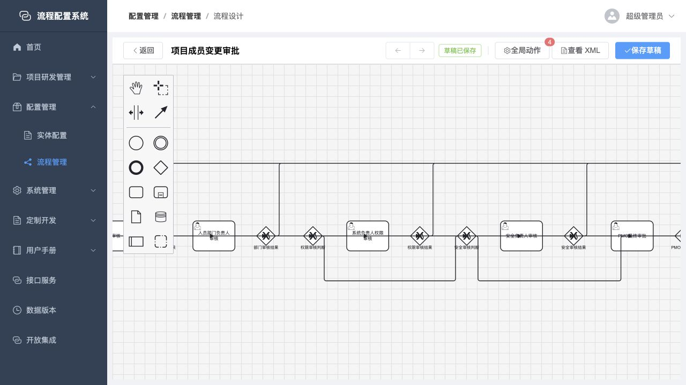

# 流程与实体配置灵活性审查

> 审查日期：2026-07-30  
> 审查范围：流程设计、实体定义、表单、列表、数据权限、数据版本、接口服务、事件绑定及自定义扩展边界  
> 审查原则：优先寻找“少量配置即可覆盖大量复杂业务”的能力，不为了零代码而把专业代码、脚本、SQL 或任意 URL 暴露给普通配置人员

## 一、结论摘要

当前系统已经具备一套较完整的低代码基础：

- 流程侧已有 BPMN 任务、网关、多人审批、节点表单、流程动作、子流程、接收任务和基础回退能力。
- 实体侧已有字段、关联、表单、列表、数据范围、版本留存、接口服务和事件绑定。
- 对特殊业务已经保留 Java Provider、自定义 Vue 组件、流程动作处理器等扩展边界。

现在最主要的问题不是“配置项太少”，而是以下四类能力不连续：

1. **同一种规则分散在多个地方。** 流程分支、表单联动、字段校验、按钮条件、数据权限、事件绑定和版本场景都各自维护条件模型。
2. **复杂审批最常用的策略仍缺少产品化配置。** 包括审批人兜底、去重、排除发起人、任一人/会签/N 人通过、节点超时、催办、升级、转派、可执行操作等。
3. **跨实体业务很快落入整段定制。** 项目成员变更样例可以运行，但跨项目占用校验、角色交接、多个实体一致修改仍主要由大段 Java 服务完成。
4. **已有高级能力可读性不足。** 输入输出 Schema、映射、条件、版本步骤等仍有较多 JSON 或表达式配置，配置人员难以发现、验证和复用。

优先级最高的新增能力不是继续增加孤立开关，而是建设六个高杠杆配置能力：

1. 统一规则与决策中心。
2. 审批策略与节点操作策略。
3. 用户任务 SLA、工作日历与升级策略。
4. 跨实体变更集。
5. Schema 驱动的接口服务与事件绑定编辑器。
6. BPMN 事件参数配置与流程仿真检查。

实施这些能力后，项目审批、OA、主数据变更、权限申请、采购、费用、生产变更等大量流程可以从“定制服务 + 定制表单”下降为“配置 + 少量 Provider”，同时不需要向普通人员开放任意脚本、SQL 或外部地址。

## 二、审查方法与证据等级

本次审查同时使用以下证据：

- 当前运行页面实测。
- 前端配置页面、运行时组件和用户手册。
- 后端运行时、持久化模型、发布清洗和测试代码。
- 项目成员变更这一复杂真实样例。
- 构造的跨领域复杂场景。

结论按以下等级理解：

| 等级 | 含义 |
|---|---|
| A | 当前运行页面与代码均已确认 |
| B | 代码、配置资产或产品手册已确认，当前页面未逐项实测 |
| C | 根据现有模型进行的设计推断，需要在实现前再次技术验证 |

当前运行环境在审查过程中登录态失效，因此没有绕过认证继续操作。文档不会把未实测页面写成已验证事实。



## 三、当前配置能力基线

### 3.1 流程设计

当前已具备：

- 用户任务、服务任务、发送任务、接收任务、手工任务、业务规则任务、调用活动、子流程。
- 排他、并行、包容和事件网关。
- 固定用户、用户组、角色、表达式和动态接口审批人。
- 并行或顺序多实例、完成条件表达式。
- 实体表单、自定义表单、多个节点表单、审批意见选项。
- 流程、节点、连线三个作用域的流程动作。
- 事务内、提交后、失败重试、继续、忽略等动作策略。
- 认领、转办、加签、撤销加签、撤回和终止等运行时能力。
- BPMN/CMMN 调用活动及输入输出映射。

主要边界：

- ScriptTask 已禁用，发布时会拒绝，历史兼容执行器也会抛出禁用异常。这一安全边界应保留。
- 大部分消息、定时、信号、错误、升级、边界事件只有图形元素，没有完整参数面板。
- 接收任务已有超时配置，但用户审批任务没有完整 SLA、提醒和升级运行时。
- 多实例“并行/顺序 + 完成条件”过于技术化，且“顺序”不等于业务人员理解的“任一人审批”。
- 回退服务在后端存在，但没有形成清晰、完整的节点级业务配置。

### 3.2 实体定义

当前已具备：

- 字段类型、必填、唯一、默认值、数据库映射、选项。
- 实体引用、级联、附件限制、编码规则、团队可见性。
- 长度、数值范围、邮箱、电话和 URL 等基础校验。
- 实体数据版本开关、场景、阶段、步骤和变更目标。

主要边界：

- 缺少条件必填、跨字段、跨行、跨实体和范围唯一校验。
- 缺少可复用的服务端业务规则目录。
- 版本场景能力较强，但配置仍偏 JSON/表达式，缺少保留、归档、回滚和关联实体版本包。

### 3.3 表单

当前已具备：

- 分组、栅格、页签、折叠、文本、字段、子表、重复区和动作插槽。
- 新增、编辑、审批、查看模式控制。
- 初始化、选项、默认值、计算、加载后、提交前和子表数据源。
- 显隐、禁用、必填、字段映射、基础公式和选项联动。
- 实体选择后直接回填或调用详情接口再回填。

主要边界：

- 条件组、动作链和复杂公式能力不足。
- 前端联动与服务端校验不能保证完全同源。
- 缺少重复行聚合、跨行校验、自动保存、恢复、打印和电子签署等通用能力。
- 原始前端事件脚本与统一事件绑定并存，形成两套扩展方式。

### 3.4 列表

当前已具备：

- 查询字段、查询方式、默认值、列宽、对齐、固定列和溢出。
- 查询区折叠、收起时显示条件数、标签宽度、表格样式和分页。
- 默认排序、数据范围、权限码、可用场景和选择模式。
- 工具栏按钮、行按钮、按钮条件、打开目标列表。
- 虚拟列、字段 Provider、自定义渲染器和自定义列表组件。
- 通用查询或自定义接口替换。

主要边界：

- 缺少个人/共享视图、查询方案、分组汇总、树表、透视、日历、看板等工作台能力。
- 缺少标准批量修改、行内编辑和主从联查。
- 导出缺少脱敏、水印、审批、模板和异步任务等治理配置。

### 3.5 数据权限

当前已具备：

- 实体范围 ALLOW 合并、列表 NARROW/OVERRIDE、DENY 最终扣减。
- 用户、角色、组、部门、组织等匹配。
- 全部、本人、提交人、当前处理人、部门、部门树和规则过滤。
- 发布版本、失败关闭、SQL 预览和按用户模拟。
- 后端运行时已有带开始/结束时间的数据范围委托，可委托本人创建、提交、当前任务、指定策略或条件范围。

主要边界：

- 数据范围委托存在于后端运行时，但没有发现完整的产品管理页面和面向管理员的生命周期操作。
- 缺少字段脱敏、列权限、按钮权限、导出权限和用途限制的统一安全策略。
- 缺少显式行共享、临时授权和面向普通用户的“为什么看不到”解释。
- `reviewRequired` 只保留在历史数据模型中，不应重新做成普通配置。

### 3.6 接口服务与事件绑定

当前已具备：

- PLATFORM、INTERNAL、HTTP 类型服务。
- 一个服务多个操作，读写操作、输入输出 Schema、超时和缓存。
- 实体、表单、列表、字段和按钮事件。
- BEFORE、REPLACE、AFTER 执行位置。
- INHERIT、REPLACE、DISABLE 继承策略。
- 输入映射、输出映射、失败停止、继续和空结果。

主要边界：

- Schema、映射和条件仍有较强 JSON 属性，缺少字段路径选择器和实时样例预览。
- 后端条件表达力强于当前页面，页面没有完整暴露嵌套 all/any/not、in、includes 等能力。
- 缺少错误码映射、熔断、限流、环境变量、接口版本、弃用和契约回归测试。
- ServiceTask 和动态审批人仍可直接配置 REST 地址，与接口服务中心职责重复。

## 四、复杂场景覆盖验证

判定说明：

- **可配置**：现有配置基本可以直接完成。
- **配置 + Provider**：流程骨架、表单和权限可配置，专业业务逻辑由受控 Provider 完成。
- **重定制**：需要较多后端服务或自定义组件，配置主要承担外围编排。
- **缺口**：当前没有稳定、可读、可治理的实现路径。

本次共构造 66 个场景。按当前能力初步归类：

| 分类 | 场景数 | 说明 |
|---|---:|---|
| 现有配置可直接完成 | 10 | 基础流程、表单回填、数据范围、接收任务等已有明确路径 |
| 配置 + Provider | 36 | 约束、流程和页面可配置，专业计算或跨系统逻辑由 Provider 完成 |
| 需要较重定制 | 6 | 文档签章、复杂汇总视图、跨实体专业服务等 |
| 存在缺口、入口缺失、重复配置或配置成本过高 | 14 | SLA、个人视图、行内编辑、事件参数、流程仿真等 |

这组数字只用于比较本次构造场景，不代表行业统计。它说明当前平台的流程骨架覆盖面已经较好，但“完全靠简单配置完成复杂业务”的比例仍偏低；统一规则、审批策略、SLA 和跨实体变更集会产生最大的提升。

### 4.1 项目治理场景

| 场景 | 当前可行路径 | 判定 | 主要缺口 |
|---|---|---|---|
| 项目立项按金额、风险、项目类型进入不同审批链 | 网关条件 + 用户任务 + 动态审批人 | 配置 + Provider | 审批链规则分散；缺少审批矩阵、无审批人兜底和路径模拟 |
| 项目成员加入、退出、暂停、恢复、占用比例调整 | 现有项目成员变更流程 + 流程动作 | 重定制 | 跨项目总占用、角色交接和多实体一致写入主要依赖 Java 服务 |
| 一个变更同时影响多个项目，分别由各项目经理确认 | 多实例用户任务 + 动态审批人 | 配置 + Provider | 审批人去重、按项目生成任务、部分项目拒绝后的汇总策略不直观 |
| 需求影响多个系统，架构、安全、数据负责人按影响项并行会审 | 包容网关 + 多节点审批 | 配置 + Provider | 缺少根据重复行自动生成审查任务和 N 人/比例通过策略 |
| 项目预算累计变更超过阈值才升级审批 | 网关 + Provider 计算累计金额 | 配置 + Provider | 缺少聚合指标规则和可复用决策表 |
| 里程碑延期按延期天数、关键路径和客户影响升级 | 条件分支 + 动态审批 | 配置 + Provider | 缺少日期差、工作日历、关键路径等标准规则函数 |
| 项目关闭必须确认所有合同、回款、资产和成员已结清 | 前置流程动作校验 | 配置 + Provider | 缺少跨实体检查清单和阻断原因的标准展示 |
| 项目状态变更时同步多个系统，失败后补偿 | AFTER 动作 + 接口服务 | 配置 + Provider | 外部事务补偿、状态机和人工重试工作台不完整 |

### 4.2 OA 与行政场景

| 场景 | 当前可行路径 | 判定 | 主要缺口 |
|---|---|---|---|
| 请假按天数、假种和人员级别走不同审批链 | 表单 + 网关 + 动态审批人 | 配置 + Provider | 工作日历、余额、重叠、代理人和无上级兜底缺失 |
| 报销含多行费用，校验预算、发票重复和合计金额 | 子表 + 提交前接口 + 审批 | 配置 + Provider | 重复行合计、跨行校验、发票查重和预算规则不能统一可视化配置 |
| 出差申请带多段行程，变更后比较原审批版本 | 子表 + 数据版本 | 配置 + Provider | 关联子表版本包、中文差异摘要和重新审批策略不足 |
| 采购申请按金额、品类、供应商风险和预算审批 | 网关 + 规则任务 + Provider | 配置 + Provider | 缺少决策表中心和供应商风险规则复用 |
| 采购比价要求至少三家供应商并自动推荐 | 子表 + Provider | 配置 + Provider | 聚合校验和评分模型不宜用普通表达式维护 |
| 合同审批按合同类型、金额和条款风险分支 | 表单 + 网关 + 接口校验 | 配置 + Provider | 条款识别、版本红线和电子签署需要专业服务 |
| 用印申请审批后生成带水印文件并登记印章使用 | 流程动作 + 自定义服务 | 重定制 | 文档生成、水印、签章和设备集成不适合做通用低代码表达式 |
| 资产借用需要库存锁定、归还、逾期提醒 | 实体 + 流程 + 接收任务 | 配置 + Provider | 资源预占、用户任务 SLA、定时提醒和逾期升级缺失 |
| 访客申请按区域和时间授权，过期自动失效 | 实体 + 接口服务 | 配置 + Provider | 定时撤权、时区和外部门禁补偿需要统一计划任务策略 |
| 权限申请在有效期结束后自动撤销 | 流程 + 外部接口 | 配置 + Provider | 缺少可配置定时边界事件和权限生命周期模板 |

### 4.3 运营、研发与主数据场景

| 场景 | 当前可行路径 | 判定 | 主要缺口 |
|---|---|---|---|
| 生产变更按系统级别、窗口和风险走审批并保留回滚计划 | 表单 + 网关 + 流程动作 | 配置 + Provider | 维护窗口、冻结期、冲突检测和回滚编排需要规则中心 |
| 事故工单按等级自动升级并通知值班人 | 动态审批 + 通知动作 | 缺口 | 用户任务 SLA、值班表、重复升级和响应计时未产品化 |
| 客诉在规定时间内响应，可重开并升级负责人 | 流程 + 状态 + 动作 | 配置 + Provider | 重开、暂停计时、SLA 和升级链配置不足 |
| 主数据变更采用制单/复核，字段级展示变更前后值 | 版本 + 审批表单 | 配置 + Provider | 字段分组、敏感字段单独审批和一键应用旧版本不足 |
| 员工入职同时开通账号、设备、权限和培训任务 | 并行任务 + 接口服务 | 配置 + Provider | 跨系统补偿、任务依赖、人员到岗日期定时触发缺失 |
| 员工离职必须回收全部权限并由资产负责人确认 | 并行任务 + 子流程 | 配置 + Provider | 全量权限发现、失败重试和未完成项汇总需扩展 |
| 客户信用额度调整需按余额、逾期和风险模型审批 | 业务规则任务 + Provider | 配置 + Provider | 缺少可管理、可测试、可版本化的决策表 |
| 外部付款回调驱动流程继续，超时转人工处理 | 接收任务 + 超时 | 可配置 | 当前可覆盖基础消息等待；复杂幂等、签名和补偿仍需 Provider |

### 4.4 表单变化场景

| 场景 | 当前可行路径 | 判定 | 主要缺口 |
|---|---|---|---|
| 不同申请类型显示不同分组并设置不同必填项 | 显隐 + 必填表达式 | 可配置 | 条件复用、嵌套规则和冲突解释不足 |
| 选择客户后回填联系人、电话和信用等级 | ENTITY_SELECTED + 映射/详情接口 | 可配置 | 需要 Schema 路径选择器和映射预览降低配置错误 |
| 多行明细自动求和，合计超过预算阻止提交 | 重复区 + 公式/提交前接口 | 配置 + Provider | 跨行聚合和服务端同源校验缺失 |
| 审批节点只允许修改指定字段，其余只读 | 表单模式控制 | 配置 + Provider | 当前粒度偏模式级，缺少节点/角色/审批结果的字段矩阵 |
| 长表单自动保存草稿，断网或误关后恢复 | 无完整标准能力 | 缺口 | 缺少自动保存、恢复版本、冲突合并和草稿过期策略 |
| 一份表单分步骤填写，不同步骤由不同角色补充 | 页签/折叠可模拟 | 配置 + Provider | 缺少真正的向导步骤、步骤校验和跨人协作状态 |
| 表单提交后生成 PDF、盖章或签名 | 自定义接口/组件 | 重定制 | 应提供文档模板与签署连接器，不应开放脚本 |
| 子表每行按产品动态加载规格和价格 | 字段事件 + 接口服务 | 可配置 | 批量请求、缓存、行上下文路径和失败提示仍需加强 |

### 4.5 列表变化场景

| 场景 | 当前可行路径 | 判定 | 主要缺口 |
|---|---|---|---|
| 用户保存自己的筛选、列顺序和列宽 | 无标准个人视图 | 缺口 | 需要个人视图、默认视图和恢复默认 |
| 团队共享一套“本周待处理高风险项目”视图 | 可新建列表配置 | 配置成本高 | 为一个视图复制整张列表过重，应支持共享查询方案 |
| 按部门或状态分组并显示数量、金额合计 | 自定义列表组件 | 重定制 | 缺少分组、汇总、小计和透视配置 |
| 在列表中批量修改负责人或状态 | 自定义按钮 + 接口 | 配置 + Provider | 缺少标准批量编辑、字段校验和逐条失败结果 |
| 列表行内快速修改少数字段 | 无标准能力 | 缺口 | 需要可编辑列、权限、校验和版本留存 |
| 主列表展开查看子记录并筛选子项 | 打开目标列表或自定义组件 | 配置 + Provider | 缺少标准主从展开、树表和关联过滤 |
| 导出敏感数据需脱敏、水印和审批 | 按钮 + 自定义接口 | 重定制 | 缺少导出策略中心和异步导出任务 |
| 同一实体按不同角色显示不同列和按钮 | 多列表 + 权限码 | 可配置但重复 | 需要列/按钮策略覆盖，避免复制整个列表 |

### 4.6 数据权限场景

| 场景 | 当前可行路径 | 判定 | 主要缺口 |
|---|---|---|---|
| 用户可见本人、所在部门和负责项目的数据并集 | 多 ALLOW 策略 | 可配置 | 规则来源和最终范围解释需要更清楚 |
| 保密项目即使满足部门条件也必须排除 | DENY 策略 | 可配置 | 需要发布前冲突分析和“被哪条 DENY 排除”说明 |
| 临时代理人在有效期内看到委托人的待办相关数据 | 后端已有时间范围委托 | 配置入口缺口 | 需要委托管理、撤销、审计和模拟页面 |
| 某记录显式共享给指定人员或小组 | 可用条件或定制表模拟 | 重定制 | 缺少通用行级 ACL/共享模型 |
| 财务只显示完整金额，其他角色显示区间或掩码 | 无统一字段策略 | 缺口 | 需要字段/列脱敏和用途策略 |
| 允许查看但禁止导出、批量操作或查看附件 | 分散权限码可部分实现 | 配置 + Provider | 需要数据范围、字段、动作和导出统一安全策略 |
| 管理员模拟某用户并解释每条数据是否可见 | 已有范围模拟 | 可配置 | 应扩展多角色对比、字段/动作结果和可读解释 |

### 4.7 接口、事件与版本场景

| 场景 | 当前可行路径 | 判定 | 主要缺口 |
|---|---|---|---|
| 保存前校验客户状态，平台保存后同步 ERP | BEFORE + 平台默认 + AFTER | 可配置 | 需要可视化请求/响应样例和错误码映射 |
| 外部系统完全替代列表查询和保存 | REPLACE | 可配置 | 分页、排序、总数和记录结果映射需要标准模板 |
| 同一客户接口复用于列表、详情、字段和按钮 | 接口服务多操作 + 事件绑定 | 可配置 | 现有 Schema/路径编辑体验仍偏技术化 |
| 开发、测试、生产使用不同地址和凭据 | 连接配置可承担部分能力 | 配置 + Provider | 缺少环境变量集、发布校验和配置差异预览 |
| 外部接口升级版本但旧表单暂不迁移 | 新建操作可规避 | 配置成本高 | 需要操作版本、弃用期限、依赖影响分析 |
| 接口超时重试后仍失败，进入人工补偿 | 重试/失败策略可覆盖部分 | 配置 + Provider | 缺少熔断、死信、补偿任务和重放控制台 |
| 主实体和三个关联实体一次修改并形成一致版本 | 自定义保存返回 changedRecords | 配置 + Provider | 缺少跨实体版本包和一致比较 |
| 把历史版本一键恢复为当前数据 | 无完整通用能力 | 缺口 | 需要恢复前差异、权限、冲突检测和新版本生成 |

### 4.8 高级流程场景

| 场景 | 当前可行路径 | 判定 | 主要缺口 |
|---|---|---|---|
| 到达某节点 24 小时未处理，提醒后升级经理 | 无完整用户任务 SLA | 缺口 | SLA、工作日历、提醒和升级策略 |
| 审批人为空时转给部门管理员或指定兜底人 | 动态 Provider 可处理 | 配置 + Provider | 缺少统一无审批人策略 |
| 同一审批人在连续节点只审批一次 | Provider/流程动作 | 配置 + Provider | 缺少审批人去重与合并任务策略 |
| 发起人同时是审批人时自动跳过或转上级 | 跳过表达式 + Provider | 配置 + Provider | 缺少排除发起人和审批链重算预设 |
| 驳回到任意已完成节点，修改后从指定路径重提 | 后端有回退能力 | 产品化缺口 | 缺少可退节点、数据回滚、重提路径和已完成并行分支策略 |
| 下一节点未处理前允许撤回，已处理后禁止 | 可由接口判断 | 配置 + Provider | 缺少节点级撤回策略和明确反馈 |
| 子流程固定使用已审核版本，不随最新版本变化 | 调用活动可配置 Key | 配置 + Provider | 缺少版本选择、迁移和影响分析 |
| 消息、定时、信号、错误和升级事件驱动流程 | BPMN 图形存在 | 缺口 | 绝大多数事件缺少专用参数面板和发布检查 |
| 发布前模拟不同金额、部门和申请类型的完整路径 | 无完整流程仿真 | 缺口 | 需要样例集、路径覆盖和死路检测 |

## 五、优先新增的高杠杆配置

### P0-1 统一规则与决策中心

**为什么优先**

当前至少有七套相似条件：

- 流程连线条件。
- 表单显隐、禁用和必填。
- 字段和实体校验。
- 按钮适用条件。
- 数据范围匹配与过滤。
- 事件绑定条件。
- 数据版本场景条件。

继续分别加强会让概念和维护成本持续增加。

**建议配置模型**

- 统一字段路径、上下文变量和函数目录。
- 支持 `全部满足`、`任一满足`、`取反` 和嵌套分组。
- 支持等于、不等于、包含、属于、为空、变化前后、日期差、当前用户/部门、集合和聚合。
- 支持命名规则集、参数、版本、引用位置和影响分析。
- 提供中文自然摘要，例如“申请金额大于 10 万且项目风险为高”。
- 提供样例输入测试、命中过程和结果解释。
- 简单模式使用字段选择器；表达式和 JSON 仅保留在高级模式。

**能替代的定制**

- 大量网关判断 Provider。
- 重复的前端显隐脚本。
- 常见按钮显示代码。
- 常见跨字段校验代码。

### P0-2 审批策略与节点操作策略

**建议把技术字段转换为业务策略**

审批策略可提供以下预设：

- 一人审批。
- 所有人会签。
- 任一人通过。
- 至少 N 人通过。
- 通过比例达到 X%。
- 任一人否决。
- 顺序逐级审批。
- 按组织链逐级上报。

审批人策略补充：

- 排除发起人。
- 去重连续审批人。
- 已审批人员自动跳过。
- 无审批人时自动通过、报错、转管理员或使用兜底审批人。
- 动态审批人在节点创建时固定，或在每次进入节点时重新计算。
- 离职、停用、请假或代理状态处理。

节点操作策略补充：

- 是否允许转办、委派、加签、减签、撤回、驳回和终止。
- 加签允许前加、并加、后加中的哪些方式。
- 可驳回到上一节点、任意已完成节点或指定节点。
- 驳回后重新经过全部节点，或回到驳回点后继续。
- 审批过程中哪些字段可编辑，修改后是否要求重新计算审批人。

**配置体验**

普通人员选择策略，不直接编辑 `completionCondition`。高级表达式保留在“高级”区域。

### P0-3 用户任务 SLA、工作日历与升级策略

当前接收任务超时不能替代用户审批 SLA。

建议新增：

- 截止时间：固定时长、指定日期字段、规则计算。
- 计时方式：自然日、工作日、工作时间。
- 暂停条件：等待补充材料、节假日、流程挂起。
- 提醒：到期前、到期时、逾期后周期提醒。
- 升级：通知上级、增加关注人、转派、加签、自动通过、自动拒绝、进入异常节点。
- 多级升级和最大次数。
- SLA 结果写入流程变量和审计日志。
- 工作日历按组织、地区或业务类型配置。

它可直接覆盖请假、报销、客诉、事故、资产逾期、合同审批等大量场景。

### P0-4 跨实体变更集

项目成员变更样例说明，复杂业务最重的代码通常不是流程本身，而是“在一个事务内校验并修改多个关联实体”。

建议新增受控的跨实体变更集：

- 选择创建、更新、删除或状态转换。
- 通过主键、业务键或关联条件匹配目标记录。
- 字段映射、默认值、条件赋值和空值策略。
- 影响行数要求，例如必须恰好一条。
- 更新前存在性、唯一性、状态和版本校验。
- 多步骤事务，任一步失败整体回滚。
- 自动生成 `changedRecords` 和关联版本。
- 提交前模拟将修改哪些实体、字段和记录。
- 支持注册 Provider 作为某一步，而不是必须由 Provider 接管整段保存。

**应保留代码的部分**

资源优化、专业计费、监管算法、复杂角色交接规则仍应由 Provider 完成。变更集只承担通用 CRUD、映射、匹配、事务和审计。

### P0-5 Schema 驱动的接口服务与事件绑定

现有统一接口服务和事件绑定方向正确，应继续收敛概念，而不是再增加“数据源模式”“按钮处理器类型”等平行概念。

建议增强：

- 根据输入输出 Schema 展示中文字段树。
- 从表单、选择结果、当前用户、流程变量、路由参数和上一步结果拖拽映射。
- 支持常量、默认值、日期格式、数组取第一项、拼接、对象和分页模板。
- 显示样例请求、响应和最终映射结果。
- 统一错误码到页面提示、字段错误、重试、忽略或补偿。
- 支持接口操作版本、弃用、调用方清单和升级影响。
- 支持开发/测试/生产环境连接切换，但凭据仍只在服务中心管理。
- 支持契约测试、Mock 响应、限流、熔断和执行日志。

同时逐步迁移：

- ServiceTask 中直接填写 REST URL。
- 动态审批人直接填写 REST URL。
- 表单字段原始业务脚本。
- 旧数据源和旧按钮处理器。

### P0-6 BPMN 事件参数与发布检查

建议优先产品化：

- 定时开始事件、定时中间事件、定时边界事件。
- 消息开始、中间捕获和边界事件。
- 信号事件。
- 错误和升级边界事件。
- 终止、错误和消息结束事件。

每种事件都需要：

- 中文参数面板。
- 关联消息/信号目录。
- 重复触发、相关业务键和幂等策略。
- 是否中断当前任务。
- 超时或未匹配时的处理。
- 发布前静态检查和运行时日志。

在专用面板成熟前，不建议把只有图形、没有完整语义的元素作为普通配置能力宣传。

### P1-1 表单规则与服务端校验同源

建议在统一规则中心上增加表单动作：

- 显示、隐藏、启用、禁用、必填、非必填。
- 赋值、清空、复制、计算、刷新选项、调用接口。
- 重复行新增、删除、合计、最小/最大行数和跨行校验。
- 隐藏字段是否保留旧值。
- 多规则冲突优先级和执行顺序。
- 循环依赖检测。
- 同一规则同时生成前端即时反馈和服务端提交校验。

### P1-2 统一数据安全策略

在现有行级数据范围上补充：

- 字段可见、只读、掩码和完整显示。
- 附件下载、查看原文件和水印。
- 列表按钮、批量操作和导出限制。
- 显式行共享给用户、组或角色。
- 有效期、撤销和委托。
- 访问用途，例如仅审批、仅核对、禁止二次传播。
- 普通用户可理解的拒绝原因。
- 多用户、多角色并排模拟。

数据范围、字段、动作和导出应在同一“数据安全”视图中展示最终效果。

### P1-3 回退、撤回与重提策略

把已有后端能力产品化：

- 节点是否允许驳回。
- 可驳回目标。
- 并行分支如何处理。
- 是否回滚实体状态或保留已修改数据。
- 重提后从头、从驳回点或指定点继续。
- 已产生的外部动作是否补偿。
- 撤回窗口和下一节点已处理时的策略。
- 回退前预览将取消的任务、恢复的状态和受影响的外部动作。

### P1-4 版本治理与关联版本包

建议补充：

- 保留周期、最大版本数、归档和删除策略。
- 字段包含/排除、敏感字段掩码。
- 主实体和关联实体形成同一业务版本包。
- 中文字段分组、子表和附件差异。
- 恢复历史版本时先预览，再生成一个新的当前版本。
- 乐观锁、并发冲突和合并策略。
- 针对审批重新提交的“仅比较上次提交”模板。

### P1-5 列表工作台

建议优先提供最通用的五项：

1. 个人视图和共享视图。
2. 查询方案、默认方案和固定常用条件。
3. 分组、合计、小计和简单透视。
4. 标准批量修改和逐条失败反馈。
5. 导出策略、模板、异步任务、脱敏和水印。

树表、看板、日历和时间线可作为后续标准视图类型，不必一开始全部实现。

### P1-6 流程仿真、检查与影响分析

建议发布前自动检查：

- 无出口、永远不命中的分支、未闭合并行网关。
- 无审批人、重复审批人和无兜底分支。
- 表单字段路径、接口映射和规则引用是否失效。
- 子流程、接口操作、实体字段被删除或升级的影响。
- 多组样例输入下的完整路径和审批人。
- 流程最长耗时、可能进入的人工等待点和外部依赖。

## 六、建议简化、收敛或隐藏的配置

这里的“去掉”主要指从普通设计界面移除或迁移，不代表立即删除兼容运行代码。

| 当前能力 | 建议 | 原因 |
|---|---|---|
| ServiceTask 直接 REST URL | 迁移到接口服务，旧配置只读兼容 | 地址、凭据、版本和审计不应散落在流程图 |
| 动态审批人直接 REST URL | 改为选择接口服务操作 | 与统一接口服务重复 |
| 表单字段原始业务事件脚本 | 业务副作用迁移到事件绑定 | 前端脚本不可审计，且服务端无法保证一致性 |
| 多实例直接暴露完成条件 | 普通模式使用审批策略预设 | 业务人员很难正确理解表达式 |
| ComplexGateway | 在没有专用配置和验证前隐藏 | 图形可画但运行语义和验证不足 |
| 仅有图形的专业 BPMN 事件 | 未提供参数面板前标记高级/不可发布 | 防止“看起来支持、实际上无法治理” |
| ScriptTask | 继续禁用 | 不应在业务 JVM 中执行用户脚本 |
| `reviewRequired` 历史字段 | 仅保留迁移兼容，不进入普通界面 | 当前没有完整评审工作流，暴露只会制造假能力 |
| 旧数据源、按钮处理器等平行概念 | 统一迁移到接口服务 + 事件绑定 | 降低概念数量 |
| 大段 JSON 配置 | 普通模式改为结构化编辑器，JSON 放高级模式 | 提高可读性、校验和可维护性 |
| 权限委托仅后端数据表/运行时 | 补全统一管理页面，否则不要对外宣传完整能力 | 运行能力存在，但生命周期不可管理 |

## 七、不建议继续配置化的能力

低代码平台不应追求把所有代码都变成配置。以下能力应保留受控扩展：

| 类型 | 推荐扩展方式 | 不建议做法 |
|---|---|---|
| 复杂资源优化、排班、路线、评分算法 | Java Provider/独立服务 | 在页面堆叠数百条公式 |
| 监管、税务、财务专业计算 | 版本化规则服务或 Provider | 允许自由脚本 |
| 电子签章、病毒扫描、OCR、AI 模型 | 受控连接器/接口服务 | 在流程节点直接配置任意 SDK 或地址 |
| 高吞吐聚合、搜索和分析 | 专用查询服务/数据产品 | 让通用列表执行任意 SQL |
| 跨系统长事务和复杂补偿 | 编排服务 + 幂等接口 + 补偿处理器 | 用简单 AFTER 钩子假装分布式事务 |
| 高度专属交互，如复杂甘特图、图编辑器 | 自定义 Vue 组件 | 把所有交互拆成低代码开关 |
| 涉密或高风险安全策略 | 审核过的策略 Provider | 把密钥、SQL、脚本暴露给普通设计人员 |

推荐边界是：

```text
配置负责：触发时机、业务条件、审批策略、字段映射、通用变更、权限和审计
Provider 负责：专业算法、复杂领域规则、受控外部能力
自定义组件负责：确实无法抽象为通用交互的页面
```

## 八、推荐的统一产品结构

为了避免继续增加概念，建议最终收敛为以下结构：

1. **实体**：数据结构、关联、状态、版本、安全策略。
2. **页面**：表单、列表及视图。
3. **流程**：节点、事件、审批策略和操作策略。
4. **规则**：条件、决策表、校验和动作。
5. **接口服务**：连接、操作、Schema、版本和运行治理。
6. **事件绑定**：什么时候执行规则、接口或通用变更。
7. **扩展**：Provider 和自定义组件目录。

配置人员在不同设计器里看到的是同一个规则选择器、同一个接口操作选择器、同一个字段路径选择器和同一个执行链编辑器。

## 九、实施路线

建议按业务覆盖价值和实现复杂度排序：

| 能力 | 业务覆盖价值 | 实现复杂度 | 建议顺序 |
|---|---|---|---|
| 审批策略与审批人兜底 | 极高 | 中 | 第一批 |
| 用户任务 SLA 与工作日历 | 极高 | 中高 | 第一批 |
| 统一规则中心基础版 | 极高 | 高 | 第一批，先统一条件模型和测试器 |
| Schema 驱动的接口映射 | 高 | 中 | 第一批 |
| 跨实体变更集 | 极高 | 高 | 第一批先做受控 CRUD 和事务 |
| 定时、消息、错误边界事件 | 高 | 中高 | 第一批 |
| 回退、撤回和重提策略 | 高 | 中高 | 第二批 |
| 字段、动作和导出安全策略 | 高 | 高 | 第二批 |
| 关联版本包与版本恢复 | 高 | 高 | 第二批 |
| 个人/共享视图与批量修改 | 中高 | 中 | 第二批 |
| 流程仿真与影响分析 | 高 | 高 | 第二批，可随规则中心逐步建设 |
| 看板、日历、打印、签署等体验能力 | 中 | 中高 | 第三批 |

### 第一阶段：降低复杂流程的定制量

- 统一规则中心基础版。
- 审批策略预设和审批人兜底。
- 用户任务 SLA 与工作日历。
- 跨实体变更集基础版。
- 接口映射字段树和错误码映射。
- 定时、消息和错误边界事件面板。

预期效果：项目审批、请假、报销、采购、客诉、权限申请和主数据变更的主流程可以主要靠配置完成。

### 第二阶段：补齐治理与复用

- 字段/动作/导出统一安全策略。
- 回退、撤回和重提策略。
- 关联版本包和版本恢复。
- 个人/共享列表视图、分组汇总和批量修改。
- 接口版本、环境、Mock、契约测试和补偿工作台。
- 流程仿真和发布影响分析。

### 第三阶段：增强体验

- 表单向导、自动保存和协作填写。
- 文档模板、打印和电子签署连接器。
- 树表、看板、日历和时间线视图。
- 行业流程模板和配置配方。

## 十、建议的验收场景

每项新增配置不应只验证“能保存”，应至少使用以下端到端场景验收：

1. 十万元以上高风险项目立项，自动经过项目经理、财务、架构和管理层。
2. 三个项目共同受影响的成员退出，校验占用并完成角色交接。
3. 三行报销明细自动合计，识别重复发票并按金额升级。
4. 请假跨节假日计算工作日，审批人请假时自动使用代理人。
5. 高等级事故两小时未响应，提醒、升级并记录 SLA。
6. 客户选择后回填详情，保存前校验，保存后同步 ERP。
7. 主实体和关联实体一起修改，版本比较显示中文字段和子表差异。
8. 保密记录命中部门 ALLOW 后仍被 DENY 排除，并能解释原因。
9. 临时委托在开始时间生效、结束时间失效，撤销后立即停止。
10. 驳回到指定节点后修改数据，重提路径、版本和外部动作均符合策略。
11. 外部接口超时、重试、熔断后进入人工补偿，不能重复写入。
12. 发布前用多组样例验证所有网关路径、审批人和无出口风险。

## 十一、最终判断

### 最值得增加

- 统一规则中心。
- 审批策略和节点操作策略。
- SLA 与工作日历。
- 跨实体变更集。
- Schema 驱动的接口/映射编辑器。
- BPMN 事件配置和流程仿真。
- 字段级数据安全和关联版本包。

### 最值得简化

- 直接 REST、原始前端脚本、多套数据源/处理器概念。
- 多实例完成条件等面向引擎的技术配置。
- 普通页面中的 JSON 和表达式。
- 只有图形、没有完整参数和验证的 BPMN 元素。

### 应继续保留定制

- 专业算法、监管计算、复杂跨系统补偿、电子签章、AI、超高性能查询和高度专属交互。

系统下一步的重点不应该是“让页面上出现更多配置项”，而应该是把规则、审批、变更、接口和安全五类通用能力做成少量、统一、可测试、可解释的配置。这样才能同时提高复杂场景覆盖率和配置人员的可用性。

## 十二、主要证据位置

- `workflow-web/src/data/user-manual/process.js`
- `workflow-web/src/data/user-manual/entity.js`
- `workflow-web/src/components/NodeConfigPanel.vue`
- `workflow-web/src/shared/process-config/index.js`
- `workflow-web/src/shared/form-runtime/`
- `workflow-web/src/shared/list-runtime/`
- `workflow-web/src/components/ui-config/interfaceServiceModel.js`
- `workflow-server/workflow-process/src/main/java/com/workflow/process/definition/application/ProcessBpmnPublishSanitizer.java`
- `workflow-server/workflow-process/src/main/java/com/workflow/process/task/application/TaskAddSignService.java`
- `workflow-server/workflow-process/src/main/java/com/workflow/process/instance/application/ProcessRollbackService.java`
- `workflow-server/workflow-entity/src/main/java/com/workflow/entity/ui/application/UiEventRuntimeService.java`
- `workflow-server/workflow-entity/src/main/java/com/workflow/entity/permission/application/DataPermissionEngine.java`
- `workflow-server/workflow-project/src/main/resources/project-config/assets/entities/project_member_change_request-v1.json`
- `workflow-server/workflow-project/src/main/resources/project-config/assets/processes/project_member_change_process-v1.json`
- `workflow-server/workflow-project/src/main/java/com/workflow/project/service/ProjectMemberChangeService.java`
