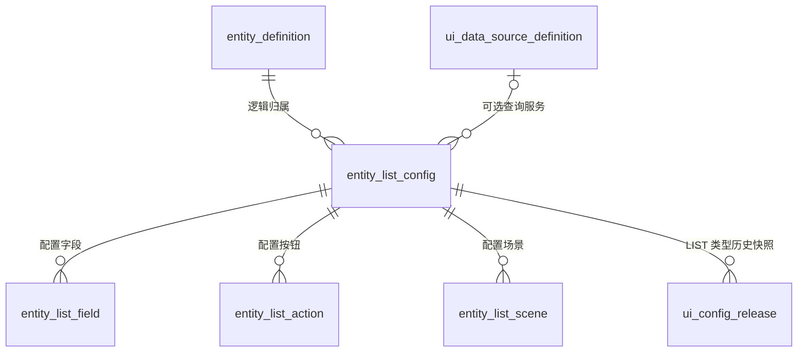

# Flow 系统数据库设计文档

文档版本：1.4；整理日期：2026-09-09。

本文按业务模块记录 Flow 平台的数据库结构、表间关系和使用情况。每张表单列章节，全部字段列在同一张表格中。

文档收录 V082 扩展迁移后的 153 张平台表、2,221 个字段，其中七张为历史保留表。`biz` 开头的业务表及其动态附属表、Flowable 引擎表不在范围内；平台自有 `process_*` 表正常收录。

V081 结构已与 2026-09-08 本机 `localhost:3306/workflow` 核对，V082 前向变更已在隔离 MySQL 8.0 实例验证。业务结构结合 V001—V079 SQL 迁移、V080 Java 迁移、V081—V082 SQL 迁移及当前源码说明；历史保留表按实际库结构登记。

字段表中的类型、可空性和默认值按数据库定义填写。“NULL（隐式）”表示可空列没有显式 DEFAULT；JSON 格式要求分别由应用校验或表内 CHECK 约束承担。表间业务关联与物理外键分别说明。

“兼容使用中”表示字段仍保留读写或迁移路径；历史保留表的来源和使用情况在相应章节说明。

## 目录

- [1. 实体配置](#1-实体配置)
  - [1.1 entity_definition 实体定义表](#11-entity_definition-实体定义表)
  - [1.2 entity_field 实体字段定义表](#12-entity_field-实体字段定义表)
  - [1.3 entity_field_option 实体字段静态选项表](#13-entity_field_option-实体字段静态选项表)
  - [1.4 entity_field_file_item 实体字段附件项表](#14-entity_field_file_item-实体字段附件项表)
  - [1.5 entity_code_rule 实体业务编码规则表](#15-entity_code_rule-实体业务编码规则表)
  - [1.6 entity_status 实体状态定义表](#16-entity_status-实体状态定义表)
  - [1.7 entity_relation 实体关系定义表](#17-entity_relation-实体关系定义表)
  - [1.8 entity_publish_history 实体发布历史表](#18-entity_publish_history-实体发布历史表)
  - [1.9 entity_schema_operation 实体结构发布操作表](#19-entity_schema_operation-实体结构发布操作表)
  - [1.10 entity_schema_operation_event 实体结构操作事件表](#110-entity_schema_operation_event-实体结构操作事件表)
  - [1.11 entity_unique_value 实体字段唯一值预留表](#111-entity_unique_value-实体字段唯一值预留表)
- [2. 表单与列表配置](#2-表单与列表配置)
  - [2.1 entity_form 实体表单定义表](#21-entity_form-实体表单定义表)
  - [2.2 entity_form_node 实体表单递归节点表](#22-entity_form_node-实体表单递归节点表)
  - [2.3 entity_list_config 实体列表配置表](#23-entity_list_config-实体列表配置表)
  - [2.4 entity_list_field 实体列表字段配置表](#24-entity_list_field-实体列表字段配置表)
  - [2.5 entity_list_action 实体列表按钮配置表](#25-entity_list_action-实体列表按钮配置表)
  - [2.6 entity_list_scene 实体列表场景配置表](#26-entity_list_scene-实体列表场景配置表)
  - [2.7 entity_form_unique_value_gate 表单唯一值事务门闩表](#27-entity_form_unique_value_gate-表单唯一值事务门闩表)
  - [2.8 entity_form_unique_claim 表单唯一值原子占位表](#28-entity_form_unique_claim-表单唯一值原子占位表)
  - [2.9 ui_view_composition 表单列表关联内容表](#29-ui_view_composition-表单列表关联内容表)
- [3. 数据权限](#3-数据权限)
  - [3.1 entity_list_scope_policy 列表数据范围方案表](#31-entity_list_scope_policy-列表数据范围方案表)
  - [3.2 entity_list_scope_binding 列表数据范围绑定表](#32-entity_list_scope_binding-列表数据范围绑定表)
  - [3.3 entity_list_scope_delegation 列表数据范围委派表](#33-entity_list_scope_delegation-列表数据范围委派表)
  - [3.4 entity_list_scope_release 列表数据范围发布表](#34-entity_list_scope_release-列表数据范围发布表)
  - [3.5 entity_list_scope_audit_log 列表数据范围审计表](#35-entity_list_scope_audit_log-列表数据范围审计表)
- [4. 实体版本与变更](#4-实体版本与变更)
  - [4.1 entity_version_config 实体数据版本策略表](#41-entity_version_config-实体数据版本策略表)
  - [4.2 entity_version_config_release 实体版本策略发布兼容表](#42-entity_version_config_release-实体版本策略发布兼容表)
  - [4.3 entity_mutation_policy_config 实体变更策略草稿表](#43-entity_mutation_policy_config-实体变更策略草稿表)
  - [4.4 entity_mutation_policy_release 实体变更策略发布表](#44-entity_mutation_policy_release-实体变更策略发布表)
  - [4.5 entity_change_target_instance 变更实际目标记录表](#45-entity_change_target_instance-变更实际目标记录表)
  - [4.6 entity_mutation_receipt 实体变更幂等回执表](#46-entity_mutation_receipt-实体变更幂等回执表)
  - [4.7 entity_record_version 实体记录版本表](#47-entity_record_version-实体记录版本表)
  - [4.8 entity_record_version_dataset 记录版本关系数据集表](#48-entity_record_version_dataset-记录版本关系数据集表)
  - [4.9 entity_record_version_dataset_row 记录版本数据集行表](#49-entity_record_version_dataset_row-记录版本数据集行表)
  - [4.10 entity_record_version_counter 记录版本计数器表](#410-entity_record_version_counter-记录版本计数器表)
- [5. 流程设计](#5-流程设计)
  - [5.1 process_definition_config 流程定义配置表](#51-process_definition_config-流程定义配置表)
  - [5.2 process_version_history 流程发布历史表](#52-process_version_history-流程发布历史表)
  - [5.3 process_node_config 流程节点配置表](#53-process_node_config-流程节点配置表)
  - [5.4 process_entity_status_mapping 实体流程状态映射表](#54-process_entity_status_mapping-实体流程状态映射表)
  - [5.5 process_node_assignee 流程节点办理人配置表](#55-process_node_assignee-流程节点办理人配置表)
  - [5.6 process_node_approval 流程节点审批配置表](#56-process_node_approval-流程节点审批配置表)
  - [5.7 process_node_approval_option 流程节点审批选项表](#57-process_node_approval_option-流程节点审批选项表)
  - [5.8 process_node_form 流程节点实体表单绑定表](#58-process_node_form-流程节点实体表单绑定表)
  - [5.9 process_form_config 流程节点表单配置表](#59-process_form_config-流程节点表单配置表)
  - [5.10 process_form_field_config 流程节点表单字段表](#510-process_form_field_config-流程节点表单字段表)
  - [5.11 process_action 流程动作绑定表](#511-process_action-流程动作绑定表)
  - [5.12 process_action_definition 流程动作处理器目录表](#512-process_action_definition-流程动作处理器目录表)
  - [5.13 process_action_definition_entity 流程动作可见实体表](#513-process_action_definition_entity-流程动作可见实体表)
  - [5.14 process_person_resolver_definition 受控人员解析器目录表](#514-process_person_resolver_definition-受控人员解析器目录表)
  - [5.15 process_ui_release_binding 流程与界面发布绑定表](#515-process_ui_release_binding-流程与界面发布绑定表)
- [6. 流程运行与协作](#6-流程运行与协作)
  - [6.1 entity_process_link 实体与流程实例关联表](#61-entity_process_link-实体与流程实例关联表)
  - [6.2 process_task 平台流程任务表](#62-process_task-平台流程任务表)
  - [6.3 process_task_candidate_user 任务候选用户表](#63-process_task_candidate_user-任务候选用户表)
  - [6.4 process_task_candidate_group 任务候选组表](#64-process_task_candidate_group-任务候选组表)
  - [6.5 process_task_add_sign 运行时加签记录表](#65-process_task_add_sign-运行时加签记录表)
  - [6.6 process_task_add_sign_user 运行时加签人员表](#66-process_task_add_sign_user-运行时加签人员表)
  - [6.7 process_cc_record 流程抄送记录表](#67-process_cc_record-流程抄送记录表)
  - [6.8 process_operation_log 流程操作日志表](#68-process_operation_log-流程操作日志表)
  - [6.9 process_action_execution 流程动作执行与重试表](#69-process_action_execution-流程动作执行与重试表)
  - [6.10 process_status_sync_event 流程实体状态同步事件表](#610-process_status_sync_event-流程实体状态同步事件表)
  - [6.11 process_assignee_incident 空办理人阻断事件表](#611-process_assignee_incident-空办理人阻断事件表)
  - [6.12 process_assignee_incident_action 空办理人处置审计表](#612-process_assignee_incident_action-空办理人处置审计表)
- [7. 工作日历与任务时效](#7-工作日历与任务时效)
  - [7.1 work_calendar 工作日历表](#71-work_calendar-工作日历表)
  - [7.2 work_calendar_period 每周工作时段表](#72-work_calendar_period-每周工作时段表)
  - [7.3 work_calendar_exception 日历特殊日期表](#73-work_calendar_exception-日历特殊日期表)
  - [7.4 work_calendar_exception_period 特殊日期工作时段表](#74-work_calendar_exception_period-特殊日期工作时段表)
  - [7.5 work_calendar_binding 工作日历作用域绑定表](#75-work_calendar_binding-工作日历作用域绑定表)
  - [7.6 task_sla_policy 用户任务时效策略表](#76-task_sla_policy-用户任务时效策略表)
  - [7.7 task_sla_escalation_step 时效提醒升级步骤表](#77-task_sla_escalation_step-时效提醒升级步骤表)
  - [7.8 process_task_sla 任务时效运行台账表](#78-process_task_sla-任务时效运行台账表)
  - [7.9 process_task_sla_pause 任务时效暂停历史表](#79-process_task_sla_pause-任务时效暂停历史表)
  - [7.10 process_task_sla_event 时效到期执行事件表](#710-process_task_sla_event-时效到期执行事件表)
- [8. UI扩展与发布](#8-ui扩展与发布)
  - [8.1 ui_data_source_definition 受控接口服务目录表](#81-ui_data_source_definition-受控接口服务目录表)
  - [8.2 ui_event_binding 统一UI事件绑定表](#82-ui_event_binding-统一ui事件绑定表)
  - [8.3 ui_component_template UI组件模板目录表](#83-ui_component_template-ui组件模板目录表)
  - [8.4 ui_component_template_version UI组件模板版本表](#84-ui_component_template_version-ui组件模板版本表)
  - [8.5 ui_extension_definition 受控UI扩展组件表](#85-ui_extension_definition-受控ui扩展组件表)
  - [8.6 ui_config_release 表单列表发布快照表](#86-ui_config_release-表单列表发布快照表)
  - [8.7 ui_config_release_audit UI发布审计表](#87-ui_config_release_audit-ui发布审计表)
  - [8.8 ui_config_hotfix_target UI热修复目标快照表](#88-ui_config_hotfix_target-ui热修复目标快照表)
  - [8.9 ui_config_hotfix_request UI热修复发布与观察记录表](#89-ui_config_hotfix_request-ui热修复发布与观察记录表)
  - [8.10 ui_hotfix_observation_metric UI热修复观察指标表](#810-ui_hotfix_observation_metric-ui热修复观察指标表)
- [9. 组织身份与访问控制](#9-组织身份与访问控制)
  - [9.1 sys_organization 组织部门表](#91-sys_organization-组织部门表)
  - [9.2 sys_position 全局职务定义表](#92-sys_position-全局职务定义表)
  - [9.3 sys_position_assignment 组织职务任职表](#93-sys_position_assignment-组织职务任职表)
  - [9.4 sys_position_assignment_batch 职务批量任命回执表](#94-sys_position_assignment_batch-职务批量任命回执表)
  - [9.5 sys_user 系统用户表](#95-sys_user-系统用户表)
  - [9.6 sys_role 系统角色表](#96-sys_role-系统角色表)
  - [9.7 sys_group 系统用户组表](#97-sys_group-系统用户组表)
  - [9.8 sys_user_role 用户角色关联表](#98-sys_user_role-用户角色关联表)
  - [9.9 sys_user_group 用户用户组关联表](#99-sys_user_group-用户用户组关联表)
  - [9.10 sys_menu 菜单与功能权限表](#910-sys_menu-菜单与功能权限表)
  - [9.11 sys_role_menu 角色菜单权限关联表](#911-sys_role_menu-角色菜单权限关联表)
  - [9.12 auth_login_throttle 登录失败限流表](#912-auth_login_throttle-登录失败限流表)
  - [9.13 auth_refresh_session 浏览器刷新会话表](#913-auth_refresh_session-浏览器刷新会话表)
- [10. 开放集成与回调](#10-开放集成与回调)
  - [10.1 integration_application 外部集成应用表](#101-integration_application-外部集成应用表)
  - [10.2 integration_application_credential 集成应用凭证表](#102-integration_application_credential-集成应用凭证表)
  - [10.3 integration_application_scope 集成应用作用域表](#103-integration_application_scope-集成应用作用域表)
  - [10.4 integration_process_grant 集成应用流程授权表](#104-integration_process_grant-集成应用流程授权表)
  - [10.5 integration_rate_limit_bucket 集成应用限流桶表](#105-integration_rate_limit_bucket-集成应用限流桶表)
  - [10.6 integration_idempotency_record 开放接口幂等记录表](#106-integration_idempotency_record-开放接口幂等记录表)
  - [10.7 integration_process_binding 外部业务流程绑定表](#107-integration_process_binding-外部业务流程绑定表)
  - [10.8 integration_api_request_lease 开放接口并发租约表](#108-integration_api_request_lease-开放接口并发租约表)
  - [10.9 integration_workflow_scenario 外部流程场景草稿表](#109-integration_workflow_scenario-外部流程场景草稿表)
  - [10.10 integration_workflow_scenario_revision 外部流程场景发布版本表](#1010-integration_workflow_scenario_revision-外部流程场景发布版本表)
  - [10.11 integration_secret 集成密钥密文表](#1011-integration_secret-集成密钥密文表)
  - [10.12 integration_connector_config 集成连接器配置表](#1012-integration_connector_config-集成连接器配置表)
  - [10.13 webhook_endpoint 回调目标端点表](#1013-webhook_endpoint-回调目标端点表)
  - [10.14 webhook_subscription 回调事件订阅表](#1014-webhook_subscription-回调事件订阅表)
  - [10.15 webhook_event 稳定回调事件表](#1015-webhook_event-稳定回调事件表)
  - [10.16 webhook_delivery 回调投递任务表](#1016-webhook_delivery-回调投递任务表)
- [11. 嵌入式视图与会话](#11-嵌入式视图与会话)
  - [11.1 embed_view 嵌入视图草稿表](#111-embed_view-嵌入视图草稿表)
  - [11.2 embed_view_release 嵌入视图发布快照表](#112-embed_view_release-嵌入视图发布快照表)
  - [11.3 embed_identity_provider 嵌入身份提供方表](#113-embed_identity_provider-嵌入身份提供方表)
  - [11.4 embed_application_grant 嵌入视图应用授权表](#114-embed_application_grant-嵌入视图应用授权表)
  - [11.5 embed_allowed_origin 嵌入父页面来源表](#115-embed_allowed_origin-嵌入父页面来源表)
  - [11.6 embed_external_identity_binding 外部主体用户绑定表](#116-embed_external_identity_binding-外部主体用户绑定表)
  - [11.7 embed_assertion_replay 人员断言防重放表](#117-embed_assertion_replay-人员断言防重放表)
  - [11.8 embed_launch 嵌入一次性启动凭据表](#118-embed_launch-嵌入一次性启动凭据表)
  - [11.9 embed_session 嵌入运行会话表](#119-embed_session-嵌入运行会话表)
  - [11.10 embed_session_counter 嵌入活跃会话计数表](#1110-embed_session_counter-嵌入活跃会话计数表)
  - [11.11 embed_operation_receipt 嵌入写操作回执表](#1111-embed_operation_receipt-嵌入写操作回执表)
- [12. 配置迁移与发布编排](#12-配置迁移与发布编排)
  - [12.1 config_asset_baseline 配置资产环境基线表](#121-config_asset_baseline-配置资产环境基线表)
  - [12.2 config_environment_mapping 配置环境映射表](#122-config_environment_mapping-配置环境映射表)
  - [12.3 config_export_package 配置导出包表](#123-config_export_package-配置导出包表)
  - [12.4 config_export_package_item 配置导出包条目表](#124-config_export_package_item-配置导出包条目表)
  - [12.5 config_import_package 配置导入包表](#125-config_import_package-配置导入包表)
  - [12.6 config_import_item 配置导入条目表](#126-config_import_item-配置导入条目表)
  - [12.7 config_migration_asset 配置迁移发布资产表](#127-config_migration_asset-配置迁移发布资产表)
  - [12.8 config_migration_asset_dependency 配置迁移资产依赖表](#128-config_migration_asset_dependency-配置迁移资产依赖表)
  - [12.9 release_candidate 应用发布候选表](#129-release_candidate-应用发布候选表)
  - [12.10 release_candidate_item 发布候选资产条目表](#1210-release_candidate_item-发布候选资产条目表)
  - [12.11 release_candidate_dependency 发布候选依赖边表](#1211-release_candidate_dependency-发布候选依赖边表)
  - [12.12 release_candidate_validation 发布候选预检结果表](#1212-release_candidate_validation-发布候选预检结果表)
  - [12.13 release_candidate_step 发布候选执行步骤表](#1213-release_candidate_step-发布候选执行步骤表)
  - [12.14 release_candidate_report 发布候选审计报告表](#1214-release_candidate_report-发布候选审计报告表)
- [13. 字典文件与平台运维](#13-字典文件与平台运维)
  - [13.1 sys_dict 系统字典类型表](#131-sys_dict-系统字典类型表)
  - [13.2 sys_dict_item 系统字典明细表](#132-sys_dict_item-系统字典明细表)
  - [13.3 storage_file_object 文件对象归属表](#133-storage_file_object-文件对象归属表)
  - [13.4 system_operation_log 系统关键操作审计表](#134-system_operation_log-系统关键操作审计表)
  - [13.5 workflow_outbox_event 事务发件箱事件表](#135-workflow_outbox_event-事务发件箱事件表)
  - [13.6 workflow_bootstrap_job 启动初始化任务表](#136-workflow_bootstrap_job-启动初始化任务表)
  - [13.7 workflow_schema_change 数据库结构执行队列表](#137-workflow_schema_change-数据库结构执行队列表)
  - [13.8 sys_external_system 外部系统基础信息表](#138-sys_external_system-外部系统基础信息表)
  - [13.9 sys_external_system_parameter 外部系统扩展参数表](#139-sys_external_system_parameter-外部系统扩展参数表)
  - [13.10 flyway_schema_history Flyway迁移历史表](#1310-flyway_schema_history-flyway迁移历史表)
- [14. 历史数据与迁移记录](#14-历史数据与迁移记录)
  - [14.1 entity_table_migration_log 实体物理表迁移记录表](#141-entity_table_migration_log-实体物理表迁移记录表)
  - [14.2 system_collation_migration_log 排序规则迁移记录表](#142-system_collation_migration_log-排序规则迁移记录表)
  - [14.3 system_json_document_migration_log JSON文档迁移记录表](#143-system_json_document_migration_log-json文档迁移记录表)
  - [14.4 flyway_schema_history_pre_v001_20260727 Flyway历史备份表](#144-flyway_schema_history_pre_v001_20260727-flyway历史备份表)
  - [14.5 runtime_entity_record 旧运行时实体记录表](#145-runtime_entity_record-旧运行时实体记录表)
  - [14.6 process_cc_outbox 旧流程抄送发件箱表](#146-process_cc_outbox-旧流程抄送发件箱表)
  - [14.7 system_audit_outbox 旧审计发件箱表](#147-system_audit_outbox-旧审计发件箱表)

## 表和字段使用情况

其他已识别字段的使用情况见各字段行及实现说明。

已退役用途包括团队可见性旧开关、UI 热修复人工复核和 INDEX_ADVISOR 来源。按钮及场景 JSON、旧关系字段和历史节点属性仍有兼容路径，详见各表字段状态。

## 1. 实体配置

### 1.1 entity_definition 实体定义表

#### 1.1.1 业务说明

定义平台管理的实体及其物理存储、生命周期与关联流程，是字段、表单、列表和版本策略的归属对象。

物理属性：InnoDB；字符集 utf8mb4；表排序规则 utf8mb4_unicode_ci。现存字段 17 个。

#### 1.1.2 字段设计

| 字段名 | 中文名称 | 数据类型 | 允许空 | 数据库默认值 | 业务含义与约束 | 使用状态 |
| --- | --- | --- | --- | --- | --- | --- |
| `id` | 主键ID | `bigint` | 否 | 数据库自增 | 主键ID；由数据库自增分配。 | 现存 |
| `entity_code` | 实体编码 | `varchar(100)` | 否 | 无 | 实体编码。 | 现存 |
| `entity_name` | 实体名称 | `varchar(200)` | 否 | 无 | 实体名称。 | 现存 |
| `description` | 说明 | `varchar(500)` | 是 | `NULL` | 实体描述。 | 现存 |
| `process_definition_id` | 关联流程定义ID | `varchar(64)` | 是 | `NULL` | 关联流程定义ID。 | 现存 |
| `status` | 状态 | `varchar(20)` | 是 | `'DRAFT'` | 状态：DRAFT草稿/PUBLISHED已发布/DISABLED已禁用。 | 现存 |
| `created_by` | 创建人 | `varchar(64)` | 是 | `NULL` | 创建人。 | 现存 |
| `create_time` | 创建时间 | `datetime` | 是 | `CURRENT_TIMESTAMP` | 创建时间。 | 现存 |
| `update_time` | 更新时间 | `datetime` | 是 | `CURRENT_TIMESTAMP` | 更新时间；更新时自动设置为 CURRENT_TIMESTAMP。 | 现存 |
| `table_name` | 数据库表名 | `varchar(100)` | 是 | `NULL` | 数据库表名。 | 现存 |
| `lifecycle_mode` | 实体生命周期模式 | `varchar(20)` | 否 | `'STANDALONE'` | 实体生命周期模式：STANDALONE/WORKFLOW。 | 现存 |
| `storage_mode` | 存储模式 | `varchar(20)` | 否 | `'DYNAMIC'` | 存储模式：DYNAMIC/SYSTEM。 | 现存 |
| `deleted` | 逻辑删除标记 | `tinyint` | 是 | `'0'` | 是否删除。 | 现存 |
| `updated_by` | 修改人 | `varchar(64)` | 是 | `NULL` | 更新人。 | 现存 |
| `team_visibility_enabled` | 团队可见性开关 | `tinyint` | 否 | `'0'` | 是否允许数据参与团队查看记录；团队可见性的旧开关不再参与权限引擎计算；当前改用列表 TEAM 规则，字段仍被保存和发布快照复制。 | 旧行为停用 |
| `team_visibility_level` | 团队可见性级别 | `varchar(30)` | 否 | `'ADDITIVE'` | 参与团队权限级别：ADDITIVE/OVERRIDE_SCOPE/ABSOLUTE；团队可见性的旧开关不再参与权限引擎计算；当前改用列表 TEAM 规则，字段仍被保存和发布快照复制。 | 旧行为停用 |
| `active_process_definition_key` | 有效流程绑定索引键 | `bigint` | 是 | 生成列（非默认值） | 有效流程绑定索引键；数据库生成，表达式见本表实现说明。 | 现存 |

#### 1.1.3 索引与关联

- ``PRIMARY KEY (`id`)``。
- ``UNIQUE KEY `entity_code` (`entity_code`)``。
- ``KEY `idx_entity_code` (`entity_code`)``。
- ``KEY `idx_status` (`status`)``。
- ``KEY `idx_lifecycle_mode` (`lifecycle_mode`)``。
- ``KEY `idx_storage_mode` (`storage_mode`)``。
- ``KEY `idx_entity_definition_process_binding` (`active_process_definition_key`)``。

本表未声明物理外键。

业务关联：

- `process_definition_id` → [process_definition_config](#51-process_definition_config-流程定义配置表).`id`；两端物理类型不同。

#### 1.1.4 业务规则

storage_mode 区分动态业务表 DYNAMIC 与系统实体 SYSTEM。active_process_definition_key 从有效的数字型流程配置 ID 生成，用于流程绑定查询。

生成列 `active_process_definition_key` 的定义：

```sql
active_process_definition_key bigint GENERATED ALWAYS AS ( CASE WHEN COALESCE(`deleted`, 0) = 0 AND TRIM(`process_definition_id`) REGEXP '^[0-9]+$' AND NULLIF(TRIM(LEADING '0' FROM TRIM(`process_definition_id`)), '') IS NOT NULL AND ( CHAR_LENGTH(TRIM(LEADING '0' FROM TRIM(`process_definition_id`))) < 19 OR ( CHAR_LENGTH(TRIM(LEADING '0' FROM TRIM(`process_definition_id`))) = 19 AND TRIM(LEADING '0' FROM TRIM(`process_definition_id`)) <= '9223372036854775807' ) ) THEN CAST(TRIM(LEADING '0' FROM TRIM(`process_definition_id`)) AS UNSIGNED) ELSE NULL END ) VIRTUAL
```

#### 1.1.5 来源与迁移

结构依据：[V001__business_schema.sql](../workflow-server/workflow-db-migrator/src/main/resources/db/migration/V001__business_schema.sql)、[V073__index_entity_workflow_binding.sql](../workflow-server/workflow-db-migrator/src/main/resources/db/migration/V073__index_entity_workflow_binding.sql)。

实现定位：[EntityDefinitionMapper.java](../workflow-server/workflow-entity/src/main/java/com/workflow/entity/definition/infrastructure/persistence/mapper/EntityDefinitionMapper.java)、[ProcessDefinitionConfigMapper.java](../workflow-server/workflow-process/src/main/java/com/workflow/process/definition/infrastructure/persistence/mapper/ProcessDefinitionConfigMapper.java)、[EntityDefinitionService.java](../workflow-server/workflow-entity/src/main/java/com/workflow/entity/definition/application/EntityDefinitionService.java)。

用途变更依据：[DataPermissionEngine.java](../workflow-server/workflow-entity/src/main/java/com/workflow/entity/permission/application/DataPermissionEngine.java)、[config-field-help.js](../workflow-web/src/shared/config-field-help.js)。

### 1.2 entity_field 实体字段定义表

#### 1.2.1 业务说明

描述实体字段编码、物理类型、必填与唯一属性、字典及引用目标，为结构发布和运行时字段解析提供元数据。

物理属性：InnoDB；字符集 utf8mb4；表排序规则 utf8mb4_unicode_ci。现存字段 31 个。

#### 1.2.2 字段设计

| 字段名 | 中文名称 | 数据类型 | 允许空 | 数据库默认值 | 业务含义与约束 | 使用状态 |
| --- | --- | --- | --- | --- | --- | --- |
| `id` | 主键ID | `bigint` | 否 | 数据库自增 | 主键ID；由数据库自增分配。 | 现存 |
| `entity_id` | 所属实体ID | `bigint` | 否 | 无 | 所属实体ID。 | 现存 |
| `field_code` | 字段编码 | `varchar(100)` | 否 | 无 | 字段编码。 | 现存 |
| `field_name` | 字段名称 | `varchar(200)` | 否 | 无 | 字段名称。 | 现存 |
| `field_type` | 字段类型 | `varchar(50)` | 否 | 无 | 字段类型。 | 现存 |
| `db_type` | 数据库字段类型 | `varchar(50)` | 是 | `NULL` | 数据库字段类型。 | 现存 |
| `field_length` | 字段长度 | `int` | 是 | `NULL` | 字段长度。 | 现存 |
| `is_required` | 是否必填 | `tinyint(1)` | 是 | `'0'` | 是否必填。 | 现存 |
| `is_unique` | 是否唯一 | `tinyint(1)` | 是 | `'0'` | 是否唯一。 | 现存 |
| `default_value` | 默认值 | `varchar(500)` | 是 | `NULL` | 默认值。 | 现存 |
| `options_json` | 选项配置JSON | `text` | 是 | `NULL`（隐式） | 选项配置JSON。 | 现存 |
| `validate_rules` | 验证规则JSON | `text` | 是 | `NULL`（隐式） | 验证规则JSON。 | 现存 |
| `sort_order` | 排序号 | `int` | 是 | `'0'` | 排序顺序。 | 现存 |
| `is_system` | 是否系统字段 | `tinyint(1)` | 是 | `'0'` | 是否系统字段：0-否 1-是（系统自动添加的字段，不可删除）。 | 现存 |
| `is_published` | 是否已发布到数据库表 | `tinyint` | 是 | `'0'` | 是否已发布到数据库表。 | 现存 |
| `editable` | 是否可编辑 | `tinyint(1)` | 是 | `'1'` | 是否可编辑：0-否 1-是。 | 现存 |
| `create_time` | 创建时间 | `datetime` | 是 | `CURRENT_TIMESTAMP` | 创建时间。 | 现存 |
| `update_time` | 更新时间 | `datetime` | 是 | `CURRENT_TIMESTAMP` | 更新时间；更新时自动设置为 CURRENT_TIMESTAMP。 | 现存 |
| `field_precision` | 小数位数 | `int` | 是 | `NULL` | 小数位数（精度）。 | 现存 |
| `db_column_name` | 数据库列名 | `varchar(100)` | 是 | `NULL` | 数据库列名（下划线命名）。 | 现存 |
| `file_types` | 文件类型限制 | `varchar(500)` | 是 | `NULL` | 文件类型限制（用于附件类型，如：.jpg,.png,.pdf）。 | 现存 |
| `file_max_size` | 文件大小限制 | `int` | 是 | `NULL` | 文件大小限制（MB，用于附件类型）。 | 现存 |
| `file_max_count` | 文件数量限制 | `int` | 是 | `NULL` | 文件数量限制（用于附件类型）。 | 现存 |
| `ref_entity_type` | 引用实体类型 | `varchar(20)` | 是 | `NULL` | 引用实体类型（CUSTOM/USER/DEPT/ROLE/GROUP）。 | 现存 |
| `ref_entity_id` | 关联实体ID | `varchar(64)` | 是 | `NULL` | 关联实体ID。 | 现存 |
| `ref_field_code` | 关联字段编码 | `varchar(100)` | 是 | `NULL` | 关联字段编码。 | 现存 |
| `ref_list_key` | 子列表或实体引用默认使用的已发布列表编码 | `varchar(100)` | 是 | `NULL` | 子列表或实体引用默认使用的已发布列表编码。 | 现存 |
| `field_id` | 旧字段编码 | `varchar(100)` | 是 | `NULL` | 旧字段编码（兼容保留）；旧字段编码；迁移注释明确为兼容保留，不是该行主键。 | 兼容保留 |
| `dict_type` | 绑定的系统代码表编码 | `varchar(100)` | 是 | `NULL` | 绑定的系统代码表编码。 | 现存 |
| `value_storage` | 值存储方式 | `varchar(20)` | 是 | `'SCALAR'` | 字段值存储：SCALAR/MULTI_TABLE。 | 现存 |
| `deleted` | 逻辑删除标记 | `tinyint` | 是 | `'0'` | 是否删除。 | 现存 |

#### 1.2.3 索引与关联

- ``PRIMARY KEY (`id`)``。
- ``UNIQUE KEY `uk_entity_field` (`entity_id`,`field_code`)``。
- ``KEY `idx_entity_id` (`entity_id`)``。
- ``KEY `idx_field_code` (`field_code`)``。

本表未声明物理外键。

业务关联：

- `entity_id` → [entity_definition](#11-entity_definition-实体定义表).`id`。

#### 1.2.4 业务规则

字段定义发布后由实体发布快照约束运行时。field_id 是旧字段编码，本表主键为 id。

#### 1.2.5 来源与迁移

结构依据：[V001__business_schema.sql](../workflow-server/workflow-db-migrator/src/main/resources/db/migration/V001__business_schema.sql)、[V023__remove_subform_display_mode.sql](../workflow-server/workflow-db-migrator/src/main/resources/db/migration/V023__remove_subform_display_mode.sql)、[V024__entity_field_sub_list_reference.sql](../workflow-server/workflow-db-migrator/src/main/resources/db/migration/V024__entity_field_sub_list_reference.sql)。

实现定位：[EntityFieldMapper.java](../workflow-server/workflow-entity/src/main/java/com/workflow/entity/definition/infrastructure/persistence/mapper/EntityFieldMapper.java)、[TaskDetailService.java](../workflow-server/workflow-process/src/main/java/com/workflow/process/task/application/TaskDetailService.java)、[EntityFieldService.java](../workflow-server/workflow-entity/src/main/java/com/workflow/entity/definition/application/EntityFieldService.java)。

### 1.3 entity_field_option 实体字段静态选项表

#### 1.3.1 业务说明

按字段维护离散的选项值、标签、顺序与可用状态，供选择控件和字段值展示使用。

物理属性：InnoDB；字符集 utf8mb4；表排序规则 utf8mb4_unicode_ci。现存字段 10 个。

#### 1.3.2 字段设计

| 字段名 | 中文名称 | 数据类型 | 允许空 | 数据库默认值 | 业务含义与约束 | 使用状态 |
| --- | --- | --- | --- | --- | --- | --- |
| `id` | 主键ID | `varchar(64)` | 否 | 无 | 主键ID。 | 现存 |
| `field_id` | 所属字段ID | `varchar(64)` | 否 | 无 | 所属字段ID。 | 现存 |
| `option_value` | 选项值 | `varchar(500)` | 否 | 无 | 选项值（提交时存储的实际值）。 | 现存 |
| `option_label` | 选项标签 | `varchar(500)` | 否 | 无 | 选项标签（界面显示文案）。 | 现存 |
| `style_type` | 选项样式类型 | `varchar(50)` | 是 | `NULL` | 选项样式类型（如 primary/success/danger 等）。 | 现存 |
| `disabled` | 是否禁用 | `tinyint` | 否 | `'0'` | 是否禁用（true-禁用不可选）。 | 现存 |
| `sort_order` | 排序号 | `int` | 否 | `'0'` | 排序号。 | 现存 |
| `option_document` | 选项扩展JSON文档 | `longtext` | 是 | `NULL`（隐式） | 选项扩展JSON文档。 | 现存 |
| `create_time` | 创建时间 | `datetime` | 否 | `CURRENT_TIMESTAMP` | 创建时间。 | 现存 |
| `update_time` | 更新时间 | `datetime` | 否 | `CURRENT_TIMESTAMP` | 更新时间；更新时自动设置为 CURRENT_TIMESTAMP。 | 现存 |

#### 1.3.3 索引与关联

- ``PRIMARY KEY (`id`)``。
- ``UNIQUE KEY `uk_entity_field_option` (`field_id`,`option_value`)``。
- ``KEY `idx_entity_field_option_sort` (`field_id`,`sort_order`)``。

本表未声明物理外键。

业务关联：

- `field_id` → [entity_field](#12-entity_field-实体字段定义表).`id`；两端物理类型不同。

#### 1.3.4 业务规则

同一字段的选项值由唯一索引约束；选项配置与字段物理列分别管理。

#### 1.3.5 来源与迁移

结构依据：[V001__business_schema.sql](../workflow-server/workflow-db-migrator/src/main/resources/db/migration/V001__business_schema.sql)。

实现定位：[EntityFieldOptionMapper.java](../workflow-server/workflow-entity/src/main/java/com/workflow/entity/definition/infrastructure/persistence/mapper/EntityFieldOptionMapper.java)、[EntityFieldOption.java](../workflow-server/workflow-entity/src/main/java/com/workflow/entity/definition/infrastructure/persistence/record/EntityFieldOption.java)、[EntityFieldOptionService.java](../workflow-server/workflow-entity/src/main/java/com/workflow/entity/definition/application/EntityFieldOptionService.java)。

### 1.4 entity_field_file_item 实体字段附件项表

#### 1.4.1 业务说明

将一个文件字段拆成具有稳定标识的附件项，并维护项级必填、类型及大小要求。

物理属性：InnoDB；字符集 utf8mb4；表排序规则 utf8mb4_unicode_ci。现存字段 12 个。

#### 1.4.2 字段设计

| 字段名 | 中文名称 | 数据类型 | 允许空 | 数据库默认值 | 业务含义与约束 | 使用状态 |
| --- | --- | --- | --- | --- | --- | --- |
| `id` | 主键ID | `varchar(64)` | 否 | 无 | 主键ID。 | 现存 |
| `field_id` | 关联字段ID | `varchar(64)` | 否 | 无 | 关联字段ID（entity_field.id）。 | 现存 |
| `item_key` | 附件项不可变业务标识 | `varchar(64)` | 否 | 无 | 附件项不可变业务标识。 | 现存 |
| `item_name` | 附件项名称 | `varchar(200)` | 否 | 无 | 附件项名称。 | 现存 |
| `name_aliases` | 历史附件项名称 JSON 数组 | `longtext` | 是 | `NULL` | 历史附件项名称 JSON 数组；用于历史附件项名称归并到稳定 item_key，仍有业务用途。 | 兼容使用中 |
| `is_required` | 是否必填 | `tinyint` | 否 | `'0'` | 该附件项是否必填。 | 现存 |
| `file_types` | 允许的文件类型 | `varchar(500)` | 是 | `NULL` | 允许的文件类型。 | 现存 |
| `max_size` | 单文件大小限制 | `int` | 是 | `NULL` | 单文件大小限制（MB）。 | 现存 |
| `max_count` | 文件数量限制 | `int` | 是 | `NULL` | 文件数量限制。 | 现存 |
| `sort_order` | 排序号 | `int` | 是 | `'0'` | 排序号。 | 现存 |
| `create_time` | 创建时间 | `datetime` | 是 | `CURRENT_TIMESTAMP` | 创建时间。 | 现存 |
| `update_time` | 更新时间 | `datetime` | 是 | `CURRENT_TIMESTAMP` | 更新时间；更新时自动设置为 CURRENT_TIMESTAMP。 | 现存 |

#### 1.4.3 索引与关联

- ``PRIMARY KEY (`id`)``。
- ``KEY `idx_field_id` (`field_id`)``。
- ``KEY `idx_sort_order` (`sort_order`)``。
- ``UNIQUE KEY `uk_entity_field_file_item_key` (`field_id`, `item_key`)``。

本表未声明物理外键。

业务关联：

- `field_id` → [entity_field](#12-entity_field-实体字段定义表).`id`；两端物理类型不同。

#### 1.4.4 业务规则

item_key 是不可变标识；name_aliases 保留历史显示名称的映射，名称变更不应破坏已有附件归属。

#### 1.4.5 来源与迁移

结构依据：[V001__business_schema.sql](../workflow-server/workflow-db-migrator/src/main/resources/db/migration/V001__business_schema.sql)、[V038__entity_file_item_required.sql](../workflow-server/workflow-db-migrator/src/main/resources/db/migration/V038__entity_file_item_required.sql)、[V042__entity_file_item_stable_key.sql](../workflow-server/workflow-db-migrator/src/main/resources/db/migration/V042__entity_file_item_stable_key.sql)。

实现定位：[EntityFieldFileItemMapper.java](../workflow-server/workflow-entity/src/main/java/com/workflow/entity/data/infrastructure/persistence/mapper/EntityFieldFileItemMapper.java)、[EntityFieldFileItem.java](../workflow-server/workflow-entity/src/main/java/com/workflow/entity/data/infrastructure/persistence/record/EntityFieldFileItem.java)、[EntityFieldFileItemService.java](../workflow-server/workflow-entity/src/main/java/com/workflow/entity/data/application/EntityFieldFileItemService.java)。

### 1.5 entity_code_rule 实体业务编码规则表

#### 1.5.1 业务说明

保存实体记录编号的前缀、日期格式、序列长度、重置方式及当前序号。

物理属性：InnoDB；字符集 utf8mb4；表排序规则 utf8mb4_unicode_ci。现存字段 11 个。

#### 1.5.2 字段设计

| 字段名 | 中文名称 | 数据类型 | 允许空 | 数据库默认值 | 业务含义与约束 | 使用状态 |
| --- | --- | --- | --- | --- | --- | --- |
| `id` | 主键ID | `varchar(64)` | 否 | 无 | 主键ID。 | 现存 |
| `entity_code` | 实体编码 | `varchar(100)` | 否 | 无 | 实体编码。 | 现存 |
| `prefix` | 编码前缀 | `varchar(20)` | 是 | `''` | 编码前缀，如：CG、DD。 | 现存 |
| `date_format` | 日期格式 | `varchar(20)` | 是 | `'yyyyMMdd'` | 日期格式，如：yyyyMMdd、yyyy-MM-dd。 | 现存 |
| `seq_length` | 序号长度 | `int` | 是 | `'6'` | 序列号位数，如：6表示000001。 | 现存 |
| `seq_type` | 序号重置类型 | `varchar(20)` | 是 | `'DAY'` | 序列号重置周期：DAY按天、MONTH按月、YEAR按年、NEVER不重置。 | 现存 |
| `current_seq` | 当前序号 | `int` | 是 | `'0'` | 当前序列号值。 | 现存 |
| `seq_date` | 序号所属日期 | `varchar(20)` | 是 | `''` | 当前序列号对应的日期（用于判断重置）。 | 现存 |
| `example` | 编码示例 | `varchar(100)` | 是 | `''` | 编码示例。 | 现存 |
| `create_time` | 创建时间 | `datetime` | 是 | `CURRENT_TIMESTAMP` | 创建时间。 | 现存 |
| `update_time` | 更新时间 | `datetime` | 是 | `CURRENT_TIMESTAMP` | 更新时间；更新时自动设置为 CURRENT_TIMESTAMP。 | 现存 |

#### 1.5.3 索引与关联

- ``PRIMARY KEY (`id`)``。
- ``UNIQUE KEY `uk_entity_code` (`entity_code`)``。

本表未声明物理外键。

业务关联：

- `entity_code` → [entity_definition](#11-entity_definition-实体定义表).`entity_code`。

#### 1.5.4 业务规则

编号由前缀、日期片段和序列组成。当前序号及重置日期由编码服务维护。

#### 1.5.5 来源与迁移

结构依据：[V001__business_schema.sql](../workflow-server/workflow-db-migrator/src/main/resources/db/migration/V001__business_schema.sql)。

实现定位：[EntityCodeRuleMapper.java](../workflow-server/workflow-entity/src/main/java/com/workflow/entity/definition/infrastructure/persistence/mapper/EntityCodeRuleMapper.java)、[EntityCodeRule.java](../workflow-server/workflow-entity/src/main/java/com/workflow/entity/definition/infrastructure/persistence/record/EntityCodeRule.java)、[ConfigMigrationAssetService.java](../workflow-server/workflow-migration/src/main/java/com/workflow/migration/application/ConfigMigrationAssetService.java)。

### 1.6 entity_status 实体状态定义表

#### 1.6.1 业务说明

定义某实体允许使用的业务状态及显示名称、颜色、顺序和初始状态标记。

物理属性：InnoDB；字符集 utf8mb4；表排序规则 utf8mb4_unicode_ci。现存字段 11 个。

#### 1.6.2 字段设计

| 字段名 | 中文名称 | 数据类型 | 允许空 | 数据库默认值 | 业务含义与约束 | 使用状态 |
| --- | --- | --- | --- | --- | --- | --- |
| `id` | 主键ID | `varchar(64)` | 否 | 无 | 主键ID。 | 现存 |
| `entity_code` | 实体编码 | `varchar(100)` | 否 | 无 | 实体编码。 | 现存 |
| `status_code` | 状态编码 | `varchar(50)` | 否 | 无 | 状态编码（系统标识）。 | 现存 |
| `status_name` | 状态名称 | `varchar(100)` | 否 | 无 | 状态名称（显示用）。 | 现存 |
| `status_category` | 状态分类 | `varchar(50)` | 是 | `NULL` | 状态分类：NEW-新建、PROCESSING-审批中、COMPLETED-已完成、TERMINATED-终止。 | 现存 |
| `sort_order` | 排序号 | `int` | 是 | `'0'` | 排序号。 | 现存 |
| `description` | 说明 | `varchar(500)` | 是 | `NULL` | 状态说明。 | 现存 |
| `color` | 状态颜色 | `varchar(20)` | 是 | `NULL` | 状态颜色（如：#67C23A）。 | 现存 |
| `deleted` | 逻辑删除标记 | `tinyint` | 是 | `'0'` | 是否删除。 | 现存 |
| `create_time` | 创建时间 | `datetime` | 是 | `CURRENT_TIMESTAMP` | 创建时间。 | 现存 |
| `update_time` | 更新时间 | `datetime` | 是 | `CURRENT_TIMESTAMP` | 更新时间；更新时自动设置为 CURRENT_TIMESTAMP。 | 现存 |

#### 1.6.3 索引与关联

- ``PRIMARY KEY (`id`)``。
- ``UNIQUE KEY `uk_entity_status` (`entity_code`,`status_code`,`deleted`)``。
- ``KEY `idx_entity_code` (`entity_code`)``。
- ``KEY `idx_status_category` (`status_category`)``。

本表未声明物理外键。

业务关联：

- `entity_code` → [entity_definition](#11-entity_definition-实体定义表).`entity_code`。

#### 1.6.4 业务规则

状态编码在实体范围内使用；流程事件通过 process_entity_status_mapping 映射到实体状态。

#### 1.6.5 来源与迁移

结构依据：[V001__business_schema.sql](../workflow-server/workflow-db-migrator/src/main/resources/db/migration/V001__business_schema.sql)。

实现定位：[EntityStatusMapper.java](../workflow-server/workflow-entity/src/main/java/com/workflow/entity/definition/infrastructure/persistence/mapper/EntityStatusMapper.java)、[ProcessRollbackService.java](../workflow-server/workflow-process/src/main/java/com/workflow/process/instance/application/ProcessRollbackService.java)、[EntityStatusService.java](../workflow-server/workflow-entity/src/main/java/com/workflow/entity/definition/application/EntityStatusService.java)。

### 1.7 entity_relation 实体关系定义表

#### 1.7.1 业务说明

描述父子实体、关联字段、关系所有权及聚合数据属性，支持组合和关联关系。

物理属性：InnoDB；字符集 utf8mb4；表排序规则 utf8mb4_unicode_ci。现存字段 20 个。

#### 1.7.2 字段设计

| 字段名 | 中文名称 | 数据类型 | 允许空 | 数据库默认值 | 业务含义与约束 | 使用状态 |
| --- | --- | --- | --- | --- | --- | --- |
| `id` | 主键ID | `varchar(64)` | 否 | 无 | 主键ID。 | 现存 |
| `parent_entity_id` | 主实体ID | `varchar(64)` | 否 | 无 | 主实体ID。 | 现存 |
| `parent_entity_code` | 主实体编码 | `varchar(100)` | 否 | 无 | 主实体编码。 | 现存 |
| `parent_field_id` | 主实体关系字段ID | `varchar(64)` | 是 | `NULL` | 主实体关系字段ID；关系已与 SUB_FORM 字段生命周期解耦，保留旧父字段关联用于回退或兼容。 | 兼容保留 |
| `parent_field_code` | 旧版承载关系的父字段编码 | `varchar(100)` | 是 | `NULL` | 旧版承载关系的父字段编码，仅兼容使用；关系已与 SUB_FORM 字段生命周期解耦，保留旧父字段关联用于回退或兼容。 | 兼容保留 |
| `relation_code` | 关系编码 | `varchar(100)` | 否 | 无 | 关系编码。 | 现存 |
| `relation_name` | 关系名称 | `varchar(200)` | 是 | `NULL` | 关系名称。 | 现存 |
| `data_key` | 聚合数据中的稳定属性名 | `varchar(100)` | 是 | `NULL` | 聚合数据中的稳定属性名。 | 现存 |
| `child_entity_id` | 子实体ID | `varchar(64)` | 否 | 无 | 子实体ID。 | 现存 |
| `child_entity_code` | 子实体编码 | `varchar(100)` | 否 | 无 | 子实体编码。 | 现存 |
| `child_ref_field_code` | 子实体回填主数据ID字段 | `varchar(100)` | 否 | 无 | 子实体回填主数据ID字段。 | 现存 |
| `relation_type` | 关系类型 | `varchar(20)` | 否 | `'ONE_TO_MANY'` | 关系类型：ONE_TO_ONE/ONE_TO_MANY。 | 现存 |
| `ownership_type` | 关系所有权 | `varchar(20)` | 否 | `'COMPOSITION'` | 关系所有权：COMPOSITION/ASSOCIATION。 | 现存 |
| `cascade_delete` | 主数据删除时是否级联删除子数据 | `tinyint` | 是 | `'1'` | 主数据删除时是否级联删除子数据。 | 现存 |
| `required` | 是否必需 | `tinyint` | 是 | `'0'` | 是否必填。 | 现存 |
| `sort_order` | 排序号 | `int` | 是 | `'0'` | 排序。 | 现存 |
| `enabled` | 是否启用 | `tinyint` | 是 | `'1'` | 是否启用。 | 现存 |
| `deleted` | 逻辑删除标记 | `tinyint` | 是 | `'0'` | 是否删除。 | 现存 |
| `create_time` | 创建时间 | `datetime` | 是 | `CURRENT_TIMESTAMP` | 创建时间。 | 现存 |
| `update_time` | 更新时间 | `datetime` | 是 | `CURRENT_TIMESTAMP` | 更新时间；更新时自动设置为 CURRENT_TIMESTAMP。 | 现存 |

#### 1.7.3 索引与关联

- ``PRIMARY KEY (`id`)``。
- ``UNIQUE KEY `uk_parent_field` (`parent_entity_id`,`parent_field_code`)``。
- ``KEY `idx_parent_entity` (`parent_entity_id`,`enabled`,`deleted`)``。
- ``KEY `idx_parent_code` (`parent_entity_code`,`enabled`,`deleted`)``。
- ``KEY `idx_child_entity` (`child_entity_id`)``。
- ``KEY `idx_relation_code` (`relation_code`)``。
- ``UNIQUE KEY `uk_entity_relation_code` (`parent_entity_id`, `relation_code`)``。
- ``UNIQUE KEY `uk_entity_relation_data_key` (`parent_entity_id`, `data_key`)``。
- ``KEY `idx_entity_relation_child_ref` (`child_entity_id`, `child_ref_field_code`)``。

本表未声明物理外键。

业务关联：

- `parent_entity_id` → [entity_definition](#11-entity_definition-实体定义表).`id`；两端物理类型不同。
- `child_entity_id` → [entity_definition](#11-entity_definition-实体定义表).`id`；两端物理类型不同。

#### 1.7.4 业务规则

data_key 是聚合中的稳定属性；parent_field_id、parent_field_code 为旧表单承载关系保留兼容，不能据此认定关系必须依附表单字段。

#### 1.7.5 来源与迁移

结构依据：[V001__business_schema.sql](../workflow-server/workflow-db-migrator/src/main/resources/db/migration/V001__business_schema.sql)、[V043__decouple_entity_relations.sql](../workflow-server/workflow-db-migrator/src/main/resources/db/migration/V043__decouple_entity_relations.sql)。

实现定位：[EntityRelationMapper.java](../workflow-server/workflow-entity/src/main/java/com/workflow/entity/data/infrastructure/persistence/mapper/EntityRelationMapper.java)、[BusinessMigrationPreflight.java](../workflow-server/workflow-db-migrator/src/main/java/com/workflow/migration/runner/BusinessMigrationPreflight.java)、[ConfigMigrationAssetService.java](../workflow-server/workflow-migration/src/main/java/com/workflow/migration/application/ConfigMigrationAssetService.java)。

### 1.8 entity_publish_history 实体发布历史表

#### 1.8.1 业务说明

记录每次实体结构发布的版本、字段快照和关系快照，为运行时解释与版本追溯提供依据。

物理属性：InnoDB；字符集 utf8mb4；表排序规则 utf8mb4_unicode_ci。现存字段 19 个。

#### 1.8.2 字段设计

| 字段名 | 中文名称 | 数据类型 | 允许空 | 数据库默认值 | 业务含义与约束 | 使用状态 |
| --- | --- | --- | --- | --- | --- | --- |
| `id` | 主键ID | `varchar(64)` | 否 | 无 | 主键ID。 | 现存 |
| `entity_id` | 实体定义ID | `varchar(64)` | 否 | 无 | 实体定义ID。 | 现存 |
| `entity_code` | 实体编码 | `varchar(100)` | 否 | 无 | 实体编码。 | 现存 |
| `entity_name` | 实体名称 | `varchar(200)` | 否 | 无 | 实体名称。 | 现存 |
| `version` | 版本号 | `int` | 否 | 无 | 版本号。 | 现存 |
| `version_description` | 版本说明 | `varchar(500)` | 是 | `NULL` | 版本说明。 | 现存 |
| `fields_snapshot` | 字段定义快照JSON | `longtext` | 是 | `NULL`（隐式） | 字段定义快照JSON。 | 现存 |
| `relations_snapshot` | 发布时实体关系定义快照JSON | `longtext` | 是 | `NULL` | 发布时实体关系定义快照JSON，NULL为旧发布。 | 现存 |
| `table_ddl` | 表结构DDL | `longtext` | 是 | `NULL`（隐式） | 表结构DDL。 | 现存 |
| `publish_type` | 发布类型 | `varchar(20)` | 是 | `'CREATE'` | 发布类型：CREATE首次创建/ALTER修改结构。 | 现存 |
| `changes_description` | 变更内容描述 | `varchar(500)` | 是 | `NULL` | 变更内容描述。 | 现存 |
| `published_at` | 发布时间 | `datetime` | 是 | `CURRENT_TIMESTAMP` | 发布时间。 | 现存 |
| `published_by` | 发布人 | `varchar(64)` | 是 | `NULL` | 发布人ID。 | 现存 |
| `published_by_name` | 发布人名称 | `varchar(100)` | 是 | `NULL` | 发布人姓名。 | 现存 |
| `status` | 状态 | `varchar(20)` | 是 | `'ACTIVE'` | 状态：ACTIVE有效/ROLLBACK已回滚。 | 现存 |
| `process_definition_id` | 发布时绑定流程定义ID | `varchar(64)` | 是 | `NULL` | 发布时绑定流程定义ID。 | 现存 |
| `lifecycle_mode` | 发布时实体生命周期模式 | `varchar(20)` | 否 | `'STANDALONE'` | 发布时实体生命周期模式。 | 现存 |
| `team_visibility_enabled` | 团队可见性开关 | `tinyint` | 否 | `'0'` | 发布时是否允许数据参与团队查看记录；保留旧发布的团队可见性信息，当前权限计算不依赖这两个开关。 | 历史兼容 |
| `team_visibility_level` | 团队可见性级别 | `varchar(30)` | 否 | `'ADDITIVE'` | 发布时参与团队权限级别；保留旧发布的团队可见性信息，当前权限计算不依赖这两个开关。 | 历史兼容 |

#### 1.8.3 索引与关联

- ``PRIMARY KEY (`id`)``。
- ``UNIQUE KEY `uk_entity_version` (`entity_id`,`version`)``。
- ``KEY `idx_entity_code` (`entity_code`)``。
- ``KEY `idx_publish_type` (`publish_type`)``。
- ``KEY `idx_status` (`status`)``。
- ``KEY `idx_published_at` (`published_at`)``。

本表未声明物理外键。

业务关联：

- `entity_id` → [entity_definition](#11-entity_definition-实体定义表).`id`；两端物理类型不同。
- `entity_code` → [entity_definition](#11-entity_definition-实体定义表).`entity_code`。

#### 1.8.4 业务规则

relations_snapshot 为 NULL 表示 V043 前的旧发布，代码仍有回退当前关系定义的兼容路径；空数组与 NULL 含义不同。

#### 1.8.5 来源与迁移

结构依据：[V001__business_schema.sql](../workflow-server/workflow-db-migrator/src/main/resources/db/migration/V001__business_schema.sql)、[V043__decouple_entity_relations.sql](../workflow-server/workflow-db-migrator/src/main/resources/db/migration/V043__decouple_entity_relations.sql)。

实现定位：[EntityPublishHistoryMapper.java](../workflow-server/workflow-entity/src/main/java/com/workflow/entity/definition/infrastructure/persistence/mapper/EntityPublishHistoryMapper.java)、[EntityPublishHistory.java](../workflow-server/workflow-entity/src/main/java/com/workflow/entity/definition/infrastructure/persistence/record/EntityPublishHistory.java)、[EntityPublishHistoryService.java](../workflow-server/workflow-entity/src/main/java/com/workflow/entity/definition/application/EntityPublishHistoryService.java)。

用途变更依据：[DataPermissionEngine.java](../workflow-server/workflow-entity/src/main/java/com/workflow/entity/permission/application/DataPermissionEngine.java)。

### 1.9 entity_schema_operation 实体结构发布操作表

#### 1.9.1 业务说明

记录实体结构变更从准备、执行到完成或失败的操作状态，关联结构任务和结果。

物理属性：InnoDB；字符集 utf8mb4；表排序规则 utf8mb4_unicode_ci。现存字段 25 个。

#### 1.9.2 字段设计

| 字段名 | 中文名称 | 数据类型 | 允许空 | 数据库默认值 | 业务含义与约束 | 使用状态 |
| --- | --- | --- | --- | --- | --- | --- |
| `id` | 主键ID | `varchar(64)` | 否 | 无 | 操作ID。 | 现存 |
| `entity_id` | 实体ID | `varchar(64)` | 否 | 无 | 实体ID。 | 现存 |
| `entity_code` | 实体编码 | `varchar(100)` | 否 | 无 | 实体编码。 | 现存 |
| `status` | 状态 | `varchar(32)` | 否 | 无 | 状态。 | 现存 |
| `plan_hash` | 不可变DDL计划摘要 | `char(64)` | 否 | 无 | 不可变DDL计划摘要。 | 现存 |
| `idempotency_key` | 幂等键 | `varchar(160)` | 否 | 无 | 幂等键。 | 现存 |
| `plan_json` | 不可变DDL计划JSON | `longtext` | 否 | 无 | 不可变DDL计划JSON。 | 现存 |
| `target_fingerprint` | 目标结构指纹 | `char(64)` | 否 | 无 | 目标结构指纹。 | 现存 |
| `actual_fingerprint` | 实际结构指纹 | `char(64)` | 是 | `NULL` | 实际结构指纹。 | 现存 |
| `drift_json` | 结构漂移JSON | `longtext` | 是 | `NULL` | 结构漂移JSON。 | 现存 |
| `unique_conflict_json` | 唯一性冲突扫描结果JSON | `longtext` | 是 | `NULL` | 唯一性冲突扫描结果JSON。 | 现存 |
| `risk_level` | 风险级别 | `varchar(16)` | 否 | `'LOW'` | 风险级别。 | 现存 |
| `risk_reason` | 风险原因 | `varchar(1000)` | 是 | `NULL` | 风险原因。 | 现存 |
| `estimated_rows` | 预估数据行数 | `bigint` | 否 | `0` | 预估数据行数。 | 现存 |
| `lock_risk` | 锁表风险 | `varchar(16)` | 否 | `'LOW'` | 锁表风险。 | 现存 |
| `release_window` | 建议发布窗口 | `varchar(255)` | 是 | `NULL` | 建议发布窗口。 | 现存 |
| `attempt_count` | 执行次数 | `int` | 否 | `0` | 执行次数。 | 现存 |
| `error_message` | 最近失败信息 | `text` | 是 | `NULL` | 最近失败信息。 | 现存 |
| `started_at` | 开始时间 | `datetime` | 是 | `NULL` | 开始时间。 | 现存 |
| `finished_at` | 完成时间 | `datetime` | 是 | `NULL` | 完成时间。 | 现存 |
| `created_by` | 创建人 | `varchar(64)` | 是 | `NULL` | 创建人。 | 现存 |
| `create_time` | 创建时间 | `datetime` | 否 | `CURRENT_TIMESTAMP` | 创建时间。 | 现存 |
| `update_time` | 更新时间 | `datetime` | 否 | `CURRENT_TIMESTAMP` | 更新时间；更新时自动设置为 CURRENT_TIMESTAMP。 | 现存 |
| `operation_source` | 操作来源 | `varchar(32)` | 否 | `'ENTITY_PUBLISH'` | 操作来源；INDEX_ADVISOR 来源仅保留历史记录；实体发布来源仍在使用。 | 部分来源退役 |
| `source_reference_id` | 索引建议等来源记录ID | `varchar(64)` | 是 | `NULL`（隐式） | 索引建议等来源记录ID；INDEX_ADVISOR 来源仅保留历史记录；实体发布来源仍在使用。 | 部分来源退役 |

#### 1.9.3 索引与关联

- ``PRIMARY KEY (`id`)``。
- ``UNIQUE KEY `uk_entity_schema_operation_plan` (`entity_id`, `plan_hash`)``。
- ``UNIQUE KEY `uk_entity_schema_operation_idempotency` (`idempotency_key`)``。
- ``KEY `idx_entity_schema_operation_latest` (`entity_id`, `create_time`)``。
- ``KEY `idx_entity_schema_operation_status` (`status`, `update_time`)``。
- ``KEY idx_schema_operation_source (operation_source, source_reference_id)``。

本表未声明物理外键。

业务关联：

- `entity_id` → [entity_definition](#11-entity_definition-实体定义表).`id`；两端物理类型不同。
- `entity_code` → [entity_definition](#11-entity_definition-实体定义表).`entity_code`。

#### 1.9.4 业务规则

operation_source 保留来源类型；INDEX_ADVISOR 对应的建议中心已在 V063 删除，历史来源值仍可留存。

#### 1.9.5 来源与迁移

结构依据：[V050__entity_schema_operation_and_unique_value.sql](../workflow-server/workflow-db-migrator/src/main/resources/db/migration/V050__entity_schema_operation_and_unique_value.sql)、[V058__list_experience_and_config_references.sql](../workflow-server/workflow-db-migrator/src/main/resources/db/migration/V058__list_experience_and_config_references.sql)。

实现定位：[EntitySchemaOperationService.java](../workflow-server/workflow-entity/src/main/java/com/workflow/entity/definition/application/EntitySchemaOperationService.java)、[EntitySchemaOperationController.java](../workflow-server/workflow-entity/src/main/java/com/workflow/entity/definition/api/web/EntitySchemaOperationController.java)、[EntityVersionDiffService.java](../workflow-server/workflow-entity/src/main/java/com/workflow/entity/definition/application/EntityVersionDiffService.java)。

用途变更依据：[V063__remove_optional_governance_centers.sql](../workflow-server/workflow-db-migrator/src/main/resources/db/migration/V063__remove_optional_governance_centers.sql)。

### 1.10 entity_schema_operation_event 实体结构操作事件表

#### 1.10.1 业务说明

按结构操作记录阶段事件和详情，帮助追踪失败、重试与执行进度。

物理属性：InnoDB；字符集 utf8mb4；表排序规则 utf8mb4_unicode_ci。现存字段 6 个。

#### 1.10.2 字段设计

| 字段名 | 中文名称 | 数据类型 | 允许空 | 数据库默认值 | 业务含义与约束 | 使用状态 |
| --- | --- | --- | --- | --- | --- | --- |
| `id` | 主键ID | `varchar(64)` | 否 | 无 | 事件ID。 | 现存 |
| `operation_id` | 操作ID | `varchar(64)` | 否 | 无 | 操作ID。 | 现存 |
| `from_status` | 原状态 | `varchar(32)` | 是 | `NULL` | 原状态。 | 现存 |
| `to_status` | 目标状态 | `varchar(32)` | 否 | 无 | 目标状态。 | 现存 |
| `message` | 状态说明 | `varchar(1000)` | 是 | `NULL` | 状态说明。 | 现存 |
| `create_time` | 创建时间 | `datetime` | 否 | `CURRENT_TIMESTAMP` | 创建时间。 | 现存 |

#### 1.10.3 索引与关联

- ``PRIMARY KEY (`id`)``。
- ``KEY `idx_entity_schema_operation_event` (`operation_id`, `create_time`)``。
- ``CONSTRAINT `fk_entity_schema_operation_event_operation` FOREIGN KEY (`operation_id`) REFERENCES `entity_schema_operation` (`id`) ON DELETE CASCADE``。

业务关联：

- `operation_id` → [entity_schema_operation](#19-entity_schema_operation-实体结构发布操作表).`id`。

#### 1.10.4 业务规则

operation_id 关联结构发布操作。主表记录操作结果，本表保留各执行阶段的事件。

#### 1.10.5 来源与迁移

结构依据：[V050__entity_schema_operation_and_unique_value.sql](../workflow-server/workflow-db-migrator/src/main/resources/db/migration/V050__entity_schema_operation_and_unique_value.sql)。

实现定位：[EntitySchemaOperationService.java](../workflow-server/workflow-entity/src/main/java/com/workflow/entity/definition/application/EntitySchemaOperationService.java)、[EntitySchemaOperationController.java](../workflow-server/workflow-entity/src/main/java/com/workflow/entity/definition/api/web/EntitySchemaOperationController.java)、[EntityVersionDiffService.java](../workflow-server/workflow-entity/src/main/java/com/workflow/entity/definition/application/EntityVersionDiffService.java)。

### 1.11 entity_unique_value 实体字段唯一值预留表

#### 1.11.1 业务说明

对实体记录的唯一字段值建立原子预留，用于动态实体字段唯一性校验。

物理属性：InnoDB；字符集 utf8mb4；表排序规则 utf8mb4_unicode_ci。现存字段 7 个。

#### 1.11.2 字段设计

| 字段名 | 中文名称 | 数据类型 | 允许空 | 数据库默认值 | 业务含义与约束 | 使用状态 |
| --- | --- | --- | --- | --- | --- | --- |
| `entity_code` | 实体编码 | `varchar(100)` | 否 | 无 | 实体编码。 | 现存 |
| `field_code` | 字段编码 | `varchar(100)` | 否 | 无 | 字段编码。 | 现存 |
| `value_hash` | 规范化值摘要 | `char(64)` | 否 | 无 | 规范化值摘要。 | 现存 |
| `normalized_value` | 规范化值审计副本 | `varchar(1000)` | 否 | 无 | 规范化值审计副本。 | 现存 |
| `record_id` | 占用该值的记录ID | `varchar(64)` | 否 | 无 | 占用该值的记录ID。 | 现存 |
| `create_time` | 创建时间 | `datetime` | 否 | `CURRENT_TIMESTAMP` | 创建时间。 | 现存 |
| `update_time` | 更新时间 | `datetime` | 否 | `CURRENT_TIMESTAMP` | 更新时间；更新时自动设置为 CURRENT_TIMESTAMP。 | 现存 |

#### 1.11.3 索引与关联

- ``PRIMARY KEY (`entity_code`, `field_code`, `value_hash`)``。
- ``KEY `idx_entity_unique_value_record` (`entity_code`, `record_id`)``。

本表未声明物理外键。

业务关联：

- `entity_code` → [entity_definition](#11-entity_definition-实体定义表).`entity_code`。

#### 1.11.4 业务规则

唯一约束按表中编码和值摘要维度生效；值摘要与业务明文分别处理，不能仅依赖前端查重。

#### 1.11.5 来源与迁移

结构依据：[V050__entity_schema_operation_and_unique_value.sql](../workflow-server/workflow-db-migrator/src/main/resources/db/migration/V050__entity_schema_operation_and_unique_value.sql)。

实现定位：[EntityUniqueValueService.java](../workflow-server/workflow-entity/src/main/java/com/workflow/entity/data/application/EntityUniqueValueService.java)、[DynamicTableService.java](../workflow-server/workflow-entity/src/main/java/com/workflow/entity/data/application/DynamicTableService.java)、[EntityVersionDiffService.java](../workflow-server/workflow-entity/src/main/java/com/workflow/entity/definition/application/EntityVersionDiffService.java)。

## 2. 表单与列表配置

### 2.1 entity_form 实体表单定义表

#### 2.1.1 业务说明

保存实体下可复用表单的标识、布局、组件、草稿修订与激活发布指针。控件属性由 entity_form_node 维护，字段查询接口根据节点生成字段视图。

物理属性：InnoDB；字符集 utf8mb4；表排序规则 utf8mb4_unicode_ci。现存字段 21 个。

#### 2.1.2 字段设计

| 字段名 | 中文名称 | 数据类型 | 允许空 | 数据库默认值 | 业务含义与约束 | 使用状态 |
| --- | --- | --- | --- | --- | --- | --- |
| `id` | 主键ID | `varchar(64)` | 否 | 无 | 表单ID。 | 现存 |
| `entity_id` | 实体ID | `varchar(64)` | 否 | 无 | 实体ID。 | 现存 |
| `form_name` | 表单名称 | `varchar(100)` | 否 | 无 | 表单名称。 | 现存 |
| `form_key` | 表单标识 | `varchar(100)` | 否 | 无 | 表单标识。 | 现存 |
| `description` | 说明 | `varchar(500)` | 是 | `''` | 描述。 | 现存 |
| `layout_type` | 布局类型 | `varchar(20)` | 是 | `'vertical'` | 布局类型：vertical-垂直 horizontal-水平 grid-网格。 | 现存 |
| `status` | 状态 | `tinyint` | 是 | `'1'` | 状态：0-禁用 1-启用。 | 现存 |
| `create_time` | 创建时间 | `datetime` | 是 | `CURRENT_TIMESTAMP` | 创建时间。 | 现存 |
| `update_time` | 更新时间 | `datetime` | 是 | `CURRENT_TIMESTAMP` | 更新时间；更新时自动设置为 CURRENT_TIMESTAMP。 | 现存 |
| `deleted` | 逻辑删除标记 | `tinyint` | 是 | `'0'` | 删除标志。 | 现存 |
| `is_default` | 是否默认 | `tinyint(1)` | 是 | `'0'` | 是否默认表单。 | 现存 |
| `custom_component` | 自定义表单组件注册名 | `varchar(100)` | 是 | `NULL` | 自定义表单组件注册名。 | 现存 |
| `created_by` | 创建人 | `varchar(64)` | 是 | `NULL` | 创建人。 | 现存 |
| `updated_by` | 修改人 | `varchar(64)` | 是 | `NULL` | 更新人。 | 现存 |
| `view_config` | 表单视图配置JSON | `longtext` | 是 | `NULL`（隐式） | 表单视图配置JSON：布局、自定义组件参数。 | 现存 |
| `revision` | 修订号 | `int` | 否 | `'1'` | 草稿元数据修订号。 | 现存 |
| `active_release_id` | 当前激活发布快照ID | `varchar(64)` | 是 | `NULL` | 当前激活发布快照ID。 | 现存 |
| `draft_hash` | 当前草稿内容哈希 | `varchar(64)` | 是 | `NULL` | 当前草稿内容哈希。 | 现存 |
| `custom_component_version` | 自定义整页表单组件锁定版本 | `int` | 是 | `NULL` | 自定义整页表单组件锁定版本。 | 现存 |
| `custom_component_snapshot_version` | 自定义整页表单配置快照版本 | `int` | 是 | `NULL` | 自定义整页表单配置快照版本。 | 现存 |
| `data_source_bindings_document` | 数据源绑定文档 | `longtext` | 是 | `NULL`（隐式） | 表单级统一数据源绑定JSON文档。 | 现存 |

#### 2.1.3 索引与关联

- ``PRIMARY KEY (`id`)``。
- ``UNIQUE KEY `uk_entity_form_key` (`entity_id`,`form_key`)``。
- ``KEY `idx_entity_id` (`entity_id`)``。
- ``KEY `idx_status` (`status`)``。
- ``KEY `idx_deleted` (`deleted`)``。

本表未声明物理外键。

业务关联：

- `entity_id` → [entity_definition](#11-entity_definition-实体定义表).`id`；两端物理类型不同。
- `active_release_id` → [ui_config_release](#86-ui_config_release-表单列表发布快照表).`id`。

#### 2.1.4 业务规则

表单设计以递归节点组织，初始化通过事件与数据源配置处理。

原 SQL 部分中文注释存在乱码，文档按还原后的含义表述。

#### 2.1.5 来源与迁移

结构依据：[V001__business_schema.sql](../workflow-server/workflow-db-migrator/src/main/resources/db/migration/V001__business_schema.sql)、[V055__remove_legacy_form_init_config.sql](../workflow-server/workflow-db-migrator/src/main/resources/db/migration/V055__remove_legacy_form_init_config.sql)。

实现定位：[EntityFormMapper.java](../workflow-server/workflow-entity/src/main/java/com/workflow/entity/form/infrastructure/persistence/mapper/EntityFormMapper.java)、[EmbedManagementMapper.java](../workflow-server/workflow-embed/src/main/java/com/workflow/embed/management/infrastructure/persistence/EmbedManagementMapper.java)、[EntityFormService.java](../workflow-server/workflow-entity/src/main/java/com/workflow/entity/form/application/EntityFormService.java)。

### 2.2 entity_form_node 实体表单递归节点表

#### 2.2.1 业务说明

以父节点和节点类型组织表单布局、字段及嵌套内容，支持节点增量编辑和排序。

物理属性：InnoDB；字符集 utf8mb4；表排序规则 utf8mb4_unicode_ci。现存字段 23 个。

#### 2.2.2 字段设计

| 字段名 | 中文名称 | 数据类型 | 允许空 | 数据库默认值 | 业务含义与约束 | 使用状态 |
| --- | --- | --- | --- | --- | --- | --- |
| `id` | 主键ID | `varchar(64)` | 否 | 无 | 稳定节点ID。 | 现存 |
| `form_id` | 表单ID | `varchar(64)` | 否 | 无 | 表单ID。 | 现存 |
| `parent_id` | 父节点ID | `varchar(64)` | 是 | `NULL` | 父节点ID。 | 现存 |
| `node_key` | 表单内稳定节点编码 | `varchar(100)` | 否 | 无 | 表单内稳定节点编码。 | 现存 |
| `active_node_key` | 仅活动节点参与表单内节点编码唯一约束 | `varchar(100)` | 是 | 生成列（非默认值） | 仅活动节点参与表单内节点编码唯一约束；数据库生成，表达式见本表实现说明。 | 现存 |
| `node_type` | 节点类型 | `varchar(30)` | 否 | 无 | 节点类型。 | 现存 |
| `binding_type` | 绑定类型 | `varchar(30)` | 否 | `'NONE'` | 绑定类型。 | 现存 |
| `binding_ref` | 字段、关系或上下文引用 | `varchar(200)` | 是 | `NULL` | 字段、关系或上下文引用。 | 现存 |
| `props_document` | 节点显式属性JSON文档 | `longtext` | 是 | `NULL`（隐式） | 节点显式属性JSON文档。 | 现存 |
| `rules_document` | 校验、显隐和权限规则JSON文档 | `longtext` | 是 | `NULL`（隐式） | 校验、显隐和权限规则JSON文档。 | 现存 |
| `data_source_bindings_document` | 数据源绑定文档 | `longtext` | 是 | `NULL`（隐式） | 节点数据源绑定JSON文档。 | 现存 |
| `legacy_props_document` | 无法识别的历史属性JSON文档 | `longtext` | 是 | `NULL`（隐式） | 无法识别的历史属性JSON文档；仍保存历史或当前节点类型不适用的属性，并参与恢复；不是已废弃的空列。 | 兼容使用中 |
| `order_key` | 稀疏排序键 | `bigint` | 否 | `'1000000'` | 稀疏排序键。 | 现存 |
| `revision` | 修订号 | `int` | 否 | `'1'` | 节点草稿修订号。 | 现存 |
| `template_id` | 来源模板ID | `varchar(64)` | 是 | `NULL` | 来源模板ID。 | 现存 |
| `template_version` | 锁定模板版本 | `int` | 是 | `NULL` | 锁定模板版本。 | 现存 |
| `local_overrides_document` | 模板实例本地覆盖JSON文档 | `longtext` | 是 | `NULL`（隐式） | 模板实例本地覆盖JSON文档。 | 现存 |
| `create_time` | 创建时间 | `datetime` | 否 | `CURRENT_TIMESTAMP` | 创建时间。 | 现存 |
| `update_time` | 更新时间 | `datetime` | 否 | `CURRENT_TIMESTAMP` | 更新时间；更新时自动设置为 CURRENT_TIMESTAMP。 | 现存 |
| `deleted` | 逻辑删除标记 | `tinyint` | 否 | `'0'` | 逻辑删除标志（0-未删除 1-已删除）。 | 现存 |
| `component_name` | 节点扩展组件注册名 | `varchar(100)` | 是 | `NULL` | 节点扩展组件注册名。 | 现存 |
| `component_version` | 节点扩展组件锁定版本 | `int` | 是 | `NULL` | 节点扩展组件锁定版本。 | 现存 |
| `snapshot_version` | 节点扩展配置快照版本 | `int` | 是 | `NULL` | 节点扩展配置快照版本。 | 现存 |

#### 2.2.3 索引与关联

- ``PRIMARY KEY (`id`)``。
- ``UNIQUE KEY `uk_entity_form_node_key` (`form_id`,`node_key`,`deleted`)``。
- ``UNIQUE KEY `uk_entity_form_node_active_key` (`form_id`,`active_node_key`)``。
- ``KEY `idx_entity_form_node_tree` (`form_id`,`parent_id`,`order_key`,`deleted`)``。
- ``KEY `idx_entity_form_node_binding` (`form_id`,`binding_type`,`binding_ref`,`deleted`)``。

本表未声明物理外键。

业务关联：

- `form_id` → [entity_form](#21-entity_form-实体表单定义表).`id`。
- `parent_id` → [entity_form_node](#22-entity_form_node-实体表单递归节点表).`id`。

#### 2.2.4 业务规则

legacy_props_document 保存无法识别或暂不适用的历史属性，供节点恢复时读取。

生成列 `active_node_key` 的定义：

```sql
active_node_key varchar(100) COLLATE utf8mb4_unicode_ci GENERATED ALWAYS AS ((case when (`deleted` = 0) then `node_key` else NULL end)) STORED COMMENT '仅活动节点参与表单内节点编码唯一约束'
```

#### 2.2.5 来源与迁移

结构依据：[V001__business_schema.sql](../workflow-server/workflow-db-migrator/src/main/resources/db/migration/V001__business_schema.sql)。

实现定位：[EntityFormNodeMapper.java](../workflow-server/workflow-entity/src/main/java/com/workflow/entity/form/infrastructure/persistence/mapper/EntityFormNodeMapper.java)、[EntityFormNode.java](../workflow-server/workflow-entity/src/main/java/com/workflow/entity/form/infrastructure/persistence/record/EntityFormNode.java)、[EntityFormNodeService.java](../workflow-server/workflow-entity/src/main/java/com/workflow/entity/form/application/EntityFormNodeService.java)。

### 2.3 entity_list_config 实体列表配置表

#### 2.3.1 业务说明

保存实体列表的名称、展示交互、查询入口、数据权限默认策略和发布状态，供页面、菜单、弹窗、嵌入视图及表单选数使用。每行对应某个实体下具有稳定 `list_key` 的一份列表配置；同一实体可以配置多个列表。

`id` 用于其他配置引用，业务上按“实体 + 列表标识”定位。创建后的普通保存保留 `entity_id`、`entity_code` 和 `list_key`，只修改列表内容。实际业务记录由实体查询或已注册的查询扩展提供。

物理属性：InnoDB；字符集 `utf8mb4`；排序规则 `utf8mb4_unicode_ci`。共 33 个字段、1 个主键、1 个联合唯一索引和 1 个普通索引。

#### 2.3.2 配置存储边界

- 名称、展示、查询、选择模式等主配置：存放在本表的结构化字段或 JSON 文本字段中。
- 列和查询字段的逐项配置：存放在 `entity_list_field`，本表没有 `columns_json` 或 `query_config_json` 字段。
- 工具栏、行内按钮：本表保留 `toolbar_config`、`row_action_config`；同时有 `entity_list_action` 关系表。草稿读取优先使用非空关系表结果，否则回退本表 JSON。
- 允许的场景：本表保留 `allowed_scenes`；同时有 `entity_list_scene` 关系表。草稿读取优先使用非空关系表结果，否则回退本表 JSON。
- 已发布的完整列表：保存在 `ui_config_release` 的 LIST 类型快照中，本表记录当前激活快照指针及版本。
- 数据权限规则及其发布：由独立的数据范围配置与发布体系管理；本表保存列表范围模式和未绑定规则时的默认策略。

按钮和场景的整体保存会同步关系表，但逐项增量编辑主要修改关系表，并更新本表修订号。因此，本表 JSON 与关系表不能直接理解为始终一致的两份数据。运行时已解析的列表使用发布快照，不能从当前草稿关系表补入尚未发布的改动。

#### 2.3.3 字段字典

本表共 33 个字段。数据库可空性与界面必填规则分别管理，应用补充的默认配置在业务说明中列出。

| 字段名 | 中文名称 | 数据类型 | 允许空 | 数据库默认值 | 业务含义与约束 | 使用状态 |
| --- | --- | --- | --- | --- | --- | --- |
| `id` | 列表配置 ID | `varchar(64)` | 否 | 无 | 主键。普通创建由 MyBatis-Plus `ASSIGN_UUID` 生成，不是数据库自增 ID | 现存 |
| `entity_id` | 所属实体 ID | `varchar(64)` | 否 | 无 | 逻辑关联 `entity_definition.id`。注意目标主键是 `bigint`，本表以字符串保存 | 现存 |
| `entity_code` | 所属实体编码 | `varchar(100)` | 否 | 无 | 冗余保存实体编码，服务于按编码定位列表及运行时权限解析；业务上应与 `entity_id` 指向同一实体 | 现存 |
| `list_key` | 列表标识 | `varchar(100)` | 否 | 无 | 实体内的稳定编码，如 `default`、`picker`。保存校验格式为 `[A-Za-z][A-Za-z0-9_-]{0,99}` | 现存 |
| `list_name` | 列表名称 | `varchar(200)` | 否 | 无 | 面向管理员与使用者的显示名称，可修改。数据库非空约束不等于禁止空字符串 | 现存 |
| `description` | 列表说明 | `varchar(500)` | 是 | `NULL` | 说明列表用途与适用范围 | 现存 |
| `is_default` | 是否默认列表 | `tinyint` | 是 | `0` | `1` 为默认，`0` 为非默认。未指定列表标识时优先选择默认列表；当前未强制一个实体只能有一个默认列表 | 现存 |
| `custom_component` | 自定义列表组件 | `varchar(100)` | 是 | `NULL` | 前端已注册的整页列表组件名；为空时使用平台动态列表。组件名是注册标识，不是可执行脚本 | 现存 |
| `view_config` | 列表视图配置 | `longtext` | 是 | `NULL`（隐式） | JSON 对象，保存查询区、表格、分页与自定义组件参数；具体列定义在字段子表 | 现存 |
| `toolbar_config` | 工具栏按钮配置 | `longtext` | 是 | `NULL`（隐式） | JSON 数组，保存工具栏按钮配置；与按钮关系表的读取优先级见 2.4.2 | 兼容回退 |
| `row_action_config` | 行内操作配置 | `longtext` | 是 | `NULL`（隐式） | JSON 数组，保存每行操作按钮配置；与按钮关系表的读取优先级见 2.4.2 | 兼容回退 |
| `allowed_scenes` | 允许的场景 | `longtext` | 是 | `NULL`（隐式） | JSON 字符串数组，限制列表可在哪些容器中使用；同时存在场景关系表 | 兼容回退 |
| `selection_config` | 选数配置 | `longtext` | 是 | `NULL`（隐式） | JSON 对象，描述是否允许选数、主值字段及选中记录的返回映射 | 现存 |
| `context_binding_config` | 上下文扩展配置 | `longtext` | 是 | `NULL`（隐式） | JSON 对象，随已发布 Schema 返回，供组件或查询扩展解释。默认动态查询不会自动将此对象转换为关联过滤条件 | 扩展保留 |
| `fixed_filter_config` | 固定查询条件 | `longtext` | 是 | `NULL`（隐式） | JSON 对象。运行时将已发布固定条件合并到查询条件中，页面输入不能覆盖同名固定条件 | 现存 |
| `query_provider_code` | 查询提供者编码 | `varchar(100)` | 是 | `NULL` | 已注册 `EntityListDataProvider` 的编码，用于自定义列表查询；不能与接口服务查询同时配置 | 现存 |
| `query_data_source_id` | 查询接口服务 ID | `varchar(64)` | 是 | `NULL` | 逻辑关联 `ui_data_source_definition.id`；配置后通过统一接口服务执行列表查询 | 现存 |
| `query_operation_code` | 查询接口操作编码 | `varchar(100)` | 是 | `NULL` | 指定上述服务中的操作，服务 ID 与操作编码必须成对配置。操作来自服务的 `operations_document`，不是独立操作表的主键 | 现存 |
| `access_permission_code` | 列表访问权限码 | `varchar(200)` | 是 | `NULL` | 控制进入列表的权限；空值回退为 `entity:{entity_code}:list`。访问权限与可见记录范围分别校验 | 现存 |
| `data_scope_mode` | 数据范围模式 | `varchar(20)` | 否 | `INHERIT` | 允许 `INHERIT`、`NARROW`、`OVERRIDE`；保留的模式标识。当前执行语义的限制见 2.4.4，不能仅凭字段名认定存在三套范围合并算法 | 旧语义待统一 |
| `unbound_scope_policy` | 未绑定允许规则时的策略 | `varchar(30)` | 否 | `DENY_ALL` | 没有已启用且在有效期内的 ALLOW 绑定时，采用拒绝全部、本人数据或显式全量可见的默认范围 | 现存 |
| `scope_enforcement_mode` | 默认策略执行阶段 | `varchar(20)` | 否 | `ENFORCE` | `OBSERVE` 为存量观察期；`ENFORCE` 为执行安全默认策略 | 现存 |
| `scope_default_confirmed` | 全量可见是否已确认 | `tinyint` | 否 | `0` | `1` 表示已显式确认；执行阶段下 `EXPLICIT_ALL` 需要该确认 | 现存 |
| `scope_default_confirmed_by` | 全量可见确认人 | `varchar(64)` | 是 | `NULL` | 记录确认操作的当前用户 ID；不代表本条列表配置的创建人 | 现存 |
| `scope_default_confirmed_at` | 全量可见确认时间 | `datetime` | 是 | `NULL` | 记录显式确认发生的时间 | 现存 |
| `scope_default_confirmation_note` | 全量可见确认原因 | `varchar(500)` | 是 | `NULL` | 记录放开数据范围的业务原因；首次确认时应用要求至少 5 个字符 | 现存 |
| `revision` | 草稿修订号 | `int` | 否 | `1` | 列表编辑的并发控制版本。普通元数据更新校验 `expectedRevision`，成功后递增；字段、按钮、场景变更也会触碰主表修订号 | 现存 |
| `published_version` | 当前界面发布版本号 | `int` | 否 | `0` | `0` 为尚未发布；发布后对应当前激活的 LIST 快照版本。不是草稿修订号，也不是数据权限发布版本 | 现存 |
| `active_release_id` | 当前激活快照 ID | `varchar(64)` | 是 | `NULL` | 逻辑关联 `ui_config_release.id`；对应快照必须属于本列表且为 LIST 类型。普通运行入口要求其与当前 ACTIVE 快照一致 | 现存 |
| `draft_hash` | 草稿内容哈希 | `varchar(64)` | 是 | `NULL` | 保存规范化快照的 SHA-256 十六进制哈希。草稿编辑通常将其清空，发布时写入；需要比较完整草稿内容，不能只凭此字段判断有无变更 | 现存 |
| `deleted` | 逻辑删除标记 | `tinyint` | 是 | `0` | `0` 为正常，`1` 为已删除；MyBatis-Plus 使用 `@TableLogic`，常规查询筛选 `deleted = 0` | 现存 |
| `create_time` | 创建时间 | `datetime` | 是 | `CURRENT_TIMESTAMP` | 数据库提供插入默认时间，普通保存流程也会设置创建时间 | 现存 |
| `update_time` | 更新时间 | `datetime` | 是 | `CURRENT_TIMESTAMP` | 含 `ON UPDATE CURRENT_TIMESTAMP`，应用更新时也会设置；不能当作发布时间或修订号 | 现存 |

不配置接口服务和查询提供者时，普通动态实体采用平台默认查询。接口查询以 `LIST_QUERY` 用途调用统一服务；系统实体具有单独的只读查询限制，不应将普通动态实体的扩展规则套用到所有实体。

`published_version` 在 V001 的初始默认值为 `1`，V041 已调整为 `0`，当前创建代码也显式设置为 `0`。文档采用迁移后的值。

Java 对象中的 `publishedSnapshot`、`runtimeFields`、`viewCompositions`、`pinnedRelease`、`releaseResolutionToken` 标记为 `exist = false`，属于运行时数据，不计入上述 33 个数据库字段。本表也没有独立的创建人、修改人字段。

#### 2.3.4 枚举与业务规则

- 使用场景：`MENU` / `PAGE`；菜单入口 / 页面。
- 使用场景：`DIALOG` / `DRAWER`；弹窗 / 抽屉。
- 使用场景：`EMBEDDED`；嵌入式列表。
- 使用场景：`FORM_PICKER` / `SUB_TABLE`；表单选数 / 子列表。
- 选择模式：`NONE` / `SINGLE` / `MULTIPLE`；普通浏览 / 单选 / 多选；属于 `selection_config.selectionMode` 的值。
- 未绑定策略：`DENY_ALL`；默认不授予可见数据；独立授权如委派仍由权限引擎合并处理。
- 未绑定策略：`PERSONAL`；默认仅允许本人创建或提交的记录，随后仍参与完整权限规则计算。
- 未绑定策略：`EXPLICIT_ALL`；执行阶段须经过显式确认才默认允许全部；拒绝规则仍可排除记录。
- 执行阶段：`OBSERVE`；存量兼容：无允许绑定时暂保留全量默认范围，同时记录审计。
- 执行阶段：`ENFORCE`；执行已配置的未绑定默认策略；未经确认的 `EXPLICIT_ALL` 不默认放行。

**数据范围模式的现状限制：** 字段注释与校验器仍保留 `INHERIT`（继承）、`NARROW`（收窄）、`OVERRIDE`（独立范围）这三个设计名词，保存 `OVERRIDE` 仍要求超级管理员。但当前 `DataPermissionEngine` 按本列表绑定的规则计算 ALLOW / DENY，并记录模式标识，没有基于三种模式分别合并“实体范围与列表范围”的执行分支。因此，不能将三个名字直接写成已实现的权限算法。

**未绑定不等于未匹配：** 默认策略用于没有已启用且在有效期内的 ALLOW 绑定的情况。如果已经绑定允许规则，只是当前用户不符合其适用对象条件，不会因此改用全量默认策略；允许绑定引用的方案缺失，也不会自动退回默认放行。最终结果还需结合委派授权与 DENY 规则。

**默认策略的存量差异：** V049 为新建列表设置 `DENY_ALL + ENFORCE`，同时把迁移时已有且未删除的列表更新为 `EXPLICIT_ALL + OBSERVE`、未确认。仅看列默认值无法判断某条历史列表的数据权限状态。

**显式全量确认：** 新设置全量可见时需要确认标志、至少 5 个字符的原因，以及超级管理员身份或 `entity:list-scope:explicit-all` 权限。切换到其他策略时，业务代码会重置确认状态；确认人、时间和原因的历史留存不应仅依赖本行当前值。

#### 2.3.5 JSON 配置结构与示例

这些字段的物理类型是 `longtext`，不是 MySQL 原生 `JSON`。结构化序列化、配置解析和业务校验由应用完成，数据库没有为这些字段声明 JSON 格式检查约束。下列内容是说明用示例，不是从实际业务数据导出。

**列表视图 `view_config`**

```json
{
  "search": {
    "defaultVisibleCount": 4,
    "collapsible": true,
    "labelWidth": 100
  },
  "table": {
    "stripe": true,
    "border": false,
    "showIndex": true,
    "size": "default",
    "defaultSortField": "",
    "defaultSortDirection": "ASC"
  },
  "pagination": {
    "pageSize": 10,
    "pageSizes": [10, 20, 50, 100]
  },
  "customComponentProps": {}
}
```

示例采用当前设计器的初始化配置。它不是数据库列默认值；具体字段的展示、查询控件与单元格渲染仍由 `entity_list_field` 管理。

**允许场景 `allowed_scenes`**

```json
["PAGE", "DIALOG", "FORM_PICKER"]
```

当整体保存没有提供场景配置时，应用补齐全部七种场景；上例表示人为限制为三种场景。逐项维护后应以场景关系表和发布快照的实际内容为准。

**选择模式 `selection_config`**

```json
{
  "selectionMode": "SINGLE",
  "valueField": "id",
  "returnMappings": [
    { "sourceField": "id", "targetField": "selectedRecordId" }
  ]
}
```

返回映射将选中记录的值写入 `row.selectionData`，上例生成 `row.selectionData.selectedRecordId`；它不会自行完成调用方表单回填。应用在缺省时补齐 `{"selectionMode":"NONE","valueField":"id","returnMappings":[]}`。

**固定过滤 `fixed_filter_config`**

```json
{
  "status": "APPROVED"
}
```

示例要求目标实体存在相应字段与状态值。普通列表查询先接收用户条件，再合并已发布固定条件，故用户不能通过输入其他同名值覆盖这里的限制；之后还会合并受信任上下文条件并执行相应权限控制。

**上下文扩展 `context_binding_config`**

```json
{}
```

尚未接入解释该配置的组件或查询扩展时保持空对象。默认受信任关联过滤通过调用上下文的 `relationKey` 找到已注册的 `EntityListContextResolver` 生成；向本字段填入 `parentField` 等键并不会自动实现关联查询。

#### 2.3.6 主键、索引与关联

**当前索引**

- `PRIMARY`：主键；`id`；按配置 ID 定位；更新和发布流程可按该行加锁。
- `uk_entity_list_key`：联合唯一索引；`entity_id, list_key, deleted`；保证同一实体、列表标识、删除标记组合唯一；正常记录统一 `deleted = 0` 时保证实体内列表标识唯一。
- `idx_entity_id`：普通索引；`entity_id`；支持按所属实体查询列表配置。

三个索引均来自现有结构。本表没有声明物理外键或 CHECK 约束，枚举值、实体一致性、服务与操作成对配置等规则主要由应用维护。字符列采用大小写不敏感排序规则，列表标识不应依靠大小写区分。

常见查询包括按 `id` 查询、按 `entity_id + list_key + deleted` 查询、按实体列出全部列表，以及按 `entity_code + list_key + deleted` 定位。最后一种查询目前没有对应的复合索引；是否补充应结合实际记录规模与执行计划评估。

**与其他表的业务关系**

- `entity_definition`：本表 `entity_id` 对应实体 `id`，同时冗余 `entity_code`；一个实体可有多个列表；ID 类型不一致，当前为逻辑关联。
- `entity_list_field`：子表 `list_config_id` 对应本表 `id`；一个列表有零到多个字段配置。
- `entity_list_action`：子表 `list_config_id` 对应本表 `id`；一个列表有零到多个工具栏或行内按钮。
- `entity_list_scene`：子表 `list_config_id` 对应本表 `id`；一个列表有零到多个场景配置项；还存在本表 JSON 回退逻辑。
- `ui_config_release`：快照 `config_type = 'LIST'` 且 `config_id = 本表.id`；一个列表有零到多个历史快照；本表 `active_release_id` 指向当前激活版本。
- `ui_data_source_definition`：本表 `query_data_source_id` 对应服务 `id`；一个列表可绑定零或一个查询接口服务，一个服务可被多个列表使用。
- 数据范围绑定与发布配置：按 `entity_code + list_key` 关联列表，发布快照通常按实体管理；决定该列表实际可见记录范围；其版本不使用本表 `published_version`。



图中只表达与本表有关的业务关系，不表示数据库已经创建外键，也不展开其他表的字段设计。

#### 2.3.7 保存、发布与删除流程

- 新建列表：生成 `id`；`revision = 1`、`published_version = 0`、`deleted = 0`，无激活快照；成为可编辑草稿；普通运行入口尚不能加载。
- 保存元数据：事务内锁定配置行，校验 `expectedRevision`；递增 `revision`，清空 `draft_hash`，更新修改时间；保留原激活发布版本；界面配置保存后仍需发布。
- 增量调整字段、按钮或场景：修改相应子表；触碰主表 `revision`、`draft_hash` 和修改时间；作为草稿变更，发布后供运行时使用。
- 发布列表：构建并校验完整快照；激活 LIST 快照，回写 `active_release_id`、`published_version`、`draft_hash`；普通入口读取激活快照；若内容与当前发布完全一致，复用已有版本。
- 修改列表数据规则与默认策略：专用权限服务维护绑定和本表安全字段，并在同一业务流程发布数据范围快照；数据权限独立生效；不能理解为必须等界面列表再次发布。
- 删除列表：主表逻辑删除；当前删除服务物理删除字段、按钮、场景子记录；常规入口查不到列表；该删除方法未同步删除历史发布快照。

`revision` 描述草稿编辑进度，`published_version` 描述当前激活的界面版本，两者不要求相等。数据范围专用更新也不能简单等同于普通元数据编辑的修订流程。

以普通界面配置操作为例，下面只用于解释两个版本号的区别，假设每次仅做一次元数据保存且发布内容确实变化：

- 新建草稿：1；0；`NULL`。
- 首次发布：1；1；第 1 版快照 ID。
- 再次编辑并保存：2；1；仍为第 1 版快照 ID。
- 发布修改后的内容：2；2；第 2 版快照 ID。

普通运行入口要求存在 ACTIVE 快照且主表指针一致；实际运行版本以快照为准，不能只检查 `published_version > 0`。携带有效签名上下文的父表单、嵌入会话等入口可以使用受约束的历史固定版本，不任意读取当前草稿。

未指定 `list_key` 的默认选择流程按创建时间升序取列表，优先取标记为默认的第一条；没有默认标记则取第一条。它并不构成“每个实体有且仅有一个默认列表”的数据库约束。

#### 2.3.8 现有设计问题

以下问题依据当前结构和实现整理，尚未调整。

- 实体关联类型与一致性：`entity_id` 为字符串，实体主键为 `bigint`；另有冗余 `entity_code`，没有数据库关联约束；后续统一关联 ID 类型，并明确冗余编码的校验与同步规则。
- 默认列表唯一性：数据库与普通保存逻辑均未强制单一默认；多个默认时由查询顺序决定；确认是否要求“至多一个默认列表”，以及删除默认列表后的替补规则，再决定实现。
- 逻辑删除与唯一键：同一实体和标识下只能有一条 `deleted = 1` 的记录；删除、重建后再次删除可能唯一键冲突。`deleted` 还允许 `NULL`；若业务允许反复重建，应调整为仅约束有效记录的唯一性方案，并评估将删除标记设为非空。
- 按钮与场景多处存储：关系表与主表 JSON 并存，增量更新不保证同步；关系表为空还会触发 JSON 回退；明确长期主存储来源与空集合语义，清理历史回退前核对兼容数据及发布恢复流程。
- 权限模式定义：三种模式名称仍保留，但当前引擎没有对应的三种范围合并算法；确认保留“列表绑定规则”模型，还是恢复继承 / 收窄 / 独立范围语义，再统一数据库注释、帮助文字与实现。
- 编码查询索引：部分入口直接按 `entity_code + list_key + deleted` 查询，缺少匹配索引；有规模或性能证据时评估复合索引。

#### 2.3.9 核对依据与迁移说明

- [V001 建表定义](../workflow-server/workflow-db-migrator/src/main/resources/db/migration/V001__business_schema.sql)：初始 27 个字段、索引、关联对象的物理定义。
- [V034 接口操作上下文调整](../workflow-server/workflow-db-migrator/src/main/resources/db/migration/V034__interface_operation_context.sql)、[V035 列表查询接口绑定](../workflow-server/workflow-db-migrator/src/main/resources/db/migration/V035__list_query_interface_operation.sql)：查询服务 ID 曾被删除后重新引入；最终仍保留服务与操作两个字段。
- [V039 查询绑定清理](../workflow-server/workflow-db-migrator/src/main/resources/db/migration/V039__reset_list_query_interface_binding.sql)：当时已有的查询接口绑定被置空，不表示字段已删除。
- [V041 发布状态修复](../workflow-server/workflow-db-migrator/src/main/resources/db/migration/V041__repair_list_release_state.sql)：发布版本默认值改为 0，并校准存量发布指针和版本。
- [V049 数据范围安全默认值](../workflow-server/workflow-db-migrator/src/main/resources/db/migration/V049__entity_list_scope_secure_defaults.sql)：新增 6 个安全策略字段，以及存量观察期初始化。
- [V074 排序规则统一](../workflow-server/workflow-db-migrator/src/main/resources/db/migration/V074__unify_database_collation.sql)：数据库、表和字符列统一至 `utf8mb4_unicode_ci`。
- [EntityListConfig](../workflow-server/workflow-entity/src/main/java/com/workflow/entity/list/infrastructure/persistence/record/EntityListConfig.java)、[EntityListConfigMapper](../workflow-server/workflow-entity/src/main/java/com/workflow/entity/list/infrastructure/persistence/mapper/EntityListConfigMapper.java)：ORM 字段映射、UUID、逻辑删除、查询与行锁。
- [EntityListConfigService](../workflow-server/workflow-entity/src/main/java/com/workflow/entity/list/application/EntityListConfigService.java)、[EntityListConfigurationValidator](../workflow-server/workflow-entity/src/main/java/com/workflow/entity/list/application/validation/EntityListConfigurationValidator.java)：默认值、不可变识别字段、保存校验、草稿修订与删除。
- [EntityListRelationalConfigService](../workflow-server/workflow-entity/src/main/java/com/workflow/entity/list/application/EntityListRelationalConfigService.java)、[EntityListActionConfigService](../workflow-server/workflow-entity/src/main/java/com/workflow/entity/permission/application/EntityListActionConfigService.java)：按钮和场景关系表、JSON 回退、增量编辑。
- [UiConfigReleaseService](../workflow-server/workflow-entity/src/main/java/com/workflow/entity/ui/application/UiConfigReleaseService.java)、[UiConfigSnapshotSupport](../workflow-server/workflow-entity/src/main/java/com/workflow/entity/ui/application/UiConfigSnapshotSupport.java)：完整快照、哈希、发布版本、运行时版本一致性。
- [EntityListRuntimeService](../workflow-server/workflow-entity/src/main/java/com/workflow/entity/list/application/EntityListRuntimeService.java)：场景与访问检查、查询入口、固定条件、可信上下文。
- [EntityListScopeService](../workflow-server/workflow-entity/src/main/java/com/workflow/entity/permission/application/EntityListScopeService.java)、[DataPermissionEngine](../workflow-server/workflow-entity/src/main/java/com/workflow/entity/permission/application/DataPermissionEngine.java)：未绑定策略、显式确认、独立权限发布、实际范围计算。
- [EntityListConfigDesign.vue](../workflow-web/src/views/EntityListConfigDesign.vue)、[JSON 配置帮助](../workflow-web/src/shared/json-config-help.js)：视图初始化结构、选择返回映射、上下文配置的作用边界。

### 2.4 entity_list_field 实体列表字段配置表

#### 2.4.1 业务说明

逐项定义列表展示列和查询字段，包括字段来源、查询方式、宽度、渲染及模板引用。

物理属性：InnoDB；字符集 utf8mb4；表排序规则 utf8mb4_unicode_ci。现存字段 28 个。

#### 2.4.2 字段设计

| 字段名 | 中文名称 | 数据类型 | 允许空 | 数据库默认值 | 业务含义与约束 | 使用状态 |
| --- | --- | --- | --- | --- | --- | --- |
| `id` | 主键ID | `varchar(64)` | 否 | 无 | 主键ID。 | 现存 |
| `list_config_id` | 所属列表配置ID | `varchar(64)` | 否 | 无 | 所属列表配置ID。 | 现存 |
| `field_id` | 实体字段ID | `varchar(64)` | 否 | 无 | 实体字段ID（关联entity_field）。 | 现存 |
| `field_code` | 字段编码 | `varchar(100)` | 否 | 无 | 字段编码。 | 现存 |
| `field_name` | 字段名称 | `varchar(200)` | 否 | 无 | 字段名称（快照）。 | 现存 |
| `sort_order` | 排序号 | `int` | 是 | `'0'` | 列排序号；当前主要按 order_key 排序，本列仍作为次级排序和兼容值。 | 兼容使用中 |
| `width` | 列宽度 | `int` | 是 | `'0'` | 列宽度（0表示自适应）。 | 现存 |
| `show_in_list` | 是否显示在列表 | `tinyint` | 是 | `'1'` | 是否显示在列表。 | 现存 |
| `is_query` | 是否作为查询条件 | `tinyint` | 是 | `'1'` | 是否作为查询条件。 | 现存 |
| `query_type` | 查询方式 | `varchar(50)` | 是 | `'LIKE'` | 查询方式：EQ/NE/LIKE/GT/LT/BETWEEN/IN。 | 现存 |
| `align` | 对齐方式 | `varchar(20)` | 是 | `'left'` | 对齐方式：left/center/right。 | 现存 |
| `deleted` | 逻辑删除标记 | `tinyint` | 是 | `'0'` | 是否删除。 | 现存 |
| `create_time` | 创建时间 | `datetime` | 是 | `CURRENT_TIMESTAMP` | 创建时间。 | 现存 |
| `update_time` | 更新时间 | `datetime` | 是 | `CURRENT_TIMESTAMP` | 更新时间；更新时自动设置为 CURRENT_TIMESTAMP。 | 现存 |
| `data_source_type` | 数据源类型 | `varchar(32)` | 是 | `'ENTITY_FIELD'` | 数据源类型：ENTITY_FIELD(实体字段)/REFERENCE(关联查询)/AGGREGATE(聚合统计)/CUSTOM_PROVIDER(自定义处理器)。 | 现存 |
| `data_source_config` | 数据源配置JSON | `text` | 是 | `NULL`（隐式） | 数据源配置JSON。 | 现存 |
| `render_component` | 前端渲染组件名 | `varchar(64)` | 是 | `NULL` | 前端渲染组件名。 | 现存 |
| `formatter` | 简单格式化表达式 | `varchar(255)` | 是 | `NULL` | 简单格式化表达式（如 yyyy-MM-dd、#0.00）。 | 现存 |
| `column_config` | 列展示配置JSON | `longtext` | 是 | `NULL`（隐式） | 列展示配置JSON。 | 现存 |
| `query_config` | 查询组件配置JSON | `longtext` | 是 | `NULL`（隐式） | 查询组件配置JSON。 | 现存 |
| `render_config` | 单元格渲染配置JSON | `longtext` | 是 | `NULL`（隐式） | 单元格渲染配置JSON。 | 现存 |
| `revision` | 修订号 | `int` | 否 | `'1'` | 字段草稿修订号。 | 现存 |
| `order_key` | 稀疏排序键 | `bigint` | 否 | `'1000000'` | 稀疏排序键。 | 现存 |
| `data_source_id` | 统一数据源ID | `varchar(64)` | 是 | `NULL` | 统一数据源ID。 | 现存 |
| `data_source_operation_code` | 统一数据源操作编码 | `varchar(100)` | 是 | `NULL` | 统一数据源操作编码。 | 现存 |
| `template_id` | 来源模板ID | `varchar(64)` | 是 | `NULL` | 来源模板ID。 | 现存 |
| `template_version` | 锁定模板版本 | `int` | 是 | `NULL` | 锁定模板版本。 | 现存 |
| `local_overrides_document` | 模板实例本地覆盖JSON文档 | `longtext` | 是 | `NULL`（隐式） | 模板实例本地覆盖JSON文档。 | 现存 |

#### 2.4.3 索引与关联

- ``PRIMARY KEY (`id`)``。
- ``UNIQUE KEY `uk_list_field` (`list_config_id`,`field_id`,`deleted`)``。
- ``KEY `idx_list_config_id` (`list_config_id`)``。

本表未声明物理外键。

业务关联：

- `list_config_id` → [entity_list_config](#23-entity_list_config-实体列表配置表).`id`。
- `field_id` → [entity_field](#12-entity_field-实体字段定义表).`id`；两端物理类型不同。

#### 2.4.4 业务规则

revision 用于逐项更新时的并发校验。order_key 为主要排序键，sort_order 保留为次级排序及兼容值。

#### 2.4.5 来源与迁移

结构依据：[V001__business_schema.sql](../workflow-server/workflow-db-migrator/src/main/resources/db/migration/V001__business_schema.sql)、[V034__interface_operation_context.sql](../workflow-server/workflow-db-migrator/src/main/resources/db/migration/V034__interface_operation_context.sql)。

实现定位：[EntityListFieldMapper.java](../workflow-server/workflow-entity/src/main/java/com/workflow/entity/list/infrastructure/persistence/mapper/EntityListFieldMapper.java)、[EntityListField.java](../workflow-server/workflow-entity/src/main/java/com/workflow/entity/list/infrastructure/persistence/record/EntityListField.java)、[ConfigMigrationAssetService.java](../workflow-server/workflow-migration/src/main/java/com/workflow/migration/application/ConfigMigrationAssetService.java)。

### 2.5 entity_list_action 实体列表按钮配置表

#### 2.5.1 业务说明

按 TOOLBAR 或 ROW 位置保存按钮的稳定编码、权限、事件参数和适用条件。

物理属性：InnoDB；字符集 utf8mb4；表排序规则 utf8mb4_unicode_ci。现存字段 25 个。

#### 2.5.2 字段设计

| 字段名 | 中文名称 | 数据类型 | 允许空 | 数据库默认值 | 业务含义与约束 | 使用状态 |
| --- | --- | --- | --- | --- | --- | --- |
| `id` | 主键ID | `varchar(64)` | 否 | 无 | 主键ID。 | 现存 |
| `list_config_id` | 列表配置ID | `varchar(64)` | 否 | 无 | 列表配置ID。 | 现存 |
| `position` | 职务 | `varchar(20)` | 否 | 无 | 职务。 | 现存 |
| `button_key` | 稳定按钮编码 | `varchar(100)` | 否 | 无 | 稳定按钮编码。 | 现存 |
| `button_type` | 按钮类型 | `varchar(30)` | 否 | `'built-in'` | 按钮类型。 | 现存 |
| `button_label` | 按钮名称 | `varchar(200)` | 否 | 无 | 按钮名称。 | 现存 |
| `icon` | 图标 | `varchar(100)` | 是 | `NULL` | 图标。 | 现存 |
| `style_type` | 按钮样式 | `varchar(30)` | 是 | `NULL` | 按钮样式。 | 现存 |
| `link_mode` | 是否链接按钮 | `tinyint` | 否 | `'0'` | 是否链接按钮。 | 现存 |
| `custom_mode` | 自定义模式 | `varchar(30)` | 是 | `NULL` | 自定义模式。 | 现存 |
| `handler_code` | 处理器或组件编码 | `varchar(200)` | 是 | `NULL` | 处理器或组件编码。 | 现存 |
| `permission_code` | 功能权限码 | `varchar(200)` | 是 | `NULL` | 功能权限码。 | 现存 |
| `sort_order` | 排序号 | `int` | 否 | `'0'` | 排序号。 | 现存 |
| `enabled` | 是否启用 | `tinyint` | 否 | `'1'` | 是否启用。 | 现存 |
| `unavailable_behavior` | 不可用行为 | `varchar(20)` | 是 | `NULL` | 不可用行为。 | 现存 |
| `action_params_document` | 按钮扩展参数JSON文档 | `longtext` | 是 | `NULL`（隐式） | 按钮扩展参数JSON文档。 | 现存 |
| `availability_rule_document` | 按钮适用条件JSON文档 | `longtext` | 是 | `NULL`（隐式） | 按钮适用条件JSON文档。 | 现存 |
| `create_time` | 创建时间 | `datetime` | 否 | `CURRENT_TIMESTAMP` | 创建时间。 | 现存 |
| `update_time` | 更新时间 | `datetime` | 否 | `CURRENT_TIMESTAMP` | 更新时间；更新时自动设置为 CURRENT_TIMESTAMP。 | 现存 |
| `deleted` | 逻辑删除标记 | `tinyint` | 否 | `'0'` | 逻辑删除标志（0-未删除 1-已删除）。 | 现存 |
| `revision` | 修订号 | `int` | 否 | `'1'` | 按钮草稿修订号。 | 现存 |
| `order_key` | 稀疏排序键 | `bigint` | 否 | `'1000000'` | 稀疏排序键。 | 现存 |
| `template_id` | 来源模板ID | `varchar(64)` | 是 | `NULL` | 来源模板ID。 | 现存 |
| `template_version` | 锁定模板版本 | `int` | 是 | `NULL` | 锁定模板版本。 | 现存 |
| `local_overrides_document` | 模板实例本地覆盖JSON文档 | `longtext` | 是 | `NULL`（隐式） | 模板实例本地覆盖JSON文档。 | 现存 |

#### 2.5.3 索引与关联

- ``PRIMARY KEY (`id`)``。
- ``UNIQUE KEY `uk_entity_list_action` (`list_config_id`,`position`,`button_key`,`deleted`)``。
- ``KEY `idx_entity_list_action_runtime` (`list_config_id`,`position`,`enabled`,`deleted`)``。

本表未声明物理外键。

业务关联：

- `list_config_id` → [entity_list_config](#23-entity_list_config-实体列表配置表).`id`。

#### 2.5.4 业务规则

按钮稳定 ID 参与事件绑定和发布恢复；order_key、revision 服务于增量编辑，主表按钮 JSON 仍有兼容回退。

#### 2.5.5 来源与迁移

结构依据：[V001__business_schema.sql](../workflow-server/workflow-db-migrator/src/main/resources/db/migration/V001__business_schema.sql)。

实现定位：[EntityListActionMapper.java](../workflow-server/workflow-entity/src/main/java/com/workflow/entity/list/infrastructure/persistence/mapper/EntityListActionMapper.java)、[EntityListAction.java](../workflow-server/workflow-entity/src/main/java/com/workflow/entity/list/infrastructure/persistence/record/EntityListAction.java)、[EntityFormService.java](../workflow-server/workflow-entity/src/main/java/com/workflow/entity/form/application/EntityFormService.java)。

### 2.6 entity_list_scene 实体列表场景配置表

#### 2.6.1 业务说明

按列表维护允许的运行场景及顺序，供页面、弹窗、嵌入和表单选数入口校验。

物理属性：InnoDB；字符集 utf8mb4；表排序规则 utf8mb4_unicode_ci。现存字段 6 个。

#### 2.6.2 字段设计

| 字段名 | 中文名称 | 数据类型 | 允许空 | 数据库默认值 | 业务含义与约束 | 使用状态 |
| --- | --- | --- | --- | --- | --- | --- |
| `id` | 主键ID | `varchar(64)` | 否 | 无 | 主键ID。 | 现存 |
| `list_config_id` | 所属列表配置ID | `varchar(64)` | 否 | 无 | 所属列表配置ID。 | 现存 |
| `scene_code` | 场景编码 | `varchar(30)` | 否 | 无 | 场景编码（如 pc/mobile/picker 等）。 | 现存 |
| `sort_order` | 排序号 | `int` | 否 | `'0'` | 排序号。 | 现存 |
| `create_time` | 创建时间 | `datetime` | 否 | `CURRENT_TIMESTAMP` | 创建时间。 | 现存 |
| `revision` | 修订号 | `int` | 否 | `'1'` | 场景草稿修订号。 | 现存 |

#### 2.6.3 索引与关联

- ``PRIMARY KEY (`id`)``。
- ``UNIQUE KEY `uk_entity_list_scene` (`list_config_id`,`scene_code`)``。

本表未声明物理外键。

业务关联：

- `list_config_id` → [entity_list_config](#23-entity_list_config-实体列表配置表).`id`。

#### 2.6.4 业务规则

同一列表场景不能重复；空关系表在当前读取逻辑中可能触发主表 allowed_scenes 回退。

#### 2.6.5 来源与迁移

结构依据：[V001__business_schema.sql](../workflow-server/workflow-db-migrator/src/main/resources/db/migration/V001__business_schema.sql)。

实现定位：[EntityListSceneMapper.java](../workflow-server/workflow-entity/src/main/java/com/workflow/entity/list/infrastructure/persistence/mapper/EntityListSceneMapper.java)、[EntityListScene.java](../workflow-server/workflow-entity/src/main/java/com/workflow/entity/list/infrastructure/persistence/record/EntityListScene.java)、[EntityListRelationalConfigService.java](../workflow-server/workflow-entity/src/main/java/com/workflow/entity/list/application/EntityListRelationalConfigService.java)。

### 2.7 entity_form_unique_value_gate 表单唯一值事务门闩表

#### 2.7.1 业务说明

为相同实体字段和值建立跨表单、跨发布版本的串行入口，避免并发检查与占位之间的竞态。

物理属性：InnoDB；字符集 utf8mb4；表排序规则 utf8mb4_unicode_ci。现存字段 4 个。

#### 2.7.2 字段设计

| 字段名 | 中文名称 | 数据类型 | 允许空 | 数据库默认值 | 业务含义与约束 | 使用状态 |
| --- | --- | --- | --- | --- | --- | --- |
| `scope_key` | 稳定值锁作用域 | `varchar(255)` | 否 | 无 | 稳定值锁作用域，格式 ENTITY:{entityCode}:{fieldCode}。 | 现存 |
| `value_hash` | 规范化值的 SHA-256 | `char(64)` | 否 | 无 | 规范化值的 SHA-256。 | 现存 |
| `created_time` | 创建时间 | `datetime` | 否 | `CURRENT_TIMESTAMP` | 创建时间。 | 现存 |
| `updated_time` | 更新时间 | `datetime` | 否 | `CURRENT_TIMESTAMP` | 更新时间；更新时自动设置为 CURRENT_TIMESTAMP。 | 现存 |

#### 2.7.3 索引与关联

- ``PRIMARY KEY (scope_key, value_hash)``。

本表未声明物理外键。

#### 2.7.4 业务规则

该行用于事务互斥，不代表业务记录；唯一字段核验应结合 claim 表和事务处理。

#### 2.7.5 来源与迁移

结构依据：[V066__entity_form_unique_claim.sql](../workflow-server/workflow-db-migrator/src/main/resources/db/migration/V066__entity_form_unique_claim.sql)。

实现定位：[EntityFormUniqueValueGateMapper.java](../workflow-server/workflow-entity/src/main/java/com/workflow/entity/form/uniqueness/infrastructure/persistence/mapper/EntityFormUniqueValueGateMapper.java)。

### 2.8 entity_form_unique_claim 表单唯一值原子占位表

#### 2.8.1 业务说明

记录表单作用域内某业务记录对字段值的占用，以及对应的表单和发布配置。

物理属性：InnoDB；字符集 utf8mb4；表排序规则 utf8mb4_unicode_ci。现存字段 15 个。

#### 2.8.2 字段设计

| 字段名 | 中文名称 | 数据类型 | 允许空 | 数据库默认值 | 业务含义与约束 | 使用状态 |
| --- | --- | --- | --- | --- | --- | --- |
| `constraint_key` | 唯一约束命名空间 | `varchar(255)` | 否 | 无 | 唯一约束命名空间，格式 FORM:{formId}:{snapshotIdentity}:{ruleId}。 | 现存 |
| `value_hash` | 规范化值的 SHA-256 | `char(64)` | 否 | 无 | 规范化值的 SHA-256。 | 现存 |
| `entity_code` | 实体编码 | `varchar(100)` | 否 | 无 | 实体编码。 | 现存 |
| `form_id` | 规则所属表单ID | `varchar(64)` | 否 | 无 | 规则所属表单ID。 | 现存 |
| `rule_id` | 跨发布版本稳定的规则ID | `varchar(100)` | 否 | 无 | 跨发布版本稳定的规则ID。 | 现存 |
| `field_code` | 规则字段编码 | `varchar(100)` | 否 | 无 | 规则字段编码。 | 现存 |
| `normalized_value` | 截断后的规范化值 | `varchar(1000)` | 否 | 无 | 截断后的规范化值，仅用于排障。 | 现存 |
| `record_id` | 占位所属业务记录ID | `varchar(64)` | 否 | 无 | 占位所属业务记录ID。 | 现存 |
| `release_id` | 最近一次维护占位的表单发布ID | `varchar(64)` | 是 | `NULL`（隐式） | 最近一次维护占位的表单发布ID，仅用于审计。 | 现存 |
| `release_version` | 最近一次维护占位的表单发布版本 | `int` | 是 | `NULL`（隐式） | 最近一次维护占位的表单发布版本，仅用于审计。 | 现存 |
| `effective_release_id` | 规则实际来源发布ID | `varchar(64)` | 否 | 无 | 规则实际来源发布ID；热修复时为热修复发布ID。 | 现存 |
| `effective_content_hash` | 规则实际有效快照哈希 | `char(64)` | 是 | `NULL`（隐式） | 规则实际有效快照哈希，仅用于审计和完整性追踪。 | 现存 |
| `hotfix_target_id` | 热修复目标ID | `varchar(64)` | 是 | `NULL`（隐式） | 热修复目标ID；非热修复为空。 | 现存 |
| `created_time` | 创建时间 | `datetime` | 否 | `CURRENT_TIMESTAMP` | 创建时间。 | 现存 |
| `updated_time` | 更新时间 | `datetime` | 否 | `CURRENT_TIMESTAMP` | 更新时间；更新时自动设置为 CURRENT_TIMESTAMP。 | 现存 |

#### 2.8.3 索引与关联

- ``PRIMARY KEY (constraint_key, value_hash)``。
- ``UNIQUE KEY uk_form_unique_claim_record (constraint_key, record_id)``。
- ``KEY idx_form_unique_claim_record (entity_code, record_id)``。
- ``KEY idx_form_unique_claim_form_rule (form_id, rule_id)``。

本表未声明物理外键。

业务关联：

- `entity_code` → [entity_definition](#11-entity_definition-实体定义表).`entity_code`。
- `form_id` → [entity_form](#21-entity_form-实体表单定义表).`id`。

#### 2.8.4 业务规则

支持按表单、范围和值摘要控制唯一性；跨表单同值并发协调使用 gate 表。

#### 2.8.5 来源与迁移

结构依据：[V066__entity_form_unique_claim.sql](../workflow-server/workflow-db-migrator/src/main/resources/db/migration/V066__entity_form_unique_claim.sql)。

实现定位：[EntityFormUniqueClaim.java](../workflow-server/workflow-entity/src/main/java/com/workflow/entity/form/uniqueness/infrastructure/persistence/record/EntityFormUniqueClaim.java)、[EntityFormUniqueClaimMapper.java](../workflow-server/workflow-entity/src/main/java/com/workflow/entity/form/uniqueness/infrastructure/persistence/mapper/EntityFormUniqueClaimMapper.java)、[EntityFormUniqueClaimService.java](../workflow-server/workflow-entity/src/main/java/com/workflow/entity/form/uniqueness/application/EntityFormUniqueClaimService.java)。

### 2.9 ui_view_composition 表单列表关联内容表

#### 2.9.1 业务说明

把其他表单或列表作为关联内容组合到当前配置中，并保存目标发布版本与上下文映射。

物理属性：InnoDB；字符集 utf8mb4；表排序规则 utf8mb4_unicode_ci。现存字段 13 个。

#### 2.9.2 字段设计

| 字段名 | 中文名称 | 数据类型 | 允许空 | 数据库默认值 | 业务含义与约束 | 使用状态 |
| --- | --- | --- | --- | --- | --- | --- |
| `id` | 主键ID | `varchar(64)` | 否 | 无 | 表单或列表设计器中的“关联内容”草稿记录。 目标内容、关联方式、允许操作和特殊处理统一保存在经过严格校验的 config_document 中；独立记录使关联内容可以稳定排序、乐观并发更新， 并能作为宿主发布快照的一部分参与差异比较和撤销。 | 现存 |
| `owner_type` | 所有者类型 | `varchar(20)` | 否 | 无 | 所有者类型；CHECK 枚举：'FORM', 'LIST'。 | 现存 |
| `owner_id` | 持有者ID | `varchar(64)` | 否 | 无 | 表单或列表配置ID。 | 现存 |
| `composition_key` | 宿主内稳定业务标识 | `varchar(100)` | 否 | 无 | 宿主内稳定业务标识。 | 现存 |
| `anchor_type` | 锚点类型 | `varchar(32)` | 否 | `'OWNER'` | 锚点类型。 | 现存 |
| `anchor_key` | 非OWNER挂载点的稳定标识 | `varchar(160)` | 是 | `NULL`（隐式） | 非OWNER挂载点的稳定标识。 | 现存 |
| `config_document` | 经白名单校验的关联内容配置JSON | `longtext` | 否 | 无 | 经白名单校验的关联内容配置JSON。 | 现存 |
| `order_key` | 同一挂载点内的稳定排序键 | `bigint` | 否 | `1000` | 同一挂载点内的稳定排序键。 | 现存 |
| `revision` | 修订号 | `int` | 否 | `1` | 乐观锁修订号。 | 现存 |
| `create_time` | 创建时间 | `datetime(3)` | 否 | `CURRENT_TIMESTAMP(3)` | 创建时间。 | 现存 |
| `update_time` | 更新时间 | `datetime(3)` | 否 | `CURRENT_TIMESTAMP(3)` | 更新时间。 | 现存 |
| `deleted` | 逻辑删除标记 | `tinyint` | 否 | `0` | 逻辑删除标记；CHECK 枚举：0, 1。 | 现存 |
| `active_composition_key` | 仅活动记录参与宿主内编码唯一约束 | `varchar(100)` | 是 | 生成列（非默认值） | 仅活动记录参与宿主内编码唯一约束；数据库生成，表达式见本表实现说明。 | 现存 |

#### 2.9.3 索引与关联

- ``PRIMARY KEY (id)``。
- ``UNIQUE KEY uk_ui_view_composition_active_key ( owner_type, owner_id, active_composition_key )``。
- ``KEY idx_ui_view_composition_owner_order ( owner_type, owner_id, deleted, order_key )``。
- ``CONSTRAINT chk_ui_view_composition_owner CHECK (owner_type IN ('FORM', 'LIST'))``。
- ``CONSTRAINT chk_ui_view_composition_revision CHECK (revision >= 1)``。
- ``CONSTRAINT chk_ui_view_composition_deleted CHECK (deleted IN (0, 1))``。

本表未声明物理外键。

#### 2.9.4 业务规则

运行时使用发布快照及受信任上下文解析关联内容，不任意读取目标最新草稿。

生成列 `active_composition_key` 的定义：

```sql
active_composition_key varchar(100) GENERATED ALWAYS AS ( CASE WHEN deleted = 0 THEN composition_key ELSE NULL END ) STORED COMMENT '仅活动记录参与宿主内编码唯一约束'
```

#### 2.9.5 来源与迁移

结构依据：[V061__ui_view_composition.sql](../workflow-server/workflow-db-migrator/src/main/resources/db/migration/V061__ui_view_composition.sql)。

实现定位：[UiViewCompositionMapper.java](../workflow-server/workflow-entity/src/main/java/com/workflow/entity/ui/infrastructure/persistence/mapper/UiViewCompositionMapper.java)、[UiViewComposition.java](../workflow-server/workflow-entity/src/main/java/com/workflow/entity/ui/infrastructure/persistence/record/UiViewComposition.java)、[UiViewCompositionService.java](../workflow-server/workflow-entity/src/main/java/com/workflow/entity/ui/application/UiViewCompositionService.java)。

## 3. 数据权限

### 3.1 entity_list_scope_policy 列表数据范围方案表

#### 3.1.1 业务说明

保存可复用的数据过滤规则及适用对象定义，作为列表绑定的数据权限方案。

物理属性：InnoDB；字符集 utf8mb4；表排序规则 utf8mb4_unicode_ci。现存字段 15 个。

#### 3.1.2 字段设计

| 字段名 | 中文名称 | 数据类型 | 允许空 | 数据库默认值 | 业务含义与约束 | 使用状态 |
| --- | --- | --- | --- | --- | --- | --- |
| `id` | 主键ID | `varchar(64)` | 否 | 无 | 主键ID。 | 现存 |
| `entity_code` | 实体编码 | `varchar(100)` | 否 | 无 | 实体编码。 | 现存 |
| `policy_key` | 方案稳定编码 | `varchar(100)` | 否 | 无 | 方案稳定编码。 | 现存 |
| `policy_name` | 方案名称 | `varchar(200)` | 否 | 无 | 方案名称。 | 现存 |
| `description` | 说明 | `varchar(500)` | 是 | `NULL` | 方案说明。 | 现存 |
| `preset_code` | 内置模板编码 | `varchar(50)` | 是 | `NULL` | 内置模板编码。 | 现存 |
| `filter_config` | 结构化数据条件 | `longtext` | 否 | 无 | 结构化数据条件。 | 现存 |
| `status` | 状态 | `varchar(20)` | 否 | `'DRAFT'` | 状态。 | 现存 |
| `enabled` | 是否启用 | `tinyint` | 否 | `'1'` | 是否启用。 | 现存 |
| `version` | 版本号 | `int` | 否 | `'1'` | 配置版本。 | 现存 |
| `review_required` | 是否需要人工复核 | `tinyint` | 否 | `'0'` | 旧复杂规则是否需要人工确认。 | 现存 |
| `created_by` | 创建人 | `varchar(64)` | 是 | `NULL` | 创建人。 | 现存 |
| `create_time` | 创建时间 | `datetime` | 是 | `CURRENT_TIMESTAMP` | 创建时间。 | 现存 |
| `update_time` | 更新时间 | `datetime` | 是 | `CURRENT_TIMESTAMP` | 更新时间；更新时自动设置为 CURRENT_TIMESTAMP。 | 现存 |
| `deleted` | 逻辑删除标记 | `tinyint` | 否 | `'0'` | 逻辑删除。 | 现存 |

#### 3.1.3 索引与关联

- ``PRIMARY KEY (`id`)``。
- ``UNIQUE KEY `uk_entity_list_scope_policy` (`entity_code`,`policy_key`,`deleted`)``。
- ``KEY `idx_entity_list_scope_policy_runtime` (`entity_code`,`status`,`enabled`,`deleted`)``。

本表未声明物理外键。

业务关联：

- `entity_code` → [entity_definition](#11-entity_definition-实体定义表).`entity_code`。

#### 3.1.4 业务规则

方案定义与列表绑定分别管理；执行以发布的数据范围快照为准。

#### 3.1.5 来源与迁移

结构依据：[V001__business_schema.sql](../workflow-server/workflow-db-migrator/src/main/resources/db/migration/V001__business_schema.sql)。

实现定位：[EntityListScopePolicyMapper.java](../workflow-server/workflow-entity/src/main/java/com/workflow/entity/permission/infrastructure/persistence/mapper/EntityListScopePolicyMapper.java)、[EntityListScopePolicy.java](../workflow-server/workflow-entity/src/main/java/com/workflow/entity/permission/infrastructure/persistence/record/EntityListScopePolicy.java)、[ConfigMigrationAssetService.java](../workflow-server/workflow-migration/src/main/java/com/workflow/migration/application/ConfigMigrationAssetService.java)。

### 3.2 entity_list_scope_binding 列表数据范围绑定表

#### 3.2.1 业务说明

将权限方案绑定到实体列表及适用对象，规定 ALLOW 或 DENY 效果、优先级和生效区间。

物理属性：InnoDB；字符集 utf8mb4；表排序规则 utf8mb4_unicode_ci。现存字段 13 个。

#### 3.2.2 字段设计

| 字段名 | 中文名称 | 数据类型 | 允许空 | 数据库默认值 | 业务含义与约束 | 使用状态 |
| --- | --- | --- | --- | --- | --- | --- |
| `id` | 主键ID | `varchar(64)` | 否 | 无 | 主键ID。 | 现存 |
| `entity_code` | 实体编码 | `varchar(100)` | 否 | 无 | 实体编码。 | 现存 |
| `policy_id` | 数据范围方案ID | `varchar(64)` | 否 | 无 | 数据范围方案ID。 | 现存 |
| `list_key` | 列表编码 | `varchar(100)` | 是 | `NULL` | 列表编码，空表示实体默认范围。 | 现存 |
| `match_config` | 适用用户结构化条件 | `longtext` | 否 | 无 | 适用用户结构化条件。 | 现存 |
| `rule_effect` | 规则效果 | `varchar(20)` | 否 | `'ALLOW'` | 规则效果。 | 现存 |
| `enabled` | 是否启用 | `tinyint` | 否 | `'1'` | 是否启用。 | 现存 |
| `effective_start_time` | 生效时间 | `datetime` | 是 | `NULL` | 生效时间。 | 现存 |
| `effective_end_time` | 失效时间 | `datetime` | 是 | `NULL` | 失效时间。 | 现存 |
| `created_by` | 创建人 | `varchar(64)` | 是 | `NULL` | 创建人。 | 现存 |
| `create_time` | 创建时间 | `datetime` | 是 | `CURRENT_TIMESTAMP` | 创建时间。 | 现存 |
| `update_time` | 更新时间 | `datetime` | 是 | `CURRENT_TIMESTAMP` | 更新时间；更新时自动设置为 CURRENT_TIMESTAMP。 | 现存 |
| `deleted` | 逻辑删除标记 | `tinyint` | 否 | `'0'` | 逻辑删除。 | 现存 |

#### 3.2.3 索引与关联

- ``PRIMARY KEY (`id`)``。
- ``KEY `idx_entity_list_scope_binding_runtime` (`entity_code`,`list_key`,`enabled`,`deleted`)``。
- ``KEY `idx_entity_list_scope_binding_policy` (`policy_id`)``。

本表未声明物理外键。

业务关联：

- `entity_code` → [entity_definition](#11-entity_definition-实体定义表).`entity_code`。
- `policy_id` → [entity_list_scope_policy](#31-entity_list_scope_policy-列表数据范围方案表).`id`。

#### 3.2.4 业务规则

当前权限引擎按本列表绑定匹配；有允许绑定但用户未匹配时，不自动退回未绑定默认放行。

#### 3.2.5 来源与迁移

结构依据：[V001__business_schema.sql](../workflow-server/workflow-db-migrator/src/main/resources/db/migration/V001__business_schema.sql)。

实现定位：[EntityListScopeBindingMapper.java](../workflow-server/workflow-entity/src/main/java/com/workflow/entity/permission/infrastructure/persistence/mapper/EntityListScopeBindingMapper.java)、[EntityListScopeBinding.java](../workflow-server/workflow-entity/src/main/java/com/workflow/entity/permission/infrastructure/persistence/record/EntityListScopeBinding.java)、[ConfigMigrationAssetService.java](../workflow-server/workflow-migration/src/main/java/com/workflow/migration/application/ConfigMigrationAssetService.java)。

### 3.3 entity_list_scope_delegation 列表数据范围委派表

#### 3.3.1 业务说明

保存用户间的数据范围委派、委派范围和有效时间，供权限引擎合并授权。

物理属性：InnoDB；字符集 utf8mb4；表排序规则 utf8mb4_unicode_ci。现存字段 14 个。

#### 3.3.2 字段设计

| 字段名 | 中文名称 | 数据类型 | 允许空 | 数据库默认值 | 业务含义与约束 | 使用状态 |
| --- | --- | --- | --- | --- | --- | --- |
| `id` | 主键ID | `varchar(64)` | 否 | 无 | 主键ID。 | 现存 |
| `entity_code` | 实体编码 | `varchar(100)` | 是 | `NULL` | 实体编码，空表示全部实体。 | 现存 |
| `from_user_id` | 委托方用户ID | `varchar(64)` | 否 | 无 | 委托方用户ID。 | 现存 |
| `to_user_id` | 受托方用户ID | `varchar(64)` | 否 | 无 | 受托方用户ID。 | 现存 |
| `delegate_scope` | 委派范围 | `varchar(50)` | 否 | `'PERSONAL'` | 委派范围。 | 现存 |
| `policy_id` | 指定方案ID | `varchar(64)` | 是 | `NULL` | 指定方案ID。 | 现存 |
| `delegate_config` | 附加结构化条件 | `longtext` | 是 | `NULL`（隐式） | 附加结构化条件。 | 现存 |
| `start_time` | 开始时间 | `datetime` | 是 | `NULL` | 开始时间。 | 现存 |
| `end_time` | 结束时间 | `datetime` | 是 | `NULL` | 结束时间。 | 现存 |
| `enabled` | 是否启用 | `tinyint` | 否 | `'1'` | 是否启用。 | 现存 |
| `created_by` | 创建人 | `varchar(64)` | 是 | `NULL` | 创建人。 | 现存 |
| `create_time` | 创建时间 | `datetime` | 是 | `CURRENT_TIMESTAMP` | 创建时间。 | 现存 |
| `update_time` | 更新时间 | `datetime` | 是 | `CURRENT_TIMESTAMP` | 更新时间；更新时自动设置为 CURRENT_TIMESTAMP。 | 现存 |
| `deleted` | 逻辑删除标记 | `tinyint` | 否 | `'0'` | 逻辑删除。 | 现存 |

#### 3.3.3 索引与关联

- ``PRIMARY KEY (`id`)``。
- ``KEY `idx_entity_list_scope_delegate_runtime` (`to_user_id`,`entity_code`,`enabled`,`deleted`)``。
- ``KEY `idx_entity_list_scope_delegate_from` (`from_user_id`)``。

本表未声明物理外键。

业务关联：

- `entity_code` → [entity_definition](#11-entity_definition-实体定义表).`entity_code`。

#### 3.3.4 业务规则

委派按状态和有效时间参与权限计算，最终可见范围仍需合并允许、拒绝等规则。

#### 3.3.5 来源与迁移

结构依据：[V001__business_schema.sql](../workflow-server/workflow-db-migrator/src/main/resources/db/migration/V001__business_schema.sql)。

实现定位：[EntityListScopeDelegationMapper.java](../workflow-server/workflow-entity/src/main/java/com/workflow/entity/permission/infrastructure/persistence/mapper/EntityListScopeDelegationMapper.java)、[EntityListScopeDelegation.java](../workflow-server/workflow-entity/src/main/java/com/workflow/entity/permission/infrastructure/persistence/record/EntityListScopeDelegation.java)。

### 3.4 entity_list_scope_release 列表数据范围发布表

#### 3.4.1 业务说明

按实体冻结方案、列表绑定、委派和未绑定默认策略，向运行时提供一致的权限版本。

物理属性：InnoDB；字符集 utf8mb4；表排序规则 utf8mb4_unicode_ci。现存字段 9 个。

#### 3.4.2 字段设计

| 字段名 | 中文名称 | 数据类型 | 允许空 | 数据库默认值 | 业务含义与约束 | 使用状态 |
| --- | --- | --- | --- | --- | --- | --- |
| `id` | 主键ID | `varchar(64)` | 否 | 无 | 主键ID。 | 现存 |
| `entity_code` | 实体编码 | `varchar(100)` | 否 | 无 | 实体编码。 | 现存 |
| `version` | 版本号 | `int` | 否 | 无 | 发布版本。 | 现存 |
| `snapshot_json` | 方案、绑定和列表模式完整快照 | `longtext` | 否 | 无 | 方案、绑定和列表模式完整快照。 | 现存 |
| `content_hash` | 内容哈希 | `varchar(64)` | 否 | 无 | 内容摘要，用于检查配置或快照内容是否一致。 | 现存 |
| `status` | 状态 | `varchar(20)` | 否 | `'ACTIVE'` | 状态。 | 现存 |
| `description` | 说明 | `varchar(500)` | 是 | `NULL` | 发布说明。 | 现存 |
| `published_by` | 发布人 | `varchar(64)` | 是 | `NULL` | 发布人。 | 现存 |
| `published_at` | 发布时间 | `datetime` | 是 | `CURRENT_TIMESTAMP` | 发布时间。 | 现存 |

#### 3.4.3 索引与关联

- ``PRIMARY KEY (`id`)``。
- ``UNIQUE KEY `uk_entity_list_scope_release` (`entity_code`,`version`)``。
- ``KEY `idx_entity_list_scope_release_active` (`entity_code`,`status`)``。

本表未声明物理外键。

业务关联：

- `entity_code` → [entity_definition](#11-entity_definition-实体定义表).`entity_code`。

#### 3.4.4 业务规则

数据范围版本独立于列表界面发布版本，列表绑定保存流程会发布该权限快照。

#### 3.4.5 来源与迁移

结构依据：[V001__business_schema.sql](../workflow-server/workflow-db-migrator/src/main/resources/db/migration/V001__business_schema.sql)。

实现定位：[EntityListScopeReleaseMapper.java](../workflow-server/workflow-entity/src/main/java/com/workflow/entity/permission/infrastructure/persistence/mapper/EntityListScopeReleaseMapper.java)、[EntityListScopeRelease.java](../workflow-server/workflow-entity/src/main/java/com/workflow/entity/permission/infrastructure/persistence/record/EntityListScopeRelease.java)、[EntityListScopeService.java](../workflow-server/workflow-entity/src/main/java/com/workflow/entity/permission/application/EntityListScopeService.java)。

### 3.5 entity_list_scope_audit_log 列表数据范围审计表

#### 3.5.1 业务说明

记录数据权限维护、模拟、拒绝、观察期默认放行等事件和结构化详情。

物理属性：InnoDB；字符集 utf8mb4；表排序规则 utf8mb4_unicode_ci。现存字段 8 个。

#### 3.5.2 字段设计

| 字段名 | 中文名称 | 数据类型 | 允许空 | 数据库默认值 | 业务含义与约束 | 使用状态 |
| --- | --- | --- | --- | --- | --- | --- |
| `id` | 主键ID | `varchar(64)` | 否 | 无 | 主键ID。 | 现存 |
| `entity_code` | 实体编码 | `varchar(100)` | 否 | 无 | 实体编码。 | 现存 |
| `list_key` | 列表编码 | `varchar(100)` | 是 | `NULL` | 列表编码。 | 现存 |
| `user_id` | 操作或被校验用户 | `varchar(64)` | 是 | `NULL` | 操作或被校验用户。 | 现存 |
| `operation` | 操作 | `varchar(50)` | 否 | 无 | 操作。 | 现存 |
| `result` | 结果 | `varchar(20)` | 否 | 无 | 结果。 | 现存 |
| `detail_json` | 结构化详情 | `longtext` | 是 | `NULL`（隐式） | 结构化详情。 | 现存 |
| `create_time` | 创建时间 | `datetime` | 是 | `CURRENT_TIMESTAMP` | 记录时间。 | 现存 |

#### 3.5.3 索引与关联

- ``PRIMARY KEY (`id`)``。
- ``KEY `idx_entity_list_scope_audit` (`entity_code`,`list_key`,`create_time`)``。
- ``KEY `idx_entity_list_scope_audit_user` (`user_id`,`create_time`)``。

本表未声明物理外键。

业务关联：

- `entity_code` → [entity_definition](#11-entity_definition-实体定义表).`entity_code`。
- `user_id` → [sys_user](#95-sys_user-系统用户表).`id`。

#### 3.5.4 业务规则

数据范围服务通过通用 ORM 写入审计记录，详情保留操作对象、结果及规则上下文。

#### 3.5.5 来源与迁移

结构依据：[V001__business_schema.sql](../workflow-server/workflow-db-migrator/src/main/resources/db/migration/V001__business_schema.sql)。

实现定位：[EntityListScopeAuditLogMapper.java](../workflow-server/workflow-entity/src/main/java/com/workflow/entity/permission/infrastructure/persistence/mapper/EntityListScopeAuditLogMapper.java)、[EntityListScopeAuditLog.java](../workflow-server/workflow-entity/src/main/java/com/workflow/entity/permission/infrastructure/persistence/record/EntityListScopeAuditLog.java)、[EntityListScopeAuditService.java](../workflow-server/workflow-entity/src/main/java/com/workflow/entity/permission/application/EntityListScopeAuditService.java)。

## 4. 实体版本与变更

### 4.1 entity_version_config 实体数据版本策略表

#### 4.1.1 业务说明

每个实体在 `config_document` 中只保存一份当前数据版本配置，包括启用开关、触发器、快照范围和比较策略。配置通过 revision 乐观锁保存，校验和范围冻结成功后立即生效，业务上不再维护可见的草稿、发布或配置历史版本。旧发布列和由兼容桥生成的过渡快照暂时只为滚动发布期间的新旧 Pod 混部保留。

物理属性：InnoDB；字符集 utf8mb4；表排序规则 utf8mb4_unicode_ci。现存字段 16 个，其中 5 个为过渡兼容字段。

#### 4.1.2 字段设计

| 字段名 | 中文名称 | 数据类型 | 允许空 | 数据库默认值 | 业务含义与约束 | 使用状态 |
| --- | --- | --- | --- | --- | --- | --- |
| `id` | 主键ID | `varchar(64)` | 否 | 无 | 配置ID。 | 现存 |
| `entity_id` | 实体定义ID | `varchar(64)` | 否 | 无 | 实体定义ID。 | 现存 |
| `entity_code` | 实体编码 | `varchar(100)` | 否 | 无 | 实体编码。 | 现存 |
| `enabled` | 是否启用 | `tinyint` | 否 | `'0'` | 是否启用数据版本。 | 现存 |
| `contract_version` | 旧配置契约版本 | `int` | 否 | `'1'` | 供兼容桥和尚未升级的旧 Pod 使用。 | 过渡兼容 |
| `draft_document` | 旧草稿JSON | `longtext` | 是 | `NULL`（隐式） | 供兼容路由、双写桥和尚未升级的旧 Pod 使用；新核心运行时不读取。 | 过渡兼容 |
| `config_document` | 当前生效配置JSON | `longtext` | 是 | `NULL`（隐式） | V2 触发器、范围和比较策略；保存后立即参与后续版本捕获。过渡期可空，以兼容旧 Pod 创建未发布配置。 | 现存 |
| `migration_state` | 旧迁移状态 | `varchar(30)` | 否 | `'REVIEW_REQUIRED'` | 供兼容桥和旧 Pod 保持旧契约。 | 过渡兼容 |
| `active_release_id` | 旧运行发布ID | `varchar(64)` | 是 | `NULL` | 由兼容桥维护，供尚未升级的旧 Pod 定位发布快照。 | 过渡兼容 |
| `revision` | 修订号 | `int` | 否 | `'1'` | 当前配置修订号，用于 If-Match 乐观锁；不代表可回退的配置版本。 | 现存 |
| `status` | 旧发布状态 | `varchar(20)` | 否 | `'DRAFT'` | 供兼容路由和旧 Pod 区分草稿、已发布。 | 过渡兼容 |
| `create_by` | 创建人 | `varchar(64)` | 是 | `NULL` | 创建人。 | 现存 |
| `create_time` | 创建时间 | `datetime` | 否 | `CURRENT_TIMESTAMP` | 创建时间。 | 现存 |
| `update_by` | 修改人 | `varchar(64)` | 是 | `NULL` | 修改人。 | 现存 |
| `update_time` | 更新时间 | `datetime` | 否 | `CURRENT_TIMESTAMP` | 更新时间；更新时自动设置为 CURRENT_TIMESTAMP。 | 现存 |
| `deleted` | 逻辑删除标记 | `tinyint` | 否 | `'0'` | 逻辑删除标记。 | 现存 |

#### 4.1.3 索引与关联

- ``PRIMARY KEY (`id`)``。
- ``UNIQUE KEY `uk_entity_version_config_code` (`entity_code`,`deleted`)``。
- ``KEY `idx_entity_version_config_release` (`active_release_id`)``（过渡兼容）。

本表未声明物理外键。

业务关联：

- `entity_id` → [entity_definition](#11-entity_definition-实体定义表).`id`；两端物理类型不同。
- `entity_code` → [entity_definition](#11-entity_definition-实体定义表).`entity_code`。
- `active_release_id` → [entity_version_config_release](#42-entity_version_config_release-实体版本策略发布兼容表).`id`（仅旧 Pod）。

#### 4.1.4 业务规则

当前配置统一保存到 config_document。启用时，新业务变更按当前配置生成版本；停用只阻止后续捕获，不删除既有记录版本。写入规则、执行步骤和变更目标继续由独立变更策略管理。

默认不冻结配置写时必须采用四阶段滚动升级：N 版（V082 expand）由应用查询优先解析有效的 active release，兼容旧 Pod 的发布结果；legacy 草稿始终不参与当前运行语义，新管理写入则通过应用桥同步旧存储。切换 N+1 的 config-only 读取前，必须通过迁移或对账把所有有效 active release 最终投影回 config_document，并验证投影完整、一致。N+1 停止 active release 兼容读取，可移除旧对外路由，但仍须兼容双写旧存储并保留旧 schema。N+2 改为 config-only 读写并继续保留旧 schema，完成全量滚动且确认所有 N+1 Pod 和在途事务退出后，N+3 才可由 pre-upgrade contract 删除旧字段、发布表和发布权限。

只有在 N+1 全程冻结数据版本配置写、切换前排空在途配置事务并完成上述最终投影与对账，才允许压缩为 N/N+1/N+2 三阶段；全部旧 Pod 退出前不得解除写冻结，也不得提前执行 contract。

#### 4.1.5 来源与迁移

结构依据：[V001__business_schema.sql](../workflow-server/workflow-db-migrator/src/main/resources/db/migration/V001__business_schema.sql)、[V045__entity_version_scope_snapshot_v2.sql](../workflow-server/workflow-db-migrator/src/main/resources/db/migration/V045__entity_version_scope_snapshot_v2.sql)、[V082__simplify_entity_version_configuration.sql](../workflow-server/workflow-db-migrator/src/main/resources/db/migration/V082__simplify_entity_version_configuration.sql)。

实现定位：[EntityVersionConfigMapper.java](../workflow-server/workflow-entity/src/main/java/com/workflow/entity/version/infrastructure/persistence/mapper/EntityVersionConfigMapper.java)、[EntityVersionConfig.java](../workflow-server/workflow-entity/src/main/java/com/workflow/entity/version/infrastructure/persistence/record/EntityVersionConfig.java)、[EntityVersionConfigurationService.java](../workflow-server/workflow-entity/src/main/java/com/workflow/entity/version/application/EntityVersionConfigurationService.java)。

### 4.2 entity_version_config_release 实体版本策略发布兼容表

#### 4.2.1 业务说明

N 版（V082 expand）的应用查询仍会读取 active release，以兼容混部期间旧 Pod 的发布结果；新管理写入也会为旧 Pod 生成不可变兼容快照。切换 N+1 的 config-only 读取前，必须将有效 active release 最终投影回 config_document 并完成对账。N+1 虽停止兼容读取且可移除旧对外路由，但仍继续为旧存储生成兼容快照；N+2 才停止兼容写入，并在保留本表的前提下完成全量滚动、等待所有 N+1 Pod 和在途事务退出。N+3 才由 contract 迁移物理删除本表及相关旧字段和发布权限，避免 Helm pre-upgrade 迁移早于旧应用退出而产生缺表错误。

物理属性：InnoDB；字符集 utf8mb4；表排序规则 utf8mb4_unicode_ci。过渡兼容字段 10 个。

#### 4.2.2 字段设计

| 字段名 | 中文名称 | 数据类型 | 允许空 | 数据库默认值 | 业务含义与约束 | 使用状态 |
| --- | --- | --- | --- | --- | --- | --- |
| `id` | 主键ID | `varchar(64)` | 否 | 无 | 旧发布快照ID。 | 过渡兼容 |
| `config_id` | 版本配置ID | `varchar(64)` | 否 | 无 | 版本配置ID。 | 过渡兼容 |
| `version` | 版本号 | `int` | 否 | 无 | 旧发布版本号。 | 过渡兼容 |
| `contract_version` | 配置契约版本 | `int` | 否 | `'1'` | 旧配置契约版本。 | 过渡兼容 |
| `config_document` | 旧不可变配置JSON | `longtext` | 否 | 无 | 由兼容桥写入，供尚未升级的旧 Pod 读取。 | 过渡兼容 |
| `scope_hash` | 发布时范围摘要 | `varchar(64)` | 是 | `NULL` | 旧发布时冻结范围摘要。 | 过渡兼容 |
| `published_by` | 发布人 | `varchar(64)` | 是 | `NULL` | 旧发布人。 | 过渡兼容 |
| `published_by_name` | 发布人名称 | `varchar(100)` | 是 | `NULL` | 旧发布人名称。 | 过渡兼容 |
| `publish_time` | 发布时间 | `datetime` | 否 | `CURRENT_TIMESTAMP` | 旧发布时间。 | 过渡兼容 |
| `create_time` | 创建时间 | `datetime` | 否 | `CURRENT_TIMESTAMP` | 创建时间。 | 过渡兼容 |

#### 4.2.3 索引与关联

- ``PRIMARY KEY (`id`)``。
- ``UNIQUE KEY `uk_entity_version_config_release` (`config_id`,`version`)``。

本表未声明物理外键。

业务关联：

- `config_id` → [entity_version_config](#41-entity_version_config-实体数据版本策略表).`id`。

#### 4.2.4 业务规则

仅作滚动发布兼容，不再作为用户可见的数据版本配置生命周期，也不应新增长期依赖。

#### 4.2.5 来源与迁移

结构来源于历史 [V001__business_schema.sql](../workflow-server/workflow-db-migrator/src/main/resources/db/migration/V001__business_schema.sql) 和 [V045__entity_version_scope_snapshot_v2.sql](../workflow-server/workflow-db-migrator/src/main/resources/db/migration/V045__entity_version_scope_snapshot_v2.sql)；V082 明确保留。默认清理顺序是：N+1 切换 config-only 读取前先最终投影并对账有效 active release，同时继续兼容写入；N+2 停止兼容写入、保留旧 schema 并完成全量滚动；确认所有 N+1 Pod 和在途事务退出后，N+3 再执行 contract 迁移删除旧表、旧字段和发布权限。若压缩为三阶段，N+1 全程必须冻结配置写并排空事务，直至全部旧 Pod 退出。

### 4.3 entity_mutation_policy_config 实体变更策略草稿表

#### 4.3.1 业务说明

独立维护实体写入规则、执行步骤和跨实体变更目标，避免继续混入数据版本留存策略。

物理属性：InnoDB；字符集 utf8mb4；表排序规则 utf8mb4_unicode_ci。现存字段 14 个。

#### 4.3.2 字段设计

| 字段名 | 中文名称 | 数据类型 | 允许空 | 数据库默认值 | 业务含义与约束 | 使用状态 |
| --- | --- | --- | --- | --- | --- | --- |
| `id` | 主键ID | `varchar(64)` | 否 | 无 | 变更策略配置ID。 | 现存 |
| `entity_id` | 实体定义ID | `varchar(64)` | 否 | 无 | 实体定义ID。 | 现存 |
| `entity_code` | 实体编码 | `varchar(100)` | 否 | 无 | 实体编码。 | 现存 |
| `enabled` | 是否启用 | `tinyint` | 否 | `'0'` | 是否启用实体变更策略。 | 现存 |
| `draft_document` | 规则、步骤和变更目标草稿JSON | `longtext` | 是 | `NULL`（隐式） | 规则、步骤和变更目标草稿JSON。 | 现存 |
| `active_release_id` | 当前运行发布快照ID | `varchar(64)` | 是 | `NULL` | 当前运行发布快照ID。 | 现存 |
| `revision` | 修订号 | `int` | 否 | `'1'` | 草稿修订号。 | 现存 |
| `status` | 状态 | `varchar(20)` | 否 | `'DRAFT'` | 状态。 | 现存 |
| `migration_state` | 迁移状态 | `varchar(30)` | 否 | `'NATIVE'` | 迁移状态。 | 现存 |
| `create_by` | 创建人 | `varchar(64)` | 是 | `NULL` | 创建人。 | 现存 |
| `create_time` | 创建时间 | `datetime` | 否 | `CURRENT_TIMESTAMP` | 创建时间。 | 现存 |
| `update_by` | 修改人 | `varchar(64)` | 是 | `NULL` | 修改人。 | 现存 |
| `update_time` | 更新时间 | `datetime` | 否 | `CURRENT_TIMESTAMP` | 更新时间；更新时自动设置为 CURRENT_TIMESTAMP。 | 现存 |
| `deleted` | 逻辑删除标记 | `tinyint` | 否 | `'0'` | 逻辑删除标记。 | 现存 |

#### 4.3.3 索引与关联

- ``PRIMARY KEY (`id`)``。
- ``UNIQUE KEY `uk_entity_mutation_policy_code` (`entity_code`,`deleted`)``。
- ``KEY `idx_entity_mutation_policy_release` (`active_release_id`)``。

本表未声明物理外键。

业务关联：

- `entity_id` → [entity_definition](#11-entity_definition-实体定义表).`id`；两端物理类型不同。
- `entity_code` → [entity_definition](#11-entity_definition-实体定义表).`entity_code`。
- `active_release_id` → [entity_mutation_policy_release](#44-entity_mutation_policy_release-实体变更策略发布表).`id`。

#### 4.3.4 业务规则

草稿保存与发布分别管理。运行时只读取 active_release_id 指向的独立策略发布；未发布的草稿不参与执行。

#### 4.3.5 来源与迁移

结构依据：[V044__split_entity_mutation_policy.sql](../workflow-server/workflow-db-migrator/src/main/resources/db/migration/V044__split_entity_mutation_policy.sql)。

实现定位：[EntityMutationPolicyConfigMapper.java](../workflow-server/workflow-entity/src/main/java/com/workflow/entity/mutationpolicy/infrastructure/persistence/mapper/EntityMutationPolicyConfigMapper.java)、[EntityMutationPolicyConfig.java](../workflow-server/workflow-entity/src/main/java/com/workflow/entity/mutationpolicy/infrastructure/persistence/record/EntityMutationPolicyConfig.java)、[EntityMutationPolicyService.java](../workflow-server/workflow-entity/src/main/java/com/workflow/entity/mutationpolicy/application/EntityMutationPolicyService.java)。

### 4.4 entity_mutation_policy_release 实体变更策略发布表

#### 4.4.1 业务说明

保存独立变更策略的不可变版本，供实际实体变更流程固定执行规则。

物理属性：InnoDB；字符集 utf8mb4；表排序规则 utf8mb4_unicode_ci。现存字段 8 个。

#### 4.4.2 字段设计

| 字段名 | 中文名称 | 数据类型 | 允许空 | 数据库默认值 | 业务含义与约束 | 使用状态 |
| --- | --- | --- | --- | --- | --- | --- |
| `id` | 主键ID | `varchar(64)` | 否 | 无 | 发布快照ID。 | 现存 |
| `config_id` | 变更策略配置ID | `varchar(64)` | 否 | 无 | 变更策略配置ID。 | 现存 |
| `version` | 版本号 | `int` | 否 | 无 | 发布版本号。 | 现存 |
| `config_document` | 不可变变更策略JSON | `longtext` | 否 | 无 | 不可变变更策略JSON。 | 现存 |
| `published_by` | 发布人 | `varchar(64)` | 是 | `NULL` | 发布人。 | 现存 |
| `published_by_name` | 发布人名称 | `varchar(100)` | 是 | `NULL` | 发布人名称。 | 现存 |
| `publish_time` | 发布时间 | `datetime` | 否 | `CURRENT_TIMESTAMP` | 发布时间。 | 现存 |
| `create_time` | 创建时间 | `datetime` | 否 | `CURRENT_TIMESTAMP` | 创建时间。 | 现存 |

#### 4.4.3 索引与关联

- ``PRIMARY KEY (`id`)``。
- ``UNIQUE KEY `uk_entity_mutation_policy_release` (`config_id`,`version`)``。
- ``KEY `idx_entity_mutation_policy_release_time` (`config_id`,`publish_time`)``。

本表未声明物理外键。

业务关联：

- `config_id` → [entity_mutation_policy_config](#43-entity_mutation_policy_config-实体变更策略草稿表).`id`。

#### 4.4.4 业务规则

config_id 与 version 组合唯一，草稿修改不应改写已发布策略内容。

#### 4.4.5 来源与迁移

结构依据：[V044__split_entity_mutation_policy.sql](../workflow-server/workflow-db-migrator/src/main/resources/db/migration/V044__split_entity_mutation_policy.sql)。

实现定位：[EntityMutationPolicyReleaseMapper.java](../workflow-server/workflow-entity/src/main/java/com/workflow/entity/mutationpolicy/infrastructure/persistence/mapper/EntityMutationPolicyReleaseMapper.java)、[EntityMutationPolicyRelease.java](../workflow-server/workflow-entity/src/main/java/com/workflow/entity/mutationpolicy/infrastructure/persistence/record/EntityMutationPolicyRelease.java)、[EntityMutationPolicyService.java](../workflow-server/workflow-entity/src/main/java/com/workflow/entity/mutationpolicy/application/EntityMutationPolicyService.java)。

### 4.5 entity_change_target_instance 变更实际目标记录表

#### 4.5.1 业务说明

记录变更流程实际解析出的目标记录、锁定版本和执行关联，供变更应用及追溯。

物理属性：InnoDB；字符集 utf8mb4；表排序规则 utf8mb4_unicode_ci。现存字段 12 个。

#### 4.5.2 字段设计

| 字段名 | 中文名称 | 数据类型 | 允许空 | 数据库默认值 | 业务含义与约束 | 使用状态 |
| --- | --- | --- | --- | --- | --- | --- |
| `id` | 主键ID | `varchar(64)` | 否 | 无 | 目标实例ID。 | 现存 |
| `binding_code` | 绑定编码 | `varchar(100)` | 否 | 无 | 绑定编码。 | 现存 |
| `source_entity_code` | 变更申请实体 | `varchar(100)` | 否 | 无 | 变更申请实体。 | 现存 |
| `source_record_id` | 变更申请记录ID | `varchar(64)` | 否 | 无 | 变更申请记录ID。 | 现存 |
| `process_instance_id` | 流程实例ID | `varchar(64)` | 是 | `NULL` | 流程实例ID。 | 现存 |
| `target_entity_code` | 目标实体 | `varchar(100)` | 否 | 无 | 目标实体。 | 现存 |
| `target_record_id` | 目标记录ID | `varchar(64)` | 否 | 无 | 目标记录ID。 | 现存 |
| `baseline_version_no` | 目标冻结时版本号 | `int` | 是 | `NULL` | 目标冻结时版本号。 | 现存 |
| `target_document` | 解析时目标与映射快照 | `longtext` | 是 | `NULL`（隐式） | 解析时目标与映射快照。 | 现存 |
| `status` | 状态 | `varchar(30)` | 否 | `'FROZEN'` | 状态。 | 现存 |
| `create_time` | 创建时间 | `datetime` | 否 | `CURRENT_TIMESTAMP` | 创建时间。 | 现存 |
| `update_time` | 更新时间 | `datetime` | 否 | `CURRENT_TIMESTAMP` | 更新时间；更新时自动设置为 CURRENT_TIMESTAMP。 | 现存 |

#### 4.5.3 索引与关联

- ``PRIMARY KEY (`id`)``。
- ``UNIQUE KEY `uk_entity_change_target_instance` (`source_entity_code`,`source_record_id`,`process_instance_id`,`binding_code`,`target_entity_code`,`target_record_id`)``。
- ``KEY `idx_entity_change_target_process` (`process_instance_id`,`status`)``。

本表未声明物理外键。

#### 4.5.4 业务规则

设计态目标规则与运行时实际目标分别保存；本表属于运行事实。

#### 4.5.5 来源与迁移

结构依据：[V001__business_schema.sql](../workflow-server/workflow-db-migrator/src/main/resources/db/migration/V001__business_schema.sql)。

实现定位：[EntityChangeTargetInstanceMapper.java](../workflow-server/workflow-entity/src/main/java/com/workflow/entity/version/infrastructure/persistence/mapper/EntityChangeTargetInstanceMapper.java)、[EntityChangeTargetInstance.java](../workflow-server/workflow-entity/src/main/java/com/workflow/entity/version/infrastructure/persistence/record/EntityChangeTargetInstance.java)、[EntityChangeTargetService.java](../workflow-server/workflow-entity/src/main/java/com/workflow/entity/version/application/EntityChangeTargetService.java)。

### 4.6 entity_mutation_receipt 实体变更幂等回执表

#### 4.6.1 业务说明

持久化实体变更请求的幂等键、请求摘要及结果，防止重试重复应用写入。

物理属性：InnoDB；字符集 utf8mb4；表排序规则 utf8mb4_unicode_ci。现存字段 14 个。

#### 4.6.2 字段设计

| 字段名 | 中文名称 | 数据类型 | 允许空 | 数据库默认值 | 业务含义与约束 | 使用状态 |
| --- | --- | --- | --- | --- | --- | --- |
| `id` | 主键ID | `varchar(64)` | 否 | 无 | 变更回执ID。 | 现存 |
| `idempotency_key` | 幂等键 | `varchar(200)` | 否 | 无 | 全局幂等键。 | 现存 |
| `command_hash` | 变更命令摘要 | `varchar(64)` | 否 | 无 | 变更命令摘要。 | 现存 |
| `operation_id` | 操作ID | `varchar(200)` | 否 | 无 | 操作ID。 | 现存 |
| `entity_code` | 实体编码 | `varchar(100)` | 否 | 无 | 实体编码。 | 现存 |
| `record_id` | 记录ID | `varchar(64)` | 是 | `NULL` | 记录ID。 | 现存 |
| `operation_type` | 操作类型 | `varchar(30)` | 否 | 无 | 操作类型。 | 现存 |
| `status` | 状态 | `varchar(20)` | 否 | `'PENDING'` | 状态。 | 现存 |
| `result_document` | 首次成功执行结果JSON | `longtext` | 是 | `NULL`（隐式） | 首次成功执行结果JSON。 | 现存 |
| `version_no` | 版本编号 | `int` | 是 | `NULL` | 版本编号。 | 现存 |
| `version_scenario_code` | 版本场景编码 | `varchar(100)` | 是 | `NULL` | 版本场景编码。 | 现存 |
| `changed` | 是否发生变化 | `tinyint` | 否 | `'0'` | 是否发生变化。 | 现存 |
| `create_time` | 创建时间 | `datetime` | 否 | `CURRENT_TIMESTAMP` | 创建时间。 | 现存 |
| `update_time` | 更新时间 | `datetime` | 否 | `CURRENT_TIMESTAMP` | 更新时间；更新时自动设置为 CURRENT_TIMESTAMP。 | 现存 |

#### 4.6.3 索引与关联

- ``PRIMARY KEY (`id`)``。
- ``UNIQUE KEY `uk_entity_mutation_receipt_key` (`idempotency_key`)``。
- ``KEY `idx_entity_mutation_receipt_record` (`entity_code`,`record_id`,`create_time`)``。

本表未声明物理外键。

业务关联：

- `entity_code` → [entity_definition](#11-entity_definition-实体定义表).`entity_code`。

#### 4.6.4 业务规则

相同幂等键需要匹配请求摘要；不能把已有成功回执用于不同请求内容。

#### 4.6.5 来源与迁移

结构依据：[V001__business_schema.sql](../workflow-server/workflow-db-migrator/src/main/resources/db/migration/V001__business_schema.sql)。

实现定位：[EntityMutationReceiptMapper.java](../workflow-server/workflow-entity/src/main/java/com/workflow/entity/version/infrastructure/persistence/mapper/EntityMutationReceiptMapper.java)、[UiViewCompositionActionReceiptService.java](../workflow-server/workflow-entity/src/main/java/com/workflow/entity/ui/application/UiViewCompositionActionReceiptService.java)、[EntityMutationReceiptService.java](../workflow-server/workflow-entity/src/main/java/com/workflow/entity/version/application/EntityMutationReceiptService.java)。

### 4.7 entity_record_version 实体记录版本表

#### 4.7.1 业务说明

为业务记录保存版本号、业务意图、原始快照、冻结展示语义和各类摘要。

物理属性：InnoDB；字符集 utf8mb4；表排序规则 utf8mb4_unicode_ci。现存字段 37 个。

#### 4.7.2 字段设计

| 字段名 | 中文名称 | 数据类型 | 允许空 | 数据库默认值 | 业务含义与约束 | 使用状态 |
| --- | --- | --- | --- | --- | --- | --- |
| `id` | 主键ID | `varchar(64)` | 否 | 无 | 业务版本ID。 | 现存 |
| `entity_code` | 实体编码 | `varchar(100)` | 否 | 无 | 实体编码。 | 现存 |
| `record_id` | 记录ID | `varchar(64)` | 否 | 无 | 记录ID。 | 现存 |
| `version_no` | 同一记录从1递增 | `int` | 否 | 无 | 同一记录从1递增。 | 现存 |
| `version_title` | 版本标题 | `varchar(300)` | 是 | `NULL` | 版本标题。 | 现存 |
| `scenario_code` | 场景编码 | `varchar(100)` | 否 | 无 | 场景编码。 | 现存 |
| `scenario_name` | 场景名称 | `varchar(200)` | 否 | 无 | 场景名称。 | 现存 |
| `operation_type` | 操作类型 | `varchar(30)` | 否 | 无 | 操作类型。 | 现存 |
| `source_type` | 来源类型 | `varchar(30)` | 否 | 无 | 来源类型。 | 现存 |
| `source_id` | 来源ID | `varchar(200)` | 是 | `NULL` | 来源ID。 | 现存 |
| `business_intent_code` | 业务意图编码 | `varchar(100)` | 否 | 无 | 业务意图编码。 | 现存 |
| `business_intent_name` | 业务意图名称 | `varchar(200)` | 否 | 无 | 业务意图名称。 | 现存 |
| `source_entity_code` | 来源实体编码 | `varchar(100)` | 是 | `NULL` | 来源实体编码。 | 现存 |
| `source_record_id` | 来源记录ID | `varchar(64)` | 是 | `NULL` | 来源记录ID。 | 现存 |
| `process_definition_id` | 流程定义ID | `varchar(100)` | 是 | `NULL` | 流程定义ID。 | 现存 |
| `process_instance_id` | 流程实例ID | `varchar(64)` | 是 | `NULL` | 流程实例ID。 | 现存 |
| `task_id` | 任务ID | `varchar(64)` | 是 | `NULL` | 任务ID。 | 现存 |
| `operator_id` | 操作人ID | `varchar(64)` | 是 | `NULL` | 操作人ID。 | 现存 |
| `operator_name` | 操作人名称 | `varchar(100)` | 是 | `NULL` | 操作人名称。 | 现存 |
| `business_trace_key` | 业务追踪键 | `varchar(160)` | 是 | `NULL` | 业务追踪键。 | 现存 |
| `idempotency_key` | 幂等键 | `varchar(200)` | 否 | 无 | 标识同一业务请求的幂等键，具体唯一性范围见本表索引。 | 现存 |
| `entity_release_id` | 实体发布ID | `varchar(64)` | 是 | `NULL` | 实体发布ID。 | 现存 |
| `entity_release_version` | 实体发布版本 | `int` | 是 | `NULL` | 实体发布版本。 | 现存 |
| `schema_version` | 快照契约版本 | `int` | 否 | `'1'` | 快照契约版本：1/2。 | 现存 |
| `config_release_id` | 旧版本策略发布ID | `varchar(64)` | 是 | `NULL` | 仅供滚动发布期间的旧 Pod 写入；业务快照不再依赖此值。 | 过渡兼容 |
| `config_release_version` | 旧版本策略发布版本 | `int` | 是 | `NULL` | 仅供滚动发布期间的旧 Pod 写入；新代码不使用。 | 过渡兼容 |
| `data_hash` | 原始业务数据摘要 | `varchar(64)` | 是 | `NULL` | 原始业务数据摘要。 | 现存 |
| `presentation_hash` | 冻结中文展示语义摘要 | `varchar(64)` | 是 | `NULL` | 冻结中文展示语义摘要。 | 现存 |
| `scope_hash` | 固化范围摘要 | `varchar(64)` | 是 | `NULL` | 固化范围摘要。 | 现存 |
| `request_hash` | 幂等请求摘要 | `varchar(64)` | 是 | `NULL` | 幂等请求摘要。 | 现存 |
| `dataset_count` | 关系数据集数量 | `int` | 否 | `'0'` | 关系数据集数量。 | 现存 |
| `snapshot_row_count` | 根记录与关系记录总数 | `int` | 否 | `'1'` | 根记录与关系记录总数。 | 现存 |
| `snapshot_size_bytes` | V2快照序列化字节数 | `bigint` | 否 | `'0'` | V2快照序列化字节数。 | 现存 |
| `completeness` | 完整性 | `varchar(20)` | 否 | `'COMPLETE'` | COMPLETE；V2禁止截断。 | 现存 |
| `snapshot_hash` | 快照哈希 | `varchar(64)` | 否 | 无 | 快照哈希。 | 现存 |
| `snapshot_document` | 快照文档 | `longtext` | 否 | 无 | 快照文档。 | 现存 |
| `create_time` | 创建时间 | `datetime` | 否 | `CURRENT_TIMESTAMP` | 创建时间。 | 现存 |

#### 4.7.3 索引与关联

- ``PRIMARY KEY (`id`)``。
- ``UNIQUE KEY `uk_entity_record_version_no` (`entity_code`,`record_id`,`version_no`)``。
- ``KEY `idx_entity_record_version_time` (`entity_code`,`record_id`,`create_time`)``。
- ``KEY `idx_entity_record_version_process` (`process_instance_id`)``。
- ``KEY `idx_entity_record_version_release` (`config_release_id`)``（过渡兼容）。
- ``KEY `idx_entity_record_version_schema` (`schema_version`,`create_time`)``。
- ``CONSTRAINT `fk_entity_record_version_config_release` FOREIGN KEY (`config_release_id`) REFERENCES `entity_version_config_release` (`id`)``（过渡兼容）。
- ``UNIQUE KEY `uk_entity_record_version_idempotent` (`entity_code`, `record_id`, `idempotency_key`)``。

业务关联：

- `entity_code` → [entity_definition](#11-entity_definition-实体定义表).`entity_code`。
- `config_release_id` → [entity_version_config_release](#42-entity_version_config_release-实体版本策略发布兼容表).`id`（仅旧 Pod）。

#### 4.7.4 业务规则

V2 通过 dataset 子表保存关系集合。旧契约记录仍使用 snapshot_document。记录自身已经冻结配置所需的数据、展示和范围语义，因此新代码不再依赖配置发布 ID；两个兼容列随发布表在后续 contract 迁移删除。

#### 4.7.5 来源与迁移

结构依据：[V001__business_schema.sql](../workflow-server/workflow-db-migrator/src/main/resources/db/migration/V001__business_schema.sql)、[V045__entity_version_scope_snapshot_v2.sql](../workflow-server/workflow-db-migrator/src/main/resources/db/migration/V045__entity_version_scope_snapshot_v2.sql)、[V046__record_version_global_idempotency.sql](../workflow-server/workflow-db-migrator/src/main/resources/db/migration/V046__record_version_global_idempotency.sql)、[V082__simplify_entity_version_configuration.sql](../workflow-server/workflow-db-migrator/src/main/resources/db/migration/V082__simplify_entity_version_configuration.sql)。

实现定位：[EntityRecordVersionMapper.java](../workflow-server/workflow-entity/src/main/java/com/workflow/entity/version/infrastructure/persistence/mapper/EntityRecordVersionMapper.java)、[BusinessMigrationPreflight.java](../workflow-server/workflow-db-migrator/src/main/java/com/workflow/migration/runner/BusinessMigrationPreflight.java)、[EntityRecordVersionService.java](../workflow-server/workflow-entity/src/main/java/com/workflow/entity/version/application/EntityRecordVersionService.java)。

### 4.8 entity_record_version_dataset 记录版本关系数据集表

#### 4.8.1 业务说明

为一个记录版本冻结一层关系集合及范围、完整性、行数和内容摘要。

物理属性：InnoDB；字符集 utf8mb4；表排序规则 utf8mb4_unicode_ci。现存字段 18 个。

#### 4.8.2 字段设计

| 字段名 | 中文名称 | 数据类型 | 允许空 | 数据库默认值 | 业务含义与约束 | 使用状态 |
| --- | --- | --- | --- | --- | --- | --- |
| `id` | 主键ID | `varchar(64)` | 否 | 无 | 数据集ID。 | 现存 |
| `version_id` | 业务版本ID | `varchar(64)` | 否 | 无 | 业务版本ID。 | 现存 |
| `node_code` | 稳定范围节点编码 | `varchar(100)` | 否 | 无 | 稳定范围节点编码。 | 现存 |
| `node_kind` | 节点种类 | `varchar(20)` | 否 | `'RELATION'` | 节点种类。 | 现存 |
| `relation_code` | 冻结关系编码 | `varchar(100)` | 否 | 无 | 冻结关系编码。 | 现存 |
| `relation_name` | 冻结关系中文名称 | `varchar(200)` | 否 | 无 | 冻结关系中文名称。 | 现存 |
| `entity_code` | 子实体编码 | `varchar(100)` | 否 | 无 | 子实体编码。 | 现存 |
| `entity_name` | 冻结子实体中文名称 | `varchar(200)` | 否 | 无 | 冻结子实体中文名称。 | 现存 |
| `entity_release_id` | 实体发布ID | `varchar(64)` | 是 | `NULL` | 实体发布ID。 | 现存 |
| `entity_release_version` | 实体发布版本 | `int` | 是 | `NULL` | 实体发布版本。 | 现存 |
| `selector_document` | 冻结关系、过滤和排序选择器JSON | `longtext` | 否 | 无 | 冻结关系、过滤和排序选择器JSON。 | 现存 |
| `presentation_document` | 冻结中文表单展示定义JSON | `longtext` | 否 | 无 | 冻结中文表单展示定义JSON。 | 现存 |
| `data_hash` | 数据哈希 | `varchar(64)` | 否 | 无 | 数据哈希。 | 现存 |
| `presentation_hash` | 展示哈希 | `varchar(64)` | 否 | 无 | 展示哈希。 | 现存 |
| `scope_hash` | 范围哈希 | `varchar(64)` | 否 | 无 | 范围哈希。 | 现存 |
| `row_count` | 行数量 | `int` | 否 | `'0'` | 行数量。 | 现存 |
| `complete` | V2必须完整 | `tinyint` | 否 | `'1'` | V2必须完整，禁止静默截断。 | 现存 |
| `create_time` | 创建时间 | `datetime` | 否 | `CURRENT_TIMESTAMP` | 创建时间。 | 现存 |

#### 4.8.3 索引与关联

- ``PRIMARY KEY (`id`)``。
- ``UNIQUE KEY `uk_entity_record_version_dataset_node` (`version_id`,`node_code`)``。
- ``KEY `idx_entity_record_version_dataset_relation` (`relation_code`,`entity_code`)``。
- ``CONSTRAINT `fk_entity_record_version_dataset_version` FOREIGN KEY (`version_id`) REFERENCES `entity_record_version` (`id`) ON DELETE CASCADE``。

业务关联：

- `entity_code` → [entity_definition](#11-entity_definition-实体定义表).`entity_code`。
- `version_id` → [entity_record_version](#47-entity_record_version-实体记录版本表).`id`。

#### 4.8.4 业务规则

数据集属于指定版本；按冻结关系和范围解释，不实时重新查询业务关系。

#### 4.8.5 来源与迁移

结构依据：[V045__entity_version_scope_snapshot_v2.sql](../workflow-server/workflow-db-migrator/src/main/resources/db/migration/V045__entity_version_scope_snapshot_v2.sql)。

实现定位：[EntityRecordVersionDatasetMapper.java](../workflow-server/workflow-entity/src/main/java/com/workflow/entity/version/infrastructure/persistence/mapper/EntityRecordVersionDatasetMapper.java)、[EntityRecordVersionDataset.java](../workflow-server/workflow-entity/src/main/java/com/workflow/entity/version/infrastructure/persistence/record/EntityRecordVersionDataset.java)、[EntityVersionRestorePlanService.java](../workflow-server/workflow-entity/src/main/java/com/workflow/entity/version/application/EntityVersionRestorePlanService.java)。

### 4.9 entity_record_version_dataset_row 记录版本数据集行表

#### 4.9.1 业务说明

保存关系数据集中每条冻结记录的标识、顺序、快照和摘要。

物理属性：InnoDB；字符集 utf8mb4；表排序规则 utf8mb4_unicode_ci。现存字段 8 个。

#### 4.9.2 字段设计

| 字段名 | 中文名称 | 数据类型 | 允许空 | 数据库默认值 | 业务含义与约束 | 使用状态 |
| --- | --- | --- | --- | --- | --- | --- |
| `id` | 主键ID | `varchar(64)` | 否 | 无 | 数据集行ID。 | 现存 |
| `dataset_id` | 数据集ID | `varchar(64)` | 否 | 无 | 数据集ID。 | 现存 |
| `record_id` | 子记录稳定ID | `varchar(64)` | 否 | 无 | 子记录稳定ID。 | 现存 |
| `record_title` | 冻结业务中文标题 | `varchar(500)` | 是 | `NULL` | 冻结业务中文标题。 | 现存 |
| `row_order` | 冻结顺序 | `int` | 否 | `'0'` | 冻结顺序。 | 现存 |
| `row_hash` | 行哈希 | `varchar(64)` | 否 | 无 | 行哈希。 | 现存 |
| `values_document` | 值集合文档 | `longtext` | 否 | 无 | fieldCode到FrozenValue的JSON。 | 现存 |
| `create_time` | 创建时间 | `datetime` | 否 | `CURRENT_TIMESTAMP` | 创建时间。 | 现存 |

#### 4.9.3 索引与关联

- ``PRIMARY KEY (`id`)``。
- ``UNIQUE KEY `uk_entity_record_version_dataset_row` (`dataset_id`,`record_id`)``。
- ``KEY `idx_entity_record_version_dataset_order` (`dataset_id`,`row_order`,`record_id`)``。
- ``CONSTRAINT `fk_entity_record_version_dataset_row_dataset` FOREIGN KEY (`dataset_id`) REFERENCES `entity_record_version_dataset` (`id`) ON DELETE CASCADE``。

业务关联：

- `dataset_id` → [entity_record_version_dataset](#48-entity_record_version_dataset-记录版本关系数据集表).`id`。

#### 4.9.4 业务规则

dataset 主表描述关系集合，本表保存集合内各条记录的冻结内容。

#### 4.9.5 来源与迁移

结构依据：[V045__entity_version_scope_snapshot_v2.sql](../workflow-server/workflow-db-migrator/src/main/resources/db/migration/V045__entity_version_scope_snapshot_v2.sql)。

实现定位：[EntityRecordVersionDatasetRowMapper.java](../workflow-server/workflow-entity/src/main/java/com/workflow/entity/version/infrastructure/persistence/mapper/EntityRecordVersionDatasetRowMapper.java)、[EntityRecordVersionDatasetRow.java](../workflow-server/workflow-entity/src/main/java/com/workflow/entity/version/infrastructure/persistence/record/EntityRecordVersionDatasetRow.java)、[EntityVersionRestorePlanService.java](../workflow-server/workflow-entity/src/main/java/com/workflow/entity/version/application/EntityVersionRestorePlanService.java)。

### 4.10 entity_record_version_counter 记录版本计数器表

#### 4.10.1 业务说明

按实体及记录维护下一版本号的事务计数状态，避免并发捕获产生重复版本。

物理属性：InnoDB；字符集 utf8mb4；表排序规则 utf8mb4_unicode_ci。现存字段 4 个。

#### 4.10.2 字段设计

| 字段名 | 中文名称 | 数据类型 | 允许空 | 数据库默认值 | 业务含义与约束 | 使用状态 |
| --- | --- | --- | --- | --- | --- | --- |
| `entity_code` | 同一实体记录的事务级版本号计数器 | `varchar(100)` | 否 | 无 | 同一实体记录的事务级版本号计数器。 | 现存 |
| `record_id` | 记录ID | `varchar(64)` | 否 | 无 | 记录ID。 | 现存 |
| `last_version_no` | 最近版本编号 | `int` | 否 | `'0'` | 最近版本编号。 | 现存 |
| `update_time` | 更新时间 | `datetime` | 否 | `CURRENT_TIMESTAMP` | 更新时间；更新时自动设置为 CURRENT_TIMESTAMP。 | 现存 |

#### 4.10.3 索引与关联

- ``PRIMARY KEY (`entity_code`,`record_id`)``。

本表未声明物理外键。

业务关联：

- `entity_code` → [entity_definition](#11-entity_definition-实体定义表).`entity_code`。

#### 4.10.4 业务规则

该计数值不是业务记录当前数据内容；版本事实以 entity_record_version 为准。

#### 4.10.5 来源与迁移

结构依据：[V045__entity_version_scope_snapshot_v2.sql](../workflow-server/workflow-db-migrator/src/main/resources/db/migration/V045__entity_version_scope_snapshot_v2.sql)。

实现定位：[EntityRecordVersionCounter.java](../workflow-server/workflow-entity/src/main/java/com/workflow/entity/version/infrastructure/persistence/record/EntityRecordVersionCounter.java)、[EntityRecordVersionCounterMapper.java](../workflow-server/workflow-entity/src/main/java/com/workflow/entity/version/infrastructure/persistence/mapper/EntityRecordVersionCounterMapper.java)、[EntityRecordVersionService.java](../workflow-server/workflow-entity/src/main/java/com/workflow/entity/version/application/EntityRecordVersionService.java)。

## 5. 流程设计

### 5.1 process_definition_config 流程定义配置表

#### 5.1.1 业务说明

保存流程编码、BPMN 草稿、发布标识和编辑并发状态，是流程设计的主配置。

物理属性：InnoDB；字符集 utf8mb4；表排序规则 utf8mb4_unicode_ci。现存字段 19 个。

#### 5.1.2 字段设计

| 字段名 | 中文名称 | 数据类型 | 允许空 | 数据库默认值 | 业务含义与约束 | 使用状态 |
| --- | --- | --- | --- | --- | --- | --- |
| `id` | 主键ID | `bigint` | 否 | 数据库自增 | 主键ID；由数据库自增分配。 | 现存 |
| `process_key` | 流程标识 | `varchar(100)` | 否 | 无 | 流程标识。 | 现存 |
| `process_name` | 流程名称 | `varchar(200)` | 否 | 无 | 流程名称。 | 现存 |
| `description` | 说明 | `varchar(500)` | 是 | `NULL` | 流程描述。 | 现存 |
| `category` | 流程分类 | `varchar(100)` | 是 | `NULL` | 流程分类。 | 现存 |
| `version` | 版本号 | `int` | 是 | `'1'` | 版本号。 | 现存 |
| `status` | 状态 | `varchar(20)` | 是 | `'DRAFT'` | 状态：DRAFT草稿/PUBLISHED已发布/DISABLED已禁用。 | 现存 |
| `bpmn_xml` | BPMN XML内容 | `text` | 是 | `NULL`（隐式） | BPMN XML内容。 | 现存 |
| `draft_revision` | 草稿修订号 | `bigint` | 否 | `1` | 流程草稿修订号。 | 现存 |
| `published_revision` | 发布修订号 | `bigint` | 否 | `0` | 最近发布对应的草稿修订号。 | 现存 |
| `draft_hash` | 当前流程草稿 SHA-256 | `char(64)` | 是 | `NULL` | 当前流程草稿 SHA-256。 | 现存 |
| `published_draft_hash` | 最近发布流程草稿 SHA-256 | `char(64)` | 是 | `NULL` | 最近发布流程草稿 SHA-256。 | 现存 |
| `base_published_version` | 当前草稿基于的已发布版本 | `int` | 否 | `0` | 当前草稿基于的已发布版本。 | 现存 |
| `created_by` | 创建人 | `varchar(64)` | 是 | `NULL` | 创建人。 | 现存 |
| `create_time` | 创建时间 | `datetime` | 是 | `CURRENT_TIMESTAMP` | 创建时间。 | 现存 |
| `update_time` | 更新时间 | `datetime` | 是 | `CURRENT_TIMESTAMP` | 更新时间；更新时自动设置为 CURRENT_TIMESTAMP。 | 现存 |
| `deleted` | 逻辑删除标记 | `int` | 是 | `'0'` | 是否删除 0-未删除 1-已删除。 | 现存 |
| `entity_id` | 绑定实体ID | `varchar(64)` | 是 | `NULL` | 绑定实体ID。 | 现存 |
| `updated_by` | 修改人 | `varchar(64)` | 是 | `NULL` | 更新人。 | 现存 |

#### 5.1.3 索引与关联

- ``PRIMARY KEY (`id`)``。
- ``UNIQUE KEY `process_key` (`process_key`)``。
- ``KEY `idx_process_key` (`process_key`)``。
- ``KEY `idx_status` (`status`)``。
- ``KEY `idx_category` (`category`)``。

本表未声明物理外键。

业务关联：

- `entity_id` → [entity_definition](#11-entity_definition-实体定义表).`id`；两端物理类型不同。

#### 5.1.4 业务规则

draft_revision、published_revision 与对应哈希区分未发布编辑和已发布基线；当前流程设计草稿保存在本表。

原 SQL 部分中文注释存在乱码，文档按还原后的含义表述。

#### 5.1.5 来源与迁移

结构依据：[V001__business_schema.sql](../workflow-server/workflow-db-migrator/src/main/resources/db/migration/V001__business_schema.sql)、[V048__process_draft_revision.sql](../workflow-server/workflow-db-migrator/src/main/resources/db/migration/V048__process_draft_revision.sql)。

实现定位：[ProcessDefinitionConfigMapper.java](../workflow-server/workflow-process/src/main/java/com/workflow/process/definition/infrastructure/persistence/mapper/ProcessDefinitionConfigMapper.java)、[ProcessCatalogAdapter.java](../workflow-server/workflow-process/src/main/java/com/workflow/process/definition/application/ProcessCatalogAdapter.java)、[NodeConfigService.java](../workflow-server/workflow-process/src/main/java/com/workflow/process/configuration/application/NodeConfigService.java)。

### 5.2 process_version_history 流程发布历史表

#### 5.2.1 业务说明

保存流程每次发布的 BPMN、部署标识、发布人员及相关配置快照。

物理属性：InnoDB；字符集 utf8mb4；表排序规则 utf8mb4_unicode_ci。现存字段 16 个。

#### 5.2.2 字段设计

| 字段名 | 中文名称 | 数据类型 | 允许空 | 数据库默认值 | 业务含义与约束 | 使用状态 |
| --- | --- | --- | --- | --- | --- | --- |
| `id` | 主键ID | `bigint` | 否 | 数据库自增 | 主键ID；由数据库自增分配。 | 现存 |
| `process_config_id` | 流程定义ID | `bigint` | 否 | 无 | 流程定义ID。 | 现存 |
| `process_key` | 流程标识 | `varchar(100)` | 否 | 无 | 流程标识。 | 现存 |
| `process_name` | 流程名称 | `varchar(200)` | 否 | 无 | 流程名称。 | 现存 |
| `version` | 版本号 | `int` | 否 | 无 | 版本号。 | 现存 |
| `version_description` | 版本描述/发布说明 | `varchar(500)` | 是 | `NULL` | 版本描述/发布说明。 | 现存 |
| `bpmn_xml` | BPMN XML内容 | `text` | 是 | `NULL`（隐式） | BPMN XML内容。 | 现存 |
| `published_at` | 发布时间 | `datetime` | 是 | `CURRENT_TIMESTAMP` | 发布时间。 | 现存 |
| `published_by` | 发布人 | `varchar(64)` | 是 | `NULL` | 发布人ID。 | 现存 |
| `deployment_id` | Flowable部署ID | `varchar(64)` | 是 | `NULL` | Flowable部署ID。 | 现存 |
| `status` | 状态 | `varchar(20)` | 是 | `'ACTIVE'` | 状态：ACTIVE-有效，ARCHIVED-已归档。 | 现存 |
| `deleted` | 逻辑删除标记 | `int` | 是 | `'0'` | 是否删除 0-未删除 1-已删除。 | 现存 |
| `node_forms_snapshot` | 节点表单绑定快照JSON | `longtext` | 是 | `NULL`（隐式） | 节点表单绑定快照JSON。 | 现存 |
| `created_by` | 创建人 | `varchar(64)` | 是 | `NULL` | 创建人。 | 现存 |
| `create_time` | 创建时间 | `datetime` | 是 | `CURRENT_TIMESTAMP` | 创建时间。 | 现存 |
| `update_time` | 更新时间 | `datetime` | 是 | `CURRENT_TIMESTAMP` | 更新时间；更新时自动设置为 CURRENT_TIMESTAMP。 | 现存 |

#### 5.2.3 索引与关联

- ``PRIMARY KEY (`id`)``。
- ``UNIQUE KEY `uk_process_version` (`process_config_id`,`version`)``。
- ``KEY `idx_process_config_id` (`process_config_id`)``。
- ``KEY `idx_process_key` (`process_key`)``。
- ``KEY `idx_version` (`version`)``。
- ``KEY `idx_deployment_id` (`deployment_id`)``。

本表未声明物理外键。

业务关联：

- `process_config_id` → [process_definition_config](#51-process_definition_config-流程定义配置表).`id`。

#### 5.2.4 业务规则

平台版本号标识一次发布，process_config_id 关联设计配置，引擎部署标识定位实际部署版本。

原 SQL 部分中文注释存在乱码，文档按还原后的含义表述。

#### 5.2.5 来源与迁移

结构依据：[V001__business_schema.sql](../workflow-server/workflow-db-migrator/src/main/resources/db/migration/V001__business_schema.sql)。

实现定位：[ProcessVersionHistoryMapper.java](../workflow-server/workflow-process/src/main/java/com/workflow/process/definition/infrastructure/persistence/mapper/ProcessVersionHistoryMapper.java)、[ProcessVersionHistory.java](../workflow-server/workflow-process/src/main/java/com/workflow/process/definition/infrastructure/persistence/record/ProcessVersionHistory.java)、[RelatedProcessCoordinationPlanService.java](../workflow-server/workflow-process/src/main/java/com/workflow/process/coordination/application/RelatedProcessCoordinationPlanService.java)。

### 5.3 process_node_config 流程节点配置表

#### 5.3.1 业务说明

保存流程节点的名称、类型、基础行为及扩展配置，为节点同步和运行解释提供依据。

物理属性：InnoDB；字符集 utf8mb4；表排序规则 utf8mb4_unicode_ci。现存字段 10 个。

#### 5.3.2 字段设计

| 字段名 | 中文名称 | 数据类型 | 允许空 | 数据库默认值 | 业务含义与约束 | 使用状态 |
| --- | --- | --- | --- | --- | --- | --- |
| `id` | 主键ID | `bigint` | 否 | 数据库自增 | 主键ID；由数据库自增分配。 | 现存 |
| `node_id` | 节点ID | `varchar(100)` | 否 | 无 | 节点ID。 | 现存 |
| `node_name` | 节点名称 | `varchar(200)` | 否 | 无 | 节点名称。 | 现存 |
| `node_type` | 节点类型 | `varchar(50)` | 否 | 无 | 节点类型。 | 现存 |
| `process_config_id` | 所属流程配置ID | `bigint` | 否 | 无 | 所属流程配置ID。 | 现存 |
| `config_json` | 扩展配置JSON | `text` | 是 | `NULL`（隐式） | 扩展配置JSON。 | 现存 |
| `create_time` | 创建时间 | `datetime` | 是 | `CURRENT_TIMESTAMP` | 创建时间。 | 现存 |
| `update_time` | 更新时间 | `datetime` | 是 | `CURRENT_TIMESTAMP` | 更新时间；更新时自动设置为 CURRENT_TIMESTAMP。 | 现存 |
| `skip_node` | 是否跳过节点 | `tinyint` | 是 | `'0'` | 是否跳过节点。 | 现存 |
| `deleted` | 逻辑删除标记 | `tinyint` | 是 | `'0'` | 是否删除。 | 现存 |

#### 5.3.3 索引与关联

- ``PRIMARY KEY (`id`)``。
- ``KEY `idx_process_config_id` (`process_config_id`)``。
- ``KEY `idx_node_id` (`node_id`)``。

本表未声明物理外键。

业务关联：

- `process_config_id` → [process_definition_config](#51-process_definition_config-流程定义配置表).`id`。

#### 5.3.4 业务规则

节点以流程配置和 BPMN node_id 定位，不能仅按节点名称关联。

#### 5.3.5 来源与迁移

结构依据：[V001__business_schema.sql](../workflow-server/workflow-db-migrator/src/main/resources/db/migration/V001__business_schema.sql)。

实现定位：[NodeConfigMapper.java](../workflow-server/workflow-process/src/main/java/com/workflow/process/configuration/infrastructure/persistence/mapper/NodeConfigMapper.java)、[NodeConfig.java](../workflow-server/workflow-process/src/main/java/com/workflow/process/configuration/infrastructure/persistence/record/NodeConfig.java)、[NodeConfigService.java](../workflow-server/workflow-process/src/main/java/com/workflow/process/configuration/application/NodeConfigService.java)。

### 5.4 process_entity_status_mapping 实体流程状态映射表

#### 5.4.1 业务说明

定义流程事件、节点或动作如何映射为实体业务状态，供状态同步服务选择目标状态。

物理属性：InnoDB；字符集 utf8mb4；表排序规则 utf8mb4_unicode_ci。现存字段 18 个。

#### 5.4.2 字段设计

| 字段名 | 中文名称 | 数据类型 | 允许空 | 数据库默认值 | 业务含义与约束 | 使用状态 |
| --- | --- | --- | --- | --- | --- | --- |
| `id` | 主键ID | `varchar(64)` | 否 | 无 | 主键ID。 | 现存 |
| `process_config_id` | 流程定义配置ID | `varchar(64)` | 否 | 无 | 流程定义配置ID。 | 现存 |
| `process_key` | 流程标识 | `varchar(100)` | 否 | 无 | 流程标识。 | 现存 |
| `entity_code` | 实体编码 | `varchar(100)` | 否 | 无 | 实体编码。 | 现存 |
| `sequence_flow_id` | 连线ID | `varchar(100)` | 是 | `NULL` | 连线ID（BPMN中的sequenceFlowId）。 | 现存 |
| `source_node_id` | 源节点ID | `varchar(100)` | 否 | 无 | 源节点ID。 | 现存 |
| `source_node_name` | 源节点名称 | `varchar(200)` | 是 | `NULL` | 源节点名称。 | 现存 |
| `target_node_id` | 目标节点ID | `varchar(100)` | 否 | 无 | 目标节点ID。 | 现存 |
| `target_node_name` | 目标节点名称 | `varchar(200)` | 是 | `NULL` | 目标节点名称。 | 现存 |
| `entity_status_code` | 实体状态编码 | `varchar(50)` | 否 | 无 | 实体状态编码（关联entity_status表）。 | 现存 |
| `condition_expression` | 条件表达式 | `varchar(500)` | 是 | `NULL` | 条件表达式。 | 现存 |
| `sort_order` | 排序号 | `int` | 是 | `'0'` | 排序号。 | 现存 |
| `description` | 说明 | `varchar(500)` | 是 | `NULL` | 说明描述。 | 现存 |
| `deleted` | 逻辑删除标记 | `tinyint` | 是 | `'0'` | 是否删除。 | 现存 |
| `create_time` | 创建时间 | `datetime` | 是 | `CURRENT_TIMESTAMP` | 创建时间。 | 现存 |
| `update_time` | 更新时间 | `datetime` | 是 | `CURRENT_TIMESTAMP` | 更新时间；更新时自动设置为 CURRENT_TIMESTAMP。 | 现存 |
| `entity_status` | 实体数据状态值 | `varchar(100)` | 否 | 无 | 实体数据状态值（如:审批中、已通过、已驳回）。 | 现存 |
| `status_category` | 状态分类 | `varchar(50)` | 是 | `NULL` | 状态分类：NEW-新建流程状态、PROCESSING-审批中流程状态、COMPLETED-已完成流程状态、TERMINATED-终止流程状态。 | 现存 |

#### 5.4.3 索引与关联

- ``PRIMARY KEY (`id`)``。
- ``UNIQUE KEY `uk_process_source_target` (`process_config_id`,`source_node_id`,`target_node_id`,`deleted`)``。
- ``KEY `idx_process_config` (`process_config_id`)``。
- ``KEY `idx_process_key` (`process_key`)``。
- ``KEY `idx_entity_code` (`entity_code`)``。
- ``KEY `idx_source_node` (`source_node_id`)``。

本表未声明物理外键。

业务关联：

- `entity_code` → [entity_definition](#11-entity_definition-实体定义表).`entity_code`。
- `process_config_id` → [process_definition_config](#51-process_definition_config-流程定义配置表).`id`；两端物理类型不同。

#### 5.4.4 业务规则

流程运行状态与实体状态分别建模，映射需结合流程版本、触发事件和匹配条件。

#### 5.4.5 来源与迁移

结构依据：[V001__business_schema.sql](../workflow-server/workflow-db-migrator/src/main/resources/db/migration/V001__business_schema.sql)。

实现定位：[EntityFlowStatusMappingMapper.java](../workflow-server/workflow-entity/src/main/java/com/workflow/entity/data/infrastructure/persistence/mapper/EntityFlowStatusMappingMapper.java)、[EntityFlowStatusMapping.java](../workflow-server/workflow-entity/src/main/java/com/workflow/entity/data/infrastructure/persistence/record/EntityFlowStatusMapping.java)、[ProcessDefinitionNodeSyncService.java](../workflow-server/workflow-process/src/main/java/com/workflow/process/definition/application/ProcessDefinitionNodeSyncService.java)。

### 5.5 process_node_assignee 流程节点办理人配置表

#### 5.5.1 业务说明

配置指定用户、角色、组或受控解析器等办理人来源和参数。

物理属性：InnoDB；字符集 utf8mb4；表排序规则 utf8mb4_unicode_ci。现存字段 9 个。

#### 5.5.2 字段设计

| 字段名 | 中文名称 | 数据类型 | 允许空 | 数据库默认值 | 业务含义与约束 | 使用状态 |
| --- | --- | --- | --- | --- | --- | --- |
| `id` | 主键ID | `bigint` | 否 | 数据库自增 | 主键ID；由数据库自增分配。 | 现存 |
| `node_config_id` | 所属节点配置ID | `bigint` | 否 | 无 | 所属节点配置ID。 | 现存 |
| `assignee_type` | 审批人类型 | `varchar(50)` | 否 | 无 | 审批人类型。 | 现存 |
| `assignee_value` | 审批人值 | `varchar(200)` | 否 | 无 | 审批人值。 | 现存 |
| `assignee_name` | 审批人显示名称 | `varchar(200)` | 是 | `NULL` | 审批人显示名称。 | 现存 |
| `priority` | 优先级 | `int` | 是 | `'0'` | 优先级。 | 现存 |
| `create_time` | 创建时间 | `datetime` | 是 | `CURRENT_TIMESTAMP` | 创建时间。 | 现存 |
| `update_time` | 更新时间 | `datetime` | 是 | `CURRENT_TIMESTAMP` | 更新时间；更新时自动设置为 CURRENT_TIMESTAMP。 | 现存 |
| `deleted` | 逻辑删除标记 | `tinyint` | 是 | `'0'` | 是否删除。 | 现存 |

#### 5.5.3 索引与关联

- ``PRIMARY KEY (`id`)``。
- ``KEY `idx_node_config_id` (`node_config_id`)``。

本表未声明物理外键。

#### 5.5.4 业务规则

最终人员解析还需结合 BPMN 与旧多实例配置的兼容规则，空办理人由事件处置机制承接。

#### 5.5.5 来源与迁移

结构依据：[V001__business_schema.sql](../workflow-server/workflow-db-migrator/src/main/resources/db/migration/V001__business_schema.sql)。

实现定位：[AssigneeConfigMapper.java](../workflow-server/workflow-process/src/main/java/com/workflow/process/configuration/infrastructure/persistence/mapper/AssigneeConfigMapper.java)、[AssigneeConfig.java](../workflow-server/workflow-process/src/main/java/com/workflow/process/configuration/infrastructure/persistence/record/AssigneeConfig.java)、[NodeConfigService.java](../workflow-server/workflow-process/src/main/java/com/workflow/process/configuration/application/NodeConfigService.java)。

### 5.6 process_node_approval 流程节点审批配置表

#### 5.6.1 业务说明

保存节点意见输入和审批选项等配置，供办理界面和审批行为使用。

物理属性：InnoDB；字符集 utf8mb4；表排序规则 utf8mb4_unicode_ci。现存字段 9 个。

#### 5.6.2 字段设计

| 字段名 | 中文名称 | 数据类型 | 允许空 | 数据库默认值 | 业务含义与约束 | 使用状态 |
| --- | --- | --- | --- | --- | --- | --- |
| `id` | 主键ID | `varchar(64)` | 否 | 无 | 流程节点审批配置。 | 现存 |
| `process_config_id` | 流程配置ID | `varchar(64)` | 否 | 无 | 流程配置ID。 | 现存 |
| `node_id` | 节点ID | `varchar(100)` | 否 | 无 | 节点ID（bpmn元素ID）。 | 现存 |
| `node_name` | 节点名称 | `varchar(100)` | 是 | `NULL` | 节点名称。 | 现存 |
| `enabled` | 是否启用 | `tinyint(1)` | 是 | `'1'` | 是否启用审批意见：0-否 1-是。 | 现存 |
| `comment_label` | 审批意见标签 | `varchar(100)` | 是 | `'审批意见'` | 审批意见标签。 | 现存 |
| `options_json` | 选项配置JSON | `text` | 是 | `NULL`（隐式） | 审批选项JSON。 | 现存 |
| `create_time` | 创建时间 | `datetime` | 是 | `CURRENT_TIMESTAMP` | 创建时间。 | 现存 |
| `update_time` | 更新时间 | `datetime` | 是 | `CURRENT_TIMESTAMP` | 更新时间；更新时自动设置为 CURRENT_TIMESTAMP。 | 现存 |

#### 5.6.3 索引与关联

- ``PRIMARY KEY (`id`)``。
- ``KEY `idx_process_node` (`process_config_id`,`node_id`)``。

本表未声明物理外键。

业务关联：

- `process_config_id` → [process_definition_config](#51-process_definition_config-流程定义配置表).`id`；两端物理类型不同。

#### 5.6.4 业务规则

选项明细在 process_node_approval_option，主表保留的 options_json 需结合兼容读取判断。

#### 5.6.5 来源与迁移

结构依据：[V001__business_schema.sql](../workflow-server/workflow-db-migrator/src/main/resources/db/migration/V001__business_schema.sql)。

实现定位：[ProcessNodeApprovalMapper.java](../workflow-server/workflow-process/src/main/java/com/workflow/process/configuration/infrastructure/persistence/mapper/ProcessNodeApprovalMapper.java)、[ProcessNodeApproval.java](../workflow-server/workflow-process/src/main/java/com/workflow/process/configuration/infrastructure/persistence/record/ProcessNodeApproval.java)、[ProcessDefinitionNodeSyncService.java](../workflow-server/workflow-process/src/main/java/com/workflow/process/definition/application/ProcessDefinitionNodeSyncService.java)。

### 5.7 process_node_approval_option 流程节点审批选项表

#### 5.7.1 业务说明

逐项维护节点可选审批结果、显示文本、意见要求和排序。

物理属性：InnoDB；字符集 utf8mb4；表排序规则 utf8mb4_unicode_ci。现存字段 11 个。

#### 5.7.2 字段设计

| 字段名 | 中文名称 | 数据类型 | 允许空 | 数据库默认值 | 业务含义与约束 | 使用状态 |
| --- | --- | --- | --- | --- | --- | --- |
| `id` | 主键ID | `varchar(64)` | 否 | 无 | 主键ID。 | 现存 |
| `approval_config_id` | 审批配置ID | `varchar(64)` | 否 | 无 | 关联的审批配置ID。 | 现存 |
| `option_value` | 选项值 | `varchar(100)` | 否 | 无 | 选项值（如 approve/reject/return）。 | 现存 |
| `option_label` | 选项显示名称 | `varchar(200)` | 否 | 无 | 选项显示名称。 | 现存 |
| `style_type` | 按钮样式类型 | `varchar(50)` | 是 | `NULL` | 按钮样式类型（如 primary/success/danger）。 | 现存 |
| `show_comment` | 是否显示意见输入 | `tinyint` | 否 | `'1'` | 是否显示审批意见输入框。 | 现存 |
| `remark_required` | 是否要求备注 | `tinyint` | 否 | `'0'` | 是否强制要求填写备注。 | 现存 |
| `sort_order` | 排序号 | `int` | 否 | `'0'` | 排序号。 | 现存 |
| `option_document` | 审批项扩展JSON文档 | `longtext` | 是 | `NULL`（隐式） | 审批项扩展JSON文档。 | 现存 |
| `create_time` | 创建时间 | `datetime` | 否 | `CURRENT_TIMESTAMP` | 创建时间。 | 现存 |
| `update_time` | 更新时间 | `datetime` | 否 | `CURRENT_TIMESTAMP` | 更新时间；更新时自动设置为 CURRENT_TIMESTAMP。 | 现存 |

#### 5.7.3 索引与关联

- ``PRIMARY KEY (`id`)``。
- ``UNIQUE KEY `uk_process_approval_option` (`approval_config_id`,`option_value`)``。
- ``KEY `idx_process_approval_option_sort` (`approval_config_id`,`sort_order`)``。

本表未声明物理外键。

业务关联：

- `approval_config_id` → [process_node_approval](#56-process_node_approval-流程节点审批配置表).`id`。

#### 5.7.4 业务规则

approval_config_id 逻辑归属审批配置；显示标签和提交值分别保存。

#### 5.7.5 来源与迁移

结构依据：[V001__business_schema.sql](../workflow-server/workflow-db-migrator/src/main/resources/db/migration/V001__business_schema.sql)。

实现定位：[ProcessNodeApprovalOptionMapper.java](../workflow-server/workflow-process/src/main/java/com/workflow/process/configuration/infrastructure/persistence/mapper/ProcessNodeApprovalOptionMapper.java)、[ProcessNodeApprovalOption.java](../workflow-server/workflow-process/src/main/java/com/workflow/process/configuration/infrastructure/persistence/record/ProcessNodeApprovalOption.java)、[ProcessNodeApprovalOptionService.java](../workflow-server/workflow-process/src/main/java/com/workflow/process/configuration/application/ProcessNodeApprovalOptionService.java)。

### 5.8 process_node_form 流程节点实体表单绑定表

#### 5.8.1 业务说明

为流程节点绑定实体表单及只读、顺序等使用属性。

物理属性：InnoDB；字符集 utf8mb4；表排序规则 utf8mb4_unicode_ci。现存字段 9 个。

#### 5.8.2 字段设计

| 字段名 | 中文名称 | 数据类型 | 允许空 | 数据库默认值 | 业务含义与约束 | 使用状态 |
| --- | --- | --- | --- | --- | --- | --- |
| `id` | 主键ID | `varchar(64)` | 否 | 无 | 主键ID。 | 现存 |
| `process_config_id` | 流程配置ID | `varchar(64)` | 否 | 无 | 流程配置ID。 | 现存 |
| `node_id` | 节点ID | `varchar(100)` | 否 | 无 | 节点ID（bpmn元素ID）。 | 现存 |
| `node_name` | 节点名称 | `varchar(100)` | 是 | `''` | 节点名称。 | 现存 |
| `form_id` | 表单ID | `varchar(64)` | 否 | 无 | 表单ID。 | 现存 |
| `is_readonly` | 是否只读 | `tinyint` | 是 | `'0'` | 是否只读：0-否 1-是。 | 现存 |
| `create_time` | 创建时间 | `datetime` | 是 | `CURRENT_TIMESTAMP` | 创建时间。 | 现存 |
| `update_time` | 更新时间 | `datetime` | 是 | `CURRENT_TIMESTAMP` | 更新时间；更新时自动设置为 CURRENT_TIMESTAMP。 | 现存 |
| `sort_order` | 排序号 | `int` | 是 | `'0'` | 排序号。 | 现存 |

#### 5.8.3 索引与关联

- ``PRIMARY KEY (`id`)``。
- ``UNIQUE KEY `uk_process_node` (`process_config_id`,`node_id`)``。
- ``KEY `idx_process_config_id` (`process_config_id`)``。
- ``KEY `idx_form_id` (`form_id`)``。

本表未声明物理外键。

业务关联：

- `process_config_id` → [process_definition_config](#51-process_definition_config-流程定义配置表).`id`；两端物理类型不同。
- `form_id` → [entity_form](#21-entity_form-实体表单定义表).`id`。

#### 5.8.4 业务规则

当前表名虽含 process，但绑定的是平台实体表单；运行版本由流程与 UI 发布绑定冻结。

原 SQL 部分中文注释存在乱码，文档按还原后的含义表述。

#### 5.8.5 来源与迁移

结构依据：[V001__business_schema.sql](../workflow-server/workflow-db-migrator/src/main/resources/db/migration/V001__business_schema.sql)。

实现定位：[ProcessNodeFormMapper.java](../workflow-server/workflow-process/src/main/java/com/workflow/process/form/infrastructure/persistence/mapper/ProcessNodeFormMapper.java)、[ProcessNodeForm.java](../workflow-server/workflow-process/src/main/java/com/workflow/process/form/infrastructure/persistence/record/ProcessNodeForm.java)、[ProcessNodeFormService.java](../workflow-server/workflow-process/src/main/java/com/workflow/process/form/application/ProcessNodeFormService.java)。

### 5.9 process_form_config 流程节点表单配置表

#### 5.9.1 业务说明

保存节点配置体系内的表单名称、类型和布局等元数据。

物理属性：InnoDB；字符集 utf8mb4；表排序规则 utf8mb4_unicode_ci。现存字段 10 个。

#### 5.9.2 字段设计

| 字段名 | 中文名称 | 数据类型 | 允许空 | 数据库默认值 | 业务含义与约束 | 使用状态 |
| --- | --- | --- | --- | --- | --- | --- |
| `id` | 主键ID | `bigint` | 否 | 数据库自增 | 主键ID；由数据库自增分配。 | 现存 |
| `node_config_id` | 所属节点配置ID | `bigint` | 否 | 无 | 所属节点配置ID。 | 现存 |
| `form_name` | 表单名称 | `varchar(200)` | 否 | 无 | 表单名称。 | 现存 |
| `form_key` | 表单标识 | `varchar(100)` | 否 | 无 | 表单标识。 | 现存 |
| `description` | 说明 | `varchar(500)` | 是 | `NULL` | 表单描述。 | 现存 |
| `is_readonly` | 是否只读 | `tinyint(1)` | 是 | `'0'` | 是否只读。 | 现存 |
| `create_time` | 创建时间 | `datetime` | 是 | `CURRENT_TIMESTAMP` | 创建时间。 | 现存 |
| `update_time` | 更新时间 | `datetime` | 是 | `CURRENT_TIMESTAMP` | 更新时间；更新时自动设置为 CURRENT_TIMESTAMP。 | 现存 |
| `entity_form_id` | 实体表单ID | `varchar(64)` | 是 | `NULL` | 实体表单ID。 | 现存 |
| `deleted` | 逻辑删除标记 | `tinyint` | 是 | `'0'` | 是否删除。 | 现存 |

#### 5.9.3 索引与关联

- ``PRIMARY KEY (`id`)``。
- ``KEY `idx_node_config_id` (`node_config_id`)``。
- ``KEY `idx_form_key` (`form_key`)``。

本表未声明物理外键。

#### 5.9.4 业务规则

NodeConfigService 和流程节点同步服务仍通过本表读写节点表单配置。

#### 5.9.5 来源与迁移

结构依据：[V001__business_schema.sql](../workflow-server/workflow-db-migrator/src/main/resources/db/migration/V001__business_schema.sql)。

实现定位：[FormConfigMapper.java](../workflow-server/workflow-entity/src/main/java/com/workflow/entity/form/infrastructure/persistence/mapper/FormConfigMapper.java)、[FormConfig.java](../workflow-server/workflow-entity/src/main/java/com/workflow/entity/form/infrastructure/persistence/record/FormConfig.java)、[NodeConfigService.java](../workflow-server/workflow-process/src/main/java/com/workflow/process/configuration/application/NodeConfigService.java)。

### 5.10 process_form_field_config 流程节点表单字段表

#### 5.10.1 业务说明

保存流程节点表单体系下的字段属性、控件配置和校验要求。

物理属性：InnoDB；字符集 utf8mb4；表排序规则 utf8mb4_unicode_ci。现存字段 13 个。

#### 5.10.2 字段设计

| 字段名 | 中文名称 | 数据类型 | 允许空 | 数据库默认值 | 业务含义与约束 | 使用状态 |
| --- | --- | --- | --- | --- | --- | --- |
| `id` | 主键ID | `bigint` | 否 | 数据库自增 | 主键ID；由数据库自增分配。 | 现存 |
| `form_config_id` | 所属表单配置ID | `bigint` | 否 | 无 | 所属表单配置ID。 | 现存 |
| `field_name` | 字段名称 | `varchar(200)` | 否 | 无 | 字段名称。 | 现存 |
| `field_key` | 字段标识 | `varchar(100)` | 否 | 无 | 字段标识。 | 现存 |
| `field_type` | 字段类型 | `varchar(50)` | 否 | 无 | 字段类型。 | 现存 |
| `is_required` | 是否必填 | `tinyint(1)` | 是 | `'0'` | 是否必填。 | 现存 |
| `default_value` | 默认值 | `varchar(500)` | 是 | `NULL` | 默认值。 | 现存 |
| `options_json` | 选项配置JSON | `text` | 是 | `NULL`（隐式） | 选项配置JSON。 | 现存 |
| `validate_rules` | 验证规则JSON | `text` | 是 | `NULL`（隐式） | 验证规则JSON。 | 现存 |
| `sort_order` | 排序号 | `int` | 是 | `'0'` | 排序顺序。 | 现存 |
| `create_time` | 创建时间 | `datetime` | 是 | `CURRENT_TIMESTAMP` | 创建时间。 | 现存 |
| `update_time` | 更新时间 | `datetime` | 是 | `CURRENT_TIMESTAMP` | 更新时间；更新时自动设置为 CURRENT_TIMESTAMP。 | 现存 |
| `deleted` | 逻辑删除标记 | `tinyint` | 是 | `'0'` | 是否删除。 | 现存 |

#### 5.10.3 索引与关联

- ``PRIMARY KEY (`id`)``。
- ``KEY `idx_form_config_id` (`form_config_id`)``。
- ``KEY `idx_field_key` (`field_key`)``。

本表未声明物理外键。

#### 5.10.4 业务规则

通过 FormFieldConfigMapper 由节点配置服务读写，归属于流程节点表单配置。

#### 5.10.5 来源与迁移

结构依据：[V001__business_schema.sql](../workflow-server/workflow-db-migrator/src/main/resources/db/migration/V001__business_schema.sql)。

实现定位：[FormFieldConfigMapper.java](../workflow-server/workflow-entity/src/main/java/com/workflow/entity/form/infrastructure/persistence/mapper/FormFieldConfigMapper.java)、[FormFieldConfig.java](../workflow-server/workflow-entity/src/main/java/com/workflow/entity/form/infrastructure/persistence/record/FormFieldConfig.java)、[NodeConfigService.java](../workflow-server/workflow-process/src/main/java/com/workflow/process/configuration/application/NodeConfigService.java)。

### 5.11 process_action 流程动作绑定表

#### 5.11.1 业务说明

把受控动作绑定到整个流程、节点或连线，并指定触发时机、执行方式和参数。

物理属性：InnoDB；字符集 utf8mb4；表排序规则 utf8mb4_unicode_ci。现存字段 21 个。

#### 5.11.2 字段设计

| 字段名 | 中文名称 | 数据类型 | 允许空 | 数据库默认值 | 业务含义与约束 | 使用状态 |
| --- | --- | --- | --- | --- | --- | --- |
| `id` | 主键ID | `varchar(64)` | 否 | 无 | 流程动作配置 用于流程、节点和顺序流上配置的接口动作。 | 现存 |
| `process_config_id` | 流程定义配置ID | `varchar(64)` | 否 | 无 | 流程定义配置ID。 | 现存 |
| `scope_type` | 作用域 | `varchar(20)` | 是 | `'SEQUENCE_FLOW'` | 作用域：PROCESS/NODE/SEQUENCE_FLOW。 | 现存 |
| `element_id` | BPMN元素ID | `varchar(100)` | 是 | `NULL` | BPMN元素ID，流程级为空。 | 现存 |
| `trigger_timing` | 业务触发时机 | `varchar(50)` | 是 | `'TRANSITION_TAKEN'` | 业务触发时机。 | 现存 |
| `execution_mode` | 执行方式 | `varchar(30)` | 是 | `'IN_TRANSACTION'` | 执行方式：IN_TRANSACTION/AFTER_COMMIT。 | 现存 |
| `failure_policy` | 失败策略 | `varchar(20)` | 是 | `'ROLLBACK'` | 失败策略：ROLLBACK/CONTINUE/RETRY/IGNORE。 | 现存 |
| `retry_config` | 重试配置JSON | `text` | 是 | `NULL`（隐式） | 重试配置JSON。 | 现存 |
| `action_definition_id` | 动作定义目录ID | `varchar(64)` | 是 | `NULL` | 动作定义目录ID。 | 现存 |
| `action_name` | 动作名称 | `varchar(100)` | 否 | 无 | 动作名称。 | 现存 |
| `description` | 说明 | `varchar(500)` | 是 | `NULL` | 动作描述。 | 现存 |
| `interface_name` | 接口名称 | `varchar(200)` | 否 | 无 | 接口名称（Spring Bean或类名）。 | 现存 |
| `params_json` | 参数JSON | `text` | 是 | `NULL`（隐式） | 参数JSON。 | 现存 |
| `sort_order` | 排序号 | `int` | 是 | `'0'` | 执行顺序。 | 现存 |
| `enabled` | 是否启用 | `tinyint(1)` | 是 | `'1'` | 是否启用。 | 现存 |
| `status` | 状态 | `varchar(20)` | 是 | `'DRAFT'` | 状态：DRAFT/PUBLISHED/DISABLED。 | 现存 |
| `version_id` | 所属版本ID | `varchar(64)` | 是 | `NULL` | 所属版本ID。 | 现存 |
| `create_time` | 创建时间 | `datetime` | 是 | `CURRENT_TIMESTAMP` | 创建时间。 | 现存 |
| `update_time` | 更新时间 | `datetime` | 是 | `CURRENT_TIMESTAMP` | 更新时间；更新时自动设置为 CURRENT_TIMESTAMP。 | 现存 |
| `created_by` | 创建人 | `varchar(64)` | 是 | `NULL` | 创建人。 | 现存 |
| `deleted` | 逻辑删除标记 | `int` | 是 | `'0'` | 是否删除 0-未删除 1-已删除。 | 现存 |

#### 5.11.3 索引与关联

- ``PRIMARY KEY (`id`)``。
- ``KEY `idx_process_config` (`process_config_id`)``。
- ``KEY `idx_version` (`version_id`)``。
- ``KEY `idx_status` (`status`)``。
- ``KEY `idx_process_action_binding` (`process_config_id`,`scope_type`,`element_id`,`trigger_timing`,`status`,`deleted`)``。
- ``KEY `idx_process_action_version_binding` (`version_id`,`scope_type`,`element_id`,`trigger_timing`,`status`,`deleted`)``。
- ``KEY `idx_process_action_definition_id` (`action_definition_id`,`status`,`deleted`)``。

本表未声明物理外键。

业务关联：

- `process_config_id` → [process_definition_config](#51-process_definition_config-流程定义配置表).`id`；两端物理类型不同。

#### 5.11.4 业务规则

绑定按 scope_type + element_id 定位。

原 SQL 部分中文注释存在乱码，文档按还原后的含义表述。

#### 5.11.5 来源与迁移

结构依据：[V001__business_schema.sql](../workflow-server/workflow-db-migrator/src/main/resources/db/migration/V001__business_schema.sql)、[V078__remove_legacy_process_action_fields.sql](../workflow-server/workflow-db-migrator/src/main/resources/db/migration/V078__remove_legacy_process_action_fields.sql)。

实现定位：[FlowActionMapper.java](../workflow-server/workflow-process/src/main/java/com/workflow/process/action/infrastructure/persistence/mapper/FlowActionMapper.java)、[FlowActionPublishValidator.java](../workflow-server/workflow-process/src/main/java/com/workflow/process/action/application/FlowActionPublishValidator.java)、[FlowActionService.java](../workflow-server/workflow-process/src/main/java/com/workflow/process/action/application/FlowActionService.java)。

### 5.12 process_action_definition 流程动作处理器目录表

#### 5.12.1 业务说明

登记允许配置的动作处理器及参数、执行能力和展示信息，供设计器选择。

物理属性：InnoDB；字符集 utf8mb4；表排序规则 utf8mb4_unicode_ci。现存字段 11 个。

#### 5.12.2 字段设计

| 字段名 | 中文名称 | 数据类型 | 允许空 | 数据库默认值 | 业务含义与约束 | 使用状态 |
| --- | --- | --- | --- | --- | --- | --- |
| `id` | 主键ID | `varchar(64)` | 否 | 无 | 主键。 | 现存 |
| `action_code` | 稳定动作编码 | `varchar(200)` | 否 | 无 | 稳定动作编码，默认使用Spring Bean名称。 | 现存 |
| `display_name` | 动作中文名称 | `varchar(200)` | 否 | 无 | 动作中文名称。 | 现存 |
| `description` | 说明 | `varchar(1000)` | 是 | `NULL` | 动作用途说明。 | 现存 |
| `handler_name` | 处理器名称 | `varchar(200)` | 否 | 无 | FlowActionHandler Bean名称。 | 现存 |
| `visibility_scope` | 可见范围 | `varchar(20)` | 否 | `'ENTITY'` | 可见范围：GLOBAL/ENTITY。 | 现存 |
| `enabled` | 是否启用 | `tinyint` | 否 | `'1'` | 是否允许在流程设计器中选择。 | 现存 |
| `created_by` | 创建人 | `varchar(64)` | 是 | `NULL` | 创建人。 | 现存 |
| `create_time` | 创建时间 | `datetime` | 否 | `CURRENT_TIMESTAMP` | 创建时间。 | 现存 |
| `update_time` | 更新时间 | `datetime` | 否 | `CURRENT_TIMESTAMP` | 更新时间；更新时自动设置为 CURRENT_TIMESTAMP。 | 现存 |
| `deleted` | 逻辑删除标记 | `tinyint` | 否 | `'0'` | 逻辑删除标识：0-未删除，1-已删除。 | 现存 |

#### 5.12.3 索引与关联

- ``PRIMARY KEY (`id`)``。
- ``UNIQUE KEY `uk_process_action_definition_code` (`action_code`)``。
- ``UNIQUE KEY `uk_process_action_definition_handler` (`handler_name`)``。
- ``KEY `idx_process_action_definition_scope` (`visibility_scope`,`enabled`,`deleted`)``。

本表未声明物理外键。

#### 5.12.4 业务规则

可见实体范围保存在 process_action_definition_entity。

#### 5.12.5 来源与迁移

结构依据：[V001__business_schema.sql](../workflow-server/workflow-db-migrator/src/main/resources/db/migration/V001__business_schema.sql)、[V078__remove_legacy_process_action_fields.sql](../workflow-server/workflow-db-migrator/src/main/resources/db/migration/V078__remove_legacy_process_action_fields.sql)。

实现定位：[FlowActionDefinitionMapper.java](../workflow-server/workflow-admin/src/main/java/com/workflow/admin/extension/action/infrastructure/persistence/mapper/FlowActionDefinitionMapper.java)、[FlowActionDefinition.java](../workflow-server/workflow-admin/src/main/java/com/workflow/admin/extension/action/infrastructure/persistence/record/FlowActionDefinition.java)、[FlowActionCatalogService.java](../workflow-server/workflow-admin/src/main/java/com/workflow/admin/extension/action/application/FlowActionCatalogService.java)。

### 5.13 process_action_definition_entity 流程动作可见实体表

#### 5.13.1 业务说明

按动作定义记录可见或适用的实体编码，形成动作目录的实体范围关联。

物理属性：InnoDB；字符集 utf8mb4；表排序规则 utf8mb4_unicode_ci。现存字段 4 个。

#### 5.13.2 字段设计

| 字段名 | 中文名称 | 数据类型 | 允许空 | 数据库默认值 | 业务含义与约束 | 使用状态 |
| --- | --- | --- | --- | --- | --- | --- |
| `id` | 主键ID | `varchar(64)` | 否 | 无 | 主键（UUID）。 | 现存 |
| `action_definition_id` | 动作定义 ID | `varchar(64)` | 否 | 无 | 动作定义 ID。 | 现存 |
| `entity_code` | 可见的实体编码 | `varchar(100)` | 否 | 无 | 可见的实体编码。 | 现存 |
| `create_time` | 创建时间 | `datetime` | 否 | `CURRENT_TIMESTAMP` | 创建时间。 | 现存 |

#### 5.13.3 索引与关联

- ``PRIMARY KEY (`id`)``。
- ``UNIQUE KEY `uk_process_action_definition_entity` (`action_definition_id`,`entity_code`)``。
- ``KEY `idx_process_action_entity_code` (`entity_code`,`action_definition_id`)``。

本表未声明物理外键。

业务关联：

- `entity_code` → [entity_definition](#11-entity_definition-实体定义表).`entity_code`。
- `action_definition_id` → [process_action_definition](#512-process_action_definition-流程动作处理器目录表).`id`。

#### 5.13.4 业务规则

动作目录通过本表读取适用实体范围。

#### 5.13.5 来源与迁移

结构依据：[V001__business_schema.sql](../workflow-server/workflow-db-migrator/src/main/resources/db/migration/V001__business_schema.sql)。

实现定位：[FlowActionDefinitionEntityMapper.java](../workflow-server/workflow-admin/src/main/java/com/workflow/admin/extension/action/infrastructure/persistence/mapper/FlowActionDefinitionEntityMapper.java)、[FlowActionDefinitionEntity.java](../workflow-server/workflow-admin/src/main/java/com/workflow/admin/extension/action/infrastructure/persistence/record/FlowActionDefinitionEntity.java)、[FlowActionCatalogService.java](../workflow-server/workflow-admin/src/main/java/com/workflow/admin/extension/action/application/FlowActionCatalogService.java)。

### 5.14 process_person_resolver_definition 受控人员解析器目录表

#### 5.14.1 业务说明

登记流程可引用的人员解析器及参数契约、用途和使用限制。

物理属性：InnoDB；字符集 utf8mb4；表排序规则 utf8mb4_unicode_ci。现存字段 15 个。

#### 5.14.2 字段设计

| 字段名 | 中文名称 | 数据类型 | 允许空 | 数据库默认值 | 业务含义与约束 | 使用状态 |
| --- | --- | --- | --- | --- | --- | --- |
| `id` | 主键ID | `varchar(64)` | 否 | 无 | 人员解析器定义ID。 | 现存 |
| `resolver_code` | 稳定解析器编码 | `varchar(100)` | 否 | 无 | 稳定解析器编码。 | 现存 |
| `display_name` | 中文名称 | `varchar(200)` | 否 | 无 | 中文名称。 | 现存 |
| `description` | 说明 | `varchar(1000)` | 是 | `NULL` | 用途说明。 | 现存 |
| `bean_name` | Spring Bean名称 | `varchar(200)` | 否 | 无 | Spring Bean名称。 | 现存 |
| `implementation_version` | 实现版本 | `int` | 否 | `'1'` | 实现版本。 | 现存 |
| `contract_version` | 平台契约版本 | `int` | 否 | `'1'` | 平台契约版本。 | 现存 |
| `supported_usages_document` | 支持的用途集合文档 | `text` | 是 | `NULL`（隐式） | 支持的用途集合文档。 | 现存 |
| `extra_param_schema_document` | 额外参数结构文档 | `longtext` | 是 | `NULL`（隐式） | 额外参数结构文档。 | 现存 |
| `dynamic_extra_params` | 是否允许动态extraParams | `tinyint` | 否 | `'0'` | 是否允许动态extraParams。 | 现存 |
| `enabled` | 是否启用 | `tinyint` | 否 | `'0'` | 是否允许在流程配置中选择。 | 现存 |
| `revision` | 修订号 | `int` | 否 | `'1'` | 目录修订号。 | 现存 |
| `create_time` | 创建时间 | `datetime` | 否 | `CURRENT_TIMESTAMP` | 创建时间。 | 现存 |
| `update_time` | 更新时间 | `datetime` | 否 | `CURRENT_TIMESTAMP` | 更新时间；更新时自动设置为 CURRENT_TIMESTAMP。 | 现存 |
| `deleted` | 逻辑删除标记 | `tinyint` | 否 | `'0'` | 逻辑删除标记。 | 现存 |

#### 5.14.3 索引与关联

- ``PRIMARY KEY (`id`)``。
- ``UNIQUE KEY `uk_person_resolver_code` (`resolver_code`,`deleted`)``。
- ``KEY `idx_person_resolver_enabled` (`enabled`,`deleted`)``。

本表未声明物理外键。

#### 5.14.4 业务规则

目录描述与已注册解析器共同决定是否可用，表中的编码不能作为任意类名或脚本执行。

#### 5.14.5 来源与迁移

结构依据：[V001__business_schema.sql](../workflow-server/workflow-db-migrator/src/main/resources/db/migration/V001__business_schema.sql)。

实现定位：[PersonResolverDefinitionMapper.java](../workflow-server/workflow-admin/src/main/java/com/workflow/admin/extension/person/infrastructure/persistence/mapper/PersonResolverDefinitionMapper.java)、[BusinessMigrationPreflight.java](../workflow-server/workflow-db-migrator/src/main/java/com/workflow/migration/runner/BusinessMigrationPreflight.java)、[PersonResolverRuntimeService.java](../workflow-server/workflow-process/src/main/java/com/workflow/process/assignment/application/PersonResolverRuntimeService.java)。

### 5.15 process_ui_release_binding 流程与界面发布绑定表

#### 5.15.1 业务说明

将具体流程发布版本绑定到表单或列表的不可变 UI 快照。

物理属性：InnoDB；字符集 utf8mb4；表排序规则 utf8mb4_unicode_ci。现存字段 13 个。

#### 5.15.2 字段设计

| 字段名 | 中文名称 | 数据类型 | 允许空 | 数据库默认值 | 业务含义与约束 | 使用状态 |
| --- | --- | --- | --- | --- | --- | --- |
| `id` | 主键ID | `varchar(64)` | 否 | 无 | 绑定记录ID。 | 现存 |
| `process_version_history_id` | 流程发布历史ID | `varchar(64)` | 否 | 无 | 流程发布历史ID。 | 现存 |
| `process_config_id` | 流程配置ID | `varchar(64)` | 否 | 无 | 流程配置ID。 | 现存 |
| `process_key` | 流程标识 | `varchar(100)` | 否 | 无 | 流程标识。 | 现存 |
| `process_version` | 流程版本号 | `int` | 否 | 无 | 流程版本号。 | 现存 |
| `deployment_id` | Flowable部署ID | `varchar(100)` | 是 | `NULL` | Flowable部署ID。 | 现存 |
| `node_id` | 流程节点ID | `varchar(100)` | 否 | 无 | 流程节点ID。 | 现存 |
| `node_name` | 流程节点名称 | `varchar(200)` | 是 | `NULL` | 流程节点名称。 | 现存 |
| `config_type` | 配置类型 | `varchar(20)` | 否 | `'FORM'` | 配置类型。 | 现存 |
| `config_id` | 表单或列表配置ID | `varchar(64)` | 否 | 无 | 表单或列表配置ID。 | 现存 |
| `pinned_release_id` | 流程发布时固定的UI发布ID | `varchar(64)` | 否 | 无 | 流程发布时固定的UI发布ID。 | 现存 |
| `pinned_release_version` | 流程发布时固定的UI版本号 | `int` | 否 | 无 | 流程发布时固定的UI版本号。 | 现存 |
| `create_time` | 创建时间 | `datetime` | 否 | `CURRENT_TIMESTAMP` | 创建时间。 | 现存 |

#### 5.15.3 索引与关联

- ``PRIMARY KEY (`id`)``。
- ``UNIQUE KEY `uk_process_ui_release_binding` (`process_version_history_id`,`node_id`,`config_type`,`config_id`)``。
- ``KEY `idx_process_ui_binding_config` (`config_type`,`config_id`,`process_version_history_id`)``。
- ``KEY `idx_process_ui_binding_release` (`pinned_release_id`,`process_version_history_id`)``。
- ``KEY `idx_process_ui_binding_deployment` (`deployment_id`)``。

本表未声明物理外键。

业务关联：

- `process_config_id` → [process_definition_config](#51-process_definition_config-流程定义配置表).`id`；两端物理类型不同。

#### 5.15.4 业务规则

流程运行需要稳定的界面契约；历史流程不可直接改读设计器当前草稿。

#### 5.15.5 来源与迁移

结构依据：[V001__business_schema.sql](../workflow-server/workflow-db-migrator/src/main/resources/db/migration/V001__business_schema.sql)。

实现定位：[ProcessUiReleaseBindingMapper.java](../workflow-server/workflow-process/src/main/java/com/workflow/process/publish/infrastructure/persistence/mapper/ProcessUiReleaseBindingMapper.java)、[ProcessUiReleaseBinding.java](../workflow-server/workflow-process/src/main/java/com/workflow/process/publish/infrastructure/persistence/record/ProcessUiReleaseBinding.java)、[ProcessUiReleaseBindingService.java](../workflow-server/workflow-process/src/main/java/com/workflow/process/publish/application/ProcessUiReleaseBindingService.java)。

## 6. 流程运行与协作

### 6.1 entity_process_link 实体与流程实例关联表

#### 6.1.1 业务说明

原子登记实体记录与实际流程实例的关系、当前状态和结束信息。

物理属性：InnoDB；字符集 utf8mb4；表排序规则 utf8mb4_unicode_ci。现存字段 13 个。

#### 6.1.2 字段设计

| 字段名 | 中文名称 | 数据类型 | 允许空 | 数据库默认值 | 业务含义与约束 | 使用状态 |
| --- | --- | --- | --- | --- | --- | --- |
| `id` | 主键ID | `varchar(64)` | 否 | 无 | 主键ID。 | 现存 |
| `entity_code` | 实体编码 | `varchar(63)` | 否 | 无 | 实体编码。 | 现存 |
| `entity_record_id` | 实体记录ID | `varchar(64)` | 否 | 无 | 实体记录ID。 | 现存 |
| `generation` | 代次 | `int` | 否 | `'1'` | 代次。 | 现存 |
| `process_definition_key` | 流程定义键 | `varchar(255)` | 否 | 无 | 流程定义键。 | 现存 |
| `process_instance_id` | 流程实例ID | `varchar(64)` | 是 | `NULL` | 流程实例ID。 | 现存 |
| `state` | 处理状态 | `varchar(20)` | 否 | 无 | 处理状态。 | 现存 |
| `request_id` | 请求ID | `varchar(64)` | 否 | 无 | 请求ID。 | 现存 |
| `entity_status` | 实体状态 | `varchar(50)` | 是 | `NULL` | 实体状态。 | 现存 |
| `ended_at` | 结束时间 | `datetime(6)` | 是 | `NULL` | 结束时间。 | 现存 |
| `version` | 版本号 | `bigint` | 否 | `'0'` | 版本号。 | 现存 |
| `create_time` | 创建时间 | `datetime(6)` | 否 | `CURRENT_TIMESTAMP(6)` | 创建时间。 | 现存 |
| `update_time` | 更新时间 | `datetime(6)` | 否 | `CURRENT_TIMESTAMP(6)` | 更新时间。 | 现存 |

#### 6.1.3 索引与关联

- ``PRIMARY KEY (`id`)``。
- ``UNIQUE KEY `uk_entity_process_generation` (`entity_code`,`entity_record_id`,`generation`)``。
- ``UNIQUE KEY `uk_entity_process_request` (`request_id`)``。
- ``KEY `idx_entity_process_state` (`state`,`update_time`)``。
- ``UNIQUE KEY `uk_entity_process_instance` (`process_instance_id`)``。

本表未声明物理外键。

业务关联：

- `entity_code` → [entity_definition](#11-entity_definition-实体定义表).`entity_code`；两端物理类型不同。

#### 6.1.4 业务规则

process_instance_id 唯一约束防止同一流程实例重复关联；状态同步还使用幂等事件表。

#### 6.1.5 来源与迁移

结构依据：[V003__distributed_process_foundation.sql](../workflow-server/workflow-db-migrator/src/main/resources/db/migration/V003__distributed_process_foundation.sql)、[V006__durable_process_status_sync.sql](../workflow-server/workflow-db-migrator/src/main/resources/db/migration/V006__durable_process_status_sync.sql)。

实现定位：[EntityProcessLinkMapper.java](../workflow-server/workflow-process/src/main/java/com/workflow/process/instance/infrastructure/persistence/mapper/EntityProcessLinkMapper.java)、[RelatedProcessCoordinationPlanService.java](../workflow-server/workflow-process/src/main/java/com/workflow/process/coordination/application/RelatedProcessCoordinationPlanService.java)。

### 6.2 process_task 平台流程任务表

#### 6.2.1 业务说明

承接平台待办、已办、节点执行、办理人与业务记录定位，是任务查询与审批记录的主要平台数据。

物理属性：InnoDB；字符集 utf8mb4；表排序规则 utf8mb4_unicode_ci。现存字段 34 个。

#### 6.2.2 字段设计

| 字段名 | 中文名称 | 数据类型 | 允许空 | 数据库默认值 | 业务含义与约束 | 使用状态 |
| --- | --- | --- | --- | --- | --- | --- |
| `id` | 主键ID | `bigint` | 否 | 数据库自增 | 主键ID；由数据库自增分配。 | 现存 |
| `process_instance_id` | 流程实例ID | `varchar(64)` | 否 | 无 | 流程实例ID。 | 现存 |
| `process_definition_id` | 流程定义ID | `varchar(64)` | 否 | 无 | 流程定义ID。 | 现存 |
| `process_key` | 流程标识 | `varchar(64)` | 否 | 无 | 流程标识。 | 现存 |
| `process_name` | 流程名称 | `varchar(128)` | 是 | `NULL` | 流程名称。 | 现存 |
| `node_id` | 节点ID | `varchar(64)` | 否 | 无 | 节点ID。 | 现存 |
| `node_name` | 节点名称 | `varchar(128)` | 是 | `NULL` | 节点名称。 | 现存 |
| `node_type` | 节点类型 | `varchar(32)` | 是 | `NULL` | 节点类型。 | 现存 |
| `task_id` | Flowable任务ID | `varchar(64)` | 是 | `NULL` | Flowable任务ID。 | 现存 |
| `business_key` | 业务主键 | `varchar(64)` | 是 | `NULL` | 业务主键。 | 现存 |
| `entity_code` | 实体编码 | `varchar(64)` | 是 | `NULL` | 实体编码。 | 现存 |
| `entity_data_id` | 实体数据ID | `varchar(64)` | 是 | `NULL` | 实体数据ID。 | 现存 |
| `assignee_id` | 执行人ID | `varchar(64)` | 是 | `NULL` | 执行人ID。 | 现存 |
| `assignee_name` | 执行人姓名 | `varchar(64)` | 是 | `NULL` | 执行人姓名。 | 现存 |
| `assignee_type` | 执行人类型 | `varchar(32)` | 是 | `NULL` | 执行人类型: user/group/role。 | 现存 |
| `form_key` | 表单标识 | `varchar(128)` | 是 | `NULL` | 表单标识。 | 现存 |
| `form_data` | 表单数据 | `longtext` | 是 | `NULL`（隐式） | 表单数据。 | 现存 |
| `status` | 状态 | `varchar(20)` | 是 | `'todo'` | 状态：todo待办/done已办/transfer已转办/skip已跳过/withdrawn已撤回。 | 现存 |
| `action` | 操作 | `varchar(32)` | 是 | `NULL` | 操作: approve/reject/transfer/skip。 | 现存 |
| `action_label` | 操作显示文本 | `varchar(200)` | 是 | `NULL` | 操作显示文本，如"同意，需要会签"。 | 现存 |
| `comment` | 审批意见 | `text` | 是 | `NULL`（隐式） | 审批意见。 | 现存 |
| `start_time` | 任务开始时间 | `datetime` | 否 | `CURRENT_TIMESTAMP` | 任务开始时间。 | 现存 |
| `end_time` | 任务结束时间 | `datetime` | 是 | `NULL` | 任务结束时间。 | 现存 |
| `due_time` | 截止时间 | `datetime` | 是 | `NULL` | 截止时间。 | 现存 |
| `sla_status` | SLA综合状态 | `varchar(20)` | 是 | `NULL` | SLA综合状态。 | 现存 |
| `response_due_time` | 响应截止时间 | `datetime(6)` | 是 | `NULL` | 首次响应截止时间。 | 现存 |
| `duration` | 处理耗时 | `bigint` | 是 | `NULL` | 处理耗时(毫秒)。 | 现存 |
| `create_time` | 创建时间 | `datetime` | 否 | `CURRENT_TIMESTAMP` | 创建时间。 | 现存 |
| `update_time` | 更新时间 | `datetime` | 否 | `CURRENT_TIMESTAMP` | 更新时间；更新时自动设置为 CURRENT_TIMESTAMP。 | 现存 |
| `deleted` | 逻辑删除标记 | `tinyint` | 是 | `'0'` | 删除标记: 0-正常 1-删除。 | 现存 |
| `timeout_hours` | 超时时间 | `int` | 是 | `NULL` | 超时时间。 | 现存 |
| `timeout_action` | 超时策略 | `varchar(50)` | 是 | `NULL` | 超时策略。 | 现存 |
| `timeout_handled` | 是否已处理超时 | `tinyint` | 是 | `'0'` | 是否已处理超时。 | 现存 |
| `priority` | 优先级 | `int` | 是 | `'0'` | 优先级。 | 现存 |

#### 6.2.3 索引与关联

- ``PRIMARY KEY (`id`)``。
- ``UNIQUE KEY `task_id` (`task_id`)``。
- ``KEY `idx_process_instance` (`process_instance_id`)``。
- ``KEY `idx_assignee` (`assignee_id`,`status`)``。
- ``KEY `idx_status` (`status`)``。
- ``KEY `idx_business_key` (`business_key`)``。
- ``KEY `idx_process_task_sla_status` (`sla_status`,`due_time`)``。

本表未声明物理外键。

业务关联：

- `entity_code` → [entity_definition](#11-entity_definition-实体定义表).`entity_code`；两端物理类型不同。

#### 6.2.4 业务规则

task_id 为引擎任务标识，本表 id 为平台任务标识；两者不可互换。SLA 摘要列与 SLA 台账共同维护。

原 SQL 部分中文注释存在乱码，文档按还原后的含义表述。

#### 6.2.5 来源与迁移

结构依据：[V001__business_schema.sql](../workflow-server/workflow-db-migrator/src/main/resources/db/migration/V001__business_schema.sql)、[V019__task_sla_work_calendar.sql](../workflow-server/workflow-db-migrator/src/main/resources/db/migration/V019__task_sla_work_calendar.sql)。

实现定位：[ProcessTaskMapper.java](../workflow-server/workflow-process/src/main/java/com/workflow/process/task/infrastructure/persistence/mapper/ProcessTaskMapper.java)、[ProcessTask.java](../workflow-server/workflow-process/src/main/java/com/workflow/process/task/infrastructure/persistence/record/ProcessTask.java)、[ProcessTaskService.java](../workflow-server/workflow-process/src/main/java/com/workflow/process/task/application/ProcessTaskService.java)。

### 6.3 process_task_candidate_user 任务候选用户表

#### 6.3.1 业务说明

按平台任务保存候选用户，供任务可见性及领取条件判断。

物理属性：InnoDB；字符集 utf8mb4；表排序规则 utf8mb4_unicode_ci。现存字段 5 个。

#### 6.3.2 字段设计

| 字段名 | 中文名称 | 数据类型 | 允许空 | 数据库默认值 | 业务含义与约束 | 使用状态 |
| --- | --- | --- | --- | --- | --- | --- |
| `id` | 主键ID | `varchar(64)` | 否 | 无 | 主键ID。 | 现存 |
| `task_instance_id` | 关联的流程任务实例ID | `varchar(64)` | 否 | 无 | 关联的流程任务实例ID。 | 现存 |
| `user_id` | 候选用户ID | `varchar(100)` | 否 | 无 | 候选用户ID。 | 现存 |
| `sort_order` | 排序号 | `int` | 否 | `'0'` | 排序号，控制候选用户处理顺序。 | 现存 |
| `create_time` | 创建时间 | `datetime` | 否 | `CURRENT_TIMESTAMP` | 创建时间。 | 现存 |

#### 6.3.3 索引与关联

- ``PRIMARY KEY (`id`)``。
- ``UNIQUE KEY `uk_process_task_candidate_user` (`task_instance_id`,`user_id`)``。

本表未声明物理外键。

业务关联：

- `user_id` → [sys_user](#95-sys_user-系统用户表).`id`；两端物理类型不同。

#### 6.3.4 业务规则

候选不等于实际办理人；执行审批仍需检查当前任务权限与状态。

#### 6.3.5 来源与迁移

结构依据：[V001__business_schema.sql](../workflow-server/workflow-db-migrator/src/main/resources/db/migration/V001__business_schema.sql)。

实现定位：[ProcessTaskCandidateUserMapper.java](../workflow-server/workflow-process/src/main/java/com/workflow/process/task/infrastructure/persistence/mapper/ProcessTaskCandidateUserMapper.java)、[ProcessTaskCandidateUser.java](../workflow-server/workflow-process/src/main/java/com/workflow/process/task/infrastructure/persistence/record/ProcessTaskCandidateUser.java)。

### 6.4 process_task_candidate_group 任务候选组表

#### 6.4.1 业务说明

按平台任务保存候选组或角色标识，供候选任务查询使用。

物理属性：InnoDB；字符集 utf8mb4；表排序规则 utf8mb4_unicode_ci。现存字段 5 个。

#### 6.4.2 字段设计

| 字段名 | 中文名称 | 数据类型 | 允许空 | 数据库默认值 | 业务含义与约束 | 使用状态 |
| --- | --- | --- | --- | --- | --- | --- |
| `id` | 主键ID | `varchar(64)` | 否 | 无 | 主键ID。 | 现存 |
| `task_instance_id` | 关联的流程任务实例ID | `varchar(64)` | 否 | 无 | 关联的流程任务实例ID。 | 现存 |
| `group_code` | 候选组编码 | `varchar(100)` | 否 | 无 | 候选组编码（角色/部门等）。 | 现存 |
| `sort_order` | 排序号 | `int` | 否 | `'0'` | 排序号，控制候选组处理顺序。 | 现存 |
| `create_time` | 创建时间 | `datetime` | 否 | `CURRENT_TIMESTAMP` | 创建时间。 | 现存 |

#### 6.4.3 索引与关联

- ``PRIMARY KEY (`id`)``。
- ``UNIQUE KEY `uk_process_task_candidate_group` (`task_instance_id`,`group_code`)``。

本表未声明物理外键。

#### 6.4.4 业务规则

候选组与系统组或角色的解释由任务权限服务负责，不应仅按名称匹配。

#### 6.4.5 来源与迁移

结构依据：[V001__business_schema.sql](../workflow-server/workflow-db-migrator/src/main/resources/db/migration/V001__business_schema.sql)。

实现定位：[ProcessTaskCandidateGroupMapper.java](../workflow-server/workflow-process/src/main/java/com/workflow/process/task/infrastructure/persistence/mapper/ProcessTaskCandidateGroupMapper.java)、[ProcessTaskCandidateGroup.java](../workflow-server/workflow-process/src/main/java/com/workflow/process/task/infrastructure/persistence/record/ProcessTaskCandidateGroup.java)。

### 6.5 process_task_add_sign 运行时加签记录表

#### 6.5.1 业务说明

记录加签来源任务、模式、状态和引擎执行关联，协调动态增加审批参与者。

物理属性：InnoDB；字符集 utf8mb4；表排序规则 utf8mb4_unicode_ci。现存字段 16 个。

#### 6.5.2 字段设计

| 字段名 | 中文名称 | 数据类型 | 允许空 | 数据库默认值 | 业务含义与约束 | 使用状态 |
| --- | --- | --- | --- | --- | --- | --- |
| `id` | 主键ID | `varchar(64)` | 否 | 无 | 主键ID。 | 现存 |
| `process_instance_id` | 流程实例ID | `varchar(64)` | 否 | 无 | 流程实例ID。 | 现存 |
| `source_task_id` | 触发加签的源任务ID | `varchar(64)` | 否 | 无 | 触发加签的源任务ID。 | 现存 |
| `node_id` | 加签所在节点ID | `varchar(100)` | 是 | `NULL` | 加签所在节点ID。 | 现存 |
| `operation_type` | 加签类型 | `varchar(20)` | 否 | `'PARALLEL'` | 加签类型（如 before前加签/after后加签/parallel并行加签）。 | 现存 |
| `operator_id` | 操作人ID | `varchar(64)` | 否 | 无 | 操作人ID。 | 现存 |
| `comment` | 加签操作备注 | `varchar(1000)` | 是 | `NULL` | 加签操作备注。 | 现存 |
| `status` | 状态 | `varchar(20)` | 否 | `'ACTIVE'` | 加签状态：PENDING-进行中，COMPLETED-已完成，CANCELED-已取消。 | 现存 |
| `engine_execution_id` | Flowable引擎执行实例ID | `varchar(64)` | 是 | `NULL` | Flowable引擎执行实例ID。 | 现存 |
| `source_completed` | 原任务是否已提交 | `tinyint` | 否 | `'0'` | 原任务是否已提交。 | 现存 |
| `source_action` | 原任务提交动作 | `varchar(100)` | 是 | `NULL` | 原任务提交动作。 | 现存 |
| `source_action_label` | 原任务动作名称 | `varchar(200)` | 是 | `NULL` | 原任务动作名称。 | 现存 |
| `source_comment` | 原任务审批意见 | `varchar(1000)` | 是 | `NULL` | 原任务审批意见。 | 现存 |
| `source_form_data` | 原任务表单数据JSON | `longtext` | 是 | `NULL`（隐式） | 原任务表单数据JSON。 | 现存 |
| `create_time` | 创建时间 | `datetime` | 否 | `CURRENT_TIMESTAMP` | 创建时间。 | 现存 |
| `complete_time` | 加签完成时间 | `datetime` | 是 | `NULL` | 加签完成时间。 | 现存 |

#### 6.5.3 索引与关联

- ``PRIMARY KEY (`id`)``。
- ``KEY `idx_add_sign_source_task` (`source_task_id`,`status`)``。
- ``KEY `idx_add_sign_process` (`process_instance_id`,`status`)``。

本表未声明物理外键。

#### 6.5.4 业务规则

加签主记录与具体人员分别保存；处理顺序与恢复操作需遵守任务服务事务。

#### 6.5.5 来源与迁移

结构依据：[V001__business_schema.sql](../workflow-server/workflow-db-migrator/src/main/resources/db/migration/V001__business_schema.sql)。

实现定位：[ProcessTaskAddSignMapper.java](../workflow-server/workflow-process/src/main/java/com/workflow/process/task/infrastructure/persistence/mapper/ProcessTaskAddSignMapper.java)、[ProcessTaskAddSign.java](../workflow-server/workflow-process/src/main/java/com/workflow/process/task/infrastructure/persistence/record/ProcessTaskAddSign.java)、[TaskAddSignService.java](../workflow-server/workflow-process/src/main/java/com/workflow/process/task/application/TaskAddSignService.java)。

### 6.6 process_task_add_sign_user 运行时加签人员表

#### 6.6.1 业务说明

保存某次加签的人员、排序和生成任务信息，支持加签进度追踪。

物理属性：InnoDB；字符集 utf8mb4；表排序规则 utf8mb4_unicode_ci。现存字段 8 个。

#### 6.6.2 字段设计

| 字段名 | 中文名称 | 数据类型 | 允许空 | 数据库默认值 | 业务含义与约束 | 使用状态 |
| --- | --- | --- | --- | --- | --- | --- |
| `id` | 主键ID | `varchar(64)` | 否 | 无 | 主键ID。 | 现存 |
| `add_sign_id` | 加签记录ID | `varchar(64)` | 否 | 无 | 关联的加签操作ID。 | 现存 |
| `user_id` | 被加签的用户ID | `varchar(64)` | 否 | 无 | 被加签的用户ID。 | 现存 |
| `user_name_snapshot` | 用户名称快照 | `varchar(100)` | 是 | `NULL` | 加签时的用户姓名快照。 | 现存 |
| `generated_task_id` | 生成的任务ID | `varchar(64)` | 否 | 无 | 加签生成的Flowable任务ID。 | 现存 |
| `status` | 状态 | `varchar(20)` | 否 | `'TODO'` | 用户任务状态：PENDING-待处理，COMPLETED-已完成。 | 现存 |
| `sort_order` | 排序号 | `int` | 否 | `'0'` | 排序号（控制串行加签顺序）。 | 现存 |
| `complete_time` | 用户处理完成时间 | `datetime` | 是 | `NULL` | 用户处理完成时间。 | 现存 |

#### 6.6.3 索引与关联

- ``PRIMARY KEY (`id`)``。
- ``UNIQUE KEY `uk_add_sign_user` (`add_sign_id`,`user_id`)``。
- ``UNIQUE KEY `uk_add_sign_generated_task` (`generated_task_id`)``。
- ``KEY `idx_add_sign_user_status` (`user_id`,`status`)``。

本表未声明物理外键。

业务关联：

- `user_id` → [sys_user](#95-sys_user-系统用户表).`id`。
- `add_sign_id` → [process_task_add_sign](#65-process_task_add_sign-运行时加签记录表).`id`。

#### 6.6.4 业务规则

用户名称快照用于展示加签时的人员信息；generated_task_id 记录实际生成的任务。

#### 6.6.5 来源与迁移

结构依据：[V001__business_schema.sql](../workflow-server/workflow-db-migrator/src/main/resources/db/migration/V001__business_schema.sql)。

实现定位：[ProcessTaskAddSignUserMapper.java](../workflow-server/workflow-process/src/main/java/com/workflow/process/task/infrastructure/persistence/mapper/ProcessTaskAddSignUserMapper.java)、[ProcessTaskAddSignUser.java](../workflow-server/workflow-process/src/main/java/com/workflow/process/task/infrastructure/persistence/record/ProcessTaskAddSignUser.java)、[TaskAddSignService.java](../workflow-server/workflow-process/src/main/java/com/workflow/process/task/application/TaskAddSignService.java)。

### 6.7 process_cc_record 流程抄送记录表

#### 6.7.1 业务说明

保存流程对用户的抄送事实、阅读状态、来源节点及业务展示信息。

物理属性：InnoDB；字符集 utf8mb4；表排序规则 utf8mb4_unicode_ci。现存字段 24 个。

#### 6.7.2 字段设计

| 字段名 | 中文名称 | 数据类型 | 允许空 | 数据库默认值 | 业务含义与约束 | 使用状态 |
| --- | --- | --- | --- | --- | --- | --- |
| `id` | 主键ID | `varchar(64)` | 否 | 无 | 主键ID。 | 现存 |
| `process_instance_id` | 流程实例ID | `varchar(64)` | 否 | 无 | 流程实例ID。 | 现存 |
| `process_definition_id` | 流程定义ID | `varchar(64)` | 是 | `NULL` | 流程定义ID。 | 现存 |
| `process_key` | 流程Key | `varchar(100)` | 是 | `NULL` | 流程Key。 | 现存 |
| `process_name` | 流程名称 | `varchar(200)` | 是 | `NULL` | 流程名称。 | 现存 |
| `business_key` | 业务Key | `varchar(200)` | 是 | `NULL` | 业务Key。 | 现存 |
| `node_id` | 节点ID | `varchar(100)` | 是 | `NULL` | 节点ID。 | 现存 |
| `node_name` | 节点名称 | `varchar(200)` | 是 | `NULL` | 节点名称。 | 现存 |
| `cc_user_id` | 抄送人ID | `varchar(64)` | 是 | `NULL` | 抄送人ID。 | 现存 |
| `cc_user_name` | 抄送人名称 | `varchar(100)` | 是 | `NULL` | 抄送人名称。 | 现存 |
| `cc_type` | 抄送类型 | `varchar(20)` | 是 | `'AUTO'` | 抄送类型：AUTO自动/MANUAL手动。 | 现存 |
| `cc_timing` | 抄送时机 | `varchar(20)` | 是 | `NULL` | 抄送时机。 | 现存 |
| `operator_id` | 操作人ID | `varchar(64)` | 是 | `NULL` | 操作人ID。 | 现存 |
| `operator_name` | 操作人名称 | `varchar(100)` | 是 | `NULL` | 操作人名称。 | 现存 |
| `comment` | 知会备注 | `varchar(1000)` | 是 | `NULL` | 知会备注。 | 现存 |
| `source_task_id` | 来源任务ID | `varchar(64)` | 是 | `NULL` | 来源任务ID。 | 现存 |
| `source_type` | 来源类型 | `varchar(20)` | 是 | `NULL` | 来源类型。 | 现存 |
| `recipient_rule_snapshot` | 收件人规则快照 | `text` | 是 | `NULL`（隐式） | 收件人规则快照。 | 现存 |
| `unique_key` | 幂等键 | `varchar(255)` | 是 | `NULL` | 幂等键。 | 现存 |
| `read_status` | 阅读状态 | `varchar(20)` | 是 | `'UNREAD'` | 阅读状态：UNREAD未读/READ已读。 | 现存 |
| `read_time` | 阅读时间 | `datetime` | 是 | `NULL` | 阅读时间。 | 现存 |
| `deleted` | 逻辑删除标记 | `tinyint` | 是 | `'0'` | 是否删除。 | 现存 |
| `create_time` | 创建时间 | `datetime` | 是 | `CURRENT_TIMESTAMP` | 创建时间。 | 现存 |
| `update_time` | 更新时间 | `datetime` | 是 | `CURRENT_TIMESTAMP` | 更新时间；更新时自动设置为 CURRENT_TIMESTAMP。 | 现存 |

#### 6.7.3 索引与关联

- ``PRIMARY KEY (`id`)``。
- ``UNIQUE KEY `uk_process_cc_unique_key` (`unique_key`)``。
- ``KEY `idx_process_instance` (`process_instance_id`)``。
- ``KEY `idx_cc_user` (`cc_user_id`,`read_status`)``。
- ``KEY `idx_process_key` (`process_key`)``。
- ``KEY `idx_deleted` (`deleted`)``。
- ``KEY `idx_create_time` (`create_time`)``。
- ``KEY `idx_process_cc_source_task` (`source_task_id`)``。

本表未声明物理外键。

#### 6.7.4 业务规则

抄送知会与审批待办是不同事实，不表示接收者获得办理任务的权限。

#### 6.7.5 来源与迁移

结构依据：[V001__business_schema.sql](../workflow-server/workflow-db-migrator/src/main/resources/db/migration/V001__business_schema.sql)。

实现定位：[ProcessCcRecordMapper.java](../workflow-server/workflow-process/src/main/java/com/workflow/process/cc/infrastructure/persistence/mapper/ProcessCcRecordMapper.java)、[InAppCcNotificationChannel.java](../workflow-server/workflow-process/src/main/java/com/workflow/process/cc/application/InAppCcNotificationChannel.java)、[ProcessInstanceAccessService.java](../workflow-server/workflow-process/src/main/java/com/workflow/process/instance/application/ProcessInstanceAccessService.java)。

### 6.8 process_operation_log 流程操作日志表

#### 6.8.1 业务说明

记录流程发起、办理、退回等操作的操作者、节点、结果和意见。

物理属性：InnoDB；字符集 utf8mb4；表排序规则 utf8mb4_unicode_ci。现存字段 15 个。

#### 6.8.2 字段设计

| 字段名 | 中文名称 | 数据类型 | 允许空 | 数据库默认值 | 业务含义与约束 | 使用状态 |
| --- | --- | --- | --- | --- | --- | --- |
| `id` | 主键ID | `varchar(64)` | 否 | 无 | 主键ID。 | 现存 |
| `process_instance_id` | 流程实例ID | `varchar(64)` | 否 | 无 | 流程实例ID。 | 现存 |
| `task_id` | 关联的任务ID | `varchar(64)` | 是 | `NULL` | 关联的任务ID。 | 现存 |
| `operation_type` | 操作类型 | `varchar(50)` | 否 | 无 | 操作类型：START/CLAIM/COMPLETE/TRANSFER/DELEGATE/REJECT/RETURN/CC。 | 现存 |
| `operator_id` | 操作人ID | `varchar(64)` | 是 | `NULL` | 操作人ID。 | 现存 |
| `operator_name` | 操作人姓名 | `varchar(100)` | 是 | `NULL` | 操作人姓名。 | 现存 |
| `operation_time` | 操作时间 | `datetime` | 是 | `NULL` | 操作时间。 | 现存 |
| `operation_comment` | 操作备注/审批意见 | `text` | 是 | `NULL`（隐式） | 操作备注/审批意见。 | 现存 |
| `old_value` | 旧值 | `text` | 是 | `NULL`（隐式） | 旧值（JSON）。 | 现存 |
| `new_value` | 新值 | `text` | 是 | `NULL`（隐式） | 新值（JSON）。 | 现存 |
| `ip_address` | 操作来源IP地址 | `varchar(50)` | 是 | `NULL` | 操作来源IP地址。 | 现存 |
| `user_agent` | User-Agent | `text` | 是 | `NULL`（隐式） | 操作来源客户端User-Agent。 | 现存 |
| `create_time` | 创建时间 | `datetime` | 是 | `CURRENT_TIMESTAMP` | 创建时间。 | 现存 |
| `old_value_format` | 原值格式 | `varchar(20)` | 否 | `'JSON'` | 原值格式。 | 现存 |
| `new_value_format` | 新值格式 | `varchar(20)` | 否 | `'JSON'` | 新值格式。 | 现存 |

#### 6.8.3 索引与关联

- ``PRIMARY KEY (`id`)``。
- ``KEY `idx_process` (`process_instance_id`,`operation_time`)``。
- ``KEY `idx_operator` (`operator_id`,`operation_time`)``。

本表未声明物理外键。

#### 6.8.4 业务规则

本表保留流程业务上下文；system_operation_log 通过来源坐标关联流程操作。

#### 6.8.5 来源与迁移

结构依据：[V001__business_schema.sql](../workflow-server/workflow-db-migrator/src/main/resources/db/migration/V001__business_schema.sql)。

实现定位：[ProcessOperationLogMapper.java](../workflow-server/workflow-process/src/main/java/com/workflow/process/audit/infrastructure/persistence/mapper/ProcessOperationLogMapper.java)、[ProcessOperationLog.java](../workflow-server/workflow-process/src/main/java/com/workflow/process/audit/infrastructure/persistence/record/ProcessOperationLog.java)、[RelatedProcessCoordinationExecutionService.java](../workflow-server/workflow-process/src/main/java/com/workflow/process/coordination/application/RelatedProcessCoordinationExecutionService.java)。

### 6.9 process_action_execution 流程动作执行与重试表

#### 6.9.1 业务说明

记录动作触发、请求载荷、执行状态、重试及结果，承接可靠执行任务。

物理属性：InnoDB；字符集 utf8mb4；表排序规则 utf8mb4_unicode_ci。现存字段 33 个。

#### 6.9.2 字段设计

| 字段名 | 中文名称 | 数据类型 | 允许空 | 数据库默认值 | 业务含义与约束 | 使用状态 |
| --- | --- | --- | --- | --- | --- | --- |
| `id` | 主键ID | `varchar(64)` | 否 | 无 | 执行记录主键。 | 现存 |
| `action_id` | 动作ID | `varchar(64)` | 否 | 无 | 关联的 process_action 动作配置 ID。 | 现存 |
| `action_name` | 动作名称快照 | `varchar(200)` | 是 | `NULL` | 动作名称快照。 | 现存 |
| `handler_name` | 处理器Bean名称快照 | `varchar(200)` | 是 | `NULL` | 处理器Bean名称快照。 | 现存 |
| `handler_display_name` | 处理器中文名称快照 | `varchar(200)` | 是 | `NULL` | 处理器中文名称快照。 | 现存 |
| `version_id` | 所属流程发布版本 ID | `varchar(64)` | 是 | `NULL` | 所属流程发布版本 ID。 | 现存 |
| `process_instance_id` | 流程实例 ID | `varchar(64)` | 否 | 无 | 流程实例 ID。 | 现存 |
| `process_definition_id` | Flowable 流程定义 ID | `varchar(128)` | 是 | `NULL` | Flowable 流程定义 ID。 | 现存 |
| `execution_id` | Flowable 执行实例 ID | `varchar(64)` | 是 | `NULL` | Flowable 执行实例 ID。 | 现存 |
| `task_id` | 任务 ID | `varchar(64)` | 是 | `NULL` | 任务 ID（任务级动作）。 | 现存 |
| `entity_code` | 实体编码快照 | `varchar(100)` | 是 | `NULL` | 实体编码快照。 | 现存 |
| `scope_type` | 作用域类型 | `varchar(20)` | 否 | 无 | 作用域类型：PROCESS、NODE、SEQUENCE_FLOW。 | 现存 |
| `element_id` | 绑定的 BPMN 元素 ID | `varchar(100)` | 是 | `NULL` | 绑定的 BPMN 元素 ID。 | 现存 |
| `trigger_timing` | 触发时机编码 | `varchar(50)` | 否 | 无 | 触发时机编码。 | 现存 |
| `idempotency_key` | 幂等键 | `varchar(128)` | 否 | 无 | 幂等键，防止同一动作重复执行。 | 现存 |
| `payload_json` | 触发事件序列化 JSON | `text` | 是 | `NULL`（隐式） | 触发事件序列化 JSON（执行上下文载荷）。 | 现存 |
| `resolved_params_json` | 表达式解析后的动作参数 | `text` | 是 | `NULL`（隐式） | 表达式解析后的动作参数。 | 现存 |
| `result_json` | 动作执行结果 | `text` | 是 | `NULL`（隐式） | 动作执行结果。 | 现存 |
| `execution_trace_json` | 结构化执行步骤轨迹 | `mediumtext` | 是 | `NULL`（隐式） | 结构化执行步骤轨迹。 | 现存 |
| `status` | 状态 | `varchar(20)` | 否 | 无 | 执行状态，对应 Status。 | 现存 |
| `owner_id` | 持有者ID | `varchar(128)` | 是 | `NULL` | 当前执行租约所有者。 | 现存 |
| `lease_token` | 租约代次 | `bigint` | 否 | `'0'` | 单调递增 fencing token。 | 现存 |
| `lease_until` | 租约截止时间 | `datetime(6)` | 是 | `NULL` | 当前执行租约到期时间（数据库 UTC）。 | 现存 |
| `retry_count` | 已重试次数 | `int` | 是 | `'0'` | 已重试次数。 | 现存 |
| `max_retries` | 最大重试次数 | `int` | 是 | `'5'` | 最大重试次数。 | 现存 |
| `next_retry_time` | 下次重试时间 | `datetime` | 是 | `NULL` | 下次重试时间。 | 现存 |
| `error_message` | 错误信息 | `text` | 是 | `NULL`（隐式） | 错误信息（截断）。 | 现存 |
| `error_stack` | 异常堆栈 | `mediumtext` | 是 | `NULL`（隐式） | 异常堆栈。 | 现存 |
| `started_at` | 开始执行时间 | `datetime` | 是 | `NULL` | 开始执行时间。 | 现存 |
| `finished_at` | 完成时间 | `datetime` | 是 | `NULL` | 完成时间。 | 现存 |
| `duration_ms` | 执行耗时毫秒 | `bigint` | 是 | `NULL` | 执行耗时毫秒。 | 现存 |
| `create_time` | 创建时间 | `datetime` | 是 | `CURRENT_TIMESTAMP` | 创建时间。 | 现存 |
| `update_time` | 更新时间 | `datetime` | 是 | `CURRENT_TIMESTAMP` | 更新时间。 | 现存 |

#### 6.9.3 索引与关联

- ``PRIMARY KEY (`id`)``。
- ``UNIQUE KEY `uk_process_action_execution_idempotency` (`idempotency_key`)``。
- ``KEY `idx_process_action_execution_ready` (`status`,`next_retry_time`,`create_time`)``。
- ``KEY `idx_process_action_execution_process` (`process_instance_id`,`create_time`)``。
- ``KEY `idx_process_action_execution_action` (`action_id`,`create_time`)``。
- ``KEY `idx_process_action_execution_entity` (`entity_code`,`process_instance_id`,`create_time`)``。
- ``KEY `idx_process_action_execution_lease` (`status`,`lease_until`)``。

本表未声明物理外键。

业务关联：

- `entity_code` → [entity_definition](#11-entity_definition-实体定义表).`entity_code`。

#### 6.9.4 业务规则

owner_id、lease_token、lease_until 构成跨实例领取租约；重试需要结合幂等键与执行状态。

#### 6.9.5 来源与迁移

结构依据：[V001__business_schema.sql](../workflow-server/workflow-db-migrator/src/main/resources/db/migration/V001__business_schema.sql)、[V005__flow_action_execution_leases.sql](../workflow-server/workflow-db-migrator/src/main/resources/db/migration/V005__flow_action_execution_leases.sql)。

实现定位：[FlowActionExecutionMapper.java](../workflow-server/workflow-process/src/main/java/com/workflow/process/action/infrastructure/persistence/mapper/FlowActionExecutionMapper.java)、[FlowActionExecution.java](../workflow-server/workflow-process/src/main/java/com/workflow/process/action/infrastructure/persistence/record/FlowActionExecution.java)、[FlowActionExecutionService.java](../workflow-server/workflow-process/src/main/java/com/workflow/process/action/application/FlowActionExecutionService.java)。

### 6.10 process_status_sync_event 流程实体状态同步事件表

#### 6.10.1 业务说明

记录流程状态同步到实体记录的幂等事件、顺序和应用结果。

物理属性：InnoDB；字符集 utf8mb4；表排序规则 utf8mb4_unicode_ci。现存字段 12 个。

#### 6.10.2 字段设计

| 字段名 | 中文名称 | 数据类型 | 允许空 | 数据库默认值 | 业务含义与约束 | 使用状态 |
| --- | --- | --- | --- | --- | --- | --- |
| `id` | 主键ID | `varchar(64)` | 否 | 无 | 主键ID。 | 现存 |
| `process_instance_id` | 流程实例ID | `varchar(64)` | 否 | 无 | 流程实例ID。 | 现存 |
| `event_type` | 事件类型 | `varchar(50)` | 否 | 无 | 事件类型。 | 现存 |
| `event_sequence` | 事件序列 | `varchar(128)` | 否 | 无 | 事件序列。 | 现存 |
| `entity_code` | 实体编码 | `varchar(63)` | 否 | 无 | 实体编码。 | 现存 |
| `entity_record_id` | 实体记录ID | `varchar(64)` | 否 | 无 | 实体记录ID。 | 现存 |
| `target_status` | 目标状态 | `varchar(100)` | 是 | `NULL` | 目标状态。 | 现存 |
| `status_category` | 状态分类 | `varchar(30)` | 是 | `NULL` | 状态分类。 | 现存 |
| `state` | 处理状态 | `varchar(20)` | 否 | 无 | 处理状态。 | 现存 |
| `applied_at` | 应用时间 | `datetime(6)` | 是 | `NULL` | 应用时间。 | 现存 |
| `create_time` | 创建时间 | `datetime(6)` | 否 | `CURRENT_TIMESTAMP(6)` | 创建时间。 | 现存 |
| `update_time` | 更新时间 | `datetime(6)` | 否 | `CURRENT_TIMESTAMP(6)` | 更新时间。 | 现存 |

#### 6.10.3 索引与关联

- ``PRIMARY KEY (`id`)``。
- ``UNIQUE KEY `uk_process_status_sync_event` (`process_instance_id`,`event_type`,`event_sequence`)``。
- ``KEY `idx_process_status_sync_entity` (`entity_code`,`entity_record_id`,`create_time`)``。
- ``KEY `idx_process_status_sync_state` (`state`,`update_time`)``。

本表未声明物理外键。

业务关联：

- `entity_code` → [entity_definition](#11-entity_definition-实体定义表).`entity_code`；两端物理类型不同。

#### 6.10.4 业务规则

process_instance_id、event_type、event_sequence 的联合唯一键防止重复事件；与 entity_process_link 的当前状态共同使用。

#### 6.10.5 来源与迁移

结构依据：[V006__durable_process_status_sync.sql](../workflow-server/workflow-db-migrator/src/main/resources/db/migration/V006__durable_process_status_sync.sql)。

实现定位：[ProcessStatusSyncMapper.java](../workflow-server/workflow-process/src/main/java/com/workflow/process/status/infrastructure/persistence/mapper/ProcessStatusSyncMapper.java)、[ProcessStatusSyncOutboxHandler.java](../workflow-server/workflow-process/src/main/java/com/workflow/process/status/application/ProcessStatusSyncOutboxHandler.java)。

### 6.11 process_assignee_incident 空办理人阻断事件表

#### 6.11.1 业务说明

记录节点无法解析办理人时的阻断、重试策略和责任归属，避免流程静默跳过。

物理属性：InnoDB；字符集 utf8mb4；表排序规则 utf8mb4_unicode_ci。现存字段 28 个。

#### 6.11.2 字段设计

| 字段名 | 中文名称 | 数据类型 | 允许空 | 数据库默认值 | 业务含义与约束 | 使用状态 |
| --- | --- | --- | --- | --- | --- | --- |
| `id` | 主键ID | `varchar(64)` | 否 | 无 | 主键ID。 | 现存 |
| `process_config_id` | 流程配置ID | `varchar(64)` | 是 | `NULL` | 流程配置ID。 | 现存 |
| `process_definition_id` | 流程定义ID | `varchar(128)` | 是 | `NULL` | 流程定义ID。 | 现存 |
| `process_instance_id` | 流程实例ID | `varchar(128)` | 是 | `NULL` | 流程实例ID。 | 现存 |
| `task_id` | 任务ID | `varchar(128)` | 是 | `NULL` | 任务ID。 | 现存 |
| `node_id` | 节点ID | `varchar(200)` | 否 | 无 | 节点ID。 | 现存 |
| `node_name` | 节点名称 | `varchar(300)` | 是 | `NULL` | 节点名称。 | 现存 |
| `policy` | 策略 | `varchar(32)` | 否 | 无 | 策略。 | 现存 |
| `status` | 状态 | `varchar(32)` | 否 | 无 | 状态。 | 现存 |
| `empty_reason_code` | 为空原因编码 | `varchar(100)` | 否 | 无 | 为空原因编码。 | 现存 |
| `empty_reason_message` | 为空原因消息 | `varchar(1000)` | 是 | `NULL` | 为空原因消息。 | 现存 |
| `resolver_code` | 解析器编码 | `varchar(200)` | 是 | `NULL` | 解析器编码。 | 现存 |
| `resolver_extra_params_json` | 解析器额外参数JSON | `longtext` | 是 | `NULL` | 解析器额外参数JSON。 | 现存 |
| `fallback_user` | 后备用户 | `varchar(100)` | 是 | `NULL` | 后备用户。 | 现存 |
| `fallback_group` | 后备用户组 | `varchar(100)` | 是 | `NULL` | 后备用户组。 | 现存 |
| `responsibility_owner` | 责任所有者 | `varchar(100)` | 否 | 无 | 责任所有者。 | 现存 |
| `retry_count` | 重试数量 | `int` | 否 | `0` | 重试数量。 | 现存 |
| `max_retries` | 最大重试次数 | `int` | 否 | `0` | 最大重试次数。 | 现存 |
| `initial_delay_seconds` | 初始延迟秒数 | `int` | 是 | `NULL` | 初始延迟秒数。 | 现存 |
| `backoff_multiplier` | 退避倍数 | `decimal(8,3)` | 是 | `NULL` | 退避倍数。 | 现存 |
| `next_retry_at` | 下一次重试时间 | `datetime` | 是 | `NULL` | 下一次重试时间。 | 现存 |
| `resolution_action` | 处置动作 | `varchar(64)` | 是 | `NULL` | 处置动作。 | 现存 |
| `resolved_by` | 解析完成人员 | `varchar(100)` | 是 | `NULL` | 解析完成人员。 | 现存 |
| `resolved_at` | 解析完成时间 | `datetime` | 是 | `NULL` | 解析完成时间。 | 现存 |
| `detail_json` | 详情JSON | `longtext` | 是 | `NULL` | 详情JSON。 | 现存 |
| `create_time` | 创建时间 | `datetime` | 否 | `CURRENT_TIMESTAMP` | 创建时间。 | 现存 |
| `update_time` | 更新时间 | `datetime` | 否 | `CURRENT_TIMESTAMP` | 更新时间；更新时自动设置为 CURRENT_TIMESTAMP。 | 现存 |
| `open_slot` | 开放占位 | `varchar(128)` | 是 | 生成列（非默认值） | 开放占位；数据库生成，表达式见本表实现说明。 | 现存 |

#### 6.11.3 索引与关联

- ``PRIMARY KEY (`id`)``。
- ``UNIQUE KEY `uk_process_assignee_incident_open` (`open_slot`)``。
- ``KEY `idx_process_assignee_incident_status` (`status`, `next_retry_at`)``。
- ``KEY `idx_process_assignee_incident_instance` (`process_instance_id`, `create_time`)``。
- ``KEY `idx_process_assignee_incident_owner` (`responsibility_owner`, `status`)``。

本表未声明物理外键。

业务关联：

- `process_config_id` → [process_definition_config](#51-process_definition_config-流程定义配置表).`id`；两端物理类型不同。

#### 6.11.4 业务规则

open_slot 及唯一约束用于限制同一开放事件；自动重试和人工处置均需更新事件状态。

生成列 `open_slot` 的定义：

```sql
open_slot varchar(128) GENERATED ALWAYS AS ( CASE WHEN status IN ('OPEN', 'RETRY_SCHEDULED', 'MANUAL_REQUIRED') THEN CONCAT(COALESCE(task_id, process_instance_id, 'NO_INSTANCE'), ':', node_id) ELSE NULL END ) STORED
```

#### 6.11.5 来源与迁移

结构依据：[V054__empty_assignee_policy_incident.sql](../workflow-server/workflow-db-migrator/src/main/resources/db/migration/V054__empty_assignee_policy_incident.sql)。

实现定位：[AssigneeIncidentRecorder.java](../workflow-server/workflow-process/src/main/java/com/workflow/process/assignment/application/AssigneeIncidentRecorder.java)、[AssigneeIncidentService.java](../workflow-server/workflow-process/src/main/java/com/workflow/process/assignment/application/AssigneeIncidentService.java)、[EmptyAssigneePolicyService.java](../workflow-server/workflow-process/src/main/java/com/workflow/process/assignment/application/EmptyAssigneePolicyService.java)。

### 6.12 process_assignee_incident_action 空办理人处置审计表

#### 6.12.1 业务说明

记录空办理人事件的人工或自动处置、请求参数、结果和操作人员。

物理属性：InnoDB；字符集 utf8mb4；表排序规则 utf8mb4_unicode_ci。现存字段 11 个。

#### 6.12.2 字段设计

| 字段名 | 中文名称 | 数据类型 | 允许空 | 数据库默认值 | 业务含义与约束 | 使用状态 |
| --- | --- | --- | --- | --- | --- | --- |
| `id` | 主键ID | `varchar(64)` | 否 | 无 | 主键ID。 | 现存 |
| `incident_id` | 事件ID | `varchar(64)` | 否 | 无 | 事件ID。 | 现存 |
| `request_id` | 幂等请求ID | `varchar(128)` | 否 | 无 | 幂等请求ID。 | 现存 |
| `action_type` | 动作类型 | `varchar(64)` | 否 | 无 | 动作类型。 | 现存 |
| `status` | 状态 | `varchar(24)` | 否 | 无 | 状态。 | 现存 |
| `operator` | 操作人 | `varchar(100)` | 否 | 无 | 操作人。 | 现存 |
| `request_json` | 请求JSON | `longtext` | 是 | `NULL` | 请求JSON。 | 现存 |
| `result_json` | 结果JSON | `longtext` | 是 | `NULL` | 结果JSON。 | 现存 |
| `error_message` | 错误消息 | `varchar(1500)` | 是 | `NULL` | 错误消息。 | 现存 |
| `create_time` | 创建时间 | `datetime` | 否 | `CURRENT_TIMESTAMP` | 创建时间。 | 现存 |
| `finished_at` | 完成时间 | `datetime` | 是 | `NULL` | 完成时间。 | 现存 |

#### 6.12.3 索引与关联

- ``PRIMARY KEY (`id`)``。
- ``UNIQUE KEY `uk_assignee_incident_action_request` (`incident_id`, `request_id`)``。
- ``KEY `idx_assignee_incident_action` (`incident_id`, `create_time`)``。

本表未声明物理外键。

业务关联：

- `incident_id` → [process_assignee_incident](#611-process_assignee_incident-空办理人阻断事件表).`id`。

#### 6.12.4 业务规则

审计归属 incident_id，用于解释主事件如何被恢复或关闭。

#### 6.12.5 来源与迁移

结构依据：[V054__empty_assignee_policy_incident.sql](../workflow-server/workflow-db-migrator/src/main/resources/db/migration/V054__empty_assignee_policy_incident.sql)。

实现定位：[AssigneeIncidentRecorder.java](../workflow-server/workflow-process/src/main/java/com/workflow/process/assignment/application/AssigneeIncidentRecorder.java)、[AssigneeIncidentService.java](../workflow-server/workflow-process/src/main/java/com/workflow/process/assignment/application/AssigneeIncidentService.java)、[EmptyAssigneePolicyService.java](../workflow-server/workflow-process/src/main/java/com/workflow/process/assignment/application/EmptyAssigneePolicyService.java)。

## 7. 工作日历与任务时效

### 7.1 work_calendar 工作日历表

#### 7.1.1 业务说明

定义业务时区、默认日历和版本，为工作时间口径的任务时效计算提供基础。

物理属性：InnoDB；字符集 utf8mb4；表排序规则 utf8mb4_unicode_ci。现存字段 15 个。

#### 7.1.2 字段设计

| 字段名 | 中文名称 | 数据类型 | 允许空 | 数据库默认值 | 业务含义与约束 | 使用状态 |
| --- | --- | --- | --- | --- | --- | --- |
| `id` | 主键ID | `varchar(64)` | 否 | 无 | 主键ID。 | 现存 |
| `calendar_code` | 日历编码 | `varchar(100)` | 否 | 无 | 日历编码。 | 现存 |
| `calendar_name` | 日历名称 | `varchar(200)` | 否 | 无 | 日历名称。 | 现存 |
| `timezone_id` | 时区ID | `varchar(100)` | 否 | 无 | 时区ID。 | 现存 |
| `description` | 说明 | `varchar(1000)` | 是 | `NULL` | 说明。 | 现存 |
| `version` | 版本号 | `int` | 否 | `'1'` | 版本号。 | 现存 |
| `default_flag` | 是否默认日历 | `tinyint` | 否 | `'0'` | 是否默认日历。 | 现存 |
| `status` | 状态 | `varchar(20)` | 否 | `'DRAFT'` | 状态。 | 现存 |
| `effective_from` | 生效起始时间 | `date` | 是 | `NULL` | 生效起始时间。 | 现存 |
| `effective_to` | 生效结束时间 | `date` | 是 | `NULL` | 生效结束时间。 | 现存 |
| `created_by` | 创建人 | `varchar(64)` | 是 | `NULL` | 创建人。 | 现存 |
| `create_time` | 创建时间 | `datetime(6)` | 否 | `CURRENT_TIMESTAMP(6)` | 创建时间。 | 现存 |
| `updated_by` | 修改人 | `varchar(64)` | 是 | `NULL` | 修改人。 | 现存 |
| `update_time` | 更新时间 | `datetime(6)` | 否 | `CURRENT_TIMESTAMP(6)` | 更新时间；更新时自动设置为 CURRENT_TIMESTAMP(6)。 | 现存 |
| `deleted` | 逻辑删除标记 | `tinyint` | 否 | `'0'` | 逻辑删除标记。 | 现存 |

#### 7.1.3 索引与关联

- ``PRIMARY KEY (`id`)``。
- ``UNIQUE KEY `uk_work_calendar_code_version` (`calendar_code`,`version`,`deleted`)``。
- ``KEY `idx_work_calendar_status` (`status`,`default_flag`,`deleted`)``。
- ``CONSTRAINT `chk_work_calendar_version` CHECK (`version` > 0)``。

本表未声明物理外键。

#### 7.1.4 业务规则

日历的时区与每周、特殊日期时段共同决定工作分钟，不能仅按自然小时推算。

#### 7.1.5 来源与迁移

结构依据：[V019__task_sla_work_calendar.sql](../workflow-server/workflow-db-migrator/src/main/resources/db/migration/V019__task_sla_work_calendar.sql)。

实现定位：[WorkCalendarMapper.java](../workflow-server/workflow-process/src/main/java/com/workflow/process/sla/calendar/infrastructure/persistence/mapper/WorkCalendarMapper.java)、[WorkCalendar.java](../workflow-server/workflow-process/src/main/java/com/workflow/process/sla/calendar/infrastructure/persistence/record/WorkCalendar.java)、[WorkCalendarService.java](../workflow-server/workflow-process/src/main/java/com/workflow/process/sla/calendar/application/WorkCalendarService.java)。

### 7.2 work_calendar_period 每周工作时段表

#### 7.2.1 业务说明

按日历与星期维护一天内的工作时间区间。

物理属性：InnoDB；字符集 utf8mb4；表排序规则 utf8mb4_unicode_ci。现存字段 7 个。

#### 7.2.2 字段设计

| 字段名 | 中文名称 | 数据类型 | 允许空 | 数据库默认值 | 业务含义与约束 | 使用状态 |
| --- | --- | --- | --- | --- | --- | --- |
| `id` | 主键ID | `varchar(64)` | 否 | 无 | 主键ID。 | 现存 |
| `calendar_id` | 日历ID | `varchar(64)` | 否 | 无 | 日历ID。 | 现存 |
| `day_of_week` | 星期 | `tinyint` | 否 | 无 | 星期。 | 现存 |
| `start_minute` | 起始分钟 | `smallint` | 否 | 无 | 起始分钟。 | 现存 |
| `end_minute` | 结束分钟 | `smallint` | 否 | 无 | 结束分钟。 | 现存 |
| `sort_order` | 排序号 | `int` | 否 | `'0'` | 排序号。 | 现存 |
| `create_time` | 创建时间 | `datetime(6)` | 否 | `CURRENT_TIMESTAMP(6)` | 创建时间。 | 现存 |

#### 7.2.3 索引与关联

- ``PRIMARY KEY (`id`)``。
- ``UNIQUE KEY `uk_work_calendar_period` (`calendar_id`,`day_of_week`,`start_minute`,`end_minute`)``。
- ``KEY `idx_work_calendar_period_day` (`calendar_id`,`day_of_week`,`sort_order`)``。
- ``CONSTRAINT `chk_work_calendar_period_day` CHECK (`day_of_week` BETWEEN 1 AND 7)``。
- ``CONSTRAINT `chk_work_calendar_period_minutes` CHECK (`start_minute` >= 0 AND `end_minute` <= 1440 AND `start_minute` < `end_minute`)``。

本表未声明物理外键。

业务关联：

- `calendar_id` → [work_calendar](#71-work_calendar-工作日历表).`id`。

#### 7.2.4 业务规则

start_minute、end_minute 表示日内分钟，顺序和合法范围由数据库约束及日历服务共同校验。

#### 7.2.5 来源与迁移

结构依据：[V019__task_sla_work_calendar.sql](../workflow-server/workflow-db-migrator/src/main/resources/db/migration/V019__task_sla_work_calendar.sql)。

实现定位：[WorkCalendarPeriodMapper.java](../workflow-server/workflow-process/src/main/java/com/workflow/process/sla/calendar/infrastructure/persistence/mapper/WorkCalendarPeriodMapper.java)、[WorkCalendarPeriod.java](../workflow-server/workflow-process/src/main/java/com/workflow/process/sla/calendar/infrastructure/persistence/record/WorkCalendarPeriod.java)、[WorkCalendarService.java](../workflow-server/workflow-process/src/main/java/com/workflow/process/sla/calendar/application/WorkCalendarService.java)。

### 7.3 work_calendar_exception 日历特殊日期表

#### 7.3.1 业务说明

为节假日或调休定义指定日期的工作或非工作例外。

物理属性：InnoDB；字符集 utf8mb4；表排序规则 utf8mb4_unicode_ci。现存字段 7 个。

#### 7.3.2 字段设计

| 字段名 | 中文名称 | 数据类型 | 允许空 | 数据库默认值 | 业务含义与约束 | 使用状态 |
| --- | --- | --- | --- | --- | --- | --- |
| `id` | 主键ID | `varchar(64)` | 否 | 无 | 主键ID。 | 现存 |
| `calendar_id` | 日历ID | `varchar(64)` | 否 | 无 | 日历ID。 | 现存 |
| `exception_date` | 例外日期 | `date` | 否 | 无 | 例外日期。 | 现存 |
| `exception_type` | 例外类型 | `varchar(20)` | 否 | 无 | 例外类型。 | 现存 |
| `exception_name` | 例外名称 | `varchar(200)` | 是 | `NULL` | 例外名称。 | 现存 |
| `description` | 说明 | `varchar(1000)` | 是 | `NULL` | 说明。 | 现存 |
| `create_time` | 创建时间 | `datetime(6)` | 否 | `CURRENT_TIMESTAMP(6)` | 创建时间。 | 现存 |

#### 7.3.3 索引与关联

- ``PRIMARY KEY (`id`)``。
- ``UNIQUE KEY `uk_work_calendar_exception` (`calendar_id`,`exception_date`)``。
- ``KEY `idx_work_calendar_exception_date` (`calendar_id`,`exception_date`,`exception_type`)``。

本表未声明物理外键。

业务关联：

- `calendar_id` → [work_calendar](#71-work_calendar-工作日历表).`id`。

#### 7.3.4 业务规则

特殊日期优先于普通每周时段；具体工作区间由例外时段子表记录。

#### 7.3.5 来源与迁移

结构依据：[V019__task_sla_work_calendar.sql](../workflow-server/workflow-db-migrator/src/main/resources/db/migration/V019__task_sla_work_calendar.sql)。

实现定位：[WorkCalendarExceptionMapper.java](../workflow-server/workflow-process/src/main/java/com/workflow/process/sla/calendar/infrastructure/persistence/mapper/WorkCalendarExceptionMapper.java)、[WorkCalendarException.java](../workflow-server/workflow-process/src/main/java/com/workflow/process/sla/calendar/infrastructure/persistence/record/WorkCalendarException.java)、[WorkCalendarService.java](../workflow-server/workflow-process/src/main/java/com/workflow/process/sla/calendar/application/WorkCalendarService.java)。

### 7.4 work_calendar_exception_period 特殊日期工作时段表

#### 7.4.1 业务说明

保存某个特殊工作日的一个或多个有效时间段。

物理属性：InnoDB；字符集 utf8mb4；表排序规则 utf8mb4_unicode_ci。现存字段 6 个。

#### 7.4.2 字段设计

| 字段名 | 中文名称 | 数据类型 | 允许空 | 数据库默认值 | 业务含义与约束 | 使用状态 |
| --- | --- | --- | --- | --- | --- | --- |
| `id` | 主键ID | `varchar(64)` | 否 | 无 | 主键ID。 | 现存 |
| `exception_id` | 例外ID | `varchar(64)` | 否 | 无 | 例外ID。 | 现存 |
| `start_minute` | 起始分钟 | `smallint` | 否 | 无 | 起始分钟。 | 现存 |
| `end_minute` | 结束分钟 | `smallint` | 否 | 无 | 结束分钟。 | 现存 |
| `sort_order` | 排序号 | `int` | 否 | `'0'` | 排序号。 | 现存 |
| `create_time` | 创建时间 | `datetime(6)` | 否 | `CURRENT_TIMESTAMP(6)` | 创建时间。 | 现存 |

#### 7.4.3 索引与关联

- ``PRIMARY KEY (`id`)``。
- ``UNIQUE KEY `uk_work_calendar_exception_period` (`exception_id`,`start_minute`,`end_minute`)``。
- ``KEY `idx_work_calendar_exception_period` (`exception_id`,`sort_order`)``。
- ``CONSTRAINT `chk_work_calendar_exception_period_minutes` CHECK (`start_minute` >= 0 AND `end_minute` <= 1440 AND `start_minute` < `end_minute`)``。

本表未声明物理外键。

业务关联：

- `exception_id` → [work_calendar_exception](#73-work_calendar_exception-日历特殊日期表).`id`。

#### 7.4.4 业务规则

exception_id 归属指定日历例外，不能直接与星期模板混用。

#### 7.4.5 来源与迁移

结构依据：[V019__task_sla_work_calendar.sql](../workflow-server/workflow-db-migrator/src/main/resources/db/migration/V019__task_sla_work_calendar.sql)。

实现定位：[WorkCalendarExceptionPeriodMapper.java](../workflow-server/workflow-process/src/main/java/com/workflow/process/sla/calendar/infrastructure/persistence/mapper/WorkCalendarExceptionPeriodMapper.java)、[WorkCalendarExceptionPeriod.java](../workflow-server/workflow-process/src/main/java/com/workflow/process/sla/calendar/infrastructure/persistence/record/WorkCalendarExceptionPeriod.java)、[WorkCalendarService.java](../workflow-server/workflow-process/src/main/java/com/workflow/process/sla/calendar/application/WorkCalendarService.java)。

### 7.5 work_calendar_binding 工作日历作用域绑定表

#### 7.5.1 业务说明

将日历按作用域、对象、优先级与时间区间绑定到业务使用方。

物理属性：InnoDB；字符集 utf8mb4；表排序规则 utf8mb4_unicode_ci。现存字段 13 个。

#### 7.5.2 字段设计

| 字段名 | 中文名称 | 数据类型 | 允许空 | 数据库默认值 | 业务含义与约束 | 使用状态 |
| --- | --- | --- | --- | --- | --- | --- |
| `id` | 主键ID | `varchar(64)` | 否 | 无 | 主键ID。 | 现存 |
| `scope_type` | 范围类型 | `varchar(30)` | 否 | 无 | 范围类型。 | 现存 |
| `scope_key` | 范围键 | `varchar(100)` | 否 | 无 | 范围键。 | 现存 |
| `calendar_id` | 日历ID | `varchar(64)` | 否 | 无 | 日历ID。 | 现存 |
| `priority` | 优先级 | `int` | 否 | `'0'` | 优先级。 | 现存 |
| `effective_from` | 生效起始时间 | `date` | 是 | `NULL` | 生效起始时间。 | 现存 |
| `effective_to` | 生效结束时间 | `date` | 是 | `NULL` | 生效结束时间。 | 现存 |
| `status` | 状态 | `varchar(20)` | 否 | `'ENABLED'` | 状态。 | 现存 |
| `created_by` | 创建人 | `varchar(64)` | 是 | `NULL` | 创建人。 | 现存 |
| `create_time` | 创建时间 | `datetime(6)` | 否 | `CURRENT_TIMESTAMP(6)` | 创建时间。 | 现存 |
| `updated_by` | 修改人 | `varchar(64)` | 是 | `NULL` | 修改人。 | 现存 |
| `update_time` | 更新时间 | `datetime(6)` | 否 | `CURRENT_TIMESTAMP(6)` | 更新时间；更新时自动设置为 CURRENT_TIMESTAMP(6)。 | 现存 |
| `deleted` | 逻辑删除标记 | `tinyint` | 否 | `'0'` | 逻辑删除标记。 | 现存 |

#### 7.5.3 索引与关联

- ``PRIMARY KEY (`id`)``。
- ``KEY `idx_work_calendar_binding_scope` (`scope_type`,`scope_key`,`status`,`deleted`,`priority`)``。
- ``KEY `idx_work_calendar_binding_calendar` (`calendar_id`,`deleted`)``。

本表未声明物理外键。

业务关联：

- `calendar_id` → [work_calendar](#71-work_calendar-工作日历表).`id`。

#### 7.5.4 业务规则

多个候选绑定的选择由日历解析服务处理，记录存在不等于当前生效。

#### 7.5.5 来源与迁移

结构依据：[V019__task_sla_work_calendar.sql](../workflow-server/workflow-db-migrator/src/main/resources/db/migration/V019__task_sla_work_calendar.sql)。

实现定位：[WorkCalendarBindingMapper.java](../workflow-server/workflow-process/src/main/java/com/workflow/process/sla/calendar/infrastructure/persistence/mapper/WorkCalendarBindingMapper.java)、[WorkCalendarBinding.java](../workflow-server/workflow-process/src/main/java/com/workflow/process/sla/calendar/infrastructure/persistence/record/WorkCalendarBinding.java)、[WorkCalendarService.java](../workflow-server/workflow-process/src/main/java/com/workflow/process/sla/calendar/application/WorkCalendarService.java)。

### 7.6 task_sla_policy 用户任务时效策略表

#### 7.6.1 业务说明

按策略版本定义响应和完成时限、时间基准及暂停行为。

物理属性：InnoDB；字符集 utf8mb4；表排序规则 utf8mb4_unicode_ci。现存字段 18 个。

#### 7.6.2 字段设计

| 字段名 | 中文名称 | 数据类型 | 允许空 | 数据库默认值 | 业务含义与约束 | 使用状态 |
| --- | --- | --- | --- | --- | --- | --- |
| `id` | 主键ID | `varchar(64)` | 否 | 无 | 主键ID。 | 现存 |
| `policy_code` | 策略编码 | `varchar(100)` | 否 | 无 | 策略编码。 | 现存 |
| `policy_name` | 策略名称 | `varchar(200)` | 否 | 无 | 策略名称。 | 现存 |
| `description` | 说明 | `varchar(1000)` | 是 | `NULL` | 说明。 | 现存 |
| `version` | 版本号 | `int` | 否 | `'1'` | 版本号。 | 现存 |
| `response_target_minutes` | 响应目标分钟数 | `int` | 是 | `NULL` | 响应目标分钟数。 | 现存 |
| `completion_target_minutes` | 完成目标分钟数 | `int` | 否 | 无 | 完成目标分钟数。 | 现存 |
| `response_time_basis` | 响应时间口径 | `varchar(20)` | 否 | `'WORKING_TIME'` | 响应时间口径。 | 现存 |
| `completion_time_basis` | 完成时间口径 | `varchar(20)` | 否 | `'WORKING_TIME'` | 完成时间口径。 | 现存 |
| `allow_manual_pause` | 允许手动暂停 | `tinyint` | 否 | `'0'` | 允许手动暂停。 | 现存 |
| `pause_on_process_suspend` | 暂停时间流程挂起 | `tinyint` | 否 | `'1'` | 暂停时间流程挂起。 | 现存 |
| `max_pause_minutes` | 最大暂停分钟数 | `int` | 是 | `NULL` | 最大暂停分钟数。 | 现存 |
| `status` | 状态 | `varchar(20)` | 否 | `'DRAFT'` | 状态。 | 现存 |
| `created_by` | 创建人 | `varchar(64)` | 是 | `NULL` | 创建人。 | 现存 |
| `create_time` | 创建时间 | `datetime(6)` | 否 | `CURRENT_TIMESTAMP(6)` | 创建时间。 | 现存 |
| `updated_by` | 修改人 | `varchar(64)` | 是 | `NULL` | 修改人。 | 现存 |
| `update_time` | 更新时间 | `datetime(6)` | 否 | `CURRENT_TIMESTAMP(6)` | 更新时间；更新时自动设置为 CURRENT_TIMESTAMP(6)。 | 现存 |
| `deleted` | 逻辑删除标记 | `tinyint` | 否 | `'0'` | 逻辑删除标记。 | 现存 |

#### 7.6.3 索引与关联

- ``PRIMARY KEY (`id`)``。
- ``UNIQUE KEY `uk_task_sla_policy_version` (`policy_code`,`version`,`deleted`)``。
- ``KEY `idx_task_sla_policy_status` (`policy_code`,`status`,`deleted`,`version`)``。
- ``CONSTRAINT `chk_task_sla_policy_response` CHECK (`response_target_minutes` IS NULL OR `response_target_minutes` > 0)``。
- ``CONSTRAINT `chk_task_sla_policy_completion` CHECK (`completion_target_minutes` > 0)``。

本表未声明物理外键。

#### 7.6.4 业务规则

响应时限与完成时限分别计算；运行任务冻结策略快照，后续策略修改不直接改写既有台账。

#### 7.6.5 来源与迁移

结构依据：[V019__task_sla_work_calendar.sql](../workflow-server/workflow-db-migrator/src/main/resources/db/migration/V019__task_sla_work_calendar.sql)。

实现定位：[TaskSlaPolicyMapper.java](../workflow-server/workflow-process/src/main/java/com/workflow/process/sla/policy/infrastructure/persistence/mapper/TaskSlaPolicyMapper.java)、[TaskSlaPolicy.java](../workflow-server/workflow-process/src/main/java/com/workflow/process/sla/policy/infrastructure/persistence/record/TaskSlaPolicy.java)、[TaskSlaPolicyService.java](../workflow-server/workflow-process/src/main/java/com/workflow/process/sla/policy/application/TaskSlaPolicyService.java)。

### 7.7 task_sla_escalation_step 时效提醒升级步骤表

#### 7.7.1 业务说明

为时效策略配置提醒、升级等动作的触发偏移、间隔、执行次数和接收对象。

物理属性：InnoDB；字符集 utf8mb4；表排序规则 utf8mb4_unicode_ci。现存字段 16 个。

#### 7.7.2 字段设计

| 字段名 | 中文名称 | 数据类型 | 允许空 | 数据库默认值 | 业务含义与约束 | 使用状态 |
| --- | --- | --- | --- | --- | --- | --- |
| `id` | 主键ID | `varchar(64)` | 否 | 无 | 主键ID。 | 现存 |
| `policy_id` | 策略ID | `varchar(64)` | 否 | 无 | 策略ID。 | 现存 |
| `step_name` | 步骤名称 | `varchar(200)` | 否 | 无 | 步骤名称。 | 现存 |
| `metric_type` | 指标类型 | `varchar(20)` | 否 | 无 | 指标类型。 | 现存 |
| `trigger_type` | 触发类型 | `varchar(20)` | 否 | 无 | 触发类型。 | 现存 |
| `offset_minutes` | 偏移分钟数 | `int` | 否 | `'0'` | 偏移分钟数。 | 现存 |
| `repeat_interval_minutes` | 重复间隔分钟数 | `int` | 是 | `NULL` | 重复间隔分钟数。 | 现存 |
| `max_executions` | 最大执行次数 | `int` | 否 | `'1'` | 最大执行次数。 | 现存 |
| `action_type` | 动作类型 | `varchar(30)` | 否 | 无 | 动作类型。 | 现存 |
| `template_code` | 模板编码 | `varchar(100)` | 是 | `NULL` | 模板编码。 | 现存 |
| `recipient_config_json` | 接收人配置JSON | `longtext` | 是 | `NULL`（隐式） | 接收人配置JSON。 | 现存 |
| `target_config_json` | 目标配置JSON | `longtext` | 是 | `NULL`（隐式） | 目标配置JSON。 | 现存 |
| `sort_order` | 排序号 | `int` | 否 | `'0'` | 排序号。 | 现存 |
| `enabled` | 是否启用 | `tinyint` | 否 | `'1'` | 是否启用。 | 现存 |
| `create_time` | 创建时间 | `datetime(6)` | 否 | `CURRENT_TIMESTAMP(6)` | 创建时间。 | 现存 |
| `update_time` | 更新时间 | `datetime(6)` | 否 | `CURRENT_TIMESTAMP(6)` | 更新时间；更新时自动设置为 CURRENT_TIMESTAMP(6)。 | 现存 |

#### 7.7.3 索引与关联

- ``PRIMARY KEY (`id`)``。
- ``KEY `idx_task_sla_step_policy` (`policy_id`,`enabled`,`sort_order`)``。
- ``CONSTRAINT `chk_task_sla_step_executions` CHECK (`max_executions` > 0)``。
- ``CONSTRAINT `chk_task_sla_step_repeat` CHECK (`repeat_interval_minutes` IS NULL OR `repeat_interval_minutes` > 0)``。

本表未声明物理外键。

业务关联：

- `policy_id` → [task_sla_policy](#76-task_sla_policy-用户任务时效策略表).`id`。

#### 7.7.4 业务规则

步骤按指标和触发方式调度，运行时使用冻结的动作配置。

#### 7.7.5 来源与迁移

结构依据：[V019__task_sla_work_calendar.sql](../workflow-server/workflow-db-migrator/src/main/resources/db/migration/V019__task_sla_work_calendar.sql)。

实现定位：[TaskSlaEscalationStepMapper.java](../workflow-server/workflow-process/src/main/java/com/workflow/process/sla/policy/infrastructure/persistence/mapper/TaskSlaEscalationStepMapper.java)、[TaskSlaEscalationStep.java](../workflow-server/workflow-process/src/main/java/com/workflow/process/sla/policy/infrastructure/persistence/record/TaskSlaEscalationStep.java)、[TaskSlaPolicyService.java](../workflow-server/workflow-process/src/main/java/com/workflow/process/sla/policy/application/TaskSlaPolicyService.java)。

### 7.8 process_task_sla 任务时效运行台账表

#### 7.8.1 业务说明

记录任务使用的策略及日历快照、响应和完成截止时间、状态与剩余时间。

物理属性：InnoDB；字符集 utf8mb4；表排序规则 utf8mb4_unicode_ci。现存字段 32 个。

#### 7.8.2 字段设计

| 字段名 | 中文名称 | 数据类型 | 允许空 | 数据库默认值 | 业务含义与约束 | 使用状态 |
| --- | --- | --- | --- | --- | --- | --- |
| `id` | 主键ID | `varchar(64)` | 否 | 无 | 主键ID。 | 现存 |
| `task_id` | 任务ID | `varchar(64)` | 否 | 无 | 任务ID。 | 现存 |
| `process_instance_id` | 流程实例ID | `varchar(64)` | 否 | 无 | 流程实例ID。 | 现存 |
| `process_definition_id` | 流程定义ID | `varchar(100)` | 是 | `NULL` | 流程定义ID。 | 现存 |
| `process_key` | 流程键 | `varchar(100)` | 是 | `NULL` | 流程键。 | 现存 |
| `node_id` | 节点ID | `varchar(100)` | 否 | 无 | 节点ID。 | 现存 |
| `node_name` | 节点名称 | `varchar(200)` | 是 | `NULL` | 节点名称。 | 现存 |
| `business_key` | 业务键 | `varchar(200)` | 是 | `NULL` | 业务键。 | 现存 |
| `entity_code` | 实体编码 | `varchar(100)` | 是 | `NULL` | 实体编码。 | 现存 |
| `entity_data_id` | 实体数据ID | `varchar(64)` | 是 | `NULL` | 实体数据ID。 | 现存 |
| `policy_code` | 策略编码 | `varchar(100)` | 否 | 无 | 策略编码。 | 现存 |
| `policy_version` | 策略版本 | `int` | 否 | 无 | 策略版本。 | 现存 |
| `policy_snapshot_json` | 策略快照JSON | `longtext` | 否 | 无 | 策略快照JSON。 | 现存 |
| `calendar_code` | 日历编码 | `varchar(100)` | 是 | `NULL` | 日历编码。 | 现存 |
| `calendar_version` | 日历版本 | `int` | 是 | `NULL` | 日历版本。 | 现存 |
| `calendar_snapshot_json` | 日历快照JSON | `longtext` | 是 | `NULL`（隐式） | 日历快照JSON。 | 现存 |
| `timezone_id` | 时区ID | `varchar(100)` | 否 | 无 | 时区ID。 | 现存 |
| `current_assignee_id` | 当前办理人ID | `varchar(100)` | 是 | `NULL` | 当前办理人ID。 | 现存 |
| `started_at` | 开始时间 | `datetime(6)` | 否 | 无 | 开始时间。 | 现存 |
| `responded_at` | 已响应时间 | `datetime(6)` | 是 | `NULL` | 已响应时间。 | 现存 |
| `completed_at` | 完成时间 | `datetime(6)` | 是 | `NULL` | 完成时间。 | 现存 |
| `response_due_at` | 响应截止时间 | `datetime(6)` | 是 | `NULL` | 响应截止时间。 | 现存 |
| `completion_due_at` | 完成截止时间 | `datetime(6)` | 否 | 无 | 完成截止时间。 | 现存 |
| `response_remaining_minutes` | 剩余响应分钟数 | `int` | 是 | `NULL` | 剩余响应分钟数。 | 现存 |
| `completion_remaining_minutes` | 剩余完成分钟数 | `int` | 是 | `NULL` | 剩余完成分钟数。 | 现存 |
| `response_status` | 响应状态 | `varchar(20)` | 否 | `'PENDING'` | 响应状态。 | 现存 |
| `completion_status` | 完成状态 | `varchar(20)` | 否 | `'PENDING'` | 完成状态。 | 现存 |
| `overall_status` | 整体状态 | `varchar(20)` | 否 | `'RUNNING'` | 整体状态。 | 现存 |
| `pause_started_at` | 暂停开始时间 | `datetime(6)` | 是 | `NULL` | 暂停开始时间。 | 现存 |
| `version` | 版本号 | `int` | 否 | `'1'` | 版本号。 | 现存 |
| `create_time` | 创建时间 | `datetime(6)` | 否 | `CURRENT_TIMESTAMP(6)` | 创建时间。 | 现存 |
| `update_time` | 更新时间 | `datetime(6)` | 否 | `CURRENT_TIMESTAMP(6)` | 更新时间；更新时自动设置为 CURRENT_TIMESTAMP(6)。 | 现存 |

#### 7.8.3 索引与关联

- ``PRIMARY KEY (`id`)``。
- ``UNIQUE KEY `uk_process_task_sla_task` (`task_id`)``。
- ``KEY `idx_process_task_sla_process` (`process_instance_id`,`node_id`)``。
- ``KEY `idx_process_task_sla_response` (`response_status`,`response_due_at`)``。
- ``KEY `idx_process_task_sla_completion` (`completion_status`,`completion_due_at`)``。
- ``KEY `idx_process_task_sla_assignee` (`current_assignee_id`,`overall_status`)``。

本表未声明物理外键。

业务关联：

- `entity_code` → [entity_definition](#11-entity_definition-实体定义表).`entity_code`。

#### 7.8.4 业务规则

任务暂停、恢复和完成均会影响台账；与 process_task 中的简要时效字段用途不同。

#### 7.8.5 来源与迁移

结构依据：[V019__task_sla_work_calendar.sql](../workflow-server/workflow-db-migrator/src/main/resources/db/migration/V019__task_sla_work_calendar.sql)。

实现定位：[ProcessTaskSlaMapper.java](../workflow-server/workflow-process/src/main/java/com/workflow/process/sla/runtime/infrastructure/persistence/mapper/ProcessTaskSlaMapper.java)、[ProcessTaskSla.java](../workflow-server/workflow-process/src/main/java/com/workflow/process/sla/runtime/infrastructure/persistence/record/ProcessTaskSla.java)、[TaskSlaMonitorService.java](../workflow-server/workflow-process/src/main/java/com/workflow/process/sla/runtime/application/TaskSlaMonitorService.java)。

### 7.9 process_task_sla_pause 任务时效暂停历史表

#### 7.9.1 业务说明

保存任务每次暂停的类型、原因、剩余时长与恢复时间。

物理属性：InnoDB；字符集 utf8mb4；表排序规则 utf8mb4_unicode_ci。现存字段 13 个。

#### 7.9.2 字段设计

| 字段名 | 中文名称 | 数据类型 | 允许空 | 数据库默认值 | 业务含义与约束 | 使用状态 |
| --- | --- | --- | --- | --- | --- | --- |
| `id` | 主键ID | `varchar(64)` | 否 | 无 | 主键ID。 | 现存 |
| `sla_id` | 时效ID | `varchar(64)` | 否 | 无 | 时效ID。 | 现存 |
| `task_id` | 任务ID | `varchar(64)` | 否 | 无 | 任务ID。 | 现存 |
| `pause_type` | 暂停类型 | `varchar(30)` | 否 | 无 | 暂停类型。 | 现存 |
| `reason` | 原因 | `varchar(1000)` | 否 | 无 | 原因。 | 现存 |
| `operator_id` | 操作人ID | `varchar(100)` | 是 | `NULL` | 操作人ID。 | 现存 |
| `started_at` | 开始时间 | `datetime(6)` | 否 | 无 | 开始时间。 | 现存 |
| `resumed_at` | 恢复时间 | `datetime(6)` | 是 | `NULL` | 恢复时间。 | 现存 |
| `duration_seconds` | 耗时秒数 | `bigint` | 是 | `NULL` | 耗时秒数。 | 现存 |
| `response_remaining_minutes` | 剩余响应分钟数 | `int` | 是 | `NULL` | 剩余响应分钟数。 | 现存 |
| `completion_remaining_minutes` | 剩余完成分钟数 | `int` | 是 | `NULL` | 剩余完成分钟数。 | 现存 |
| `create_time` | 创建时间 | `datetime(6)` | 否 | `CURRENT_TIMESTAMP(6)` | 创建时间。 | 现存 |
| `update_time` | 更新时间 | `datetime(6)` | 否 | `CURRENT_TIMESTAMP(6)` | 更新时间；更新时自动设置为 CURRENT_TIMESTAMP(6)。 | 现存 |

#### 7.9.3 索引与关联

- ``PRIMARY KEY (`id`)``。
- ``KEY `idx_process_task_sla_pause` (`sla_id`,`started_at`,`resumed_at`)``。
- ``KEY `idx_process_task_sla_pause_task` (`task_id`,`resumed_at`)``。

本表未声明物理外键。

业务关联：

- `sla_id` → [process_task_sla](#78-process_task_sla-任务时效运行台账表).`id`。

#### 7.9.4 业务规则

每次暂停保留独立记录，供时效重算、恢复和审计使用。

#### 7.9.5 来源与迁移

结构依据：[V019__task_sla_work_calendar.sql](../workflow-server/workflow-db-migrator/src/main/resources/db/migration/V019__task_sla_work_calendar.sql)。

实现定位：[ProcessTaskSlaPauseMapper.java](../workflow-server/workflow-process/src/main/java/com/workflow/process/sla/runtime/infrastructure/persistence/mapper/ProcessTaskSlaPauseMapper.java)、[ProcessTaskSlaPause.java](../workflow-server/workflow-process/src/main/java/com/workflow/process/sla/runtime/infrastructure/persistence/record/ProcessTaskSlaPause.java)、[TaskSlaRuntimeService.java](../workflow-server/workflow-process/src/main/java/com/workflow/process/sla/runtime/application/TaskSlaRuntimeService.java)。

### 7.10 process_task_sla_event 时效到期执行事件表

#### 7.10.1 业务说明

持久化时效到期、提醒和升级动作的调度时间、执行状态、租约与重试信息。

物理属性：InnoDB；字符集 utf8mb4；表排序规则 utf8mb4_unicode_ci。现存字段 25 个。

#### 7.10.2 字段设计

| 字段名 | 中文名称 | 数据类型 | 允许空 | 数据库默认值 | 业务含义与约束 | 使用状态 |
| --- | --- | --- | --- | --- | --- | --- |
| `id` | 主键ID | `varchar(64)` | 否 | 无 | 主键ID。 | 现存 |
| `sla_id` | 时效ID | `varchar(64)` | 否 | 无 | 时效ID。 | 现存 |
| `task_id` | 任务ID | `varchar(64)` | 否 | 无 | 任务ID。 | 现存 |
| `step_id` | 步骤ID | `varchar(64)` | 是 | `NULL` | 步骤ID。 | 现存 |
| `event_type` | 事件类型 | `varchar(30)` | 否 | 无 | 事件类型。 | 现存 |
| `metric_type` | 指标类型 | `varchar(20)` | 否 | 无 | 指标类型。 | 现存 |
| `trigger_at` | 触发时间 | `datetime(6)` | 否 | 无 | 触发时间。 | 现存 |
| `action_type` | 动作类型 | `varchar(30)` | 否 | 无 | 动作类型。 | 现存 |
| `action_config_snapshot` | 动作配置快照 | `longtext` | 是 | `NULL`（隐式） | 动作配置快照。 | 现存 |
| `execution_no` | 执行编号 | `int` | 否 | `'1'` | 执行编号。 | 现存 |
| `max_executions` | 最大执行次数 | `int` | 否 | `'1'` | 最大执行次数。 | 现存 |
| `status` | 状态 | `varchar(20)` | 否 | `'PENDING'` | 状态。 | 现存 |
| `attempts` | 尝试次数 | `int` | 否 | `'0'` | 尝试次数。 | 现存 |
| `max_retries` | 最大重试次数 | `int` | 否 | `'5'` | 最大重试次数。 | 现存 |
| `next_retry_time` | 下一次重试时间 | `datetime(6)` | 是 | `NULL` | 下一次重试时间。 | 现存 |
| `owner_id` | 持有者ID | `varchar(128)` | 是 | `NULL` | 当前记录对应的持有者或执行者标识，具体职责见本表业务说明。 | 现存 |
| `lease_token` | 租约代次 | `bigint` | 否 | `'0'` | 领取租约的代次，用于识别过期执行者；不是客户端登录令牌。 | 现存 |
| `lease_until` | 租约截止时间 | `datetime(6)` | 是 | `NULL` | 当前执行租约到期时间，过期后可按领取规则重新调度。 | 现存 |
| `idempotency_key` | 幂等键 | `varchar(255)` | 否 | 无 | 标识同一业务请求的幂等键，具体唯一性范围见本表索引。 | 现存 |
| `result_json` | 结果JSON | `longtext` | 是 | `NULL`（隐式） | 结果JSON。 | 现存 |
| `error_message` | 错误消息 | `varchar(4000)` | 是 | `NULL` | 错误消息。 | 现存 |
| `started_at` | 开始时间 | `datetime(6)` | 是 | `NULL` | 开始时间。 | 现存 |
| `finished_at` | 完成时间 | `datetime(6)` | 是 | `NULL` | 完成时间。 | 现存 |
| `create_time` | 创建时间 | `datetime(6)` | 否 | `CURRENT_TIMESTAMP(6)` | 创建时间。 | 现存 |
| `update_time` | 更新时间 | `datetime(6)` | 否 | `CURRENT_TIMESTAMP(6)` | 更新时间；更新时自动设置为 CURRENT_TIMESTAMP(6)。 | 现存 |

#### 7.10.3 索引与关联

- ``PRIMARY KEY (`id`)``。
- ``UNIQUE KEY `uk_process_task_sla_event_key` (`idempotency_key`)``。
- ``KEY `idx_process_task_sla_event_ready` (`status`,`trigger_at`,`next_retry_time`)``。
- ``KEY `idx_process_task_sla_event_lease` (`status`,`lease_until`)``。
- ``KEY `idx_process_task_sla_event_sla` (`sla_id`,`create_time`)``。

本表未声明物理外键。

业务关联：

- `sla_id` → [process_task_sla](#78-process_task_sla-任务时效运行台账表).`id`。

#### 7.10.4 业务规则

可靠执行按事件领取和重试，避免多个实例重复执行同一升级动作。

#### 7.10.5 来源与迁移

结构依据：[V019__task_sla_work_calendar.sql](../workflow-server/workflow-db-migrator/src/main/resources/db/migration/V019__task_sla_work_calendar.sql)。

实现定位：[ProcessTaskSlaEventMapper.java](../workflow-server/workflow-process/src/main/java/com/workflow/process/sla/runtime/infrastructure/persistence/mapper/ProcessTaskSlaEventMapper.java)、[ProcessTaskSlaEvent.java](../workflow-server/workflow-process/src/main/java/com/workflow/process/sla/runtime/infrastructure/persistence/record/ProcessTaskSlaEvent.java)、[TaskSlaRuntimeService.java](../workflow-server/workflow-process/src/main/java/com/workflow/process/sla/runtime/application/TaskSlaRuntimeService.java)。

## 8. UI扩展与发布

### 8.1 ui_data_source_definition 受控接口服务目录表

#### 8.1.1 业务说明

定义可在 UI 事件、选项、列表查询或变更步骤中引用的接口服务及其操作契约。

物理属性：InnoDB；字符集 utf8mb4；表排序规则 utf8mb4_unicode_ci。现存字段 15 个。

#### 8.1.2 字段设计

| 字段名 | 中文名称 | 数据类型 | 允许空 | 数据库默认值 | 业务含义与约束 | 使用状态 |
| --- | --- | --- | --- | --- | --- | --- |
| `id` | 主键ID | `varchar(64)` | 否 | 无 | 数据源ID。 | 现存 |
| `source_code` | 稳定编码 | `varchar(100)` | 否 | 无 | 稳定编码。 | 现存 |
| `source_name` | 名称 | `varchar(200)` | 否 | 无 | 名称。 | 现存 |
| `source_type` | 来源类型 | `varchar(30)` | 否 | 无 | 来源类型。 | 现存 |
| `provider_code` | Provider或Connector注册编码 | `varchar(100)` | 是 | `NULL` | Provider或Connector注册编码。 | 现存 |
| `scope_type` | 范围类型 | `varchar(20)` | 否 | `'GLOBAL'` | 范围类型。 | 现存 |
| `scope_id` | 作用域资源ID | `varchar(64)` | 是 | `NULL` | 作用域资源ID。 | 现存 |
| `config_document` | 受控配置JSON文档 | `longtext` | 是 | `NULL`（隐式） | 受控配置JSON文档。 | 现存 |
| `execution_policy_document` | 分页、超时、缓存和失败策略JSON文档 | `longtext` | 是 | `NULL`（隐式） | 分页、超时、缓存和失败策略JSON文档。 | 现存 |
| `operations_document` | 接口服务操作定义JSON数组 | `longtext` | 是 | `NULL`（隐式） | 接口服务操作定义JSON数组。 | 现存 |
| `revision` | 修订号 | `int` | 否 | `'1'` | 修订号。 | 现存 |
| `enabled` | 是否启用 | `tinyint` | 否 | `'1'` | 是否启用。 | 现存 |
| `create_time` | 创建时间 | `datetime` | 否 | `CURRENT_TIMESTAMP` | 创建时间。 | 现存 |
| `update_time` | 更新时间 | `datetime` | 否 | `CURRENT_TIMESTAMP` | 更新时间；更新时自动设置为 CURRENT_TIMESTAMP。 | 现存 |
| `deleted` | 逻辑删除标记 | `tinyint` | 否 | `'0'` | 逻辑删除标志：0 未删除，1 已删除。 | 现存 |

#### 8.1.3 索引与关联

- ``PRIMARY KEY (`id`)``。
- ``UNIQUE KEY `uk_ui_data_source_code` (`source_code`,`deleted`)``。
- ``KEY `idx_ui_data_source_catalog` (`source_type`,`scope_type`,`scope_id`,`enabled`,`deleted`)``。

本表未声明物理外键。

#### 8.1.4 业务规则

operations_document 保存各操作及其输入输出契约。

#### 8.1.5 来源与迁移

结构依据：[V001__business_schema.sql](../workflow-server/workflow-db-migrator/src/main/resources/db/migration/V001__business_schema.sql)、[V031__remove_entity_query_source_type.sql](../workflow-server/workflow-db-migrator/src/main/resources/db/migration/V031__remove_entity_query_source_type.sql)、[V034__interface_operation_context.sql](../workflow-server/workflow-db-migrator/src/main/resources/db/migration/V034__interface_operation_context.sql)。

实现定位：[UiDataSourceDefinitionMapper.java](../workflow-server/workflow-entity/src/main/java/com/workflow/entity/ui/infrastructure/persistence/mapper/UiDataSourceDefinitionMapper.java)、[CurrentBaselineSchemaUpgrade.java](../workflow-server/workflow-app/src/main/java/com/workflow/config/CurrentBaselineSchemaUpgrade.java)、[ConfigMigrationAssetService.java](../workflow-server/workflow-migration/src/main/java/com/workflow/migration/application/ConfigMigrationAssetService.java)。

### 8.2 ui_event_binding 统一UI事件绑定表

#### 8.2.1 业务说明

按实体、表单或列表归属定义事件链、作用目标、继承模式和有序步骤。

物理属性：InnoDB；字符集 utf8mb4；表排序规则 utf8mb4_unicode_ci。现存字段 13 个。

#### 8.2.2 字段设计

| 字段名 | 中文名称 | 数据类型 | 允许空 | 数据库默认值 | 业务含义与约束 | 使用状态 |
| --- | --- | --- | --- | --- | --- | --- |
| `id` | 主键ID | `varchar(64)` | 否 | 无 | 事件绑定链ID。 | 现存 |
| `owner_type` | 所有者类型 | `varchar(20)` | 否 | 无 | 所有者类型。 | 现存 |
| `owner_id` | 持有者ID | `varchar(64)` | 否 | 无 | 所属实体、表单或列表ID。 | 现存 |
| `target_type` | 目标类型 | `varchar(20)` | 否 | `'OWNER'` | 目标类型。 | 现存 |
| `target_key` | 目标标识 | `varchar(100)` | 否 | `''` | 字段节点或按钮稳定编码，OWNER为空串。 | 现存 |
| `event_code` | 统一业务事件编码 | `varchar(50)` | 否 | 无 | 统一业务事件编码。 | 现存 |
| `inheritance_mode` | 继承模式 | `varchar(20)` | 否 | `'INHERIT'` | 继承模式。 | 现存 |
| `steps_document` | 步骤集合文档 | `longtext` | 是 | `NULL`（隐式） | BEFORE/REPLACE/AFTER有序步骤JSON数组。 | 现存 |
| `revision` | 修订号 | `int` | 否 | `'1'` | 草稿修订号。 | 现存 |
| `enabled` | 是否启用 | `tinyint` | 否 | `'1'` | 是否启用。 | 现存 |
| `create_time` | 创建时间 | `datetime` | 否 | `CURRENT_TIMESTAMP` | 创建时间。 | 现存 |
| `update_time` | 更新时间 | `datetime` | 否 | `CURRENT_TIMESTAMP` | 更新时间；更新时自动设置为 CURRENT_TIMESTAMP。 | 现存 |
| `deleted` | 逻辑删除标记 | `tinyint` | 否 | `'0'` | 逻辑删除标记。 | 现存 |

#### 8.2.3 索引与关联

- ``PRIMARY KEY (`id`)``。
- ``UNIQUE KEY `uk_ui_event_binding_scope` (`owner_type`,`owner_id`,`target_type`,`target_key`,`event_code`,`deleted`)``。
- ``KEY `idx_ui_event_binding_owner` (`owner_type`,`owner_id`,`enabled`,`deleted`)``。

本表未声明物理外键。

#### 8.2.4 业务规则

owner_type + owner_id 与 target_type + target_key 分别定位归属和目标；运行时受发布快照约束。

#### 8.2.5 来源与迁移

结构依据：[V001__business_schema.sql](../workflow-server/workflow-db-migrator/src/main/resources/db/migration/V001__business_schema.sql)。

实现定位：[UiEventBindingMapper.java](../workflow-server/workflow-entity/src/main/java/com/workflow/entity/ui/infrastructure/persistence/mapper/UiEventBindingMapper.java)、[UiDataSourceReferenceService.java](../workflow-server/workflow-entity/src/main/java/com/workflow/entity/ui/application/UiDataSourceReferenceService.java)、[UiEventBindingService.java](../workflow-server/workflow-entity/src/main/java/com/workflow/entity/ui/application/UiEventBindingService.java)。

### 8.3 ui_component_template UI组件模板目录表

#### 8.3.1 业务说明

管理可复用表单或列表组件模板的稳定编码、类型和当前版本。

物理属性：InnoDB；字符集 utf8mb4；表排序规则 utf8mb4_unicode_ci。现存字段 9 个。

#### 8.3.2 字段设计

| 字段名 | 中文名称 | 数据类型 | 允许空 | 数据库默认值 | 业务含义与约束 | 使用状态 |
| --- | --- | --- | --- | --- | --- | --- |
| `id` | 主键ID | `varchar(64)` | 否 | 无 | 模板ID。 | 现存 |
| `template_key` | 稳定模板编码 | `varchar(100)` | 否 | 无 | 稳定模板编码。 | 现存 |
| `template_name` | 模板名称 | `varchar(200)` | 否 | 无 | 模板名称。 | 现存 |
| `template_type` | 模板类型 | `varchar(30)` | 否 | 无 | 模板类型。 | 现存 |
| `current_version` | 当前版本 | `int` | 否 | `'1'` | 当前版本。 | 现存 |
| `status` | 状态 | `varchar(20)` | 否 | `'ACTIVE'` | 状态。 | 现存 |
| `create_time` | 创建时间 | `datetime` | 否 | `CURRENT_TIMESTAMP` | 创建时间。 | 现存 |
| `update_time` | 更新时间 | `datetime` | 否 | `CURRENT_TIMESTAMP` | 更新时间；更新时自动设置为 CURRENT_TIMESTAMP。 | 现存 |
| `deleted` | 逻辑删除标记 | `tinyint` | 否 | `'0'` | 逻辑删除标志（0-未删除 1-已删除）。 | 现存 |

#### 8.3.3 索引与关联

- ``PRIMARY KEY (`id`)``。
- ``UNIQUE KEY `uk_ui_component_template_key` (`template_key`,`deleted`)``。

本表未声明物理外键。

#### 8.3.4 业务规则

模板目录与不可变版本明细分离，实例应锁定模板版本而非实时追随目录草稿。

#### 8.3.5 来源与迁移

结构依据：[V001__business_schema.sql](../workflow-server/workflow-db-migrator/src/main/resources/db/migration/V001__business_schema.sql)。

实现定位：[UiComponentTemplateMapper.java](../workflow-server/workflow-entity/src/main/java/com/workflow/entity/ui/infrastructure/persistence/mapper/UiComponentTemplateMapper.java)、[UiComponentTemplate.java](../workflow-server/workflow-entity/src/main/java/com/workflow/entity/ui/infrastructure/persistence/record/UiComponentTemplate.java)、[UiComponentTemplateService.java](../workflow-server/workflow-entity/src/main/java/com/workflow/entity/ui/application/UiComponentTemplateService.java)。

### 8.4 ui_component_template_version UI组件模板版本表

#### 8.4.1 业务说明

保存模板每个不可变版本的配置文档、参数 Schema 及内容哈希。

物理属性：InnoDB；字符集 utf8mb4；表排序规则 utf8mb4_unicode_ci。现存字段 8 个。

#### 8.4.2 字段设计

| 字段名 | 中文名称 | 数据类型 | 允许空 | 数据库默认值 | 业务含义与约束 | 使用状态 |
| --- | --- | --- | --- | --- | --- | --- |
| `id` | 主键ID | `varchar(64)` | 否 | 无 | 模板版本ID。 | 现存 |
| `template_id` | 模板ID | `varchar(64)` | 否 | 无 | 模板ID。 | 现存 |
| `version` | 版本号 | `int` | 否 | 无 | 版本号。 | 现存 |
| `snapshot_document` | 不可变模板快照JSON文档 | `longtext` | 否 | 无 | 不可变模板快照JSON文档。 | 现存 |
| `content_hash` | SHA-256内容哈希 | `varchar(64)` | 否 | 无 | SHA-256内容哈希。 | 现存 |
| `description` | 说明 | `varchar(500)` | 是 | `NULL` | 版本说明。 | 现存 |
| `created_by` | 创建人 | `varchar(64)` | 是 | `NULL` | 创建人。 | 现存 |
| `create_time` | 创建时间 | `datetime` | 否 | `CURRENT_TIMESTAMP` | 创建时间。 | 现存 |

#### 8.4.3 索引与关联

- ``PRIMARY KEY (`id`)``。
- ``UNIQUE KEY `uk_ui_component_template_version` (`template_id`,`version`)``。

本表未声明物理外键。

业务关联：

- `template_id` → [ui_component_template](#83-ui_component_template-ui组件模板目录表).`id`。

#### 8.4.4 业务规则

同模板版本唯一；已实例化配置可具有本地覆盖，不应通过改写历史模板影响既有发布。

#### 8.4.5 来源与迁移

结构依据：[V001__business_schema.sql](../workflow-server/workflow-db-migrator/src/main/resources/db/migration/V001__business_schema.sql)。

实现定位：[UiComponentTemplateVersionMapper.java](../workflow-server/workflow-entity/src/main/java/com/workflow/entity/ui/infrastructure/persistence/mapper/UiComponentTemplateVersionMapper.java)、[UiComponentTemplateVersion.java](../workflow-server/workflow-entity/src/main/java/com/workflow/entity/ui/infrastructure/persistence/record/UiComponentTemplateVersion.java)、[UiComponentTemplateService.java](../workflow-server/workflow-entity/src/main/java/com/workflow/entity/ui/application/UiComponentTemplateService.java)。

### 8.5 ui_extension_definition 受控UI扩展组件表

#### 8.5.1 业务说明

登记扩展组件、渲染组件等受控 UI 扩展的类型、配置契约和实体可见范围。

物理属性：InnoDB；字符集 utf8mb4；表排序规则 utf8mb4_unicode_ci。现存字段 18 个。

#### 8.5.2 字段设计

| 字段名 | 中文名称 | 数据类型 | 允许空 | 数据库默认值 | 业务含义与约束 | 使用状态 |
| --- | --- | --- | --- | --- | --- | --- |
| `id` | 主键ID | `varchar(64)` | 否 | 无 | 扩展定义ID。 | 现存 |
| `extension_type` | 扩展类型 | `varchar(20)` | 否 | 无 | 扩展类型。 | 现存 |
| `extension_key` | 前端或后端稳定注册名 | `varchar(100)` | 否 | 无 | 前端或后端稳定注册名。 | 现存 |
| `display_name` | 显示名称 | `varchar(200)` | 否 | 无 | 显示名称。 | 现存 |
| `version` | 版本号 | `int` | 否 | 无 | 扩展实现版本。 | 现存 |
| `snapshot_version` | 配置快照协议版本 | `int` | 否 | `'1'` | 配置快照协议版本。 | 现存 |
| `visibility_scope` | 适用范围 | `varchar(20)` | 否 | `'GLOBAL'` | 适用范围：GLOBAL/ENTITY。 | 现存 |
| `entity_codes_document` | 指定适用实体编码JSON数组 | `longtext` | 是 | `NULL`（隐式） | 指定适用实体编码JSON数组。 | 现存 |
| `supported_modes_document` | 支持的运行模式JSON数组 | `longtext` | 是 | `NULL`（隐式） | 支持的运行模式JSON数组。 | 现存 |
| `supported_node_types_document` | 支持的节点类型JSON数组 | `longtext` | 是 | `NULL`（隐式） | 支持的节点类型JSON数组。 | 现存 |
| `supported_bindings_document` | 支持的绑定类型JSON数组 | `longtext` | 是 | `NULL`（隐式） | 支持的绑定类型JSON数组。 | 现存 |
| `config_schema_document` | 配置Schema JSON文档 | `longtext` | 是 | `NULL`（隐式） | 配置Schema JSON文档。 | 现存 |
| `capabilities_document` | 扩展能力声明JSON文档 | `longtext` | 是 | `NULL`（隐式） | 扩展能力声明JSON文档。 | 现存 |
| `status` | 状态 | `varchar(20)` | 否 | `'ACTIVE'` | 状态。 | 现存 |
| `revision` | 修订号 | `int` | 否 | `'1'` | 定义修订号。 | 现存 |
| `create_time` | 创建时间 | `datetime` | 否 | `CURRENT_TIMESTAMP` | 创建时间。 | 现存 |
| `update_time` | 更新时间 | `datetime` | 否 | `CURRENT_TIMESTAMP` | 更新时间；更新时自动设置为 CURRENT_TIMESTAMP。 | 现存 |
| `deleted` | 逻辑删除标记 | `tinyint` | 否 | `'0'` | 逻辑删除标志（0-未删除 1-已删除）。 | 现存 |

#### 8.5.3 索引与关联

- ``PRIMARY KEY (`id`)``。
- ``UNIQUE KEY `uk_ui_extension_version` (`extension_type`,`extension_key`,`version`,`deleted`)``。
- ``KEY `idx_ui_extension_catalog` (`extension_type`,`extension_key`,`status`,`deleted`)``。

本表未声明物理外键。

#### 8.5.4 业务规则

目录记录仍通过通用 ORM 维护；适用范围与实际注册实现共同决定运行能力。

#### 8.5.5 来源与迁移

结构依据：[V001__business_schema.sql](../workflow-server/workflow-db-migrator/src/main/resources/db/migration/V001__business_schema.sql)、[V021__ui_extension_entity_scope.sql](../workflow-server/workflow-db-migrator/src/main/resources/db/migration/V021__ui_extension_entity_scope.sql)。

实现定位：[UiExtensionDefinitionMapper.java](../workflow-server/workflow-entity/src/main/java/com/workflow/entity/ui/infrastructure/persistence/mapper/UiExtensionDefinitionMapper.java)、[UiExtensionDefinition.java](../workflow-server/workflow-entity/src/main/java/com/workflow/entity/ui/infrastructure/persistence/record/UiExtensionDefinition.java)、[UiExtensionDefinitionService.java](../workflow-server/workflow-entity/src/main/java/com/workflow/entity/ui/application/UiExtensionDefinitionService.java)。

### 8.6 ui_config_release 表单列表发布快照表

#### 8.6.1 业务说明

保存 FORM 或 LIST 配置的完整不可变运行快照、版本、哈希和激活状态。

物理属性：InnoDB；字符集 utf8mb4；表排序规则 utf8mb4_unicode_ci。现存字段 18 个。

#### 8.6.2 字段设计

| 字段名 | 中文名称 | 数据类型 | 允许空 | 数据库默认值 | 业务含义与约束 | 使用状态 |
| --- | --- | --- | --- | --- | --- | --- |
| `id` | 主键ID | `varchar(64)` | 否 | 无 | 发布快照ID。 | 现存 |
| `config_type` | 配置类型 | `varchar(20)` | 否 | 无 | 配置类型。 | 现存 |
| `config_id` | 表单或列表配置ID | `varchar(64)` | 否 | 无 | 表单或列表配置ID。 | 现存 |
| `version` | 版本号 | `int` | 否 | 无 | 不可变版本号。 | 现存 |
| `snapshot_document` | 完整运行时快照JSON文档 | `longtext` | 否 | 无 | 完整运行时快照JSON文档。 | 现存 |
| `content_hash` | SHA-256内容哈希 | `varchar(64)` | 否 | 无 | SHA-256内容哈希。 | 现存 |
| `status` | 状态 | `varchar(20)` | 否 | `'INACTIVE'` | 状态。 | 现存 |
| `active_slot` | 保证同一配置只有一个激活版本 | `tinyint` | 是 | 生成列（非默认值） | 保证同一配置只有一个激活版本；数据库生成，表达式见本表实现说明。 | 现存 |
| `description` | 说明 | `varchar(500)` | 是 | `NULL` | 发布说明。 | 现存 |
| `published_by` | 发布人 | `varchar(64)` | 是 | `NULL` | 发布人。 | 现存 |
| `published_at` | 发布时间 | `datetime` | 否 | `CURRENT_TIMESTAMP` | 发布时间。 | 现存 |
| `release_mode` | 发布模式 | `varchar(20)` | 否 | `'STANDARD'` | 发布模式。 | 现存 |
| `base_release_id` | 热修复基线发布ID | `varchar(64)` | 是 | `NULL` | 热修复基线发布ID。 | 现存 |
| `risk_level` | 风险级别 | `varchar(20)` | 否 | `'SAFE'` | 风险级别。 | 现存 |
| `rollout_scope` | 发布策略范围 | `varchar(30)` | 是 | `NULL` | 发布策略范围。 | 现存 |
| `patch_document` | 稳定ID语义补丁JSON文档 | `longtext` | 是 | `NULL`（隐式） | 稳定ID语义补丁JSON文档。 | 现存 |
| `override_risk` | 是否经授权覆盖REVIEW风险 | `tinyint` | 否 | `'0'` | 是否经授权覆盖REVIEW风险。 | 现存 |
| `override_reason` | 风险覆盖原因 | `varchar(1000)` | 是 | `NULL` | 风险覆盖原因。 | 现存 |

#### 8.6.3 索引与关联

- ``PRIMARY KEY (`id`)``。
- ``UNIQUE KEY `uk_ui_config_release_version` (`config_type`,`config_id`,`version`)``。
- ``UNIQUE KEY `uk_ui_config_release_active` (`config_type`,`config_id`,`active_slot`)``。
- ``KEY `idx_ui_config_release_active` (`config_type`,`config_id`,`status`)``。

本表未声明物理外键。

#### 8.6.4 业务规则

生成列 active_slot 配合唯一键约束同一配置的激活版本；普通草稿编辑不改写快照内容。

生成列 `active_slot` 的定义：

```sql
active_slot tinyint GENERATED ALWAYS AS ((case when (`status` = _utf8mb4'ACTIVE') then 1 else NULL end)) STORED COMMENT '保证同一配置只有一个激活版本'
```

#### 8.6.5 来源与迁移

结构依据：[V001__business_schema.sql](../workflow-server/workflow-db-migrator/src/main/resources/db/migration/V001__business_schema.sql)。

实现定位：[UiConfigReleaseMapper.java](../workflow-server/workflow-entity/src/main/java/com/workflow/entity/ui/infrastructure/persistence/mapper/UiConfigReleaseMapper.java)、[EmbedManagementMapper.java](../workflow-server/workflow-embed/src/main/java/com/workflow/embed/management/infrastructure/persistence/EmbedManagementMapper.java)、[UiConfigReleaseService.java](../workflow-server/workflow-entity/src/main/java/com/workflow/entity/ui/application/UiConfigReleaseService.java)。

### 8.7 ui_config_release_audit UI发布审计表

#### 8.7.1 业务说明

记录界面配置预检、发布、热修复及回滚等操作的结果与上下文。

物理属性：InnoDB；字符集 utf8mb4；表排序规则 utf8mb4_unicode_ci。现存字段 12 个。

#### 8.7.2 字段设计

| 字段名 | 中文名称 | 数据类型 | 允许空 | 数据库默认值 | 业务含义与约束 | 使用状态 |
| --- | --- | --- | --- | --- | --- | --- |
| `id` | 主键ID | `varchar(64)` | 否 | 无 | 审计ID。 | 现存 |
| `config_type` | 配置类型 | `varchar(20)` | 否 | 无 | 配置类型。 | 现存 |
| `config_id` | 配置ID | `varchar(64)` | 否 | 无 | 配置ID。 | 现存 |
| `release_id` | 关联发布ID | `varchar(64)` | 是 | `NULL` | 关联发布ID。 | 现存 |
| `operation` | 操作 | `varchar(40)` | 否 | 无 | 操作。 | 现存 |
| `risk_level` | 风险级别 | `varchar(20)` | 是 | `NULL` | 风险级别。 | 现存 |
| `actor_id` | 操作人ID | `varchar(64)` | 是 | `NULL` | 操作人ID。 | 现存 |
| `actor_name` | 操作人名称 | `varchar(100)` | 是 | `NULL` | 操作人名称。 | 现存 |
| `reason` | 发布或覆盖原因 | `varchar(1000)` | 是 | `NULL` | 发布或覆盖原因。 | 现存 |
| `trace_id` | 业务追踪ID | `varchar(100)` | 是 | `NULL` | 业务追踪ID。 | 现存 |
| `detail_document` | 影响范围与差异JSON文档 | `longtext` | 是 | `NULL`（隐式） | 影响范围与差异JSON文档。 | 现存 |
| `create_time` | 创建时间 | `datetime` | 否 | `CURRENT_TIMESTAMP` | 创建时间。 | 现存 |

#### 8.7.3 索引与关联

- ``PRIMARY KEY (`id`)``。
- ``KEY `idx_ui_release_audit_config` (`config_type`,`config_id`,`create_time`)``。
- ``KEY `idx_ui_release_audit_release` (`release_id`,`create_time`)``。
- ``KEY `idx_ui_release_audit_operation` (`operation`,`create_time`)``。

本表未声明物理外键。

业务关联：

- `release_id` → [ui_config_release](#86-ui_config_release-表单列表发布快照表).`id`。

#### 8.7.4 业务规则

审计关联具体 release_id 与配置，适用于还原某次发布的决策和结果。

#### 8.7.5 来源与迁移

结构依据：[V001__business_schema.sql](../workflow-server/workflow-db-migrator/src/main/resources/db/migration/V001__business_schema.sql)。

实现定位：[UiConfigReleaseAuditMapper.java](../workflow-server/workflow-entity/src/main/java/com/workflow/entity/ui/infrastructure/persistence/mapper/UiConfigReleaseAuditMapper.java)、[UiConfigReleaseService.java](../workflow-server/workflow-entity/src/main/java/com/workflow/entity/ui/application/UiConfigReleaseService.java)、[EntityFormRuntimeService.java](../workflow-server/workflow-process/src/main/java/com/workflow/process/form/application/EntityFormRuntimeService.java)。

### 8.8 ui_config_hotfix_target UI热修复目标快照表

#### 8.8.1 业务说明

保存一次热修复针对的流程版本、原绑定快照和目标信息。

物理属性：InnoDB；字符集 utf8mb4；表排序规则 utf8mb4_unicode_ci。现存字段 16 个。

#### 8.8.2 字段设计

| 字段名 | 中文名称 | 数据类型 | 允许空 | 数据库默认值 | 业务含义与约束 | 使用状态 |
| --- | --- | --- | --- | --- | --- | --- |
| `id` | 主键ID | `varchar(64)` | 否 | 无 | 热修复目标ID。 | 现存 |
| `hotfix_release_id` | 热修复发布ID | `varchar(64)` | 否 | 无 | 热修复发布ID。 | 现存 |
| `config_type` | 配置类型 | `varchar(20)` | 否 | 无 | 配置类型。 | 现存 |
| `config_id` | 配置ID | `varchar(64)` | 否 | 无 | 配置ID。 | 现存 |
| `process_version_history_id` | 目标流程发布历史ID | `varchar(64)` | 否 | 无 | 目标流程发布历史ID。 | 现存 |
| `pinned_release_id` | 目标原始钉定发布ID | `varchar(64)` | 否 | 无 | 目标原始钉定发布ID。 | 现存 |
| `pinned_release_version` | 目标原始钉定版本号 | `int` | 否 | 无 | 目标原始钉定版本号。 | 现存 |
| `previous_target_id` | 上一有效热修复目标ID | `varchar(64)` | 是 | `NULL` | 上一有效热修复目标ID。 | 现存 |
| `effective_snapshot_document` | 目标有效完整快照JSON文档 | `longtext` | 否 | 无 | 目标有效完整快照JSON文档。 | 现存 |
| `effective_content_hash` | 目标有效快照SHA-256 | `varchar(64)` | 否 | 无 | 目标有效快照SHA-256。 | 现存 |
| `status` | 状态 | `varchar(20)` | 否 | `'ACTIVE'` | 状态。 | 现存 |
| `active_slot` | 保证同一流程版本只有一个有效目标 | `tinyint` | 是 | 生成列（非默认值） | 保证同一流程版本只有一个有效目标；数据库生成，表达式见本表实现说明。 | 现存 |
| `activated_by` | 激活人 | `varchar(64)` | 是 | `NULL` | 激活人。 | 现存 |
| `activated_at` | 激活时间 | `datetime` | 否 | `CURRENT_TIMESTAMP` | 激活时间。 | 现存 |
| `rolled_back_by` | 撤回人 | `varchar(64)` | 是 | `NULL` | 撤回人。 | 现存 |
| `rolled_back_at` | 撤回时间 | `datetime` | 是 | `NULL` | 撤回时间。 | 现存 |

#### 8.8.3 索引与关联

- ``PRIMARY KEY (`id`)``。
- ``UNIQUE KEY `uk_ui_hotfix_target_active` (`config_type`,`config_id`,`process_version_history_id`,`active_slot`)``。
- ``KEY `idx_ui_hotfix_target_release` (`hotfix_release_id`,`status`)``。
- ``KEY `idx_ui_hotfix_target_pinned` (`pinned_release_id`,`status`)``。
- ``KEY `idx_ui_hotfix_target_process` (`process_version_history_id`,`status`)``。

本表未声明物理外键。

#### 8.8.4 业务规则

只修正受控目标范围内的 UI 发布绑定，目标范围与普通激活版本分开保存。

生成列 `active_slot` 的定义：

```sql
active_slot tinyint GENERATED ALWAYS AS ((case when (`status` = _utf8mb4'ACTIVE') then 1 else NULL end)) STORED COMMENT '保证同一流程版本只有一个有效目标'
```

#### 8.8.5 来源与迁移

结构依据：[V001__business_schema.sql](../workflow-server/workflow-db-migrator/src/main/resources/db/migration/V001__business_schema.sql)。

实现定位：[UiConfigHotfixTargetMapper.java](../workflow-server/workflow-entity/src/main/java/com/workflow/entity/ui/infrastructure/persistence/mapper/UiConfigHotfixTargetMapper.java)、[UiHotfixGovernanceService.java](../workflow-server/workflow-entity/src/main/java/com/workflow/entity/ui/application/UiHotfixGovernanceService.java)、[ConfigMigrationAssetService.java](../workflow-server/workflow-migration/src/main/java/com/workflow/migration/application/ConfigMigrationAssetService.java)。

### 8.9 ui_config_hotfix_request UI热修复发布与观察记录表

#### 8.9.1 业务说明

现用于直接热修复发布的审计、影响摘要、观察窗口和回滚记录。

物理属性：InnoDB；字符集 utf8mb4；表排序规则 utf8mb4_unicode_ci。现存字段 35 个。

#### 8.9.2 字段设计

| 字段名 | 中文名称 | 数据类型 | 允许空 | 数据库默认值 | 业务含义与约束 | 使用状态 |
| --- | --- | --- | --- | --- | --- | --- |
| `id` | 主键ID | `varchar(64)` | 否 | 无 | HOTFIX申请ID。 | 现存 |
| `config_type` | 配置类型 | `varchar(20)` | 否 | 无 | 配置类型。 | 现存 |
| `config_id` | 配置ID | `varchar(64)` | 否 | 无 | 配置ID。 | 现存 |
| `draft_hash` | 申请时草稿哈希 | `char(64)` | 否 | 无 | 申请时草稿哈希。 | 现存 |
| `active_release_id` | 申请时激活发布ID | `varchar(64)` | 否 | 无 | 申请时激活发布ID。 | 现存 |
| `target_hash` | 影响目标摘要 | `varchar(255)` | 否 | 无 | 影响目标摘要。 | 现存 |
| `impact_token_hash` | 预检令牌摘要 | `char(64)` | 否 | 无 | 预检令牌摘要。 | 现存 |
| `risk_level` | 风险级别 | `varchar(20)` | 否 | 无 | 风险级别。 | 现存 |
| `reason` | 变更原因 | `varchar(1000)` | 否 | 无 | 变更原因。 | 现存 |
| `ticket_ref` | 关联工单 | `varchar(255)` | 否 | 无 | 关联工单。 | 现存 |
| `impact_document` | 申请时影响预览JSON | `longtext` | 否 | 无 | 申请时影响预览JSON。 | 现存 |
| `applicant_id` | 申请人ID | `varchar(64)` | 否 | 无 | 申请人ID。 | 现存 |
| `applicant_name` | 申请人姓名 | `varchar(100)` | 是 | `NULL` | 申请人姓名。 | 现存 |
| `window_start` | 允许发布时间窗口开始 | `datetime` | 否 | 无 | 允许发布时间窗口开始。 | 现存 |
| `window_end` | 允许发布时间窗口结束 | `datetime` | 否 | 无 | 允许发布时间窗口结束。 | 现存 |
| `review_required` | 是否需要人工复核 | `tinyint` | 否 | `0` | 是否需要独立复核；V065 退役独立人工复核流程；字段保留历史审计，新直接发布不再等待审核。 | 人工复核退役 |
| `status` | 状态 | `varchar(30)` | 否 | 无 | 状态。 | 现存 |
| `open_slot` | 每个配置仅允许一个开放申请 | `tinyint` | 是 | 生成列（非默认值） | 每个配置仅允许一个开放申请；数据库生成，表达式见本表实现说明。 | 现存 |
| `reviewer_id` | 复核人ID | `varchar(64)` | 是 | `NULL` | 复核人ID；V065 退役独立人工复核流程；字段保留历史审计，新直接发布不再等待审核。 | 人工复核退役 |
| `reviewer_name` | 复核人名称 | `varchar(100)` | 是 | `NULL` | 复核人姓名；V065 退役独立人工复核流程；字段保留历史审计，新直接发布不再等待审核。 | 人工复核退役 |
| `review_comment` | 复核意见 | `varchar(1000)` | 是 | `NULL` | 复核意见；V065 退役独立人工复核流程；字段保留历史审计，新直接发布不再等待审核。 | 人工复核退役 |
| `reviewed_at` | 复核时间 | `datetime` | 是 | `NULL` | 复核时间；V065 退役独立人工复核流程；字段保留历史审计，新直接发布不再等待审核。 | 人工复核退役 |
| `release_id` | 实际发布ID | `varchar(64)` | 是 | `NULL` | 实际发布ID。 | 现存 |
| `published_at` | 发布时间 | `datetime` | 是 | `NULL` | 实际发布时间。 | 现存 |
| `observation_start` | 观察窗口开始 | `datetime` | 是 | `NULL` | 观察窗口开始。 | 现存 |
| `observation_end` | 观察窗口结束 | `datetime` | 是 | `NULL` | 观察窗口结束。 | 现存 |
| `observation_status` | 观察状态 | `varchar(20)` | 是 | `NULL` | 观察状态。 | 现存 |
| `rolled_back_by` | 回滚人ID | `varchar(64)` | 是 | `NULL` | 回滚人ID。 | 现存 |
| `rolled_back_at` | 回滚时间 | `datetime` | 是 | `NULL` | 回滚时间。 | 现存 |
| `rollback_reason` | 回滚原因 | `varchar(1000)` | 是 | `NULL` | 回滚原因。 | 现存 |
| `cancelled_by` | 取消人ID | `varchar(64)` | 是 | `NULL` | 取消人ID。 | 现存 |
| `cancelled_at` | 取消时间 | `datetime` | 是 | `NULL` | 取消时间。 | 现存 |
| `cancel_reason` | 取消原因 | `varchar(1000)` | 是 | `NULL` | 取消原因。 | 现存 |
| `create_time` | 创建时间 | `datetime` | 否 | `CURRENT_TIMESTAMP` | 创建时间。 | 现存 |
| `update_time` | 更新时间 | `datetime` | 否 | `CURRENT_TIMESTAMP` | 更新时间；更新时自动设置为 CURRENT_TIMESTAMP。 | 现存 |

#### 8.9.3 索引与关联

- ``PRIMARY KEY (`id`)``。
- ``UNIQUE KEY `uk_ui_hotfix_request_open` (`config_type`,`config_id`,`open_slot`)``。
- ``UNIQUE KEY `uk_ui_hotfix_request_release` (`release_id`)``。
- ``KEY `idx_ui_hotfix_request_status` (`status`,`window_end`)``。
- ``KEY `idx_ui_hotfix_request_config` (`config_type`,`config_id`,`create_time`)``。

本表未声明物理外键。

#### 8.9.4 业务规则

V065 移除了人工复核流程但没有删除本表；review_required 与复核人、意见、时间列保留历史证据，新发布不再等待人工审核。

生成列 `open_slot` 的定义：

```sql
open_slot tinyint GENERATED ALWAYS AS ( CASE WHEN `status` IN ('PENDING_REVIEW','APPROVED','PUBLISHING') THEN 1 ELSE NULL END ) STORED COMMENT '每个配置仅允许一个开放申请'
```

#### 8.9.5 来源与迁移

结构依据：[V051__ui_hotfix_governance.sql](../workflow-server/workflow-db-migrator/src/main/resources/db/migration/V051__ui_hotfix_governance.sql)。

实现定位：[UiConfigHotfixRequestMapper.java](../workflow-server/workflow-entity/src/main/java/com/workflow/entity/ui/infrastructure/persistence/mapper/UiConfigHotfixRequestMapper.java)、[UiHotfixGovernanceService.java](../workflow-server/workflow-entity/src/main/java/com/workflow/entity/ui/application/UiHotfixGovernanceService.java)、[UiConfigReleaseService.java](../workflow-server/workflow-entity/src/main/java/com/workflow/entity/ui/application/UiConfigReleaseService.java)。

用途变更依据：[V065__remove_ui_hotfix_review_governance.sql](../workflow-server/workflow-db-migrator/src/main/resources/db/migration/V065__remove_ui_hotfix_review_governance.sql)。

### 8.10 ui_hotfix_observation_metric UI热修复观察指标表

#### 8.10.1 业务说明

记录热修复观察窗口内的表单加载、提交和任务等指标，供发布后观察与追溯。

物理属性：InnoDB；字符集 utf8mb4；表排序规则 utf8mb4_unicode_ci。现存字段 8 个。

#### 8.10.2 字段设计

| 字段名 | 中文名称 | 数据类型 | 允许空 | 数据库默认值 | 业务含义与约束 | 使用状态 |
| --- | --- | --- | --- | --- | --- | --- |
| `id` | 主键ID | `varchar(64)` | 否 | 无 | 指标ID。 | 现存 |
| `request_id` | HOTFIX申请ID | `varchar(64)` | 否 | 无 | HOTFIX申请ID。 | 现存 |
| `release_id` | HOTFIX发布ID | `varchar(64)` | 否 | 无 | HOTFIX发布ID。 | 现存 |
| `metric_code` | 指标编码 | `varchar(40)` | 否 | 无 | 指标编码。 | 现存 |
| `total_count` | 观察总次数 | `bigint` | 否 | `0` | 观察总次数。 | 现存 |
| `failure_count` | 失败次数 | `bigint` | 否 | `0` | 失败次数。 | 现存 |
| `last_error` | 最近失败摘要 | `varchar(1000)` | 是 | `NULL` | 最近失败摘要。 | 现存 |
| `last_observed_at` | 最近观察时间 | `datetime` | 否 | `CURRENT_TIMESTAMP` | 最近观察时间。 | 现存 |

#### 8.10.3 索引与关联

- ``PRIMARY KEY (`id`)``。
- ``UNIQUE KEY `uk_ui_hotfix_observation_metric` (`request_id`,`metric_code`)``。
- ``KEY `idx_ui_hotfix_observation_release` (`release_id`,`metric_code`)``。
- ``CONSTRAINT `fk_ui_hotfix_metric_request` FOREIGN KEY (`request_id`) REFERENCES `ui_config_hotfix_request` (`id`) ON DELETE CASCADE``。

业务关联：

- `request_id` → [ui_config_hotfix_request](#89-ui_config_hotfix_request-ui热修复发布与观察记录表).`id`。

#### 8.10.4 业务规则

UiHotfixGovernanceService 仍读取和维护观察指标；人工复核流程退役后，本表继续使用。

#### 8.10.5 来源与迁移

结构依据：[V051__ui_hotfix_governance.sql](../workflow-server/workflow-db-migrator/src/main/resources/db/migration/V051__ui_hotfix_governance.sql)。

实现定位：[UiHotfixGovernanceService.java](../workflow-server/workflow-entity/src/main/java/com/workflow/entity/ui/application/UiHotfixGovernanceService.java)、[UiHotfixGovernanceController.java](../workflow-server/workflow-entity/src/main/java/com/workflow/entity/ui/api/web/UiHotfixGovernanceController.java)、[UiConfigReleaseService.java](../workflow-server/workflow-entity/src/main/java/com/workflow/entity/ui/application/UiConfigReleaseService.java)。

## 9. 组织身份与访问控制

### 9.1 sys_organization 组织部门表

#### 9.1.1 业务说明

维护组织树、类型、业务层级和启用状态，作为用户归属及职务任职的组织单元。

物理属性：InnoDB；字符集 utf8mb4；表排序规则 utf8mb4_unicode_ci。现存字段 19 个。

#### 9.1.2 字段设计

| 字段名 | 中文名称 | 数据类型 | 允许空 | 数据库默认值 | 业务含义与约束 | 使用状态 |
| --- | --- | --- | --- | --- | --- | --- |
| `id` | 主键ID | `varchar(64)` | 否 | 无 | 主键ID。 | 现存 |
| `org_code` | 组织编码 | `varchar(100)` | 否 | 无 | 组织编码（唯一）。 | 现存 |
| `org_name` | 组织名称 | `varchar(100)` | 否 | 无 | 组织名称。 | 现存 |
| `type` | 类型 | `varchar(20)` | 否 | 无 | 类型：org-组织，dept-部门。 | 现存 |
| `business_level_code` | 稳定业务层级编码 | `varchar(100)` | 是 | `NULL` | 稳定业务层级编码，来源于 organization_business_level 字典。 | 现存 |
| `parent_id` | 父级ID | `varchar(64)` | 是 | `'0'` | 父级ID（顶级为0）。 | 现存 |
| `level` | 层级 | `int` | 是 | `'0'` | 层级（0为顶级）。 | 现存 |
| `path` | 完整路径 | `varchar(500)` | 是 | `'/'` | 完整路径，如：/0/1/5/10/。 | 现存 |
| `sort_order` | 排序号 | `int` | 是 | `'0'` | 排序号。 | 现存 |
| `leader_id` | 负责人ID | `varchar(64)` | 是 | `NULL` | 负责人ID。 | 现存 |
| `leader_name` | 负责人名称 | `varchar(100)` | 是 | `NULL` | 负责人名称（冗余）。 | 现存 |
| `phone` | 联系电话 | `varchar(50)` | 是 | `NULL` | 联系电话。 | 现存 |
| `email` | 邮箱 | `varchar(100)` | 是 | `NULL` | 邮箱。 | 现存 |
| `address` | 地址 | `varchar(200)` | 是 | `NULL` | 地址。 | 现存 |
| `status` | 状态 | `varchar(10)` | 是 | `'0'` | 状态：0-启用，1-禁用。 | 现存 |
| `description` | 说明 | `varchar(500)` | 是 | `NULL` | 描述。 | 现存 |
| `create_time` | 创建时间 | `datetime` | 是 | `CURRENT_TIMESTAMP` | 创建时间。 | 现存 |
| `update_time` | 更新时间 | `datetime` | 是 | `CURRENT_TIMESTAMP` | 更新时间；更新时自动设置为 CURRENT_TIMESTAMP。 | 现存 |
| `deleted` | 逻辑删除标记 | `int` | 是 | `'0'` | 是否删除：0-未删除 1-已删除。 | 现存 |

#### 9.1.3 索引与关联

- ``PRIMARY KEY (`id`)``。
- ``UNIQUE KEY `uk_org_code` (`org_code`)``。
- ``KEY `idx_parent_id` (`parent_id`)``。
- ``KEY `idx_type` (`type`)``。
- ``KEY `idx_path` (`path`)``。
- ``KEY `idx_status` (`status`)``。
- ``KEY `idx_deleted` (`deleted`)``。
- ``KEY `idx_sys_org_business_level` (`business_level_code`,`status`,`deleted`)``。

本表未声明物理外键。

业务关联：

- `parent_id` → [sys_organization](#91-sys_organization-组织部门表).`id`。

#### 9.1.4 业务规则

business_level_code 引用业务层级字典，parent_id 和路径字段维护组织层级。

#### 9.1.5 来源与迁移

结构依据：[V001__business_schema.sql](../workflow-server/workflow-db-migrator/src/main/resources/db/migration/V001__business_schema.sql)、[V069__organization_position_model.sql](../workflow-server/workflow-db-migrator/src/main/resources/db/migration/V069__organization_position_model.sql)。

实现定位：[SysOrganizationMapper.java](../workflow-server/workflow-admin/src/main/java/com/workflow/admin/organization/infrastructure/persistence/mapper/SysOrganizationMapper.java)、[BusinessMigrationPreflight.java](../workflow-server/workflow-db-migrator/src/main/java/com/workflow/migration/runner/BusinessMigrationPreflight.java)、[SysOrganizationService.java](../workflow-server/workflow-admin/src/main/java/com/workflow/admin/organization/application/SysOrganizationService.java)。

### 9.2 sys_position 全局职务定义表

#### 9.2.1 业务说明

定义可跨组织复用的职务编码、适用单位类型和任职方式。

物理属性：InnoDB；字符集 utf8mb4；表排序规则 utf8mb4_unicode_ci。现存字段 15 个。

#### 9.2.2 字段设计

| 字段名 | 中文名称 | 数据类型 | 允许空 | 数据库默认值 | 业务含义与约束 | 使用状态 |
| --- | --- | --- | --- | --- | --- | --- |
| `id` | 主键ID | `varchar(64)` | 否 | 无 | 全局职务定义；职务本身不携带组织范围，也不产生系统权限。 | 现存 |
| `position_code` | 职务编码 | `varchar(100)` | 否 | 无 | 职务编码。 | 现存 |
| `position_name` | 职务名称 | `varchar(100)` | 否 | 无 | 职务名称。 | 现存 |
| `applicable_unit_type` | 适用单元类型 | `varchar(16)` | 否 | 无 | 适用单元类型；CHECK 枚举：'ORG','DEPT','ANY'。 | 现存 |
| `holder_mode` | 任职者模式 | `varchar(16)` | 否 | 无 | 任职者模式；CHECK 枚举：'SINGLE','MULTIPLE'。 | 现存 |
| `built_in` | 内置内置 | `tinyint` | 否 | `0` | 内置内置；CHECK 枚举：0,1。 | 现存 |
| `status` | 状态 | `varchar(16)` | 否 | `'ENABLED'` | 状态；CHECK 枚举：'ENABLED','DISABLED'。 | 现存 |
| `sort_order` | 排序号 | `int` | 否 | `0` | 排序号。 | 现存 |
| `description` | 说明 | `varchar(500)` | 是 | `NULL` | 说明。 | 现存 |
| `revision` | 修订号 | `int` | 否 | `1` | 修订号。 | 现存 |
| `created_by` | 创建人 | `varchar(64)` | 是 | `NULL` | 创建人。 | 现存 |
| `updated_by` | 修改人 | `varchar(64)` | 是 | `NULL` | 修改人。 | 现存 |
| `create_time` | 创建时间 | `datetime(6)` | 否 | `CURRENT_TIMESTAMP(6)` | 创建时间。 | 现存 |
| `update_time` | 更新时间 | `datetime(6)` | 否 | `CURRENT_TIMESTAMP(6)` | 更新时间；更新时自动设置为 CURRENT_TIMESTAMP(6)。 | 现存 |
| `deleted` | 逻辑删除标记 | `tinyint` | 否 | `0` | 逻辑删除标记；CHECK 枚举：0,1。 | 现存 |

#### 9.2.3 索引与关联

- ``PRIMARY KEY (`id`)``。
- ``UNIQUE KEY `uk_sys_position_code` (`position_code`)``。
- ``KEY `idx_sys_position_status_sort` (`status`,`deleted`,`sort_order`)``。
- ``CONSTRAINT `chk_sys_position_unit_type` CHECK (`applicable_unit_type` IN ('ORG','DEPT','ANY'))``。
- ``CONSTRAINT `chk_sys_position_holder_mode` CHECK (`holder_mode` IN ('SINGLE','MULTIPLE'))``。
- ``CONSTRAINT `chk_sys_position_status` CHECK (`status` IN ('ENABLED','DISABLED'))``。
- ``CONSTRAINT `chk_sys_position_flags` CHECK (`built_in` IN (0,1) AND `deleted` IN (0,1))``。
- ``CONSTRAINT `chk_sys_position_revision` CHECK (`revision` >= 1)``。

本表未声明物理外键。

#### 9.2.4 业务规则

用户在具体组织的任职记录保存在 sys_position_assignment。

#### 9.2.5 来源与迁移

结构依据：[V069__organization_position_model.sql](../workflow-server/workflow-db-migrator/src/main/resources/db/migration/V069__organization_position_model.sql)。

实现定位：[SysPositionMapper.java](../workflow-server/workflow-admin/src/main/java/com/workflow/admin/identity/position/infrastructure/persistence/mapper/SysPositionMapper.java)、[BusinessMigrationPreflight.java](../workflow-server/workflow-db-migrator/src/main/java/com/workflow/migration/runner/BusinessMigrationPreflight.java)、[PersonResolverRuntimeService.java](../workflow-server/workflow-process/src/main/java/com/workflow/process/assignment/application/PersonResolverRuntimeService.java)。

### 9.3 sys_position_assignment 组织职务任职表

#### 9.3.1 业务说明

记录用户在指定组织单元担任职务的事实、主职标记和有效时间区间。

物理属性：InnoDB；字符集 utf8mb4；表排序规则 utf8mb4_unicode_ci。现存字段 16 个。

#### 9.3.2 字段设计

| 字段名 | 中文名称 | 数据类型 | 允许空 | 数据库默认值 | 业务含义与约束 | 使用状态 |
| --- | --- | --- | --- | --- | --- | --- |
| `id` | 主键ID | `varchar(64)` | 否 | 无 | 用户在组织节点担任职务的一段不可覆盖任职事实。 有效区间统一为 [effectiveFrom, effectiveTo)，撤销通过 revoked 字段保留历史，重新任职必须新增记录。 | 现存 |
| `position_id` | 职务ID | `varchar(64)` | 否 | 无 | 职务ID。 | 现存 |
| `organization_unit_id` | 组织单元ID | `varchar(64)` | 否 | 无 | 组织单元ID。 | 现存 |
| `user_id` | 用户ID | `varchar(64)` | 否 | 无 | 用户ID。 | 现存 |
| `is_primary` | 是否主职 | `tinyint` | 否 | `0` | 是否主职；CHECK 枚举：0,1。 | 现存 |
| `sort_order` | 排序号 | `int` | 否 | `0` | 排序号。 | 现存 |
| `effective_from` | 生效起始时间 | `datetime(6)` | 否 | 无 | 生效起始时间。 | 现存 |
| `effective_to` | 生效结束时间 | `datetime(6)` | 是 | `NULL` | 生效结束时间。 | 现存 |
| `revoked_at` | 撤销时间 | `datetime(6)` | 是 | `NULL` | 撤销时间。 | 现存 |
| `revoked_by` | 撤销人 | `varchar(64)` | 是 | `NULL` | 撤销人。 | 现存 |
| `revoke_reason` | 撤销原因 | `varchar(500)` | 是 | `NULL` | 撤销原因。 | 现存 |
| `revision` | 修订号 | `int` | 否 | `1` | 修订号。 | 现存 |
| `created_by` | 创建人 | `varchar(64)` | 是 | `NULL` | 创建人。 | 现存 |
| `updated_by` | 修改人 | `varchar(64)` | 是 | `NULL` | 修改人。 | 现存 |
| `create_time` | 创建时间 | `datetime(6)` | 否 | `CURRENT_TIMESTAMP(6)` | 创建时间。 | 现存 |
| `update_time` | 更新时间 | `datetime(6)` | 否 | `CURRENT_TIMESTAMP(6)` | 更新时间；更新时自动设置为 CURRENT_TIMESTAMP(6)。 | 现存 |

#### 9.3.3 索引与关联

- ``PRIMARY KEY (`id`)``。
- ``UNIQUE KEY `uk_sys_position_assignment_fact` (`position_id`,`organization_unit_id`,`user_id`,`effective_from`)``。
- ``KEY `idx_sys_position_assignment_lookup` (`position_id`,`organization_unit_id`,`effective_from`,`effective_to`,`revoked_at`)``。
- ``KEY `idx_sys_position_assignment_user` (`user_id`,`effective_from`,`effective_to`,`revoked_at`)``。
- ``KEY `idx_sys_position_assignment_unit` (`organization_unit_id`,`position_id`)``。
- ``CONSTRAINT `fk_sys_position_assignment_position` FOREIGN KEY (`position_id`) REFERENCES `sys_position` (`id`) ON DELETE RESTRICT``。
- ``CONSTRAINT `fk_sys_position_assignment_org` FOREIGN KEY (`organization_unit_id`) REFERENCES `sys_organization` (`id`) ON DELETE RESTRICT``。
- ``CONSTRAINT `fk_sys_position_assignment_user` FOREIGN KEY (`user_id`) REFERENCES `sys_user` (`id`) ON DELETE RESTRICT``。
- ``CONSTRAINT `chk_sys_position_assignment_primary` CHECK (`is_primary` IN (0,1))``。
- ``CONSTRAINT `chk_sys_position_assignment_period` CHECK (`effective_to` IS NULL OR `effective_to` > `effective_from`)``。
- ``CONSTRAINT `chk_sys_position_assignment_revoked_at` CHECK (`revoked_at` IS NULL OR `revoked_at` >= `effective_from`)``。
- ``CONSTRAINT `chk_sys_position_assignment_revision` CHECK (`revision` >= 1)``。

业务关联：

- `user_id` → [sys_user](#95-sys_user-系统用户表).`id`。
- `position_id` → [sys_position](#92-sys_position-全局职务定义表).`id`。
- `organization_unit_id` → [sys_organization](#91-sys_organization-组织部门表).`id`。

#### 9.3.4 业务规则

有效区间采用半开区间；是否在任还需结合状态、起止时间和撤销信息。

#### 9.3.5 来源与迁移

结构依据：[V069__organization_position_model.sql](../workflow-server/workflow-db-migrator/src/main/resources/db/migration/V069__organization_position_model.sql)。

实现定位：[SysPositionAssignmentMapper.java](../workflow-server/workflow-admin/src/main/java/com/workflow/admin/identity/position/infrastructure/persistence/mapper/SysPositionAssignmentMapper.java)、[BusinessMigrationPreflight.java](../workflow-server/workflow-db-migrator/src/main/java/com/workflow/migration/runner/BusinessMigrationPreflight.java)、[PersonResolverRuntimeService.java](../workflow-server/workflow-process/src/main/java/com/workflow/process/assignment/application/PersonResolverRuntimeService.java)。

### 9.4 sys_position_assignment_batch 职务批量任命回执表

#### 9.4.1 业务说明

保存批量任命的幂等键、请求摘要和生成的任职 ID 集合。

物理属性：InnoDB；字符集 utf8mb4；表排序规则 utf8mb4_unicode_ci。现存字段 6 个。

#### 9.4.2 字段设计

| 字段名 | 中文名称 | 数据类型 | 允许空 | 数据库默认值 | 业务含义与约束 | 使用状态 |
| --- | --- | --- | --- | --- | --- | --- |
| `id` | 主键ID | `varchar(64)` | 否 | 无 | 已成功提交的批量任命幂等结果。 | 现存 |
| `idempotency_key` | 幂等键 | `varchar(128)` | 否 | 无 | 标识同一业务请求的幂等键，具体唯一性范围见本表索引。 | 现存 |
| `request_hash` | 请求哈希 | `char(64)` | 否 | 无 | 请求内容摘要，用于核验幂等重试是否携带相同内容。 | 现存 |
| `assignment_ids_json` | 任职ID集合JSON | `longtext` | 否 | 无 | 任职ID集合JSON。 | 现存 |
| `created_by` | 创建人 | `varchar(64)` | 否 | 无 | 创建人。 | 现存 |
| `create_time` | 创建时间 | `datetime(6)` | 否 | `CURRENT_TIMESTAMP(6)` | 创建时间。 | 现存 |

#### 9.4.3 索引与关联

- ``PRIMARY KEY (`id`)``。
- ``UNIQUE KEY `uk_sys_position_batch_idempotency` (`created_by`,`idempotency_key`)``。
- ``KEY `idx_sys_position_batch_time` (`create_time`)``。
- ``CONSTRAINT `fk_sys_position_batch_actor` FOREIGN KEY (`created_by`) REFERENCES `sys_user` (`id`) ON DELETE RESTRICT``。
- ``CONSTRAINT `chk_sys_position_batch_hash` CHECK (`request_hash` REGEXP '^[0-9a-f]{64}$')``。
- ``CONSTRAINT `chk_sys_position_batch_result_json` CHECK (JSON_VALID(`assignment_ids_json`))``。

#### 9.4.4 业务规则

重复提交通过幂等键和请求摘要校验，任职结果记录在 sys_position_assignment。

#### 9.4.5 来源与迁移

结构依据：[V069__organization_position_model.sql](../workflow-server/workflow-db-migrator/src/main/resources/db/migration/V069__organization_position_model.sql)。

实现定位：[SysPositionAssignmentBatchMapper.java](../workflow-server/workflow-admin/src/main/java/com/workflow/admin/identity/position/infrastructure/persistence/mapper/SysPositionAssignmentBatchMapper.java)、[BusinessMigrationPreflight.java](../workflow-server/workflow-db-migrator/src/main/java/com/workflow/migration/runner/BusinessMigrationPreflight.java)、[PositionAssignmentService.java](../workflow-server/workflow-admin/src/main/java/com/workflow/admin/identity/position/application/PositionAssignmentService.java)。

### 9.5 sys_user 系统用户表

#### 9.5.1 业务说明

保存平台用户身份、登录凭证摘要、联系信息、组织归属和账号状态。

物理属性：InnoDB；字符集 utf8mb4；表排序规则 utf8mb4_unicode_ci。现存字段 15 个。

#### 9.5.2 字段设计

| 字段名 | 中文名称 | 数据类型 | 允许空 | 数据库默认值 | 业务含义与约束 | 使用状态 |
| --- | --- | --- | --- | --- | --- | --- |
| `id` | 主键ID | `varchar(64)` | 否 | 无 | 用户ID。 | 现存 |
| `username` | 用户名 | `varchar(50)` | 否 | 无 | 用户名。 | 现存 |
| `nickname` | 昵称 | `varchar(50)` | 是 | `''` | 昵称。 | 现存 |
| `password` | 密码 | `varchar(100)` | 否 | 无 | 密码。 | 现存 |
| `email` | 邮箱 | `varchar(100)` | 是 | `''` | 邮箱。 | 现存 |
| `phone` | 手机号 | `varchar(20)` | 是 | `''` | 手机号。 | 现存 |
| `avatar` | 头像 | `varchar(255)` | 是 | `''` | 头像。 | 现存 |
| `status` | 状态 | `char(1)` | 是 | `'0'` | 状态（0启用 1禁用）。 | 现存 |
| `create_time` | 创建时间 | `datetime` | 是 | `CURRENT_TIMESTAMP` | 创建时间。 | 现存 |
| `update_time` | 更新时间 | `datetime` | 是 | `CURRENT_TIMESTAMP` | 更新时间；更新时自动设置为 CURRENT_TIMESTAMP。 | 现存 |
| `deleted` | 逻辑删除标记 | `tinyint` | 是 | `'0'` | 删除标志（0正常 1删除）。 | 现存 |
| `org_id` | 组织ID | `varchar(64)` | 是 | `NULL` | 组织ID。 | 现存 |
| `dept_id` | 部门ID | `varchar(64)` | 是 | `NULL` | 部门ID。 | 现存 |
| `password_reset_required` | 是否必须在继续使用系统前修改密码 | `tinyint` | 否 | `'0'` | 是否必须在继续使用系统前修改密码。 | 现存 |
| `token_version` | 令牌版本 | `bigint` | 否 | `0` | 用户令牌撤销版本；递增后此前签发的会话需按安全校验失效。 | 现存 |

#### 9.5.3 索引与关联

- ``PRIMARY KEY (`id`)``。
- ``UNIQUE KEY `uk_username` (`username`)``。
- ``KEY `idx_status` (`status`)``。
- ``KEY `idx_deleted` (`deleted`)``。
- ``KEY `idx_org_id` (`org_id`)``。
- ``KEY `idx_dept_id` (`dept_id`)``。

本表未声明物理外键。

#### 9.5.4 业务规则

password 保存口令哈希，token_version 用于撤销此前签发的会话。

原 SQL 部分中文注释存在乱码，文档按还原后的含义表述。

#### 9.5.5 来源与迁移

结构依据：[V001__business_schema.sql](../workflow-server/workflow-db-migrator/src/main/resources/db/migration/V001__business_schema.sql)、[V002__security_foundation.sql](../workflow-server/workflow-db-migrator/src/main/resources/db/migration/V002__security_foundation.sql)。

实现定位：[SysUserMapper.java](../workflow-server/workflow-admin/src/main/java/com/workflow/admin/identity/user/infrastructure/persistence/mapper/SysUserMapper.java)、[ProcessTaskMapper.java](../workflow-server/workflow-process/src/main/java/com/workflow/process/task/infrastructure/persistence/mapper/ProcessTaskMapper.java)、[SysUserService.java](../workflow-server/workflow-admin/src/main/java/com/workflow/admin/identity/user/application/SysUserService.java)。

### 9.6 sys_role 系统角色表

#### 9.6.1 业务说明

维护角色编码、名称、顺序和状态，作为菜单权限与用户授权的角色载体。

物理属性：InnoDB；字符集 utf8mb4；表排序规则 utf8mb4_unicode_ci。现存字段 10 个。

#### 9.6.2 字段设计

| 字段名 | 中文名称 | 数据类型 | 允许空 | 数据库默认值 | 业务含义与约束 | 使用状态 |
| --- | --- | --- | --- | --- | --- | --- |
| `id` | 主键ID | `varchar(64)` | 否 | 无 | 角色ID。 | 现存 |
| `role_name` | 角色名称 | `varchar(50)` | 否 | 无 | 角色名称。 | 现存 |
| `role_code` | 角色编码 | `varchar(50)` | 否 | 无 | 角色编码。 | 现存 |
| `description` | 说明 | `varchar(200)` | 是 | `''` | 描述。 | 现存 |
| `sort` | 显示排序 | `int` | 是 | `'0'` | 显示排序。 | 现存 |
| `status` | 状态 | `char(1)` | 是 | `'0'` | 状态（0启用 1禁用）。 | 现存 |
| `create_time` | 创建时间 | `datetime` | 是 | `CURRENT_TIMESTAMP` | 创建时间。 | 现存 |
| `update_time` | 更新时间 | `datetime` | 是 | `CURRENT_TIMESTAMP` | 更新时间；更新时自动设置为 CURRENT_TIMESTAMP。 | 现存 |
| `deleted` | 逻辑删除标记 | `tinyint` | 是 | `'0'` | 删除标志（0正常 1删除）。 | 现存 |
| `sort_order` | 排序号 | `int` | 是 | `'0'` | 排序号。 | 现存 |

#### 9.6.3 索引与关联

- ``PRIMARY KEY (`id`)``。
- ``UNIQUE KEY `uk_role_code` (`role_code`)``。
- ``KEY `idx_status` (`status`)``。
- ``KEY `idx_deleted` (`deleted`)``。

本表未声明物理外键。

#### 9.6.4 业务规则

角色与用户、菜单均通过关联表连接；停用与逻辑删除的含义分别保留。

原 SQL 部分中文注释存在乱码，文档按还原后的含义表述。

#### 9.6.5 来源与迁移

结构依据：[V001__business_schema.sql](../workflow-server/workflow-db-migrator/src/main/resources/db/migration/V001__business_schema.sql)。

实现定位：[SysRoleMapper.java](../workflow-server/workflow-admin/src/main/java/com/workflow/admin/authorization/role/infrastructure/persistence/mapper/SysRoleMapper.java)、[SysUserMapper.java](../workflow-server/workflow-admin/src/main/java/com/workflow/admin/identity/user/infrastructure/persistence/mapper/SysUserMapper.java)、[SysRoleService.java](../workflow-server/workflow-admin/src/main/java/com/workflow/admin/authorization/role/application/SysRoleService.java)。

### 9.7 sys_group 系统用户组表

#### 9.7.1 业务说明

维护用户组编码和名称，支持用户归组以及审批候选组等场景。

物理属性：InnoDB；字符集 utf8mb4；表排序规则 utf8mb4_unicode_ci。现存字段 11 个。

#### 9.7.2 字段设计

| 字段名 | 中文名称 | 数据类型 | 允许空 | 数据库默认值 | 业务含义与约束 | 使用状态 |
| --- | --- | --- | --- | --- | --- | --- |
| `id` | 主键ID | `varchar(64)` | 否 | 无 | 组ID。 | 现存 |
| `group_name` | 组名称 | `varchar(50)` | 否 | 无 | 组名称。 | 现存 |
| `group_code` | 组编码 | `varchar(50)` | 否 | 无 | 组编码。 | 现存 |
| `description` | 说明 | `varchar(200)` | 是 | `''` | 描述。 | 现存 |
| `sort` | 排序 | `int` | 是 | `'0'` | 排序。 | 现存 |
| `status` | 状态 | `char(1)` | 是 | `'0'` | 状态（0启用 1禁用）。 | 现存 |
| `create_time` | 创建时间 | `datetime` | 是 | `CURRENT_TIMESTAMP` | 创建时间。 | 现存 |
| `update_time` | 更新时间 | `datetime` | 是 | `CURRENT_TIMESTAMP` | 更新时间；更新时自动设置为 CURRENT_TIMESTAMP。 | 现存 |
| `deleted` | 逻辑删除标记 | `tinyint` | 是 | `'0'` | 删除标志。 | 现存 |
| `parent_id` | 父组ID | `varchar(64)` | 是 | `NULL` | 父组ID。 | 现存 |
| `sort_order` | 排序号 | `int` | 是 | `'0'` | 排序号。 | 现存 |

#### 9.7.3 索引与关联

- ``PRIMARY KEY (`id`)``。
- ``UNIQUE KEY `uk_group_code` (`group_code`)``。
- ``KEY `idx_status` (`status`)``。
- ``KEY `idx_deleted` (`deleted`)``。

本表未声明物理外键。

#### 9.7.4 业务规则

用户通过 sys_user_group 归组，组标识可用于流程办理人和候选组配置。

原 SQL 部分中文注释存在乱码，文档按还原后的含义表述。

#### 9.7.5 来源与迁移

结构依据：[V001__business_schema.sql](../workflow-server/workflow-db-migrator/src/main/resources/db/migration/V001__business_schema.sql)。

实现定位：[SysGroupMapper.java](../workflow-server/workflow-admin/src/main/java/com/workflow/admin/identity/group/infrastructure/persistence/mapper/SysGroupMapper.java)、[ProcessTaskMapper.java](../workflow-server/workflow-process/src/main/java/com/workflow/process/task/infrastructure/persistence/mapper/ProcessTaskMapper.java)、[SysGroupService.java](../workflow-server/workflow-admin/src/main/java/com/workflow/admin/identity/group/application/SysGroupService.java)。

### 9.8 sys_user_role 用户角色关联表

#### 9.8.1 业务说明

保存用户获得的角色集合。

物理属性：InnoDB；字符集 utf8mb4；表排序规则 utf8mb4_unicode_ci。现存字段 4 个。

#### 9.8.2 字段设计

| 字段名 | 中文名称 | 数据类型 | 允许空 | 数据库默认值 | 业务含义与约束 | 使用状态 |
| --- | --- | --- | --- | --- | --- | --- |
| `id` | 主键ID | `varchar(64)` | 否 | 无 | 主键ID。 | 现存 |
| `user_id` | 用户ID | `varchar(64)` | 否 | 无 | 用户ID。 | 现存 |
| `role_id` | 角色ID | `varchar(64)` | 否 | 无 | 角色ID。 | 现存 |
| `create_time` | 创建时间 | `datetime` | 是 | `CURRENT_TIMESTAMP` | 创建时间。 | 现存 |

#### 9.8.3 索引与关联

- ``PRIMARY KEY (`id`)``。
- ``UNIQUE KEY `uk_user_role` (`user_id`,`role_id`)``。
- ``KEY `idx_user_id` (`user_id`)``。
- ``KEY `idx_role_id` (`role_id`)``。

本表未声明物理外键。

业务关联：

- `user_id` → [sys_user](#95-sys_user-系统用户表).`id`。
- `role_id` → [sys_role](#96-sys_role-系统角色表).`id`。

#### 9.8.4 业务规则

关联唯一性按现有索引判断，权限使用还需结合用户和角色状态。

原 SQL 部分中文注释存在乱码，文档按还原后的含义表述。

#### 9.8.5 来源与迁移

结构依据：[V001__business_schema.sql](../workflow-server/workflow-db-migrator/src/main/resources/db/migration/V001__business_schema.sql)。

实现定位：[SysUserRoleMapper.java](../workflow-server/workflow-admin/src/main/java/com/workflow/admin/identity/user/infrastructure/persistence/mapper/SysUserRoleMapper.java)、[SysUserRole.java](../workflow-server/workflow-admin/src/main/java/com/workflow/admin/identity/user/infrastructure/persistence/record/SysUserRole.java)、[PersonResolverRuntimeService.java](../workflow-server/workflow-process/src/main/java/com/workflow/process/assignment/application/PersonResolverRuntimeService.java)。

### 9.9 sys_user_group 用户用户组关联表

#### 9.9.1 业务说明

保存用户所属用户组集合。

物理属性：InnoDB；字符集 utf8mb4；表排序规则 utf8mb4_unicode_ci。现存字段 4 个。

#### 9.9.2 字段设计

| 字段名 | 中文名称 | 数据类型 | 允许空 | 数据库默认值 | 业务含义与约束 | 使用状态 |
| --- | --- | --- | --- | --- | --- | --- |
| `id` | 主键ID | `varchar(64)` | 否 | 无 | 主键ID。 | 现存 |
| `user_id` | 用户ID | `varchar(64)` | 否 | 无 | 用户ID。 | 现存 |
| `group_id` | 组ID | `varchar(64)` | 否 | 无 | 组ID。 | 现存 |
| `create_time` | 创建时间 | `datetime` | 是 | `CURRENT_TIMESTAMP` | 创建时间。 | 现存 |

#### 9.9.3 索引与关联

- ``PRIMARY KEY (`id`)``。
- ``UNIQUE KEY `uk_user_group` (`user_id`,`group_id`)``。
- ``KEY `idx_user_id` (`user_id`)``。
- ``KEY `idx_group_id` (`group_id`)``。

本表未声明物理外键。

业务关联：

- `user_id` → [sys_user](#95-sys_user-系统用户表).`id`。
- `group_id` → [sys_group](#97-sys_group-系统用户组表).`id`。

#### 9.9.4 业务规则

用户和组主数据的状态由各自业务服务维护。

原 SQL 部分中文注释存在乱码，文档按还原后的含义表述。

#### 9.9.5 来源与迁移

结构依据：[V001__business_schema.sql](../workflow-server/workflow-db-migrator/src/main/resources/db/migration/V001__business_schema.sql)。

实现定位：[SysUserGroupMapper.java](../workflow-server/workflow-admin/src/main/java/com/workflow/admin/identity/group/infrastructure/persistence/mapper/SysUserGroupMapper.java)、[ProcessTaskMapper.java](../workflow-server/workflow-process/src/main/java/com/workflow/process/task/infrastructure/persistence/mapper/ProcessTaskMapper.java)、[PersonResolverRuntimeService.java](../workflow-server/workflow-process/src/main/java/com/workflow/process/assignment/application/PersonResolverRuntimeService.java)。

### 9.10 sys_menu 菜单与功能权限表

#### 9.10.1 业务说明

定义导航菜单、页面路由、按钮权限和实体列表入口坐标。

物理属性：InnoDB；字符集 utf8mb4；表排序规则 utf8mb4_unicode_ci。现存字段 25 个。

#### 9.10.2 字段设计

| 字段名 | 中文名称 | 数据类型 | 允许空 | 数据库默认值 | 业务含义与约束 | 使用状态 |
| --- | --- | --- | --- | --- | --- | --- |
| `id` | 主键ID | `varchar(64)` | 否 | 无 | 菜单ID。 | 现存 |
| `parent_id` | 父菜单ID | `varchar(64)` | 是 | `'0'` | 父菜单ID，0为顶级菜单。 | 现存 |
| `menu_name` | 菜单名称 | `varchar(100)` | 否 | 无 | 菜单名称。 | 现存 |
| `menu_type` | 菜单类型 | `char(1)` | 是 | `'M'` | 菜单类型：M-目录 C-菜单 F-按钮。 | 现存 |
| `icon` | 菜单图标 | `varchar(100)` | 是 | `NULL` | 菜单图标。 | 现存 |
| `sort` | 显示排序 | `int` | 是 | `'0'` | 显示排序。 | 现存 |
| `path` | 路由地址 | `varchar(200)` | 是 | `NULL` | 路由地址。 | 现存 |
| `component` | 组件路径 | `varchar(255)` | 是 | `NULL` | 组件路径。 | 现存 |
| `perm` | 权限标识 | `varchar(200)` | 是 | `NULL` | 权限标识，如：system:user:list。 | 现存 |
| `status` | 状态 | `char(1)` | 是 | `'1'` | 状态：0-禁用 1-启用。 | 现存 |
| `visible` | 显示状态 | `char(1)` | 是 | `'1'` | 显示状态：0-隐藏 1-显示。 | 现存 |
| `keep_alive` | 页面保活标记 | `char(1)` | 是 | `'0'` | 是否缓存：0-不缓存 1-缓存。 | 现存 |
| `breadcrumb` | 面包屑标记 | `char(1)` | 是 | `'1'` | 是否显示面包屑：0-否 1-是。 | 现存 |
| `remark` | 备注 | `varchar(500)` | 是 | `NULL` | 备注。 | 现存 |
| `deleted` | 逻辑删除标记 | `int` | 是 | `'0'` | 是否删除：0-未删除 1-已删除。 | 现存 |
| `create_by` | 创建人 | `varchar(64)` | 是 | `NULL` | 创建者。 | 现存 |
| `create_time` | 创建时间 | `datetime` | 是 | `CURRENT_TIMESTAMP` | 创建时间。 | 现存 |
| `update_by` | 修改人 | `varchar(64)` | 是 | `NULL` | 更新者。 | 现存 |
| `update_time` | 更新时间 | `datetime` | 是 | `CURRENT_TIMESTAMP` | 更新时间；更新时自动设置为 CURRENT_TIMESTAMP。 | 现存 |
| `is_frame` | 是否外链 | `char(1)` | 是 | `'0'` | 是否外链：0-否 1-是。 | 现存 |
| `is_cache` | 缓存标记 | `char(1)` | 是 | `'0'` | 是否缓存：0-缓存 1-不缓存。 | 现存 |
| `query` | 路由参数 | `varchar(255)` | 是 | `''` | 路由参数。 | 现存 |
| `entity_code` | 关联实体编码 | `varchar(100)` | 是 | `NULL` | 关联实体编码，当菜单类型为C且配置了此字段时，点击菜单将跳转到对应实体的数据列表。 | 现存 |
| `resource_type` | 菜单资源类型 | `varchar(30)` | 是 | `NULL` | 菜单资源类型，ENTITY_LIST 表示动态实体列表。 | 现存 |
| `list_key` | 实体列表稳定编码 | `varchar(100)` | 是 | `NULL` | 实体列表稳定编码。 | 现存 |

#### 9.10.3 索引与关联

- ``PRIMARY KEY (`id`)``。
- ``KEY `idx_parent_id` (`parent_id`)``。
- ``KEY `idx_sort` (`sort`)``。
- ``KEY `idx_status` (`status`)``。
- ``KEY `idx_deleted` (`deleted`)``。
- ``KEY `idx_entity_code` (`entity_code`)``。

本表未声明物理外键。

业务关联：

- `entity_code` → [entity_definition](#11-entity_definition-实体定义表).`entity_code`。
- `parent_id` → [sys_menu](#910-sys_menu-菜单与功能权限表).`id`。

#### 9.10.4 业务规则

菜单记录同时承载导航、路由和权限配置；可见性、缓存、外链等标记分别遵循各字段定义。

原 SQL 部分中文注释存在乱码，文档按还原后的含义表述。

#### 9.10.5 来源与迁移

结构依据：[V001__business_schema.sql](../workflow-server/workflow-db-migrator/src/main/resources/db/migration/V001__business_schema.sql)。

实现定位：[SysMenuMapper.java](../workflow-server/workflow-admin/src/main/java/com/workflow/admin/authorization/menu/infrastructure/persistence/mapper/SysMenuMapper.java)、[BusinessMigrationPreflight.java](../workflow-server/workflow-db-migrator/src/main/java/com/workflow/migration/runner/BusinessMigrationPreflight.java)、[SysMenuService.java](../workflow-server/workflow-admin/src/main/java/com/workflow/admin/authorization/menu/application/SysMenuService.java)。

### 9.11 sys_role_menu 角色菜单权限关联表

#### 9.11.1 业务说明

将菜单及功能权限资源授予角色。

物理属性：InnoDB；字符集 utf8mb4；表排序规则 utf8mb4_unicode_ci。现存字段 4 个。

#### 9.11.2 字段设计

| 字段名 | 中文名称 | 数据类型 | 允许空 | 数据库默认值 | 业务含义与约束 | 使用状态 |
| --- | --- | --- | --- | --- | --- | --- |
| `id` | 主键ID | `varchar(64)` | 否 | 无 | 主键ID。 | 现存 |
| `role_id` | 角色ID | `varchar(64)` | 否 | 无 | 角色ID。 | 现存 |
| `menu_id` | 菜单ID | `varchar(64)` | 否 | 无 | 菜单ID。 | 现存 |
| `create_time` | 创建时间 | `datetime` | 是 | `CURRENT_TIMESTAMP` | 创建时间。 | 现存 |

#### 9.11.3 索引与关联

- ``PRIMARY KEY (`id`)``。
- ``UNIQUE KEY `uk_role_menu` (`role_id`,`menu_id`)``。
- ``KEY `idx_role_id` (`role_id`)``。
- ``KEY `idx_menu_id` (`menu_id`)``。

本表未声明物理外键。

业务关联：

- `role_id` → [sys_role](#96-sys_role-系统角色表).`id`。
- `menu_id` → [sys_menu](#910-sys_menu-菜单与功能权限表).`id`。

#### 9.11.4 业务规则

当前迁移清理权限时先删关联，再删菜单；没有可依赖的菜单删除外键级联。

原 SQL 部分中文注释存在乱码，文档按还原后的含义表述。

#### 9.11.5 来源与迁移

结构依据：[V001__business_schema.sql](../workflow-server/workflow-db-migrator/src/main/resources/db/migration/V001__business_schema.sql)。

实现定位：[SysRoleMenuMapper.java](../workflow-server/workflow-admin/src/main/java/com/workflow/admin/authorization/role/infrastructure/persistence/mapper/SysRoleMenuMapper.java)、[SysRoleMenu.java](../workflow-server/workflow-admin/src/main/java/com/workflow/admin/authorization/role/infrastructure/persistence/record/SysRoleMenu.java)、[PersonResolverRuntimeService.java](../workflow-server/workflow-process/src/main/java/com/workflow/process/assignment/application/PersonResolverRuntimeService.java)。

### 9.12 auth_login_throttle 登录失败限流表

#### 9.12.1 业务说明

跨应用实例累计登录失败并记录限流窗口和封禁截止时间。

物理属性：InnoDB；字符集 utf8mb4；表排序规则 utf8mb4_unicode_ci。现存字段 5 个。

#### 9.12.2 字段设计

| 字段名 | 中文名称 | 数据类型 | 允许空 | 数据库默认值 | 业务含义与约束 | 使用状态 |
| --- | --- | --- | --- | --- | --- | --- |
| `throttle_key` | 限流键 | `char(66)` | 否 | 无 | 限流键。 | 现存 |
| `failure_count` | 失败数量 | `int` | 否 | `'0'` | 失败数量。 | 现存 |
| `window_started_at` | 窗口开始时间 | `datetime(6)` | 否 | 无 | 窗口开始时间。 | 现存 |
| `blocked_until` | 阻断截止时间 | `datetime(6)` | 是 | `NULL` | 阻断截止时间。 | 现存 |
| `update_time` | 更新时间 | `datetime(6)` | 否 | `CURRENT_TIMESTAMP(6)` | 更新时间。 | 现存 |

#### 9.12.3 索引与关联

- ``PRIMARY KEY (`throttle_key`)``。
- ``KEY `idx_auth_login_throttle_updated` (`update_time`)``。

本表未声明物理外键。

#### 9.12.4 业务规则

窗口状态由共享数据库维护；同一限流键的更新需要原子处理。

#### 9.12.5 来源与迁移

结构依据：[V008__distributed_login_throttle.sql](../workflow-server/workflow-db-migrator/src/main/resources/db/migration/V008__distributed_login_throttle.sql)。

实现定位：[LoginThrottleMapper.java](../workflow-server/workflow-admin/src/main/java/com/workflow/admin/auth/infrastructure/LoginThrottleMapper.java)、[LoginThrottleService.java](../workflow-server/workflow-admin/src/main/java/com/workflow/admin/auth/application/LoginThrottleService.java)。

### 9.13 auth_refresh_session 浏览器刷新会话表

#### 9.13.1 业务说明

保存刷新会话的令牌摘要、用户版本、有效期和撤销状态，支持浏览器续期。

物理属性：InnoDB；字符集 utf8mb4；表排序规则 utf8mb4_unicode_ci。现存字段 10 个。

#### 9.13.2 字段设计

| 字段名 | 中文名称 | 数据类型 | 允许空 | 数据库默认值 | 业务含义与约束 | 使用状态 |
| --- | --- | --- | --- | --- | --- | --- |
| `id` | 主键ID | `varchar(64)` | 否 | 无 | 刷新会话ID，同时写入Access Token的sid声明。 | 现存 |
| `user_id` | 会话所属用户ID | `varchar(64)` | 否 | 无 | 会话所属用户ID。 | 现存 |
| `refresh_token_hash` | 刷新令牌哈希 | `char(64)` | 否 | 无 | Refresh Token的SHA-256十六进制摘要。 | 现存 |
| `token_version` | 令牌版本 | `bigint` | 否 | 无 | 创建会话时的用户全局令牌版本。 | 现存 |
| `create_time` | 创建时间 | `datetime(6)` | 否 | 无 | 会话创建时间。 | 现存 |
| `last_used_at` | 最近使用时间 | `datetime(6)` | 否 | 无 | 最近一次成功刷新时间。 | 现存 |
| `idle_expires_at` | 空闲过期时间 | `datetime(6)` | 否 | 无 | 空闲超时时间。 | 现存 |
| `absolute_expires_at` | 绝对过期时间 | `datetime(6)` | 否 | 无 | 会话绝对过期时间。 | 现存 |
| `revoked_at` | 撤销时间 | `datetime(6)` | 是 | `NULL` | 会话撤销时间。 | 现存 |
| `revoked_reason` | 会话撤销原因 | `varchar(64)` | 是 | `NULL` | 会话撤销原因。 | 现存 |

#### 9.13.3 索引与关联

- ``PRIMARY KEY (`id`)``。
- ``UNIQUE KEY `uk_auth_refresh_session_token_hash` (`refresh_token_hash`)``。
- ``KEY `idx_auth_refresh_session_user` (`user_id`, `revoked_at`)``。
- ``KEY `idx_auth_refresh_session_expiry` (`idle_expires_at`, `absolute_expires_at`)``。

本表未声明物理外键。

业务关联：

- `user_id` → [sys_user](#95-sys_user-系统用户表).`id`。

#### 9.13.4 业务规则

保存摘要而非可直接使用的原始刷新令牌；用户版本变更及会话撤销共同影响有效性。

#### 9.13.5 来源与迁移

结构依据：[V037__refresh_session.sql](../workflow-server/workflow-db-migrator/src/main/resources/db/migration/V037__refresh_session.sql)、[V040__align_refresh_session_user_collation.sql](../workflow-server/workflow-db-migrator/src/main/resources/db/migration/V040__align_refresh_session_user_collation.sql)。

实现定位：[AuthRefreshSessionMapper.java](../workflow-server/workflow-admin/src/main/java/com/workflow/admin/auth/infrastructure/AuthRefreshSessionMapper.java)、[SysUserService.java](../workflow-server/workflow-admin/src/main/java/com/workflow/admin/identity/user/application/SysUserService.java)。

## 10. 开放集成与回调

### 10.1 integration_application 外部集成应用表

#### 10.1.1 业务说明

登记外部应用身份、客户端编码、归属及限流、安全版本等接入策略。

物理属性：InnoDB；字符集 utf8mb4；表排序规则 utf8mb4_unicode_ci。现存字段 15 个。

#### 10.1.2 字段设计

| 字段名 | 中文名称 | 数据类型 | 允许空 | 数据库默认值 | 业务含义与约束 | 使用状态 |
| --- | --- | --- | --- | --- | --- | --- |
| `id` | 主键ID | `varchar(64)` | 否 | 无 | 主键ID。 | 现存 |
| `client_id` | 客户端ID | `varchar(128)` | 否 | 无 | 客户端ID。 | 现存 |
| `application_name` | 应用名称 | `varchar(128)` | 否 | 无 | 应用名称。 | 现存 |
| `description` | 说明 | `varchar(500)` | 是 | `NULL` | 说明。 | 现存 |
| `owner_organization_id` | 所有者组织ID | `varchar(64)` | 是 | `NULL` | 所有者组织ID。 | 现存 |
| `status` | 状态 | `varchar(16)` | 否 | `'ACTIVE'` | 状态；CHECK 枚举：'ACTIVE','DISABLED','REVOKED'。 | 现存 |
| `rate_limit_per_minute` | 每分钟请求上限 | `int` | 否 | `'60'` | 每分钟请求上限。 | 现存 |
| `max_concurrency` | 最大并发数 | `int` | 否 | `'10'` | 最大并发数。 | 现存 |
| `allowed_source_cidrs` | 允许的来源网段集合 | `longtext` | 是 | `NULL`（隐式） | 允许的来源网段集合。 | 现存 |
| `expires_at` | 过期时间 | `datetime(6)` | 是 | `NULL` | 过期时间。 | 现存 |
| `version` | 版本号 | `bigint` | 否 | `'0'` | 版本号。 | 现存 |
| `created_by` | 创建人 | `varchar(64)` | 否 | 无 | 创建人。 | 现存 |
| `updated_by` | 修改人 | `varchar(64)` | 否 | 无 | 修改人。 | 现存 |
| `create_time` | 创建时间 | `datetime(6)` | 否 | `CURRENT_TIMESTAMP(6)` | 创建时间。 | 现存 |
| `update_time` | 更新时间 | `datetime(6)` | 否 | `CURRENT_TIMESTAMP(6)` | 更新时间；更新时自动设置为 CURRENT_TIMESTAMP(6)。 | 现存 |

#### 10.1.3 索引与关联

- ``PRIMARY KEY (`id`)``。
- ``UNIQUE KEY `uk_integration_application_client_id` (`client_id`)``。
- ``KEY `idx_integration_application_owner` (`owner_organization_id`,`status`)``。
- ``KEY `idx_integration_application_status_expiry` (`status`,`expires_at`)``。
- ``CONSTRAINT `chk_integration_application_status` CHECK (`status` IN ('ACTIVE','DISABLED','REVOKED'))``。
- ``CONSTRAINT `chk_integration_application_rate_limit` CHECK (`rate_limit_per_minute` BETWEEN 1 AND 10000)``。
- ``CONSTRAINT `chk_integration_application_concurrency` CHECK (`max_concurrency` BETWEEN 1 AND 1000)``。
- ``CONSTRAINT `chk_integration_application_cidrs` CHECK (`allowed_source_cidrs` IS NULL OR JSON_VALID(`allowed_source_cidrs`))``。

本表未声明物理外键。

#### 10.1.4 业务规则

应用身份与代表的人员身份分离；下属凭证、作用域和资源授权分别管理。

#### 10.1.5 来源与迁移

结构依据：[V013__integration_applications.sql](../workflow-server/workflow-db-migrator/src/main/resources/db/migration/V013__integration_applications.sql)。

实现定位：[IntegrationApplicationMapper.java](../workflow-server/workflow-open-api/src/main/java/com/workflow/openapi/infrastructure/persistence/mapper/IntegrationApplicationMapper.java)、[IntegrationConnectorConfigMapper.java](../workflow-server/workflow-open-api/src/main/java/com/workflow/openapi/connector/config/IntegrationConnectorConfigMapper.java)、[WebhookValidationService.java](../workflow-server/workflow-open-api/src/main/java/com/workflow/openapi/webhook/application/WebhookValidationService.java)。

### 10.2 integration_application_credential 集成应用凭证表

#### 10.2.1 业务说明

保存外部应用凭证哈希、版本、提示和撤销有效期信息，支持凭证轮换。

物理属性：InnoDB；字符集 utf8mb4；表排序规则 utf8mb4_unicode_ci。现存字段 14 个。

#### 10.2.2 字段设计

| 字段名 | 中文名称 | 数据类型 | 允许空 | 数据库默认值 | 业务含义与约束 | 使用状态 |
| --- | --- | --- | --- | --- | --- | --- |
| `id` | 主键ID | `varchar(64)` | 否 | 无 | 主键ID。 | 现存 |
| `application_id` | 应用ID | `varchar(64)` | 否 | 无 | 应用ID。 | 现存 |
| `secret_hash` | 密钥哈希 | `varchar(255)` | 否 | 无 | 应用凭证哈希，用于验证凭证，不能反推出原始凭证。 | 现存 |
| `credential_hint` | 凭证提示 | `varchar(12)` | 否 | 无 | 凭证提示。 | 现存 |
| `status` | 状态 | `varchar(16)` | 否 | `'ACTIVE'` | 状态；CHECK 枚举：'ACTIVE','REVOKED'。 | 现存 |
| `credential_version` | 凭证版本 | `bigint` | 否 | 无 | 凭证版本。 | 现存 |
| `expires_at` | 过期时间 | `datetime(6)` | 是 | `NULL` | 过期时间。 | 现存 |
| `last_used_at` | 最近使用时间 | `datetime(6)` | 是 | `NULL` | 最近使用时间。 | 现存 |
| `created_by` | 创建人 | `varchar(64)` | 否 | 无 | 创建人。 | 现存 |
| `revoked_by` | 撤销人 | `varchar(64)` | 是 | `NULL` | 撤销人。 | 现存 |
| `revoked_at` | 撤销时间 | `datetime(6)` | 是 | `NULL` | 撤销时间。 | 现存 |
| `create_time` | 创建时间 | `datetime(6)` | 否 | `CURRENT_TIMESTAMP(6)` | 创建时间。 | 现存 |
| `update_time` | 更新时间 | `datetime(6)` | 否 | `CURRENT_TIMESTAMP(6)` | 更新时间；更新时自动设置为 CURRENT_TIMESTAMP(6)。 | 现存 |
| `active_application_id` | 活跃应用ID | `varchar(64)` | 是 | 生成列（非默认值） | 活跃应用ID；数据库生成，表达式见本表实现说明。 | 现存 |

#### 10.2.3 索引与关联

- ``PRIMARY KEY (`id`)``。
- ``UNIQUE KEY `uk_integration_credential_active` (`active_application_id`)``。
- ``UNIQUE KEY `uk_integration_credential_version` (`application_id`,`credential_version`)``。
- ``KEY `idx_integration_credential_application` (`application_id`,`status`,`create_time`)``。
- ``CONSTRAINT `chk_integration_credential_status` CHECK (`status` IN ('ACTIVE','REVOKED'))``。
- ``CONSTRAINT `chk_integration_credential_revocation` CHECK ( (`status` = 'ACTIVE' AND `revoked_at` IS NULL AND `revoked_by` IS NULL) OR (`status` = 'REVOKED' AND `revoked_at` IS NOT NULL AND `revoked_by` IS NOT NULL) )``。
- ``CONSTRAINT `fk_integration_credential_application` FOREIGN KEY (`application_id`) REFERENCES `integration_application` (`id`) ON DELETE RESTRICT``。

业务关联：

- `application_id` → [integration_application](#101-integration_application-外部集成应用表).`id`。

#### 10.2.4 业务规则

secret_hash 为验证摘要，非可恢复密钥；外键限制凭证所属应用被误删。

生成列 `active_application_id` 的定义：

```sql
active_application_id varchar(64) COLLATE utf8mb4_bin GENERATED ALWAYS AS ( CASE WHEN `status` = 'ACTIVE' THEN `application_id` ELSE NULL END ) STORED
```

#### 10.2.5 来源与迁移

结构依据：[V013__integration_applications.sql](../workflow-server/workflow-db-migrator/src/main/resources/db/migration/V013__integration_applications.sql)、[V014__integration_idempotency.sql](../workflow-server/workflow-db-migrator/src/main/resources/db/migration/V014__integration_idempotency.sql)。

实现定位：[IntegrationCredentialMapper.java](../workflow-server/workflow-open-api/src/main/java/com/workflow/openapi/infrastructure/persistence/mapper/IntegrationCredentialMapper.java)、[IntegrationApplicationCredentialRecord.java](../workflow-server/workflow-open-api/src/main/java/com/workflow/openapi/infrastructure/persistence/record/IntegrationApplicationCredentialRecord.java)、[IntegrationApplicationService.java](../workflow-server/workflow-open-api/src/main/java/com/workflow/openapi/application/IntegrationApplicationService.java)。

### 10.3 integration_application_scope 集成应用作用域表

#### 10.3.1 业务说明

为应用授予允许调用的 API 作用域。

物理属性：InnoDB；字符集 utf8mb4；表排序规则 utf8mb4_unicode_ci。现存字段 5 个。

#### 10.3.2 字段设计

| 字段名 | 中文名称 | 数据类型 | 允许空 | 数据库默认值 | 业务含义与约束 | 使用状态 |
| --- | --- | --- | --- | --- | --- | --- |
| `application_id` | 应用ID | `varchar(64)` | 否 | 无 | 应用ID。 | 现存 |
| `scope` | 范围 | `varchar(100)` | 否 | 无 | 范围。 | 现存 |
| `granted_by` | 授权人员 | `varchar(64)` | 否 | 无 | 授权人员。 | 现存 |
| `create_time` | 创建时间 | `datetime(6)` | 否 | `CURRENT_TIMESTAMP(6)` | 创建时间。 | 现存 |
| `update_time` | 更新时间 | `datetime(6)` | 否 | `CURRENT_TIMESTAMP(6)` | 更新时间；更新时自动设置为 CURRENT_TIMESTAMP(6)。 | 现存 |

#### 10.3.3 索引与关联

- ``PRIMARY KEY (`application_id`,`scope`)``。
- ``KEY `idx_integration_scope_scope` (`scope`,`application_id`)``。
- ``CONSTRAINT `fk_integration_scope_application` FOREIGN KEY (`application_id`) REFERENCES `integration_application` (`id`) ON DELETE RESTRICT``。

业务关联：

- `application_id` → [integration_application](#101-integration_application-外部集成应用表).`id`。

#### 10.3.4 业务规则

作用域只表示接口能力，具体流程或嵌入视图还需要资源授权。

#### 10.3.5 来源与迁移

结构依据：[V013__integration_applications.sql](../workflow-server/workflow-db-migrator/src/main/resources/db/migration/V013__integration_applications.sql)、[V014__integration_idempotency.sql](../workflow-server/workflow-db-migrator/src/main/resources/db/migration/V014__integration_idempotency.sql)。

实现定位：[IntegrationScopeMapper.java](../workflow-server/workflow-open-api/src/main/java/com/workflow/openapi/infrastructure/persistence/mapper/IntegrationScopeMapper.java)、[EmbedManagementMapper.java](../workflow-server/workflow-embed/src/main/java/com/workflow/embed/management/infrastructure/persistence/EmbedManagementMapper.java)、[IntegrationApplicationService.java](../workflow-server/workflow-open-api/src/main/java/com/workflow/openapi/application/IntegrationApplicationService.java)。

### 10.4 integration_process_grant 集成应用流程授权表

#### 10.4.1 业务说明

将允许使用的流程及输入契约、消息键授予集成应用。

物理属性：InnoDB；字符集 utf8mb4；表排序规则 utf8mb4_unicode_ci。现存字段 7 个。

#### 10.4.2 字段设计

| 字段名 | 中文名称 | 数据类型 | 允许空 | 数据库默认值 | 业务含义与约束 | 使用状态 |
| --- | --- | --- | --- | --- | --- | --- |
| `application_id` | 应用ID | `varchar(64)` | 否 | 无 | 应用ID。 | 现存 |
| `process_key` | 流程键 | `varchar(100)` | 否 | 无 | 流程键。 | 现存 |
| `input_schema_json` | 输入结构JSON | `longtext` | 否 | `('{"type":"object","maxProperties":0,"additionalProperties":false}')` | 输入结构JSON。 | 现存 |
| `allowed_message_keys` | 允许的消息键集合 | `longtext` | 否 | `('[]')` | 允许的消息键集合。 | 现存 |
| `granted_by` | 授权人员 | `varchar(64)` | 否 | 无 | 授权人员。 | 现存 |
| `create_time` | 创建时间 | `datetime(6)` | 否 | `CURRENT_TIMESTAMP(6)` | 创建时间。 | 现存 |
| `update_time` | 更新时间 | `datetime(6)` | 否 | `CURRENT_TIMESTAMP(6)` | 更新时间；更新时自动设置为 CURRENT_TIMESTAMP(6)。 | 现存 |

#### 10.4.3 索引与关联

- ``PRIMARY KEY (`application_id`,`process_key`)``。
- ``KEY `idx_integration_process_grant_process` (`process_key`,`application_id`)``。
- ``CONSTRAINT `fk_integration_process_grant_application` FOREIGN KEY (`application_id`) REFERENCES `integration_application` (`id`) ON DELETE RESTRICT``。
- ``CONSTRAINT `chk_integration_process_grant_schema` CHECK ( JSON_VALID(`input_schema_json`) AND CHAR_LENGTH(`input_schema_json`) <= 65535 )``。
- ``CONSTRAINT `chk_integration_process_grant_messages` CHECK ( JSON_VALID(`allowed_message_keys`) AND CHAR_LENGTH(`allowed_message_keys`) <= 8192 )``。

业务关联：

- `application_id` → [integration_application](#101-integration_application-外部集成应用表).`id`。

#### 10.4.4 业务规则

input_schema_json 和 allowed_message_keys 有 JSON 合法性与大小约束；默认空对象契约不表示接受任意输入。

#### 10.4.5 来源与迁移

结构依据：[V013__integration_applications.sql](../workflow-server/workflow-db-migrator/src/main/resources/db/migration/V013__integration_applications.sql)、[V014__integration_idempotency.sql](../workflow-server/workflow-db-migrator/src/main/resources/db/migration/V014__integration_idempotency.sql)。

实现定位：[IntegrationProcessGrantMapper.java](../workflow-server/workflow-open-api/src/main/java/com/workflow/openapi/infrastructure/persistence/mapper/IntegrationProcessGrantMapper.java)、[OpenProcessService.java](../workflow-server/workflow-open-api/src/main/java/com/workflow/openapi/application/OpenProcessService.java)。

### 10.5 integration_rate_limit_bucket 集成应用限流桶表

#### 10.5.1 业务说明

记录应用在时间窗口内的请求次数，供跨实例流量控制。

物理属性：InnoDB；字符集 utf8mb4；表排序规则 utf8mb4_unicode_ci。现存字段 5 个。

#### 10.5.2 字段设计

| 字段名 | 中文名称 | 数据类型 | 允许空 | 数据库默认值 | 业务含义与约束 | 使用状态 |
| --- | --- | --- | --- | --- | --- | --- |
| `bucket_key` | 桶键 | `char(64)` | 否 | 无 | 桶键。 | 现存 |
| `window_epoch` | 窗口时间戳 | `bigint` | 否 | 无 | 窗口时间戳。 | 现存 |
| `request_count` | 请求数量 | `int` | 否 | `'0'` | 请求数量。 | 现存 |
| `create_time` | 创建时间 | `datetime(6)` | 否 | `CURRENT_TIMESTAMP(6)` | 创建时间。 | 现存 |
| `update_time` | 更新时间 | `datetime(6)` | 否 | `CURRENT_TIMESTAMP(6)` | 更新时间；更新时自动设置为 CURRENT_TIMESTAMP(6)。 | 现存 |

#### 10.5.3 索引与关联

- ``PRIMARY KEY (`bucket_key`,`window_epoch`)``。
- ``KEY `idx_integration_rate_bucket_updated` (`update_time`)``。
- ``CONSTRAINT `chk_integration_rate_bucket_count` CHECK (`request_count` >= 0)``。

本表未声明物理外键。

#### 10.5.4 业务规则

按窗口和桶键计数，与并发租约表控制的同时执行数量不同。

#### 10.5.5 来源与迁移

结构依据：[V013__integration_applications.sql](../workflow-server/workflow-db-migrator/src/main/resources/db/migration/V013__integration_applications.sql)。

实现定位：[IntegrationRateLimitMapper.java](../workflow-server/workflow-open-api/src/main/java/com/workflow/openapi/infrastructure/persistence/mapper/IntegrationRateLimitMapper.java)、[EmbedTrafficControlMapper.java](../workflow-server/workflow-embed/src/main/java/com/workflow/embed/infrastructure/persistence/mapper/EmbedTrafficControlMapper.java)。

### 10.6 integration_idempotency_record 开放接口幂等记录表

#### 10.6.1 业务说明

保存应用写请求的幂等键、请求摘要、处理中状态和响应结果。

物理属性：InnoDB；字符集 utf8mb4；表排序规则 utf8mb4_unicode_ci。现存字段 15 个。

#### 10.6.2 字段设计

| 字段名 | 中文名称 | 数据类型 | 允许空 | 数据库默认值 | 业务含义与约束 | 使用状态 |
| --- | --- | --- | --- | --- | --- | --- |
| `id` | 主键ID | `varchar(64)` | 否 | 无 | 主键ID。 | 现存 |
| `application_id` | 应用ID | `varchar(64)` | 否 | 无 | 应用ID。 | 现存 |
| `operation` | 操作 | `varchar(64)` | 否 | 无 | 操作。 | 现存 |
| `idempotency_key` | 幂等键 | `varchar(128)` | 否 | 无 | 标识同一业务请求的幂等键，具体唯一性范围见本表索引。 | 现存 |
| `request_hash` | 请求哈希 | `char(64)` | 否 | 无 | 请求内容摘要，用于核验幂等重试是否携带相同内容。 | 现存 |
| `status` | 状态 | `varchar(24)` | 否 | 无 | 状态；CHECK 枚举： 'PROCESSING','SUCCEEDED','FAILED_RETRYABLE' 。 | 现存 |
| `resource_type` | 资源类型 | `varchar(64)` | 是 | `NULL` | 资源类型。 | 现存 |
| `resource_id` | 资源ID | `varchar(128)` | 是 | `NULL` | 资源ID。 | 现存 |
| `response_status` | 响应状态 | `smallint` | 是 | `NULL` | 响应状态。 | 现存 |
| `response_body` | 响应正文 | `longtext` | 是 | `NULL`（隐式） | 响应正文。 | 现存 |
| `fencing_token` | 执行隔离代次 | `bigint` | 否 | `'1'` | 执行隔离代次。 | 现存 |
| `processing_started_at` | 处理开始时间 | `datetime(6)` | 否 | 无 | 处理开始时间。 | 现存 |
| `expires_at` | 过期时间 | `datetime(6)` | 否 | 无 | 过期时间。 | 现存 |
| `create_time` | 创建时间 | `datetime(6)` | 否 | `CURRENT_TIMESTAMP(6)` | 创建时间。 | 现存 |
| `update_time` | 更新时间 | `datetime(6)` | 否 | `CURRENT_TIMESTAMP(6)` | 更新时间；更新时自动设置为 CURRENT_TIMESTAMP(6)。 | 现存 |

#### 10.6.3 索引与关联

- ``PRIMARY KEY (`id`)``。
- ``UNIQUE KEY `uk_integration_idempotency_operation` (`application_id`,`operation`,`idempotency_key`)``。
- ``KEY `idx_integration_idempotency_expiry` (`expires_at`,`status`)``。
- ``KEY `idx_integration_idempotency_resource` (`application_id`,`resource_type`,`resource_id`)``。
- ``CONSTRAINT `fk_integration_idempotency_application` FOREIGN KEY (`application_id`) REFERENCES `integration_application` (`id`) ON DELETE RESTRICT``。
- ``CONSTRAINT `chk_integration_idempotency_status` CHECK (`status` IN ( 'PROCESSING','SUCCEEDED','FAILED_RETRYABLE' ))``。
- ``CONSTRAINT `chk_integration_idempotency_hash` CHECK (`request_hash` REGEXP '^[0-9a-f]{64}$')``。
- ``CONSTRAINT `chk_integration_idempotency_fencing` CHECK (`fencing_token` > 0)``。
- ``CONSTRAINT `chk_integration_idempotency_response` CHECK ( (`status` = 'SUCCEEDED' AND `resource_type` IS NOT NULL AND `resource_id` IS NOT NULL AND `response_status` BETWEEN 200 AND 299 AND `response_body` IS NOT NULL AND JSON_VALID(`response_body`)) OR (`status` <> 'SUCCEEDED' AND `response_status` IS NULL AND `response_body` IS NULL) )``。

业务关联：

- `application_id` → [integration_application](#101-integration_application-外部集成应用表).`id`。

#### 10.6.4 业务规则

租约及 fencing_token 避免过期执行者覆盖新结果；同一幂等键不得复用于不同请求。

#### 10.6.5 来源与迁移

结构依据：[V014__integration_idempotency.sql](../workflow-server/workflow-db-migrator/src/main/resources/db/migration/V014__integration_idempotency.sql)。

实现定位：[IntegrationIdempotencyMapper.java](../workflow-server/workflow-open-api/src/main/java/com/workflow/openapi/infrastructure/persistence/mapper/IntegrationIdempotencyMapper.java)、[EmbedIdempotencyPort.java](../workflow-server/workflow-embed/src/main/java/com/workflow/embed/application/port/EmbedIdempotencyPort.java)、[OpenIdempotencyService.java](../workflow-server/workflow-open-api/src/main/java/com/workflow/openapi/application/OpenIdempotencyService.java)。

### 10.7 integration_process_binding 外部业务流程绑定表

#### 10.7.1 业务说明

固定外部业务标识与平台流程实例的关系，并保存场景、输入、结果映射及身份快照。

物理属性：InnoDB；字符集 utf8mb4；表排序规则 utf8mb4_unicode_ci。现存字段 22 个。

#### 10.7.2 字段设计

| 字段名 | 中文名称 | 数据类型 | 允许空 | 数据库默认值 | 业务含义与约束 | 使用状态 |
| --- | --- | --- | --- | --- | --- | --- |
| `id` | 主键ID | `varchar(64)` | 否 | 无 | 主键ID。 | 现存 |
| `application_id` | 应用ID | `varchar(64)` | 否 | 无 | 应用ID。 | 现存 |
| `scenario_id` | 场景ID | `varchar(64)` | 是 | `NULL` | 场景ID。 | 现存 |
| `scenario_key` | 场景键 | `varchar(100)` | 是 | `NULL` | 场景键。 | 现存 |
| `scenario_revision` | 场景修订号 | `bigint` | 是 | `NULL` | 场景修订号。 | 现存 |
| `scenario_config_hash` | 场景配置哈希 | `char(64)` | 是 | `NULL` | 场景配置哈希。 | 现存 |
| `external_system` | 外部系统 | `varchar(64)` | 否 | 无 | 外部系统。 | 现存 |
| `business_type` | 业务类型 | `varchar(64)` | 否 | 无 | 业务类型。 | 现存 |
| `business_id` | 业务ID | `varchar(128)` | 否 | 无 | 业务ID。 | 现存 |
| `business_version` | 业务版本 | `varchar(128)` | 是 | `NULL` | 业务版本。 | 现存 |
| `business_version_key` | 业务版本唯一性键 | `varchar(128)` | 是 | 生成列（非默认值） | 业务版本唯一性键；数据库生成，表达式见本表实现说明。 | 现存 |
| `process_instance_id` | 流程实例ID | `varchar(128)` | 否 | 无 | 流程实例ID。 | 现存 |
| `process_definition_key` | 流程定义键 | `varchar(100)` | 否 | 无 | 流程定义键。 | 现存 |
| `input_snapshot_json` | 输入快照JSON | `longtext` | 是 | `NULL` | 输入快照JSON。 | 现存 |
| `input_hash` | 输入哈希 | `char(64)` | 是 | `NULL` | 输入哈希。 | 现存 |
| `outcome_mapping_snapshot_json` | 结果映射快照JSON | `longtext` | 是 | `NULL` | 结果映射快照JSON。 | 现存 |
| `event_types_snapshot_json` | 事件类型集合快照JSON | `longtext` | 是 | `NULL` | 事件类型集合快照JSON。 | 现存 |
| `external_initiator_id` | 外部发起人ID | `varchar(128)` | 是 | `NULL` | 外部发起人ID。 | 现存 |
| `identity_namespace` | 身份命名空间 | `varchar(128)` | 是 | `NULL` | 身份命名空间。 | 现存 |
| `identity_mapping_snapshot_json` | 身份映射快照JSON | `longtext` | 是 | `NULL` | 身份映射快照JSON。 | 现存 |
| `create_time` | 创建时间 | `datetime(6)` | 否 | `CURRENT_TIMESTAMP(6)` | 创建时间。 | 现存 |
| `update_time` | 更新时间 | `datetime(6)` | 否 | `CURRENT_TIMESTAMP(6)` | 更新时间；更新时自动设置为 CURRENT_TIMESTAMP(6)。 | 现存 |

#### 10.7.3 索引与关联

- ``PRIMARY KEY (`id`)``。
- ``UNIQUE KEY `uk_integration_binding_instance` (`application_id`,`process_instance_id`)``。
- ``KEY `idx_integration_binding_instance` (`process_instance_id`)``。
- ``KEY `idx_integration_binding_process` (`application_id`,`process_definition_key`,`create_time`)``。
- ``CONSTRAINT `fk_integration_binding_application` FOREIGN KEY (`application_id`) REFERENCES `integration_application` (`id`) ON DELETE RESTRICT``。
- ``UNIQUE KEY `uk_integration_binding_global_instance` (`process_instance_id`)``。
- ``KEY `idx_integration_binding_scenario` (`application_id`,`scenario_key`,`create_time`)``。
- ``CONSTRAINT `fk_integration_binding_scenario` FOREIGN KEY (`scenario_id`) REFERENCES `integration_workflow_scenario` (`id`) ON DELETE RESTRICT``。
- ``CONSTRAINT `chk_integration_binding_snapshot` CHECK ( (`input_snapshot_json` IS NULL AND `input_hash` IS NULL) OR (`input_snapshot_json` IS NOT NULL AND JSON_VALID(`input_snapshot_json`) AND `input_hash` REGEXP '^[0-9a-f]{64}$' AND CHAR_LENGTH(`input_snapshot_json`) <= 262144) )``。
- ``CONSTRAINT `chk_integration_binding_scenario_snapshot` CHECK ( (`scenario_id` IS NULL AND `outcome_mapping_snapshot_json` IS NULL AND `event_types_snapshot_json` IS NULL) OR (`scenario_id` IS NOT NULL AND JSON_VALID(`outcome_mapping_snapshot_json`) AND JSON_VALID(`event_types_snapshot_json`) AND CHAR_LENGTH(`outcome_mapping_snapshot_json`) <= 16384 AND CHAR_LENGTH(`event_types_snapshot_json`) <= 8192) )``。
- ``CONSTRAINT `chk_integration_binding_business_version` CHECK (`business_version` IS NULL OR CHAR_LENGTH(`business_version`) > 0)``。
- ``CONSTRAINT `chk_integration_binding_identity_namespace` CHECK (`identity_namespace` IS NULL OR CHAR_LENGTH(`identity_namespace`) > 0)``。
- ``CONSTRAINT `chk_integration_binding_identity_snapshot` CHECK (`identity_mapping_snapshot_json` IS NULL OR (JSON_VALID(`identity_mapping_snapshot_json`) AND CHAR_LENGTH(`identity_mapping_snapshot_json`) <= 16384))``。
- ``UNIQUE KEY `uk_integration_binding_business` (`application_id`, `external_system`, `business_type`, `business_id`, `business_version_key`)``。

业务关联：

- `application_id` → [integration_application](#101-integration_application-外部集成应用表).`id`。

#### 10.7.4 业务规则

business_version_key 把空业务版本归一后参与唯一性；外部业务版本、场景版本和流程版本不能混用。

生成列 `business_version_key` 的定义：

```sql
business_version_key varchar(128) COLLATE utf8mb4_bin GENERATED ALWAYS AS (COALESCE(`business_version`, '')) STORED
```

#### 10.7.5 来源与迁移

结构依据：[V014__integration_idempotency.sql](../workflow-server/workflow-db-migrator/src/main/resources/db/migration/V014__integration_idempotency.sql)、[V015__webhook_delivery.sql](../workflow-server/workflow-db-migrator/src/main/resources/db/migration/V015__webhook_delivery.sql)、[V025__integration_workflow_scenarios.sql](../workflow-server/workflow-db-migrator/src/main/resources/db/migration/V025__integration_workflow_scenarios.sql)、[V027__external_subject_version_and_identity_namespace.sql](../workflow-server/workflow-db-migrator/src/main/resources/db/migration/V027__external_subject_version_and_identity_namespace.sql)、[V028__external_identity_mapping_snapshot.sql](../workflow-server/workflow-db-migrator/src/main/resources/db/migration/V028__external_identity_mapping_snapshot.sql)、[V029__business_reference_version_uniqueness.sql](../workflow-server/workflow-db-migrator/src/main/resources/db/migration/V029__business_reference_version_uniqueness.sql)。

实现定位：[IntegrationProcessBindingMapper.java](../workflow-server/workflow-open-api/src/main/java/com/workflow/openapi/infrastructure/persistence/mapper/IntegrationProcessBindingMapper.java)、[WebhookDomainEventPublisher.java](../workflow-server/workflow-open-api/src/main/java/com/workflow/openapi/webhook/application/WebhookDomainEventPublisher.java)、[OpenProcessService.java](../workflow-server/workflow-open-api/src/main/java/com/workflow/openapi/application/OpenProcessService.java)。

### 10.8 integration_api_request_lease 开放接口并发租约表

#### 10.8.1 业务说明

为应用和作用域记录短期并发请求占位，控制跨实例同时运行数。

物理属性：InnoDB；字符集 utf8mb4；表排序规则 utf8mb4_unicode_ci。现存字段 6 个。

#### 10.8.2 字段设计

| 字段名 | 中文名称 | 数据类型 | 允许空 | 数据库默认值 | 业务含义与约束 | 使用状态 |
| --- | --- | --- | --- | --- | --- | --- |
| `lease_id` | 租约ID | `varchar(64)` | 否 | 无 | 租约ID。 | 现存 |
| `application_id` | 应用ID | `varchar(64)` | 否 | 无 | 应用ID。 | 现存 |
| `scope_key` | 范围键 | `varchar(128)` | 否 | `''` | 范围键。 | 现存 |
| `expires_at` | 过期时间 | `datetime(6)` | 否 | 无 | 过期时间。 | 现存 |
| `create_time` | 创建时间 | `datetime(6)` | 否 | `CURRENT_TIMESTAMP(6)` | 创建时间。 | 现存 |
| `update_time` | 更新时间 | `datetime(6)` | 否 | `CURRENT_TIMESTAMP(6)` | 更新时间；更新时自动设置为 CURRENT_TIMESTAMP(6)。 | 现存 |

#### 10.8.3 索引与关联

- ``PRIMARY KEY (`lease_id`)``。
- ``KEY `idx_integration_api_lease_application` (`application_id`,`expires_at`)``。
- ``KEY `idx_integration_api_lease_expiry` (`expires_at`)``。
- ``CONSTRAINT `fk_integration_api_lease_application` FOREIGN KEY (`application_id`) REFERENCES `integration_application` (`id`) ON DELETE CASCADE``。
- ``KEY `idx_integration_api_lease_scope` (`application_id`,`scope_key`,`expires_at`)``。

业务关联：

- `application_id` → [integration_application](#101-integration_application-外部集成应用表).`id`。

#### 10.8.4 业务规则

expires_at 限定租约有效期，scope_key 将不同请求范围隔离。

#### 10.8.5 来源与迁移

结构依据：[V014__integration_idempotency.sql](../workflow-server/workflow-db-migrator/src/main/resources/db/migration/V014__integration_idempotency.sql)、[V068__embed_launch_sessions_and_receipts.sql](../workflow-server/workflow-db-migrator/src/main/resources/db/migration/V068__embed_launch_sessions_and_receipts.sql)。

实现定位：[IntegrationApiRequestLeaseMapper.java](../workflow-server/workflow-open-api/src/main/java/com/workflow/openapi/infrastructure/persistence/mapper/IntegrationApiRequestLeaseMapper.java)、[EmbedTrafficControlMapper.java](../workflow-server/workflow-embed/src/main/java/com/workflow/embed/infrastructure/persistence/mapper/EmbedTrafficControlMapper.java)。

### 10.9 integration_workflow_scenario 外部流程场景草稿表

#### 10.9.1 业务说明

按应用维护面向外部系统的业务场景及流程版本、输入输出和身份映射配置。

物理属性：InnoDB；字符集 utf8mb4；表排序规则 utf8mb4_unicode_ci。现存字段 19 个。

#### 10.9.2 字段设计

| 字段名 | 中文名称 | 数据类型 | 允许空 | 数据库默认值 | 业务含义与约束 | 使用状态 |
| --- | --- | --- | --- | --- | --- | --- |
| `id` | 主键ID | `varchar(64)` | 否 | 无 | 主键ID。 | 现存 |
| `application_id` | 应用ID | `varchar(64)` | 否 | 无 | 应用ID。 | 现存 |
| `scenario_key` | 场景键 | `varchar(100)` | 否 | 无 | 场景键。 | 现存 |
| `display_name` | 展示名称 | `varchar(128)` | 否 | 无 | 展示名称。 | 现存 |
| `process_key` | 流程键 | `varchar(100)` | 否 | 无 | 流程键。 | 现存 |
| `process_definition_version` | 流程定义版本 | `int` | 是 | `NULL` | 流程定义版本。 | 现存 |
| `status` | 状态 | `varchar(16)` | 否 | `'ACTIVE'` | 状态；CHECK 枚举：'DRAFT','ACTIVE','DISABLED'。 | 现存 |
| `input_schema_json` | 输入结构JSON | `longtext` | 否 | 无 | 输入结构JSON。 | 现存 |
| `outcome_mapping_json` | 结果映射JSON | `longtext` | 否 | 无 | 结果映射JSON。 | 现存 |
| `identity_mapping_json` | 身份映射JSON | `longtext` | 否 | 无 | 身份映射JSON。 | 现存 |
| `event_types_json` | 事件类型集合JSON | `longtext` | 否 | 无 | 事件类型集合JSON。 | 现存 |
| `revision` | 修订号 | `bigint` | 否 | `'1'` | 修订号。 | 现存 |
| `published_revision` | 发布修订号 | `bigint` | 是 | `NULL` | 发布修订号。 | 现存 |
| `draft_revision` | 草稿修订号 | `bigint` | 是 | `NULL` | 草稿修订号。 | 现存 |
| `config_hash` | 配置哈希 | `char(64)` | 否 | 无 | 配置哈希。 | 现存 |
| `created_by` | 创建人 | `varchar(64)` | 否 | 无 | 创建人。 | 现存 |
| `updated_by` | 修改人 | `varchar(64)` | 否 | 无 | 修改人。 | 现存 |
| `create_time` | 创建时间 | `datetime(6)` | 否 | `CURRENT_TIMESTAMP(6)` | 创建时间。 | 现存 |
| `update_time` | 更新时间 | `datetime(6)` | 否 | `CURRENT_TIMESTAMP(6)` | 更新时间；更新时自动设置为 CURRENT_TIMESTAMP(6)。 | 现存 |

#### 10.9.3 索引与关联

- ``PRIMARY KEY (`id`)``。
- ``UNIQUE KEY `uk_integration_scenario_application_key` (`application_id`,`scenario_key`)``。
- ``KEY `idx_integration_scenario_process` (`application_id`,`process_key`,`status`)``。
- ``CONSTRAINT `fk_integration_scenario_application` FOREIGN KEY (`application_id`) REFERENCES `integration_application` (`id`) ON DELETE RESTRICT``。
- ``CONSTRAINT `chk_integration_scenario_version` CHECK (`process_definition_version` IS NULL OR `process_definition_version` > 0)``。
- ``CONSTRAINT `chk_integration_scenario_revision` CHECK (`revision` > 0)``。
- ``CONSTRAINT `chk_integration_scenario_json` CHECK ( JSON_VALID(`input_schema_json`) AND JSON_VALID(`outcome_mapping_json`) AND JSON_VALID(`identity_mapping_json`) AND JSON_VALID(`event_types_json`) AND CHAR_LENGTH(`input_schema_json`) <= 65535 AND CHAR_LENGTH(`outcome_mapping_json`) <= 16384 AND CHAR_LENGTH(`identity_mapping_json`) <= 16384 AND CHAR_LENGTH(`event_types_json`) <= 8192 )``。
- ``CONSTRAINT `chk_integration_scenario_hash` CHECK (`config_hash` REGEXP '^[0-9a-f]{64}$')``。
- ``CONSTRAINT `chk_integration_scenario_status_v020` CHECK (`status` IN ('DRAFT','ACTIVE','DISABLED'))``。
- ``CONSTRAINT `chk_integration_scenario_published_revision` CHECK (`published_revision` IS NULL OR `published_revision` > 0)``。
- ``CONSTRAINT `chk_integration_scenario_draft_revision` CHECK (`draft_revision` IS NULL OR `draft_revision` > 0)``。

业务关联：

- `application_id` → [integration_application](#101-integration_application-外部集成应用表).`id`。

#### 10.9.4 业务规则

published_revision 与 draft_revision 分别指向发布和草稿进度；实际使用不可变 revision 表。

#### 10.9.5 来源与迁移

结构依据：[V025__integration_workflow_scenarios.sql](../workflow-server/workflow-db-migrator/src/main/resources/db/migration/V025__integration_workflow_scenarios.sql)、[V026__immutable_workflow_scenario_revisions.sql](../workflow-server/workflow-db-migrator/src/main/resources/db/migration/V026__immutable_workflow_scenario_revisions.sql)。

实现定位：[IntegrationWorkflowScenarioMapper.java](../workflow-server/workflow-open-api/src/main/java/com/workflow/openapi/infrastructure/persistence/mapper/IntegrationWorkflowScenarioMapper.java)、[WebhookDomainEventPublisher.java](../workflow-server/workflow-open-api/src/main/java/com/workflow/openapi/webhook/application/WebhookDomainEventPublisher.java)、[OpenProcessService.java](../workflow-server/workflow-open-api/src/main/java/com/workflow/openapi/application/OpenProcessService.java)。

### 10.10 integration_workflow_scenario_revision 外部流程场景发布版本表

#### 10.10.1 业务说明

保存外部流程场景不可变配置、流程版本及输入、结果和身份映射契约。

物理属性：InnoDB；字符集 utf8mb4；表排序规则 utf8mb4_unicode_ci。现存字段 17 个。

#### 10.10.2 字段设计

| 字段名 | 中文名称 | 数据类型 | 允许空 | 数据库默认值 | 业务含义与约束 | 使用状态 |
| --- | --- | --- | --- | --- | --- | --- |
| `id` | 主键ID | `varchar(64)` | 否 | 无 | 主键ID。 | 现存 |
| `scenario_id` | 场景ID | `varchar(64)` | 否 | 无 | 场景ID。 | 现存 |
| `revision` | 修订号 | `bigint` | 否 | 无 | 修订号。 | 现存 |
| `status` | 状态 | `varchar(16)` | 否 | `'DRAFT'` | 状态；CHECK 枚举：'DRAFT','PUBLISHED','RETIRED'。 | 现存 |
| `display_name` | 展示名称 | `varchar(128)` | 否 | 无 | 展示名称。 | 现存 |
| `process_key` | 流程键 | `varchar(100)` | 否 | 无 | 流程键。 | 现存 |
| `process_definition_version` | 流程定义版本 | `int` | 是 | `NULL` | 流程定义版本。 | 现存 |
| `input_schema_json` | 输入结构JSON | `longtext` | 否 | 无 | 输入结构JSON。 | 现存 |
| `outcome_mapping_json` | 结果映射JSON | `longtext` | 否 | 无 | 结果映射JSON。 | 现存 |
| `identity_mapping_json` | 身份映射JSON | `longtext` | 否 | 无 | 身份映射JSON。 | 现存 |
| `event_types_json` | 事件类型集合JSON | `longtext` | 否 | 无 | 事件类型集合JSON。 | 现存 |
| `config_hash` | 配置哈希 | `char(64)` | 否 | 无 | 配置哈希。 | 现存 |
| `created_by` | 创建人 | `varchar(64)` | 否 | 无 | 创建人。 | 现存 |
| `published_by` | 发布人 | `varchar(64)` | 是 | `NULL` | 发布人。 | 现存 |
| `create_time` | 创建时间 | `datetime(6)` | 否 | `CURRENT_TIMESTAMP(6)` | 创建时间。 | 现存 |
| `update_time` | 更新时间 | `datetime(6)` | 否 | `CURRENT_TIMESTAMP(6)` | 更新时间；更新时自动设置为 CURRENT_TIMESTAMP(6)。 | 现存 |
| `published_time` | 发布时间 | `datetime(6)` | 是 | `NULL` | 发布时间。 | 现存 |

#### 10.10.3 索引与关联

- ``PRIMARY KEY (`id`)``。
- ``UNIQUE KEY `uk_integration_scenario_revision` (`scenario_id`,`revision`)``。
- ``KEY `idx_integration_scenario_revision_status` (`scenario_id`,`status`,`revision`)``。
- ``CONSTRAINT `fk_integration_scenario_revision_scenario` FOREIGN KEY (`scenario_id`) REFERENCES `integration_workflow_scenario` (`id`) ON DELETE RESTRICT``。
- ``CONSTRAINT `chk_integration_scenario_revision_status` CHECK (`status` IN ('DRAFT','PUBLISHED','RETIRED'))``。
- ``CONSTRAINT `chk_integration_scenario_revision_number` CHECK (`revision` > 0)``。
- ``CONSTRAINT `chk_integration_scenario_revision_version` CHECK (`process_definition_version` IS NULL OR `process_definition_version` > 0)``。
- ``CONSTRAINT `chk_integration_scenario_revision_json` CHECK ( JSON_VALID(`input_schema_json`) AND JSON_VALID(`outcome_mapping_json`) AND JSON_VALID(`identity_mapping_json`) AND JSON_VALID(`event_types_json`) AND CHAR_LENGTH(`input_schema_json`) <= 65535 AND CHAR_LENGTH(`outcome_mapping_json`) <= 16384 AND CHAR_LENGTH(`identity_mapping_json`) <= 16384 AND CHAR_LENGTH(`event_types_json`) <= 8192 )``。
- ``CONSTRAINT `chk_integration_scenario_revision_hash` CHECK (`config_hash` REGEXP '^[0-9a-f]{64}$')``。

#### 10.10.4 业务规则

业务启动绑定冻结场景配置和哈希，后续编辑草稿不应影响既有实例解释。

#### 10.10.5 来源与迁移

结构依据：[V026__immutable_workflow_scenario_revisions.sql](../workflow-server/workflow-db-migrator/src/main/resources/db/migration/V026__immutable_workflow_scenario_revisions.sql)。

实现定位：[IntegrationWorkflowScenarioRevisionMapper.java](../workflow-server/workflow-open-api/src/main/java/com/workflow/openapi/infrastructure/persistence/mapper/IntegrationWorkflowScenarioRevisionMapper.java)、[IntegrationWorkflowScenarioMapper.java](../workflow-server/workflow-open-api/src/main/java/com/workflow/openapi/infrastructure/persistence/mapper/IntegrationWorkflowScenarioMapper.java)、[OpenProcessService.java](../workflow-server/workflow-open-api/src/main/java/com/workflow/openapi/application/OpenProcessService.java)。

### 10.11 integration_secret 集成密钥密文表

#### 10.11.1 业务说明

按应用保存采用信封加密的集成密钥、加密数据密钥、nonce 和密钥版本。

物理属性：InnoDB；字符集 utf8mb4；表排序规则 utf8mb4_unicode_ci。现存字段 20 个。

#### 10.11.2 字段设计

| 字段名 | 中文名称 | 数据类型 | 允许空 | 数据库默认值 | 业务含义与约束 | 使用状态 |
| --- | --- | --- | --- | --- | --- | --- |
| `id` | 主键ID | `varchar(64)` | 否 | 无 | 主键ID。 | 现存 |
| `application_id` | 应用ID | `varchar(64)` | 否 | 无 | 应用ID。 | 现存 |
| `secret_name` | 密钥名称 | `varchar(64)` | 否 | 无 | 密钥名称。 | 现存 |
| `secret_version` | 密钥版本 | `bigint` | 否 | 无 | 密钥版本。 | 现存 |
| `status` | 状态 | `varchar(16)` | 否 | `'ACTIVE'` | 状态；CHECK 枚举：'ACTIVE','REVOKED','DESTROYED' / 'ACTIVE','REVOKED'。 | 现存 |
| `key_version` | 键版本 | `varchar(64)` | 是 | `NULL` | 键版本。 | 现存 |
| `encrypted_data_key` | 加密数据键 | `varchar(1024)` | 是 | `NULL` | 加密数据键。 | 现存 |
| `data_key_nonce` | 数据键随机数 | `varchar(64)` | 是 | `NULL` | 数据键随机数。 | 现存 |
| `secret_ciphertext` | 密钥密文 | `longtext` | 是 | `NULL`（隐式） | 密钥密文。 | 现存 |
| `secret_nonce` | 密钥随机数 | `varchar(64)` | 是 | `NULL` | 密钥随机数。 | 现存 |
| `secret_hint` | 密钥提示 | `varchar(12)` | 否 | 无 | 密钥提示。 | 现存 |
| `created_by` | 创建人 | `varchar(64)` | 否 | 无 | 创建人。 | 现存 |
| `revoked_by` | 撤销人 | `varchar(64)` | 是 | `NULL` | 撤销人。 | 现存 |
| `revoked_at` | 撤销时间 | `datetime(6)` | 是 | `NULL` | 撤销时间。 | 现存 |
| `destroyed_by` | 销毁人员 | `varchar(64)` | 是 | `NULL` | 销毁人员。 | 现存 |
| `destroyed_at` | 销毁时间 | `datetime(6)` | 是 | `NULL` | 销毁时间。 | 现存 |
| `create_time` | 创建时间 | `datetime(6)` | 否 | `CURRENT_TIMESTAMP(6)` | 创建时间。 | 现存 |
| `update_time` | 更新时间 | `datetime(6)` | 否 | `CURRENT_TIMESTAMP(6)` | 更新时间；更新时自动设置为 CURRENT_TIMESTAMP(6)。 | 现存 |
| `active_application_id` | 活跃应用ID | `varchar(64)` | 是 | 生成列（非默认值） | 活跃应用ID；数据库生成，表达式见本表实现说明。 | 现存 |
| `active_secret_name` | 活跃密钥名称 | `varchar(64)` | 是 | 生成列（非默认值） | 活跃密钥名称；数据库生成，表达式见本表实现说明。 | 现存 |

#### 10.11.3 索引与关联

- ``PRIMARY KEY (`id`)``。
- ``UNIQUE KEY `uk_integration_secret_version` (`application_id`,`secret_name`,`secret_version`)``。
- ``UNIQUE KEY `uk_integration_secret_active` (`active_application_id`,`active_secret_name`)``。
- ``UNIQUE KEY `uk_integration_secret_id_application` (`id`,`application_id`)``。
- ``KEY `idx_integration_secret_application` (`application_id`,`status`,`create_time`)``。
- ``CONSTRAINT `fk_integration_secret_application` FOREIGN KEY (`application_id`) REFERENCES `integration_application` (`id`) ON DELETE RESTRICT``。
- ``CONSTRAINT `chk_integration_secret_name` CHECK ( CHAR_LENGTH(`secret_name`) BETWEEN 1 AND 64 AND `secret_name` REGEXP '^[A-Za-z][A-Za-z0-9._-]*$' )``。
- ``CONSTRAINT `chk_integration_secret_version` CHECK (`secret_version` > 0)``。
- ``CONSTRAINT `chk_integration_secret_status` CHECK (`status` IN ('ACTIVE','REVOKED','DESTROYED'))``。
- ``CONSTRAINT `chk_integration_secret_material` CHECK ( (`status` IN ('ACTIVE','REVOKED') AND `key_version` IS NOT NULL AND `encrypted_data_key` IS NOT NULL AND `data_key_nonce` IS NOT NULL AND `secret_ciphertext` IS NOT NULL AND `secret_nonce` IS NOT NULL AND CHAR_LENGTH(`secret_ciphertext`) <= 131072) OR (`status` = 'DESTROYED' AND `key_version` IS NULL AND `encrypted_data_key` IS NULL AND `data_key_nonce` IS NULL AND `secret_ciphertext` IS NULL AND `secret_nonce` IS NULL) )``。
- ``CONSTRAINT `chk_integration_secret_lifecycle` CHECK ( (`status` = 'ACTIVE' AND `revoked_by` IS NULL AND `revoked_at` IS NULL AND `destroyed_by` IS NULL AND `destroyed_at` IS NULL) OR (`status` = 'REVOKED' AND `revoked_by` IS NOT NULL AND `revoked_at` IS NOT NULL AND `destroyed_by` IS NULL AND `destroyed_at` IS NULL) OR (`status` = 'DESTROYED' AND `revoked_by` IS NOT NULL AND `revoked_at` IS NOT NULL AND `destroyed_by` IS NOT NULL AND `destroyed_at` IS NOT NULL) )``。

业务关联：

- `application_id` → [integration_application](#101-integration_application-外部集成应用表).`id`。

#### 10.11.4 业务规则

密钥密文、加密数据密钥、nonce 和密钥版本共同用于解密；与应用验证凭证分表管理。

生成列 `active_application_id` 的定义：

```sql
active_application_id varchar(64) COLLATE utf8mb4_bin GENERATED ALWAYS AS ( CASE WHEN `status` = 'ACTIVE' THEN `application_id` ELSE NULL END ) STORED
```

生成列 `active_secret_name` 的定义：

```sql
active_secret_name varchar(64) COLLATE utf8mb4_bin GENERATED ALWAYS AS ( CASE WHEN `status` = 'ACTIVE' THEN `secret_name` ELSE NULL END ) STORED
```

#### 10.11.5 来源与迁移

结构依据：[V016__integration_secrets.sql](../workflow-server/workflow-db-migrator/src/main/resources/db/migration/V016__integration_secrets.sql)。

实现定位：[IntegrationSecretMapper.java](../workflow-server/workflow-open-api/src/main/java/com/workflow/openapi/connector/secret/IntegrationSecretMapper.java)、[IntegrationSecretRecord.java](../workflow-server/workflow-open-api/src/main/java/com/workflow/openapi/connector/secret/IntegrationSecretRecord.java)。

### 10.12 integration_connector_config 集成连接器配置表

#### 10.12.1 业务说明

保存应用拥有的连接器参数、允许访问主机及启用版本信息。

物理属性：InnoDB；字符集 utf8mb4；表排序规则 utf8mb4_unicode_ci。现存字段 12 个。

#### 10.12.2 字段设计

| 字段名 | 中文名称 | 数据类型 | 允许空 | 数据库默认值 | 业务含义与约束 | 使用状态 |
| --- | --- | --- | --- | --- | --- | --- |
| `id` | 主键ID | `varchar(64)` | 否 | 无 | 主键ID。 | 现存 |
| `application_id` | 应用ID | `varchar(64)` | 否 | 无 | 应用ID。 | 现存 |
| `config_name` | 配置名称 | `varchar(128)` | 否 | 无 | 配置名称。 | 现存 |
| `connector_code` | 连接器编码 | `varchar(64)` | 否 | 无 | 连接器编码。 | 现存 |
| `status` | 状态 | `varchar(16)` | 否 | `'ACTIVE'` | 状态；CHECK 枚举：'ACTIVE','DISABLED'。 | 现存 |
| `configuration_document` | 配置文档 | `longtext` | 否 | 无 | 配置文档。 | 现存 |
| `allowed_hosts_document` | 允许的主机集合文档 | `longtext` | 否 | 无 | 允许的主机集合文档。 | 现存 |
| `version` | 版本号 | `bigint` | 否 | `'0'` | 版本号。 | 现存 |
| `created_by` | 创建人 | `varchar(64)` | 否 | 无 | 创建人。 | 现存 |
| `updated_by` | 修改人 | `varchar(64)` | 否 | 无 | 修改人。 | 现存 |
| `create_time` | 创建时间 | `datetime(6)` | 否 | `CURRENT_TIMESTAMP(6)` | 创建时间。 | 现存 |
| `update_time` | 更新时间 | `datetime(6)` | 否 | `CURRENT_TIMESTAMP(6)` | 更新时间；更新时自动设置为 CURRENT_TIMESTAMP(6)。 | 现存 |

#### 10.12.3 索引与关联

- ``PRIMARY KEY (`id`)``。
- ``UNIQUE KEY `uk_integration_connector_name` (`application_id`,`config_name`)``。
- ``UNIQUE KEY `uk_integration_connector_id_application` (`id`,`application_id`)``。
- ``KEY `idx_integration_connector_application` (`application_id`,`status`,`connector_code`)``。
- ``CONSTRAINT `fk_integration_connector_application` FOREIGN KEY (`application_id`) REFERENCES `integration_application` (`id`) ON DELETE RESTRICT``。
- ``CONSTRAINT `chk_integration_connector_code` CHECK (`connector_code` = 'http-json')``。
- ``CONSTRAINT `chk_integration_connector_status` CHECK (`status` IN ('ACTIVE','DISABLED'))``。
- ``CONSTRAINT `chk_integration_connector_configuration` CHECK ( JSON_VALID(`configuration_document`) AND JSON_TYPE(`configuration_document`) = 'OBJECT' AND CHAR_LENGTH(`configuration_document`) <= 262144 )``。
- ``CONSTRAINT `chk_integration_connector_hosts` CHECK ( JSON_VALID(`allowed_hosts_document`) AND JSON_TYPE(`allowed_hosts_document`) = 'ARRAY' AND JSON_LENGTH(`allowed_hosts_document`) BETWEEN 1 AND 100 AND CHAR_LENGTH(`allowed_hosts_document`) <= 16384 )``。
- ``CONSTRAINT `chk_integration_connector_version` CHECK (`version` >= 0)``。

业务关联：

- `application_id` → [integration_application](#101-integration_application-外部集成应用表).`id`。

#### 10.12.4 业务规则

连接器配置与密钥分开管理，主机白名单与注册连接器共同限制调用目标。

#### 10.12.5 来源与迁移

结构依据：[V016__integration_secrets.sql](../workflow-server/workflow-db-migrator/src/main/resources/db/migration/V016__integration_secrets.sql)。

实现定位：[IntegrationConnectorConfigMapper.java](../workflow-server/workflow-open-api/src/main/java/com/workflow/openapi/connector/config/IntegrationConnectorConfigMapper.java)、[IntegrationConnectorConfigRecord.java](../workflow-server/workflow-open-api/src/main/java/com/workflow/openapi/connector/config/IntegrationConnectorConfigRecord.java)。

### 10.13 webhook_endpoint 回调目标端点表

#### 10.13.1 业务说明

登记应用的回调地址、签名密钥版本、地址摘要和启用状态。

物理属性：InnoDB；字符集 utf8mb4；表排序规则 utf8mb4_unicode_ci。现存字段 17 个。

#### 10.13.2 字段设计

| 字段名 | 中文名称 | 数据类型 | 允许空 | 数据库默认值 | 业务含义与约束 | 使用状态 |
| --- | --- | --- | --- | --- | --- | --- |
| `id` | 主键ID | `varchar(64)` | 否 | 无 | 主键ID。 | 现存 |
| `application_id` | 应用ID | `varchar(64)` | 否 | 无 | 应用ID。 | 现存 |
| `endpoint_name` | 端点名称 | `varchar(128)` | 否 | 无 | 端点名称。 | 现存 |
| `endpoint_url` | 端点URL | `varchar(2048)` | 否 | 无 | 端点URL。 | 现存 |
| `endpoint_hash` | 端点哈希 | `char(64)` | 否 | 无 | 端点哈希。 | 现存 |
| `status` | 状态 | `varchar(16)` | 否 | 无 | 状态；CHECK 枚举：'ACTIVE','DISABLED'。 | 现存 |
| `secret_ciphertext` | 密钥密文 | `varchar(1024)` | 否 | 无 | 密钥密文。 | 现存 |
| `secret_version` | 密钥版本 | `bigint` | 否 | `'1'` | 密钥版本。 | 现存 |
| `secret_hint` | 密钥提示 | `char(8)` | 否 | 无 | 密钥提示。 | 现存 |
| `previous_secret_ciphertext` | 上一版本密钥密文 | `varchar(1024)` | 是 | `NULL` | 上一版本密钥密文。 | 现存 |
| `previous_secret_version` | 上一版本密钥版本 | `bigint` | 是 | `NULL` | 上一版本密钥版本。 | 现存 |
| `previous_secret_valid_until` | 上一版本密钥有效截止时间 | `datetime(6)` | 是 | `NULL` | 上一版本密钥有效截止时间。 | 现存 |
| `version` | 版本号 | `bigint` | 否 | `'0'` | 版本号。 | 现存 |
| `created_by` | 创建人 | `varchar(64)` | 否 | 无 | 创建人。 | 现存 |
| `updated_by` | 修改人 | `varchar(64)` | 否 | 无 | 修改人。 | 现存 |
| `create_time` | 创建时间 | `datetime(6)` | 否 | `CURRENT_TIMESTAMP(6)` | 创建时间。 | 现存 |
| `update_time` | 更新时间 | `datetime(6)` | 否 | `CURRENT_TIMESTAMP(6)` | 更新时间；更新时自动设置为 CURRENT_TIMESTAMP(6)。 | 现存 |

#### 10.13.3 索引与关联

- ``PRIMARY KEY (`id`)``。
- ``UNIQUE KEY `uk_webhook_endpoint_application_id` (`id`,`application_id`)``。
- ``UNIQUE KEY `uk_webhook_endpoint_url` (`application_id`,`endpoint_hash`)``。
- ``KEY `idx_webhook_endpoint_application` (`application_id`,`status`,`create_time`)``。
- ``CONSTRAINT `fk_webhook_endpoint_application` FOREIGN KEY (`application_id`) REFERENCES `integration_application` (`id`) ON DELETE RESTRICT``。
- ``CONSTRAINT `chk_webhook_endpoint_status` CHECK (`status` IN ('ACTIVE','DISABLED'))``。
- ``CONSTRAINT `chk_webhook_endpoint_hash` CHECK (`endpoint_hash` REGEXP '^[0-9a-f]{64}$')``。
- ``CONSTRAINT `chk_webhook_endpoint_secret_version` CHECK ( `secret_version` > 0 AND ( (`previous_secret_version` IS NULL AND `previous_secret_ciphertext` IS NULL AND `previous_secret_valid_until` IS NULL) OR (`previous_secret_version` > 0 AND `previous_secret_version` < `secret_version` AND `previous_secret_ciphertext` IS NOT NULL AND `previous_secret_valid_until` IS NOT NULL) ) )``。
- ``CONSTRAINT `chk_webhook_endpoint_version` CHECK (`version` >= 0)``。

业务关联：

- `application_id` → [integration_application](#101-integration_application-外部集成应用表).`id`。

#### 10.13.4 业务规则

签名密钥轮换后保留旧版本及宽限截止时间，投递按对应版本处理。

#### 10.13.5 来源与迁移

结构依据：[V015__webhook_delivery.sql](../workflow-server/workflow-db-migrator/src/main/resources/db/migration/V015__webhook_delivery.sql)。

实现定位：[WebhookEndpointMapper.java](../workflow-server/workflow-open-api/src/main/java/com/workflow/openapi/webhook/infrastructure/persistence/mapper/WebhookEndpointMapper.java)、[WebhookEndpointRecord.java](../workflow-server/workflow-open-api/src/main/java/com/workflow/openapi/webhook/infrastructure/persistence/record/WebhookEndpointRecord.java)、[WebhookValidationService.java](../workflow-server/workflow-open-api/src/main/java/com/workflow/openapi/webhook/application/WebhookValidationService.java)。

### 10.14 webhook_subscription 回调事件订阅表

#### 10.14.1 业务说明

把应用关心的事件类型订阅到回调端点。

物理属性：InnoDB；字符集 utf8mb4；表排序规则 utf8mb4_unicode_ci。现存字段 9 个。

#### 10.14.2 字段设计

| 字段名 | 中文名称 | 数据类型 | 允许空 | 数据库默认值 | 业务含义与约束 | 使用状态 |
| --- | --- | --- | --- | --- | --- | --- |
| `id` | 主键ID | `varchar(64)` | 否 | 无 | 主键ID。 | 现存 |
| `application_id` | 应用ID | `varchar(64)` | 否 | 无 | 应用ID。 | 现存 |
| `endpoint_id` | 端点ID | `varchar(64)` | 否 | 无 | 端点ID。 | 现存 |
| `event_type` | 事件类型 | `varchar(128)` | 否 | 无 | 事件类型；CHECK 枚举： 'com.flow.process.started.v1', 'com.flow.task.created.v1', 'com.flow.task.completed.v1', 'com.flow.process.completed.v1', 'com.flow.process.terminated.v1', 'com.flow.process.failed.v1' 。 | 现存 |
| `status` | 状态 | `varchar(16)` | 否 | 无 | 状态；CHECK 枚举：'ACTIVE','DISABLED'。 | 现存 |
| `created_by` | 创建人 | `varchar(64)` | 否 | 无 | 创建人。 | 现存 |
| `updated_by` | 修改人 | `varchar(64)` | 否 | 无 | 修改人。 | 现存 |
| `create_time` | 创建时间 | `datetime(6)` | 否 | `CURRENT_TIMESTAMP(6)` | 创建时间。 | 现存 |
| `update_time` | 更新时间 | `datetime(6)` | 否 | `CURRENT_TIMESTAMP(6)` | 更新时间；更新时自动设置为 CURRENT_TIMESTAMP(6)。 | 现存 |

#### 10.14.3 索引与关联

- ``PRIMARY KEY (`id`)``。
- ``UNIQUE KEY `uk_webhook_subscription_application_id` (`id`,`application_id`)``。
- ``UNIQUE KEY `uk_webhook_subscription_event` (`endpoint_id`,`event_type`)``。
- ``KEY `idx_webhook_subscription_dispatch` (`application_id`,`event_type`,`status`)``。
- ``CONSTRAINT `fk_webhook_subscription_application` FOREIGN KEY (`application_id`) REFERENCES `integration_application` (`id`) ON DELETE RESTRICT``。
- ``CONSTRAINT `fk_webhook_subscription_endpoint` FOREIGN KEY (`endpoint_id`,`application_id`) REFERENCES `webhook_endpoint` (`id`,`application_id`) ON DELETE CASCADE``。
- ``CONSTRAINT `chk_webhook_subscription_status` CHECK (`status` IN ('ACTIVE','DISABLED'))``。
- ``CONSTRAINT `chk_webhook_subscription_event_type` CHECK (`event_type` IN ( 'com.flow.process.started.v1', 'com.flow.task.created.v1', 'com.flow.task.completed.v1', 'com.flow.process.completed.v1', 'com.flow.process.terminated.v1', 'com.flow.process.failed.v1' ))``。

业务关联：

- `application_id` → [integration_application](#101-integration_application-外部集成应用表).`id`。
- `endpoint_id` → [webhook_endpoint](#1013-webhook_endpoint-回调目标端点表).`id`。

#### 10.14.4 业务规则

应用、端点、事件类型以及启用状态共同决定是否生成投递。

#### 10.14.5 来源与迁移

结构依据：[V015__webhook_delivery.sql](../workflow-server/workflow-db-migrator/src/main/resources/db/migration/V015__webhook_delivery.sql)。

实现定位：[WebhookDeliveryMapper.java](../workflow-server/workflow-open-api/src/main/java/com/workflow/openapi/webhook/infrastructure/persistence/mapper/WebhookDeliveryMapper.java)、[WebhookSubscriptionMapper.java](../workflow-server/workflow-open-api/src/main/java/com/workflow/openapi/webhook/infrastructure/persistence/mapper/WebhookSubscriptionMapper.java)、[WebhookAdministrationService.java](../workflow-server/workflow-open-api/src/main/java/com/workflow/openapi/webhook/application/WebhookAdministrationService.java)。

### 10.15 webhook_event 稳定回调事件表

#### 10.15.1 业务说明

将平台源事件物化为稳定的 CloudEvents 事件内容，供订阅与重试复用。

物理属性：InnoDB；字符集 utf8mb4；表排序规则 utf8mb4_unicode_ci。现存字段 12 个。

#### 10.15.2 字段设计

| 字段名 | 中文名称 | 数据类型 | 允许空 | 数据库默认值 | 业务含义与约束 | 使用状态 |
| --- | --- | --- | --- | --- | --- | --- |
| `event_id` | 事件ID | `varchar(64)` | 否 | 无 | 事件ID。 | 现存 |
| `source_event_key` | 来源事件键 | `varchar(191)` | 否 | 无 | 来源事件键。 | 现存 |
| `application_id` | 应用ID | `varchar(64)` | 否 | 无 | 应用ID。 | 现存 |
| `event_type` | 事件类型 | `varchar(128)` | 否 | 无 | 事件类型。 | 现存 |
| `subject` | 主体 | `varchar(191)` | 否 | 无 | 主体。 | 现存 |
| `process_instance_id` | 流程实例ID | `varchar(128)` | 否 | 无 | 流程实例ID。 | 现存 |
| `trace_id` | 追踪ID | `varchar(128)` | 是 | `NULL` | 追踪ID。 | 现存 |
| `payload_document` | 载荷文档 | `longtext` | 否 | 无 | 载荷文档。 | 现存 |
| `occurred_at` | 发生时间 | `datetime(6)` | 否 | 无 | 发生时间。 | 现存 |
| `expires_at` | 过期时间 | `datetime(6)` | 否 | 无 | 过期时间。 | 现存 |
| `create_time` | 创建时间 | `datetime(6)` | 否 | `CURRENT_TIMESTAMP(6)` | 创建时间。 | 现存 |
| `update_time` | 更新时间 | `datetime(6)` | 否 | `CURRENT_TIMESTAMP(6)` | 更新时间；更新时自动设置为 CURRENT_TIMESTAMP(6)。 | 现存 |

#### 10.15.3 索引与关联

- ``PRIMARY KEY (`event_id`)``。
- ``UNIQUE KEY `uk_webhook_event_application_id` (`event_id`,`application_id`)``。
- ``UNIQUE KEY `uk_webhook_event_source` (`source_event_key`)``。
- ``KEY `idx_webhook_event_application` (`application_id`,`occurred_at`,`event_id`)``。
- ``KEY `idx_webhook_event_expiry` (`expires_at`)``。
- ``CONSTRAINT `fk_webhook_event_application` FOREIGN KEY (`application_id`) REFERENCES `integration_application` (`id`) ON DELETE RESTRICT``。
- ``CONSTRAINT `chk_webhook_event_payload` CHECK ( JSON_VALID(`payload_document`) AND CHAR_LENGTH(`payload_document`) <= 262144 )``。

业务关联：

- `application_id` → [integration_application](#101-integration_application-外部集成应用表).`id`。

#### 10.15.4 业务规则

事件事实与具体投递尝试分离；重试不应重新构造改变后的事件语义。

#### 10.15.5 来源与迁移

结构依据：[V015__webhook_delivery.sql](../workflow-server/workflow-db-migrator/src/main/resources/db/migration/V015__webhook_delivery.sql)。

实现定位：[WebhookEventMapper.java](../workflow-server/workflow-open-api/src/main/java/com/workflow/openapi/webhook/infrastructure/persistence/mapper/WebhookEventMapper.java)、[WebhookDeliveryMapper.java](../workflow-server/workflow-open-api/src/main/java/com/workflow/openapi/webhook/infrastructure/persistence/mapper/WebhookDeliveryMapper.java)、[WebhookDeliveryAdministrationService.java](../workflow-server/workflow-open-api/src/main/java/com/workflow/openapi/webhook/application/WebhookDeliveryAdministrationService.java)。

### 10.16 webhook_delivery 回调投递任务表

#### 10.16.1 业务说明

按事件和订阅维护投递状态、签名版本、尝试次数、租约及响应摘要。

物理属性：InnoDB；字符集 utf8mb4；表排序规则 utf8mb4_unicode_ci。现存字段 23 个。

#### 10.16.2 字段设计

| 字段名 | 中文名称 | 数据类型 | 允许空 | 数据库默认值 | 业务含义与约束 | 使用状态 |
| --- | --- | --- | --- | --- | --- | --- |
| `id` | 主键ID | `varchar(64)` | 否 | 无 | 主键ID。 | 现存 |
| `application_id` | 应用ID | `varchar(64)` | 否 | 无 | 应用ID。 | 现存 |
| `subscription_id` | 订阅ID | `varchar(64)` | 否 | 无 | 订阅ID。 | 现存 |
| `event_id` | 事件ID | `varchar(64)` | 否 | 无 | 事件ID。 | 现存 |
| `replay_sequence` | 重放序列 | `int` | 否 | `'0'` | 重放序列。 | 现存 |
| `status` | 状态 | `varchar(16)` | 否 | 无 | 状态；CHECK 枚举： 'PENDING','PROCESSING','RETRY','SUCCEEDED','DEAD' 。 | 现存 |
| `attempt_count` | 尝试次数数量 | `int` | 否 | `'0'` | 尝试次数数量。 | 现存 |
| `max_attempts` | 最大尝试次数 | `int` | 否 | `'8'` | 最大尝试次数。 | 现存 |
| `next_attempt_at` | 下一次尝试次数时间 | `datetime(6)` | 否 | 无 | 下一次尝试次数时间。 | 现存 |
| `owner_id` | 持有者ID | `varchar(128)` | 是 | `NULL` | 当前记录对应的持有者或执行者标识，具体职责见本表业务说明。 | 现存 |
| `lease_token` | 租约代次 | `bigint` | 否 | `'0'` | 领取租约的代次，用于识别过期执行者；不是客户端登录令牌。 | 现存 |
| `lease_until` | 租约截止时间 | `datetime(6)` | 是 | `NULL` | 当前执行租约到期时间，过期后可按领取规则重新调度。 | 现存 |
| `signing_secret_ciphertext` | 签名密钥密文 | `varchar(1024)` | 否 | 无 | 签名密钥密文。 | 现存 |
| `signing_secret_version` | 签名密钥版本 | `bigint` | 否 | 无 | 签名密钥版本。 | 现存 |
| `response_status` | 响应状态 | `smallint` | 是 | `NULL` | 响应状态。 | 现存 |
| `response_body_excerpt` | 响应正文摘要 | `text` | 是 | `NULL`（隐式） | 响应正文摘要。 | 现存 |
| `error_code` | 错误编码 | `varchar(64)` | 是 | `NULL` | 错误编码。 | 现存 |
| `error_message` | 错误消息 | `varchar(1000)` | 是 | `NULL` | 错误消息。 | 现存 |
| `last_attempt_at` | 最近尝试次数时间 | `datetime(6)` | 是 | `NULL` | 最近尝试次数时间。 | 现存 |
| `delivered_at` | 送达时间 | `datetime(6)` | 是 | `NULL` | 送达时间。 | 现存 |
| `created_by` | 创建人 | `varchar(64)` | 否 | 无 | 创建人。 | 现存 |
| `create_time` | 创建时间 | `datetime(6)` | 否 | `CURRENT_TIMESTAMP(6)` | 创建时间。 | 现存 |
| `update_time` | 更新时间 | `datetime(6)` | 否 | `CURRENT_TIMESTAMP(6)` | 更新时间；更新时自动设置为 CURRENT_TIMESTAMP(6)。 | 现存 |

#### 10.16.3 索引与关联

- ``PRIMARY KEY (`id`)``。
- ``UNIQUE KEY `uk_webhook_delivery_replay` (`subscription_id`,`event_id`,`replay_sequence`)``。
- ``KEY `idx_webhook_delivery_ready` (`status`,`next_attempt_at`,`lease_until`)``。
- ``KEY `idx_webhook_delivery_event` (`event_id`,`create_time`)``。
- ``KEY `idx_webhook_delivery_application` (`application_id`,`status`,`create_time`)``。
- ``CONSTRAINT `fk_webhook_delivery_application` FOREIGN KEY (`application_id`) REFERENCES `integration_application` (`id`) ON DELETE RESTRICT``。
- ``CONSTRAINT `fk_webhook_delivery_subscription` FOREIGN KEY (`subscription_id`,`application_id`) REFERENCES `webhook_subscription` (`id`,`application_id`) ON DELETE RESTRICT``。
- ``CONSTRAINT `fk_webhook_delivery_event` FOREIGN KEY (`event_id`,`application_id`) REFERENCES `webhook_event` (`event_id`,`application_id`) ON DELETE RESTRICT``。
- ``CONSTRAINT `chk_webhook_delivery_status` CHECK (`status` IN ( 'PENDING','PROCESSING','RETRY','SUCCEEDED','DEAD' ))``。
- ``CONSTRAINT `chk_webhook_delivery_attempts` CHECK ( `attempt_count` >= 0 AND `max_attempts` BETWEEN 1 AND 20 AND `attempt_count` <= `max_attempts` )``。
- ``CONSTRAINT `chk_webhook_delivery_replay_sequence` CHECK (`replay_sequence` >= 0)``。
- ``CONSTRAINT `chk_webhook_delivery_lease` CHECK ( (`status` = 'PROCESSING' AND `owner_id` IS NOT NULL AND `lease_until` IS NOT NULL AND `lease_token` > 0) OR (`status` <> 'PROCESSING' AND `owner_id` IS NULL AND `lease_until` IS NULL) )``。
- ``CONSTRAINT `chk_webhook_delivery_result` CHECK ( (`status` = 'SUCCEEDED' AND `delivered_at` IS NOT NULL AND `response_status` BETWEEN 200 AND 299) OR (`status` <> 'SUCCEEDED' AND `delivered_at` IS NULL) )``。

业务关联：

- `application_id` → [integration_application](#101-integration_application-外部集成应用表).`id`。
- `event_id` → [webhook_event](#1015-webhook_event-稳定回调事件表).`event_id`。
- `subscription_id` → [webhook_subscription](#1014-webhook_subscription-回调事件订阅表).`id`。

#### 10.16.4 业务规则

采用至少一次投递，调用方仍需依据事件标识去重；租约和下一尝试时间支持可靠重试。

#### 10.16.5 来源与迁移

结构依据：[V015__webhook_delivery.sql](../workflow-server/workflow-db-migrator/src/main/resources/db/migration/V015__webhook_delivery.sql)。

实现定位：[WebhookEventMapper.java](../workflow-server/workflow-open-api/src/main/java/com/workflow/openapi/webhook/infrastructure/persistence/mapper/WebhookEventMapper.java)、[WebhookDeliveryMapper.java](../workflow-server/workflow-open-api/src/main/java/com/workflow/openapi/webhook/infrastructure/persistence/mapper/WebhookDeliveryMapper.java)、[WebhookDeliveryAdministrationService.java](../workflow-server/workflow-open-api/src/main/java/com/workflow/openapi/webhook/application/WebhookDeliveryAdministrationService.java)。

## 11. 嵌入式视图与会话

### 11.1 embed_view 嵌入视图草稿表

#### 11.1.1 业务说明

定义可对外嵌入的表单或列表视图及草稿、安全版本和发布指针。

物理属性：InnoDB；字符集 utf8mb4；表排序规则 utf8mb4_unicode_ci。现存字段 15 个。

#### 11.1.2 字段设计

| 字段名 | 中文名称 | 数据类型 | 允许空 | 数据库默认值 | 业务含义与约束 | 使用状态 |
| --- | --- | --- | --- | --- | --- | --- |
| `id` | 主键ID | `varchar(64)` | 否 | 无 | 主键ID。 | 现存 |
| `view_key` | 视图键 | `varchar(100)` | 否 | 无 | 视图键。 | 现存 |
| `name` | 名称 | `varchar(128)` | 否 | 无 | 名称。 | 现存 |
| `description` | 说明 | `varchar(500)` | 是 | `NULL` | 说明。 | 现存 |
| `surface_type` | 界面类型 | `varchar(16)` | 否 | 无 | 界面类型；CHECK 枚举：'LIST','FORM'。 | 现存 |
| `status` | 状态 | `varchar(16)` | 否 | `'DRAFT'` | 状态；CHECK 枚举：'DRAFT','ACTIVE','DISABLED','RETIRED'。 | 现存 |
| `draft_config_json` | 草稿配置JSON | `longtext` | 否 | 无 | 草稿配置JSON。 | 现存 |
| `draft_revision` | 草稿修订号 | `bigint` | 否 | `'1'` | 草稿修订号。 | 现存 |
| `published_release_id` | 发布发布ID | `varchar(64)` | 是 | `NULL` | 发布发布ID。 | 现存 |
| `lock_version` | 锁版本 | `bigint` | 否 | `'1'` | 锁版本。 | 现存 |
| `security_version` | 安全版本 | `bigint` | 否 | `'1'` | 安全版本。 | 现存 |
| `create_by` | 创建人 | `varchar(64)` | 否 | 无 | 创建人。 | 现存 |
| `create_time` | 创建时间 | `datetime(6)` | 否 | `CURRENT_TIMESTAMP(6)` | 创建时间。 | 现存 |
| `update_by` | 修改人 | `varchar(64)` | 否 | 无 | 修改人。 | 现存 |
| `update_time` | 更新时间 | `datetime(6)` | 否 | `CURRENT_TIMESTAMP(6)` | 更新时间；更新时自动设置为 CURRENT_TIMESTAMP(6)。 | 现存 |

#### 11.1.3 索引与关联

- ``PRIMARY KEY (`id`)``。
- ``UNIQUE KEY `uk_embed_view_key` (`view_key`)``。
- ``KEY `idx_embed_view_status` (`status`,`update_time`)``。
- ``CONSTRAINT `chk_embed_view_surface` CHECK (`surface_type` IN ('LIST','FORM'))``。
- ``CONSTRAINT `chk_embed_view_status` CHECK (`status` IN ('DRAFT','ACTIVE','DISABLED','RETIRED'))``。
- ``CONSTRAINT `chk_embed_view_draft_json` CHECK (JSON_VALID(`draft_config_json`) AND OCTET_LENGTH(`draft_config_json`) <= 262144)``。
- ``CONSTRAINT `chk_embed_view_versions` CHECK (`draft_revision` > 0 AND `lock_version` > 0 AND `security_version` > 0)``。

本表未声明物理外键。

#### 11.1.4 业务规则

视图草稿、不可变发布、应用授权相互独立，发布后再由授权允许外部应用使用。

#### 11.1.5 来源与迁移

结构依据：[V067__embed_views_identity_and_grants.sql](../workflow-server/workflow-db-migrator/src/main/resources/db/migration/V067__embed_views_identity_and_grants.sql)。

实现定位：[EmbedManagementMapper.java](../workflow-server/workflow-embed/src/main/java/com/workflow/embed/management/infrastructure/persistence/EmbedManagementMapper.java)、[EmbedSessionExchangeMapper.java](../workflow-server/workflow-embed/src/main/java/com/workflow/embed/infrastructure/persistence/mapper/EmbedSessionExchangeMapper.java)。

### 11.2 embed_view_release 嵌入视图发布快照表

#### 11.2.1 业务说明

冻结嵌入入口的目标表单列表版本、字段动作策略、上下文契约和界面配置。

物理属性：InnoDB；字符集 utf8mb4；表排序规则 utf8mb4_unicode_ci。现存字段 25 个。

#### 11.2.2 字段设计

| 字段名 | 中文名称 | 数据类型 | 允许空 | 数据库默认值 | 业务含义与约束 | 使用状态 |
| --- | --- | --- | --- | --- | --- | --- |
| `id` | 主键ID | `varchar(64)` | 否 | 无 | 主键ID。 | 现存 |
| `view_id` | 视图ID | `varchar(64)` | 否 | 无 | 视图ID。 | 现存 |
| `revision` | 修订号 | `bigint` | 否 | 无 | 修订号。 | 现存 |
| `surface_type` | 界面类型 | `varchar(16)` | 否 | 无 | 界面类型；CHECK 枚举：'LIST','FORM'。 | 现存 |
| `entity_code` | 实体编码 | `varchar(100)` | 否 | 无 | 实体编码。 | 现存 |
| `list_key` | 列表键 | `varchar(100)` | 是 | `NULL` | 列表键。 | 现存 |
| `default_form_id` | 默认表单ID | `varchar(64)` | 是 | `NULL` | 默认表单ID。 | 现存 |
| `list_release_id` | 列表发布ID | `varchar(64)` | 是 | `NULL` | 列表发布ID。 | 现存 |
| `list_release_version` | 列表发布版本 | `bigint` | 是 | `NULL` | 列表发布版本。 | 现存 |
| `form_release_id` | 表单发布ID | `varchar(64)` | 是 | `NULL` | 表单发布ID。 | 现存 |
| `form_release_version` | 表单发布版本 | `bigint` | 是 | `NULL` | 表单发布版本。 | 现存 |
| `entry_modes_json` | 入口模式JSON | `longtext` | 否 | 无 | 入口模式JSON。 | 现存 |
| `capabilities_json` | 能力集合JSON | `longtext` | 否 | 无 | 能力集合JSON。 | 现存 |
| `field_policy_json` | 字段策略JSON | `longtext` | 否 | 无 | 字段策略JSON。 | 现存 |
| `action_policy_json` | 动作策略JSON | `longtext` | 否 | 无 | 动作策略JSON。 | 现存 |
| `context_schema_json` | 上下文结构JSON | `longtext` | 否 | 无 | 上下文结构JSON。 | 现存 |
| `context_bindings_json` | 上下文绑定集合JSON | `longtext` | 否 | 无 | 上下文绑定集合JSON。 | 现存 |
| `ui_config_json` | 界面配置JSON | `longtext` | 否 | 无 | 界面配置JSON。 | 现存 |
| `config_json` | 配置JSON | `longtext` | 否 | 无 | 配置JSON。 | 现存 |
| `config_hash` | 配置哈希 | `char(64)` | 否 | 无 | 配置哈希。 | 现存 |
| `release_note` | 发布说明 | `varchar(500)` | 是 | `NULL` | 发布说明。 | 现存 |
| `published_by` | 发布人 | `varchar(64)` | 否 | 无 | 发布人。 | 现存 |
| `published_at` | 发布时间 | `datetime(6)` | 否 | 无 | 发布时间。 | 现存 |
| `create_time` | 创建时间 | `datetime(6)` | 否 | `CURRENT_TIMESTAMP(6)` | 创建时间。 | 现存 |
| `update_time` | 更新时间 | `datetime(6)` | 否 | `CURRENT_TIMESTAMP(6)` | 更新时间；更新时自动设置为 CURRENT_TIMESTAMP(6)。 | 现存 |

#### 11.2.3 索引与关联

- ``PRIMARY KEY (`id`)``。
- ``UNIQUE KEY `uk_embed_view_release_revision` (`view_id`,`revision`)``。
- ``KEY `idx_embed_view_release_published` (`view_id`,`published_at`)``。
- ``CONSTRAINT `fk_embed_view_release_view` FOREIGN KEY (`view_id`) REFERENCES `embed_view` (`id`) ON DELETE RESTRICT``。
- ``CONSTRAINT `chk_embed_release_surface` CHECK (`surface_type` IN ('LIST','FORM'))``。
- ``CONSTRAINT `chk_embed_release_revision` CHECK (`revision` > 0)``。
- ``CONSTRAINT `chk_embed_release_list_pair` CHECK ((`list_release_id` IS NULL AND `list_release_version` IS NULL) OR (`list_release_id` IS NOT NULL AND `list_release_version` > 0))``。
- ``CONSTRAINT `chk_embed_release_form_pair` CHECK ((`form_release_id` IS NULL AND `form_release_version` IS NULL) OR (`form_release_id` IS NOT NULL AND `form_release_version` > 0))``。
- ``CONSTRAINT `chk_embed_release_target` CHECK ((`surface_type` = 'LIST' AND `list_key` IS NOT NULL AND `list_release_id` IS NOT NULL AND `list_release_version` IS NOT NULL AND (`default_form_id` IS NULL OR `form_release_id` IS NOT NULL)) OR (`surface_type` = 'FORM' AND `list_key` IS NULL AND `list_release_id` IS NULL AND `list_release_version` IS NULL AND `form_release_id` IS NOT NULL AND `form_release_version` IS NOT NULL))``。
- ``CONSTRAINT `chk_embed_release_json` CHECK (JSON_VALID(`entry_modes_json`) AND JSON_VALID(`capabilities_json`) AND JSON_VALID(`field_policy_json`) AND JSON_VALID(`action_policy_json`) AND JSON_VALID(`context_schema_json`) AND JSON_VALID(`context_bindings_json`) AND JSON_VALID(`ui_config_json`) AND JSON_VALID(`config_json`) AND OCTET_LENGTH(`entry_modes_json`) <= 65536 AND OCTET_LENGTH(`capabilities_json`) <= 65536 AND OCTET_LENGTH(`field_policy_json`) <= 262144 AND OCTET_LENGTH(`action_policy_json`) <= 262144 AND OCTET_LENGTH(`context_schema_json`) <= 262144 AND OCTET_LENGTH(`context_bindings_json`) <= 262144 AND OCTET_LENGTH(`ui_config_json`) <= 262144 AND OCTET_LENGTH(`config_json`) <= 262144)``。
- ``CONSTRAINT `chk_embed_release_hash` CHECK (`config_hash` REGEXP '^[0-9a-f]{64}$')``。

业务关联：

- `entity_code` → [entity_definition](#11-entity_definition-实体定义表).`entity_code`。
- `view_id` → [embed_view](#111-embed_view-嵌入视图草稿表).`id`。

#### 11.2.4 业务规则

发布快照约束运行时能力；新旧发布的表单和列表版本不能交叉拼接。

#### 11.2.5 来源与迁移

结构依据：[V067__embed_views_identity_and_grants.sql](../workflow-server/workflow-db-migrator/src/main/resources/db/migration/V067__embed_views_identity_and_grants.sql)。

实现定位：[EmbedLaunchRuntimeSnapshotMaterializer.java](../workflow-server/workflow-embed/src/main/java/com/workflow/embed/management/application/EmbedLaunchRuntimeSnapshotMaterializer.java)、[EmbedManagementMapper.java](../workflow-server/workflow-embed/src/main/java/com/workflow/embed/management/infrastructure/persistence/EmbedManagementMapper.java)。

### 11.3 embed_identity_provider 嵌入身份提供方表

#### 11.3.1 业务说明

定义外部人员断言的发行者、主体命名空间、受众、签名算法和验证密钥来源。

物理属性：InnoDB；字符集 utf8mb4；表排序规则 utf8mb4_unicode_ci。现存字段 23 个。

#### 11.3.2 字段设计

| 字段名 | 中文名称 | 数据类型 | 允许空 | 数据库默认值 | 业务含义与约束 | 使用状态 |
| --- | --- | --- | --- | --- | --- | --- |
| `id` | 主键ID | `varchar(64)` | 否 | 无 | 主键ID。 | 现存 |
| `name` | 名称 | `varchar(128)` | 否 | 无 | 名称。 | 现存 |
| `type` | 类型 | `varchar(32)` | 否 | 无 | 类型；CHECK 枚举：'SIGNED_JWT','TRUSTED_EXTERNAL_ID'。 | 现存 |
| `status` | 状态 | `varchar(16)` | 否 | `'ACTIVE'` | 状态；CHECK 枚举：'ACTIVE','DISABLED','REVOKED'。 | 现存 |
| `issuer` | 发行者 | `varchar(500)` | 是 | `NULL` | 发行者。 | 现存 |
| `issuer_uniqueness_key` | 发行者唯一性键 | `varchar(500)` | 是 | 生成列（非默认值） | 发行者唯一性键；数据库生成，表达式见本表实现说明。 | 现存 |
| `subject_namespace` | 主体命名空间 | `varchar(128)` | 否 | 无 | 主体命名空间。 | 现存 |
| `audiences_json` | 受众集合JSON | `longtext` | 否 | 无 | 受众集合JSON。 | 现存 |
| `algorithms_json` | 算法集合JSON | `longtext` | 否 | 无 | 算法集合JSON。 | 现存 |
| `jwks_mode` | JWKS模式 | `varchar(32)` | 是 | `NULL` | JWKS模式；CHECK 枚举：'STATIC_JWK_SET','REMOTE_JWKS'。 | 现存 |
| `jwks_json` | JWKSJSON | `longtext` | 是 | `NULL` | JWKSJSON。 | 现存 |
| `jwks_url` | JWKSURL | `varchar(2048)` | 是 | `NULL` | JWKSURL。 | 现存 |
| `clock_skew_seconds` | 允许时钟偏差秒数 | `int` | 否 | `'30'` | 允许时钟偏差秒数。 | 现存 |
| `max_assertion_lifetime_seconds` | 断言最长有效秒数 | `int` | 否 | `'60'` | 断言最长有效秒数。 | 现存 |
| `key_version` | 键版本 | `bigint` | 否 | `'1'` | 键版本。 | 现存 |
| `lock_version` | 锁版本 | `bigint` | 否 | `'1'` | 锁版本。 | 现存 |
| `security_version` | 安全版本 | `bigint` | 否 | `'1'` | 安全版本。 | 现存 |
| `create_by` | 创建人 | `varchar(64)` | 否 | 无 | 创建人。 | 现存 |
| `create_time` | 创建时间 | `datetime(6)` | 否 | `CURRENT_TIMESTAMP(6)` | 创建时间。 | 现存 |
| `update_by` | 修改人 | `varchar(64)` | 否 | 无 | 修改人。 | 现存 |
| `update_time` | 更新时间 | `datetime(6)` | 否 | `CURRENT_TIMESTAMP(6)` | 更新时间；更新时自动设置为 CURRENT_TIMESTAMP(6)。 | 现存 |
| `revoked_by` | 撤销人 | `varchar(64)` | 是 | `NULL` | 撤销人。 | 现存 |
| `revoked_at` | 撤销时间 | `datetime(6)` | 是 | `NULL` | 撤销时间。 | 现存 |

#### 11.3.3 索引与关联

- ``PRIMARY KEY (`id`)``。
- ``UNIQUE KEY `uk_embed_identity_provider_issuer_ns` (`type`,`issuer_uniqueness_key`,`subject_namespace`)``。
- ``KEY `idx_embed_identity_provider_status` (`status`,`update_time`)``。
- ``CONSTRAINT `chk_embed_provider_type` CHECK (`type` IN ('SIGNED_JWT','TRUSTED_EXTERNAL_ID'))``。
- ``CONSTRAINT `chk_embed_provider_status` CHECK (`status` IN ('ACTIVE','DISABLED','REVOKED'))``。
- ``CONSTRAINT `chk_embed_provider_jwks_mode` CHECK (`jwks_mode` IS NULL OR `jwks_mode` IN ('STATIC_JWK_SET','REMOTE_JWKS'))``。
- ``CONSTRAINT `chk_embed_provider_material` CHECK ((`type` = 'SIGNED_JWT' AND `issuer` IS NOT NULL AND ((`jwks_mode` = 'STATIC_JWK_SET' AND `jwks_json` IS NOT NULL AND `jwks_url` IS NULL) OR (`jwks_mode` = 'REMOTE_JWKS' AND `jwks_json` IS NULL AND `jwks_url` LIKE 'https://%'))) OR (`type` = 'TRUSTED_EXTERNAL_ID' AND `issuer` IS NULL AND `jwks_mode` IS NULL AND `jwks_json` IS NULL AND `jwks_url` IS NULL))``。
- ``CONSTRAINT `chk_embed_provider_json` CHECK (JSON_VALID(`audiences_json`) AND JSON_VALID(`algorithms_json`) AND (`jwks_json` IS NULL OR JSON_VALID(`jwks_json`)) AND OCTET_LENGTH(`audiences_json`) <= 65536 AND OCTET_LENGTH(`algorithms_json`) <= 65536 AND (`jwks_json` IS NULL OR OCTET_LENGTH(`jwks_json`) <= 262144))``。
- ``CONSTRAINT `chk_embed_provider_timing` CHECK (`clock_skew_seconds` BETWEEN 0 AND 300 AND `max_assertion_lifetime_seconds` BETWEEN 1 AND 300)``。
- ``CONSTRAINT `chk_embed_provider_versions` CHECK (`key_version` > 0 AND `lock_version` > 0 AND `security_version` > 0)``。
- ``CONSTRAINT `chk_embed_provider_revocation` CHECK ((`status` = 'REVOKED' AND `revoked_by` IS NOT NULL AND `revoked_at` IS NOT NULL) OR (`status` <> 'REVOKED' AND `revoked_by` IS NULL AND `revoked_at` IS NULL))``。

本表未声明物理外键。

#### 11.3.4 业务规则

安全版本及启用状态参与会话校验，JWKS 配置用于验证外部人员断言签名。

生成列 `issuer_uniqueness_key` 的定义：

```sql
issuer_uniqueness_key varchar(500) CHARACTER SET utf8mb4 COLLATE utf8mb4_bin GENERATED ALWAYS AS ( COALESCE(`issuer`, '<trusted-external-id>') ) STORED
```

#### 11.3.5 来源与迁移

结构依据：[V067__embed_views_identity_and_grants.sql](../workflow-server/workflow-db-migrator/src/main/resources/db/migration/V067__embed_views_identity_and_grants.sql)。

实现定位：[EmbedManagementMapper.java](../workflow-server/workflow-embed/src/main/java/com/workflow/embed/management/infrastructure/persistence/EmbedManagementMapper.java)、[EmbedSessionExchangeMapper.java](../workflow-server/workflow-embed/src/main/java/com/workflow/embed/infrastructure/persistence/mapper/EmbedSessionExchangeMapper.java)。

### 11.4 embed_application_grant 嵌入视图应用授权表

#### 11.4.1 业务说明

规定外部应用可以使用的视图、身份提供方、版本选择方式和能力上限。

物理属性：InnoDB；字符集 utf8mb4；表排序规则 utf8mb4_unicode_ci。现存字段 23 个。

#### 11.4.2 字段设计

| 字段名 | 中文名称 | 数据类型 | 允许空 | 数据库默认值 | 业务含义与约束 | 使用状态 |
| --- | --- | --- | --- | --- | --- | --- |
| `id` | 主键ID | `varchar(64)` | 否 | 无 | 主键ID。 | 现存 |
| `application_id` | 应用ID | `varchar(64)` | 否 | 无 | 应用ID。 | 现存 |
| `view_id` | 视图ID | `varchar(64)` | 否 | 无 | 视图ID。 | 现存 |
| `identity_provider_id` | 身份提供方ID | `varchar(64)` | 否 | 无 | 身份提供方ID。 | 现存 |
| `status` | 状态 | `varchar(16)` | 否 | `'ACTIVE'` | 状态；CHECK 枚举：'ACTIVE','DISABLED','REVOKED'。 | 现存 |
| `trusted_subject_assertion` | 是否信任人员断言 | `tinyint` | 否 | `'0'` | 是否信任人员断言；CHECK 枚举：0,1。 | 现存 |
| `revision_mode` | 修订号模式 | `varchar(16)` | 否 | `'FOLLOW_ACTIVE'` | 修订号模式。 | 现存 |
| `pinned_revision` | 固定修订号 | `bigint` | 是 | `NULL` | 固定修订号。 | 现存 |
| `capability_ceiling_json` | 能力上限JSON | `longtext` | 否 | 无 | 能力上限JSON。 | 现存 |
| `max_active_sessions_per_user` | 每用户最大活跃会话数 | `int` | 否 | `'1'` | 每用户最大活跃会话数。 | 现存 |
| `max_session_seconds` | 会话最长秒数 | `int` | 否 | `'1800'` | 会话最长秒数。 | 现存 |
| `launch_limit_per_minute` | 每分钟启动上限 | `int` | 否 | `'60'` | 每分钟启动上限。 | 现存 |
| `runtime_limit_per_minute` | 每分钟运行请求上限 | `int` | 否 | `'600'` | 每分钟运行请求上限。 | 现存 |
| `max_concurrency` | 最大并发数 | `int` | 否 | `'10'` | 最大并发数。 | 现存 |
| `expires_at` | 过期时间 | `datetime(6)` | 是 | `NULL` | 过期时间。 | 现存 |
| `lock_version` | 锁版本 | `bigint` | 否 | `'1'` | 锁版本。 | 现存 |
| `security_version` | 安全版本 | `bigint` | 否 | `'1'` | 安全版本。 | 现存 |
| `create_by` | 创建人 | `varchar(64)` | 否 | 无 | 创建人。 | 现存 |
| `create_time` | 创建时间 | `datetime(6)` | 否 | `CURRENT_TIMESTAMP(6)` | 创建时间。 | 现存 |
| `update_by` | 修改人 | `varchar(64)` | 否 | 无 | 修改人。 | 现存 |
| `update_time` | 更新时间 | `datetime(6)` | 否 | `CURRENT_TIMESTAMP(6)` | 更新时间；更新时自动设置为 CURRENT_TIMESTAMP(6)。 | 现存 |
| `revoked_by` | 撤销人 | `varchar(64)` | 是 | `NULL` | 撤销人。 | 现存 |
| `revoked_at` | 撤销时间 | `datetime(6)` | 是 | `NULL` | 撤销时间。 | 现存 |

#### 11.4.3 索引与关联

- ``PRIMARY KEY (`id`)``。
- ``UNIQUE KEY `uk_embed_grant_application_view` (`application_id`,`view_id`)``。
- ``KEY `idx_embed_grant_status_expiry` (`status`,`expires_at`)``。
- ``KEY `idx_embed_grant_provider_status` (`identity_provider_id`,`status`)``。
- ``CONSTRAINT `fk_embed_grant_application` FOREIGN KEY (`application_id`) REFERENCES `integration_application` (`id`) ON DELETE RESTRICT``。
- ``CONSTRAINT `fk_embed_grant_view` FOREIGN KEY (`view_id`) REFERENCES `embed_view` (`id`) ON DELETE RESTRICT``。
- ``CONSTRAINT `fk_embed_grant_provider` FOREIGN KEY (`identity_provider_id`) REFERENCES `embed_identity_provider` (`id`) ON DELETE RESTRICT``。
- ``CONSTRAINT `chk_embed_grant_status` CHECK (`status` IN ('ACTIVE','DISABLED','REVOKED'))``。
- ``CONSTRAINT `chk_embed_grant_trusted_subject` CHECK (`trusted_subject_assertion` IN (0,1))``。
- ``CONSTRAINT `chk_embed_grant_revision_mode` CHECK ((`revision_mode` = 'FOLLOW_ACTIVE' AND `pinned_revision` IS NULL) OR (`revision_mode` = 'PINNED' AND `pinned_revision` > 0))``。
- ``CONSTRAINT `chk_embed_grant_capabilities` CHECK (JSON_VALID(`capability_ceiling_json`) AND OCTET_LENGTH(`capability_ceiling_json`) <= 65536)``。
- ``CONSTRAINT `chk_embed_grant_limits` CHECK (`max_active_sessions_per_user` BETWEEN 1 AND 10000 AND `max_session_seconds` BETWEEN 60 AND 86400 AND `launch_limit_per_minute` BETWEEN 1 AND 10000 AND `runtime_limit_per_minute` BETWEEN 1 AND 100000 AND `max_concurrency` BETWEEN 1 AND 1000)``。
- ``CONSTRAINT `chk_embed_grant_versions` CHECK (`lock_version` > 0 AND `security_version` > 0)``。
- ``CONSTRAINT `chk_embed_grant_revocation` CHECK ((`status` = 'REVOKED' AND `revoked_by` IS NOT NULL AND `revoked_at` IS NOT NULL) OR (`status` <> 'REVOKED' AND `revoked_by` IS NULL AND `revoked_at` IS NULL))``。

业务关联：

- `application_id` → [integration_application](#101-integration_application-外部集成应用表).`id`。
- `identity_provider_id` → [embed_identity_provider](#113-embed_identity_provider-嵌入身份提供方表).`id`。
- `view_id` → [embed_view](#111-embed_view-嵌入视图草稿表).`id`。

#### 11.4.4 业务规则

授权版本、来源域名、会话并发与有效期共同限制接入范围。

#### 11.4.5 来源与迁移

结构依据：[V067__embed_views_identity_and_grants.sql](../workflow-server/workflow-db-migrator/src/main/resources/db/migration/V067__embed_views_identity_and_grants.sql)。

实现定位：[EmbedManagementMapper.java](../workflow-server/workflow-embed/src/main/java/com/workflow/embed/management/infrastructure/persistence/EmbedManagementMapper.java)、[EmbedSessionExchangeMapper.java](../workflow-server/workflow-embed/src/main/java/com/workflow/embed/infrastructure/persistence/mapper/EmbedSessionExchangeMapper.java)。

### 11.5 embed_allowed_origin 嵌入父页面来源表

#### 11.5.1 业务说明

保存某项授权允许的父页面 Origin。

物理属性：InnoDB；字符集 utf8mb4；表排序规则 utf8mb4_unicode_ci。现存字段 3 个。

#### 11.5.2 字段设计

| 字段名 | 中文名称 | 数据类型 | 允许空 | 数据库默认值 | 业务含义与约束 | 使用状态 |
| --- | --- | --- | --- | --- | --- | --- |
| `grant_id` | 授权ID | `varchar(64)` | 否 | 无 | 授权ID。 | 现存 |
| `origin` | 来源 | `varchar(255)` | 否 | 无 | 来源。 | 现存 |
| `create_time` | 创建时间 | `datetime(6)` | 否 | `CURRENT_TIMESTAMP(6)` | 创建时间。 | 现存 |

#### 11.5.3 索引与关联

- ``PRIMARY KEY (`grant_id`,`origin`)``。
- ``CONSTRAINT `fk_embed_allowed_origin_grant` FOREIGN KEY (`grant_id`) REFERENCES `embed_application_grant` (`id`) ON DELETE RESTRICT``。
- ``CONSTRAINT `chk_embed_allowed_origin_format` CHECK (`origin` REGEXP '^https://[^/?#]+$')``。

业务关联：

- `grant_id` → [embed_application_grant](#114-embed_application_grant-嵌入视图应用授权表).`id`。

#### 11.5.4 业务规则

Origin 是协议、主机和端口组成的来源坐标，不是任意路径 URL。

#### 11.5.5 来源与迁移

结构依据：[V067__embed_views_identity_and_grants.sql](../workflow-server/workflow-db-migrator/src/main/resources/db/migration/V067__embed_views_identity_and_grants.sql)。

实现定位：[EmbedManagementMapper.java](../workflow-server/workflow-embed/src/main/java/com/workflow/embed/management/infrastructure/persistence/EmbedManagementMapper.java)、[EmbedLaunchPersistenceMapper.java](../workflow-server/workflow-embed/src/main/java/com/workflow/embed/infrastructure/persistence/mapper/EmbedLaunchPersistenceMapper.java)。

### 11.6 embed_external_identity_binding 外部主体用户绑定表

#### 11.6.1 业务说明

将身份提供方的外部主体摘要精确映射到平台用户，并记录安全版本及撤销状态。

物理属性：InnoDB；字符集 utf8mb4；表排序规则 utf8mb4_unicode_ci。现存字段 17 个。

#### 11.6.2 字段设计

| 字段名 | 中文名称 | 数据类型 | 允许空 | 数据库默认值 | 业务含义与约束 | 使用状态 |
| --- | --- | --- | --- | --- | --- | --- |
| `id` | 主键ID | `varchar(64)` | 否 | 无 | 主键ID。 | 现存 |
| `application_id` | 应用ID | `varchar(64)` | 否 | 无 | 应用ID。 | 现存 |
| `identity_provider_id` | 身份提供方ID | `varchar(64)` | 否 | 无 | 身份提供方ID。 | 现存 |
| `subject_digest` | 主体摘要 | `char(64)` | 否 | 无 | 主体摘要。 | 现存 |
| `subject_digest_key_version` | 主体摘要键版本 | `varchar(64)` | 否 | 无 | 主体摘要键版本。 | 现存 |
| `subject_hint` | 主体提示 | `varchar(128)` | 否 | 无 | 主体提示。 | 现存 |
| `flow_user_id` | Flow用户ID | `varchar(64)` | 否 | 无 | Flow用户ID。 | 现存 |
| `status` | 状态 | `varchar(16)` | 否 | `'ACTIVE'` | 状态；CHECK 枚举：'ACTIVE','DISABLED','REVOKED'。 | 现存 |
| `binding_version` | 绑定版本 | `bigint` | 否 | `'1'` | 绑定版本。 | 现存 |
| `effective_at` | 生效时间 | `datetime(6)` | 否 | `CURRENT_TIMESTAMP(6)` | 生效时间。 | 现存 |
| `expires_at` | 过期时间 | `datetime(6)` | 是 | `NULL` | 过期时间。 | 现存 |
| `create_by` | 创建人 | `varchar(64)` | 否 | 无 | 创建人。 | 现存 |
| `create_time` | 创建时间 | `datetime(6)` | 否 | `CURRENT_TIMESTAMP(6)` | 创建时间。 | 现存 |
| `update_by` | 修改人 | `varchar(64)` | 否 | 无 | 修改人。 | 现存 |
| `update_time` | 更新时间 | `datetime(6)` | 否 | `CURRENT_TIMESTAMP(6)` | 更新时间；更新时自动设置为 CURRENT_TIMESTAMP(6)。 | 现存 |
| `revoked_by` | 撤销人 | `varchar(64)` | 是 | `NULL` | 撤销人。 | 现存 |
| `revoked_at` | 撤销时间 | `datetime(6)` | 是 | `NULL` | 撤销时间。 | 现存 |

#### 11.6.3 索引与关联

- ``PRIMARY KEY (`id`)``。
- ``UNIQUE KEY `uk_embed_binding_subject` (`application_id`,`identity_provider_id`,`subject_digest`)``。
- ``KEY `idx_embed_binding_flow_user` (`flow_user_id`,`status`)``。
- ``KEY `idx_embed_binding_expiry` (`status`,`expires_at`)``。
- ``CONSTRAINT `fk_embed_binding_application` FOREIGN KEY (`application_id`) REFERENCES `integration_application` (`id`) ON DELETE RESTRICT``。
- ``CONSTRAINT `fk_embed_binding_provider` FOREIGN KEY (`identity_provider_id`) REFERENCES `embed_identity_provider` (`id`) ON DELETE RESTRICT``。
- ``CONSTRAINT `fk_embed_binding_flow_user` FOREIGN KEY (`flow_user_id`) REFERENCES `sys_user` (`id`) ON DELETE RESTRICT``。
- ``CONSTRAINT `chk_embed_binding_status` CHECK (`status` IN ('ACTIVE','DISABLED','REVOKED'))``。
- ``CONSTRAINT `chk_embed_binding_digest` CHECK (`subject_digest` REGEXP '^[0-9a-f]{64}$')``。
- ``CONSTRAINT `chk_embed_binding_version` CHECK (`binding_version` > 0)``。
- ``CONSTRAINT `chk_embed_binding_window` CHECK (`expires_at` IS NULL OR `expires_at` > `effective_at`)``。
- ``CONSTRAINT `chk_embed_binding_revocation` CHECK ((`status` = 'REVOKED' AND `revoked_by` IS NOT NULL AND `revoked_at` IS NOT NULL) OR (`status` <> 'REVOKED' AND `revoked_by` IS NULL AND `revoked_at` IS NULL))``。

业务关联：

- `flow_user_id` → [sys_user](#95-sys_user-系统用户表).`id`。
- `application_id` → [integration_application](#101-integration_application-外部集成应用表).`id`。
- `identity_provider_id` → [embed_identity_provider](#113-embed_identity_provider-嵌入身份提供方表).`id`。

#### 11.6.4 业务规则

外部人员与应用身份分离；主体摘要和摘要密钥版本需要成对解释。

#### 11.6.5 来源与迁移

结构依据：[V067__embed_views_identity_and_grants.sql](../workflow-server/workflow-db-migrator/src/main/resources/db/migration/V067__embed_views_identity_and_grants.sql)。

实现定位：[EmbedManagementMapper.java](../workflow-server/workflow-embed/src/main/java/com/workflow/embed/management/infrastructure/persistence/EmbedManagementMapper.java)、[EmbedSessionExchangeMapper.java](../workflow-server/workflow-embed/src/main/java/com/workflow/embed/infrastructure/persistence/mapper/EmbedSessionExchangeMapper.java)。

### 11.7 embed_assertion_replay 人员断言防重放表

#### 11.7.1 业务说明

记录外部人员断言 jti 的摘要和有效期，避免同一断言重复交换启动凭据。

物理属性：InnoDB；字符集 utf8mb4；表排序规则 utf8mb4_unicode_ci。现存字段 5 个。

#### 11.7.2 字段设计

| 字段名 | 中文名称 | 数据类型 | 允许空 | 数据库默认值 | 业务含义与约束 | 使用状态 |
| --- | --- | --- | --- | --- | --- | --- |
| `provider_id` | 提供方ID | `varchar(64)` | 否 | 无 | 提供方ID。 | 现存 |
| `jti_digest` | jti摘要 | `char(64)` | 否 | 无 | jti摘要。 | 现存 |
| `expires_at` | 过期时间 | `datetime(6)` | 否 | 无 | 过期时间。 | 现存 |
| `create_time` | 创建时间 | `datetime(6)` | 否 | `CURRENT_TIMESTAMP(6)` | 创建时间。 | 现存 |
| `update_time` | 更新时间 | `datetime(6)` | 否 | `CURRENT_TIMESTAMP(6)` | 更新时间；更新时自动设置为 CURRENT_TIMESTAMP(6)。 | 现存 |

#### 11.7.3 索引与关联

- ``PRIMARY KEY (`provider_id`,`jti_digest`)``。
- ``KEY `idx_embed_assertion_replay_expiry` (`expires_at`)``。
- ``CONSTRAINT `fk_embed_assertion_replay_provider` FOREIGN KEY (`provider_id`) REFERENCES `embed_identity_provider` (`id`) ON DELETE RESTRICT``。
- ``CONSTRAINT `chk_embed_assertion_replay_digest` CHECK (`jti_digest` REGEXP '^[0-9a-f]{64}$')``。
- ``CONSTRAINT `chk_embed_assertion_replay_expiry` CHECK (`expires_at` > `create_time`)``。

#### 11.7.4 业务规则

身份提供方和断言摘要共同确定防重放范围，记录按有效期清理。

#### 11.7.5 来源与迁移

结构依据：[V067__embed_views_identity_and_grants.sql](../workflow-server/workflow-db-migrator/src/main/resources/db/migration/V067__embed_views_identity_and_grants.sql)。

实现定位：[EmbedMaintenanceMapper.java](../workflow-server/workflow-embed/src/main/java/com/workflow/embed/infrastructure/persistence/mapper/EmbedMaintenanceMapper.java)、[EmbedLaunchPersistenceMapper.java](../workflow-server/workflow-embed/src/main/java/com/workflow/embed/infrastructure/persistence/mapper/EmbedLaunchPersistenceMapper.java)。

### 11.8 embed_launch 嵌入一次性启动凭据表

#### 11.8.1 业务说明

固定启动时的应用、视图发布、用户身份、来源及上下文安全快照，并记录一次性消费。

物理属性：InnoDB；字符集 utf8mb4；表排序规则 utf8mb4_unicode_ci。现存字段 40 个。

#### 11.8.2 字段设计

| 字段名 | 中文名称 | 数据类型 | 允许空 | 数据库默认值 | 业务含义与约束 | 使用状态 |
| --- | --- | --- | --- | --- | --- | --- |
| `id` | 主键ID | `varchar(64)` | 否 | 无 | 主键ID。 | 现存 |
| `application_id` | 应用ID | `varchar(64)` | 否 | 无 | 应用ID。 | 现存 |
| `grant_id` | 授权ID | `varchar(64)` | 否 | 无 | 授权ID。 | 现存 |
| `view_id` | 视图ID | `varchar(64)` | 否 | 无 | 视图ID。 | 现存 |
| `view_release_id` | 视图发布ID | `varchar(64)` | 否 | 无 | 视图发布ID。 | 现存 |
| `identity_provider_id` | 身份提供方ID | `varchar(64)` | 否 | 无 | 身份提供方ID。 | 现存 |
| `provider_security_version` | 提供方安全版本 | `bigint` | 否 | 无 | 提供方安全版本。 | 现存 |
| `application_version` | 应用版本 | `bigint` | 否 | 无 | 应用版本。 | 现存 |
| `grant_security_version` | 授权安全版本 | `bigint` | 否 | 无 | 授权安全版本。 | 现存 |
| `view_security_version` | 视图安全版本 | `bigint` | 否 | 无 | 视图安全版本。 | 现存 |
| `flow_user_id` | Flow用户ID | `varchar(64)` | 否 | 无 | Flow用户ID。 | 现存 |
| `identity_binding_id` | 身份绑定ID | `varchar(64)` | 否 | 无 | 身份绑定ID。 | 现存 |
| `binding_version` | 绑定版本 | `bigint` | 否 | 无 | 绑定版本。 | 现存 |
| `subject_digest` | 主体摘要 | `char(64)` | 否 | 无 | 主体摘要。 | 现存 |
| `subject_digest_key_version` | 主体摘要键版本 | `varchar(64)` | 否 | 无 | 主体摘要键版本。 | 现存 |
| `parent_origin` | 父级来源 | `varchar(255)` | 否 | 无 | 父级来源。 | 现存 |
| `channel_id` | 通道ID | `varchar(128)` | 否 | 无 | 通道ID。 | 现存 |
| `entry_mode` | 入口模式 | `varchar(16)` | 否 | 无 | 入口模式；CHECK 枚举：'LIST','CREATE' / 'VIEW','EDIT'。 | 现存 |
| `record_id` | 记录ID | `varchar(64)` | 是 | `NULL` | 记录ID。 | 现存 |
| `context_ciphertext` | 上下文密文 | `longtext` | 否 | 无 | 上下文密文。 | 现存 |
| `context_cipher_key_version` | 上下文加密键版本 | `varchar(64)` | 否 | 无 | 上下文加密键版本。 | 现存 |
| `context_digest` | 上下文摘要 | `char(64)` | 否 | 无 | 上下文摘要。 | 现存 |
| `context_digest_key_version` | 上下文摘要键版本 | `varchar(64)` | 否 | 无 | 上下文摘要键版本。 | 现存 |
| `ui_locale` | 界面语言区域 | `varchar(35)` | 否 | `'zh-CN'` | 界面语言区域。 | 现存 |
| `ui_theme` | 界面主题 | `varchar(16)` | 否 | `'light'` | 界面主题；CHECK 枚举：'light','dark','system'。 | 现存 |
| `ui_form_presentation` | 表单展示方式 | `varchar(16)` | 否 | `'seamless'` | 表单展示方式：seamless 或 dialog，默认 seamless；CHECK 枚举：'seamless','dialog'；迁移声明排序规则 utf8mb4_bin，标准迁移器完成后再统一为 utf8mb4_unicode_ci。 | 现存 |
| `launch_code_digest` | 启动编码摘要 | `char(64)` | 否 | 无 | 启动编码摘要。 | 现存 |
| `status` | 状态 | `varchar(16)` | 否 | `'ISSUED'` | 状态；CHECK 枚举：'ISSUED','CONSUMED','EXPIRED','REVOKED'。 | 现存 |
| `expires_at` | 过期时间 | `datetime(6)` | 否 | 无 | 过期时间。 | 现存 |
| `consumed_at` | 消费时间 | `datetime(6)` | 是 | `NULL` | 消费时间。 | 现存 |
| `consumed_session_id` | 消费会话ID | `varchar(64)` | 是 | `NULL` | 消费会话ID。 | 现存 |
| `revoked_at` | 撤销时间 | `datetime(6)` | 是 | `NULL` | 撤销时间。 | 现存 |
| `trace_id` | 追踪ID | `varchar(128)` | 是 | `NULL` | 追踪ID。 | 现存 |
| `request_id` | 请求ID | `varchar(128)` | 是 | `NULL` | 请求ID。 | 现存 |
| `source_ip_digest` | 来源IP摘要 | `char(64)` | 是 | `NULL` | 来源IP摘要。 | 现存 |
| `source_ip_digest_key_version` | 来源IP摘要键版本 | `varchar(64)` | 是 | `NULL` | 来源IP摘要键版本。 | 现存 |
| `user_agent_digest` | User-Agent摘要 | `char(64)` | 是 | `NULL` | User-Agent摘要。 | 现存 |
| `user_agent_digest_key_version` | 用户代理信息摘要键版本 | `varchar(64)` | 是 | `NULL` | 用户代理信息摘要键版本。 | 现存 |
| `create_time` | 创建时间 | `datetime(6)` | 否 | `CURRENT_TIMESTAMP(6)` | 创建时间。 | 现存 |
| `update_time` | 更新时间 | `datetime(6)` | 否 | `CURRENT_TIMESTAMP(6)` | 更新时间；更新时自动设置为 CURRENT_TIMESTAMP(6)。 | 现存 |

#### 11.8.3 索引与关联

- ``PRIMARY KEY (`id`)``。
- ``UNIQUE KEY `uk_embed_launch_code_digest` (`launch_code_digest`)``。
- ``UNIQUE KEY `uk_embed_launch_consumed_session` (`consumed_session_id`)``。
- ``KEY `idx_embed_launch_expiry` (`status`,`expires_at`)``。
- ``KEY `idx_embed_launch_cleanup` (`status`,`update_time`,`id`)``。
- ``KEY `idx_embed_launch_application_view` (`application_id`,`view_id`,`create_time`)``。
- ``KEY `idx_embed_launch_binding_status` (`identity_binding_id`,`status`)``。
- ``CONSTRAINT `fk_embed_launch_application` FOREIGN KEY (`application_id`) REFERENCES `integration_application` (`id`) ON DELETE RESTRICT``。
- ``CONSTRAINT `fk_embed_launch_grant` FOREIGN KEY (`grant_id`) REFERENCES `embed_application_grant` (`id`) ON DELETE RESTRICT``。
- ``CONSTRAINT `fk_embed_launch_view` FOREIGN KEY (`view_id`) REFERENCES `embed_view` (`id`) ON DELETE RESTRICT``。
- ``CONSTRAINT `fk_embed_launch_release` FOREIGN KEY (`view_release_id`) REFERENCES `embed_view_release` (`id`) ON DELETE RESTRICT``。
- ``CONSTRAINT `fk_embed_launch_provider` FOREIGN KEY (`identity_provider_id`) REFERENCES `embed_identity_provider` (`id`) ON DELETE RESTRICT``。
- ``CONSTRAINT `fk_embed_launch_flow_user` FOREIGN KEY (`flow_user_id`) REFERENCES `sys_user` (`id`) ON DELETE RESTRICT``。
- ``CONSTRAINT `fk_embed_launch_binding` FOREIGN KEY (`identity_binding_id`) REFERENCES `embed_external_identity_binding` (`id`) ON DELETE RESTRICT``。
- ``CONSTRAINT `chk_embed_launch_status` CHECK (`status` IN ('ISSUED','CONSUMED','EXPIRED','REVOKED'))``。
- ``CONSTRAINT `chk_embed_launch_lifecycle` CHECK ((`status` = 'ISSUED' AND `consumed_at` IS NULL AND `consumed_session_id` IS NULL AND `revoked_at` IS NULL) OR (`status` = 'CONSUMED' AND `consumed_at` IS NOT NULL AND `consumed_session_id` IS NOT NULL AND `revoked_at` IS NULL) OR (`status` = 'EXPIRED' AND `consumed_at` IS NULL AND `consumed_session_id` IS NULL AND `revoked_at` IS NULL) OR (`status` = 'REVOKED' AND `consumed_at` IS NULL AND `consumed_session_id` IS NULL AND `revoked_at` IS NOT NULL))``。
- ``CONSTRAINT `chk_embed_launch_entry` CHECK ((`entry_mode` IN ('LIST','CREATE') AND `record_id` IS NULL) OR (`entry_mode` IN ('VIEW','EDIT') AND `record_id` IS NOT NULL))``。
- ``CONSTRAINT `chk_embed_launch_origin` CHECK (`parent_origin` REGEXP '^https://[^/?#]+$')``。
- ``CONSTRAINT `chk_embed_launch_theme` CHECK (`ui_theme` IN ('light','dark','system'))``。
- ``CONSTRAINT `chk_embed_launch_versions` CHECK (`provider_security_version` > 0 AND `application_version` >= 0 AND `grant_security_version` > 0 AND `view_security_version` > 0 AND `binding_version` > 0)``。
- ``CONSTRAINT `chk_embed_launch_digests` CHECK (`subject_digest` REGEXP '^[0-9a-f]{64}$' AND `context_digest` REGEXP '^[0-9a-f]{64}$' AND `launch_code_digest` REGEXP '^[0-9a-f]{64}$' AND (`source_ip_digest` IS NULL OR `source_ip_digest` REGEXP '^[0-9a-f]{64}$') AND (`user_agent_digest` IS NULL OR `user_agent_digest` REGEXP '^[0-9a-f]{64}$'))``。
- ``CONSTRAINT `chk_embed_launch_digest_keys` CHECK (((`source_ip_digest` IS NULL AND `source_ip_digest_key_version` IS NULL) OR (`source_ip_digest` IS NOT NULL AND `source_ip_digest_key_version` IS NOT NULL)) AND ((`user_agent_digest` IS NULL AND `user_agent_digest_key_version` IS NULL) OR (`user_agent_digest` IS NOT NULL AND `user_agent_digest_key_version` IS NOT NULL)))``。
- ``CONSTRAINT `chk_embed_launch_context` CHECK (JSON_VALID(`context_ciphertext`) AND OCTET_LENGTH(`context_ciphertext`) <= 65536 AND CHAR_LENGTH(`context_cipher_key_version`) > 0 AND CHAR_LENGTH(`context_digest_key_version`) > 0 AND CHAR_LENGTH(`subject_digest_key_version`) > 0)``。
- ``CONSTRAINT `chk_embed_launch_expiry` CHECK (`expires_at` > `create_time`)``。
- ``CONSTRAINT `chk_embed_launch_form_presentation` CHECK (`ui_form_presentation` IN ('seamless','dialog'))``。

业务关联：

- `flow_user_id` → [sys_user](#95-sys_user-系统用户表).`id`。
- `application_id` → [integration_application](#101-integration_application-外部集成应用表).`id`。
- `identity_provider_id` → [embed_identity_provider](#113-embed_identity_provider-嵌入身份提供方表).`id`。
- `view_id` → [embed_view](#111-embed_view-嵌入视图草稿表).`id`。
- `grant_id` → [embed_application_grant](#114-embed_application_grant-嵌入视图应用授权表).`id`。
- `view_release_id` → [embed_view_release](#112-embed_view_release-嵌入视图发布快照表).`id`。

#### 11.8.4 业务规则

launch_code_digest 为启动码摘要；ui_form_presentation 在 V077 新增并锁定到会话，启动凭据不等同于长期运行会话。

#### 11.8.5 来源与迁移

结构依据：[V068__embed_launch_sessions_and_receipts.sql](../workflow-server/workflow-db-migrator/src/main/resources/db/migration/V068__embed_launch_sessions_and_receipts.sql)、[V077__embed_form_presentation.sql](../workflow-server/workflow-db-migrator/src/main/resources/db/migration/V077__embed_form_presentation.sql)。

实现定位：[EmbedOperationsMapper.java](../workflow-server/workflow-embed/src/main/java/com/workflow/embed/management/infrastructure/persistence/EmbedOperationsMapper.java)、[EmbedSessionExchangeMapper.java](../workflow-server/workflow-embed/src/main/java/com/workflow/embed/infrastructure/persistence/mapper/EmbedSessionExchangeMapper.java)。

用途变更依据：[DatabaseMigrator.java](../workflow-server/workflow-db-migrator/src/main/java/com/workflow/migration/runner/DatabaseMigrator.java)。

### 11.9 embed_session 嵌入运行会话表

#### 11.9.1 业务说明

保存 iframe 会话的令牌摘要、能力快照、来源握手、有效期和撤销信息。

物理属性：InnoDB；字符集 utf8mb4；表排序规则 utf8mb4_unicode_ci。现存字段 44 个。

#### 11.9.2 字段设计

| 字段名 | 中文名称 | 数据类型 | 允许空 | 数据库默认值 | 业务含义与约束 | 使用状态 |
| --- | --- | --- | --- | --- | --- | --- |
| `id` | 主键ID | `varchar(64)` | 否 | 无 | 主键ID。 | 现存 |
| `session_token_digest` | 会话令牌摘要 | `char(64)` | 否 | 无 | 会话令牌摘要。 | 现存 |
| `launch_id` | 启动ID | `varchar(64)` | 否 | 无 | 启动ID。 | 现存 |
| `application_id` | 应用ID | `varchar(64)` | 否 | 无 | 应用ID。 | 现存 |
| `grant_id` | 授权ID | `varchar(64)` | 否 | 无 | 授权ID。 | 现存 |
| `view_id` | 视图ID | `varchar(64)` | 否 | 无 | 视图ID。 | 现存 |
| `view_release_id` | 视图发布ID | `varchar(64)` | 否 | 无 | 视图发布ID。 | 现存 |
| `identity_provider_id` | 身份提供方ID | `varchar(64)` | 否 | 无 | 身份提供方ID。 | 现存 |
| `provider_security_version` | 提供方安全版本 | `bigint` | 否 | 无 | 提供方安全版本。 | 现存 |
| `flow_user_id` | Flow用户ID | `varchar(64)` | 否 | 无 | Flow用户ID。 | 现存 |
| `identity_binding_id` | 身份绑定ID | `varchar(64)` | 否 | 无 | 身份绑定ID。 | 现存 |
| `binding_version` | 绑定版本 | `bigint` | 否 | 无 | 绑定版本。 | 现存 |
| `parent_origin` | 父级来源 | `varchar(255)` | 否 | 无 | 父级来源。 | 现存 |
| `channel_id` | 通道ID | `varchar(128)` | 否 | 无 | 通道ID。 | 现存 |
| `entry_mode` | 入口模式 | `varchar(16)` | 否 | 无 | 入口模式；CHECK 枚举：'LIST','CREATE' / 'VIEW','EDIT'。 | 现存 |
| `record_id` | 记录ID | `varchar(64)` | 是 | `NULL` | 记录ID。 | 现存 |
| `parent_nonce_digest` | 父级随机数摘要 | `char(64)` | 否 | 无 | 父级随机数摘要。 | 现存 |
| `child_nonce_digest` | 子级随机数摘要 | `char(64)` | 否 | 无 | 子级随机数摘要。 | 现存 |
| `context_ciphertext` | 上下文密文 | `longtext` | 否 | 无 | 上下文密文。 | 现存 |
| `context_cipher_key_version` | 上下文加密键版本 | `varchar(64)` | 否 | 无 | 上下文加密键版本。 | 现存 |
| `context_digest` | 上下文摘要 | `char(64)` | 否 | 无 | 上下文摘要。 | 现存 |
| `context_digest_key_version` | 上下文摘要键版本 | `varchar(64)` | 否 | 无 | 上下文摘要键版本。 | 现存 |
| `ui_locale` | 界面语言区域 | `varchar(35)` | 否 | `'zh-CN'` | 界面语言区域。 | 现存 |
| `ui_theme` | 界面主题 | `varchar(16)` | 否 | `'light'` | 界面主题；CHECK 枚举：'light','dark','system'。 | 现存 |
| `ui_form_presentation` | 表单展示方式 | `varchar(16)` | 否 | `'seamless'` | 表单展示方式：seamless 或 dialog，默认 seamless；CHECK 枚举：'seamless','dialog'；迁移声明排序规则 utf8mb4_bin，标准迁移器完成后再统一为 utf8mb4_unicode_ci。 | 现存 |
| `capability_snapshot_json` | 能力快照JSON | `longtext` | 否 | 无 | 能力快照JSON。 | 现存 |
| `application_version` | 应用版本 | `bigint` | 否 | 无 | 应用版本。 | 现存 |
| `grant_security_version` | 授权安全版本 | `bigint` | 否 | 无 | 授权安全版本。 | 现存 |
| `view_security_version` | 视图安全版本 | `bigint` | 否 | 无 | 视图安全版本。 | 现存 |
| `status` | 状态 | `varchar(16)` | 否 | `'ACTIVE'` | 状态；CHECK 枚举：'ACTIVE','LOGGED_OUT','EXPIRED','REVOKED' / 'LOGGED_OUT','EXPIRED'。 | 现存 |
| `slot_released` | 会话名额是否已释放 | `tinyint` | 否 | `'0'` | 会话名额是否已释放。 | 现存 |
| `slot_released_at` | 会话名额释放时间 | `datetime(6)` | 是 | `NULL` | 会话名额释放时间。 | 现存 |
| `issued_at` | 签发时间 | `datetime(6)` | 否 | 无 | 签发时间。 | 现存 |
| `last_seen_at` | 最近活动时间 | `datetime(6)` | 否 | 无 | 最近活动时间。 | 现存 |
| `idle_expires_at` | 空闲过期时间 | `datetime(6)` | 否 | 无 | 空闲过期时间。 | 现存 |
| `absolute_expires_at` | 绝对过期时间 | `datetime(6)` | 否 | 无 | 绝对过期时间。 | 现存 |
| `revoked_at` | 撤销时间 | `datetime(6)` | 是 | `NULL` | 撤销时间。 | 现存 |
| `revoke_reason` | 撤销原因 | `varchar(128)` | 是 | `NULL` | 撤销原因。 | 现存 |
| `source_ip_digest` | 来源IP摘要 | `char(64)` | 是 | `NULL` | 来源IP摘要。 | 现存 |
| `source_ip_digest_key_version` | 来源IP摘要键版本 | `varchar(64)` | 是 | `NULL` | 来源IP摘要键版本。 | 现存 |
| `user_agent_digest` | User-Agent摘要 | `char(64)` | 是 | `NULL` | User-Agent摘要。 | 现存 |
| `user_agent_digest_key_version` | 用户代理信息摘要键版本 | `varchar(64)` | 是 | `NULL` | 用户代理信息摘要键版本。 | 现存 |
| `create_time` | 创建时间 | `datetime(6)` | 否 | `CURRENT_TIMESTAMP(6)` | 创建时间。 | 现存 |
| `update_time` | 更新时间 | `datetime(6)` | 否 | `CURRENT_TIMESTAMP(6)` | 更新时间；更新时自动设置为 CURRENT_TIMESTAMP(6)。 | 现存 |

#### 11.9.3 索引与关联

- ``PRIMARY KEY (`id`)``。
- ``UNIQUE KEY `uk_embed_session_token_digest` (`session_token_digest`)``。
- ``UNIQUE KEY `uk_embed_session_launch` (`launch_id`)``。
- ``KEY `idx_embed_session_expiry` (`status`,`idle_expires_at`,`absolute_expires_at`)``。
- ``KEY `idx_embed_session_counter_reconcile` (`status`,`slot_released`,`grant_id`,`flow_user_id`)``。
- ``KEY `idx_embed_session_terminal_cleanup` (`status`,`slot_released_at`,`id`)``。
- ``KEY `idx_embed_session_application` (`application_id`,`status`)``。
- ``KEY `idx_embed_session_view` (`view_id`,`status`)``。
- ``KEY `idx_embed_session_user` (`flow_user_id`,`status`)``。
- ``CONSTRAINT `fk_embed_session_launch` FOREIGN KEY (`launch_id`) REFERENCES `embed_launch` (`id`) ON DELETE RESTRICT``。
- ``CONSTRAINT `fk_embed_session_application` FOREIGN KEY (`application_id`) REFERENCES `integration_application` (`id`) ON DELETE RESTRICT``。
- ``CONSTRAINT `fk_embed_session_grant` FOREIGN KEY (`grant_id`) REFERENCES `embed_application_grant` (`id`) ON DELETE RESTRICT``。
- ``CONSTRAINT `fk_embed_session_view` FOREIGN KEY (`view_id`) REFERENCES `embed_view` (`id`) ON DELETE RESTRICT``。
- ``CONSTRAINT `fk_embed_session_release` FOREIGN KEY (`view_release_id`) REFERENCES `embed_view_release` (`id`) ON DELETE RESTRICT``。
- ``CONSTRAINT `fk_embed_session_provider` FOREIGN KEY (`identity_provider_id`) REFERENCES `embed_identity_provider` (`id`) ON DELETE RESTRICT``。
- ``CONSTRAINT `fk_embed_session_flow_user` FOREIGN KEY (`flow_user_id`) REFERENCES `sys_user` (`id`) ON DELETE RESTRICT``。
- ``CONSTRAINT `fk_embed_session_binding` FOREIGN KEY (`identity_binding_id`) REFERENCES `embed_external_identity_binding` (`id`) ON DELETE RESTRICT``。
- ``CONSTRAINT `chk_embed_session_status` CHECK (`status` IN ('ACTIVE','LOGGED_OUT','EXPIRED','REVOKED'))``。
- ``CONSTRAINT `chk_embed_session_slot` CHECK ((`status` = 'ACTIVE' AND `slot_released` = 0 AND `slot_released_at` IS NULL) OR (`status` IN ('LOGGED_OUT','EXPIRED') AND `slot_released` = 1 AND `slot_released_at` IS NOT NULL AND `revoked_at` IS NULL AND `revoke_reason` IS NULL) OR (`status` = 'REVOKED' AND `slot_released` = 1 AND `slot_released_at` IS NOT NULL AND `revoked_at` IS NOT NULL AND `revoke_reason` IS NOT NULL))``。
- ``CONSTRAINT `chk_embed_session_entry` CHECK ((`entry_mode` IN ('LIST','CREATE') AND `record_id` IS NULL) OR (`entry_mode` IN ('VIEW','EDIT') AND `record_id` IS NOT NULL))``。
- ``CONSTRAINT `chk_embed_session_origin` CHECK (`parent_origin` REGEXP '^https://[^/?#]+$')``。
- ``CONSTRAINT `chk_embed_session_theme` CHECK (`ui_theme` IN ('light','dark','system'))``。
- ``CONSTRAINT `chk_embed_session_versions` CHECK (`provider_security_version` > 0 AND `application_version` >= 0 AND `grant_security_version` > 0 AND `view_security_version` > 0 AND `binding_version` > 0)``。
- ``CONSTRAINT `chk_embed_session_digests` CHECK (`session_token_digest` REGEXP '^[0-9a-f]{64}$' AND `parent_nonce_digest` REGEXP '^[0-9a-f]{64}$' AND `child_nonce_digest` REGEXP '^[0-9a-f]{64}$' AND `context_digest` REGEXP '^[0-9a-f]{64}$' AND (`source_ip_digest` IS NULL OR `source_ip_digest` REGEXP '^[0-9a-f]{64}$') AND (`user_agent_digest` IS NULL OR `user_agent_digest` REGEXP '^[0-9a-f]{64}$'))``。
- ``CONSTRAINT `chk_embed_session_digest_keys` CHECK (((`source_ip_digest` IS NULL AND `source_ip_digest_key_version` IS NULL) OR (`source_ip_digest` IS NOT NULL AND `source_ip_digest_key_version` IS NOT NULL)) AND ((`user_agent_digest` IS NULL AND `user_agent_digest_key_version` IS NULL) OR (`user_agent_digest` IS NOT NULL AND `user_agent_digest_key_version` IS NOT NULL)))``。
- ``CONSTRAINT `chk_embed_session_context` CHECK (JSON_VALID(`context_ciphertext`) AND JSON_VALID(`capability_snapshot_json`) AND OCTET_LENGTH(`context_ciphertext`) <= 65536 AND OCTET_LENGTH(`capability_snapshot_json`) <= 65536 AND CHAR_LENGTH(`context_cipher_key_version`) > 0 AND CHAR_LENGTH(`context_digest_key_version`) > 0)``。
- ``CONSTRAINT `chk_embed_session_time_window` CHECK (`issued_at` <= `last_seen_at` AND `issued_at` < `idle_expires_at` AND `idle_expires_at` <= `absolute_expires_at`)``。
- ``CONSTRAINT `chk_embed_session_form_presentation` CHECK (`ui_form_presentation` IN ('seamless','dialog'))``。

业务关联：

- `flow_user_id` → [sys_user](#95-sys_user-系统用户表).`id`。
- `application_id` → [integration_application](#101-integration_application-外部集成应用表).`id`。
- `identity_provider_id` → [embed_identity_provider](#113-embed_identity_provider-嵌入身份提供方表).`id`。
- `view_id` → [embed_view](#111-embed_view-嵌入视图草稿表).`id`。
- `grant_id` → [embed_application_grant](#114-embed_application_grant-嵌入视图应用授权表).`id`。
- `launch_id` → [embed_launch](#118-embed_launch-嵌入一次性启动凭据表).`id`。
- `view_release_id` → [embed_view_release](#112-embed_view_release-嵌入视图发布快照表).`id`。

#### 11.9.4 业务规则

会话固定启动版本坐标并校验安全版本；idle_expires_at 与 absolute_expires_at 分别限制空闲和绝对寿命。

#### 11.9.5 来源与迁移

结构依据：[V068__embed_launch_sessions_and_receipts.sql](../workflow-server/workflow-db-migrator/src/main/resources/db/migration/V068__embed_launch_sessions_and_receipts.sql)、[V077__embed_form_presentation.sql](../workflow-server/workflow-db-migrator/src/main/resources/db/migration/V077__embed_form_presentation.sql)。

实现定位：[EmbedOperationsMapper.java](../workflow-server/workflow-embed/src/main/java/com/workflow/embed/management/infrastructure/persistence/EmbedOperationsMapper.java)、[EmbedManagementMapper.java](../workflow-server/workflow-embed/src/main/java/com/workflow/embed/management/infrastructure/persistence/EmbedManagementMapper.java)。

用途变更依据：[DatabaseMigrator.java](../workflow-server/workflow-db-migrator/src/main/java/com/workflow/migration/runner/DatabaseMigrator.java)。

### 11.10 embed_session_counter 嵌入活跃会话计数表

#### 11.10.1 业务说明

按授权和平台用户维护活跃会话数量，协调多实例并发限制。

物理属性：InnoDB；字符集 utf8mb4；表排序规则 utf8mb4_unicode_ci。现存字段 6 个。

#### 11.10.2 字段设计

| 字段名 | 中文名称 | 数据类型 | 允许空 | 数据库默认值 | 业务含义与约束 | 使用状态 |
| --- | --- | --- | --- | --- | --- | --- |
| `grant_id` | 授权ID | `varchar(64)` | 否 | 无 | 授权ID。 | 现存 |
| `flow_user_id` | Flow用户ID | `varchar(64)` | 否 | 无 | Flow用户ID。 | 现存 |
| `active_count` | 活跃数量 | `int` | 否 | `'0'` | 活跃数量。 | 现存 |
| `lock_version` | 锁版本 | `bigint` | 否 | `'0'` | 锁版本。 | 现存 |
| `create_time` | 创建时间 | `datetime(6)` | 否 | `CURRENT_TIMESTAMP(6)` | 创建时间。 | 现存 |
| `update_time` | 更新时间 | `datetime(6)` | 否 | `CURRENT_TIMESTAMP(6)` | 更新时间；更新时自动设置为 CURRENT_TIMESTAMP(6)。 | 现存 |

#### 11.10.3 索引与关联

- ``PRIMARY KEY (`grant_id`,`flow_user_id`)``。
- ``CONSTRAINT `fk_embed_session_counter_grant` FOREIGN KEY (`grant_id`) REFERENCES `embed_application_grant` (`id`) ON DELETE RESTRICT``。
- ``CONSTRAINT `fk_embed_session_counter_user` FOREIGN KEY (`flow_user_id`) REFERENCES `sys_user` (`id`) ON DELETE RESTRICT``。
- ``CONSTRAINT `chk_embed_session_counter_count` CHECK (`active_count` >= 0)``。
- ``CONSTRAINT `chk_embed_session_counter_lock` CHECK (`lock_version` >= 0)``。

业务关联：

- `flow_user_id` → [sys_user](#95-sys_user-系统用户表).`id`。
- `grant_id` → [embed_application_grant](#114-embed_application_grant-嵌入视图应用授权表).`id`。

#### 11.10.4 业务规则

计数更新与 embed_session.slot_released 状态协同处理，避免重复释放会话名额。

#### 11.10.5 来源与迁移

结构依据：[V068__embed_launch_sessions_and_receipts.sql](../workflow-server/workflow-db-migrator/src/main/resources/db/migration/V068__embed_launch_sessions_and_receipts.sql)。

实现定位：[EmbedSessionExchangeMapper.java](../workflow-server/workflow-embed/src/main/java/com/workflow/embed/infrastructure/persistence/mapper/EmbedSessionExchangeMapper.java)、[EmbedSessionPersistenceMapper.java](../workflow-server/workflow-embed/src/main/java/com/workflow/embed/infrastructure/persistence/mapper/EmbedSessionPersistenceMapper.java)。

### 11.11 embed_operation_receipt 嵌入写操作回执表

#### 11.11.1 业务说明

记录嵌入写入的最小结果摘要、幂等记录、行为主体和业务资源定位。

物理属性：InnoDB；字符集 utf8mb4；表排序规则 utf8mb4_unicode_ci。现存字段 12 个。

#### 11.11.2 字段设计

| 字段名 | 中文名称 | 数据类型 | 允许空 | 数据库默认值 | 业务含义与约束 | 使用状态 |
| --- | --- | --- | --- | --- | --- | --- |
| `id` | 主键ID | `varchar(64)` | 否 | 无 | 主键ID。 | 现存 |
| `idempotency_record_id` | 幂等记录ID | `varchar(64)` | 否 | 无 | 幂等记录ID。 | 现存 |
| `application_id` | 应用ID | `varchar(64)` | 否 | 无 | 应用ID。 | 现存 |
| `operation` | 操作 | `varchar(64)` | 否 | 无 | 操作；CHECK 枚举： 'EMBED_RECORD_CREATE','EMBED_RECORD_UPDATE','EMBED_ACTION_EXECUTE'。 | 现存 |
| `actor_scope_digest` | 操作主体范围摘要 | `char(64)` | 否 | 无 | 操作主体范围摘要。 | 现存 |
| `view_key` | 视图键 | `varchar(100)` | 否 | 无 | 视图键。 | 现存 |
| `target_type` | 目标类型 | `varchar(64)` | 否 | 无 | 目标类型。 | 现存 |
| `target_id` | 目标ID | `varchar(128)` | 否 | 无 | 目标ID。 | 现存 |
| `outcome_code` | 结果编码 | `varchar(64)` | 否 | 无 | 结果编码。 | 现存 |
| `record_version` | 记录版本 | `bigint` | 是 | `NULL` | 记录版本。 | 现存 |
| `result_summary_json` | 结果摘要JSON | `longtext` | 否 | 无 | 结果摘要JSON。 | 现存 |
| `create_time` | 创建时间 | `datetime(6)` | 否 | `CURRENT_TIMESTAMP(6)` | 创建时间。 | 现存 |

#### 11.11.3 索引与关联

- ``PRIMARY KEY (`id`)``。
- ``UNIQUE KEY `uk_embed_receipt_idempotency` (`idempotency_record_id`)``。
- ``KEY `idx_embed_receipt_cleanup` (`create_time`,`id`)``。
- ``KEY `idx_embed_receipt_application` (`application_id`,`operation`,`create_time`)``。
- ``KEY `idx_embed_receipt_target` (`target_type`,`target_id`,`create_time`)``。
- ``CONSTRAINT `fk_embed_receipt_application` FOREIGN KEY (`application_id`) REFERENCES `integration_application` (`id`) ON DELETE RESTRICT``。
- ``CONSTRAINT `chk_embed_receipt_operation` CHECK (`operation` IN ( 'EMBED_RECORD_CREATE','EMBED_RECORD_UPDATE','EMBED_ACTION_EXECUTE'))``。
- ``CONSTRAINT `chk_embed_receipt_actor_digest` CHECK (`actor_scope_digest` REGEXP '^[0-9a-f]{64}$')``。
- ``CONSTRAINT `chk_embed_receipt_record_version` CHECK (`record_version` IS NULL OR `record_version` >= 0)``。
- ``CONSTRAINT `chk_embed_receipt_summary` CHECK (JSON_VALID(`result_summary_json`) AND OCTET_LENGTH(`result_summary_json`) <= 8192)``。

业务关联：

- `application_id` → [integration_application](#101-integration_application-外部集成应用表).`id`。
- `idempotency_record_id` → [integration_idempotency_record](#106-integration_idempotency_record-开放接口幂等记录表).`id`。

#### 11.11.4 业务规则

回执保存查询和重试所需的结果摘要，并通过幂等记录关联原始写请求。

#### 11.11.5 来源与迁移

结构依据：[V068__embed_launch_sessions_and_receipts.sql](../workflow-server/workflow-db-migrator/src/main/resources/db/migration/V068__embed_launch_sessions_and_receipts.sql)。

实现定位：[EmbedOperationReceiptRow.java](../workflow-server/workflow-embed/src/main/java/com/workflow/embed/infrastructure/persistence/record/EmbedOperationReceiptRow.java)、[EmbedOperationReceiptMapper.java](../workflow-server/workflow-embed/src/main/java/com/workflow/embed/infrastructure/persistence/mapper/EmbedOperationReceiptMapper.java)。

## 12. 配置迁移与发布编排

### 12.1 config_asset_baseline 配置资产环境基线表

#### 12.1.1 业务说明

记录某类配置资产在目标范围中的版本与哈希，为环境差异比较提供基线。

物理属性：InnoDB；字符集 utf8mb4；表排序规则 utf8mb4_unicode_ci。现存字段 10 个。

#### 12.1.2 字段设计

| 字段名 | 中文名称 | 数据类型 | 允许空 | 数据库默认值 | 业务含义与约束 | 使用状态 |
| --- | --- | --- | --- | --- | --- | --- |
| `id` | 主键ID | `varchar(64)` | 否 | 无 | 配置资产迁移基线。 记录某次成功导入发布后，源环境与目标环境的资产版本/内容哈希对照关系， 用于后续导入时判断生产环境是否相对基线发生了本地修改，从而识别冲突或增量更新。 | 现存 |
| `asset_type` | 资产类型 | `varchar(20)` | 否 | 无 | 资产类型。 | 现存 |
| `business_key` | 业务键 | `varchar(100)` | 否 | 无 | 业务键。 | 现存 |
| `scope_key` | 范围键 | `varchar(80)` | 否 | `'FULL'` | 范围键。 | 现存 |
| `source_version` | 来源版本 | `int` | 否 | 无 | 来源版本。 | 现存 |
| `source_hash` | 来源哈希 | `varchar(64)` | 否 | 无 | 来源哈希。 | 现存 |
| `target_version` | 目标版本 | `int` | 是 | `NULL` | 目标版本。 | 现存 |
| `target_hash` | 目标哈希 | `varchar(64)` | 否 | 无 | 目标哈希。 | 现存 |
| `import_package_id` | 导入配置包ID | `varchar(64)` | 否 | 无 | 导入配置包ID。 | 现存 |
| `update_time` | 更新时间 | `datetime` | 否 | `CURRENT_TIMESTAMP` | 更新时间；更新时自动设置为 CURRENT_TIMESTAMP。 | 现存 |

#### 12.1.3 索引与关联

- ``PRIMARY KEY (`id`)``。
- ``KEY `idx_asset_baseline_package` (`import_package_id`)``。
- ``UNIQUE KEY `uk_asset_baseline_scope` (`asset_type`, `business_key`, `scope_key`)``。

本表未声明物理外键。

#### 12.1.4 业务规则

V036 将 scope_key 纳入唯一键，完整基线与限定范围基线不能混用。

#### 12.1.5 来源与迁移

结构依据：[V001__business_schema.sql](../workflow-server/workflow-db-migrator/src/main/resources/db/migration/V001__business_schema.sql)、[V036__config_migration_scoped_baseline.sql](../workflow-server/workflow-db-migrator/src/main/resources/db/migration/V036__config_migration_scoped_baseline.sql)。

实现定位：[ConfigAssetBaselineMapper.java](../workflow-server/workflow-migration/src/main/java/com/workflow/migration/infrastructure/persistence/mapper/ConfigAssetBaselineMapper.java)、[ConfigAssetBaseline.java](../workflow-server/workflow-migration/src/main/java/com/workflow/migration/infrastructure/persistence/record/ConfigAssetBaseline.java)、[ConfigMigrationPackageService.java](../workflow-server/workflow-migration/src/main/java/com/workflow/migration/application/ConfigMigrationPackageService.java)。

### 12.2 config_environment_mapping 配置环境映射表

#### 12.2.1 业务说明

维护跨环境资源标识的源目标映射，供配置导入时重定位依赖。

物理属性：InnoDB；字符集 utf8mb4；表排序规则 utf8mb4_unicode_ci。现存字段 8 个。

#### 12.2.2 字段设计

| 字段名 | 中文名称 | 数据类型 | 允许空 | 数据库默认值 | 业务含义与约束 | 使用状态 |
| --- | --- | --- | --- | --- | --- | --- |
| `id` | 主键ID | `varchar(64)` | 否 | 无 | 配置环境映射。 记录源环境与目标环境之间的资源编码映射关系(如用户名、角色、部门、数据源等)， 在导入分析阶段用于将源环境的依赖键解析为目标环境对应的键。 | 现存 |
| `source_type` | 来源类型 | `varchar(30)` | 否 | 无 | 来源类型。 | 现存 |
| `source_key` | 来源标识 | `varchar(200)` | 否 | 无 | 来源标识。 | 现存 |
| `target_key` | 目标标识 | `varchar(200)` | 否 | 无 | 目标标识。 | 现存 |
| `description` | 说明 | `varchar(500)` | 是 | `NULL` | 说明。 | 现存 |
| `enabled` | 是否启用 | `tinyint` | 否 | `'1'` | 是否启用。 | 现存 |
| `create_time` | 创建时间 | `datetime` | 否 | `CURRENT_TIMESTAMP` | 创建时间。 | 现存 |
| `update_time` | 更新时间 | `datetime` | 否 | `CURRENT_TIMESTAMP` | 更新时间；更新时自动设置为 CURRENT_TIMESTAMP。 | 现存 |

#### 12.2.3 索引与关联

- ``PRIMARY KEY (`id`)``。
- ``UNIQUE KEY `uk_environment_mapping` (`source_type`,`source_key`)``。

本表未声明物理外键。

#### 12.2.4 业务规则

环境映射不改变资产业务编码，需要结合映射类型和导入包上下文解释。

#### 12.2.5 来源与迁移

结构依据：[V001__business_schema.sql](../workflow-server/workflow-db-migrator/src/main/resources/db/migration/V001__business_schema.sql)。

实现定位：[ConfigEnvironmentMappingMapper.java](../workflow-server/workflow-migration/src/main/java/com/workflow/migration/infrastructure/persistence/mapper/ConfigEnvironmentMappingMapper.java)、[ConfigEnvironmentMapping.java](../workflow-server/workflow-migration/src/main/java/com/workflow/migration/infrastructure/persistence/record/ConfigEnvironmentMapping.java)、[ConfigMigrationPackageService.java](../workflow-server/workflow-migration/src/main/java/com/workflow/migration/application/ConfigMigrationPackageService.java)。

### 12.3 config_export_package 配置导出包表

#### 12.3.1 业务说明

保存导出包内容、校验摘要、签名和下载追踪信息。

物理属性：InnoDB；字符集 utf8mb4；表排序规则 utf8mb4_unicode_ci。现存字段 14 个。

#### 12.3.2 字段设计

| 字段名 | 中文名称 | 数据类型 | 允许空 | 数据库默认值 | 业务含义与约束 | 使用状态 |
| --- | --- | --- | --- | --- | --- | --- |
| `id` | 主键ID | `varchar(64)` | 否 | 无 | 配置导出包。 记录从当前环境打包生成的 wfpack 发布包元数据与二进制内容， 包括包编号、校验和、HMAC 签名、资产数量与下载统计等。 | 现存 |
| `package_no` | 配置包编号 | `varchar(100)` | 否 | 无 | 配置包编号。 | 现存 |
| `migration_tag` | 迁移标记 | `varchar(100)` | 否 | 无 | 迁移标记。 | 现存 |
| `file_name` | 文件名称 | `varchar(255)` | 否 | 无 | 文件名称。 | 现存 |
| `checksum` | 校验和 | `varchar(64)` | 否 | 无 | 内容校验和，用于检测迁移或配置包内容变化；不同表算法以所属服务为准。 | 现存 |
| `signature_value` | 签名值 | `varchar(128)` | 是 | `NULL` | 签名值。 | 现存 |
| `status` | 状态 | `varchar(20)` | 否 | `'READY'` | 状态。 | 现存 |
| `asset_count` | 资产数量 | `int` | 否 | `'0'` | 资产数量。 | 现存 |
| `package_data` | 配置包数据 | `longblob` | 否 | 无 | 配置包数据。 | 现存 |
| `created_by` | 创建人 | `varchar(100)` | 是 | `NULL` | 创建人。 | 现存 |
| `create_time` | 创建时间 | `datetime` | 否 | `CURRENT_TIMESTAMP` | 创建时间。 | 现存 |
| `download_count` | 下载数量 | `int` | 否 | `'0'` | 下载数量。 | 现存 |
| `last_download_at` | 最近下载时间 | `datetime` | 是 | `NULL` | 最近下载时间。 | 现存 |
| `deleted` | 逻辑删除标记 | `tinyint` | 否 | `'0'` | 逻辑删除标记。 | 现存 |

#### 12.3.3 索引与关联

- ``PRIMARY KEY (`id`)``。
- ``UNIQUE KEY `uk_export_package_no` (`package_no`)``。
- ``KEY `idx_export_package_tag` (`migration_tag`)``。
- ``KEY `idx_export_package_created` (`create_time`)``。

本表未声明物理外键。

#### 12.3.4 业务规则

包级内容与逐项资产清单分别保存，校验和用于检测内容漂移。

#### 12.3.5 来源与迁移

结构依据：[V001__business_schema.sql](../workflow-server/workflow-db-migrator/src/main/resources/db/migration/V001__business_schema.sql)。

实现定位：[ConfigExportPackageMapper.java](../workflow-server/workflow-migration/src/main/java/com/workflow/migration/infrastructure/persistence/mapper/ConfigExportPackageMapper.java)、[ConfigExportPackage.java](../workflow-server/workflow-migration/src/main/java/com/workflow/migration/infrastructure/persistence/record/ConfigExportPackage.java)、[ConfigMigrationPackageService.java](../workflow-server/workflow-migration/src/main/java/com/workflow/migration/application/ConfigMigrationPackageService.java)。

### 12.4 config_export_package_item 配置导出包条目表

#### 12.4.1 业务说明

列出导出包包含的资产版本、内容摘要与快照。

物理属性：InnoDB；字符集 utf8mb4；表排序规则 utf8mb4_unicode_ci。现存字段 9 个。

#### 12.4.2 字段设计

| 字段名 | 中文名称 | 数据类型 | 允许空 | 数据库默认值 | 业务含义与约束 | 使用状态 |
| --- | --- | --- | --- | --- | --- | --- |
| `id` | 主键ID | `varchar(64)` | 否 | 无 | 配置导出包条目。 记录一个导出包中包含的每个迁移资产及其在导出时使用的选择配置， 用于追溯导出包的资产清单与快照选择范围。 | 现存 |
| `package_id` | 配置包ID | `varchar(64)` | 否 | 无 | 配置包ID。 | 现存 |
| `asset_id` | 资产ID | `varchar(64)` | 否 | 无 | 资产ID。 | 现存 |
| `asset_type` | 资产类型 | `varchar(20)` | 否 | 无 | 资产类型。 | 现存 |
| `business_key` | 业务键 | `varchar(100)` | 否 | 无 | 业务键。 | 现存 |
| `source_version` | 来源版本 | `int` | 否 | 无 | 来源版本。 | 现存 |
| `content_hash` | 内容哈希 | `varchar(64)` | 否 | 无 | 内容摘要，用于检查配置或快照内容是否一致。 | 现存 |
| `selection_json` | 选择JSON | `longtext` | 是 | `NULL`（隐式） | 选择JSON。 | 现存 |
| `create_time` | 创建时间 | `datetime` | 否 | `CURRENT_TIMESTAMP` | 创建时间。 | 现存 |

#### 12.4.3 索引与关联

- ``PRIMARY KEY (`id`)``。
- ``UNIQUE KEY `uk_export_package_asset` (`package_id`,`asset_id`)``。
- ``KEY `idx_export_item_package` (`package_id`)``。

本表未声明物理外键。

业务关联：

- `package_id` → [config_export_package](#123-config_export_package-配置导出包表).`id`。

#### 12.4.4 业务规则

package_id 归属导出包，资产版本需要与包内依赖集合保持一致。

#### 12.4.5 来源与迁移

结构依据：[V001__business_schema.sql](../workflow-server/workflow-db-migrator/src/main/resources/db/migration/V001__business_schema.sql)。

实现定位：[ConfigExportPackageItemMapper.java](../workflow-server/workflow-migration/src/main/java/com/workflow/migration/infrastructure/persistence/mapper/ConfigExportPackageItemMapper.java)、[ConfigExportPackageItem.java](../workflow-server/workflow-migration/src/main/java/com/workflow/migration/infrastructure/persistence/record/ConfigExportPackageItem.java)、[ConfigMigrationPackageService.java](../workflow-server/workflow-migration/src/main/java/com/workflow/migration/application/ConfigMigrationPackageService.java)。

### 12.5 config_import_package 配置导入包表

#### 12.5.1 业务说明

记录配置包上传、校验、来源环境、导入状态及汇总结果。

物理属性：InnoDB；字符集 utf8mb4；表排序规则 utf8mb4_unicode_ci。现存字段 15 个。

#### 12.5.2 字段设计

| 字段名 | 中文名称 | 数据类型 | 允许空 | 数据库默认值 | 业务含义与约束 | 使用状态 |
| --- | --- | --- | --- | --- | --- | --- |
| `id` | 主键ID | `varchar(64)` | 否 | 无 | 配置导入批次。 记录从源环境导出的 wfpack 发布包导入到目标环境后的批次信息， 包括原始包内容、校验结果、分析/发布/回滚状态流转以及操作人记录。 | 现存 |
| `package_no` | 配置包编号 | `varchar(100)` | 否 | 无 | 配置包编号。 | 现存 |
| `source_environment` | 来源环境 | `varchar(100)` | 是 | `NULL` | 来源环境。 | 现存 |
| `migration_tag` | 迁移标记 | `varchar(100)` | 否 | 无 | 迁移标记。 | 现存 |
| `file_name` | 文件名称 | `varchar(255)` | 否 | 无 | 文件名称。 | 现存 |
| `checksum` | 校验和 | `varchar(64)` | 否 | 无 | 内容校验和，用于检测迁移或配置包内容变化；不同表算法以所属服务为准。 | 现存 |
| `status` | 状态 | `varchar(20)` | 否 | `'UPLOADED'` | 状态。 | 现存 |
| `validation_report_json` | 校验报告JSON | `longtext` | 是 | `NULL`（隐式） | 校验报告JSON。 | 现存 |
| `package_data` | 配置包数据 | `longblob` | 否 | 无 | 配置包数据。 | 现存 |
| `imported_by` | 导入人员 | `varchar(100)` | 是 | `NULL` | 导入人员。 | 现存 |
| `imported_at` | 导入时间 | `datetime` | 否 | `CURRENT_TIMESTAMP` | 导入时间。 | 现存 |
| `published_by` | 发布人 | `varchar(100)` | 是 | `NULL` | 发布人。 | 现存 |
| `published_at` | 发布时间 | `datetime` | 是 | `NULL` | 发布时间。 | 现存 |
| `error_message` | 错误消息 | `text` | 是 | `NULL`（隐式） | 错误消息。 | 现存 |
| `deleted` | 逻辑删除标记 | `tinyint` | 否 | `'0'` | 逻辑删除标记。 | 现存 |

#### 12.5.3 索引与关联

- ``PRIMARY KEY (`id`)``。
- ``UNIQUE KEY `uk_import_checksum` (`checksum`)``。
- ``KEY `idx_import_package_tag` (`migration_tag`)``。
- ``KEY `idx_import_package_status` (`status`,`imported_at`)``。

本表未声明物理外键。

#### 12.5.4 业务规则

导入不是直接发布；条目比较、环境映射和发布状态分别记录。

#### 12.5.5 来源与迁移

结构依据：[V001__business_schema.sql](../workflow-server/workflow-db-migrator/src/main/resources/db/migration/V001__business_schema.sql)。

实现定位：[ConfigImportPackageMapper.java](../workflow-server/workflow-migration/src/main/java/com/workflow/migration/infrastructure/persistence/mapper/ConfigImportPackageMapper.java)、[ReleaseCandidateService.java](../workflow-server/workflow-migration/src/main/java/com/workflow/migration/application/ReleaseCandidateService.java)。

### 12.6 config_import_item 配置导入条目表

#### 12.6.1 业务说明

记录每项资产导入前后的版本与哈希、比较结果、映射状态和发布处理结果。

物理属性：InnoDB；字符集 utf8mb4；表排序规则 utf8mb4_unicode_ci。现存字段 19 个。

#### 12.6.2 字段设计

| 字段名 | 中文名称 | 数据类型 | 允许空 | 数据库默认值 | 业务含义与约束 | 使用状态 |
| --- | --- | --- | --- | --- | --- | --- |
| `id` | 主键ID | `varchar(64)` | 否 | 无 | 配置导入条目。 记录导入批次中单个资产的导入全过程状态，包括源/目标版本对照、 比较结果(NEW/CONSISTENT/CONFLICT等)、依赖映射状态、发布状态及异常信息。 | 现存 |
| `import_package_id` | 导入配置包ID | `varchar(64)` | 否 | 无 | 导入配置包ID。 | 现存 |
| `asset_type` | 资产类型 | `varchar(20)` | 否 | 无 | 资产类型。 | 现存 |
| `business_key` | 业务键 | `varchar(100)` | 否 | 无 | 业务键。 | 现存 |
| `asset_name` | 资产名称 | `varchar(200)` | 否 | 无 | 资产名称。 | 现存 |
| `source_version` | 来源版本 | `int` | 否 | 无 | 来源版本。 | 现存 |
| `source_hash` | 来源哈希 | `varchar(64)` | 否 | 无 | 来源哈希。 | 现存 |
| `target_before_version` | 目标之前版本 | `int` | 是 | `NULL` | 目标之前版本。 | 现存 |
| `target_before_hash` | 目标之前哈希 | `varchar(64)` | 是 | `NULL` | 目标之前哈希。 | 现存 |
| `target_after_version` | 目标之后版本 | `int` | 是 | `NULL` | 目标之后版本。 | 现存 |
| `target_after_hash` | 目标之后哈希 | `varchar(64)` | 是 | `NULL` | 目标之后哈希。 | 现存 |
| `comparison_status` | 比较状态 | `varchar(30)` | 否 | `'NEW'` | 比较状态。 | 现存 |
| `mapping_status` | 映射状态 | `varchar(20)` | 否 | `'RESOLVED'` | 映射状态。 | 现存 |
| `publish_status` | 发布状态 | `varchar(20)` | 否 | `'PENDING'` | 发布状态。 | 现存 |
| `snapshot_json` | 快照JSON | `longtext` | 否 | 无 | 快照JSON。 | 现存 |
| `dependencies_json` | 依赖集合JSON | `longtext` | 是 | `NULL`（隐式） | 依赖集合JSON。 | 现存 |
| `error_message` | 错误消息 | `text` | 是 | `NULL`（隐式） | 错误消息。 | 现存 |
| `create_time` | 创建时间 | `datetime` | 否 | `CURRENT_TIMESTAMP` | 创建时间。 | 现存 |
| `update_time` | 更新时间 | `datetime` | 否 | `CURRENT_TIMESTAMP` | 更新时间；更新时自动设置为 CURRENT_TIMESTAMP。 | 现存 |

#### 12.6.3 索引与关联

- ``PRIMARY KEY (`id`)``。
- ``UNIQUE KEY `uk_import_item_asset` (`import_package_id`,`asset_type`,`business_key`,`source_version`)``。
- ``KEY `idx_import_item_package` (`import_package_id`)``。
- ``KEY `idx_import_item_compare` (`comparison_status`,`publish_status`)``。

本表未声明物理外键。

业务关联：

- `import_package_id` → [config_import_package](#125-config_import_package-配置导入包表).`id`。

#### 12.6.4 业务规则

单条失败或冲突需保留具体原因，不以包级状态替代逐项结果。

#### 12.6.5 来源与迁移

结构依据：[V001__business_schema.sql](../workflow-server/workflow-db-migrator/src/main/resources/db/migration/V001__business_schema.sql)。

实现定位：[ConfigImportItemMapper.java](../workflow-server/workflow-migration/src/main/java/com/workflow/migration/infrastructure/persistence/mapper/ConfigImportItemMapper.java)、[ReleaseCandidateService.java](../workflow-server/workflow-migration/src/main/java/com/workflow/migration/application/ReleaseCandidateService.java)。

### 12.7 config_migration_asset 配置迁移发布资产表

#### 12.7.1 业务说明

把实体、流程和 UI 等发布内容登记为可导出的稳定资产版本。

物理属性：InnoDB；字符集 utf8mb4；表排序规则 utf8mb4_unicode_ci。现存字段 24 个。

#### 12.7.2 字段设计

| 字段名 | 中文名称 | 数据类型 | 允许空 | 数据库默认值 | 业务含义与约束 | 使用状态 |
| --- | --- | --- | --- | --- | --- | --- |
| `id` | 主键ID | `varchar(64)` | 否 | 无 | 配置迁移资产。 记录实体/流程配置在每次发布时生成的可迁移快照版本，包含快照内容、内容哈希、 依赖清单、快照完整度(PARTIAL/COMPLETE)以及导出标记与统计，是配置迁移的核心实体。 | 现存 |
| `asset_type` | 资产类型 | `varchar(20)` | 否 | 无 | 资产类型。 | 现存 |
| `business_key` | 业务键 | `varchar(100)` | 否 | 无 | 业务键。 | 现存 |
| `asset_name` | 资产名称 | `varchar(200)` | 否 | 无 | 资产名称。 | 现存 |
| `source_history_id` | 来源历史ID | `varchar(64)` | 否 | 无 | 来源历史ID。 | 现存 |
| `source_version` | 来源版本 | `int` | 否 | 无 | 来源版本。 | 现存 |
| `version_description` | 版本说明 | `varchar(500)` | 是 | `NULL` | 版本说明。 | 现存 |
| `migration_tag` | 迁移标记 | `varchar(100)` | 否 | 无 | 迁移标记。 | 现存 |
| `mark_for_export` | 标记用于导出 | `tinyint` | 否 | `'1'` | 标记用于导出。 | 现存 |
| `snapshot_completeness` | 快照完整性 | `varchar(20)` | 否 | `'COMPLETE'` | 快照完整性。 | 现存 |
| `snapshot_schema_version` | 快照结构版本 | `int` | 否 | `'1'` | 快照结构版本。 | 现存 |
| `snapshot_json` | 快照JSON | `longtext` | 否 | 无 | 快照JSON。 | 现存 |
| `content_hash` | 内容哈希 | `varchar(64)` | 否 | 无 | 内容摘要，用于检查配置或快照内容是否一致。 | 现存 |
| `dependencies_json` | 依赖集合JSON | `longtext` | 是 | `NULL`（隐式） | 依赖集合JSON。 | 现存 |
| `dependency_count` | 依赖数量 | `int` | 否 | `'0'` | 依赖数量。 | 现存 |
| `missing_dependency_count` | 缺失依赖数量 | `int` | 否 | `'0'` | 缺失依赖数量。 | 现存 |
| `export_status` | 导出状态 | `varchar(20)` | 否 | `'PENDING'` | 导出状态。 | 现存 |
| `published_at` | 发布时间 | `datetime` | 是 | `NULL` | 发布时间。 | 现存 |
| `published_by` | 发布人 | `varchar(100)` | 是 | `NULL` | 发布人。 | 现存 |
| `last_export_at` | 最近导出时间 | `datetime` | 是 | `NULL` | 最近导出时间。 | 现存 |
| `export_count` | 导出数量 | `int` | 否 | `'0'` | 导出数量。 | 现存 |
| `create_time` | 创建时间 | `datetime` | 否 | `CURRENT_TIMESTAMP` | 创建时间。 | 现存 |
| `update_time` | 更新时间 | `datetime` | 否 | `CURRENT_TIMESTAMP` | 更新时间；更新时自动设置为 CURRENT_TIMESTAMP。 | 现存 |
| `deleted` | 逻辑删除标记 | `tinyint` | 否 | `'0'` | 逻辑删除标记。 | 现存 |

#### 12.7.3 索引与关联

- ``PRIMARY KEY (`id`)``。
- ``UNIQUE KEY `uk_migration_asset_history` (`asset_type`,`source_history_id`)``。
- ``KEY `idx_migration_asset_key` (`asset_type`,`business_key`,`source_version`)``。
- ``KEY `idx_migration_asset_tag` (`migration_tag`)``。
- ``KEY `idx_migration_asset_export` (`mark_for_export`,`export_status`,`snapshot_completeness`)``。

本表未声明物理外键。

#### 12.7.4 业务规则

保留源发布历史、完整性和依赖统计，供导出与发布候选冻结输入。

#### 12.7.5 来源与迁移

结构依据：[V001__business_schema.sql](../workflow-server/workflow-db-migrator/src/main/resources/db/migration/V001__business_schema.sql)。

实现定位：[ConfigMigrationAssetMapper.java](../workflow-server/workflow-migration/src/main/java/com/workflow/migration/infrastructure/persistence/mapper/ConfigMigrationAssetMapper.java)、[ReleaseCandidateService.java](../workflow-server/workflow-migration/src/main/java/com/workflow/migration/application/ReleaseCandidateService.java)、[ConfigMigrationAssetService.java](../workflow-server/workflow-migration/src/main/java/com/workflow/migration/application/ConfigMigrationAssetService.java)。

### 12.8 config_migration_asset_dependency 配置迁移资产依赖表

#### 12.8.1 业务说明

保存资产之间的依赖类型、版本和稳定引用位置，支撑导入排序及引用分析。

物理属性：InnoDB；字符集 utf8mb4；表排序规则 utf8mb4_unicode_ci。现存字段 15 个。

#### 12.8.2 字段设计

| 字段名 | 中文名称 | 数据类型 | 允许空 | 数据库默认值 | 业务含义与约束 | 使用状态 |
| --- | --- | --- | --- | --- | --- | --- |
| `id` | 主键ID | `varchar(64)` | 否 | 无 | 配置迁移资产依赖。 记录某个迁移资产在导入/导出时依赖的其他资产或资源(实体、流程、表单、用户、字典等)， 用于依赖解析、阻断项分析与导出包完整性校验。 | 现存 |
| `asset_id` | 资产ID | `varchar(64)` | 否 | 无 | 资产ID。 | 现存 |
| `dependency_type` | 依赖类型 | `varchar(50)` | 否 | 无 | 依赖类型。 | 现存 |
| `dependency_key` | 依赖键 | `varchar(300)` | 否 | 无 | 依赖键。 | 现存 |
| `required` | 是否必需 | `tinyint` | 否 | `'1'` | 是否必需。 | 现存 |
| `source_description` | 来源说明 | `varchar(500)` | 是 | `NULL` | 来源说明。 | 现存 |
| `dependency_document` | 依赖扩展JSON文档 | `longtext` | 是 | `NULL`（隐式） | 依赖扩展JSON文档。 | 现存 |
| `create_time` | 创建时间 | `datetime` | 否 | `CURRENT_TIMESTAMP` | 创建时间。 | 现存 |
| `source_asset_type` | 来源资产类型冗余 | `varchar(20)` | 是 | `NULL`（隐式） | 来源资产类型冗余。 | 现存 |
| `source_business_key` | 来源资产稳定标识冗余 | `varchar(100)` | 是 | `NULL`（隐式） | 来源资产稳定标识冗余。 | 现存 |
| `source_version` | 来源发布版本 | `int` | 是 | `NULL`（隐式） | 来源发布版本。 | 现存 |
| `reference_location` | 引用在配置中的稳定位置 | `varchar(500)` | 是 | `NULL`（隐式） | 引用在配置中的稳定位置。 | 现存 |
| `dependency_strength` | 依赖强度 | `varchar(20)` | 否 | `'HARD'` | 依赖强度。 | 现存 |
| `parse_status` | 解析状态 | `varchar(20)` | 否 | `'RESOLVED'` | 解析状态。 | 现存 |
| `extracted_at` | 引用抽取时间 | `datetime(3)` | 否 | `CURRENT_TIMESTAMP(3)` | 引用抽取时间。 | 现存 |

#### 12.8.3 索引与关联

- ``PRIMARY KEY (`id`)``。
- ``UNIQUE KEY `uk_config_asset_dependency` (`asset_id`,`dependency_type`,`dependency_key`)``。
- ``KEY `idx_config_dependency_lookup` (`dependency_type`,`dependency_key`)``。
- ``KEY idx_config_reference_source (source_asset_type, source_business_key, source_version)``。
- ``KEY idx_config_reference_parse (parse_status, extracted_at)``。

本表未声明物理外键。

业务关联：

- `asset_id` → [config_migration_asset](#127-config_migration_asset-配置迁移发布资产表).`id`。

#### 12.8.4 业务规则

V058 新增来源坐标、依赖强度和解析状态；UNKNOWN 或 INVALID 不应被解释为无依赖。

#### 12.8.5 来源与迁移

结构依据：[V001__business_schema.sql](../workflow-server/workflow-db-migrator/src/main/resources/db/migration/V001__business_schema.sql)、[V058__list_experience_and_config_references.sql](../workflow-server/workflow-db-migrator/src/main/resources/db/migration/V058__list_experience_and_config_references.sql)。

实现定位：[ConfigMigrationAssetDependencyMapper.java](../workflow-server/workflow-migration/src/main/java/com/workflow/migration/infrastructure/persistence/mapper/ConfigMigrationAssetDependencyMapper.java)、[ReleaseCandidateService.java](../workflow-server/workflow-migration/src/main/java/com/workflow/migration/application/ReleaseCandidateService.java)、[ConfigMigrationAssetDependencyService.java](../workflow-server/workflow-migration/src/main/java/com/workflow/migration/application/ConfigMigrationAssetDependencyService.java)。

### 12.9 release_candidate 应用发布候选表

#### 12.9.1 业务说明

将一组待发布资产汇成可预检、发布、恢复和补偿的候选版本。

物理属性：InnoDB；字符集 utf8mb4；表排序规则 utf8mb4_unicode_ci。现存字段 22 个。

#### 12.9.2 字段设计

| 字段名 | 中文名称 | 数据类型 | 允许空 | 数据库默认值 | 业务含义与约束 | 使用状态 |
| --- | --- | --- | --- | --- | --- | --- |
| `id` | 主键ID | `varchar(64)` | 否 | 无 | 发布候选ID。 | 现存 |
| `candidate_no` | 发布候选编号 | `varchar(64)` | 否 | 无 | 发布候选编号。 | 现存 |
| `candidate_name` | 发布候选名称 | `varchar(200)` | 否 | 无 | 发布候选名称。 | 现存 |
| `description` | 说明 | `varchar(1000)` | 是 | `NULL` | 说明。 | 现存 |
| `source_import_id` | 绑定的配置迁移导入批次ID | `varchar(64)` | 否 | 无 | 绑定的配置迁移导入批次ID。 | 现存 |
| `source_package_checksum` | 冻结的导入包校验和 | `varchar(128)` | 是 | `NULL` | 冻结的导入包校验和。 | 现存 |
| `migration_tag` | 冻结的迁移标记 | `varchar(100)` | 否 | 无 | 冻结的迁移标记。 | 现存 |
| `status` | 状态 | `varchar(32)` | 否 | `'DRAFT'` | 状态。 | 现存 |
| `preflight_status` | 预检状态 | `varchar(16)` | 否 | `'NOT_RUN'` | 预检状态。 | 现存 |
| `revision` | 修订号 | `int` | 否 | `1` | 候选并发修订号。 | 现存 |
| `candidate_hash` | 冻结内容SHA-256 | `char(64)` | 否 | 无 | 冻结内容SHA-256。 | 现存 |
| `idempotency_key` | 幂等键 | `varchar(128)` | 是 | `NULL` | 最近一次发布幂等键。 | 现存 |
| `failure_step_id` | 失败步骤ID | `varchar(64)` | 是 | `NULL` | 失败步骤ID。 | 现存 |
| `created_by` | 创建人 | `varchar(100)` | 是 | `NULL` | 创建人。 | 现存 |
| `create_time` | 创建时间 | `datetime` | 否 | `CURRENT_TIMESTAMP` | 创建时间。 | 现存 |
| `updated_by` | 修改人 | `varchar(100)` | 是 | `NULL` | 修改人。 | 现存 |
| `update_time` | 更新时间 | `datetime` | 否 | `CURRENT_TIMESTAMP` | 更新时间；更新时自动设置为 CURRENT_TIMESTAMP。 | 现存 |
| `validated_by` | 校验人员 | `varchar(100)` | 是 | `NULL` | 校验人员。 | 现存 |
| `validated_at` | 校验时间 | `datetime` | 是 | `NULL` | 校验时间。 | 现存 |
| `published_by` | 发布人 | `varchar(100)` | 是 | `NULL` | 发布人。 | 现存 |
| `published_at` | 发布时间 | `datetime` | 是 | `NULL` | 发布时间。 | 现存 |
| `deleted` | 逻辑删除标记 | `tinyint` | 否 | `0` | 逻辑删除标记。 | 现存 |

#### 12.9.3 索引与关联

- ``PRIMARY KEY (`id`)``。
- ``UNIQUE KEY `uk_release_candidate_no` (`candidate_no`)``。
- ``KEY `idx_release_candidate_status` (`status`, `update_time`)``。
- ``KEY `idx_release_candidate_import` (`source_import_id`)``。

本表未声明物理外键。

#### 12.9.4 业务规则

候选冻结内容与目标状态，revision、内容哈希和幂等键用于校验预检后状态及重复执行。

#### 12.9.5 来源与迁移

结构依据：[V053__release_candidate_orchestration.sql](../workflow-server/workflow-db-migrator/src/main/resources/db/migration/V053__release_candidate_orchestration.sql)。

实现定位：[ReleaseCandidateService.java](../workflow-server/workflow-migration/src/main/java/com/workflow/migration/application/ReleaseCandidateService.java)、[ReleaseCandidateController.java](../workflow-server/workflow-migration/src/main/java/com/workflow/migration/api/web/ReleaseCandidateController.java)。

### 12.10 release_candidate_item 发布候选资产条目表

#### 12.10.1 业务说明

保存候选内每项资产、来源导入项及冻结的源目标版本和内容摘要。

物理属性：InnoDB；字符集 utf8mb4；表排序规则 utf8mb4_unicode_ci。现存字段 15 个。

#### 12.10.2 字段设计

| 字段名 | 中文名称 | 数据类型 | 允许空 | 数据库默认值 | 业务含义与约束 | 使用状态 |
| --- | --- | --- | --- | --- | --- | --- |
| `id` | 主键ID | `varchar(64)` | 否 | 无 | 主键ID。 | 现存 |
| `candidate_id` | 候选ID | `varchar(64)` | 否 | 无 | 候选ID。 | 现存 |
| `source_import_item_id` | 来源导入条目ID | `varchar(64)` | 否 | 无 | 来源导入条目ID。 | 现存 |
| `source_asset_id` | 关联迁移资产索引ID | `varchar(64)` | 是 | `NULL` | 关联迁移资产索引ID。 | 现存 |
| `asset_type` | 资产类型 | `varchar(64)` | 否 | 无 | 资产类型。 | 现存 |
| `business_key` | 业务键 | `varchar(200)` | 否 | 无 | 业务键。 | 现存 |
| `asset_name` | 资产名称 | `varchar(300)` | 是 | `NULL` | 资产名称。 | 现存 |
| `frozen_source_version` | 冻结来源版本 | `int` | 是 | `NULL` | 冻结来源版本。 | 现存 |
| `frozen_source_hash` | 冻结来源哈希 | `varchar(128)` | 是 | `NULL` | 冻结来源哈希。 | 现存 |
| `frozen_snapshot_hash` | 冻结快照哈希 | `char(64)` | 否 | 无 | 冻结快照哈希。 | 现存 |
| `frozen_target_version` | 冻结目标版本 | `int` | 是 | `NULL` | 冻结目标版本。 | 现存 |
| `frozen_target_hash` | 冻结目标哈希 | `varchar(128)` | 是 | `NULL` | 冻结目标哈希。 | 现存 |
| `dependencies_json` | 依赖集合JSON | `longtext` | 是 | `NULL` | 依赖集合JSON。 | 现存 |
| `sort_order` | 排序号 | `int` | 否 | `100` | 排序号。 | 现存 |
| `create_time` | 创建时间 | `datetime` | 否 | `CURRENT_TIMESTAMP` | 创建时间。 | 现存 |

#### 12.10.3 索引与关联

- ``PRIMARY KEY (`id`)``。
- ``UNIQUE KEY `uk_release_candidate_source_item` (`candidate_id`, `source_import_item_id`)``。
- ``KEY `idx_release_candidate_item_order` (`candidate_id`, `sort_order`, `business_key`)``。
- ``KEY `idx_release_candidate_item_asset` (`source_asset_id`)``。

本表未声明物理外键。

业务关联：

- `candidate_id` → [release_candidate](#129-release_candidate-应用发布候选表).`id`。

#### 12.10.4 业务规则

发布使用候选中冻结的源、目标版本及摘要，预检时核对这些信息。

#### 12.10.5 来源与迁移

结构依据：[V053__release_candidate_orchestration.sql](../workflow-server/workflow-db-migrator/src/main/resources/db/migration/V053__release_candidate_orchestration.sql)。

实现定位：[ReleaseCandidateService.java](../workflow-server/workflow-migration/src/main/java/com/workflow/migration/application/ReleaseCandidateService.java)、[ReleaseCandidateController.java](../workflow-server/workflow-migration/src/main/java/com/workflow/migration/api/web/ReleaseCandidateController.java)。

### 12.11 release_candidate_dependency 发布候选依赖边表

#### 12.11.1 业务说明

冻结候选条目之间的依赖关系与解析结果，为顺序规划提供依据。

物理属性：InnoDB；字符集 utf8mb4；表排序规则 utf8mb4_unicode_ci。现存字段 10 个。

#### 12.11.2 字段设计

| 字段名 | 中文名称 | 数据类型 | 允许空 | 数据库默认值 | 业务含义与约束 | 使用状态 |
| --- | --- | --- | --- | --- | --- | --- |
| `id` | 主键ID | `varchar(64)` | 否 | 无 | 主键ID。 | 现存 |
| `candidate_id` | 候选ID | `varchar(64)` | 否 | 无 | 候选ID。 | 现存 |
| `dependent_item_id` | 依赖方候选条目 | `varchar(64)` | 否 | 无 | 依赖方候选条目。 | 现存 |
| `required_item_id` | 候选内被依赖条目 | `varchar(64)` | 是 | `NULL` | 候选内被依赖条目。 | 现存 |
| `dependency_type` | 依赖类型 | `varchar(64)` | 否 | 无 | 依赖类型。 | 现存 |
| `dependency_key` | 依赖键 | `varchar(200)` | 否 | 无 | 依赖键。 | 现存 |
| `required` | 是否必需 | `tinyint` | 否 | `1` | 是否必需。 | 现存 |
| `resolved` | 解析完成 | `tinyint` | 否 | `0` | 解析完成。 | 现存 |
| `source_description` | 来源说明 | `varchar(500)` | 是 | `NULL` | 来源说明。 | 现存 |
| `create_time` | 创建时间 | `datetime` | 否 | `CURRENT_TIMESTAMP` | 创建时间。 | 现存 |

#### 12.11.3 索引与关联

- ``PRIMARY KEY (`id`)``。
- ``KEY `idx_release_candidate_dependency` (`candidate_id`, `dependent_item_id`)``。
- ``KEY `idx_release_candidate_required` (`candidate_id`, `required_item_id`)``。

本表未声明物理外键。

业务关联：

- `candidate_id` → [release_candidate](#129-release_candidate-应用发布候选表).`id`。

#### 12.11.4 业务规则

依赖关系用于判断缺失项、先后顺序和预检阻断。

#### 12.11.5 来源与迁移

结构依据：[V053__release_candidate_orchestration.sql](../workflow-server/workflow-db-migrator/src/main/resources/db/migration/V053__release_candidate_orchestration.sql)。

实现定位：[ReleaseCandidateService.java](../workflow-server/workflow-migration/src/main/java/com/workflow/migration/application/ReleaseCandidateService.java)、[ReleaseCandidateController.java](../workflow-server/workflow-migration/src/main/java/com/workflow/migration/api/web/ReleaseCandidateController.java)。

### 12.12 release_candidate_validation 发布候选预检结果表

#### 12.12.1 业务说明

记录候选或条目校验的代码、严重性、结果和证据。

物理属性：InnoDB；字符集 utf8mb4；表排序规则 utf8mb4_unicode_ci。现存字段 8 个。

#### 12.12.2 字段设计

| 字段名 | 中文名称 | 数据类型 | 允许空 | 数据库默认值 | 业务含义与约束 | 使用状态 |
| --- | --- | --- | --- | --- | --- | --- |
| `id` | 主键ID | `varchar(64)` | 否 | 无 | 主键ID。 | 现存 |
| `candidate_id` | 候选ID | `varchar(64)` | 否 | 无 | 候选ID。 | 现存 |
| `item_id` | 条目ID | `varchar(64)` | 是 | `NULL` | 条目ID。 | 现存 |
| `validation_code` | 校验编码 | `varchar(100)` | 否 | 无 | 校验编码。 | 现存 |
| `severity` | 严重程度 | `varchar(16)` | 否 | 无 | 严重程度。 | 现存 |
| `message` | 消息 | `varchar(1000)` | 否 | 无 | 消息。 | 现存 |
| `detail_json` | 详情JSON | `longtext` | 是 | `NULL` | 详情JSON。 | 现存 |
| `create_time` | 创建时间 | `datetime` | 否 | `CURRENT_TIMESTAMP` | 创建时间。 | 现存 |

#### 12.12.3 索引与关联

- ``PRIMARY KEY (`id`)``。
- ``KEY `idx_release_candidate_validation` (`candidate_id`, `severity`)``。

本表未声明物理外键。

业务关联：

- `candidate_id` → [release_candidate](#129-release_candidate-应用发布候选表).`id`。

#### 12.12.4 业务规则

预检结果绑定候选内容，内容变化后不能继续复用旧通过结论。

#### 12.12.5 来源与迁移

结构依据：[V053__release_candidate_orchestration.sql](../workflow-server/workflow-db-migrator/src/main/resources/db/migration/V053__release_candidate_orchestration.sql)。

实现定位：[ReleaseCandidateService.java](../workflow-server/workflow-migration/src/main/java/com/workflow/migration/application/ReleaseCandidateService.java)、[ReleaseCandidateController.java](../workflow-server/workflow-migration/src/main/java/com/workflow/migration/api/web/ReleaseCandidateController.java)。

### 12.13 release_candidate_step 发布候选执行步骤表

#### 12.13.1 业务说明

持久化发布编排的有序步骤、输入输出、状态、耗时和恢复动作。

物理属性：InnoDB；字符集 utf8mb4；表排序规则 utf8mb4_unicode_ci。现存字段 18 个。

#### 12.13.2 字段设计

| 字段名 | 中文名称 | 数据类型 | 允许空 | 数据库默认值 | 业务含义与约束 | 使用状态 |
| --- | --- | --- | --- | --- | --- | --- |
| `id` | 主键ID | `varchar(64)` | 否 | 无 | 主键ID。 | 现存 |
| `candidate_id` | 候选ID | `varchar(64)` | 否 | 无 | 候选ID。 | 现存 |
| `item_id` | 条目ID | `varchar(64)` | 是 | `NULL` | 条目ID。 | 现存 |
| `step_no` | 步骤编号 | `int` | 否 | 无 | 步骤编号。 | 现存 |
| `step_key` | 步骤键 | `varchar(300)` | 否 | 无 | 步骤键。 | 现存 |
| `step_type` | 步骤类型 | `varchar(64)` | 否 | 无 | 步骤类型。 | 现存 |
| `status` | 状态 | `varchar(24)` | 否 | `'NOT_EXECUTED'` | 状态。 | 现存 |
| `input_json` | 输入JSON | `longtext` | 是 | `NULL` | 输入JSON。 | 现存 |
| `output_json` | 输出JSON | `longtext` | 是 | `NULL` | 输出JSON。 | 现存 |
| `duration_ms` | 耗时毫秒 | `bigint` | 是 | `NULL` | 耗时毫秒。 | 现存 |
| `operator` | 操作人 | `varchar(100)` | 是 | `NULL` | 操作人。 | 现存 |
| `error_message` | 错误消息 | `varchar(2000)` | 是 | `NULL` | 错误消息。 | 现存 |
| `recovery_action` | 恢复动作 | `varchar(1000)` | 是 | `NULL` | 恢复动作。 | 现存 |
| `attempt_count` | 尝试次数数量 | `int` | 否 | `0` | 尝试次数数量。 | 现存 |
| `started_at` | 开始时间 | `datetime` | 是 | `NULL` | 开始时间。 | 现存 |
| `finished_at` | 完成时间 | `datetime` | 是 | `NULL` | 完成时间。 | 现存 |
| `create_time` | 创建时间 | `datetime` | 否 | `CURRENT_TIMESTAMP` | 创建时间。 | 现存 |
| `update_time` | 更新时间 | `datetime` | 否 | `CURRENT_TIMESTAMP` | 更新时间；更新时自动设置为 CURRENT_TIMESTAMP。 | 现存 |

#### 12.13.3 索引与关联

- ``PRIMARY KEY (`id`)``。
- ``UNIQUE KEY `uk_release_candidate_step_no` (`candidate_id`, `step_no`)``。
- ``KEY `idx_release_candidate_step_status` (`candidate_id`, `status`)``。

本表未声明物理外键。

业务关联：

- `candidate_id` → [release_candidate](#129-release_candidate-应用发布候选表).`id`。

#### 12.13.4 业务规则

步骤状态、输入输出和恢复动作持久化保存，用于执行中断后的继续或补偿。

#### 12.13.5 来源与迁移

结构依据：[V053__release_candidate_orchestration.sql](../workflow-server/workflow-db-migrator/src/main/resources/db/migration/V053__release_candidate_orchestration.sql)。

实现定位：[ReleaseCandidateService.java](../workflow-server/workflow-migration/src/main/java/com/workflow/migration/application/ReleaseCandidateService.java)、[ReleaseCandidateController.java](../workflow-server/workflow-migration/src/main/java/com/workflow/migration/api/web/ReleaseCandidateController.java)。

### 12.14 release_candidate_report 发布候选审计报告表

#### 12.14.1 业务说明

保存候选发布结果的不可变报告内容、编号及生成信息。

物理属性：InnoDB；字符集 utf8mb4；表排序规则 utf8mb4_unicode_ci。现存字段 6 个。

#### 12.14.2 字段设计

| 字段名 | 中文名称 | 数据类型 | 允许空 | 数据库默认值 | 业务含义与约束 | 使用状态 |
| --- | --- | --- | --- | --- | --- | --- |
| `id` | 主键ID | `varchar(64)` | 否 | 无 | 主键ID。 | 现存 |
| `candidate_id` | 候选ID | `varchar(64)` | 否 | 无 | 候选ID。 | 现存 |
| `report_no` | 报告编号 | `varchar(100)` | 否 | 无 | 报告编号。 | 现存 |
| `report_json` | 报告JSON | `longtext` | 否 | 无 | 报告JSON。 | 现存 |
| `generated_by` | 生成人员 | `varchar(100)` | 是 | `NULL` | 生成人员。 | 现存 |
| `generated_at` | 生成时间 | `datetime` | 否 | `CURRENT_TIMESTAMP` | 生成时间。 | 现存 |

#### 12.14.3 索引与关联

- ``PRIMARY KEY (`id`)``。
- ``UNIQUE KEY `uk_release_candidate_report` (`candidate_id`)``。
- ``UNIQUE KEY `uk_release_candidate_report_no` (`report_no`)``。

本表未声明物理外键。

业务关联：

- `candidate_id` → [release_candidate](#129-release_candidate-应用发布候选表).`id`。

#### 12.14.4 业务规则

报告描述一次具体候选执行，不代替候选主表的实时执行状态。

#### 12.14.5 来源与迁移

结构依据：[V053__release_candidate_orchestration.sql](../workflow-server/workflow-db-migrator/src/main/resources/db/migration/V053__release_candidate_orchestration.sql)。

实现定位：[ReleaseCandidateService.java](../workflow-server/workflow-migration/src/main/java/com/workflow/migration/application/ReleaseCandidateService.java)、[ReleaseCandidateController.java](../workflow-server/workflow-migration/src/main/java/com/workflow/migration/api/web/ReleaseCandidateController.java)。

## 13. 字典文件与平台运维

### 13.1 sys_dict 系统字典类型表

#### 13.1.1 业务说明

定义可复用字典编码、名称与状态，为表单及业务配置提供选项分类。

物理属性：InnoDB；字符集 utf8mb4；表排序规则 utf8mb4_unicode_ci。现存字段 9 个。

#### 13.1.2 字段设计

| 字段名 | 中文名称 | 数据类型 | 允许空 | 数据库默认值 | 业务含义与约束 | 使用状态 |
| --- | --- | --- | --- | --- | --- | --- |
| `id` | 主键ID | `varchar(64)` | 否 | 无 | 主键ID。 | 现存 |
| `dict_code` | 字典编码 | `varchar(100)` | 否 | 无 | 字典编码。 | 现存 |
| `dict_name` | 字典名称 | `varchar(100)` | 否 | 无 | 字典名称。 | 现存 |
| `description` | 说明 | `varchar(500)` | 是 | `NULL` | 描述。 | 现存 |
| `status` | 状态 | `char(1)` | 是 | `'0'` | 状态：0-启用 1-禁用。 | 现存 |
| `sort` | 排序 | `int` | 是 | `'0'` | 排序。 | 现存 |
| `deleted` | 逻辑删除标记 | `tinyint` | 是 | `'0'` | 逻辑删除。 | 现存 |
| `create_time` | 创建时间 | `datetime` | 是 | `CURRENT_TIMESTAMP` | 创建时间。 | 现存 |
| `update_time` | 更新时间 | `datetime` | 是 | `CURRENT_TIMESTAMP` | 更新时间；更新时自动设置为 CURRENT_TIMESTAMP。 | 现存 |

#### 13.1.3 索引与关联

- ``PRIMARY KEY (`id`)``。
- ``UNIQUE KEY `uk_dict_code` (`dict_code`,`deleted`)``。

本表未声明物理外键。

#### 13.1.4 业务规则

字典类型与明细分离；按字典编码定位，显示名称可变。

#### 13.1.5 来源与迁移

结构依据：[V001__business_schema.sql](../workflow-server/workflow-db-migrator/src/main/resources/db/migration/V001__business_schema.sql)。

实现定位：[SysDictMapper.java](../workflow-server/workflow-admin/src/main/java/com/workflow/admin/dictionary/infrastructure/persistence/mapper/SysDictMapper.java)、[BusinessMigrationPreflight.java](../workflow-server/workflow-db-migrator/src/main/java/com/workflow/migration/runner/BusinessMigrationPreflight.java)、[SysDictService.java](../workflow-server/workflow-admin/src/main/java/com/workflow/admin/dictionary/application/SysDictService.java)。

### 13.2 sys_dict_item 系统字典明细表

#### 13.2.1 业务说明

保存字典项的实际值、显示标签、样式、默认项和排序。

物理属性：InnoDB；字符集 utf8mb4；表排序规则 utf8mb4_unicode_ci。现存字段 13 个。

#### 13.2.2 字段设计

| 字段名 | 中文名称 | 数据类型 | 允许空 | 数据库默认值 | 业务含义与约束 | 使用状态 |
| --- | --- | --- | --- | --- | --- | --- |
| `id` | 主键ID | `varchar(64)` | 否 | 无 | 主键ID。 | 现存 |
| `dict_id` | 所属字典ID | `varchar(64)` | 否 | 无 | 所属字典ID。 | 现存 |
| `dict_code` | 冗余 | `varchar(100)` | 否 | 无 | 冗余：字典编码（便于直接查询）。 | 现存 |
| `parent_id` | 父项ID | `varchar(64)` | 是 | `'0'` | 父项ID，0表示顶级。 | 现存 |
| `item_code` | 项编码 | `varchar(100)` | 否 | 无 | 项编码。 | 现存 |
| `item_label` | 项标签/显示文本 | `varchar(100)` | 否 | 无 | 项标签/显示文本。 | 现存 |
| `item_value` | 项值 | `varchar(200)` | 否 | 无 | 项值。 | 现存 |
| `sort` | 排序 | `int` | 是 | `'0'` | 排序。 | 现存 |
| `status` | 状态 | `char(1)` | 是 | `'0'` | 状态：0-启用 1-禁用。 | 现存 |
| `remark` | 备注 | `varchar(500)` | 是 | `NULL` | 备注。 | 现存 |
| `deleted` | 逻辑删除标记 | `tinyint` | 是 | `'0'` | 逻辑删除。 | 现存 |
| `create_time` | 创建时间 | `datetime` | 是 | `CURRENT_TIMESTAMP` | 创建时间。 | 现存 |
| `update_time` | 更新时间 | `datetime` | 是 | `CURRENT_TIMESTAMP` | 更新时间；更新时自动设置为 CURRENT_TIMESTAMP。 | 现存 |

#### 13.2.3 索引与关联

- ``PRIMARY KEY (`id`)``。
- ``KEY `idx_dict_id` (`dict_id`)``。
- ``KEY `idx_dict_code` (`dict_code`)``。
- ``KEY `idx_parent_id` (`parent_id`)``。
- ``KEY `idx_dict_item_lookup` (`dict_code`,`item_code`,`deleted`)``。

本表未声明物理外键。

业务关联：

- `dict_id` → [sys_dict](#131-sys_dict-系统字典类型表).`id`。

#### 13.2.4 业务规则

字典项值与显示文本分离，动态配置需要明确保存值还是展示标签。

#### 13.2.5 来源与迁移

结构依据：[V001__business_schema.sql](../workflow-server/workflow-db-migrator/src/main/resources/db/migration/V001__business_schema.sql)。

实现定位：[SysDictItemMapper.java](../workflow-server/workflow-admin/src/main/java/com/workflow/admin/dictionary/infrastructure/persistence/mapper/SysDictItemMapper.java)、[BusinessMigrationPreflight.java](../workflow-server/workflow-db-migrator/src/main/java/com/workflow/migration/runner/BusinessMigrationPreflight.java)、[SysDictItemService.java](../workflow-server/workflow-admin/src/main/java/com/workflow/admin/dictionary/application/SysDictItemService.java)。

### 13.3 storage_file_object 文件对象归属表

#### 13.3.1 业务说明

登记上传文件的存储定位、所有者、媒体类型、大小与上传幂等摘要。

物理属性：InnoDB；字符集 utf8mb4；表排序规则 utf8mb4_unicode_ci。现存字段 12 个。

#### 13.3.2 字段设计

| 字段名 | 中文名称 | 数据类型 | 允许空 | 数据库默认值 | 业务含义与约束 | 使用状态 |
| --- | --- | --- | --- | --- | --- | --- |
| `id` | 主键ID | `varchar(32)` | 否 | 无 | 主键ID。 | 现存 |
| `storage_url` | 存储URL | `varchar(1024)` | 否 | 无 | 存储URL。 | 现存 |
| `storage_key` | 存储键 | `varchar(512)` | 否 | 无 | 存储键。 | 现存 |
| `owner_user_id` | 所有者用户ID | `varchar(64)` | 否 | 无 | 所有者用户ID。 | 现存 |
| `idempotency_key` | 幂等键 | `varchar(128)` | 是 | `NULL` | 标识同一业务请求的幂等键，具体唯一性范围见本表索引。 | 现存 |
| `request_hash` | 请求哈希 | `char(64)` | 是 | `NULL` | 请求内容摘要，用于核验幂等重试是否携带相同内容。 | 现存 |
| `original_name` | 原始名称 | `varchar(512)` | 是 | `NULL`（隐式） | 原始名称。 | 现存 |
| `content_type` | 内容类型 | `varchar(255)` | 是 | `NULL`（隐式） | 内容类型。 | 现存 |
| `content_length` | 内容长度 | `bigint` | 否 | `0` | 内容长度。 | 现存 |
| `deleted` | 逻辑删除标记 | `tinyint` | 否 | `0` | 逻辑删除标记。 | 现存 |
| `create_time` | 创建时间 | `datetime(6)` | 否 | 无 | 创建时间。 | 现存 |
| `update_time` | 更新时间 | `datetime(6)` | 否 | 无 | 更新时间。 | 现存 |

#### 13.3.3 索引与关联

- ``PRIMARY KEY (id)``。
- ``UNIQUE KEY uk_storage_file_url (storage_url(768))``。
- ``KEY idx_storage_file_owner (owner_user_id, deleted, create_time)``。
- ``UNIQUE KEY `uk_storage_file_owner_idempotency` (`owner_user_id`, `idempotency_key`)``。
- ``CONSTRAINT `chk_storage_file_idempotency` CHECK ( (`idempotency_key` IS NULL AND `request_hash` IS NULL) OR (`idempotency_key` IS NOT NULL AND `request_hash` REGEXP '^[0-9a-f]{64}$') )``。

本表未声明物理外键。

#### 13.3.4 业务规则

文件二进制在存储服务；本表提供访问归属和幂等关联，不应仅凭对象 URL 判断访问权限。

#### 13.3.5 来源与迁移

结构依据：[V011__storage_object_ownership.sql](../workflow-server/workflow-db-migrator/src/main/resources/db/migration/V011__storage_object_ownership.sql)、[V018__storage_upload_idempotency.sql](../workflow-server/workflow-db-migrator/src/main/resources/db/migration/V018__storage_upload_idempotency.sql)。

实现定位：[StoredFileAccessService.java](../workflow-server/workflow-storage/src/main/java/com/workflow/storage/application/StoredFileAccessService.java)、[FileController.java](../workflow-server/workflow-storage/src/main/java/com/workflow/storage/api/web/FileController.java)。

### 13.4 system_operation_log 系统关键操作审计表

#### 13.4.1 业务说明

统一记录关键操作的操作者、风险、结果、前后快照及来源业务关联。

物理属性：InnoDB；字符集 utf8mb4；表排序规则 utf8mb4_unicode_ci。现存字段 32 个。

#### 13.4.2 字段设计

| 字段名 | 中文名称 | 数据类型 | 允许空 | 数据库默认值 | 业务含义与约束 | 使用状态 |
| --- | --- | --- | --- | --- | --- | --- |
| `id` | 主键ID | `varchar(64)` | 否 | 无 | 只追加的系统关键操作审计日志。 | 现存 |
| `event_id` | 事件ID | `varchar(64)` | 否 | 无 | 事件ID。 | 现存 |
| `operation_id` | 业务操作ID | `varchar(128)` | 是 | `NULL` | 业务操作ID；同一次跨模块操作共享。 | 现存 |
| `trace_id` | 追踪ID | `varchar(64)` | 是 | `NULL` | 追踪ID。 | 现存 |
| `parent_operation_id` | 父业务操作ID | `varchar(128)` | 是 | `NULL` | 父业务操作ID。 | 现存 |
| `source_system` | 权威来源系统/模块 | `varchar(32)` | 是 | `NULL` | 权威来源系统/模块。 | 现存 |
| `source_type` | 权威来源记录类型 | `varchar(64)` | 是 | `NULL` | 权威来源记录类型。 | 现存 |
| `source_id` | 权威来源记录ID | `varchar(128)` | 是 | `NULL` | 权威来源记录ID。 | 现存 |
| `source_event_id` | 权威来源事件ID | `varchar(128)` | 是 | `NULL` | 权威来源事件ID。 | 现存 |
| `module_code` | 模块编码 | `varchar(32)` | 否 | 无 | 模块编码。 | 现存 |
| `operation_code` | 操作编码 | `varchar(64)` | 否 | 无 | 操作编码。 | 现存 |
| `operation_name` | 操作名称 | `varchar(128)` | 否 | 无 | 操作名称。 | 现存 |
| `risk_level` | 风险级别 | `varchar(16)` | 否 | 无 | 风险级别。 | 现存 |
| `result` | 结果 | `varchar(16)` | 否 | 无 | 结果。 | 现存 |
| `operator_id` | 操作人ID | `varchar(64)` | 是 | `NULL` | 操作人ID。 | 现存 |
| `operator_name` | 操作人名称 | `varchar(100)` | 是 | `NULL` | 操作人名称。 | 现存 |
| `operator_ip` | 操作人IP | `varchar(64)` | 是 | `NULL` | 操作人IP。 | 现存 |
| `user_agent` | User-Agent | `varchar(512)` | 是 | `NULL` | User-Agent。 | 现存 |
| `request_method` | 请求方法 | `varchar(16)` | 是 | `NULL` | 请求方法。 | 现存 |
| `request_path` | 请求路径 | `varchar(512)` | 是 | `NULL` | 请求路径。 | 现存 |
| `target_type` | 目标类型 | `varchar(64)` | 是 | `NULL` | 目标类型。 | 现存 |
| `target_id` | 目标ID | `varchar(128)` | 是 | `NULL` | 目标ID。 | 现存 |
| `target_name` | 目标名称 | `varchar(255)` | 是 | `NULL` | 目标名称。 | 现存 |
| `summary` | 摘要 | `varchar(1000)` | 是 | `NULL` | 摘要。 | 现存 |
| `before_json` | 之前JSON | `longtext` | 是 | `NULL`（隐式） | 之前JSON。 | 现存 |
| `after_json` | 之后JSON | `longtext` | 是 | `NULL`（隐式） | 之后JSON。 | 现存 |
| `changed_fields_json` | 变更标记字段集合JSON | `longtext` | 是 | `NULL`（隐式） | 变更标记字段集合JSON。 | 现存 |
| `payload_truncated` | 载荷是否被截断 | `tinyint` | 否 | `'0'` | 载荷是否被截断。 | 现存 |
| `error_code` | 错误编码 | `varchar(100)` | 是 | `NULL` | 错误编码。 | 现存 |
| `error_message` | 错误消息 | `varchar(1000)` | 是 | `NULL` | 错误消息。 | 现存 |
| `duration_ms` | 耗时毫秒 | `bigint` | 是 | `NULL` | 耗时毫秒。 | 现存 |
| `create_time` | 创建时间 | `datetime` | 否 | `CURRENT_TIMESTAMP` | 创建时间。 | 现存 |

#### 13.4.3 索引与关联

- ``PRIMARY KEY (`id`)``。
- ``UNIQUE KEY `uk_system_operation_event` (`event_id`)``。
- ``KEY `idx_system_operation_created` (`create_time`)``。
- ``KEY `idx_system_operation_operator` (`operator_id`,`create_time`)``。
- ``KEY `idx_system_operation_module` (`module_code`,`operation_code`,`create_time`)``。
- ``KEY `idx_system_operation_target` (`target_type`,`target_id`)``。
- ``KEY `idx_system_operation_result` (`result`,`create_time`)``。
- ``KEY `idx_system_operation_trace` (`trace_id`)``。
- ``KEY `idx_system_operation_operation` (`operation_id`, `create_time`)``。
- ``KEY `idx_system_operation_source` (`source_type`, `source_id`, `create_time`)``。

本表未声明物理外键。

#### 13.4.4 业务规则

V064 增加 operation_id、父操作与来源坐标，供同一次跨模块操作串联；字段截断标记说明审计载荷可能经过裁剪。

#### 13.4.5 来源与迁移

结构依据：[V001__business_schema.sql](../workflow-server/workflow-db-migrator/src/main/resources/db/migration/V001__business_schema.sql)、[V064__unified_audit_operation_context.sql](../workflow-server/workflow-db-migrator/src/main/resources/db/migration/V064__unified_audit_operation_context.sql)。

实现定位：[SystemOperationLogMapper.java](../workflow-server/workflow-admin/src/main/java/com/workflow/admin/audit/infrastructure/SystemOperationLogMapper.java)、[SystemOperationLog.java](../workflow-server/workflow-admin/src/main/java/com/workflow/admin/audit/domain/SystemOperationLog.java)、[SystemAuditQueryService.java](../workflow-server/workflow-admin/src/main/java/com/workflow/admin/audit/application/SystemAuditQueryService.java)。

### 13.5 workflow_outbox_event 事务发件箱事件表

#### 13.5.1 业务说明

在业务事务中持久化待投递事件，再由执行器异步领取、发送和重试。

物理属性：InnoDB；字符集 utf8mb4；表排序规则 utf8mb4_unicode_ci。现存字段 17 个。

#### 13.5.2 字段设计

| 字段名 | 中文名称 | 数据类型 | 允许空 | 数据库默认值 | 业务含义与约束 | 使用状态 |
| --- | --- | --- | --- | --- | --- | --- |
| `id` | 主键ID | `varchar(64)` | 否 | 无 | 通用数据库 Outbox 持久化记录。 | 现存 |
| `topic` | 主题 | `varchar(100)` | 否 | 无 | 主题。 | 现存 |
| `event_key` | 事件键 | `varchar(200)` | 否 | 无 | 事件键。 | 现存 |
| `aggregate_type` | 聚合根类型 | `varchar(100)` | 是 | `NULL` | 聚合根类型。 | 现存 |
| `aggregate_id` | 聚合根ID | `varchar(128)` | 是 | `NULL` | 聚合根ID。 | 现存 |
| `payload_document` | 载荷文档 | `longtext` | 否 | 无 | 载荷文档。 | 现存 |
| `status` | 状态 | `varchar(20)` | 否 | `'PENDING'` | 状态。 | 现存 |
| `owner_id` | 持有者ID | `varchar(128)` | 是 | `NULL` | 当前记录对应的持有者或执行者标识，具体职责见本表业务说明。 | 现存 |
| `lease_token` | 租约代次 | `bigint` | 否 | `'0'` | 领取租约的代次，用于识别过期执行者；不是客户端登录令牌。 | 现存 |
| `lease_until` | 租约截止时间 | `datetime(6)` | 是 | `NULL` | 当前执行租约到期时间，过期后可按领取规则重新调度。 | 现存 |
| `retry_count` | 重试数量 | `int` | 否 | `'0'` | 重试数量。 | 现存 |
| `max_retries` | 最大重试次数 | `int` | 否 | `'8'` | 最大重试次数。 | 现存 |
| `next_retry_time` | 下一次重试时间 | `datetime` | 是 | `NULL` | 下一次重试时间。 | 现存 |
| `error_message` | 错误消息 | `varchar(1000)` | 是 | `NULL` | 错误消息。 | 现存 |
| `create_time` | 创建时间 | `datetime` | 否 | `CURRENT_TIMESTAMP` | 创建时间。 | 现存 |
| `update_time` | 更新时间 | `datetime` | 否 | `CURRENT_TIMESTAMP` | 更新时间。 | 现存 |
| `processed_time` | 处理时间 | `datetime` | 是 | `NULL` | 处理时间。 | 现存 |

#### 13.5.3 索引与关联

- ``PRIMARY KEY (`id`)``。
- ``UNIQUE KEY `uk_workflow_outbox_topic_event` (`topic`,`event_key`)``。
- ``KEY `idx_workflow_outbox_ready` (`status`,`next_retry_time`,`create_time`)``。
- ``KEY `idx_workflow_outbox_aggregate` (`aggregate_type`,`aggregate_id`)``。
- ``KEY `idx_workflow_outbox_lease` (`status`,`lease_until`)``。

本表未声明物理外键。

#### 13.5.4 业务规则

owner_id、lease_token 与 lease_until 控制跨实例租约；事件键用于去重，不能只靠状态字段避免重复消费。

#### 13.5.5 来源与迁移

结构依据：[V001__business_schema.sql](../workflow-server/workflow-db-migrator/src/main/resources/db/migration/V001__business_schema.sql)、[V004__outbox_leases.sql](../workflow-server/workflow-db-migrator/src/main/resources/db/migration/V004__outbox_leases.sql)。

实现定位：[OutboxRecordMapper.java](../workflow-server/workflow-integration/workflow-outbox/src/main/java/com/workflow/outbox/infrastructure/persistence/mapper/OutboxRecordMapper.java)、[AsyncQueueMetrics.java](../workflow-server/workflow-app/src/main/java/com/workflow/config/AsyncQueueMetrics.java)、[OutboxRetentionService.java](../workflow-server/workflow-integration/workflow-outbox/src/main/java/com/workflow/outbox/application/OutboxRetentionService.java)。

### 13.6 workflow_bootstrap_job 启动初始化任务表

#### 13.6.1 业务说明

按任务名称记录已完成版本及执行者，协调多实例启动初始化。

物理属性：InnoDB；字符集 utf8mb4；表排序规则 utf8mb4_unicode_ci。现存字段 6 个。

#### 13.6.2 字段设计

| 字段名 | 中文名称 | 数据类型 | 允许空 | 数据库默认值 | 业务含义与约束 | 使用状态 |
| --- | --- | --- | --- | --- | --- | --- |
| `job_name` | 任务名称 | `varchar(100)` | 否 | 无 | 任务名称。 | 现存 |
| `completed_version` | 完成版本 | `int` | 否 | `'0'` | 完成版本。 | 现存 |
| `owner_id` | 持有者ID | `varchar(128)` | 是 | `NULL` | 当前记录对应的持有者或执行者标识，具体职责见本表业务说明。 | 现存 |
| `completed_at` | 完成时间 | `datetime(6)` | 是 | `NULL` | 完成时间。 | 现存 |
| `create_time` | 创建时间 | `datetime(6)` | 否 | `CURRENT_TIMESTAMP(6)` | 创建时间。 | 现存 |
| `update_time` | 更新时间 | `datetime(6)` | 否 | `CURRENT_TIMESTAMP(6)` | 更新时间。 | 现存 |

#### 13.6.3 索引与关联

- ``PRIMARY KEY (`job_name`)``。

本表未声明物理外键。

#### 13.6.4 业务规则

协调器使用 SELECT FOR UPDATE 事务行锁串行化执行，按完成版本跳过已执行任务。

#### 13.6.5 来源与迁移

结构依据：[V007__bootstrap_job_coordination.sql](../workflow-server/workflow-db-migrator/src/main/resources/db/migration/V007__bootstrap_job_coordination.sql)。

实现定位：[DatabaseBootstrapJobCoordinator.java](../workflow-server/workflow-app/src/main/java/com/workflow/config/DatabaseBootstrapJobCoordinator.java)、[HealthController.java](../workflow-server/workflow-app/src/main/java/com/workflow/config/HealthController.java)。

### 13.7 workflow_schema_change 数据库结构执行队列表

#### 13.7.1 业务说明

持久化结构变更 SQL、摘要、执行状态、租约和失败信息，交给结构执行进程处理。

物理属性：InnoDB；字符集 utf8mb4；表排序规则 utf8mb4_unicode_ci。现存字段 14 个。

#### 13.7.2 字段设计

| 字段名 | 中文名称 | 数据类型 | 允许空 | 数据库默认值 | 业务含义与约束 | 使用状态 |
| --- | --- | --- | --- | --- | --- | --- |
| `id` | 主键ID | `varchar(36)` | 否 | 无 | 主键ID。 | 现存 |
| `ddl_hash` | DDL哈希 | `char(64)` | 否 | 无 | DDL哈希。 | 现存 |
| `active_hash` | 活跃结构请求哈希 | `char(64)` | 是 | `NULL` | 活跃结构请求哈希。 | 现存 |
| `ddl_statement` | DDL语句 | `mediumtext` | 否 | 无 | DDL语句。 | 现存 |
| `status` | 状态 | `varchar(20)` | 否 | `'PENDING'` | 状态。 | 现存 |
| `attempt` | 尝试次数 | `int` | 否 | `0` | 尝试次数。 | 现存 |
| `owner_id` | 持有者ID | `varchar(128)` | 是 | `NULL` | 当前记录对应的持有者或执行者标识，具体职责见本表业务说明。 | 现存 |
| `lease_token` | 租约代次 | `bigint` | 否 | `0` | 领取租约的代次，用于识别过期执行者；不是客户端登录令牌。 | 现存 |
| `lease_until` | 租约截止时间 | `datetime(6)` | 是 | `NULL` | 当前执行租约到期时间，过期后可按领取规则重新调度。 | 现存 |
| `next_attempt_at` | 下一次尝试次数时间 | `datetime(6)` | 否 | 无 | 下一次尝试次数时间。 | 现存 |
| `last_error` | 最近错误 | `varchar(1000)` | 是 | `NULL` | 最近错误。 | 现存 |
| `create_time` | 创建时间 | `datetime(6)` | 否 | `CURRENT_TIMESTAMP(6)` | 创建时间。 | 现存 |
| `update_time` | 更新时间 | `datetime(6)` | 否 | `CURRENT_TIMESTAMP(6)` | 更新时间；更新时自动设置为 CURRENT_TIMESTAMP(6)。 | 现存 |
| `completed_time` | 完成时间 | `datetime(6)` | 是 | `NULL` | 完成时间。 | 现存 |

#### 13.7.3 索引与关联

- ``PRIMARY KEY (id)``。
- ``KEY idx_schema_change_claim (status, next_attempt_at, lease_until, create_time)``。
- ``KEY idx_schema_change_hash (ddl_hash)``。
- ``UNIQUE KEY uk_schema_change_active_hash (active_hash)``。

本表未声明物理外键。

#### 13.7.4 业务规则

active_hash 约束活跃结构请求的重复申请，执行进程通过租约领取任务并回写结果。

#### 13.7.5 来源与迁移

结构依据：[V009__schema_change_queue.sql](../workflow-server/workflow-db-migrator/src/main/resources/db/migration/V009__schema_change_queue.sql)、[V012__schema_change_active_deduplication.sql](../workflow-server/workflow-db-migrator/src/main/resources/db/migration/V012__schema_change_active_deduplication.sql)。

实现定位：[SchemaChangeWorker.java](../workflow-server/workflow-db-migrator/src/main/java/com/workflow/migration/runner/SchemaChangeWorker.java)、[QueuedSchemaDdlExecutor.java](../workflow-server/workflow-entity/src/main/java/com/workflow/entity/data/infrastructure/QueuedSchemaDdlExecutor.java)。

### 13.8 sys_external_system 外部系统基础信息表

#### 13.8.1 业务说明

维护外部系统名称、编码、地址和启停状态。system_code 全局唯一，逻辑删除后也不能复用；version 用于编辑时的乐观锁校验。

物理属性：InnoDB；表排序规则 utf8mb4_unicode_ci。现存字段 12 个。

#### 13.8.2 字段设计

| 字段名 | 中文名称 | 数据类型 | 允许空 | 数据库默认值 | 业务含义与约束 | 使用状态 |
| --- | --- | --- | --- | --- | --- | --- |
| `id` | 记录ID | `varchar(64)` | 否 | 无 | 外部系统ID | 现存 |
| `system_name` | 系统名称 | `varchar(100)` | 否 | 无 | 外部系统名称 | 现存 |
| `system_code` | 系统编码 | `varchar(100)` | 否 | 无 | 外部系统稳定编码，删除后也不得复用 | 现存 |
| `status` | 状态 | `char(1)` | 否 | `'0'` | 状态：0-启用 1-禁用 | 现存 |
| `address` | 系统地址 | `varchar(500)` | 否 | 无 | 外部系统地址 | 现存 |
| `description` | 说明 | `varchar(500)` | 是 | `NULL` | 描述 | 现存 |
| `version` | 版本号 | `bigint` | 否 | `0` | 乐观锁版本号 | 现存 |
| `created_by` | 创建人 | `varchar(64)` | 是 | `NULL` | 创建人 | 现存 |
| `updated_by` | 更新人 | `varchar(64)` | 是 | `NULL` | 更新人 | 现存 |
| `create_time` | 创建时间 | `datetime(6)` | 否 | `CURRENT_TIMESTAMP(6)` | 创建时间 | 现存 |
| `update_time` | 更新时间 | `datetime(6)` | 否 | `CURRENT_TIMESTAMP(6)` | 更新时间；更新时自动刷新。 | 现存 |
| `deleted` | 逻辑删除标记 | `tinyint` | 否 | `0` | 逻辑删除：0-正常 1-删除 | 现存 |

#### 13.8.3 索引与关联

- ``PRIMARY KEY (`id`)``。
- ``UNIQUE KEY `uk_sys_external_system_code` (`system_code`)``。
- ``KEY `idx_sys_external_system_status_name` (`deleted`,`status`,`system_name`)``。
- ``CONSTRAINT `chk_sys_external_system_deleted` CHECK ((`deleted` in (0,1)))``。
- ``CONSTRAINT `chk_sys_external_system_status` CHECK ((`status` in (_utf8mb4'0',_utf8mb4'1')))``。
- ``CONSTRAINT `chk_sys_external_system_version` CHECK ((`version` >= 0))``。

#### 13.8.4 来源与使用情况

结构依据：[V079__external_system_management.sql](../workflow-server/workflow-db-migrator/src/main/resources/db/migration/V079__external_system_management.sql)，已与本机库核对。

### 13.9 sys_external_system_parameter 外部系统扩展参数表

#### 13.9.1 业务说明

保存外部系统的参数名称、值和显示顺序。同一系统下，未删除参数的英文名唯一；外部系统ID受物理外键约束。

物理属性：InnoDB；表排序规则 utf8mb4_unicode_ci。现存字段 12 个。

#### 13.9.2 字段设计

| 字段名 | 中文名称 | 数据类型 | 允许空 | 数据库默认值 | 业务含义与约束 | 使用状态 |
| --- | --- | --- | --- | --- | --- | --- |
| `id` | 记录ID | `varchar(64)` | 否 | 无 | 参数ID | 现存 |
| `external_system_id` | 外部系统ID | `varchar(64)` | 否 | 无 | 外部系统ID | 现存 |
| `parameter_name_zh` | 参数中文名 | `varchar(100)` | 否 | 无 | 参数中文名 | 现存 |
| `parameter_name_en` | 参数英文名 | `varchar(100)` | 否 | 无 | 参数英文名 | 现存 |
| `parameter_value` | 参数值 | `longtext` | 否 | 无 | 普通配置参数值，敏感凭据应使用受控密钥存储 | 现存 |
| `sort_order` | 显示顺序 | `int` | 否 | `0` | 显示顺序 | 现存 |
| `created_by` | 创建人 | `varchar(64)` | 是 | `NULL` | 创建人 | 现存 |
| `updated_by` | 更新人 | `varchar(64)` | 是 | `NULL` | 更新人 | 现存 |
| `create_time` | 创建时间 | `datetime(6)` | 否 | `CURRENT_TIMESTAMP(6)` | 创建时间 | 现存 |
| `update_time` | 更新时间 | `datetime(6)` | 否 | `CURRENT_TIMESTAMP(6)` | 更新时间；更新时自动刷新。 | 现存 |
| `deleted` | 逻辑删除标记 | `tinyint` | 否 | `0` | 逻辑删除：0-正常 1-删除 | 现存 |
| `active_parameter_name_en` | 活动参数英文名 | `varchar(100)` | 是 | —（生成列） | 仅活动参数参与英文名唯一约束；生成表达式：``(case when (`deleted` = 0) then `parameter_name_en` else NULL end)`` | 现存 |

#### 13.9.3 索引与关联

- ``PRIMARY KEY (`id`)``。
- ``UNIQUE KEY `uk_sys_external_system_parameter_active_name` (`external_system_id`,`active_parameter_name_en`)``。
- ``KEY `idx_sys_external_system_parameter_order` (`external_system_id`,`deleted`,`sort_order`,`id`)``。
- ``CONSTRAINT `fk_sys_external_system_parameter_system` FOREIGN KEY (`external_system_id`) REFERENCES `sys_external_system` (`id`) ON DELETE RESTRICT``。
- ``CONSTRAINT `chk_sys_external_system_parameter_deleted` CHECK ((`deleted` in (0,1)))``。
- ``CONSTRAINT `chk_sys_external_system_parameter_sort` CHECK ((`sort_order` >= 0))``。

#### 13.9.4 来源与使用情况

结构依据：[V079__external_system_management.sql](../workflow-server/workflow-db-migrator/src/main/resources/db/migration/V079__external_system_management.sql)，已与本机库核对。

### 13.10 flyway_schema_history Flyway迁移历史表

#### 13.10.1 业务说明

记录已经执行的数据库迁移版本、脚本、校验和、执行账号及结果，由 Flyway 自动维护。

状态：**框架管理中**，由 Flyway 维护。

物理属性：InnoDB；字符集 utf8mb4；表排序规则 utf8mb4_unicode_ci。结构由 Flyway 11.20.3 MySQL 实现生成，物理属性已按本机库核对。

#### 13.10.2 字段设计

| 字段名 | 中文名称 | 数据类型 | 允许空 | 数据库默认值 | 业务含义与约束 | 使用状态 |
| --- | --- | --- | --- | --- | --- | --- |
| `installed_rank` | 迁移执行序号 | `int` | 否 | 无 | Flyway 管理的执行顺序号，主键；并非迁移文件版本。 | 现存 |
| `version` | 版本号 | `varchar(50)` | 是 | `NULL`（隐式） | 版本号。 | 现存 |
| `description` | 说明 | `varchar(200)` | 否 | 无 | 说明。 | 现存 |
| `type` | 类型 | `varchar(20)` | 否 | 无 | 类型。 | 现存 |
| `script` | 脚本 | `varchar(1000)` | 否 | 无 | 脚本。 | 现存 |
| `checksum` | 校验和 | `int` | 是 | `NULL`（隐式） | 内容校验和，用于检测迁移或配置包内容变化；不同表算法以所属服务为准。 | 现存 |
| `installed_by` | 迁移执行账号 | `varchar(100)` | 否 | 无 | 执行迁移的数据库账号。 | 现存 |
| `installed_on` | 迁移执行时间 | `timestamp` | 否 | `CURRENT_TIMESTAMP` | 数据库记录的迁移执行时间。 | 现存 |
| `execution_time` | 执行耗时毫秒 | `int` | 否 | 无 | 执行该迁移的耗时，单位毫秒。 | 现存 |
| `success` | 是否成功 | `bool` | 否 | 无 | 是否成功。 | 现存 |

#### 13.10.3 索引与关联

- ``PRIMARY KEY (`installed_rank`)``。
- ``KEY `flyway_schema_history_s_idx` (`success`)``。

本表未声明物理外键。

#### 13.10.4 业务规则

依据项目锁定的 Flyway 11.20.3 MySQLDatabase.getRawCreateScript 核对；不是 Flowable 引擎表。不能手工改写历史记录或通过 repair 掩盖历史迁移文件变更。

#### 13.10.5 来源与迁移

结构依据：[pom.xml](../workflow-server/pom.xml)。

实现定位：[DatabaseMigrator.java](../workflow-server/workflow-db-migrator/src/main/java/com/workflow/migration/runner/DatabaseMigrator.java)。

依赖定义：[Flyway MySQL 11.20.3 本地依赖](/Users/dawei/.m2/repository/org/flywaydb/flyway-mysql/11.20.3/flyway-mysql-11.20.3.jar) 中的 `MySQLDatabase.getRawCreateScript`。V074 的统一排序规则过程跳过本表；此处记录本机库的实际值。

## 14. 历史数据与迁移记录

以下七张表仍存在于本机库中，未在当前源码中找到直接读写引用或正式建表迁移。这里记录实际结构，使用状态统一标为“历史保留”。

### 14.1 entity_table_migration_log 实体物理表迁移记录表

#### 14.1.1 业务说明

记录实体物理表迁移的源表、目标表、行数和处理结果。

物理属性：InnoDB；表排序规则 utf8mb4_unicode_ci。现存字段 13 个。

#### 14.1.2 字段设计

| 字段名 | 中文名称 | 数据类型 | 允许空 | 数据库默认值 | 业务含义与约束 | 使用状态 |
| --- | --- | --- | --- | --- | --- | --- |
| `id` | 记录ID | `varchar(64)` | 否 | 无 | 主键ID | 历史保留 |
| `entity_code` | 实体编码 | `varchar(100)` | 否 | 无 | 实体编码 | 历史保留 |
| `source_table` | 原物理表 | `varchar(100)` | 是 | `NULL` | 迁移前物理表 | 历史保留 |
| `target_table` | 目标物理表 | `varchar(100)` | 是 | `NULL` | 目标物理表 | 历史保留 |
| `status` | 状态 | `varchar(20)` | 否 | 无 | PENDING/SUCCESS/FAILED/CONFLICT/MISSING | 历史保留 |
| `source_row_count` | 迁移前行数 | `bigint` | 是 | `NULL` | 迁移前行数 | 历史保留 |
| `target_row_count` | 迁移后行数 | `bigint` | 是 | `NULL` | 迁移后行数 | 历史保留 |
| `error_message` | 错误信息 | `text` | 是 | `NULL` | 失败原因 | 历史保留 |
| `retry_count` | 重试次数 | `int` | 是 | `0` | 重复处理次数 | 历史保留 |
| `started_at` | 开始时间 | `datetime` | 是 | `NULL` | 开始时间 | 历史保留 |
| `finished_at` | 完成时间 | `datetime` | 是 | `NULL` | 完成时间 | 历史保留 |
| `create_time` | 创建时间 | `datetime` | 是 | `CURRENT_TIMESTAMP` | 创建时间 | 历史保留 |
| `update_time` | 更新时间 | `datetime` | 是 | `CURRENT_TIMESTAMP` | 更新时间；更新时自动刷新。 | 历史保留 |

#### 14.1.3 索引与关联

- ``PRIMARY KEY (`id`)``。
- ``UNIQUE KEY `uk_entity_table_migration` (`entity_code`)``。
- ``KEY `idx_entity_table_migration_status` (`status`)``。

#### 14.1.4 来源与使用情况

结构来自本机库；当前源码未发现直接读写引用，按历史保留表登记。

### 14.2 system_collation_migration_log 排序规则迁移记录表

#### 14.2.1 业务说明

记录各表排序规则调整前后的设置及执行结果。

物理属性：InnoDB；表排序规则 utf8mb4_unicode_ci。现存字段 7 个。

#### 14.2.2 字段设计

| 字段名 | 中文名称 | 数据类型 | 允许空 | 数据库默认值 | 业务含义与约束 | 使用状态 |
| --- | --- | --- | --- | --- | --- | --- |
| `id` | 记录ID | `varchar(64)` | 否 | 无 | 主键ID | 历史保留 |
| `table_name` | 表名 | `varchar(128)` | 否 | 无 | 迁移表名 | 历史保留 |
| `source_collation` | 原排序规则 | `varchar(64)` | 是 | `NULL` | 迁移前排序规则 | 历史保留 |
| `target_collation` | 目标排序规则 | `varchar(64)` | 否 | 无 | 目标排序规则 | 历史保留 |
| `status` | 状态 | `varchar(20)` | 否 | 无 | SUCCESS/FAILED | 历史保留 |
| `message` | 处理说明 | `varchar(1000)` | 是 | `NULL` | 迁移说明 | 历史保留 |
| `migrated_at` | 迁移时间 | `datetime` | 否 | `CURRENT_TIMESTAMP` | 迁移时间 | 历史保留 |

#### 14.2.3 索引与关联

- ``PRIMARY KEY (`id`)``。
- ``UNIQUE KEY `uk_collation_migration_table` (`table_name`)``。

#### 14.2.4 来源与使用情况

结构来自本机库；当前源码未发现直接读写引用，按历史保留表登记。

### 14.3 system_json_document_migration_log JSON文档迁移记录表

#### 14.3.1 业务说明

记录字段类型迁移时的总行数、非空行数、非法文档数量和处理结果。

物理属性：InnoDB；表排序规则 utf8mb4_unicode_ci。现存字段 12 个。

#### 14.3.2 字段设计

| 字段名 | 中文名称 | 数据类型 | 允许空 | 数据库默认值 | 业务含义与约束 | 使用状态 |
| --- | --- | --- | --- | --- | --- | --- |
| `id` | 记录ID | `varchar(64)` | 否 | 无 | 主键ID | 历史保留 |
| `table_name` | 表名 | `varchar(128)` | 否 | 无 | 迁移表名 | 历史保留 |
| `column_name` | 字段名 | `varchar(128)` | 否 | 无 | 迁移字段名 | 历史保留 |
| `source_type` | 原字段类型 | `varchar(64)` | 否 | 无 | 迁移前类型 | 历史保留 |
| `target_type` | 目标字段类型 | `varchar(64)` | 否 | 无 | 迁移后逻辑类型 | 历史保留 |
| `total_rows` | 总行数 | `bigint` | 否 | `0` | 总行数 | 历史保留 |
| `non_null_rows` | 非空行数 | `bigint` | 否 | `0` | 非空行数 | 历史保留 |
| `invalid_rows` | 非法文档行数 | `bigint` | 否 | `0` | 非法文档行数 | 历史保留 |
| `max_document_length` | 最大文档长度 | `bigint` | 是 | `NULL` | 最大文档长度 | 历史保留 |
| `status` | 状态 | `varchar(20)` | 否 | 无 | SUCCESS/FAILED | 历史保留 |
| `message` | 处理说明 | `varchar(1000)` | 是 | `NULL` | 迁移说明 | 历史保留 |
| `migrated_at` | 迁移时间 | `datetime` | 否 | `CURRENT_TIMESTAMP` | 迁移时间 | 历史保留 |

#### 14.3.3 索引与关联

- ``PRIMARY KEY (`id`)``。
- ``UNIQUE KEY `uk_json_document_migration` (`table_name`,`column_name`)``。

#### 14.3.4 来源与使用情况

结构来自本机库；当前源码未发现直接读写引用，按历史保留表登记。

### 14.4 flyway_schema_history_pre_v001_20260727 Flyway历史备份表

#### 14.4.1 业务说明

字段结构与 Flyway 迁移历史表一致，表名标记为 V001 之前的历史备份。现行迁移器使用 flyway_schema_history。

物理属性：InnoDB；表排序规则 utf8mb4_unicode_ci。现存字段 10 个。

#### 14.4.2 字段设计

| 字段名 | 中文名称 | 数据类型 | 允许空 | 数据库默认值 | 业务含义与约束 | 使用状态 |
| --- | --- | --- | --- | --- | --- | --- |
| `installed_rank` | 安装顺序 | `int` | 否 | 无 | 该历史版本内的安装顺序。 | 历史保留 |
| `version` | 版本号 | `varchar(50)` | 是 | `NULL` | 备份时记录的迁移版本。 | 历史保留 |
| `description` | 说明 | `varchar(200)` | 否 | 无 | 说明 | 历史保留 |
| `type` | 迁移类型 | `varchar(20)` | 否 | 无 | 迁移类型 | 历史保留 |
| `script` | 脚本名称 | `varchar(1000)` | 否 | 无 | 脚本名称 | 历史保留 |
| `checksum` | 校验值 | `int` | 是 | `NULL` | 迁移脚本校验值。 | 历史保留 |
| `installed_by` | 执行账号 | `varchar(100)` | 否 | 无 | 执行账号 | 历史保留 |
| `installed_on` | 执行时间 | `timestamp` | 否 | `CURRENT_TIMESTAMP` | 执行时间 | 历史保留 |
| `execution_time` | 耗时 | `int` | 否 | 无 | 迁移执行耗时，单位毫秒。 | 历史保留 |
| `success` | 是否成功 | `tinyint(1)` | 否 | 无 | 记录迁移是否成功。 | 历史保留 |

#### 14.4.3 索引与关联

- ``PRIMARY KEY (`installed_rank`)``。
- ``KEY `flyway_schema_history_s_idx` (`success`)``。

#### 14.4.4 来源与使用情况

结构来自本机库；当前源码未发现直接读写引用，按历史保留表登记。

### 14.5 runtime_entity_record 旧运行时实体记录表

#### 14.5.1 业务说明

同时保存业务 JSON、流程实例及任务定位、提交人信息。当前实体数据服务采用实体对应的业务表。

物理属性：InnoDB；表排序规则 utf8mb4_unicode_ci。现存字段 21 个。

#### 14.5.2 字段设计

| 字段名 | 中文名称 | 数据类型 | 允许空 | 数据库默认值 | 业务含义与约束 | 使用状态 |
| --- | --- | --- | --- | --- | --- | --- |
| `id` | 记录ID | `bigint` | 否 | 无 | 主键ID | 历史保留 |
| `entity_code` | 实体编码 | `varchar(100)` | 否 | 无 | 实体编码 | 历史保留 |
| `data_no` | 数据编号 | `varchar(100)` | 是 | `NULL` | 数据编号 | 历史保留 |
| `title` | 标题 | `varchar(500)` | 是 | `NULL` | 数据标题 | 历史保留 |
| `name` | 名称 | `varchar(200)` | 是 | `NULL` | 数据名称 | 历史保留 |
| `code` | 编码 | `varchar(100)` | 是 | `NULL` | 数据编码 | 历史保留 |
| `status` | 状态 | `varchar(20)` | 是 | `'DRAFT'` | 状态 | 历史保留 |
| `process_instance_id` | 流程实例ID | `varchar(64)` | 是 | `NULL` | 流程实例ID | 历史保留 |
| `process_start_time` | 流程开始时间 | `datetime` | 是 | `NULL` | 流程开始时间 | 历史保留 |
| `process_end_time` | 流程结束时间 | `datetime` | 是 | `NULL` | 流程结束时间 | 历史保留 |
| `current_task_id` | 当前任务ID | `varchar(64)` | 是 | `NULL` | 当前任务ID | 历史保留 |
| `current_task_name` | 当前任务名称 | `varchar(200)` | 是 | `NULL` | 当前任务名称 | 历史保留 |
| `data_json` | 业务数据 | `text` | 是 | `NULL` | 数据内容JSON | 历史保留 |
| `submitter_id` | 提交人ID | `varchar(64)` | 是 | `NULL` | 提交人ID | 历史保留 |
| `submitter_name` | 提交人姓名 | `varchar(100)` | 是 | `NULL` | 提交人姓名 | 历史保留 |
| `submit_time` | 提交时间 | `datetime` | 是 | `NULL` | 提交时间 | 历史保留 |
| `create_time` | 创建时间 | `datetime` | 是 | `CURRENT_TIMESTAMP` | 创建时间 | 历史保留 |
| `update_time` | 更新时间 | `datetime` | 是 | `CURRENT_TIMESTAMP` | 更新时间；更新时自动刷新。 | 历史保留 |
| `deleted` | 逻辑删除标记 | `tinyint(1)` | 是 | `0` | 是否删除：0-否 1-是 | 历史保留 |
| `created_by` | 创建人 | `varchar(64)` | 是 | `NULL` | 创建人 | 历史保留 |
| `updated_by` | 更新人 | `varchar(64)` | 是 | `NULL` | 最后更新人 | 历史保留 |

#### 14.5.3 索引与关联

- ``PRIMARY KEY (`id`)``。
- ``KEY `idx_entity_code` (`entity_code`)``。
- ``KEY `idx_data_no` (`data_no`)``。
- ``KEY `idx_process_instance_id` (`process_instance_id`)``。
- ``KEY `idx_status` (`status`)``。

#### 14.5.4 来源与使用情况

结构来自本机库；当前源码未发现直接读写引用，按历史保留表登记。

### 14.6 process_cc_outbox 旧流程抄送发件箱表

#### 14.6.1 业务说明

保存抄送消息、渠道、发送状态和重试信息。当前抄送事件使用统一事务发件箱。

物理属性：InnoDB；表排序规则 utf8mb4_unicode_ci。现存字段 10 个。

#### 14.6.2 字段设计

| 字段名 | 中文名称 | 数据类型 | 允许空 | 数据库默认值 | 业务含义与约束 | 使用状态 |
| --- | --- | --- | --- | --- | --- | --- |
| `id` | 记录ID | `varchar(64)` | 否 | 无 | 记录ID | 历史保留 |
| `cc_record_id` | 抄送记录ID | `varchar(64)` | 否 | 无 | 对应抄送记录的标识。 | 历史保留 |
| `channel` | 通知渠道 | `varchar(20)` | 否 | `'IN_APP'` | 抄送消息的发送渠道。 | 历史保留 |
| `payload` | 消息内容 | `longtext` | 是 | `NULL` | 待发送的消息内容。 | 历史保留 |
| `status` | 状态 | `varchar(20)` | 否 | `'PENDING'` | 状态 | 历史保留 |
| `retry_count` | 重试次数 | `int` | 否 | `0` | 重试次数 | 历史保留 |
| `next_retry_time` | 下次重试时间 | `datetime` | 是 | `NULL` | 下一次允许重试的时间。 | 历史保留 |
| `error_message` | 错误信息 | `varchar(1000)` | 是 | `NULL` | 错误信息 | 历史保留 |
| `create_time` | 创建时间 | `datetime` | 否 | `CURRENT_TIMESTAMP` | 创建时间 | 历史保留 |
| `sent_time` | 发送时间 | `datetime` | 是 | `NULL` | 消息发送完成时间。 | 历史保留 |

#### 14.6.3 索引与关联

- ``PRIMARY KEY (`id`)``。
- ``UNIQUE KEY `uk_cc_outbox_record_channel` (`cc_record_id`,`channel`)``。
- ``KEY `idx_cc_outbox_pending` (`status`,`next_retry_time`)``。

#### 14.6.4 来源与使用情况

结构来自本机库；当前源码未发现直接读写引用，按历史保留表登记。

### 14.7 system_audit_outbox 旧审计发件箱表

#### 14.7.1 业务说明

保存审计事件内容、处理状态和重试信息。当前审计事件使用统一事务发件箱。

物理属性：InnoDB；表排序规则 utf8mb4_unicode_ci。现存字段 10 个。

#### 14.7.2 字段设计

| 字段名 | 中文名称 | 数据类型 | 允许空 | 数据库默认值 | 业务含义与约束 | 使用状态 |
| --- | --- | --- | --- | --- | --- | --- |
| `id` | 记录ID | `varchar(64)` | 否 | 无 | 记录ID | 历史保留 |
| `event_id` | 事件ID | `varchar(64)` | 否 | 无 | 事件ID | 历史保留 |
| `payload_json` | 事件内容 | `longtext` | 否 | 无 | 审计事件内容，按 JSON 保存。 | 历史保留 |
| `status` | 状态 | `varchar(20)` | 否 | `'PENDING'` | 状态 | 历史保留 |
| `retry_count` | 重试次数 | `int` | 否 | `0` | 重试次数 | 历史保留 |
| `next_retry_time` | 下次重试时间 | `datetime` | 是 | `NULL` | 下一次允许重试的时间。 | 历史保留 |
| `error_message` | 错误信息 | `varchar(1000)` | 是 | `NULL` | 错误信息 | 历史保留 |
| `create_time` | 创建时间 | `datetime` | 否 | `CURRENT_TIMESTAMP` | 创建时间 | 历史保留 |
| `update_time` | 更新时间 | `datetime` | 否 | `CURRENT_TIMESTAMP` | 更新时间 | 历史保留 |
| `processed_time` | 处理时间 | `datetime` | 是 | `NULL` | 事件处理完成时间。 | 历史保留 |

#### 14.7.3 索引与关联

- ``PRIMARY KEY (`id`)``。
- ``UNIQUE KEY `uk_system_audit_outbox_event` (`event_id`)``。
- ``KEY `idx_system_audit_outbox_ready` (`status`,`next_retry_time`,`update_time`)``。

#### 14.7.4 来源与使用情况

结构来自本机库；当前源码未发现直接读写引用，按历史保留表登记。

## 文档核验与迁移变更

核验口径：以本机库实际结构为准，结合正式迁移及迁移器后处理，核对 153 张表的字段、类型、可空性、默认值、生成列、显式索引与约束、目录锚点和源码链接。表使用情况结合直接 SQL、ORM 映射及业务服务查验，静态证据不足时标记为疑似。

索引清单记录迁移显式声明的索引。MySQL 为外键自动创建的辅助索引、部署手工增加的索引，以及仓库外的扩展表，以实际库为准。

V074 统一已有表和字符列的排序规则。V077 新增的 `embed_launch.ui_form_presentation`、`embed_session.ui_form_presentation` 在 SQL 中声明 `utf8mb4_bin`；标准 [DatabaseMigrator](../workflow-server/workflow-db-migrator/src/main/java/com/workflow/migration/runner/DatabaseMigrator.java) 在全部迁移及引擎建表结束后再次调用统一过程，最终将这两列也调整为 `utf8mb4_unicode_ci`。若仅执行 Flyway 脚本而未运行该后处理，两列会保留 `utf8mb4_bin`。`flyway_schema_history` 始终被统一过程排除。

前次迁移：[V080__remove_compatibility_configuration_tables.java](../workflow-server/workflow-db-migrator/src/main/java/db/migration/V080__remove_compatibility_configuration_tables.java)。已在本机 workflow 库执行成功，历史配置先转换为节点或独立变更策略，再清除兼容表。

本次新增迁移文件：[V081__remove_unused_workflow_tables.sql](../workflow-server/workflow-db-migrator/src/main/resources/db/migration/V081__remove_unused_workflow_tables.sql)。已在本机 workflow 库执行成功，删除六张未接入业务的闲置表。

本次修改迁移文件：无。

本次删除或重命名迁移文件：无。

本次未修改、删除或重命名已有迁移文件。其他结构调整继续通过新增 Flyway 迁移实施。
