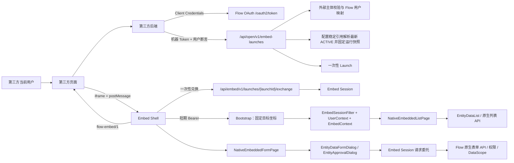
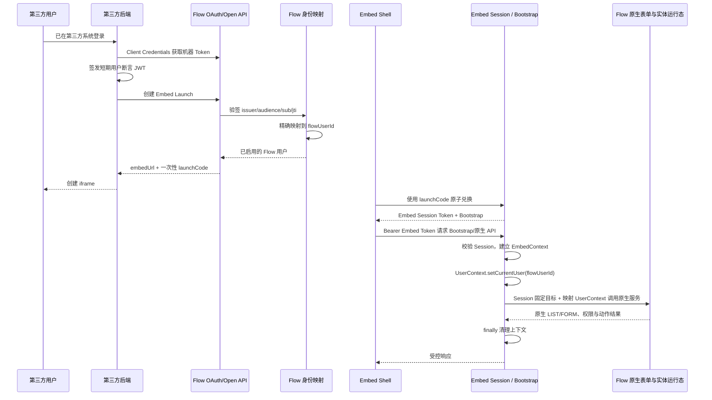
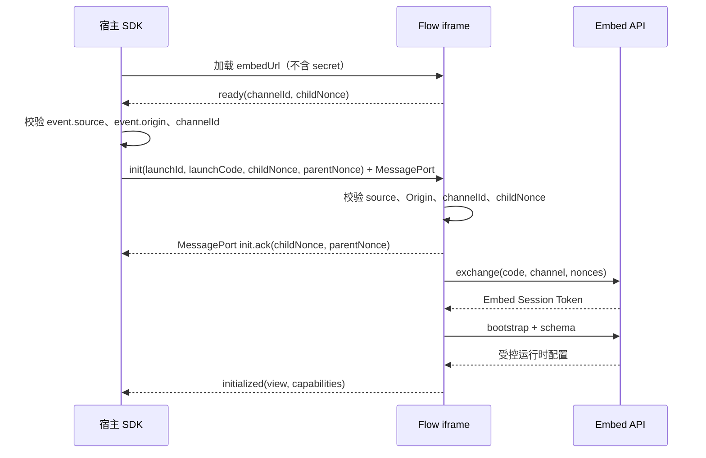
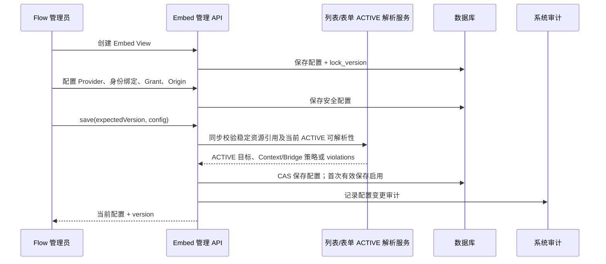
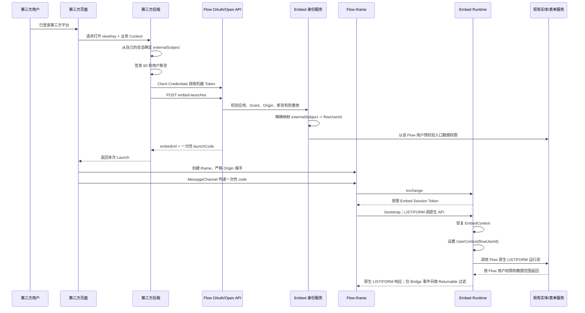
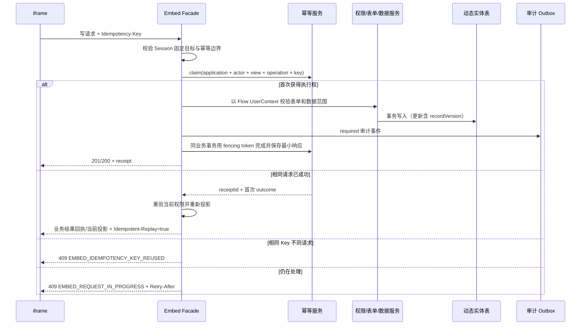
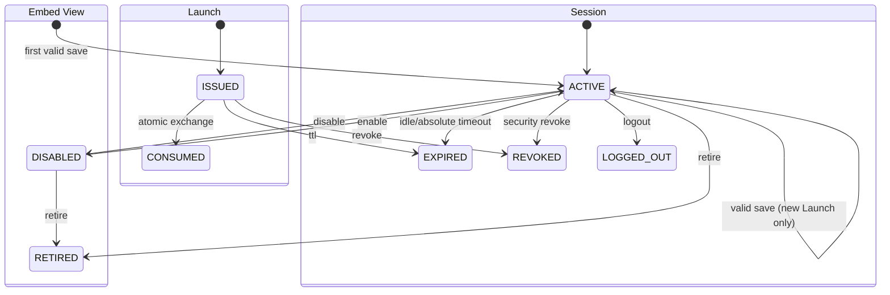

# Flow 第三方 iframe 嵌入运行时详细设计

> 状态：V1 Native LIST/FORM 单运行时架构已实现；仍需本机 MySQL 隔离迁移验证、跨浏览器/安全验收、生产部署与接入方联合评审
> 文档版本：1.3
> 日期：2026-09-10
> 适用范围：第三方平台通过 iframe 嵌入 Flow 已发布的实体列表、实体表单及受控相关操作
> 实现状态：当前分支以 `NativeEmbeddedListPage` / `NativeEmbeddedFormPage` 直接运行 Flow
> 原生列表与表单页面。Capability 只约束宿主直接入口和跨域 Bridge；页内新增、查看、编辑、
> 按钮、弹框及数据请求均按映射 Flow 用户的原生权限与 DataScope 执行。宿主直接
> RECORD_UPDATE 与独立 PROCESS_START 命令仍关闭。生产上线门槛见第 17.6、22、24.5 节
> V084 收缩说明：OAuth 不再签发或校验业务 Scope；凭有效应用凭据认证后，机器 Token
> 只能访问唯一保留的 Embed launch 边界。

## 0. 方案摘要

推荐建设“iframe Embed Runtime”，而不是把现有后台列表/表单 URL 直接公开。

| 关键问题 | 设计结论 |
| --- | --- |
| 第三方应用如何认证 | 第三方后端复用现有 OAuth Client Credentials；机器 Token 只允许访问 Embed launch |
| iframe 中的人如何对应 Flow 用户 | 第三方短期签名人员断言，经精确 Identity Binding 映射到已存在的 `flowUserId` |
| iframe 如何持续鉴权 | 一次性 Launch 兑换为短期、受限、仅内存的 Embed Session Token |
| Flow 权限如何生效 | 每次 Runtime 请求恢复真实 `UserContext`，继续执行现有功能权限、数据权限和行级动作 |
| 如何限制暴露范围 | Embed 配置 + Application Grant 固定列表/表单稳定资源引用、直接入口、Bridge、Origin、Returnable 和 Context；页内字段、动作与数据不再由 Embed 重写 |
| 可复用什么 | OAuth、应用、限流、审计、用户目录，以及 Flow 原生列表/表单页面、组件注册表、扩展点、请求与权限运行态 |
| 必须新开发什么 | Embed 管理模型、身份绑定、Launch/Session、安全链、薄 Shell、请求委托、SDK 与动态 CSP；LIST/FORM 均不新建字段、列、组件或数据源渲染器 |
| 当前 V1 | LIST/FORM 页面内部完整复用 Flow 原生运行时；宿主直接入口和跨域回传受控，宿主任意更新/动作/流程命令不开放 |

第三方浏览器永远不获得 Client Secret、机器 Token 或普通 Flow 用户 Token，也不能自行传入
`flowUserId/entityCode/listKey/formId/releaseId` 改变访问目标。

## 1. 背景与目标

Flow 的实体、表单、列表、流程、数据权限和 UI 发布能力已经具备较成熟的内部运行态。
新的接入需求是：第三方业务平台在自己的页面中，通过 iframe 嵌入 Flow 的某个实体列表、
新建表单或查看表单。iframe 内用户可执行哪些操作，与同一用户在 Flow 原生页面中的权限、
记录/流程状态和 DataScope 一致；“后续版本”仅指宿主跨域直接发起通用更新或动作命令。

该需求不是“公开匿名链接”，也不是“第三方前端直接调用任意实体 CRUD”。第三方页面中的
实际操作人需要对应到一个 Flow 用户，最终仍由 Flow 的功能权限、数据权限、发布配置和动作
规则进行授权。

### 1.1 建设目标

1. 为第三方平台提供稳定、版本化、可撤销的 iframe 嵌入协议。
2. 将第三方应用身份、第三方人员身份、Flow 用户身份明确分离。
3. 第三方用户精确映射到 Flow 用户，复用现有 `UserContext`、实体权限和数据范围。
4. 第三方只能从管理员保存的稳定列表/表单引用进入；页内字段和动作继续由 Flow 自身授权。
5. iframe 不依赖第三方 Cookie，不复用普通 Flow 登录 JWT，不跳转 Flow 登录页。
6. 复用现有已发布表单、列表和实体运行态，避免重新实现业务规则。
7. 接口具备稳定错误码、审计、限流、幂等、重放防护和版本兼容策略。
8. 未经真实接入需求验证的回调、附件、审批和 Headless API 不预留产品能力，出现需求后重新评审。

### 1.2 V1 已实现范围与关闭边界

当前分支已经交付 LIST/FORM 读取与 CREATE 写入链路。本文保留 UPDATE/ACTION/PROCESS 的目标
接口契约用于后续设计，但它们不是 V1 的宿主 Bridge 接口。这里的关闭不能用于隐藏或禁用
iframe 内 Flow 原生页面本来允许的按钮。

| 能力 | 当前 V1 状态 | 说明 |
| --- | --- | --- |
| 原生列表与查询 | 已实现 | `EntityDataList`、列表渲染器、数据源、筛选、按钮和弹框原样复用；数据按映射用户 DataScope |
| 记录选择并回传宿主 | 已实现，可配置开放 | 仅返回配置允许的字段，默认只返回记录 ID |
| 页内新建、查看、编辑与保存 | 已实现为原生页面行为 | 是否显示、可用和执行成功均以映射用户的 Flow 权限、对象授权、记录状态和 DataScope 为准 |
| 页内标准/自定义动作 | 复用 Flow 原生行为 | 不要求 View Capability/entryMode 白名单，也不维护 Embed Action Registry |
| 宿主直接编辑记录 | V1 Bridge 强制关闭 | 关闭的是第三方跨域 PATCH 命令，不是原生 LIST/FORM 页内编辑按钮 |
| 宿主直接执行任意动作 | V1 Bridge 强制关闭 | 关闭的是跨域通用命令，不是 iframe 内原生按钮 |
| 启动流程 | 仅 Published Form 内建通道 | 独立 `PROCESS_START` Capability/路由关闭；`saveAndStart` 只能由同一固定表单对映射用户实际开放时，通过服务端派生的专用创建事务执行 |
| 宿主直接删除、批量删除、导出 | Bridge 默认关闭 | 高风险跨域命令后续单独评审；不裁剪原生页内操作 |
| 审批、附件、关联内容 | 后续阶段 | 需要独立授权、对象校验和安全验收 |
| 匿名外部人员 | 不在 V1 | V1 要求映射到已存在且启用的 Flow 用户 |

### 1.3 非目标

1. 不把现有 `/entity-list/:entityCode/:listKey` 直接作为外部契约。
2. 不把 `/api/entity-lists/**`、`/api/entity-data/**` 或设计态接口改成公共接口。
3. 不把 OAuth Client Secret、普通 Flow Access Token 或长期 Embed Token 放入 iframe URL。
4. 不接受第三方传入的 `flowUserId`、权限码、SQL、数据范围表达式、`eventCode`、
   `operationCode`、`formId` 或 `releaseId` 作为可信授权依据。
5. 不允许合作方动态加载任意远程 JavaScript 到 Flow 页面。
6. V1 不实现外部人员即时创建 Flow 账号，也不使用共享服务账号代表所有外部用户。

## 2. 核心设计决策

### 2.1 iframe 是 V1 的运行载体，LIST 与 FORM 都是原生 Flow 页面

第三方始终通过稳定入口 `/embed/v1/launches/{launchId}` 创建 iframe，并由轻量 SDK 处理
`postMessage`。入口中的 Embed Shell 只负责 Launch 兑换、Session 生命周期、宿主桥接和错误态；
LIST 进入 `NativeEmbeddedListPage` 并直接挂载 `EntityDataList`；FORM 进入
`NativeEmbeddedFormPage`，实际挂载 Flow 原生 `EntityDataFormDialog` /
`EntityApprovalDialog`。两者都使用完整组件注册表、扩展点、样式和请求链。

这不是“把列表或表单配置投影后再在 Embed 中重画一次”。列渲染器、日期选择器、下拉弹层、
富文本、联动、确认框和后续新增组件都由 Flow 原生代码产生。只要新组件已经进入 Flow 原生
Registry，Embed 无需增加字段类型、组件或 datasource 白名单；Flow 激活新版本后，第三方的 `viewKey`、SDK 和 URL
规则保持不变。

直接输出 Vue 组件库或 Headless Schema API 可以作为后续能力，但不作为首期 FORM 方案。

### 2.2 应用认证与人员认证分离

- OAuth 2.0 Client Credentials 只证明“哪个第三方应用在调用”。
- 用户签名断言只证明“第三方当前登录人员是谁”。
- Flow 身份绑定决定“这个外部人员对应哪个 Flow 用户”。
- Flow 用户权限和数据范围决定“该人员在 Flow 中本来能做什么”。
- Embed 配置和 Application Grant 决定“允许从哪个直接入口进入、哪些值/命令可跨域”。

它们不参与 iframe 内原生按钮塑形，也不替代 Flow 用户权限。页内请求只按映射用户的既有
权限、对象授权、记录/流程状态和 DataScope 执行。

Client Credentials 不能单独证明当前人员身份。iframe、query 参数或宿主 JavaScript
声明的 `flowUserId` 不可信。

### 2.3 使用独立的受限 Embed Session

Embed Session 采用 256-bit 随机不透明 Bearer Token，数据库只保存 Token 哈希。该 Token：

- 仅由 `/api/embed/v1/**` 的专用认证过滤器，或带
  `X-Flow-Embed-Protocol: 1` 的原生请求委托分支接受；
- 只能访问 Embed 控制面和显式声明 `@EmbedDelegatedRuntimeApi` 安全契约的 Flow 原生端点；
  不能访问管理端、Open API 或未声明的普通 `/api/**`；
- 绑定应用、Embed 配置、Flow 用户、外部主体、父页面 Origin、Launch 时解析的目标 UI 运行快照、
  上下文快照和能力快照；
- 仅保存在 iframe 内存，不写入 Cookie、`localStorage` 或 `sessionStorage`；
- 默认空闲 5 分钟、绝对 30 分钟，可按应用在安全范围内配置；
- 支持立即撤销，应用、授权、身份绑定或 Embed View 停用后可使会话失效。

不直接复用普通 `AuthSessionService.createSession`，因为当前普通 JWT 没有独立 Audience、
Token 类型、Embed View、Origin 和动作能力绑定，发给 iframe 后会扩大接口访问面。

### 2.4 Session 请求委托，不复制 LIST/FORM API

浏览器先访问 `/api/embed/v1/**` 完成 Exchange、Session 和 Bootstrap。Bootstrap 只返回
Session 固定的目标坐标与模式，不返回可供 Embed 自行重画页面的字段或列投影。LIST 与 FORM
随后使用同一 Embed Session，通过受控请求委托进入 Flow 原生 API；委托层恢复映射用户的真实
`UserContext` 和固定目标，禁止浏览器改写 `flowUserId/entityCode/listKey/formId/releaseId`。

因此 LIST 活跃路径不得挂载 `EmbedListRuntime` 投影，FORM 活跃路径不得调用
`/api/embed/v1/runtime/form*`，也不得导入
`normalizeEmbedForm`、`TrustedPublishedFormRuntime`、`TrustedFormFieldRenderer` 或另一套字段注册表。
`selection.changed` / `form.saved` 的 Returnable 过滤发生在 Bridge 边界，不能反向裁剪 iframe
内的列表行、字段或原生 API 响应。

专用 Facade 同时执行两层授权：

```text
直接入口/Bridge：Embed 配置 ∩ Grant
iframe 页内：映射 Flow 用户现有权限、对象授权、DataScope、记录/流程状态
```

任何一层拒绝，操作即拒绝。

### 2.5 稳定 URL 与不可变会话快照

Embed 配置没有独立发布步骤或可选择的版本策略。管理员保存配置时持久化实体、列表和表单的
稳定资源引用；每个新 Launch 都从这些引用解析目标资源当前最新 ACTIVE 发布版，并立即物化为
该 Session 的不可变运行快照。已经打开的 Session 始终继续使用启动时快照，不会因管理端保存
配置或 Flow 资源激活新版本而在填写过程中漂移。

浏览器不能提交 `releaseId` 或 `releaseVersion` 来切换目标版本；这些精确版本坐标只存在于
服务端 Session 运行快照中。

LIST 与 FORM 的内部 canonical 配置均使用 `fieldPolicy.mode=FLOW_PUBLISHED`，且 `fieldPolicy` 只允许
`mode` 与 `returnable`。这里的 `FLOW_PUBLISHED` 表示“跳转到 Session 固定的 Flow 原生发布
页面”，不是字段兼容协议，也不是管理员需要手动设置的选项。LIST/FORM 均不接受
Visible/Queryable/Writable、组件参数、datasource 参数、按钮参数或 Runtime URL 重写。
`returnable` 只作为跨 iframe 回传宿主的显式上限；Context、映射 Flow 用户权限、DataScope
和固定 Release 校验继续在服务端执行。

LIST/FORM 不定义控件、渲染器或 datasource 白名单，也不维护 `cspSafe` 组件分支。它们直接运行
同一版本的 Flow 原生页面，因此内建组件、自定义扩展、弹出框和数据源的支持范围与 Flow
平台一致。安全边界放在“受控管理配置 + Session 固定目标 + 原生服务端权限校验 + 独立 Origin
CSP”，而不是在 Embed 端逐字段过滤或替换控件。第三方不能注入组件、脚本、HTML 或 URL；
能够进入表单的配置只能来自 Flow 自己的发布链。

Flow 激活新的 List/Form Release 后，下一次 Launch 在同一稳定 `viewKey` 与 URL
规则下解析最新 ACTIVE；已经打开的 Session 继续固定旧运行快照，避免填写中途漂移。

### 2.6 外部上下文只能缩小访问范围

第三方可在 Launch 时传入业务上下文，例如 `supplierId`、`projectId`。上下文必须通过
Embed 配置保存的 JSON Schema 校验，并由服务端映射为：

- 服务端固定过滤；
- 表单默认值；
- 服务端强制字段；
- 允许回传宿主的业务引用。

上下文不能覆盖 Flow 数据权限，不能作为 SQL、表达式或内部配置 ID 使用。运行时不允许
宿主通过 `postMessage` 任意变更安全上下文；需要变更时必须重新 Launch。

### 2.7 外部契约独立版本化

以下内容共同构成 Embed V1 外部契约：

- `/api/open/v1/embed-launches`；
- `/api/embed/v1/**`；
- iframe 页面 `/embed/v1/launches/{launchId}`；
- `flow-embed/1` postMessage 协议；
- 计划新增的 `docs/api/embed-v1.yaml`；
- SDK 的 V1 公共类型和事件。

同一主版本只能增加可选字段、能力或事件，不能删除字段、改变既有字段含义、改变认证方式
或复用既有错误码表达不同语义。破坏性变更使用 `/v2` 和 `flow-embed/2`。

### 2.8 LIST/FORM 单运行时架构不变量

以下条件属于架构门禁，而不是某几个字段的验收项：

1. Flow 管理端在配置内部保存 entity/list/form 的稳定资源引用；宿主只使用稳定 `viewKey`、
   Launch 响应的 `embedUrl` 和固定版本 SDK，不提交资源或版本坐标。
2. LIST 统一进入 `NativeEmbeddedListPage` 并挂载原生 `EntityDataList`；直接 FORM 与
   LIST 页内打开的表单统一进入原生表单组件，不能保留任一 Embed 页面投影分支。
3. 活跃模块图中不存在 `EmbedListRuntime`、`EmbedFormRuntime`、`normalizeEmbedForm`、
   `TrustedPublishedFormRuntime`、`TrustedFormFieldRenderer` 或 Embed 专用字段 Registry。
4. Flow 主应用与 Embed 入口调用同一个 `registerApplicationExtensions`，并由同一个
   `formFieldComponentMap` / 扩展 Registry 解析组件。
5. 新字段组件只要完成 Flow 注册、发布与权限接入，就能在新 Launch 中出现；不得要求修改
   `src/embed/**` 的 switch/case、Alias 或 Stub。
6. LIST/FORM 网络请求不走 Embed 专用字段/列 Schema；内部原生 target/API 是 Session 受控实现
   细节，不是宿主协议，也不能由宿主指定。

## 3. 当前能力与差距分析

### 3.1 可复用的现有能力

| 能力 | 现有实现 | 复用结论 |
| --- | --- | --- |
| 第三方应用、Client ID/Secret、启停和轮换 | `workflow-open-api` 的 `IntegrationApplicationService` | 直接作为 Embed Application 的机器身份根对象 |
| OAuth Client Credentials | `OpenIntegrationSecurityConfiguration` | 直接用于服务端 Launch API，不用于 iframe 运行态 |
| 应用来源网段、限流、并发租约 | `OpenApiApplicationPolicyFilter` 等 | 在唯一 Embed launch 边界复用 |
| 外部响应 Envelope、Trace、1 MiB 请求保护 | `OpenApiResponse`、`OpenApiRequestGuardFilter` | 外部 Launch 与 Embed API 统一复用其风格 |
| 凭据生成与哈希 | `IntegrationSecretGenerator`、`IntegrationSecretHasher` | 复用安全随机数和哈希设计，Token 不存明文 |
| 系统审计 | `SystemAuditPort`、`SystemAuditEvent` | 复用，模块归类为 `INTEGRATION` |
| Flow 用户目录 | `IdentityDirectoryPort`、`SysUserService` | 精确解析和校验映射后的 Flow 用户 |
| 当前用户上下文 | `UserContext` | Embed 过滤器建立并在请求后清理 |
| 列表页面/查询 | `EntityDataList.vue`、`EntityListRuntimeService`、`EntityListPublishedRuntimeService` | iframe 直接挂载同一原生页面，并通过受控请求委托复用同一 API |
| 表单页面与弹层 | `EntityDataFormDialog.vue`、`EntityApprovalDialog.vue`、完整字段/自定义组件 Registry | FORM 直接挂载原生组件树，不复制、裁剪或替换控件 |
| 表单解析、联动与提交 | 原生表单 API、`EntityFormResolveService`、`PublishedFormSubmissionService` | Embed Session 请求委托恢复同一 Flow 用户与固定 Release 后原样复用 |
| 实体详情和 CRUD | `EntityDataActionService` | 复用权限、数据范围、行级动作与审计 |
| 功能/行/按钮能力 | `EntityActionCapabilityService` | 作为 Flow 用户授权层继续执行 |
| 数据范围 | `DataPermissionEngine`、`EntityDataDynamicService` | 继续以映射后的 Flow 用户执行 |
| 列表前端渲染 | `EntityDataList.vue` 及查询区、表格、工具栏、弹框 | 直接挂载原组件；只调整 iframe 外壳与 Bridge，不抽取 Embed 专用展示层 |
| 表单字段、联动、动作条 | Flow 原生表单页面及其传递依赖 | 不抽取 Embed 专用副本；直接复用同一组件、API 和权限链 |

### 3.2 当前不能直接用于第三方 iframe 的部分

1. 当前实体列表路由挂在后台 `Layout` 下，会显示侧栏、菜单和后台导航。
2. 前端路由守卫在判断 public route 前无条件调用 `restoreAuthSession()`。
3. 全局请求客户端使用普通用户 Token、`withCredentials: true` 和 `/api/auth/refresh`。
4. Refresh Cookie 默认 `SameSite=Lax`，跨站 iframe 不能可靠使用。
5. 当前 Nginx 对全站设置 `frame-ancestors 'none'`，所有外部 iframe 均被禁止。
6. 当前内部列表/数据/表单接口接受 `entityCode`、`listKey`、`formId`、Release 等内部参数，
   暴露面过宽，缺少应用和 Embed View 绑定。
7. `UiEventRuntimeController`、`UiInterfaceOperationRuntimeController` 是内部泛化执行入口，
   不能允许外部浏览器指定任意事件或接口操作。
8. 当前动态实体更新没有通用乐观版本条件。若直接开放外部编辑，可能发生覆盖更新。
9. Embed 身份链路必须绑定 Application、Issuer/Namespace、Subject 和已验证断言，不能退回
   用户名猜测或已退役的开放流程身份模型。

### 3.3 相关现有代码

- `workflow-web/src/router/index.js`
- `workflow-web/src/shared/request/index.js`
- `workflow-web/nginx.conf`
- `workflow-web/src/views/entity/EntityDataList.vue`
- `workflow-web/src/views/entity/components/EntityDataFormDialog.vue`
- `workflow-server/workflow-app/src/main/java/com/workflow/config/CorsConfig.java`
- `workflow-server/workflow-admin/src/main/java/com/workflow/admin/auth/infrastructure/AuthInterceptor.java`
- `workflow-server/workflow-admin/src/main/java/com/workflow/admin/authorization/infrastructure/EndpointAuthorizationInterceptor.java`
- `workflow-server/workflow-open-api/src/main/java/com/workflow/openapi/security/OpenIntegrationSecurityConfiguration.java`
- `workflow-server/workflow-entity/src/main/java/com/workflow/entity/list/api/web/EntityListRuntimeController.java`
- `workflow-server/workflow-entity/src/main/java/com/workflow/entity/data/api/web/EntityDataController.java`
- `workflow-server/workflow-process/src/main/java/com/workflow/process/form/api/web/EntityFormResolveController.java`

## 4. 总体架构



### 4.1 模块边界

建议新增 `workflow-embed` Maven 模块，仍保持现有模块化单体部署，不新增独立微服务。

```text
workflow-open-api
  └─ 复用机器 OAuth、应用策略；新增窄的 Embed Launch Controller

workflow-embed（新增）
  ├─ Embed 配置/Grant 管理与 Session 运行快照
  ├─ 外部身份提供方与身份绑定
  ├─ Launch 与 Session 生命周期
  ├─ Embed 认证过滤器、Bootstrap、LIST/FORM 原生请求委托
  ├─ EmbedContext、限流、幂等和审计
  └─ 管理端 API

workflow-contracts（新增契约）
  ├─ EmbedLaunchIssuePort
  ├─ LIST/FORM 固定目标与不可变依赖快照读取契约
  ├─ 原生请求委托契约（不定义字段、组件或 datasource 投影契约）
  ├─ EmbedRecordRuntimePort
  └─ ExternalSubjectResolver / EmbedActor

workflow-entity / workflow-process
  └─ 实现 Adapter，内部调用现有 Runtime/Application Service

workflow-admin
  └─ 用户目录、UserContext、权限与审计基础

workflow-web
  ├─ 管理端 Embed 配置页面
  ├─ 独立 Embed Shell 与 NativeEmbeddedListPage（薄壳）
  ├─ 原生 EntityDataList 与完整列表渲染器/扩展 Registry
  ├─ NativeEmbeddedFormPage（薄壳）
  ├─ 原生 EntityDataFormDialog / EntityApprovalDialog 与完整 Registry
  └─ framework-agnostic iframe SDK
```

`workflow-open-api` 不直接依赖 `workflow-embed` 实现。建议在 `workflow-contracts` 定义
`EmbedLaunchIssuePort`，由 `workflow-embed` 实现，Open API Controller 只调用契约端口。
`workflow-embed` 也不得直接访问实体或流程 Mapper。

### 4.2 三类接口边界

| 接口组 | 调用方 | 认证 | 用途 |
| --- | --- | --- | --- |
| 管理端 `/api/embed-management/v1/**` | Flow 管理员浏览器 | 普通 Flow 用户 JWT + 权限码 | 配置保存、授权、身份绑定、撤销会话 |
| Launch `/api/open/v1/embed-launches` | 第三方后端 | OAuth Client Credentials 机器 Token | 验证应用和人员、创建一次性 Launch |
| Runtime `/api/embed/v1/**` | Flow 域名内的 iframe | 一次性 code 或 Embed Session Token | Exchange、Bootstrap、Bridge 与 Session 生命周期 |
| 原生 LIST/FORM API 委托 | Flow 域名内的 iframe | Embed Session Token + `X-Flow-Embed-Protocol: 1` | 校验 Session 固定目标后恢复映射用户，复用原生页面、请求、组件、按钮、数据源、权限与 DataScope；Capability 不用于裁剪页内功能 |

第三方宿主页面不直接跨域调用任何 Runtime API。iframe 由 Flow Embed 域名加载，并同源访问
`/api/embed/v1/**` 控制面及显式声明安全契约的原生 LIST/FORM API，因此不需要为合作方页面开放泛化 CORS，
也不得把整个 `/api/**` 暴露给 Embed Token。

## 5. 领域模型与术语

### 5.1 Integration Application

现有 `integration_application`。表示一个第三方系统及其机器身份、Client Credentials、
来源网段、限流和并发策略。Embed 不重新创建一套 Client ID/Secret。

### 5.2 Embed View

管理员可编辑并直接保存的嵌入配置。管理端选择目标后在内部持久化实体、列表和表单的稳定
资源引用；第三方只通过稳定 `viewKey` 引用。

一个 View 可以是：

- `LIST`：管理端只选择实体和列表；iframe 内直接运行该列表的 Flow 原生页面；
- `FORM`：以 CREATE 或 VIEW 作为第三方直接入口，页面本身仍运行 Flow 原生表单。

### 5.3 Session 运行快照

Embed 配置没有独立发布对象。第一次有效保存即启用。每次新 Launch 读取已保存配置，并将稳定
目标引用解析为当前最新 ACTIVE 列表/表单版本，再连同直接入口、Bridge、上下文绑定和 UI
配置固定到 Session 运行快照。该快照只服务当前 Session，不作为管理员可选择或回滚的产品版本；
页内字段、按钮、组件和 datasource 不进入 Embed 投影策略。

### 5.4 Application Grant

表示某个 Integration Application 获准使用某个 Embed View。Grant 包含应用级覆盖策略：

- 精确允许的父页面 Origin；
- 能力上限；
- 外部身份提供方；
- 是否允许可信应用直接声明外部用户 ID；
- 有效期、状态和并发/会话限制。

### 5.5 External Identity Provider

第三方人员断言的信任配置，包括 Issuer、Audience、JWKS/公钥、允许算法、时钟偏差和身份
Namespace。V1 支持：

- `SIGNED_JWT`：推荐，Flow 验证第三方短期签名 JWT；
- `TRUSTED_EXTERNAL_ID`：仅对明确授权的内部可信应用开放。

`OIDC_ID_TOKEN` 预留到后续阶段，因为标准 ID Token 的 Audience、寿命、Nonce 和重放语义
与本方案的 60 秒一次性人员断言不同，不能直接按相同规则验收。

### 5.6 External Identity Binding

精确映射：

```text
(applicationId, issuer/namespace, externalSubject) -> flowUserId
```

禁止按姓名、手机号或可修改用户名模糊匹配。V1 不自动创建 Flow 用户。

### 5.7 Embed Launch

一次性、短期启动凭据，默认 60 秒有效。绑定应用、Embed 配置、Flow 用户、外部主体、
父页面 Origin、上下文和新 Launch 解析出的 UI 运行快照。Launch code 仅返回一次，数据库只保存哈希。

状态：`ISSUED -> CONSUMED`，或 `ISSUED -> EXPIRED/REVOKED`。并发兑换只能有一个成功。

### 5.8 Embed Session

iframe 运行时会话。状态为 `ACTIVE`、`LOGGED_OUT`、`REVOKED` 或 `EXPIRED`。Session 保存：

- Application、Grant、Embed 配置及 Session 运行快照；
- Flow 用户及外部主体；
- 父页面 Origin 和 postMessage channel；
- 上下文和能力快照；
- 表单/列表 UI Release 快照；
- Token 哈希、空闲和绝对过期时间；
- 撤销版本与审计字段。

### 5.9 能力枚举

V1 定义以下稳定外部能力枚举。Capability 只控制第三方直接入口或跨 iframe Bridge，不是
原生 LIST/FORM 页内按钮白名单；页内操作始终按映射用户的 Flow 权限、对象授权、记录状态与
DataScope 判断：

| 能力 | 含义 | 当前 V1 配置状态 |
| --- | --- | --- |
| `LIST_QUERY` | 允许宿主从 LIST 入口启动 | 已实现；不控制列表页内查询控件或按钮 |
| `SELECTION_RETURN` | 将经过 Returnable 过滤的选择结果返回宿主 | 已实现，仅作用于 Bridge |
| `RECORD_VIEW` | 允许宿主从 VIEW 入口启动 | 已实现；不控制列表页内查看按钮或内部导航 |
| `RECORD_CREATE` | 允许宿主从 CREATE 入口启动 | 已实现；不控制列表页内新建按钮和原生保存 |
| `RECORD_UPDATE` | 宿主直接编辑记录 | Bridge 强制关闭；不影响原生页面内编辑 |
| `ACTION_EXECUTE` | 宿主跨域执行任意动作的保留能力 | 通用 Bridge 命令未开放；不控制原生列表/表单按钮 |
| `PROCESS_START` | 通用流程启动 Capability | 强制关闭；同一 Published Form 的内建 `saveAndStart` 不授予该 Capability，而是走受信任 `RECORD_CREATE_AND_START` 专用事务链 |
| `RECORD_DELETE` | 宿主直接删除单条记录 | Bridge 强制关闭；不影响原生页面内按 Flow 权限开放的操作 |
| `BATCH_DELETE` | 宿主直接批量删除 | Bridge 强制关闭；不影响原生页面内按 Flow 权限开放的操作 |
| `EXPORT` | 宿主直接导出 | Bridge 强制关闭；不影响原生页面内按 Flow 权限开放的操作 |
| `FILE_UPLOAD` / `FILE_DOWNLOAD` | 宿主直接调用通用文件 API | Bridge 强制关闭；原生页面内附件组件仍按映射用户和 Flow 存储权限运行 |

配置能力只是直接入口和 Bridge 的上限，不替代 Flow 用户权限，也不参与页内按钮显隐。

## 6. 身份映射与鉴权详细设计

### 6.1 身份链路



### 6.2 第三方用户断言

推荐断言为最长 60 秒的签名 JWT，至少包含：

```json
{
  "iss": "https://id.partner.example",
  "sub": "user-10086",
  "aud": "flow-embed-launch",
  "iat": 1787719200,
  "exp": 1787719260,
  "jti": "814d23d7-7c90-4ed0-a6c0-c3bc0f18d38d"
}
```

校验规则：

1. `iss` 必须与 Grant 绑定的 Identity Provider 完全一致。
2. `aud` 必须包含 `flow-embed-launch`，不能接受 Flow 普通 API Audience；该规则针对
   V1 `SIGNED_JWT` 人员断言。
3. `sub` 必填、长度不超过 128，作为外部稳定不可变人员标识。
4. `exp - iat` 最大 60 秒；默认允许 30 秒时钟偏差。
5. `jti` 必填，并在有效窗口内禁止重放。
6. 只允许管理员登记的非对称签名算法，默认 `RS256` 或 `ES256`；拒绝 `none` 和动态算法降级。
7. 根据登记公钥或受控 JWKS 地址验签，不接受请求携带的任意 `jku`、`x5u`。
8. 断言只证明身份，不接受第三方断言中的角色、权限或数据范围作为 Flow 授权。

`TRUSTED_EXTERNAL_ID` 模式不携带签名断言，但只有 Grant 明确设置
`trustedSubjectAssertion=true` 时允许。此模式意味着该 Integration Application 可以代表其
Namespace 下任意已绑定用户，应配合最小来源网段、强审计和更低限流。

### 6.3 Flow 用户映射算法

1. 取得经过验证的 `applicationId + issuer/namespace + externalSubject`。
2. 精确查询 ACTIVE Identity Binding。
3. 找不到映射时返回 `EXTERNAL_IDENTITY_NOT_MAPPED`，不按用户名猜测。
4. 使用 `IdentityDirectoryPort`/用户服务加载 `flowUserId`。
5. 检查用户存在、未禁用、未删除；密码重置限制是否阻止 Embed 由安全策略配置，默认阻止。
6. 将映射版本和 Flow 用户 ID 固定到 Launch 和 Session。
7. 每个 Runtime 请求重新检查用户有效状态；角色和数据权限不写入长期 Token，继续从 Flow
   当前权限服务计算，使权限变更在短缓存窗口内生效。

当前实现由 `EmbedSignedAssertionVerifierPort` 产出 `VerifiedExternalSubject`，再通过
`EmbedExternalIdentityBindingPort` 精确查询 ACTIVE Binding；Application、Issuer/Namespace
和 Subject 均保持在 Embed 专用边界内。

### 6.4 Embed Session 认证过滤器

新增 `EmbedSessionAuthenticationFilter`，匹配 `/api/embed/v1/**`，并对第 11.6.1 节由端点声明
安全契约的原生 LIST/FORM API 在出现 `X-Flow-Embed-Protocol: 1` 时进入受控委托分支：

1. 读取 `Authorization: Bearer <opaqueToken>`。
2. 对 256-bit 随机 Token 计算 SHA-256 后查询 `embed_session`，明文 Token 从不落库。
3. Runtime、查询和 Heartbeat 只接受 ACTIVE 且未超过 idle/absolute expiry 的 Session。
   `DELETE /session` 使用同一 Token 摘要但走受限 Logout 分支：只允许 ACTIVE 执行终止，
   LOGGED_OUT 仅返回幂等 204，不建立业务 UserContext；其他终态按对应过期/撤销错误返回。
4. 检查 Application、Grant、View、Identity Provider、Identity Binding 和 Flow 用户仍有效，
   且各安全版本与 Session 快照一致。
5. 检查请求目标属于 Session 绑定 View；原生 API 的 entity/form/release/record 坐标必须命中
   Session 固定目标，拒绝把 Embed Token 当作普通 Flow Token访问其它 API。
6. 创建 `EmbedContext`，包含 application/view/release/origin/externalSubject/context/capabilities。
7. 调用 `UserContext.setCurrentUser(flowUserId, username, sessionId)`。
8. LIST/FORM 均执行原生 EndpointAuthorization/Application Service，不经过字段、列或动作投影 Facade。
9. 在 `finally` 中清理 `UserContext`、`EmbedContextHolder` 和日志 MDC。
10. 最多每 30 秒更新一次 `last_seen_at`，避免每个查询都写数据库。

`/api/embed/v1/**` 由专用策略处理；原生 LIST/FORM API 委托则必须在恢复映射 UserContext 后继续
执行普通 `EndpointAuthorizationInterceptor` 和 DataScope，不能标注 `@PublicApi`，也不能因
存在 Embed Token 跳过原权限链。

### 6.5 权限决策顺序

权限判断分成“直接入口/Bridge”和“iframe 页内原生请求”两类，均 Fail Closed：

1. Session 有效；
2. Application/Grant/View/Identity Provider/Identity Binding/Flow 用户有效；
3. 只有宿主直接启动 LIST/CREATE/VIEW 或调用 Bridge 时，才检查 Session 固定的 Capability、
   entry mode 与 Grant Ceiling；
4. iframe 页内原生请求只校验 Session 固定目标与依赖闭包，不能再要求 View Capability 或
   entry mode；列表、表单、字段、按钮和组件由原生发布页与映射 Flow 用户权限决定；
5. 上下文固定条件已应用且不可覆盖；
6. Flow 用户拥有实体标准权限；
7. Flow 数据范围允许访问目标行；
8. Flow 原生列表按钮/表单动作解析结果允许；
9. 记录状态允许操作；
10. 写请求幂等和乐观锁通过。

记录不存在和无权访问统一返回 404 `EMBED_RESOURCE_NOT_FOUND`，避免 IDOR 枚举。

## 7. Embed 配置与运行快照模型

### 7.1 推荐配置示例

```json
{
  "viewKey": "req-list",
  "name": "需求列表",
  "surfaceType": "LIST",
  "target": {
    "entityCode": "ZDWREQ",
    "listKey": "list001"
  },
  "entryModes": ["LIST"],
  "capabilities": [
    "LIST_QUERY",
    "SELECTION_RETURN"
  ],
  "fieldPolicy": {
    "mode": "FLOW_PUBLISHED",
    "returnable": ["id"]
  },
  "queryPolicy": {
    "allowTotal": false,
    "maxPageSize": 100
  },
  "contextSchema": {
    "type": "object",
    "additionalProperties": false,
    "properties": {}
  },
  "contextBindings": [],
  "ui": {
    "showSearch": true,
    "showPagination": true,
    "showToolbar": true,
    "pageSize": 20,
    "heightMode": "AUTO"
  }
}
```

上例是服务端 canonical 快照示意，不是要求管理员手填编码的表单。管理页面中 LIST 只需先选
“实体”，再从该实体下拉列表选择“列表”；示例使用稳定资源 `req-list / ZDWREQ / list001`，
不填写任何不存在的 Application、Provider、Binding 或 Grant ID。

`fieldPolicy.mode=FLOW_PUBLISHED` 表示运行 Flow 原生发布页面。LIST/FORM 都不接受
`actionPolicy`、`visible/queryable/writable`、组件参数或 datasource 白名单；原生操作栏、列、
字段、弹框和数据源继续与映射用户在 Flow 中的结果一致。`returnable` 只限制 Bridge 回传宿主的值。

### 7.2 保存校验

保存 Embed 配置时必须同步校验，不存在单独发布步骤：

1. View Key 全局唯一，创建后不可变。
2. 实体存在；LIST 仅保存实体与该实体所属列表的稳定资源引用，不要求手填编码、Release 或默认表单。
3. 目标 List/Form 存在 ACTIVE Release。每次新 Launch 重新解析最新 ACTIVE；已经打开的
   Session 固定启动时版本。
4. LIST/FORM 出现 `visible/queryable/writable`、`actionPolicy`、组件或 datasource 覆盖时拒绝保存，
   防止历史投影配置继续改变原生页面。
5. Returnable 字段必须属于目标资源且排除不允许跨 iframe 回传的敏感字段；它只裁剪 Bridge
   消息，不裁剪 iframe 内的原生 API 响应或页面显示。
6. 列表和表单按钮不做 Embed Action Key 白名单校验；名称、顺序、显隐、禁用原因与执行结果
   由原生页面和映射用户权限决定。
7. Context Schema 大小不超过 16 KiB、深度和属性数受限，禁止远程 `$ref`；V1 不支持
   `contextSchema.pattern`，配置中出现该关键字时以 `SCHEMA_PATTERN_NOT_SUPPORTED` 拒绝
   保存；历史兼容数据或篡改快照在 Launch 时同样 Fail Closed。字符串约束使用 `enum`、
   `minLength`、`maxLength` 等受控关键字。
8. Context Binding 目标字段存在，固定过滤和强制字段不能被客户端覆盖。
9. LIST 与 FORM 目标都必须能解析当前 ACTIVE Release；不存在 ACTIVE 时保存失败。
10. LIST/FORM 的内建和自定义组件、数据源、Lookup、弹框与事件绑定沿用 Flow 原生注册/发布
    治理；Embed 不维护兼容白名单，后续 Flow 新组件无需修改 Embed 框架。

### 7.3 Application Grant

Grant 至少配置：

```json
{
  "applicationId": "integration-app-1",
  "viewId": "embed-view-1",
  "allowedOrigins": ["https://portal.partner.example"],
  "identityProviderId": "partner-idp-1",
  "capabilityCeiling": [
    "LIST_QUERY",
    "SELECTION_RETURN",
    "RECORD_VIEW",
    "RECORD_CREATE"
  ],
  "trustedSubjectAssertion": false,
  "maxActiveSessionsPerUser": 3,
  "expiresAt": null,
  "status": "ACTIVE"
}
```

Origin 必须是规范化的 `scheme://host[:port]`，生产只允许 HTTPS，不允许 `*`、路径、用户名、
fragment、通配子域或混合大小写绕过。

### 7.4 配置生命周期

```text
View: ACTIVE <-> DISABLED -> RETIRED（首次有效保存即 ACTIVE）
Session 运行快照：Launch 时创建，Session 生命周期内不可变
Grant: ACTIVE <-> DISABLED -> REVOKED；到期后按 EXPIRED 处理
Identity Provider: ACTIVE <-> DISABLED -> REVOKED
Identity Binding: ACTIVE <-> DISABLED -> REVOKED
```

保存 View 配置只影响后续新 Launch，已打开 Session 固定原运行快照。禁用 View、Grant、
应用或身份绑定默认立即阻止新 Launch，并使现有 Session 在下一个请求失效。

## 8. 接口通用约定

### 8.1 路径与版本

- 管理端：`/api/embed-management/v1/**`，内部契约，不对第三方承诺。
- 服务端 Launch：`/api/open/v1/embed-launches`，属于 Open API V1。
- 浏览器运行时：`/api/embed/v1/**`，属于 Embed Runtime V1。
- iframe 页面：`https://embed.flow.example.com/embed/v1/launches/{launchId}`。
- postMessage：`protocol = flow-embed/1`。

### 8.2 内容类型与编码

- JSON 接口：`application/json; charset=UTF-8`。
- OAuth Token：现有 `application/x-www-form-urlencoded`。
- 时间：UTC ISO-8601，例如 `2026-08-26T08:30:00Z`。
- ID：字符串，不向外承诺数据库格式或递增规律。
- 客户端必须忽略未知响应字段和未知非关键事件。

### 8.3 请求头

| Header | 使用范围 | 要求 |
| --- | --- | --- |
| `Authorization: Bearer ...` | Launch / Runtime | Launch 使用机器 Token；Runtime 使用 Embed Token |
| `X-Trace-Id` | 全部外部 API | 可选，1–64 位 `[A-Za-z0-9._-]`；非法时服务端重新生成 |
| `X-Request-Id` | 全部外部 API | 可选，同样限制为 1–64 位；响应总是返回 |
| `Idempotency-Key` | Runtime 写操作 | 必填，1–128 个非空可打印 ASCII 字符 |
| `X-Flow-Embed-Protocol` | Exchange、Bootstrap 必填；SDK 对 Runtime 统一发送 | 固定 `1`；Exchange 或 Bootstrap 缺失/不为 `1` 时返回 400 |

关键响应头：

| Header | 场景 | 语义 |
| --- | --- | --- |
| `X-Trace-Id/X-Request-Id` | 全部 API | 返回服务端最终采用的关联 ID |
| `Idempotent-Replay: true` | 写请求命中成功回执 | 本次没有再次执行业务，Body 已按当前权限投影 |
| `Retry-After: <seconds>` | 409 处理中或 429/503 | 非负整数秒，客户端保留原幂等键并退避 |
| `Cache-Control: no-store` | 所有动态/凭据响应 | 中间层和浏览器不得缓存 |

V1 的记录详情和创建响应固定 `recordVersion=null` 且不返回 ETag；未来更新接口使用的
`If-Match/ETag` 契约只见第 11.9、16.4 节，不属于当前请求头或响应头。

### 8.4 响应 Envelope

所有 JSON 外部响应使用真实 HTTP 状态，并采用现有 Open API 风格：

```json
{
  "code": 200,
  "message": "success",
  "errorCode": null,
  "data": {},
  "traceId": "trace-20260826-001"
}
```

错误示例：

```json
{
  "code": 403,
  "message": "Embed action is not allowed",
  "errorCode": "EMBED_OPERATION_NOT_ALLOWED",
  "data": null,
  "traceId": "trace-20260826-001"
}
```

客户端只能基于 HTTP 状态和 `errorCode` 编写逻辑，不依赖 `message` 文案。

### 8.5 缓存与敏感响应

Launch、Exchange、Bootstrap、Session 和所有包含用户/表单数据的响应设置：

```http
Cache-Control: no-store
Pragma: no-cache
Referrer-Policy: no-referrer
```

静态 hash JS/CSS 资源可长缓存。Token、Launch code、用户断言和完整 Context 不得写入日志、
审计详情、指标标签或浏览器错误上报。

### 8.6 请求大小与分页

- 默认请求体最大 1 MiB，Launch Context 单独限制 16 KiB。
- 列表 `pageNum` 默认 1；`pageSize` 默认取 View 配置并受 Bootstrap/Schema 的 `maxPageSize` 限制。
- 列表过滤项最多 32 个，`IN` 值最多 100 项，字符串过滤值最大 2,048 字符。
- 表单字段数量和嵌套深度沿用已发布表单校验，并额外限制总 JSON 大小。

### 8.7 幂等约定

- Launch 与 OAuth Token 一样属于短期凭据签发，不使用业务幂等响应缓存。调用方超时可重新
  创建一个新 Launch，旧 Launch 在 60 秒后过期；不得把 launchCode 写入现有明文
  `integration_idempotency_record.response_body`。
- 当前 V1 的记录创建必须携带 `Idempotency-Key`；更新和动作尚未注册，未来启用时沿用该规则。
- 沿用现有存储唯一范围 `Application + Operation + Idempotency-Key`。请求哈希使用稳定的
  `actorScopeDigest + viewKey + target + operation + canonicalBody`。RECORD_CREATE 的 canonical
  target 固定为稳定业务坐标 `entityCode + formId`，明确排除 Session ID、Launch ID、View/Form/List
  Release ID、Trace、Token 和时间戳；这样 iframe 丢失 Session 或发布版本变化后仍可在当前授权下
  用原键安全查询首次最小回执。
- 同一稳定 Actor/View/Operation/Key 使用相同请求体时返回首次业务结果；请求体不同，或同一
  Key 被其他 Actor/View 使用时返回 409 `EMBED_IDEMPOTENCY_KEY_REUSED`。
- 重放前仍要校验新 Session、Flow 用户、View 授权及当前对象可见性，且按当前 Output Policy
  重新投影；授权已撤销时拒绝重放，绝不能泄漏旧响应。
- 幂等记录不得持久化完整敏感表单正文；V1 只保存 `receiptId/outcomeCode` 固定 Envelope。
  未来确需保存敏感回执时必须新增专用密文字段和版本化契约，不能把它塞进明文
  `response_body`。
- 创建或流程启动在客户端超时时不得盲目换新幂等键重试。

### 8.8 Release 和安全参数不由浏览器指定

浏览器 Runtime 请求不得包含并影响以下可信参数：

```text
applicationId, flowUserId, entityCode, listKey, formId,
listReleaseId, formReleaseId, releaseVersion, fixedFilter,
allowedActions, dataScope, eventCode, serviceId, operationCode
```

这些参数一律从 Embed Session 运行快照恢复。若响应中为渲染需要返回某些标识，
服务端后续仍必须忽略客户端回传值并以 Session 快照为准。

## 9. 管理端接口设计

管理端接口供 Flow 管理员配置“哪些资源可以被哪些应用、以什么身份、从哪些页面嵌入”。
它们继续使用普通 Flow 登录会话、现有统一响应结构和 Endpoint 权限拦截器，不开放给
第三方服务器或 iframe。

### 9.1 管理端权限码

| 权限码 | 用途 |
| --- | --- |
| `system:embed:view` | 查看 View、Grant 和运行状态 |
| `system:embed:manage` | 创建和修改 View、Grant、Origin |
| `system:embed:identity-manage` | 管理 Identity Provider 和身份绑定 |
| `system:embed:session-revoke` | 查询并撤销 Launch/Session |

配置保存、身份映射、Origin 变更和会话撤销属于高风险管理操作，除接口权限外还应进入现有系统
审计；是否增加二次确认由管理端产品策略决定。

### 9.2 Embed View 接口

| 方法与路径 | 权限 | 说明 |
| --- | --- | --- |
| `GET /api/embed-management/v1/views` | `system:embed:view` | 分页查询 View |
| `POST /api/embed-management/v1/views` | `system:embed:manage` | 新建 View；首次有效配置保存后启用 |
| `GET /api/embed-management/v1/views/{viewId}` | `system:embed:view` | 查看 View 摘要 |
| `GET /api/embed-management/v1/views/{viewId}/draft` | `system:embed:view` | 获取当前草稿 |
| `PATCH /api/embed-management/v1/views/{viewId}/draft` | `system:embed:manage` | 乐观锁更新草稿 |
| `POST /api/embed-management/v1/views/{viewId}/status` | `system:embed:manage` | 启用、禁用或退役 |

分页查询参数：

| 参数 | 类型 | 必填 | 规则 |
| --- | --- | --- | --- |
| `keyword` | string | 否 | 匹配 `viewKey` 或名称，最大 100 字符 |
| `status` | string | 否 | `ACTIVE/DISABLED/RETIRED`；`DRAFT` 仅为未完成历史数据兼容状态 |
| `surfaceType` | string | 否 | `LIST/FORM` |
| `applicationId` | string | 否 | 查询已授权给某应用的 View |
| `pageNum` | integer | 否 | 默认 1 |
| `pageSize` | integer | 否 | 默认 20，最大 100 |

新建请求：

```json
{
  "viewKey": "req-list",
  "name": "供应商工单",
  "surfaceType": "LIST",
  "description": "供供应商门户查询和新建工单"
}
```

返回 `201 Created`，`data` 至少包含：

```json
{
  "id": "ev_01K...",
  "viewKey": "supplier-work-orders",
  "name": "供应商工单",
  "surfaceType": "LIST",
  "status": "ACTIVE",
  "draftRevision": 1,
  "version": 1
}
```

草稿更新请求：

```json
{
  "expectedVersion": 1,
  "draft": {
    "target": {
      "entityCode": "ZDWREQ",
      "listKey": "list001"
    },
    "entryModes": ["LIST"],
    "capabilities": [
      "LIST_QUERY",
      "SELECTION_RETURN"
    ],
    "fieldPolicy": {
      "mode": "FLOW_PUBLISHED",
      "returnable": ["id"]
    },
    "queryPolicy": {
      "allowTotal": false,
      "maxPageSize": 100
    },
    "contextSchema": {},
    "contextBindings": [],
    "ui": {
      "showSearch": true,
      "showPagination": true,
      "showToolbar": true,
      "pageSize": 20,
      "heightMode": "AUTO"
    }
  }
}
```

`expectedVersion` 与 View 当前 `version` 不一致时返回 409
`EMBED_CONFIGURATION_VERSION_CONFLICT`，响应返回当前版本号，但不自动覆盖。

保存操作同步解析稳定资源引用并执行完整校验。校验失败返回 422
`EMBED_VIEW_VALIDATION_FAILED`，`data.violations` 最多返回 100 项：

```json
{
  "code": 422,
  "message": "Embed view validation failed",
  "errorCode": "EMBED_VIEW_VALIDATION_FAILED",
  "data": {
    "violations": [
      {
        "path": "fieldPolicy.writable[0]",
        "code": "FIELD_NOT_WRITABLE",
        "message": "字段不在已发布表单的可写字段中"
      }
    ]
  },
  "traceId": "trace-..."
}
```

状态更新请求：

```json
{
  "expectedVersion": 3,
  "status": "DISABLED",
  "reason": "合作方维护"
}
```

`DISABLED` 默认阻止新 Launch，并使相关 ACTIVE Session 在下次请求时失效；`RETIRED` 为终态，
不得恢复。接口返回受影响的活动会话数量。

### 9.3 Application Grant 接口

| 方法与路径 | 权限 | 说明 |
| --- | --- | --- |
| `GET /api/embed-management/v1/views/{viewId}/grants` | `system:embed:view` | 查询 View 的应用授权 |
| `PUT /api/embed-management/v1/views/{viewId}/grants/{applicationId}` | `system:embed:manage` | 创建或更新授权 |
| `POST /api/embed-management/v1/views/{viewId}/grants/{applicationId}/status` | `system:embed:manage` | 启用或禁用 |
| `POST /api/embed-management/v1/views/{viewId}/grants/{applicationId}/revoke` | `system:embed:manage` | 永久撤销 |

Upsert 请求：

```json
{
  "expectedVersion": null,
  "status": "ACTIVE",
  "identityProviderId": "eidp_01K...",
  "trustedSubjectAssertion": false,
  "allowedOrigins": [
    "https://portal.partner.example"
  ],
  "capabilityCeiling": [
    "LIST_QUERY",
    "SELECTION_RETURN",
    "RECORD_VIEW",
    "RECORD_CREATE"
  ],
  "maxActiveSessionsPerUser": 3,
  "maxSessionSeconds": 1800,
  "launchLimitPerMinute": 60,
  "runtimeLimitPerMinute": 120,
  "maxConcurrency": 20,
  "expiresAt": null
}
```

规则：

1. `expectedVersion=null` 仅可用于首次创建；已有 Grant 时必须传当前版本。
2. `allowedOrigins` 至少一个、最多 20 个，只接受精确 Origin。
3. Grant 的 Capability 必须是 Embed 配置 Capability 的子集。
4. Grant 不选择配置或资源版本；每个新 Launch 都解析最新 ACTIVE，Session 固定启动快照。
5. 所有配额只能收窄全局安全上限，不能通过 Grant 关闭平台硬限制。
6. `REVOKED` 为终态；需要重新合作时创建新的 Grant，而不是恢复旧授权。

### 9.4 Identity Provider 接口

| 方法与路径 | 权限 | 说明 |
| --- | --- | --- |
| `GET /api/embed-management/v1/identity-providers` | `system:embed:identity-manage` | 分页查询身份提供方 |
| `POST /api/embed-management/v1/identity-providers` | `system:embed:identity-manage` | 创建 |
| `GET /api/embed-management/v1/identity-providers/{providerId}` | `system:embed:identity-manage` | 查看脱敏配置 |
| `PATCH /api/embed-management/v1/identity-providers/{providerId}` | `system:embed:identity-manage` | 乐观锁更新 |
| `POST /api/embed-management/v1/identity-providers/{providerId}/status` | `system:embed:identity-manage` | 启用或禁用 |
| `POST /api/embed-management/v1/identity-providers/{providerId}/revoke` | `system:embed:identity-manage` | 永久撤销 |
| `POST /api/embed-management/v1/identity-providers/{providerId}/rotate-key` | `system:embed:identity-manage` | 轮换静态公钥 |

创建 `SIGNED_JWT` Provider 示例：

```json
{
  "name": "合作方 A 登录中心",
  "type": "SIGNED_JWT",
  "issuer": "https://id.partner.example",
  "audiences": ["flow-embed-launch"],
  "subjectNamespace": "partner-a",
  "algorithms": ["RS256"],
  "jwksMode": "STATIC_JWK_SET",
  "jwks": {
    "keys": [
      {
        "kty": "RSA",
        "kid": "partner-a-2026-08",
        "use": "sig",
        "alg": "RS256",
        "n": "...",
        "e": "AQAB"
      }
    ]
  },
  "clockSkewSeconds": 30,
  "maxAssertionLifetimeSeconds": 60
}
```

如使用远程 JWKS，只允许管理员配置的 HTTPS 地址，必须设置连接/读取超时、响应大小上限、
DNS/私网访问策略和缓存；不得读取断言 Header 中任意 `jku` 或 `x5u`。管理端响应不回显私钥
或历史密钥明文。

### 9.5 外部身份绑定接口

| 方法与路径 | 权限 | 说明 |
| --- | --- | --- |
| `GET /api/embed-management/v1/identity-bindings` | `system:embed:identity-manage` | 按应用、Provider、Flow 用户、状态查询；只返回 Subject Hint |
| `POST /api/embed-management/v1/identity-bindings/lookup` | `system:embed:identity-manage` | Body 中提交外部 Subject 做精确脱敏查询 |
| `POST /api/embed-management/v1/identity-bindings` | `system:embed:identity-manage` | 创建精确绑定 |
| `POST /api/embed-management/v1/identity-bindings/{bindingId}/status` | `system:embed:identity-manage` | 启用或禁用 |
| `POST /api/embed-management/v1/identity-bindings/{bindingId}/revoke` | `system:embed:identity-manage` | 永久撤销 |

创建请求：

```json
{
  "applicationId": "integration-app-1",
  "identityProviderId": "eidp_01K...",
  "externalSubject": "user-10086",
  "flowUserId": "2070000000000000001",
  "effectiveAt": "2026-08-26T08:00:00Z",
  "expiresAt": null,
  "remark": "供应商门户账号绑定"
}
```

服务端从 Provider 取得 Issuer/Namespace，不接受请求另行覆盖。创建时校验 Flow 用户存在且启用；
唯一键为 `applicationId + identityProviderId + externalSubject`。返回中外部 Subject 默认脱敏，
审计日志只记录 HMAC 指纹。原始 Subject 不得放 GET Query、URL 或访问日志；`lookup` 请求体同样
走敏感字段日志擦除。

精确查询请求：

```json
{
  "applicationId": "integration-app-1",
  "identityProviderId": "eidp_01K...",
  "externalSubject": "user-10086"
}
```

命中时只返回 `bindingId/subjectHint/flowUserId/status/effectiveAt/expiresAt`，未命中返回空结果，
不回显原始 Subject。

### 9.6 Launch 和 Session 运维接口

| 方法与路径 | 权限 | 说明 |
| --- | --- | --- |
| `GET /api/embed-management/v1/launches` | `system:embed:view` | 按应用、View、状态和时间查询 Launch 摘要 |
| `POST /api/embed-management/v1/launches/{launchId}/revoke` | `system:embed:session-revoke` | 撤销尚未消费的 Launch |
| `GET /api/embed-management/v1/sessions` | `system:embed:view` | 查询活动/历史 Session |
| `POST /api/embed-management/v1/sessions/{sessionId}/revoke` | `system:embed:session-revoke` | 撤销单个 Session |
| `POST /api/embed-management/v1/views/{viewId}/sessions/revoke` | `system:embed:session-revoke` | 撤销 View 下所有活动 Session |
| `POST /api/embed-management/v1/applications/{applicationId}/sessions/revoke` | `system:embed:session-revoke` | 撤销应用下所有活动 Session |

查询接口不得返回 Token 哈希、Launch code 哈希、完整 Context 或原始外部 Subject。撤销请求：

```json
{
  "reason": "SECURITY_INCIDENT",
  "remark": "合作方密钥疑似泄露"
}
```

撤销成功返回受影响数量；对已经终止的对象重复撤销按成功处理，并写“重复撤销”审计。

## 10. 第三方服务端对接接口

### 10.1 获取机器 Access Token（复用现有）

第三方后端继续调用现有 OAuth 2.0 Client Credentials：

```http
POST /oauth2/token
Authorization: Basic base64(client_id:client_secret)
Content-Type: application/x-www-form-urlencoded

grant_type=client_credentials
```

响应沿用 OAuth 标准格式：

```json
{
  "access_token": "machine-access-token",
  "token_type": "Bearer",
  "expires_in": 900
}
```

Open API 安全链只向机器 Token 暴露精确的 Embed launch 路由，不签发或校验业务 Scope。
Client Secret 和机器 Token 只能保存在第三方后端，不得下发给浏览器。

### 10.2 创建 Embed Launch（新增）

```http
POST /api/open/v1/embed-launches
Authorization: Bearer <machine-access-token>
Content-Type: application/json
X-Trace-Id: partner-20260826-001
```

请求：

```json
{
  "viewKey": "supplier-work-orders",
  "parentOrigin": "https://portal.partner.example",
  "channelId": "66f82f09-89ec-4a5a-b81b-f54f02d22262",
  "subject": {
    "type": "SIGNED_JWT",
    "assertion": "eyJhbGciOiJSUzI1NiIsImtpZCI6Ii4uLiJ9..."
  },
  "entry": {
    "mode": "LIST"
  },
  "context": {
    "supplierId": "S-10086"
  },
  "ui": {
    "locale": "zh-CN",
    "theme": "light",
    "formPresentation": "seamless"
  }
}
```

请求字段：

| 字段 | 类型 | 必填 | 约束 |
| --- | --- | --- | --- |
| `viewKey` | string | 是 | 1–100，必须已完成有效保存、处于 ACTIVE 且已授权给当前应用；Embed 配置没有发布步骤 |
| `parentOrigin` | string | 是 | 精确 `scheme://host[:port]`，必须命中 Grant |
| `channelId` | UUID/string | 是 | 16–128 个安全字符，由宿主每次启动随机生成 |
| `subject.type` | enum | 是 | V1 为 `SIGNED_JWT/TRUSTED_EXTERNAL_ID`；OIDC 值留待后续版本 |
| `subject.assertion` | string | 条件必填 | V1 短期签名 JWT，最大 16 KiB |
| `subject.namespace` | string | 可信 ID 模式必填 | 必须在 Grant 允许范围 |
| `subject.externalUserId` | string | 可信 ID 模式必填 | 1–128，不得直接传 Flow 用户 ID |
| `entry.mode` | enum | 是 | V1 仅 `LIST/CREATE/VIEW`，且必须是配置允许的宿主直接入口；不限制 LIST 页内原生导航 |
| `entry.recordId` | string | VIEW 必填 | 最长 64；只作为候选记录，Runtime 读取时仍需 Flow 数据范围和行级查看权限校验 |
| `context` | object | 否 | 符合保存的 JSON Schema，最大 16 KiB、最多 32 个属性 |
| `ui.locale` | string | 否 | 目标 Flow 资源支持的语言，默认 `zh-CN` |
| `ui.theme` | string | 否 | `light/dark/system`，只影响展示 |
| `ui.formPresentation` | enum | 否 | `seamless/dialog`，默认 `seamless`；控制直接表单及 LIST 内打开表单的展示方式，不影响授权 |

`TRUSTED_EXTERNAL_ID` 请求示例：

```json
{
  "subject": {
    "type": "TRUSTED_EXTERNAL_ID",
    "namespace": "erp-prod",
    "externalUserId": "user-10086"
  }
}
```

此模式只在 Grant 明确授权时接受；它代表接入应用可声明该 Namespace 中任意已绑定主体，风险
高于签名断言。

成功返回 `201 Created`：

```json
{
  "code": 201,
  "message": "created",
  "errorCode": null,
  "data": {
    "launchId": "lch_01K...",
    "embedUrl": "https://embed.flow.example.com/embed/v1/launches/lch_01K...",
    "launchCode": "base64url-256-bit-one-time-secret",
    "expiresAt": "2026-08-26T08:31:00Z",
    "view": {
      "key": "supplier-work-orders",
      "surfaceType": "LIST",
      "revision": 7
    },
    "protocolVersion": "flow-embed/1"
  },
  "traceId": "partner-20260826-001"
}
```

`launchCode` 只在该响应中返回一次，数据库只保存 SHA-256。推荐由第三方后端通过
自己的已认证接口把 `embedUrl + launchId + launchCode + expiresAt` 返回当前浏览器，再由 SDK
通过严格 Origin 的 MessageChannel 传给 iframe。无官方 SDK、但宿主手工实现完整握手协议时，
可以把 code 放在 URL fragment；页面读取后立即 `history.replaceState` 清除，禁止放在 query
参数。

### 10.3 Launch 服务端校验顺序

服务端按以下顺序执行，任何失败都不签发凭据：

1. 机器 Token 有效，且请求命中唯一开放的 Embed launch 路由；
2. Integration Application 为 ACTIVE，来源 CIDR、应用限流和并发租约通过；
3. View、Release 和 Application Grant 有效且未过期；
4. `parentOrigin` 规范化后精确命中 Grant；
5. 用户断言的 Issuer、Audience、算法、签名、有效期、`jti` 防重放通过；
6. 外部主体精确绑定到一个已启用 Flow 用户；
7. `entry.mode` 只属于 `LIST/CREATE/VIEW` 且被 Release 发布；CREATE/LIST 禁止 `recordId`，
   VIEW 必须携带候选 `recordId`；
8. Context、Locale 和 Theme 符合 Release；VIEW 的记录存在性和数据范围在 Runtime 读取时统一
   校验并以 404 防枚举，Launch 不建立第二套记录查询旁路；
9. 计算 Release 与 Grant 的 Capability 交集，并再次剔除 V1 禁用能力；
10. 事务写入 Launch、审计事件和一次性 `launchCodeDigest`。

Launch 创建不使用普通业务幂等缓存。调用超时后第三方重新创建即可，旧 Launch 最长 60 秒
过期；重试必须签发新的人员断言和 `jti`，不能重放旧断言。这样避免为了返回同一 secret 而
保存 launchCode 明文。

## 11. iframe 页面与 Runtime API

```http
GET /embed/v1/launches/{launchId}
```

入口页本身不消费 Launch，也不返回任何业务数据。服务端/Nginx 根据 Launch 中已校验的
`parentOrigin` 生成精确 CSP，例如：

```http
Content-Security-Policy: default-src 'self'; frame-ancestors https://portal.partner.example; object-src 'none'; base-uri 'none'
Cache-Control: no-store
Referrer-Policy: no-referrer
X-Content-Type-Options: nosniff
```

入口 HTML 只内嵌经过 JSON 安全序列化的
`launchId + expectedParentOrigin + channelId + protocolVersion`，供 Shell 在收到任何
`postMessage` 前校验父页面；不内嵌用户、Context、权限、code 或 Token。响应使用 CSP Nonce
时，Nonce 每次生成且不写入日志。

未知、过期或撤销的 `launchId` 返回通用不可嵌入错误页。生产建议使用独立
`embed.flow.example.com`，管理后台继续保持 `frame-ancestors 'none'`。

### 11.2 兑换 Embed Session

```http
POST /api/embed/v1/launches/{launchId}/exchange
Content-Type: application/json
X-Flow-Embed-Protocol: 1
```

请求：

```json
{
  "launchCode": "base64url-256-bit-one-time-secret",
  "channelId": "66f82f09-89ec-4a5a-b81b-f54f02d22262",
  "parentOrigin": "https://portal.partner.example",
  "parentNonce": "base64url-random",
  "childNonce": "base64url-random",
  "sdkVersion": "1.0.0"
}
```

该路由不使用机器 Token，也不进入普通 Flow 用户认证链；它只接受未消费、未过期且所有绑定
均匹配的 Launch。消费必须使用带状态、过期时间和 code 哈希条件的单条原子更新，两个并发
兑换恰好一个成功。

`childNonce` 由 iframe 生成并在 `ready` 中发出，`init` 必须原样回显；`parentNonce` 由
宿主生成，iframe 通过已转移的 MessagePort 回显确认。服务端校验两个 Nonce 的格式和长度并
将摘要固定到 Session，用于关联和阻止通道混用；服务端无法仅凭请求体独立证明浏览器
`event.origin`，Origin 的真实性由入口 CSP 和 Shell 对 Window `event.origin/source` 的校验
共同保证。Launch code 才是 Exchange 的一次性认证凭据。

成功返回：

```json
{
  "data": {
    "sessionId": "ems_01K...",
    "accessToken": "opaque-embed-session-token",
    "tokenType": "Bearer",
    "expiresAt": "2026-08-26T09:00:00Z",
    "idleExpiresAt": "2026-08-26T08:35:00Z",
    "heartbeatAfterSeconds": 60,
    "bootstrapUrl": "/api/embed/v1/runtime/bootstrap",
    "protocolVersion": "flow-embed/1"
  }
}
```

不提供 Refresh Token。Token 仅保存于 iframe JavaScript 内存。兑换响应丢失或页面刷新后，
Launch 已消费，宿主必须通过自己的后端创建新 Launch。

### 11.3 Bootstrap

```http
GET /api/embed/v1/runtime/bootstrap
Authorization: Bearer <embed-session-token>
X-Flow-Embed-Protocol: 1
```

响应：

```json
{
  "data": {
    "session": {
      "id": "ems_01K...",
      "expiresAt": "2026-08-26T09:00:00Z",
      "idleExpiresAt": "2026-08-26T08:35:00Z"
    },
    "actor": {
      "displayName": "张三"
    },
    "view": {
      "key": "supplier-work-orders",
      "name": "供应商工单",
      "surfaceType": "LIST",
      "revision": 7,
      "entryMode": "LIST"
    },
    "capabilities": [
      "LIST_QUERY",
      "SELECTION_RETURN",
      "RECORD_VIEW",
      "RECORD_CREATE"
    ],
    "ui": {
      "locale": "zh-CN",
      "theme": "light",
      "formPresentation": "seamless",
      "showSearch": true,
      "showPagination": true,
      "showToolbar": true,
      "pageSize": 20,
      "heightMode": "AUTO"
    },
    "limits": {
      "maxPageSize": 100,
      "maxPayloadBytes": 1048576,
      "maxSelectionSize": 100
    }
  }
}
```

`actor` 只返回渲染所需最小信息。不得返回 Application Secret、内部权限码、固定过滤表达式、
数据范围、Provider/JWK、Token 哈希、发布解析 Token 或未公开字段。

### 11.4 LIST 原生页面与 Bridge 投影边界

LIST 不再提供 `/api/embed/v1/runtime/schema` 或 `/api/embed/v1/runtime/list/query` 作为页面
渲染数据源，也不生成 `ExternalActionDescriptor`。`NativeEmbeddedListPage` 直接挂载
`EntityDataList`，由它读取 Session 固定的 exact List Release，并调用 Flow 原生列表 Schema、
查询、筛选、排序、按钮和数据源 API。这样列顺序、富渲染器、弹框、新建/查看/编辑入口以及
后续新增组件都天然与 Flow 原页面一致。

“原生页面”不代表宿主可取得整行数据。只有用户选择记录且配置开放 `SELECTION_RETURN` 时，
Bridge 才从原生选择结果构造最小 `selection.changed` 消息；服务端与前端都按
`fieldPolicy.returnable` 再过滤一次，默认只回传记录 ID，禁止把整行对象、内部权限、数据源
参数、运行时 Token 或未声明敏感字段发送给宿主。

### 11.5 LIST 查询与权限

列表查询沿用 Flow 原生请求格式和服务。受控委托层只允许请求命中 Session 固定列表及其
Launch-time immutable dependency closure，随后恢复映射用户并执行原有
EndpointAuthorization、对象授权、列表规则与 DataScope。客户端不能把 Embed Token 用于其它
实体、列表或任意 Release，也不能通过 query/body 改写 Session 固定坐标。

筛选条件、排序、分页、列显示和总数策略均来自固定 List Release 与原生页面；Embed 不再维护
Queryable、Visible、列表动作或 datasource 白名单。页内工具栏和行按钮只按映射用户在 Flow
原系统中的权限、记录状态与 DataScope 显示，View/Grant Capability 不参与求交。

### 11.6 FORM 原生页面与受控请求委托

FORM 不再提供 `GET /api/embed/v1/runtime/form*` 字段投影接口。直接 FORM 的 Bootstrap 向
`NativeEmbeddedFormPage` 提供 Session 固定目标；LIST→CREATE/VIEW 由 Shell 内部调用
`GET /api/embed/v1/runtime/native-form-target?mode=...&recordId=...`，服务端再从同一 Session 和
Session 不可变运行快照派生目标。两者都只返回 `entityCode/formId/formReleaseId`、版本、发布解析
Token、入口模式以及 VIEW 固定记录 ID。这是 iframe 内部实现接口，不是宿主/第三方契约；宿主
不能调用、保存或通过 Launch/消息修改这些坐标。

薄页面直接挂载 Flow 原生 `EntityDataFormDialog` / `EntityApprovalDialog`。因此字段、布局、
日期/日期时间选择器、Select/MultiSelect Popper、Radio、Checkbox、Switch、富文本、级联、
校验提示、确认框、操作栏、自定义扩展和未来组件都来自同一原生组件树与 Registry。FORM
路径不得导入 `normalizeEmbedForm`、`TrustedPublishedFormRuntime`、
`TrustedFormFieldRenderer`，不得维护 `cspSafe` 控件分支或第二份字段映射表。

#### 11.6.1 原生 API 认证委托

原生页面发出的请求统一携带：

```http
Authorization: Bearer <opaque-embed-session-token>
X-Flow-Embed-Protocol: 1
```

服务端先验证 Embed Session、Origin 绑定和固定 LIST/FORM Release，再恢复 Binding
映射的 Flow `UserContext`。之后继续经过普通 EndpointAuthorization、字段权限、DataScope、
行级能力和业务校验。请求委托不是一个“允许调用任意内部 API”的代理：未声明
`@EmbedDelegatedRuntimeApi` 的端点默认拒绝；已声明端点按 `TargetBinding` 校验 URI
template/body/query 中的 entity/list/form/release/record 与 Session 固定目标或依赖闭包一致。
页内标准请求不要求 View Capability/entryMode；Capability 只在直接入口或 Bridge 端点检查。
中央策略不维护组件类型、datasource、URL 或 eventCode 清单。

当前原生页面使用的主要端点包括：

| 用途 | 原生端点 | Embed 约束 |
| --- | --- | --- |
| 实体元数据 | `GET /api/entity/code/{entityCode}` | `entityCode` 必须等于 Session 固定目标 |
| 固定表单 Release | `GET /api/entity-forms/{formId}/runtime-release` | `releaseId/version/releaseResolutionToken` 必须来自 Bootstrap |
| 操作栏 | `POST /api/ui-runtime/form-actions/resolve` | 按映射用户、模式、记录/流程状态实时解析 |
| 字典树 | `GET /api/system/dict/item/tree/code/{dictCode}` | 使用原生字段声明的数据源与原权限检查 |
| 唯一性预检 | `POST /api/entity-form/{formId}/unique-precheck` | 固定 Form，结果只作交互提示，最终提交再次校验 |
| 记录详情 | `POST /api/entity-data/entity/{entityCode}/detail/{recordId}/load` | VIEW 固定记录并再次执行 DataScope |
| 创建与回执 | `POST /api/embed/v1/runtime/records` | 保留 Embed 幂等、receipt 和 Returnable 回投边界 |

新增组件复用已有 Flow API 时无需修改 Embed。只有组件新增后端端点时，该端点需要声明标准
TargetBinding 并继续经过普通 Flow 权限链；这属于原生端点的安全契约，不是 Embed 组件兼容
或中央 URL/eventCode 登记，也不能要求管理员给新组件增加 Capability。

#### 11.6.2 按钮、弹层与权限的一致性

操作按钮不从 Embed `actionPolicy` 生成。`POST /api/ui-runtime/form-actions/resolve` 在每次
需要时以映射 Flow 用户执行，名称、图标、样式、顺序、显隐、禁用原因、确认框、当前记录/
流程状态和 availabilityRule 均与 Flow 原生运行页一致。Application Grant 和 Capability 只
收窄第三方直接入口或跨域 Bridge，不会授予、隐藏或禁用页内按钮。标准按钮与自定义按钮均
不要求 `ACTION_EXECUTE`；它们只按映射用户的端点权限、对象权限、DataScope 与业务规则显示和执行。

Element Plus Popper、日期面板和对话框 Teleport 到 iframe 自己的 `document.body`。
Entry CSP 必须允许 Flow 原生组件运行所必需的样式属性，同时保持 `script-src` 不允许
第三方 inline script/unsafe-eval；表单配置仍只能来自 Flow 可信发布链。不得以 CSP 为理由
替换为 native input、自制 Select 或精简富文本。

#### 11.6.3 最新 ACTIVE 与未来组件

每个新 Launch 都从配置保存的稳定资源引用解析当前最新 ACTIVE List/Form Release，
并固定到新 Session；已打开 Session 不热切换。Flow 新增字段、注册新组件或
更新弹层实现后，只需按正常流程激活目标资源并更新前端版本，新 Launch 即从同一原生 Registry 加载，
第三方的 `viewKey`、Launch Body、SDK 代码和 Embed URL 规则全部保持不变。

架构验收必须包含“未来组件 canary”：在 Flow 原生 Registry 登记测试组件，不改任何
`src/embed/**` 字段分支，即可在 iframe 中渲染并走原生权限/API；若必须修改 Embed
渲染器才能出现，说明实现重新引入了双运行时，应阻断发布。

### 11.7 获取记录详情

FORM VIEW 使用上节原生详情端点，不再通过 Embed DTO 重画表单。记录不存在与映射 Flow 用户
无权访问应保持原生安全语义，且不能借 Embed 探测越权记录。LIST 为选择回传保留自己的最小
External Record DTO；该投影边界不得反向裁剪 FORM 页面。

### 11.8 创建记录

原生表单收集完整发布态值并执行同一客户端校验、联动和按钮确认；最终 CREATE 暂保留：

```http
POST /api/embed/v1/runtime/records
Authorization: Bearer <opaque-embed-session-token>
X-Flow-Embed-Protocol: 1
Idempotency-Key: <stable-key-for-this-submit>
Content-Type: application/json
```

该端点只承担 Session 固定目标校验、Context 强制值、幂等/fencing、最小 receipt 与
`form.saved` Returnable 回投，不再按 Embed 字段类型白名单投影输入。服务端仍以固定
Published Form 和映射用户重新执行字段权限、必填、唯一性、业务规则及保存/保存并发起权限。
浏览器不能提交 entity、form、release、创建人、组织、权限、流程定义或 `startProcess`。

`actionKey` 只允许当前原生操作栏实际开放的 `save/saveAndStart`。同一
Idempotency-Key 下切换动作或业务内容返回 409；重放只返回当前权限允许的最小回执，不会再次
创建记录或启动流程。

### 11.9 更新记录
### 11.9 更新记录

> **后续目标契约，V1 不可用。** 当前版本不注册该 PATCH 路由，Embed 配置保存校验拒绝
> `RECORD_UPDATE`，Bootstrap/Schema 也不会投影编辑能力。以下请求/响应保留用于
> `record_version` 全链路完成后的兼容设计，不能作为当前接入依据。

```http
PATCH /api/embed/v1/runtime/records/{recordId}
Authorization: Bearer <embed-session-token>
Idempotency-Key: partner-order-update-2080000000000000001-v17
If-Match: "rv-17"
Content-Type: application/json
```

请求：

```json
{
  "expectedRecordVersion": 17,
  "data": {
    "description": "更换零件后复测"
  },
  "clientMutationId": "host-request-10002"
}
```

Header 和 Body 版本必须一致。更新 SQL 必须形如：

```sql
UPDATE <dynamic_entity_table>
   SET ..., record_version = record_version + 1
 WHERE id = ?
   AND record_version = ?;
```

更新 0 行时重新检查可见性：不可见/不存在返回 404，可见但版本已变化返回 409
`RECORD_VERSION_CONFLICT`。不能用 `update_time` 代替乐观锁。

成功返回 `200 OK` 和新 ETag：

```http
ETag: "rv-18"
```

```json
{
  "data": {
    "receiptId": "eor_01K...",
    "record": {
      "id": "2080000000000000001",
      "recordVersion": 18,
      "values": {
        "description": "更换零件后复测"
      }
    },
    "effects": [],
    "clientMutationId": "host-request-10002"
  }
}
```

版本冲突响应只对仍可见的记录返回当前版本：

```json
{
  "code": 409,
  "message": "Record has been changed",
  "errorCode": "RECORD_VERSION_CONFLICT",
  "data": {
    "currentRecordVersion": 18
  },
  "traceId": "trace-..."
}
```

当前动态实体表没有通用 `record_version`，因此完成第 16.4 节的乐观锁建设前：

- Embed 配置保存校验不得允许 `RECORD_UPDATE`；
- Bootstrap/Schema 不返回更新能力；
- 当前版本不注册更新路由；未来注册后，在能力未开放时返回 403 `EMBED_OPERATION_NOT_ALLOWED`；
- 不应先上线一个可能覆盖他人数据的临时实现。

### 11.10 执行动作

V1 不建立 `/api/embed/v1/runtime/actions/*` 或 Embed Action Registry。原生表单先调用
`form-actions/resolve` 获取与 Flow 页面相同的按钮，再直接调用按钮本来使用的 Flow
`ui-runtime` 端点。这样按钮名称、顺序、显隐、确认框、弹层、事件链和未来扩展都由 Flow
发布运行态负责，Embed 不按 `actionKey/eventCode` 重写动作。

iframe 页内动作授权必须同时满足：

1. 目标 Handler 已声明受控请求委托契约；
2. TargetBinding 能把请求坐标固定到当前 Session 的 List/Form Release、依赖闭包和记录；
3. 映射 Flow 用户通过原端点的 EndpointAuthorization、对象权限、DataScope 和业务规则；
4. 未声明端点、坐标不匹配、任意脚本或任意 URL 一律默认拒绝。

按钮解析与执行都不读取 View/Grant 的 `ACTION_EXECUTE`。该 Capability 只为未来宿主跨域直接
执行动作预留，不能导致原生按钮“可见但点击 403”，也不能让第三方 Application 获得映射用户
原本没有的按钮。
Published Form 内建 `saveAndStart` 继续走第 11.8 节的专用创建事务，不等同于开放独立
`PROCESS_START`。

### 11.11 心跳、查询会话与退出

```http
GET /api/embed/v1/session
Authorization: Bearer <embed-session-token>
```

返回会话状态和到期时间，不返回 Token。

```http
POST /api/embed/v1/session/heartbeat
Authorization: Bearer <embed-session-token>
Content-Type: application/json

{
  "visible": true,
  "clientTime": "2026-08-26T08:31:00Z"
}
```

响应：

```json
{
  "data": {
    "status": "ACTIVE",
    "idleExpiresAt": "2026-08-26T08:36:00Z",
    "absoluteExpiresAt": "2026-08-26T09:00:00Z",
    "nextHeartbeatAfterSeconds": 60
  }
}
```

心跳只能把 idle expiry 延长到 absolute expiry 以内；后台不可见时 SDK 应暂停高频心跳。
`clientTime` 和 `visible` 仅用于诊断/节流，服务端到期判断只使用服务端时钟，不能信任客户端
时间。

```http
DELETE /api/embed/v1/session
Authorization: Bearer <embed-session-token>
```

成功和已退出都返回 `204 No Content`。为了支持网络重试，专用 Logout Guard 只允许该 Token
命中 ACTIVE 或 LOGGED_OUT Session：ACTIVE 原子终止并释放 slot，LOGGED_OUT 只做无副作用
重放；它不能调用任何 Runtime 业务服务。Token 对其他接口随即永久失效；关闭 iframe 时 SDK
尽力发送，但服务端仍以超时清理为最终兜底。

## 12. iframe SDK 与 postMessage 协议

### 12.1 SDK 职责

建议发布无框架依赖的 `@flow/embed-sdk`，React/Vue 包装层只做生命周期适配。SDK 负责：

- 创建和销毁 iframe；
- 以精确 Origin 和 MessageChannel 传递一次性 Launch code；
- 协议版本、channel、nonce、source 和消息大小校验；
- 自动高度、主题、语言和宿主事件；
- Session 过期时触发宿主重新 Launch；
- 不保存机器 Token、普通 Flow Token 或 Embed Token。

### 12.2 宿主对接示例

第三方后端先封装自己的业务接口：

```http
POST /partner-api/work-orders/flow-embed-launch
Cookie: <第三方自己的登录会话>

{
  "entry": {"mode": "LIST"},
  "channelId": "66f82f09-89ec-4a5a-b81b-f54f02d22262"
}
```

该后端从自己的登录会话确定外部 Subject，签名断言并调用 Flow Launch API。第三方浏览器
不得自己提交“我要代表哪个用户”给一个无校验的代理接口；`viewKey` 建议由该业务路由固定，
`supplierId/projectId` 等安全 Context 必须由后端根据登录会话和业务授权派生，不能原样信任
浏览器值。该代理接口必须使用第三方现有登录鉴权与 CSRF 防护，并返回
`Cache-Control: no-store`。

宿主前端：

```javascript
const channelId = crypto.randomUUID()

const launch = await fetch('/partner-api/work-orders/flow-embed-launch', {
  method: 'POST',
  credentials: 'same-origin',
  headers: {'Content-Type': 'application/json'},
  body: JSON.stringify({
    entry: {mode: 'LIST'},
    channelId
  })
}).then(response => response.json())

const widget = FlowEmbed.mount({
  container: document.querySelector('#flow-work-orders'),
  embedUrl: launch.embedUrl,
  launchId: launch.launchId,
  launchCode: launch.launchCode,
  channelId,
  targetOrigin: 'https://embed.flow.example.com',
  height: {mode: 'auto', min: 480, max: 1200},
  onEvent(event) {
    if (event.type === 'selection.changed') {
      updateSelectedWorkOrder(event.payload.selection)
    }
    if (event.type === 'session.expired') {
      showReopenButton()
    }
  }
})

// 页面卸载或组件销毁时调用。
widget.destroy()
```

`launchCode` 在传输给 iframe 后立即从宿主 SDK 内存中清除。SDK 不写入浏览器存储和分析日志。
SDK 必须校验 `embedUrl` 为 HTTPS、Origin 与显式 `targetOrigin` 完全一致且 Path 属于
`/embed/v1/launches/`；不能直接信任合作方接口返回的任意 URL。

### 12.3 握手时序



iframe 的 `ready` 只携带非敏感信息。父页面必须以
`targetOrigin=https://embed.flow.example.com` 发送，不得使用 `*`。iframe 只接受
`event.source === window.parent` 且 `event.origin === launch.parentOrigin` 的初始化消息。

### 12.4 消息 Envelope

```json
{
  "protocol": "flow-embed/1",
  "type": "selection.changed",
  "launchId": "lch_01K...",
  "channelId": "66f82f09-89ec-4a5a-b81b-f54f02d22262",
  "messageId": "base64url-random-message-id",
  "requestId": null,
  "timestamp": "2026-08-26T08:32:00Z",
  "childNonce": "base64url-child-nonce",
  "parentNonce": "base64url-parent-nonce",
  "payload": {}
}
```

要求：

- 单条消息最大 256 KiB；字段字符串仍限 100,000 字符，并受消息总字节上限二次约束，
  以支持经 Returnable 审核的富文本而不允许无界 Payload；
- `messageId` 每个 channel 唯一，用于去重和诊断；
- 命令使用 `requestId`，iframe 以 `ack` 或 `error` 回应；
- 未知可选事件可忽略，未知命令必须返回 `UNSUPPORTED_MESSAGE_TYPE`；
- Payload 必须经过 JSON Schema 校验，禁止原型污染字段；
- 选择和保存事件按 View `outputPolicy/fieldPolicy.returnable` 再投影。

Window 握手消息必须校验 `event.origin` 和 `event.source`。MessagePort 建立后，Port 消息
本身没有可靠的 `origin/source` 字段，因此不再做不存在的 Origin 判断，而是校验已绑定的
Port、`protocol/channelId/childNonce/parentNonce/messageId` 和 Payload Schema。

### 12.5 iframe 发给宿主的事件

| type | 当前状态 | 何时触发 | 核心 Payload |
| --- | --- | --- | --- |
| `ready` | 已实现，Window 握手 | Shell 已加载、尚未兑换 | `launchId, channelId, childNonce, supportedVersions` |
| `init.ack` | 已实现，MessagePort 握手 | iframe 接受唯一 Port | `launchId, channelId, childNonce, parentNonce` |
| `ack` | 已实现 | 接受宿主白名单命令 | `command` |
| `initialized` | 已实现 | Session 与当前 Surface 就绪 | `viewKey, surfaceType, capabilities` |
| `resize` | 已实现 | 内容高度变化 | `height`，SDK 仍执行 min/max 限制 |
| `selection.changed` | 已实现 | 列表选择变化 | `selection[{id, values}]`，`values` 仅含 Schema 的 `selection.returnableFields` |
| `form.saved` | 已实现，仅 RECORD_CREATE | 创建保存完成 | `receiptId, record{id, values}, clientMutationId` |
| `session.expired` | 已实现 | 会话过期或撤销 | `reason, relaunchRequired=true` |
| `error` | 已实现 | 可展示/不可恢复错误 | `errorCode, message, traceId, recoverable` |
| `navigation.request` | **Deferred** | SDK 只有预留 Schema，当前 iframe Bridge 不发送 | 预留 `target, recordId` |
| `action.started/action.completed` | **Deferred** | 当前没有通用 Action Runtime 来源 | 仅 SDK 预留 Schema；内建保存仍以 `form.saved` 完成 |
| `close.requested` | 已实现 | 直接 FORM 的 Published close/取消按钮请求宿主关闭 | `reason`；宿主必须 `await widget.destroy()` 完成 Logout 后才能重新 Launch |

`values` 只包含 Returnable 字段；postMessage 不是可靠业务消息总线，浏览器关闭时事件可能丢失。
当前 LIST→CREATE/VIEW→BACK 是 iframe 内部状态导航，不向宿主发送 `navigation.request`，也不新增
可接受 form/entity/release/URL 的导航接口。SDK 预留的目标枚举也只允许
`LIST/CREATE/VIEW/BACK`，V1 不包含 EDIT；未来启用事件时仍不得自动修改宿主 URL、跳转顶层窗口
或打开任意 URL。

### 12.6 宿主发给 iframe 的命令

| type | 用途 | 说明 |
| --- | --- | --- |
| `init` | 传递 Launch code 并建立 MessagePort | 每个 Launch 仅一次 |
| `refresh` | 重新加载当前列表/记录 | 不改变 View 和安全 Context |
| `set-theme` | 切换 `light/dark/system` | 仅展示 |
| `set-locale` | 切换 Release 支持语言 | 仅展示 |
| `focus` | 聚焦 iframe 首个可交互元素 | 无业务副作用 |
| `destroy` | 主动退出并销毁 | iframe 尽力注销 Session |

V1 不提供 `set-context`、`set-user`、`set-record-id` 或 `execute-arbitrary-action`。改变用户、
记录入口或业务 Context 必须创建新的 Launch。

### 12.7 无 SDK 的手工协议兼容

不使用官方 SDK 时，第三方仍必须自行实现第 12.3–12.6 节的完整 Window/MessagePort 协议；
一个只有 `<iframe>` 标签、没有宿主 JavaScript 的页面不能完成安全握手。

手工实现时可以将一次性 code 放到 URL fragment：

```text
https://embed.flow.example.com/embed/v1/launches/lch_01K...#code=...
```

Embed Shell 在任何网络请求前读取 fragment，立即清除地址栏中的 secret，随后仍执行严格
Origin/nonce 握手；宿主仍需响应 `ready` 并证明自己是登记 Origin。此方式不提供官方 SDK 的
类型定义、命令确认和自动重启能力，只建议用于 PoC；正式对接优先使用 SDK + MessageChannel。

## 13. 全流程对接时序

### 13.1 管理配置保存



配置顺序建议：

1. 创建/确认现有 Integration Application，并签发有效 Client Credential；
2. 创建 Identity Provider；
3. 批量或逐个建立外部人员到 Flow 用户的精确绑定；
4. 创建 Embed View：LIST 只选择实体和该实体下当前有 ACTIVE 版本的列表；FORM 选择目标表单；
5. 配置直接入口、Bridge、Context、Returnable 和 UI 策略；不配置页内字段、组件或动作白名单；
6. 保存 View 配置，服务端同步校验；
7. 给 Application 配置 Grant 和精确 Origin；
8. 使用测试用户完成联调，通过后启用生产 Grant。

### 13.2 用户启动与 Flow 鉴权



这回答了“iframe 启动后如何对应 Flow 用户”：映射在第三方后端创建 Launch 时已经完成，Session
中固定 `flowUserId`；每个 Runtime 请求由专用过滤器恢复该用户的 `UserContext`，因此现有
Flow 权限、组织、数据范围和行级动作继续生效。宿主前端没有选择或切换 Flow 用户的能力。

### 13.3 列表进入表单

1. iframe 调用 Bootstrap，`NativeEmbeddedListPage` 挂载原生 `EntityDataList`。
2. 列表查询、筛选、分页、列渲染、Context 和 DataScope 沿用 Flow 原生服务。
3. 用户点击原生“查看”“新建”或“编辑”按钮时，原生列表解析固定依赖闭包中的目标表单；
   不读取 Embed Schema、动作投影或组件白名单。
4. Session 服务校验固定 List/Form Release、记录与依赖闭包；页内导航不要求
   `RECORD_VIEW/RECORD_CREATE` 或 entryModes，能否操作完全由映射用户原生权限与 DataScope 决定。
5. Shell 切换到 `NativeEmbeddedFormPage`；页面从 Bootstrap 取得固定
   `formReleaseId/formReleaseVersion/releaseResolutionToken`，宿主和第三方请求不传这些坐标。
6. 原生 `EntityDataFormDialog` / `EntityApprovalDialog` 通过请求委托调用 Flow 原生 API；字段、
   弹层、按钮与状态由固定 Form Release、映射 Flow 用户权限、DataScope、记录/流程状态和 Context
   共同决定。Embed 不存在 EXPLICIT 字段策略，`returnable` 仅约束跨域回传。
7. `BACK` 恢复先前列表查询、分页和选择状态并保持同一 Session；不会发送宿主导航事件，切换到
   Session 依赖闭包之外的实体或表单会被拒绝。

### 13.4 创建，以及后续更新/动作

当前 V1 只执行下图中的创建路径（`POST /runtime/records`）。图中的更新、动作和
`recordVersion` 分支是后续目标事务模型；在 V1 发布与运行时均关闭。



### 13.5 会话过期和重新打开

- Heartbeat 只能续空闲时间，不能突破绝对到期时间。
- Token 过期、Session 被撤销、用户被禁用或安全配置变化后，Runtime 返回 401/403 和
  `relaunchRequired=true`。
- iframe 发送 `session.expired`，清空内存 Token，展示“请重新打开”状态。
- 宿主不能刷新 Token，必须调用自己的后端重新创建 Launch；新 Launch 会重新做用户映射和
  全部权限计算。
- 页面刷新等同于丢失 Session Token，也必须重新 Launch。这是刻意的安全约束。

### 13.6 禁用与紧急撤销

| 操作 | 新 Launch | 已签发未兑换 Launch | 已有 Session |
| --- | --- | --- | --- |
| 禁用 Application | 拒绝 | 兑换拒绝 | 下次请求拒绝 |
| 禁用/撤销 Grant | 拒绝 | 兑换拒绝 | 下次请求拒绝 |
| 禁用/退役 View | 拒绝 | 兑换拒绝 | 下次请求拒绝 |
| 禁用 Identity Provider/Binding | 拒绝 | 兑换拒绝 | 下次请求拒绝 |
| 禁用/删除 Flow 用户 | 拒绝 | 兑换拒绝 | 下次请求拒绝 |
| 撤销单 Session | 不影响 | 不影响 | 该 Session 立即拒绝 |
| Flow 目标资源激活新版本 | 新 Launch 解析新版本 | 保持原快照 | 保持原快照 |

认证过滤器每次请求检查 Session 及关联安全对象的状态/版本，因此安全停用不依赖 Token 自然
过期。可对只读高频查询使用最长 5 秒本地缓存，但停用事件必须跨 Pod 主动失效缓存；写请求
始终读取最新状态。
停用/撤销事务提交后还应投递 Session Sweep 事件，小批量把受影响 ACTIVE Session 转为
REVOKED 并通过第 14.9.1 节的统一原语释放 Counter；Sweep 延迟不影响认证拒绝，只负责状态和
配额收敛。

## 14. 数据模型与持久化设计

### 14.1 通用约定

- 主键沿用现有 64 字符以内统一 ID；授权不能依赖 ID 难猜，也不向外承诺格式或递增规律。
- 新增的外部稳定 Key、摘要和非 FK 字符串标识使用二进制排序规则，Origin、Issuer、Subject
  先规范化再计算摘要。所有 FK 子列必须与父列的类型、字符集和 Collation 完全一致；尤其
  `flow_user_id` 引用当前 `sys_user.id` 时使用其 `utf8mb4_0900_ai_ci`，不能套用二进制规则，
  否则 MySQL 会拒绝创建外键。
- 所有时间字段使用 `datetime(6)`，应用层统一按 UTC 处理。
- JSON 列必须有 `JSON_VALID`、长度和业务 Schema 三层校验。
- 密钥、Token、Launch code、用户断言不存明文。
- Context 如业务上必须持久化，使用应用层 AEAD 加密并绑定
  `applicationId + launchId/sessionId` 作为 AAD；密文保存加密密钥版本，查询/缓存只使用带
  独立密钥版本的 HMAC 摘要。
- 外部 Subject、来源 IP 等低熵或隐私字段使用服务端密钥 HMAC-SHA-256 等值索引，并保存
  摘要密钥版本；只保留最小脱敏 Hint，不保存原文。
- Launch code、Embed Session Token 和握手 Nonce 均为至少 256-bit CSPRNG 随机值，存储
  SHA-256 即可抵抗离线枚举，不引入无必要的 HMAC 密钥轮换状态。

`context_ciphertext` 使用版本化 AEAD Envelope，建议格式为：

```json
{
  "alg": "A256GCM",
  "kid": "embed-context-2026-08",
  "nonce": "<96-bit random base64url>",
  "ciphertext": "<base64url>",
  "tag": "<128-bit base64url>"
}
```

同一密钥下 Nonce 绝不复用；列上的 `context_cipher_key_version` 必须与 Envelope `kid` 对应。
Launch AAD 固定为 `embed-launch-v1|applicationId|launchId`，Session AAD 固定为
`embed-session-v1|applicationId|sessionId`。

### 14.2 复用现有表

| 现有表 | 复用方式 | 需要调整 |
| --- | --- | --- |
| `integration_application` | 第三方机器身份和状态根对象 | 直接复用，不改表结构 |
| `integration_rate_limit_bucket` | Launch/Exchange/Runtime 限流 | 增加 Embed namespace |
| `integration_api_request_lease` | 写操作跨 Pod 并发租约 | 增加 Embed operation |
| `integration_idempotency_record` | 写操作 claim、重放和 fencing | 保持 Application/Operation/Key 唯一范围；请求哈希加入稳定 Actor/View，排除 Session/Release；响应只保存最小回执 |
| 现有系统审计/Outbox 表 | 安全和业务审计 | 增加 Embed 事件类型 |
| `sys_user` 及权限相关表 | Flow 用户、角色、组织、权限 | 只读复用，不复制用户权限快照 |

### 14.3 `embed_view`

| 字段 | 类型 | 说明 |
| --- | --- | --- |
| `id` | varchar(64) PK | View ID |
| `view_key` | varchar(100) | 外部稳定 Key，全局唯一，创建后不可改 |
| `name` | varchar(128) | 展示名称 |
| `description` | varchar(500) | 说明 |
| `surface_type` | varchar(16) | `LIST/FORM` |
| `status` | varchar(16) | `DRAFT/ACTIVE/DISABLED/RETIRED` |
| `draft_config_json` | longtext | 兼容字段名；实际保存当前有效配置，不代表待发布草稿 |
| `draft_revision` | bigint | 兼容字段名；配置 CAS 递增版本 |
| `published_release_id` | varchar(64) null | 兼容内部指针；不向管理端提供发布、选版或历史能力 |
| `lock_version` | bigint | 管理操作乐观锁 |
| `security_version` | bigint | 启停/退役等使既有 Session 失效的安全版本 |
| `create_by/create_time/update_by/update_time` | 现有审计类型 | 审计字段 |

索引与约束：

- `uk_embed_view_key(view_key)`；
- `idx_embed_view_status(status, update_time)`；
- `draft_config_json` 必须是合法 JSON 且不超过建议 256 KiB；
- `lock_version > 0`；
- `RETIRED` 不能回退到其他状态。

### 14.4 `embed_view_release`（内部运行快照兼容表）

该表名与部分审计列沿用早期迁移，属于内部数据库兼容实现，不是 Embed 配置的发布对象、
版本历史或管理员可选版本。新 Launch 按保存的稳定资源引用解析最新 ACTIVE 后，可将解析结果
物化到此表并由 Session 固定引用。

| 字段 | 类型 | 说明 |
| --- | --- | --- |
| `id` | varchar(64) PK | Release ID |
| `view_id` | varchar(64) FK | 所属 View |
| `revision` | bigint | 内部快照序号，不是产品发布版本 |
| `surface_type` | varchar(16) | 快照目标类型 |
| `entity_code` | varchar(100) | 固定实体 |
| `list_key` | varchar(100) null | LIST 目标 |
| `default_form_id` | varchar(64) null | 列表相关默认表单 |
| `list_release_id/version` | varchar/bigint null | 固定列表发布快照 |
| `form_release_id/version` | varchar/bigint null | 固定表单发布快照 |
| `entry_modes_json` | longtext | 允许入口 |
| `capabilities_json` | longtext | 能力上限 |
| `field_policy_json` | longtext | 兼容字段；canonical 仅允许 `FLOW_PUBLISHED` 与 Bridge Returnable，不保存页面字段投影 |
| `action_policy_json` | longtext | 历史兼容字段；canonical 必须为空，不得作为页内动作白名单 |
| `context_schema_json` | longtext | Launch Context Schema |
| `context_bindings_json` | longtext | 固定过滤/强制字段映射 |
| `ui_config_json` | longtext | 受控 UI 设置 |
| `config_json` | longtext | Canonical 完整快照 |
| `config_hash` | char(64) | Canonical JSON SHA-256 |
| `release_note/published_by/published_at` | 审计类型 | 兼容审计列；不得暴露为产品版本管理能力 |

`UNIQUE(view_id, revision)`；Session 引用后快照不可更新。目标类型、List/Form 字段组合
用 CHECK 和应用层同时校验。

### 14.5 `embed_application_grant` 与 `embed_allowed_origin`

Grant 主要字段：

| 字段 | 说明 |
| --- | --- |
| `id` | Grant ID |
| `application_id` | FK `integration_application` |
| `view_id` | FK `embed_view` |
| `identity_provider_id` | 本 Grant 使用的人员身份来源 |
| `status` | `ACTIVE/DISABLED/REVOKED` |
| `trusted_subject_assertion` | 是否允许可信外部 ID |
| `revision_mode/pinned_revision` | 兼容列；产品不提供版本策略，写入统一的当前 ACTIVE 语义且不得由调用方选择 |
| `capability_ceiling_json` | 应用侧能力上限 |
| `max_active_sessions_per_user` | 单人会话数 |
| `max_session_seconds` | 绝对时长 |
| `launch_limit_per_minute/runtime_limit_per_minute/max_concurrency` | 配额 |
| `expires_at` | 授权到期 |
| `lock_version` | 乐观锁 |
| `security_version` | Origin、Provider、Capability、状态等安全变更版本 |
| 审计字段 | 创建、更新、撤销人员和时间 |

唯一键：`UNIQUE(application_id, view_id)`；状态和到期建立组合索引。

Origin 单独规范化保存：

```text
embed_allowed_origin(
  grant_id varchar(64) NOT NULL,
  origin varchar(255) COLLATE utf8mb4_bin NOT NULL,
  create_time datetime(6) NOT NULL,
  PRIMARY KEY(grant_id, origin)
)
```

只保存 Origin，不保存路径。`https://example.com` 与 `https://example.com:443` 在规范化后必须
得到同一结果；生产默认拒绝 HTTP、Wildcard 和 Public Suffix 级授权。

### 14.6 `embed_identity_provider`

主要字段：

| 字段 | 说明 |
| --- | --- |
| `id/name/type/status` | Provider 标识、名称、类型和状态 |
| `issuer` | 精确 Issuer |
| `subject_namespace` | 映射 Namespace |
| `audiences_json` | 允许 Audience |
| `algorithms_json` | 允许的非对称算法 |
| `jwks_mode` | `STATIC_JWK_SET/REMOTE_JWKS` |
| `jwks_json/jwks_url` | 二选一的受控验签材料 |
| `clock_skew_seconds` | 时钟偏差 |
| `max_assertion_lifetime_seconds` | 最大断言寿命 |
| `key_version/lock_version` | 外部验签材料版本和管理乐观锁 |
| `security_version` | Provider 状态/信任配置变化时递增 |
| 审计字段 | 创建、更新、禁用信息 |

Issuer 建唯一约束时需结合租户模型；如果同一 Issuer 可服务多个 Integration Application，
Provider 可复用，但 Grant 必须显式引用。

### 14.7 `embed_external_identity_binding` 与断言防重放

绑定表：

| 字段 | 说明 |
| --- | --- |
| `id` | Binding ID |
| `application_id` | 应用隔离边界 |
| `identity_provider_id` | Provider |
| `subject_digest` | 规范化 Subject 的 HMAC-SHA-256 |
| `subject_digest_key_version` | Subject 摘要密钥版本 |
| `subject_hint` | 最多保留首尾少量字符的脱敏 Hint |
| `flow_user_id` | 精确 Flow 用户 |
| `status` | `ACTIVE/DISABLED/REVOKED` |
| `binding_version` | 安全变更版本 |
| `effective_at/expires_at` | 生效窗口 |
| 审计字段 | 创建、更新、撤销信息 |

唯一键：
`UNIQUE(application_id, identity_provider_id, subject_digest)`。同一外部主体在一个应用/Provider
中只能映射一个 Flow 用户。查询时用当前及仍处于迁移窗口的旧密钥分别计算摘要；新增前先查
全部接受版本，轮换任务锁定 Binding 后原地改写摘要和 `subject_digest_key_version`，避免把
同一 Subject 插成两条映射。

新增 `embed_assertion_replay` 保存
`provider_id + jti_digest + expires_at`，其中 `jti_digest` 为
`SHA-256(normalizedIssuer + providerId + jti)`；主键或唯一键阻止同一个断言被并发重放。
清理任务在 `expires_at + clockSkew` 后删除；原始 `jti` 不落库。

### 14.8 `embed_launch`

| 字段 | 说明 |
| --- | --- |
| `id` | Launch ID |
| `application_id/grant_id/view_id/view_release_id` | 固定授权和发布快照 |
| `identity_provider_id/provider_security_version` | Provider 与签发时安全版本 |
| `application_version/grant_security_version/view_security_version` | 签发时撤销版本 |
| `flow_user_id/identity_binding_id/binding_version` | 固定 Flow 用户映射 |
| `subject_digest/subject_digest_key_version` | 审计关联，不保存原 Subject |
| `parent_origin/channel_id` | iframe 和消息通道绑定 |
| `entry_mode/record_id` | 固定入口 |
| `context_ciphertext/context_cipher_key_version` | AEAD 加密 Context 及密钥版本 |
| `context_digest/context_digest_key_version` | Canonical Context 的 HMAC 摘要及密钥版本 |
| `ui_locale/ui_theme/ui_form_presentation` | 受控展示参数；表单展示方式缺省为 `seamless` |
| `launch_code_digest` | 一次性高熵 code 的 SHA-256，唯一 |
| `status` | `ISSUED/CONSUMED/EXPIRED/REVOKED` |
| `expires_at/consumed_at/consumed_session_id/revoked_at` | 生命周期 |
| `trace_id/request_id` | 安全审计关联 |
| `source_ip_digest/source_ip_digest_key_version` | 来源 IP 的 HMAC 摘要及密钥版本 |
| `user_agent_digest/user_agent_digest_key_version` | User-Agent 的 HMAC 摘要及密钥版本 |
| `create_time` | 创建时间 |

索引：

- `UNIQUE(launch_code_digest)`；
- `UNIQUE(consumed_session_id)`；
- `idx_embed_launch_expiry(status, expires_at)`；
- `idx_embed_launch_application_view(application_id, view_id, create_time)`。

`consumed_session_id` 只是便于审计和排障的反向指针，**不建立 FK**；否则兑换事务在 Session
尚未插入时先更新 Launch 会违反外键。真正的关系约束放在
`embed_session.launch_id -> embed_launch.id ON DELETE RESTRICT`。

### 14.9 `embed_session`

| 字段 | 说明 |
| --- | --- |
| `id` | Session ID |
| `session_token_digest` | 256-bit Token 的 SHA-256，唯一 |
| `launch_id` | 一个 Launch 只能创建一个 Session |
| `application_id/grant_id/view_id/view_release_id` | 安全快照 |
| `identity_provider_id/provider_security_version` | Provider 安全快照 |
| `flow_user_id/identity_binding_id/binding_version` | Actor 快照 |
| `parent_origin/channel_id` | 父页面与消息通道 |
| `entry_mode/record_id` | 固定入口与候选记录；Runtime 不接受切换目标 |
| `parent_nonce_digest/child_nonce_digest` | 256-bit 握手 Nonce 的 SHA-256，用于通道关联 |
| `context_ciphertext/context_cipher_key_version` | 运行时可信 Context 的 AEAD 密文及密钥版本 |
| `context_digest/context_digest_key_version` | Canonical Context 的 HMAC 摘要及密钥版本 |
| `ui_locale/ui_theme/ui_form_presentation` | 会话展示参数，不影响授权；Launch 选定后固定到 Session |
| `capability_snapshot_json` | 会话能力上限，不替代实时 Flow 权限 |
| `application_version/grant_security_version/view_security_version` | 快速撤销版本 |
| `status` | `ACTIVE/LOGGED_OUT/EXPIRED/REVOKED` |
| `slot_released` | 活跃会话计数是否已释放，保证终止幂等 |
| `slot_released_at` | 首次释放活跃会话计数的时间 |
| `issued_at/last_seen_at/idle_expires_at/absolute_expires_at` | 超时 |
| `revoked_at/revoke_reason` | 撤销审计 |
| `source_ip_digest/source_ip_digest_key_version` | 来源 IP 风险分析摘要及密钥版本 |
| `user_agent_digest/user_agent_digest_key_version` | User-Agent 风险分析摘要及密钥版本 |

索引：

- `UNIQUE(session_token_digest)`；
- `UNIQUE(launch_id)`；
- `idx_embed_session_expiry(status, idle_expires_at, absolute_expires_at)`；
- `idx_embed_session_application(application_id, status)`；
- `idx_embed_session_view(view_id, status)`；
- `idx_embed_session_user(flow_user_id, status)`。

`embed_session.launch_id` 同时 `NOT NULL + UNIQUE + FK ... ON DELETE RESTRICT`；删除顺序必须先
处理终态 Session，再处理对应 Launch，不允许级联删除安全审计链。
`slot_released` 使用 `tinyint NOT NULL DEFAULT 0`，并以 CHECK 保证 ACTIVE 时为 0、值为 0 时
`slot_released_at IS NULL`、值为 1 时 `slot_released_at IS NOT NULL`。

`lock_version` 只解决管理端并发编辑，`security_version` 用于撤销，二者不能混用。保存配置或
Flow 目标激活新版本不递增 `view_security_version`，因此旧 Session 仍固定原快照；View 启停/退役、
Grant 的 Origin/Provider/Capability/状态变化、Provider 信任配置变化和 Binding 映射变化必须
递增相应安全版本。Integration Application V1 可使用现有 `version`，这意味着任何应用配置
变更都会使既有 Embed Session 失效，行为保守但明确。

#### 14.9.1 `embed_session_counter`

`max_active_sessions_per_user` 不能靠“先 count 再 insert”实现，否则并发 Exchange 会超额。
新增计数行：

```text
embed_session_counter(
  grant_id varchar(64) NOT NULL,
  flow_user_id varchar(64) NOT NULL,
  active_count int NOT NULL,
  lock_version bigint NOT NULL,
  update_time datetime(6) NOT NULL,
  PRIMARY KEY(grant_id, flow_user_id),
  CHECK(active_count >= 0)
)
```

`grant_id` 和 `flow_user_id` 分别使用 `ON DELETE RESTRICT` 外键；授权/用户退役先终止 Session、
释放 slot，再按平台归档策略处理主体，不能级联吞掉计数审计。

Exchange 事务先 `INSERT IGNORE` 初始化，再 `SELECT ... FOR UPDATE`，校验
`active_count < maxActiveSessionsPerUser` 后原子加一，并插入 `slot_released=0` 的 Session。
达到上限时回滚兑换事务并返回 429 `EMBED_SESSION_LIMIT_EXCEEDED`，Launch 保持 ISSUED，调用方
可在其剩余 TTL 内关闭旧 Session 后再次兑换同一 Launch。
Logout/Revoke/Expire 先只读取得 Grant/User，再在事务中按 `Counter -> Session` 的统一顺序
锁定；随后用 `WHERE slot_released=0` 条件更新 Session 为
`status=<LOGGED_OUT/REVOKED/EXPIRED>, slot_released=1, slot_released_at=now()`，仅当受影响
行数为 1 时执行
`active_count=active_count-1`。若异常漂移导致计数已为 0，则不减为负数，终止 Session 并写
required 漂移审计/告警。重复 Logout、并发撤销和过期扫描均不得重复扣减。定时对账任务
按未释放的 ACTIVE Session 双向只读扫描并报告极端故障漂移；自动改写计数可能与在线
Exchange/Termination 竞争，因此 V1 不自动修数，由运维确认后通过受控操作修复。现有
`integration_api_request_lease` 仍只负责
应用级请求并发，不承担 Grant/User 活跃会话数。
应用/View/Grant 批量撤销也必须小批量调用同一个条件释放原语，不能只批量改 Session 状态而
遗漏 Counter。

#### 14.9.2 `embed_operation_receipt` 与幂等表映射

每个成功写请求在同一业务事务中创建一个最小业务回执，作为 stale reclaim 下的第二道唯一
屏障，并满足现有 `integration_idempotency_record` 成功状态的非空约束：

| 字段 | 说明 |
| --- | --- |
| `id` | 对外不透明 `receiptId` |
| `idempotency_record_id` | 本次 Claim 的内部记录 ID，唯一；不建立跨保留期 FK |
| `application_id/operation` | 应用和操作范围 |
| `actor_scope_digest/view_key` | 稳定 Actor/View 绑定 |
| `target_type/target_id` | 记录、流程或动作目标；可空目标使用回执 ID |
| `outcome_code/record_version` | 最小结果和版本 |
| `result_summary_json` | 只含允许回传的资源 ID、版本和状态，最大 8 KiB |
| `create_time` | 创建时间 |

`UNIQUE(idempotency_record_id)`；旧 Worker 在新 Worker 已接管后即使继续运行，也会在插入回执
或完成 fencing 时冲突，整个同库业务事务必须回滚。该回执不能替代下游外部副作用的 Outbox/
消费者幂等。

完成现有幂等记录时固定写：

```text
resource_type   = EMBED_OPERATION_RECEIPT
resource_id     = <receiptId>
response_status = 首次 2xx 状态
```

`response_body` 使用固定且不含业务字段的 `EmbedIdempotencyReplayEnvelope`，UTF-8 最大 8 KiB，
天然满足现表的 `JSON_VALID` 和服务层 65,535 字节硬上限：

```json
{
  "schema": "embed-idempotency-replay-v1",
  "receiptId": "eor_01K...",
  "outcomeCode": "RECORD_CREATED"
}
```

重放时先做当前授权校验，再按 `receiptId` 读取最小回执并按当前 Output Policy 查询/投影资源；
V1 不在 `response_body` 保存表单值，也不需要在该明文 JSON 内嵌密文。无法安全重建的动作只能
返回回执中的非敏感 outcome/资源 ID，不能退回首次敏感正文。

### 14.10 状态机



Grant、Identity Provider 和 Binding 的 `REVOKED`，以及 View 的 `RETIRED` 都是终态。

### 14.11 原子兑换事务

兑换事务建议按以下顺序：

1. 在事务外计算 `launchCodeDigest` 并读取候选 Launch，错误 code 不锁定大量安全配置；
2. 开启事务，按全系统统一顺序锁定并重新读取
   `Application -> View -> Grant -> Provider -> Binding -> Flow User ->
   Session Counter -> Launch`；
3. 在锁内重新检查状态、到期和全部 `security_version`；初始化并锁定 Session Counter，校验
   上限后把 `active_count` 原子加一；
4. 创建预分配 `sessionId` 和随机 Session Token；
5. 执行条件更新：

```sql
UPDATE embed_launch
   SET status = 'CONSUMED',
       consumed_at = ?,
       consumed_session_id = ?
 WHERE id = ?
   AND status = 'ISSUED'
   AND expires_at > ?
   AND launch_code_digest = ?
   AND channel_id = ?
   AND parent_origin = ?;
```

6. 受影响行数必须等于 1，否则统一失败；
7. 用 Launch AAD 解密并验证 Context，再以新随机 Nonce 和 Session AAD 重新加密；插入
   `slot_released=0` 的 `embed_session`，写 Session Token/Nonce 摘要、Context Envelope 和
   所有安全版本；禁止把 Launch 密文原样复制到 Session；
8. 写 required 审计 Outbox；
9. 提交后才把明文 Token 返回调用方。

Token 生成后若事务失败立即丢弃。不得先标记 Launch 已消费、后异步创建 Session。
Exchange 与管理员禁用操作必须采用相同锁顺序：先提交者定义线性化结果；如果 Exchange 刚好
先提交，随后禁用会使新 Session 在第一次 Runtime 请求即失效。

### 14.12 保留与清理

建议默认：

| 数据 | 在线保留 | 清理方式 |
| --- | --- | --- |
| Assertion replay | 到 `exp + skew` 后 1 天 | 小批量定时删除 |
| 未消费 Launch | 到期后 7 天 | 先标记 EXPIRED，再批量清理 |
| 已消费 Launch 安全摘要 | 至少保留到关联 Session 删除后 | 按审计策略脱敏归档，再按 FK 顺序清理 |
| Session | 终止后 90 天 | 只留审计关联，密文 Context 提前擦除 |
| Idempotency | 复用现有默认 7 天 | 不删除仍在 PROCESSING 的新 Claim |
| Operation Receipt | 不短于对应 Idempotency 记录 | 先清理 Idempotency，再清理无引用回执 |
| 系统审计 | 沿用平台审计保留策略 | 不由 Embed 清理任务直接删除 |

清理必须按索引小批量执行、可重入，并避免在多 Pod 上重复抢占；复用现有调度锁或任务框架。
对已消费数据先擦除终态 Session 的 Context，再删除满足保留期的 Session，下一批才删除已无
Session 引用的 Launch；`consumed_session_id` 因无 FK 可保留为脱敏审计指针。集成测试必须覆盖
FK 方向、兑换插入顺序以及 Session/Launch 分批清理顺序。

## 15. 安全设计

### 15.1 信任边界

| 输入来源 | 信任程度 | 处理 |
| --- | --- | --- |
| Flow 管理员保存配置 | 受权限控制，但仍需校验 | 保存稳定资源引用；每次新 Launch 解析最新 ACTIVE 并生成 Session 快照 |
| 第三方机器 Token | 只证明应用 | 不能推导人员身份或 Flow 权限 |
| 已验签人员断言 | 只证明外部 Subject | 必须再查 Identity Binding |
| 第三方后端 Context | 有条件可信 | 仅限 Schema 字段，只能收窄范围 |
| 宿主浏览器/postMessage | 不可信 | Origin、source、nonce、channel、Schema 全校验 |
| iframe Runtime 请求 | 不可信 | 目标和能力全部从 Session 恢复 |
| Flow 已发布列表/表单 | 业务可信输入 | LIST 做最小回传投影；FORM 走原生发布/权限链，不把配置交给宿主 |

最终授权必须同时满足：

```text
有效应用
AND 有效 Grant/Origin/Provider/Binding
AND 有效 Flow 用户
AND 有效 Embed 配置运行快照/Capability
AND Flow 功能权限
AND Flow 数据范围与行级能力
AND 记录状态/表单规则
AND 请求幂等与并发条件
```

### 15.2 Token 与凭据

- Client Secret 和机器 Token 只存在第三方服务器。
- 人员断言最长 60 秒，`jti` 一次性；禁止把 Flow 角色放进断言并直接授权。
- Launch code 使用至少 256-bit CSPRNG，60 秒、一次性、只存 SHA-256 摘要。
- Embed Token 使用独立随机值、独立认证 Filter、独立 Audience 语义，绝不签成普通用户 JWT。
- Embed Token 只在 iframe 内存；不使用 Cookie，因此不依赖第三方 Cookie 和 `SameSite=None`。
- URL query、日志、Referer、错误报告和埋点中不得包含任何 Token/断言。
- Token/code 摘要比较使用常量时间。Subject、Context、IP、User-Agent 的 HMAC 密钥和 Context
  的 AEAD 密钥来自受管 Secret/KMS，每条记录保存对应 `keyVersion`。
- 密钥轮换采用“先发布新读取密钥环，再切换写主密钥，后台重算摘要/重加密，最后移除旧密钥”
  的顺序；迁移期间读路径同时接受当前与旧版本，审计轮换进度，确认无旧版本记录后才销毁旧密钥。

### 15.3 CSP、Origin、CORS 与点击劫持

1. 管理后台继续 `frame-ancestors 'none'`，只允许 Embed 入口响应被授权 Origin 嵌入。
2. 每个 Launch 固定一个精确父 Origin，入口响应只生成该一个 `frame-ancestors` Source。
   CSP 会检查全部祖先，因此 V1 只支持由该 Origin 直接嵌入，不支持再套一层不同 Origin。
3. `postMessage` 的 `targetOrigin`、`event.origin` 和 `event.source` 全部精确匹配。
4. 不使用 `X-Frame-Options: ALLOW-FROM`，因为现代浏览器支持不一致；以 CSP 为准。
5. iframe 与 Runtime API 推荐同源，不为合作方 Origin 直接开放 Runtime CORS。
6. 若静态资源使用 CDN，CSP 的 `script-src/style-src/font-src/img-src/connect-src` 必须显式列举，
   禁止为方便使用宽泛 `*`。
7. Embed 页面不能在顶层窗口中静默运行敏感动作；检测 `window.top===window.self` 时展示安全
   错误或只允许经产品批准的顶层调试模式。
8. Flow 原生 Element Plus Popper/Dialog 会写入动态定位样式，因此 Entry 使用
   `style-src-elem 'self'; style-src-attr 'unsafe-inline'`；`script-src 'self'` 和
   `script-src-attr 'none'` 仍保持严格，不能扩大为 inline script 或 `unsafe-eval`。样式属性能力
   只服务于 Flow 自有组件，第三方仍无法通过 Launch/Context/postMessage 注入 HTML。

### 15.4 XSS 与组件扩展

- FORM 富文本、HTML 清洗、URL/图片策略和普通文本转义复用 Flow 原生读写链，不能在 Embed
  端另建一个内容子集后产生不同显示或保存结果。
- 不允许运行合作方经 Launch、query、Context 或 postMessage 注入的 JavaScript、`eval`、动态模块
  URL、HTML 或远程组件；第三方只能使用管理员已保存且 Grant 已授权的 View。
- Flow 平台自己登记的内建/自定义字段组件继续通过同一 Registry 与发布治理运行，Embed 不再
  维护第二份 `embedSafe` 字段白名单。组件安全审查应在 Flow 注册/发布边界完成，一次生效于
  原生运行页和 iframe；新增字段组件不需要修改 Embed。
- LIST/FORM 页面不下发 External 字段/列 Schema；只有 Bridge 事件生成经过 Returnable 过滤的
  最小 DTO，不暴露内部 Provider、模板表达式或服务调用配置。
- postMessage Payload 反序列化后拒绝 `__proto__`、`constructor`、`prototype` 等危险键。

### 15.5 数据越权与侧信道

- 任何 `recordId` 都重新执行实体归属、固定 Context、Flow 数据范围和行级能力校验。
- 无权限与不存在统一 404，不返回“记录存在但无权限”。
- 列表数量、字典选项和校验错误也必须经过字段策略；敏感场景可关闭 `total`。
- 批量选择逐条授权，不能仅校验第一条或依赖前端曾经显示过。
- 错误响应不返回 SQL、表名、权限码、内部类名、堆栈或被拒绝字段当前值。

### 15.6 SSRF、附件和外部调用

远程 JWKS 是受控出站网络访问，必须防 SSRF。V1 不开放任意 URL 数据源、附件上传下载或
通用连接器。如果后续开放附件，必须增加独立 File Capability、对象级签名 URL、文件类型/
大小/病毒扫描、下载审计和 Session/View/Record 绑定，不能直接复用内部永久文件 URL。

### 15.7 威胁与控制摘要

| 威胁 | 关键控制 |
| --- | --- |
| Launch URL 被转发 | 60 秒一次性 code、绑定 Origin/channel/用户、原子消费 |
| 合作方伪造 Flow 用户 | 签名断言 + 精确 Binding，拒绝客户端 `flowUserId` |
| Embed Token 横向调用普通 API | 独立不透明 Token和专用安全链 |
| 更换实体/表单/Release 参数 | Runtime 不接收这些可信参数 |
| IDOR | 每次按 Flow 用户和 View Context 重做行级校验 |
| 点击劫持 | 每个 Launch 精确 `frame-ancestors` |
| postMessage 劫持 | exact Origin/source/channel/nonces/MessagePort |
| 重复提交 | 应用范围幂等键、请求摘要、fencing token |
| 并发覆盖 | V1 不开放更新；后续 UPDATE/ACTION 必须先完成通用 `record_version` 乐观锁 |
| 配置停用后 Token 仍可用 | 每请求检查安全对象状态/版本并跨 Pod 失效缓存 |
| 日志泄密 | 字段级脱敏、Token/Assertion/Context 禁记 |

## 16. 后端实现设计

### 16.1 模块与依赖调整

建议依赖方向：

```text
workflow-contracts
  ↑           ↑                 ↑
open-api   workflow-embed   entity/process adapters
  \           |                 /
             workflow-app（组装）
```

箭头指向被依赖的内层。`workflow-embed` 是独立边界上下文；它不导入 Open API Controller、
Entity/Process Mapper、Spring MVC Request 或前端 DTO，外部模型通过 Anti-Corruption Adapter
转换为 Embed 自己的 Value Object/Command。

具体调整：

1. 新增 `workflow-embed`，由 `workflow-app` 引入。
2. `workflow-contracts` 增加 Embed Launch、Actor、列表、表单、记录和共享集成策略端口。
3. `workflow-open-api` 增加 Launch Controller，只依赖 `EmbedLaunchIssuePort`。
4. 现有 Open API 限流、租约、幂等能力通过 Contracts Port 暴露给 Embed，避免 Embed 依赖
   Open API Controller 或 Mapper。
5. `workflow-entity`、`workflow-process` 实现窄 Adapter；Adapter 调用现有应用服务，不让
   `workflow-embed` 直接访问它们的 Mapper。
6. Embed 的 Application Service 只依赖 Contracts Port；数据库 Mapper、JWKS HTTP Client、
   KMS 和时钟均为外层 Adapter，由 `workflow-app` 组装。
7. Controller 只做 HTTP 校验、Command 转换和 Envelope 映射；权限求交、状态机、幂等协调
   不放进 Controller。
8. 使用 Maven 依赖检查/ArchUnit 固化上述方向，禁止 `workflow-embed` 反向依赖
   `workflow-open-api`、`workflow-entity` 或 `workflow-process` 的基础设施包。

下面是边界契约的逻辑形态。LIST/FORM 都只需要读取 Session 固定目标/依赖闭包并授权原生请求，
不定义字段、列、组件、datasource 或动作 DTO。`update/execute` 属于第 16.4 节完成后的宿主
Bridge 契约，不是当前可注入或可调用能力：

```java
public interface EmbedLaunchIssuePort {
    EmbedLaunchIssued issue(EmbedApplicationActor application,
                            EmbedLaunchCommand command);
}

public interface EmbedNativeTargetRequestPort {
    EmbedNativeTarget resolveTarget(EmbedRuntimeActor actor);
    void authorizeNativeRequest(EmbedRuntimeActor actor,
                                EmbedNativeTarget target,
                                NativeRequestDescriptor request);
}

public interface EmbedRecordRuntimePort {
    EmbedRecordView detail(EmbedRuntimeActor actor,
                           EmbedRuntimeTarget target,
                           String recordId);
    EmbedMutationResult create(EmbedRuntimeActor actor,
                               EmbedRuntimeTarget target,
                               EmbedCreateCommand command);

    // Deferred：V1 不注册对应 HTTP 路由，也不发布所需 Capability。
    EmbedMutationResult update(EmbedRuntimeActor actor,
                               EmbedRuntimeTarget target,
                               EmbedUpdateCommand command);
    EmbedActionResult execute(EmbedRuntimeActor actor,
                              EmbedRuntimeTarget target,
                              EmbedActionCommand command);
}
```

Contracts 中只使用稳定业务类型，不依赖 Web Request、MyBatis Record 或内部 DTO。
Launch、Exchange、授权求交和重放 Use Case 必须可用 In-Memory Port 在不启动 Spring、数据库
或网络的普通单元测试中运行；真实 Mapper/JWKS/KMS 和实体/流程 Adapter 另做契约与集成测试。

### 16.2 主要后端组件

| 组件 | 所属模块 | 职责 |
| --- | --- | --- |
| `EmbedLaunchController` | open-api | 机器 Token 路由、DTO 和 Envelope |
| `EmbedLaunchService` | embed | Grant、Origin、断言、用户映射、Release 解析、签发 |
| `ExternalSubjectVerificationService` | embed | V1 JWT/可信 ID 校验与防重放；OIDC 为后续扩展 |
| `ExternalIdentityBindingService` | embed | 精确映射 Flow 用户 |
| `EmbedViewAdministrationService` | embed | 配置 CAS 保存、同步校验、状态 |
| `EmbedGrantAdministrationService` | embed | 应用授权和 Origin |
| `EmbedLaunchExchangeController` | embed | 一次性交换 |
| `EmbedSessionService` | embed | Token、超时、撤销、心跳 |
| `EmbedSessionAuthenticationFilter` | embed | Runtime 认证、上下文建立/清理 |
| `EmbedRuntimeFacade` | embed | 能力求交、调用 Adapter、外部 DTO 投影 |
| `EmbedActionRegistry` | embed | **Deferred**；后续把 actionKey 映射到强类型、审核过的 Handler，V1 不存在 Action API |
| `EmbedDataSourceProviderRegistry` | embed/entity adapter | **Deferred**；V1 只有大型不可变静态 Options 分页，动态数据源和 Lookup Provider 均 Fail Closed |
| `EmbedResponseProjector` | embed | 字段/动作/错误脱敏 |
| `EmbedIdempotencyCoordinator` | embed | 对接现有 claim/fencing 能力 |
| `EmbedOperationReceiptService` | embed | 同事务最小业务回执和 stale Worker 第二道去重 |
| `EmbedAuditService` | embed | required/best-effort 审计映射 |
| `EmbedCleanupJob` | embed | 过期和密文擦除 |

### 16.3 Web 安全链和上下文

当前普通 `AuthInterceptor` 只跳过少量认证接口，`@PublicApi` 本身不足以建立 Embed 认证。
需要明确调整：

1. `/api/open/v1/embed-launches` 继续进入现有 `@Order(2)` OAuth Resource Server 安全链，
   以精确 Matcher 限定唯一可访问路由并要求认证；其它开放流程路由不存在。
2. 新增优先于现有 `@Order(1000)` catch-all `permitAll` 的专用 Spring
   `SecurityFilterChain`（建议 `@Order(3)`、`securityMatcher("/api/embed/**")`）。
3. `/api/embed/v1/launches/*/exchange` 从普通 `AuthInterceptor` 和
   `EndpointAuthorizationInterceptor` 排除，但必须进入 `EmbedLaunchExchangeGuard`。
4. `/api/embed/v1/runtime/**`、`/api/embed/v1/session` 和 `/api/embed/v1/session/**`
   从普通用户认证/Endpoint 权限
   拦截器排除，只进入专用 FilterChain 中的 `EmbedSessionAuthenticationFilter`；该 Filter
   在 Spring MVC 之前建立 Authentication。
5. 管理端 `/api/embed-management/v1/**` 不排除，继续使用普通 Flow JWT 和权限码。
6. 增加 `@EmbedApi` 或等效 Marker，并用集成测试/ArchUnit 保证 Runtime Controller 不会
   意外落到无认证链。

专用链必须 `STATELESS`、关闭 Request Cache，仅对精确 Exchange/Runtime 路径忽略 CSRF，并
在列举允许的 Matcher 后 `anyRequest().denyAll()`。集成测试需同时在
`workflow.open-api.enabled=true/false` 两种配置下证明 Embed 路径都不会落入 catch-all
`permitAll`。

Runtime 过滤器伪代码：

```java
try {
    EmbedSessionPrincipal principal = sessionAuthenticator.authenticate(token);
    EmbedContextHolder.set(principal.embedContext());
    UserContext.setCurrentUser(principal.flowUser());
    mdc.put("embedSessionId", principal.sessionId());
    filterChain.doFilter(request, response);
} finally {
    mdc.remove("embedSessionId");
    EmbedContextHolder.clear();
    UserContext.clear();
}
```

核心原则：

- `UserContext` 用真实已启用 Flow 用户建立，不使用共享服务账号；
- `EmbedContext` 保存 View/Release/Context/Capability 等额外约束；
- Facade 和 Adapter 同时要求两个 Context，不允许只有 UserContext 就调用 Embed 端口；
- 异步线程不能依赖 ThreadLocal 自动传播，必须显式传递不可变 `EmbedRuntimeActor`；
- finally 清理必须有并发测试，防止线程池用户串号。

### 16.4 动态实体 `record_version` 建设

这是开放编辑和有状态动作的硬前置，不只是 Embed Controller 的一个字段。

需要修改的通用链路：

1. 新建动态实体表 DDL 自动包含：

   `record_version BIGINT NOT NULL DEFAULT 0`。

   同时把 `record_version/recordVersion` 加入系统保留字段，禁止业务实体定义同名字段。

2. 复用现有 `workflow_schema_change` 队列和 `SchemaChangeWorker` 对所有既有动态实体表执行
   受控 Expand；沿用其 `active_hash` 去重、owner/lease/fencing、attempt、nextAttempt 和
   lastError，不另造一个弱化任务表：
   - 识别缺列；
   - 小批次/在线 DDL 补列；
   - 校验默认值和非空；
   - 每个目标表单独入队，以任务的 APPLIED 状态作为 DDL checkpoint；提交端随后查询
     information_schema 复核列定义，失败则记录并重试核验而不是重复盲改。
3. 动态实体读取 DTO 返回 `recordVersion`。
4. 版本参数必须贯穿
   `If-Match/External DTO -> EmbedUpdateCommand -> EntityMutationCommand/Port ->
   Dynamic SQL`；当前 `EntityDataActionService` 和下游 Command 没有该字段，需要修改
   Contract，不能只在 Embed Controller 表面校验。
5. 所有更新入口统一采用
   `WHERE id = ? AND record_version = ?`，成功时原子 `+1`。
6. EntityDataAction、表单保存、有状态动作和内部编辑页面同步传递版本，不能只给 Embed 使用。
7. 旧客户端兼容期可在内部接口暂时允许缺版本，但 Embed 永远要求；最终 Contract 阶段再收紧
   内部接口。
8. 更新 0 行要先按同一数据权限重新读取，区分“不可见/不存在”和“版本冲突”，且不得泄漏
   越权记录存在性。

上线顺序：

```text
Expand 迁移/Schema Worker
-> 所有表补列并核验
-> 部署兼容读写代码
-> 内部前端开始传版本
-> 启用 Embed RECORD_UPDATE 直接入口/Bridge 保存校验
-> 后续版本收紧所有写入口
```

### 16.5 运行态 Adapter 与复用边界

LIST/FORM 目标与请求委托：

- 每次 Launch 由服务端从配置的稳定资源引用解析当前最新 ACTIVE，并把 exact List/Form Release
  及 open-list 依赖闭包固定到 Session 不可变运行快照；浏览器不能传入或替换这些坐标；
- `NativeEmbeddedListPage` / `NativeEmbeddedFormPage` 直接调用
  `EntityListPublishedRuntimeService`、原生表单与实体服务，不经过字段、列、动作或 datasource
  投影 Adapter；
- 请求委托恢复映射 `UserContext`，继续执行原生 EndpointAuthorization、对象授权、列表规则、
  DataScope 和业务校验；Embed Context 只能增加固定目标与 Context 条件，不能扩大权限；
- Returnable 投影只在 `selection.changed` / `form.saved` Bridge 边界执行，不得用于裁剪页面数据。
- 当前列表 `LIST_LOAD` 通用 UI Event 和动态 Provider 在 Embed V1 中全部禁用；后续若建设
  Provider Allowlist，也只能执行强类型只读来源，不能依靠响应投影弥补已经发生的任意内部 Event；
- 调用后用 `EmbedResponseProjector` 只输出公开列和行级动作。

表单 Adapter：

- 使用同一 `EmbedReleaseResolver` 固定 Form Release，再调用
  `EntityFormResolveService`、`EntityFormRuntimeAdapter` 的受信内部入口；
- 使用 `PublishedFormSubmissionService` 完成默认值、校验和保存；
- 拒绝设计态表单和动态传入 Form ID；
- 自定义 UI Event 只有在 View/Grant 含 `ACTION_EXECUTE`、目标 Handler 显式声明相同能力、
  TargetBinding 匹配固定 Form Release 且普通 Flow 权限链通过时才能执行；中央策略不按 eventCode 放行。

当前实现通过受信内部入口解析 Session 固定的精确 Release；解析器或精确版本不可用时必须
503 Fail Closed，不允许回退到当时最新 ACTIVE，也不允许把固定 Release ID 直接塞给现有普通接口。

记录/动作 Adapter：

- 调用 `EntityDataActionService`、`EntityActionCapabilityService` 和 `DataPermissionEngine`；
- 每次详情、保存、动作都重新检查 Flow 权限和行级能力；
- `EntityActionCapabilityService` 只提供能力判断，不是通用动作执行器；`EmbedActionRegistry`
  必须为每个允许动作显式实现事务和输入 Schema；
- 不直接公开 `EntityDataController`、`UiEventRuntimeController` 或
  `UiInterfaceOperationRuntimeController`。

### 16.6 幂等、事务与审计一致性

Embed 写请求通过 `EmbedIdempotencyPort` 和 `MyBatisEmbedIdempotencyAdapter` 使用共享
`integration_idempotency_record` 状态机，保留 120 秒 stale reclaim 和 fencing 约束。

Canonical request hash 至少包含：

```text
applicationId
不可逆且跨 Session 稳定的 actorScopeDigest
viewKey
operation
stable target（CREATE 为 entityCode + formId；recordId/actionKey 仅后续操作使用）
canonical request body
```

当前 V1 的 `EMBED_RECORD_CREATE` 将上式 target 具体冻结为
`targetType=ENTITY_FORM + {entityCode, formId}`。`formReleaseId/listReleaseId/viewReleaseId` 都不进入
target 或 Hash，Session/Launch 也不进入；Release 变化后的安全性由重放前重新授权和按当前
Output Policy 投影保证，而不是靠把短期发布坐标混入幂等身份。

`actorScopeDigest` 使用域分离的
`SHA-256("embed-actor-v1" + applicationId + providerId + bindingId + flowUserId)` 生成；输入都是
Flow 内部稳定 ID，不含外部 Subject/用户名等 PII，也不受 Session 或本地 HMAC 密钥轮换影响。
Session ID、Launch ID、配置运行快照 ID、Trace ID、Token 和时间戳都不得进入请求哈希；否则
页面刷新/重新 Launch 后无法用原键查询首次结果。Release 变化不允许再次执行业务，而是在
当前 Release 仍授权该操作时返回并重新投影首次最小回执。
`EmbedIdempotencyCoordinator` 把上述稳定范围与已通过 External Schema 校验的 Command 包装后
交给现有 Canonical JSON 实现：对象 Key 排序、数组顺序保留、缺失与 null 保持不同；Header、
服务端默认值和展示 Locale 不进入 Body Hash。`clientMutationId` 属于调用方业务关联字段并进入
Hash，所以网络重试时也必须保持不变。

`Idempotency-Key` 在 V1 按 Application + Operation 全局唯一处理；SDK/第三方应使用 UUID 或
包含外部业务请求号的全局键。相同 Key 被另一 Actor/View 使用时必须 409，绝不能重放前一
主体结果。重放请求先完成当前 Session、用户、Grant、View、对象可见性和 Output Policy 校验；
失去权限时返回授权错误，而不是返回历史敏感数据。
Operation 使用服务端封闭枚举 `EMBED_RECORD_CREATE/EMBED_RECORD_UPDATE/
EMBED_ACTION_EXECUTE`，不能把浏览器传值直接作为数据库 operation；具体 `actionKey` 放在
Target/Hash 中。

现有 `integration_idempotency_record.response_body` 是明文 JSON。Embed 只能保存满足
第 14.9.2 节的固定 Replay Envelope，并把 `resource_type/resource_id` 指向事务内创建的
`embed_operation_receipt`；不得保存表单值。未来若确需保存不可重建的敏感响应，必须新增带
AEAD key version 的专用密文字段和迁移，不能把密文结构临时塞入既有明文契约。Launch/Exchange
绝不能使用该响应缓存。

写事务边界建议：

1. 用现有 `REQUIRES_NEW` 语义 claim 幂等记录；
2. 开启业务事务，校验实时权限和记录版本；
3. 写实体/流程数据；
4. 同事务写 required 审计 Outbox；
5. 同事务插入 `embed_operation_receipt`，由 `UNIQUE(idempotency_record_id)` 提供业务效果
   第二道去重；
6. 在同一个业务事务内调用现有 `MANDATORY completeInBusinessTransaction`，使用当前
   fencing token 完成幂等记录；
7. 一起提交业务数据、Operation Receipt、审计 Outbox 和幂等成功状态；
8. 返回外部投影。

`completeInBusinessTransaction` 失败必须让业务事务整体回滚；业务异常回滚后，再以
`REQUIRES_NEW` 标记 `FAILED_RETRYABLE`；该更新也必须携带当前 fencing token，已被新 Worker
接管时只记冲突审计、不得覆盖新状态。这样不会出现“业务已提交但幂等仍为 PROCESSING”的
窗口。需要沿用现有 fencing 规则，旧 Worker 不得覆盖新 Claim 的结果；旧 Worker 的 complete
因 fencing token 失效而更新 0 行时必须抛错并回滚同一数据库事务。

V1 允许的写动作，其业务数据、业务回执、审计 Outbox 和幂等状态必须位于同一数据库事务；
禁止在事务提交前直接调用不可回滚的 HTTP、消息或文件副作用。需要外部副作用的后续动作必须
先以 Outbox/业务 Effect Receipt 落库，并用同一稳定业务键在消费者侧再次去重，不能只依赖
API 层幂等记录。可复用现有 `EntityMutationReceiptService` 的语义，但回执正文仍需遵循最小化
和加密规则。

### 16.7 缓存和撤销

- Session 配置运行快照是不可变对象，可按内部快照 ID 缓存到 Session 到期。
- Provider JWKS 按 `kid` 缓存，未知 `kid` 触发一次受控刷新，防止刷新风暴。
- **后续能力**若为动态选项/引用候选增加缓存，Key 必须包含
  `flowUserId + viewReleaseId + contextDigest + fieldCode + dependencyHash`，不得跨用户共享未授权
  结果；V1 的静态 Options 直接读取不可变 Form Release，Lookup 不执行。
- Session Token 摘要查找可缓存极短时间，但 Session 状态、到期和安全版本必须一起缓存。
- Application/Grant/View/Provider/Binding/用户停用通过现有事件或新增本地 Cache Evict Topic 跨 Pod
  失效；没有可靠广播时最大缓存 TTL 不超过 5 秒。
- 写请求和高风险动作不使用可能过期的授权缓存。

### 16.8 定时任务

| 任务 | 周期建议 | 行为 |
| --- | --- | --- |
| Assertion Replay 清理 | 5 分钟 | 删除过安全窗口的数据 |
| Launch 过期标记 | 1 分钟 | `ISSUED -> EXPIRED` |
| Session 过期标记 | 1 分钟 | idle/absolute 到期，并按 `slot_released` 原子释放 Counter |
| Session Counter 对账 | 10 分钟 | 双向只读扫描未释放 ACTIVE Session，发现漂移后聚合告警，不自动改写在线计数 |
| Context 密文擦除 | 每小时 | 达保留期后擦除 |
| Idempotency 清理 | 复用现有周期 | 保留处理中记录和 fencing 语义 |
| Operation Receipt 清理 | Idempotency 清理之后 | 只删已无对应幂等重放窗口的回执 |
| 摘要/密文 Key 迁移 | 轮换期间持续 | 小批量重算/重加密，统计旧 keyVersion 余量 |
| 指标聚合 | 1–5 分钟 | 按应用/View 聚合，不带 Subject/Token |

当前 V1 已实现 Assertion Replay 清理、Launch 过期标记、Session 过期回收、终态 Context
擦除、Counter 双向只读对账、无幂等记录引用的 Operation Receipt 清理，以及按 FK 顺序清理
终态 Session/Launch。所有扫描均使用有界批次和索引，每个数据库步骤以独立小事务执行；
摘要/密文 Key 在线迁移与更丰富的指标聚合仍属于后续运维增强。

### 16.9 OpenAPI 契约产物

当前已新增 `docs/api/embed-v1.yaml`（OpenAPI 3.1），包含：

- OAuth/Launch、Entry HTML、Exchange、Session、Bootstrap、LIST Schema/Query、原生 FORM 固定目标
  与请求委托、Record Create receipt；
- Bearer Security Scheme 的机器 Token 与 Embed Token 区分；
- 所有 DTO、枚举、长度、格式、状态码、错误码和示例；
- `Idempotency-Key`、`Retry-After`、`Idempotent-Replay`，以及 V1 固定
  `recordVersion=null`、不返回 ETag 的边界；
- `flow-embed/1` 已实现握手/事件，以及 `navigation.request` 等 SDK 预留事件的 Deferred 标记；
- 未注册的旧 `/runtime/form*` 与 Update 路由不伪造进 `paths`；FORM 原生端点声明是 Flow
  内部安全边界，不允许宿主从 OpenAPI 任意选择目标 URL；
- 兼容性说明和 deprecation 规则。

CI 已执行 OpenAPI 解析、Breaking Change、Controller/DTO/响应实例与关键 Header 契约检查；
SDK 公共类型由本文件的封闭协议 Schema 确定性生成，`test:embed` 会校验类型产物、运行时
协议常量、Capability、命令和事件没有漂移。

## 17. 前端与部署实现设计

### 17.1 独立 Embed 路由

建议新增顶层路由：

```javascript
{
  path: '/embed/v1/launches/:launchId',
  component: () => import('@/embed/EmbedShell.vue'),
  meta: {
    public: true,
    publicEntry: true,
    embedRuntime: true,
    skipSessionRestore: true,
    hideGlobalLayout: true
  }
}
```

该路由不挂后台 `Layout`。当前路由守卫在 public 判断前无条件
`restoreAuthSession()`，且后续只识别现有 `meta.public`。因此不能只加一个新 Meta：

1. 推荐提供独立 `embed-main.ts + embed-router.ts` 入口，完全不执行普通用户 Store 恢复、
   后台扩展注册和后台路由守卫；
2. 如首期仍共用主 Bundle，路由必须同时设置 `public: true`，并在守卫第一条分支识别
   `embedRuntime` 后直接放行并 `return`，再执行任何 `restoreAuthSession`/登录跳转逻辑；
3. 增加 E2E，确认无普通 Flow Cookie/Token 时入口绝不访问 `/auth/refresh`、不跳 `/login`。

### 17.2 同一请求客户端的 Embed Session 委托

Exchange/Bootstrap 使用不带 Cookie、Token 仅驻留内存的 `embedRequest`。LIST/FORM
为了运行原生组件树，复用 Flow `shared/request`，但在 `NativeEmbeddedListPage` /
`NativeEmbeddedFormPage` 的受控
生命周期内安装 delegated-auth hook：

| 行为 | 普通 Flow 页面 | Native Embed LIST/FORM |
| --- | --- | --- |
| Token | 普通 Flow JWT | 内存 opaque Embed Session Token |
| Header | 普通 Authorization | `Authorization: Bearer <Embed token>` + `X-Flow-Embed-Protocol: 1` |
| Cookie | 现有登录策略 | 不依赖 Cookie，不触发 Refresh |
| 401 | 普通刷新/登录流程 | 清理 Embed Session 并通知宿主重新 Launch |
| 目标 | 当前登录用户可访问的原生 API | 仅显式声明安全契约的端点，且请求坐标必须命中 Session 固定目标 |
| 存储 | 现有 Session 策略 | Embed Token 禁止 local/session storage |

hook 必须在原生 LIST/FORM 挂载前设置，并在卸载/销毁时恢复，防止污染同页面其它请求。它只替换
认证与失效处理，不改写 API 响应、字段 Schema、组件 Props 或权限结果。架构测试应断言原生
组件仍导入同一个 `shared/request`，且 delegated hook 存在；不得为每个原生 API 再写一份
Embed wrapper。

### 17.3 LIST/FORM 单运行时复用

建议目录：

```text
workflow-web/src/embed/
  EmbedShell.vue
  api/embedRequest.js
  bridge/embedBridge.js
  session/embedSession.js
  runtime/NativeEmbeddedListPage.vue
  runtime/NativeEmbeddedFormPage.vue
  runtime/EmbedErrorState.vue
```


复用策略：

| 能力 | 当前处理 |
| --- | --- |
| LIST 展示/选择 | `NativeEmbeddedListPage` 直接挂载 `EntityDataList`；仅 selection.changed 在 Bridge 边界做最小回传 |
| FORM 容器 | `NativeEmbeddedFormPage` 直接挂载 `EntityDataFormDialog` / `EntityApprovalDialog` |
| 字段与布局 | 使用 Flow 完整 form node/field/custom component Registry；无 Embed componentMap |
| 日期、下拉与弹窗 | 使用原生 Element Plus/平台组件及 Teleport/Popper；无 native input 或自制 popup 分支 |
| 联动、数据源、唯一预检 | 使用原生组件与原生 API；认证由 delegated hook 接管 |
| 操作栏与权限 | 使用原生 `form-actions/resolve`，映射用户的权限/DataScope/状态规则原样执行 |
| 保存结果 | 保留 Embed 幂等 receipt 与 Returnable postMessage 边界 |
| 菜单与后台 Layout | 不挂载；iframe 只呈现原生业务内容 |
| 宿主通信 | Shell/Bridge 继续负责 `initialized/resize/form.saved/close.requested` |

禁止存在 LIST/FORM 专用 `EmbedListRuntime`、`normalizeEmbedForm`、`TrustedPublishedFormRuntime`、
`TrustedFormFieldRenderer`、`cspSafe` 或 Vite Registry Stub/Alias。Vite Embed 构建必须
打包原生表单完整传递依赖；若普通 Flow 新注册一个字段组件，Embed 构建应通过同一 Registry
自动包含，不增加任何 Embed switch/case。

### 17.4 页面状态机

```text
LOADING_ENTRY
-> WAITING_HANDSHAKE
-> EXCHANGING
-> BOOTSTRAPPING
-> READY
-> SESSION_EXPIRED / FATAL_ERROR / DESTROYED
```

页面不得把 Exchange 失败渲染成普通登录页。错误态至少区分：

- 启动凭证已失效：请宿主重新打开；
- 当前账号未绑定/已禁用：联系管理员；
- 当前页面来源未授权：拒绝嵌入；
- 资源已停用：联系 Flow 管理员；
- 临时错误：允许在同一有效 Session 下重试只读请求。

### 17.5 高度、焦点和无障碍

- `ResizeObserver` 合并节流后发送 `resize`，建议最大 10 次/秒。
- SDK 对高度执行 min/max，避免恶意或异常页面撑开宿主。
- iframe 必须设置可配置 `title`；加载和错误状态具有 ARIA 提示。
- 宿主触发 `focus` 时聚焦第一个有效控件；关闭后焦点回到打开按钮。
- 弹窗、下拉和日期组件需验证在 iframe 内的 teleport 容器，不得挂到宿主 DOM。

### 17.6 域名和 Nginx/网关

推荐：

```text
admin.flow.example.com   管理后台，frame-ancestors 'none'
embed.flow.example.com   Embed Shell + 同源 Embed 控制面/原生委托 API 反向代理
api.flow.example.com     可选的服务端 Open API/OAuth
```

当前 `workflow-web/nginx.conf` 的全局 `frame-ancestors 'none'` 不能直接沿用到 Embed 页面。
因为每个 Launch 的父 Origin 不同，入口 HTML 最适合由后端/边缘 Handler 动态返回 CSP；静态
JS/CSS 仍由 Nginx 长缓存。不得为了省事把全站改成 `frame-ancestors *`。Embed 必须使用独立
VHost/Ingress，入口路由不得继承或追加管理站点的 `frame-ancestors 'none'`；浏览器会同时执行
多份 CSP，任一 `none` 都会使授权嵌入失败。集成测试应断言入口响应恰有一个有效 CSP Header。

当前 Helm Ingress 如只支持单 Host，需要扩展为独立 Embed Host、TLS Secret 和 Entry/API
路由；这是上线前置工作，不是运行时配置可以规避的问题。

**当前交付状态：**应用侧动态 Entry CSP、Embed Shell 和 Runtime 路由已经实现；生产环境的
独立 `embed.flow.example.com` VHost/Ingress、TLS、同源 API 反向代理及 CSP 实际响应尚需由
部署环境完成并验证。专用 Embed Origin 是生产上线的硬门槛，在该门槛完成前必须保持
`workflow.embed.enabled=false`，不能把管理站点 Host 当作生产 Embed Host 临时替代。

如果 Embed Shell 与 Runtime API 不同源，只允许固定
`https://embed.flow.example.com` 调用 Runtime CORS，绝不把合作方 Origin 加入 Runtime CORS。
优先通过网关同源反代，减少 CORS 和 Cookie 混淆。

### 17.7 SDK 发布

- 包名：`@flow/embed-sdk`；
- 语义版本遵循协议兼容规则；
- 同时提供 ESM 和类型声明，是否提供 UMD 由接入方需求决定；
- SDK 只接受 `embedUrl` 指向管理员允许的 Flow Embed Origin，默认拒绝其他域名；
- 发布包附带 SRI Hash/固定 CDN 版本时，不使用“latest”漂移；
- SDK 单元测试覆盖消息伪造、重复消息、销毁后消息、超大 Payload 和版本降级。

### 17.8 浏览器与 iframe 默认策略

暂定最低支持矩阵：Chrome/Edge 109、Firefox 115 ESR、Safari 16.4；最终以项目正式浏览器
矩阵为准。必须支持 Web Crypto、MessageChannel、ResizeObserver 和 CSP `frame-ancestors`。
`crypto.randomUUID` 不可用时，用 `crypto.getRandomValues` 的经过测试实现生成 UUID，禁止
回退到 `Math.random`。

SDK 默认创建：

```html
<iframe
  title="供应商工单"
  sandbox="allow-scripts allow-forms allow-same-origin"
  referrerpolicy="no-referrer"
  src="https://embed.flow.example.com/embed/v1/launches/lch_..."
></iframe>
```

默认不授予 `allow-popups`、`allow-top-navigation`、`allow-downloads`、摄像头、麦克风、
定位或剪贴板权限；后续附件等能力单独评审。宿主 CSP 还必须包含
`frame-src https://embed.flow.example.com`（或等效 `child-src`），否则宿主自己会阻止 iframe。

## 18. 接口清单与复用/开发矩阵

### 18.1 对外接口总表

| 接口 | 状态 | 认证 | 主要实现 |
| --- | --- | --- | --- |
| `POST /oauth2/token` | 现有复用 | Client Credentials | 现有 OAuth |
| `POST /api/open/v1/embed-launches` | V1 已实现 | Machine Bearer | Open API Controller + Embed Launch Port |
| `GET /embed/v1/launches/{launchId}` | V1 已实现 | Launch ID + 动态 CSP | Embed Entry Handler |
| `POST /api/embed/v1/launches/{launchId}/exchange` | V1 已实现 | 一次性 Launch code | Exchange Service |
| `GET /api/embed/v1/session` | V1 已实现 | Embed Bearer | 非秘密 Session 状态 |
| `POST /api/embed/v1/session/heartbeat` | V1 已实现 | Embed Bearer | 仅按服务端时间延长 idle 到期 |
| `DELETE /api/embed/v1/session` | V1 已实现 | Embed Bearer | 幂等退出和 Session Slot 释放 |
| `GET /api/embed/v1/runtime/bootstrap` | V1 已实现 | Embed Bearer | Runtime Facade |
| `GET /api/embed/v1/runtime/schema` | V1 已实现（仅 LIST） | Embed Bearer | 列表 External Projection |
| `POST /api/embed/v1/runtime/list/query` | V1 已实现 | Embed Bearer | 复用列表查询服务 |
| `GET /api/embed/v1/runtime/native-form-target` | V1 已实现（Shell 内部） | Embed Bearer | 从 Session 派生 LIST→CREATE/VIEW 的原生固定目标；不是宿主 API |
| `/api/embed/v1/runtime/form*` | 已移除/禁止调用 | 不适用 | FORM 不再提供字段投影、联动、options 或 lookup 代理 |
| 原生 LIST/FORM API 委托（见 11.6.1） | V1 已实现 | Embed Bearer + `X-Flow-Embed-Protocol: 1` | 校验固定目标后恢复映射 UserContext，执行原生 EndpointAuthorization/DataScope；不以 Capability 裁剪页内功能 |
| `POST /api/embed/v1/runtime/records` | V1 已实现 | Embed Bearer + 幂等 | 复用已发布表单提交 |
| `PATCH /api/embed/v1/runtime/records/{recordId}` | V1 未注册、强制关闭 | 不适用 | 待通用 `record_version` 全链路完成后实现 |
| `/api/embed/v1/runtime/actions/*` | 未注册/禁止调用 | 不适用 | 页内动作直接复用 Flow 原生端点且不要求 ACTION_EXECUTE；不建设宿主任意动作 Bridge |
| `GET /api/embed/v1/session` | V1 已实现 | Embed Bearer | Session Service |
| `POST /api/embed/v1/session/heartbeat` | V1 已实现 | Embed Bearer | Session Service |
| `DELETE /api/embed/v1/session` | V1 已实现 | Embed Bearer | Session Service |

V1 不提供独立 `PROCESS_START` 路由，也不允许浏览器通过创建请求布尔参数绕过权限。
Published Form 内建 `saveAndStart` 只提交封闭 `actionKey`，服务端重新解析按钮后在专用
`RECORD_CREATE_AND_START` 事务命令中派生流程开关。管理端
`/api/embed-management/v1/**` 已实现，并继续复用普通 Flow 用户鉴权、权限码、统一响应和审计。

### 18.2 后端能力矩阵

| 能力 | 复用现有 | 需要扩展 | 全新开发 |
| --- | --- | --- | --- |
| 第三方应用和 Client Secret | `integration_application`、凭据轮换 | 无 | 无 |
| 机器 OAuth | Spring Authorization Server 配置 | 只允许精确 Launch 路由 | 无 |
| 应用 CIDR/限流/并发 | 现有 Policy Filter、Bucket、Lease | 增加 Embed namespace 和 Contracts Port | Exchange/Session 细分策略 |
| 用户目录 | `IdentityDirectoryPort`、SysUser | 校验 Embed 使用限制 | 无 |
| 外部人员映射 | 现有 Resolver 思想 | 抽象通用 `ExternalSubjectResolver` | V1 Provider、Binding、JWT 校验、防重放；OIDC 后续建设 |
| 普通用户上下文 | `UserContext` | 支持安全建立/清理和显式 Actor | `EmbedContext` |
| 列表发布和查询 | `EntityListRuntimeService`、`EntityListPublishedRuntimeService` | Session 固定 Release/依赖闭包与请求委托 | 无外部 Schema/结果投影 |
| 表单发布、解析与原生交互 | 原生表单 API、`EntityDataFormDialog` 所依赖服务 | Embed Session 请求委托、固定目标校验 | 无字段投影 Facade |
| 表单提交 | `PublishedFormSubmissionService` | 固定目标/Context、幂等协调 | 最小 receipt 与 Returnable 回投 DTO |
| 实体权限/数据范围 | `EntityDataActionService`、`DataPermissionEngine` | 恢复映射 UserContext | Capability 仅用于直接入口/Bridge |
| 原生列表/表单动作 | 原生按钮解析、UI Event/Interface Operation 端点 | TargetBinding、恢复映射用户 | 无 Embed Action Registry、Capability 按钮求交或动作重写层 |
| 审计 | `SystemAuditPort`、Outbox | 新事件类型和字段映射 | Embed 安全审计编排 |
| 幂等 | `integration_idempotency_record`、fencing | Actor/View 请求哈希、敏感响应处理 | Embed Coordinator |
| 更新并发 | 暂无可靠通用能力 | 动态 DDL/读写链路 | `record_version` 全链路 |
| Session | 普通 Session 不适用 | 无 | Launch、Embed Session、专用 Filter |
| 配置管理 | 现有表单组件与 CAS 模式 | 保存时同步校验 | Embed View/Grant 管理与 Launch 快照解析 |

### 18.3 前端能力矩阵

| 能力 | 复用现有 | 需要扩展/抽取 | 全新开发 |
| --- | --- | --- | --- |
| 列表展示 | 完整 `EntityDataList.vue`、渲染器和扩展 Registry | `NativeEmbeddedListPage` 薄壳隐藏后台 Layout | 无第二套 List Runtime |
| 搜索与表格 | Flow 原生列表搜索、分页、表格、数据源和弹层 | Session 请求委托 | 无 ExternalSchemaAdapter/EmbedDataTable |
| FORM 字段/联动/弹层/扩展 | 完整 Flow 原生表单 Registry 与组件树 | 无字段级适配 | 无 |
| 动作条与确认框 | 原生 `form-actions/resolve` 与 Dialog | close/save 结果桥接 | 无按钮投影层 |
| 表单容器 | `EntityDataFormDialog` / `EntityApprovalDialog` | `NativeEmbeddedFormPage` 薄壳隐藏后台 Layout | 无第二套 Form Runtime |
| 请求/认证 | 原生 `shared/request` | 生命周期受控 delegated-auth hook | Exchange/Bootstrap 用 `embedRequest`、内存 Session Store |
| 路由 | Vue Router 基础可复用 | 无 | 优先独立 `embed-main/router` 与 Embed Shell |
| 宿主通信 | 无 | 无 | SDK、MessageChannel、协议类型 |
| CSP/部署 | Nginx 基础可复用 | 分域、动态入口 Header | Embed Entry Handler |
| 管理配置 UI | 现有表单组件/权限框架 | 复用通用页面框架 | View/Grant/Identity 管理页面 |

### 18.4 明确禁止“直接复用”的入口

以下做法虽然开发量小，但会破坏安全边界，不能采用：

1. 给现有实体 Controller 加 `@PublicApi`；
2. 把普通 Flow Access Token 交给第三方浏览器；
3. 用 `AuthSessionService.createSession` 把普通后台会话冒充 Embed Session；
4. 用 OAuth Client Credentials Token 直接调用实体 CRUD；
5. iframe 依赖普通 Refresh Cookie；
6. 宿主传 `flowUserId/entityCode/formId/listKey/releaseId`；
7. 对 iframe 暴露通用 UI Event、接口操作或任意自定义脚本；
8. 把管理后台全站 CSP 改成允许任意站点嵌入。

## 19. 错误码契约

### 19.1 错误码表

| HTTP | `errorCode` | 场景 | 客户端处理 |
| --- | --- | --- | --- |
| 400 | `INVALID_REQUEST` | Header、字段、JSON 或格式非法 | 修正请求 |
| 400 | `EMBED_CONTEXT_INVALID` | Context 不符合发布 Schema | 修正业务 Context |
| 401 | `INVALID_ACCESS_TOKEN` | 机器 Token 无效 | 后端重新取 Token |
| 401 | `EMBED_LAUNCH_INVALID` | code 错误、已消费或绑定不匹配 | 重新 Launch |
| 401 | `EMBED_SESSION_INVALID` | Embed Token 无效 | 清空并重新 Launch |
| 401 | `EMBED_SESSION_EXPIRED` | idle/absolute 到期 | 重新 Launch |
| 403 | `SOURCE_ADDRESS_NOT_ALLOWED` | Launch 来源 CIDR 拒绝 | 检查接入配置 |
| 403 | `EMBED_VIEW_NOT_GRANTED` | 应用未获授权 | 联系管理员 |
| 403 | `EMBED_ORIGIN_NOT_ALLOWED` | 父 Origin 未授权 | 修正 Grant/Origin |
| 403 | `EMBED_IDENTITY_ASSERTION_INVALID` | 断言验签/Claim 失败 | 修正 IdP/断言 |
| 403 | `EMBED_IDENTITY_ASSERTION_REPLAYED` | `jti` 已使用 | 签发新断言 |
| 403 | `EXTERNAL_IDENTITY_NOT_MAPPED` | 外部人员未绑定 | 建立绑定 |
| 403 | `FLOW_USER_DISABLED` | Flow 用户不可用 | 启用/更换用户 |
| 403 | `EMBED_VIEW_DISABLED` | App/Grant/View/Binding 停用 | 联系管理员 |
| 403 | `EMBED_SESSION_REVOKED` | Session 被撤销 | 视原因决定是否重开 |
| 403 | `EMBED_ACCESS_DENIED` | Embed 安全链拒绝未匹配的访问 | 不尝试切换到内部接口 |
| 403 | `EMBED_OPERATION_NOT_ALLOWED` | Capability/动作/入口未开放 | 不展示该操作 |
| 404 | `EMBED_RESOURCE_NOT_FOUND` | 不存在或无行级权限 | 按不存在处理 |
| 409 | `EMBED_CONFIGURATION_VERSION_CONFLICT` | 管理配置乐观锁冲突 | 重新加载后编辑 |
| 409 | `EMBED_IDEMPOTENCY_KEY_REUSED` | 同 Key 不同请求/Actor/View | 使用正确业务请求号 |
| 409 | `EMBED_REQUEST_IN_PROGRESS` | 相同写请求仍在处理 | 按 `Retry-After` 查询/重试 |
| 409 | `EMBED_RECORD_CONFLICT` | 创建时唯一约束或业务状态冲突 | 刷新数据并修正提交内容 |
| 410 | `EMBED_LAUNCH_EXPIRED` | 已确认的 Launch 已过期 | 重新 Launch |
| 413 | `PAYLOAD_TOO_LARGE` | 超过请求或消息上限 | 缩小数据 |
| 422 | `FORM_VALIDATION_FAILED` | 表单业务/字段校验失败 | 展示 `violations` |
| 422 | `EMBED_VIEW_VALIDATION_FAILED` | 管理端 View 保存校验失败 | 修复 `violations` 后重试 |
| 429 | `RATE_LIMIT_EXCEEDED` | 超过配额 | 按 `Retry-After` 退避 |
| 429 | `EMBED_SESSION_LIMIT_EXCEEDED` | Grant/User 活跃会话已达上限 | 关闭旧页面或等待到期后重开 |
| 503 | `EMBED_RUNTIME_UNAVAILABLE` | 依赖或运行态暂不可用 | 保持幂等键重试 |
| 503 | `INTEGRATION_TEMPORARILY_UNAVAILABLE` | Open API Launch 的应用策略/租约暂不可用 | 后端退避重试 |

为防枚举，Exchange 对“code 错误、已消费、channel 不匹配”等默认统一返回
`EMBED_LAUNCH_INVALID`。只有客户端提供了正确 code 且服务端能安全确认仅为过期时，才可返回
`EMBED_LAUNCH_EXPIRED`。

V1 列表过滤字段/值/形状不合法统一使用 `INVALID_REQUEST`；V1 没有 Action API，也不会公开
`EMBED_ACTION_INPUT_INVALID`、`RECORD_VERSION_CONFLICT` 或 `ACTION_PRECONDITION_FAILED`。这些
后续能力的错误码必须在对应接口真正注册时重新冻结，不能由客户端提前依赖。

### 19.1.1 现有异常到 Embed 契约的映射

OAuth/Open API 安全链在进入 Launch Controller 前产生的稳定错误继续保留原码；Runtime Facade
则统一映射成 Embed 命名空间，禁止把内部类名或权限码透出：

| 来源 | 现有错误/异常 | 对外接口 | Embed 对外错误 |
| --- | --- | --- | --- |
| Open 应用策略/Lease | `INTEGRATION_TEMPORARILY_UNAVAILABLE` | Launch | 原样保留 |
| `EmbedIdempotencyPort` | 幂等键与请求摘要不一致 | Runtime 写 | `EMBED_IDEMPOTENCY_KEY_REUSED` |
| 幂等处理中 | `REQUEST_IN_PROGRESS` | Runtime 写 | `EMBED_REQUEST_IN_PROGRESS` |
| Embed 下游临时故障 | `INTEGRATION_TEMPORARILY_UNAVAILABLE` | Runtime | `EMBED_RUNTIME_UNAVAILABLE` |
| 实体/数据权限拒绝或对象不存在 | 内部权限/NotFound 异常 | Runtime | 统一 `EMBED_RESOURCE_NOT_FOUND` |
| 表单字段校验 | 内部 Validation 异常 | Runtime | `FORM_VALIDATION_FAILED` + 公开字段 violations |

映射发生在 Controller Advice/Facade 边界，HTTP 状态、`errorCode`、`traceId` 和 `Retry-After`
必须进入契约测试；不得依赖异常 message 文本做判断。

### 19.2 校验错误结构

```json
{
  "code": 422,
  "message": "Form validation failed",
  "errorCode": "FORM_VALIDATION_FAILED",
  "data": {
    "violations": [
      {
        "path": "data.title",
        "code": "REQUIRED",
        "message": "标题不能为空"
      }
    ],
    "relaunchRequired": false
  },
  "traceId": "trace-..."
}
```

`violations` 最多 20 项；Path 只能指向客户端本来可见/可写字段。内部异常统一映射，详细堆栈
仅进入受控服务端日志。

### 19.3 重试规则

| 请求 | 是否可自动重试 | 条件 |
| --- | --- | --- |
| OAuth Token | 是 | 第三方后端按 OAuth 错误处理 |
| Launch | 可重新创建 | 不重放旧响应，旧 Launch 自动过期 |
| Exchange | 否 | 响应丢失时重新 Launch |
| Bootstrap/Schema/Query/Detail | 是 | 同一 Session 有效，指数退避 |
| Create/Update/Action | 是 | 必须使用完全相同 Idempotency-Key 和请求体 |
| Heartbeat | 是 | 逻辑幂等 |
| Logout | 是 | 已退出仍视为成功 |

## 20. 审计、指标、限流与运维

### 20.1 必须审计的事件

| 类别 | 事件 |
| --- | --- |
| 管理 | View 创建/保存/同步校验/启停/退役 |
| 授权 | Grant、Origin、Provider、Binding 创建/变更/撤销 |
| Launch | 创建、拒绝、兑换成功/失败、重复消费、过期、撤销 |
| Session | 建立、心跳异常、过期、退出、撤销 |
| 读取 | 详情读取必须逐条；列表查询可按策略逐请求或分钟聚合 |
| 写入 | 创建、更新、动作、版本冲突、幂等重放和失败 |
| 安全 | Origin 拒绝、断言失败/重放、越权、限流、Token 误用 |

审计建议字段：

```text
operationId, traceId, requestId,
applicationId, viewId, viewReleaseId, sessionId,
actorDigest, flowUserId（仅受控审计域）,
targetType, targetId, actionKey,
result, errorCode, durationMs,
sourcePointer = EMBED_LAUNCH / EMBED_SESSION
```

`before/after` 只记录状态、字段名、数量和必要摘要，不记录 Token、断言、原始 Subject、完整
Context 或完整表单正文。

### 20.2 默认限流建议

| Bucket | 默认 |
| --- | --- |
| `embed-launch-app:{applicationId}` | 60/min |
| `embed-launch-address:{ipDigest}` | 30/min |
| `embed-exchange-launch:{launchId}` | 10/min |
| `embed-exchange-address:{ipDigest}` | 120/min |
| `embed-runtime-session:{sessionId}` | 120/min |
| `embed-write-session:{sessionId}` | 30/min |
| `embed-heartbeat-session:{sessionId}` | 12/min |

最终有效配额取平台硬上限、Application 配额和 Grant 配额中的最小值。机器 Launch 继续校验
来源 CIDR；浏览器 Runtime 不使用合作方服务器 CIDR 作为授权，因为最终请求来自用户浏览器。

### 20.3 指标

建议 Micrometer 指标：

| 指标 | 类型 | 标签 |
| --- | --- | --- |
| `flow_embed_launch_total` | Counter | application、view、result |
| `flow_embed_exchange_total` | Counter | view、result |
| `flow_embed_active_sessions` | Gauge | application、view |
| `flow_embed_runtime_requests_total` | Counter | operation、result |
| `flow_embed_runtime_duration_seconds` | Histogram | operation |
| `flow_embed_permission_denied_total` | Counter | stage、errorCode |
| `flow_embed_idempotent_replay_total` | Counter | operation |
| `flow_embed_record_conflict_total` | Counter | entity（需限制基数） |
| `flow_embed_session_expired_total` | Counter | reason |

禁止把 sessionId、recordId、externalSubject、Token、traceId 作为指标标签。Application/View 数量
较大时也应采用受控 ID 或 Top-N 聚合，避免标签爆炸。

### 20.4 建议 SLO 与告警

以下为上线评审的初始目标，不是现状承诺：

- Launch/Exchange 月可用性 99.9%；
- Launch P95 小于 500 ms（不含首次远程 JWKS 冷启动）；
- Exchange P95 小于 300 ms；
- Bootstrap/Schema P95 小于 500 ms；
- 列表/表单业务耗时沿用相应运行态 SLO；
- 同一 Launch 多次成功兑换必须为 0；
- 未授权 Origin 成功加载业务数据必须为 0；
- 幂等写产生重复业务结果必须为 0。

告警至少覆盖：Exchange 失败率突增、断言重放突增、某应用 403/429 激增、Session Store/数据库
不可用、幂等 PROCESSING 堆积、清理任务滞后、审计 Outbox 积压和 CSP 配置错误。

### 20.5 运维查询与应急处置

支持按 `traceId/applicationId/viewId/sessionId/recordId` 查询关联日志和审计。应急流程：

1. 发现单用户问题：撤销 Binding/Session；
2. 发现单 View 配置问题：禁用 View、修正并保存配置，再创建新 Launch 验证；
3. 发现单合作方泄露：禁用 Application、轮换 Client Secret、撤销全部 Session；
4. 发现 Embed 全局风险：Feature Flag 禁止新 Launch，并在网关关闭 Runtime 写操作；
5. 保留必要审计，擦除 Token/Context 密文，不执行破坏性数据库回滚。

## 21. 实施状态与后续开发计划

当前分支已经完成原阶段 1 与阶段 2 的应用代码范围，即 LIST/FORM 读取、CREATE、管理端、
Launch/Session、安全链、Shell 和 SDK。这里保留阶段划分用于说明依赖与后续边界；代码完成
不等于可生产上线，独立 Embed Origin、隔离 MySQL 迁移、浏览器 E2E、安全与联合验收仍是门槛。

### 21.1 阶段 0：设计基线已完成，生产评审待签字

交付物：

1. 确认独立 Embed 域名、网关拓扑和生产 Origin；
2. 确认 V1 只支持已存在 Flow 用户；
3. 确认默认身份模式为 `SIGNED_JWT`，可信外部 ID 仅作例外；
4. 确认直接入口/Bridge Capability；页内按钮不纳入 Capability 评审；
5. 确认原生 LIST/FORM 按映射用户权限和 DataScope 运行；
6. 评审本文和已生成的 `docs/api/embed-v1.yaml` 接口级契约；
7. 完成安全威胁建模和数据分级；
8. 实施前重新确认 Flyway 最大版本号。

退出条件：架构、安全、前端、后端、DBA、运维和至少一个接入方共同签字。

### 21.2 阶段 1：原生列表入口（代码已实现）

后端：

- Embed View/Grant/Origin/Provider/Binding 管理与内部 Session 快照能力；
- 有效应用凭据与唯一 Embed Launch API；
- JWT 验签、防重放、Flow 用户映射；
- Launch/Session 表、原子 Exchange 和专用认证 Filter；
- Bootstrap、固定 List Release/依赖闭包与原生请求委托；
- 直接入口/Bridge Capability、审计、限流、清理任务；
- 管理端最小 API 和会话撤销。

前端/部署：

- 独立 Embed Route/Shell 和 `embedRequest`；
- `NativeEmbeddedListPage` 直接挂载 `EntityDataList`，搜索、分页、渲染器、按钮和弹层完全复用；
- 单选/多选只在 Bridge 回传时按 Returnable 投影；
- SDK、MessageChannel、自动高度和错误态；
- 独立域名/同源 API 代理、动态 CSP；
- 管理端最小 View/Grant/Binding 页面。

阶段 1 所谓关闭项只针对宿主跨域直接命令；iframe 内新增、查看、编辑、自定义动作、附件、
导出和删除是否出现及执行，均沿用映射用户在 Flow 原页面中的权限、状态和 DataScope。

### 21.3 阶段 2：表单查看与新建（代码已实现）

- `NativeEmbeddedFormPage` 薄壳直接挂载 Flow 原生 `EntityDataFormDialog` / `EntityApprovalDialog`；
- 完整字段/自定义组件 Registry、布局、联动、数据源、日期/下拉 Popper、富文本和确认框；
- Embed Bearer 请求委托恢复映射 UserContext，继续执行原生 EndpointAuthorization、字段权限和 DataScope；
- Bootstrap 只下发 Session 固定目标，FORM 不下发 External 字段 Schema，不调用 `/runtime/form*`；
- 原生详情/只读表单、新建表单与服务端强制 Context 字段；
- 写请求幂等、fencing、required 审计；
- 同事务 Operation Receipt 与固定 Replay Envelope；
- `form.saved` 事件；`action.completed` 只保留协议 Schema，当前没有动作运行时来源；
- 直接 FORM 的 Published `close` 通过 `close.requested` 请求宿主安全销毁；
- 受审计的创建保存链路（`save/saveAndStart` 均使用 `POST /runtime/records`，不是通用 Action API）；
- `saveAndStart` 只能由同一固定 Published Form 对映射用户实际开放时，通过服务端可信
  `RECORD_CREATE_AND_START` 事务执行，浏览器不能直接提交 `startProcess`。

### 21.4 阶段 3：记录编辑与独立流程动作（未实施，V1 强制关闭）

前置：第 16.4 节 `record_version` 已对全部动态实体表和内部写入口完成 Expand、核验和兼容。

- 编辑表单、`If-Match`、版本冲突 UX；
- 更新接口；
- 记录更新后触发的 `submitApproval` 等需要乐观锁的动作；
- 批量动作逐条权限校验；
- 多 Pod 并发和故障注入测试；
- 开启宿主 `RECORD_UPDATE/PROCESS_START` Bridge 保存校验；页内动作不要求 `ACTION_EXECUTE`。

### 21.5 阶段 4：有真实需求后重新评审（未实施）

- 宿主级文件回传/下载 API；FORM 内原生附件组件已随表单运行；
- 审批任务和关联内容；
- OIDC Discovery/更丰富的企业 SSO；
- Headless Runtime API；
- 非 Flow 用户的受限 `EmbedActor`/JIT Provisioning；
- 更细粒度异步动作查询和撤销。

以上每项都扩大安全与权限模型，不应默认包含在 V1。

### 21.6 工作包和依赖

| 工作包 | 主要依赖 | 可并行 | 当前状态 |
| --- | --- | --- | --- |
| DB 表和 Mapper | 契约冻结、迁移版本 | 后端骨架 | 已实现；V062 已解决，仍待第 22.3 节本机独立空库全量验收 |
| View/Grant 管理 | DB | Identity、前端 Shell | 已实现 |
| Identity/Assertion | Provider/Binding 表 | View 管理 | 已实现 |
| Launch/Exchange/Session | Identity、Grant | Embed Shell | 已实现 |
| Runtime Security Chain | Session | 原生请求委托 | 已实现 |
| Native LIST 请求委托 | Session 固定目标、依赖闭包、原生 API/Registry | SDK | 已实现；无列、动作或 datasource Projection |
| Native FORM 请求委托 | Session 固定目标、原生 API/Registry | 管理 UI | 已实现；无字段 Projection/兼容层 |
| Options / Lookup / 弹层 | Flow 原生组件、数据源与权限链 | TargetBinding | 无字段类型适配；新增组件不改 Embed，也不增加 Capability |
| Record Create | 表单提交、幂等、回执 | Form Adapter | 已实现 |
| Record Version | Schema Worker、全部写入口 | LIST/FORM/CREATE | 未实施，阶段 3 前置 |
| SDK/Bridge | 消息契约 | 后端 Launch | 已实现 |
| 动态 CSP/应用入口 | 网关和入口 Handler | SDK | 已实现 |
| 生产专用域名/VHost | TLS、Ingress、网关 | 应用验收 | 8081 专用 VHost/Helm 清单已实现；生产启用与 DNS/TLS 实验待验收 |
| 审计/限流/指标 | Contracts、现有基础设施 | 各业务 API | 运行时审计、分级限流与低基数基础指标已实现；Histogram/Gauge 属后续增强 |
| OpenAPI/接入示例 | 接口契约 | 实现过程持续 | OpenAPI 已与 Controller/DTO/响应实例收口，并确定性生成 SDK 类型 |

## 22. 测试与验收设计

### 22.1 单元测试

身份和凭据：

- Origin 规范化、默认端口、大小写、Unicode Host、路径/query/fragment 拒绝；
- JWT Issuer/Audience/算法/签名/`iat/exp/jti`；
- 未知 `kid` 的受控 JWKS 刷新；
- 同一 `jti` 并发验证只成功一次；
- Subject HMAC 映射的应用/Provider 隔离；
- Flow 用户不存在、禁用、删除和 Binding 过期。

配置：

- View 草稿乐观锁；
- Entity/List/Form 归属和 ACTIVE 状态；首次有效保存即启用，不存在 Embed 发布动作；
- LIST 只保存实体+列表；拒绝 Visible/Queryable/Writable、actionPolicy、组件与 datasource 覆盖；
- Returnable 字段有效性与敏感字段排除，只影响 Bridge；
- Context Schema 禁止远程 `$ref`、深度/大小上限；
- Context Schema 出现 `pattern` 时以 `SCHEMA_PATTERN_NOT_SUPPORTED` 拒绝；已发布表单字段的
  `validationRules.pattern` 也按不可信资源阻断，历史/篡改快照运行时同样 Fail Closed；
- LIST/FORM 快照不解析或筛选 `componentType/componentProps/layout/options/popup/registry`；
  页面由固定 Flow Release 原样运行，新增组件不能触发 Embed 兼容或保存门禁；
- Capability 交集只约束直接入口/Bridge；原生页内按钮不参与交集；
- Immutable Release Canonical JSON/Hash 稳定。

Session：

- Code/Token 只存摘要；
- Launch 原子状态机；
- idle/absolute timeout；
- 两个并发 Exchange 不能突破 Grant/User 活跃会话上限；
- Logout/Revoke/Expire 并发或重复执行时，`slot_released` 只让计数扣减一次；
- Application/Grant/View/Provider/Binding 版本变化；
- finally 清理 UserContext/EmbedContext；
- Token 不能被普通安全链接受。

运行态：

- Native LIST 使用原生 Schema、筛选、排序、数据源、渲染器与按钮，不调用 External List Projection；
- 同一 Session 切换 ACTIVE 后仍固定启动时 Release；新 Launch 解析新 ACTIVE；
- 固定 Context 不能被客户端覆盖；
- CREATE 联动重算只接受 fixed writable 的部分草稿，forced Context 覆盖同名值；不执行 required、
  不写记录、不申请幂等 Claim，旧异步响应不能覆盖较新的草稿；
- Bridge DTO 不含权限码、Provider、内部 Token、脚本或非 Returnable 行字段；
- 两名映射用户看到的原生行/工具栏按钮分别与其 Flow 页面一致，增删 View/Grant
  `ACTION_EXECUTE` 不改变页内按钮；
- 详情 404 防枚举；
- 幂等 Hash 包含稳定 Actor/View/Target，明确排除 Session/Launch/Release；
- 重新 Launch 后使用同一 Key 能查询首次结果，其他 Actor/View 不能重放；
- HMAC/AEAD 密钥轮换期间新旧版本均可读，迁移完成后旧版本可安全下线；
- `[阶段 3]` `recordVersion` 更新和冲突；不纳入当前 V1 通过门槛。

### 22.2 后端集成测试

1. 机器 Token 能调用 Launch，普通用户 Token、Embed Token 均不能。
2. Embed Token 能访问 `/api/embed/v1/**` 控制面和显式声明安全契约的原生 LIST/FORM API；对
   `/api/open/**`、管理端、未声明端点或不匹配 Session 固定坐标的请求一律拒绝。页内标准请求
   不因缺少 View Capability/entryMode 被拒绝；直接入口和 Bridge 缺少 Capability 仍拒绝。
3. `/api/embed/v1/**` 必须命中专用 Filter，不能因 `@PublicApi` 或拦截器顺序裸奔。
4. View、Grant、Origin、Binding、用户任一无效都拒绝 Launch/Runtime。
5. 两个事务/两个 Pod 同时兑换一个 Launch，恰好一个成功。
6. 同一 Grant/User 并发兑换到上限时不超额；并发 Logout/Revoke/Expire 只释放一次计数。
7. 两个 Pod 同时以相同幂等键创建，业务数据恰好一条。
8. iframe 重新 Launch 后用相同幂等键只得到首次最小回执，不重复创建；其他 Actor/View 使用
   该键得到 409。
9. 旧 fencing token 不能完成新 Worker 已重新 Claim 的请求，且旧 Worker 的业务事务回滚。
10. Application/Grant/View 禁用后，既有 Session 下次读写立即失败。
11. 篡改 Entity/List/Form/Release/Context/Action 参数不能改变 Session 目标。
12. CREATE 联动重算在部分草稿、隐藏字段变化和 forced Context 覆盖下返回当前 FormResult，且
    数据库、幂等记录、审计 Outbox 均无写入。
13. 写业务事务失败时，业务数据、审计 Outbox 和幂等状态符合原子回滚/重试规则。
14. 含非事务性外部副作用且未实现 Outbox/Effect Receipt 的动作在 V1 发布或执行时被拒绝。

### 22.3 数据库和迁移测试

本项目开发环境使用 **macOS 本机 MySQL，不使用且禁止为本需求启动 Docker MySQL**。迁移验证
只能指向专门创建、可清空的独立测试库（例如 `workflow_embed_test_embed_v1`），不得指向现有开发、
业务或共享数据库。创建/删除操作也只能作用于已显式核对库名的该测试库。

V062 的空库迁移问题已经处理完成，**不再是 Embed 阻塞项**。对本机既有 `workflow` 库的只读
核对已确认 Flyway V062–V065 为 `success`，V066–V068 尚未在该库执行；该业务库只用于确认现状，
不能充当 Embed 空库验收目标。隔离迁移测试已经尝试，但现有 `workflow` 与
`workflow_schema` 账号只获准访问既有业务库，不能创建 `workflow_embed_test_*`。

因此当前尚未完成的是一次真实的本机 MySQL 全量执行验收：应由 DBA/本机管理员预建独立空库，
并对 schema 账号授予该库所需 DDL 权限；另一种选择是提供有效且具备建库/授权能力的专用账号，
再按以下清单执行。该执行前置不允许通过借用既有数据库、启动 Docker 或执行 `flyway repair`
绕过；现有单元/集成测试也不能替代真实空库验收。

DBA 预建空库时使用显式复用模式；测试启动前会校验库名必须匹配
`workflow_embed_test_*`，并确认库内不存在表、视图、存储过程、触发器或事件。测试结束只清理
本次测试对象并保留空数据库，不要求应用账号拥有 `CREATE/DROP DATABASE`：

```bash
EMBED_LOCAL_MYSQL_TEST=true \
EMBED_LOCAL_MYSQL_REUSE_EMPTY_DATABASE=true \
EMBED_LOCAL_MYSQL_DATABASE=workflow_embed_test_embed_v1 \
DB_HOST=127.0.0.1 DB_PORT=3306 \
DB_USERNAME='<test-user>' DB_PASSWORD='<test-password>' \
mvn -f workflow-server/pom.xml -pl workflow-db-migrator \
  -Dtest=EmbedRuntimeLocalMySqlMigrationTest test
```

- 从空库按 V001 到最新依次迁移并启动；
- 现有历史迁移 checksum 不变；
- 所有新 JSON CHECK、唯一键、FK、状态 CHECK 生效；
- 每个 FK 子列与父列的类型/字符集/Collation 完全一致，特别覆盖 `flow_user_id -> sys_user.id`；
- Launch 并发消费、Session 唯一性和 `embed_session_counter` 非负约束；
- 并发兑换/注销/撤销/过期扫描后，Counter 与未释放 ACTIVE Session 数一致；
- `embed_operation_receipt.idempotency_record_id` 唯一，同键 stale Worker 的业务事务只有一个提交；
- Operation Receipt/Idempotency 与 Session/Launch 都按文档定义的无环 FK 和保留顺序清理；
- 清理任务使用索引且不大事务锁表；
- Schema Worker 对“无版本列/已有版本列/失败重试/并发任务”均幂等；
- 动态实体大表补列在预期数据库版本上做在线 DDL 演练；
- 备份恢复后 Token 摘要和加密 Context 可按密钥版本读取。

### 22.4 浏览器 E2E

当前已用真实 Chrome 和三个临时 HTTPS Origin 自动化覆盖下述核心链路，CI 在
缺少 Chrome 时会强制失败而不是 skip。Edge、Firefox 和 Safari 仍属生产前的跨浏览器
验收矩阵：

1. 授权 Origin 成功嵌入；未授权 Origin 被 CSP 拦截。
2. 全程禁用第三方 Cookie 仍可启动、查询和提交。
3. 父/子 Origin、Window Source、Nonce 任一错误时忽略消息。
4. Launch code 不出现在 Network URL、Referer、History、Storage 和前端日志。
5. 列表加载、搜索、分页、选择和自动高度。
6. 直接 FORM 与列表打开的 VIEW/CREATE 都挂载 Flow 原生 Dialog；日期/下拉 Popper、富文本、
   自定义组件、联动、数据源、确认框和权限按钮与同用户原生页面一致，网络中无 `/runtime/form*`。
7. 断网重试创建只产生一个业务结果。
8. `[阶段 3 未来验收，不纳入当前 V1]` 两个窗口编辑同一记录，后提交窗口收到 409 并正确刷新提示。
9. Session 到期、被撤销、Flow 用户禁用后，页面提示重新打开而非跳登录。
10. 键盘操作、焦点返回、ARIA、缩放和窄屏布局满足前端验收标准。

### 22.5 安全测试

- Token confusion、JWT 算法降级、伪造 `jku/x5u`；
- Launch/Assertion/Idempotency 重放；
- IDOR、字段越权、Mass Assignment；
- Context/Filter 注入、SQL 注入和 JSON 深度攻击；
- postMessage Origin/Source 欺骗和 Prototype Pollution；
- XSS（文本、富文本、字典 Label、后端错误文案）；
- CSP 绕过、点击劫持、顶层导航；
- SSRF（远程 JWKS）；
- 限流绕过、批量 ID 放大、慢请求和大请求；
- 日志、审计、APM、前端埋点中的敏感信息泄漏。

### 22.6 性能与容量

基准场景至少包括：

- 100 个并发 Session，每个 Session 60 次/分钟只读；
- 同一应用的 Launch 峰值和 JWKS 冷/热缓存；
- 10/50/100 条选择动作的逐行鉴权；
- 多 Pod Session 查找、限流、幂等争抢；
- 复杂列表数据范围和表单联动；
- 过期数据清理与在线业务并发。

测试报告要分离 Embed Facade 开销和现有实体运行态耗时，避免把已有慢查询误归因于 iframe。

### 22.7 业务验收用例

| Given | When | Then |
| --- | --- | --- |
| 外部用户已绑定且有 Flow 数据权限 | 打开列表 | 只看到自己范围内记录 |
| 外部用户已绑定但无实体查看权限 | 打开列表 | 返回明确无操作权限，不泄漏 Schema/数据 |
| Application 只授权 View A | 请求 View B Launch | 403 `EMBED_VIEW_NOT_GRANTED` |
| Context 固定 `supplierId=S1` | 浏览器尝试查询 S2 | 条件不能覆盖，S2 数据不可见 |
| View 只回传 ID/Code | 选择记录 | postMessage 不含金额等字段 |
| 相同创建请求发生网络重试 | 使用同一幂等键 | 只创建一次并重放当前权限允许的最小业务回执 |
| `[阶段 3 未来验收，不纳入当前 V1]` 记录版本已变化 | 提交旧版本 | 409，不覆盖最新数据 |
| 管理员禁用 Binding | 已打开页面继续查询 | Session 拒绝并要求重新打开 |

## 23. Flyway、发布与回滚

### 23.1 当前迁移核查

2026-09-07 实施前再次核查结果：

```text
main / HEAD 已跟踪的最高迁移：V076__align_navigation_menu_routes.sql
本次 Embed 表单展示变更新增：V077__embed_form_presentation.sql
当前工作区已占用的最高迁移版本：V077
```

因此实施时：

1. V001–V076 均视为不可变，禁止修改、删除或重命名；
2. 本次只新增 V077，为 Launch 和 Session 增加带默认值与取值约束的
   `ui_form_presentation`；迁移前的记录统一得到 `seamless`；
3. 后续迁移必须使用高于 V077 的版本号，创建文件前仍需重新扫描生产迁移目录；
4. 不修改 `V001__business_schema.sql`，不使用 `flyway repair` 掩盖历史变化。

### 23.2 实际迁移拆分

当前 Embed 实现使用：

| 文件 | 内容 |
| --- | --- |
| `V067__embed_views_identity_and_grants.sql` | View、Release、Provider、Binding、Grant、Origin、Assertion Replay、摘要/密文密钥版本 |
| `V068__embed_launch_sessions_and_receipts.sql` | Launch、Session、`slot_released/slot_released_at`、Session Counter、Operation Receipt、明确 FK 方向、索引和状态 CHECK；若运行态配额实现需要，也只允许增加向后兼容的 Lease 范围字段 |
| `V077__embed_form_presentation.sql` | 为 Launch、Session 增加 `ui_form_presentation`，默认 `seamless`，并限制为 `seamless/dialog` |

`record_version` 不能只在 Flyway 中列举少量动态表。新建动态表 DDL、Schema Worker、既有表
Expand 和所有写 SQL 必须一起建设。任务持久化明确复用 V009/V012 已建立的
`workflow_schema_change`（已有 `status/attempt/owner_id/lease_token/lease_until/next_attempt_at/
last_error/active_hash`），不再新建一套任务表；其静态元数据/保留字段若需 Flyway 变更，使用
后续新版本迁移，实际动态表 DDL 仍进入该 fenced 队列。

Embed 迁移契约测试直接加载生产 `classpath:db/migration`，从空库按顺序执行 V001–V077，并
验证新列的默认值、排序规则和取值约束。测试不使用独立高版本目录、
`ignoreMigrationPatterns`、`repair`，也不修改任何已合并历史迁移。

### 23.3 部署配置

建议新增：

```yaml
workflow:
  embed:
    enabled: false
    public-base-url: https://embed.flow.example.com
    entry-asset-path: /embed-assets/embed-main.js
    entry-style-path: /embed-assets/embed-main.css
    launch-ttl-seconds: 60
    session-idle-seconds: 300
    session-absolute-seconds: 1800
    max-page-size: 100
    max-payload-bytes: 1048576
    max-selection-size: 100
    crypto:
      context-key-base64: ${WORKFLOW_EMBED_CONTEXT_KEY_BASE64}
      context-key-version: embed-context-v1
      hmac-key-base64: ${WORKFLOW_EMBED_HMAC_KEY_BASE64}
      hmac-key-version: embed-hmac-v1
```

敏感摘要/加密密钥不写入 YAML，使用现有 Secret/KMS 注入并带 `keyVersion`。

### 23.4 部署顺序

1. 备份并验证迁移；执行 Expand 类型数据库变更。
2. 部署后端模块和安全链，`workflow.embed.enabled=false`。
3. 部署 Embed 静态资源、独立域名、动态 CSP 和网关路由。
4. 部署管理端和 SDK。
5. 创建测试 Provider/Binding/View/Grant，保持生产 Grant 禁用。
6. 在预生产完成安全、E2E、多 Pod 和容量验收。
7. 只对白名单 Application/View 打开 Feature Flag/Grant。
8. 观察错误率、审计、限流和 Session 指标后逐步扩大。
9. 阶段 3 另行执行 recordVersion Expand/Contract，不与只读 MVP 强绑一次发布。

### 23.5 回滚策略

- 功能回滚：关闭新 Launch Feature Flag，禁用 Grant/View，撤销活动 Session；
- 网关回滚：保留管理后台 CSP `none`，停止 Embed 入口和 Runtime 路由；
- 应用回滚：回滚到前一兼容版本，但数据库 Expand 表/列保留；
- 配置纠错：保存修正后的稳定资源引用并创建新 Launch；已有 Session 可按风险选择保留或撤销；
- 数据库不做破坏性 Down Migration，不删除新表/列，不执行 `flyway repair`；
- 已发生的业务创建/动作按业务补偿处理，不能靠数据库回滚抹除审计。

### 23.6 本设计任务的迁移变更

本次表单展示变更的迁移变化：

```text
新增迁移文件：
  V077__embed_form_presentation.sql
修改已跟踪迁移文件：无
删除迁移文件：无
```

V077 是向后兼容的 Expand 迁移；旧记录与未传新参数的调用方均使用 `seamless`。后续迁移不得
占用 V077 或更低版本。

## 24. 第三方接入手册与上线检查

### 24.1 接入前提

第三方必须具备可信后端。纯静态前端无法安全保存 Client Secret、签发人员断言或创建 Launch，
不支持“只给一个永久 URL 就直接打开”的生产模式。

Flow 管理员需提供：

- OAuth `client_id/client_secret`（Secret 只展示一次）；
- OAuth Token URL 和 Launch API Base URL；
- 授权 `viewKey`；
- Embed Origin `https://embed.flow.example.com`；
- SDK 固定版本或下载地址；
- 人员断言 Issuer/Audience/JWK 约定；
- 测试/生产允许的 Parent Origin；
- 错误码、限流和支持渠道。

第三方需提供：

- 测试和生产 Parent Origin；
- 后端出口 IP/CIDR；
- 稳定不可变的 External Subject 规则；
- JWT Issuer、公钥/JWKS、算法和 `kid` 轮换流程；
- External Subject 与 Flow 用户的初始绑定清单；
- Context 字段定义和数据分级；
- 峰值 Launch、并发 Session 和查询量。

### 24.2 标准接入步骤

1. 管理员创建 Integration Application，交换 Client Secret。
2. 双方登记 JWT Provider、公钥和生产 Origin。
3. 管理员建立或导入 Identity Binding。
4. 管理员保存 Embed View 配置并授权 Application。
5. 第三方后端接入 OAuth 和 Launch API。
6. 第三方前端接入 SDK，不直接调用 Flow Runtime。
7. 用正向用户、无权限用户、未绑定用户和禁用用户联调。
8. 验证列表查询、选择回传、记录查看、记录创建以及各场景的回传字段。
9. 完成重放、并发、过期、撤销和未授权 Origin 测试。
10. 双方确认审计 Trace 和应急联系人后上线。

### 24.3 服务端调用示例

取得机器 Token：

```bash
curl --request POST 'https://api.flow.example.com/oauth2/token' \
  --user '<client_id>:<client_secret>' \
  --header 'Content-Type: application/x-www-form-urlencoded' \
  --data-urlencode 'grant_type=client_credentials'
```

创建 Launch：

```bash
curl --request POST 'https://api.flow.example.com/api/open/v1/embed-launches' \
  --header 'Authorization: Bearer <machine_access_token>' \
  --header 'Content-Type: application/json' \
  --header 'X-Trace-Id: partner-demo-001' \
  --data '{
    "viewKey": "supplier-work-orders",
    "parentOrigin": "https://portal.partner.example",
    "channelId": "66f82f09-89ec-4a5a-b81b-f54f02d22262",
    "subject": {
      "type": "SIGNED_JWT",
      "assertion": "<short_lived_signed_user_assertion>"
    },
    "entry": {
      "mode": "LIST"
    },
    "context": {
      "supplierId": "S-10086"
    },
    "ui": {
      "locale": "zh-CN",
      "theme": "light"
    }
  }'
```

示例中的 Secret、Token 和断言只能由第三方后端从 Secret Manager/内存读取，不能写入代码仓库、
前端包或普通日志。

### 24.4 联调排查顺序

| 现象 | 优先检查 |
| --- | --- |
| OAuth 401 | Client 状态、Secret、Token URL |
| Launch 403 | Application CIDR、Grant、Origin、Provider、Binding、Flow 用户 |
| iframe 浏览器拒绝加载 | Entry 响应 CSP `frame-ancestors` 和实际 Parent Origin |
| iframe 跳到登录 | Route 是否跳过 `restoreAuthSession`、是否误用普通 Request |
| Exchange 401 | 60 秒 TTL、一次性消费、channel/nonces、code 是否被日志/刷新消耗 |
| 列表为空 | 固定 Context、映射用户 DataScope、列表规则与当前 Session 固定 ACTIVE 版本；不要用字段白名单修补 |
| 操作按钮缺失 | 对比同一映射用户在 Flow 原页面的对象权限、记录/流程状态和 DataScope；View/Grant Capability 不塑形页内按钮 |
| 创建重复 | Idempotency-Key 是否稳定、第三方是否超时后换 Key |
| 编辑配置或请求被拒绝 | 属于 V1 预期边界：发布阻断 `RECORD_UPDATE`，Launch/Form 只接受 CREATE/VIEW，PATCH 路由未注册 |
| Session 突然失效 | 用户/Binding/Grant/View/Application 状态和绝对到期 |

所有问题使用响应 `traceId` 关联，不要求第三方提供任何 Token 明文。

### 24.5 上线检查表

- [ ] 生产 Application 使用独立 Client，不与测试共用；
- [ ] 已部署并验证专用 Embed Origin/VHost/Ingress、TLS、同源 Runtime 代理和动态 CSP；未完成不得上线；
- [ ] Client Credential 有效、应用为 ACTIVE，机器 Token 仅能访问 Embed launch；
- [ ] 生产 Origin 精确且全部使用 HTTPS；
- [ ] 默认使用签名用户断言，`aud/iss/kid` 正确；
- [ ] 所有外部人员已精确绑定到已启用 Flow 用户；
- [ ] LIST 仅配置实体+列表；Context、直接入口/Bridge Capability 与 Returnable 策略已评审；
- [ ] 已验证原生列、富文本、下拉、日期、弹框、数据源和按钮不经过 Embed 白名单；
- [ ] 已确认新 Launch 解析目标最新 ACTIVE，已打开 Session 固定启动时运行快照；
- [ ] 宿主直接删除、批量删除、导出、文件和任意动作 Bridge 均关闭；原生页内功能按映射用户验收；
- [ ] 未完成 recordVersion 时 `RECORD_UPDATE` 关闭；
- [ ] CSP、postMessage、Token Storage、无第三方 Cookie E2E 通过；
- [ ] 限流、并发、Session 时长符合容量评估；
- [ ] 审计可按 Trace/Application/View/Session/Record 查询且无敏感泄漏；
- [ ] 应急禁用、Secret 轮换和 Session 撤销演练完成；
- [ ] SDK 和 API 主版本固定，不使用漂移的 latest 地址。

### 24.6 待产品/架构确认项与建议默认值

| 决策项 | 建议默认 |
| --- | --- |
| V1 身份模式 | `SIGNED_JWT` + 已有 Flow 用户 |
| Embed 域名 | 独立 `embed.flow.example.com` |
| Launch 传递 | SDK + MessageChannel；fragment 仅兼容 |
| Launch TTL | 60 秒 |
| Session | idle 5 分钟、absolute 30 分钟、不可刷新 |
| UI 版本行为 | 新 Launch 取最新 ACTIVE；Session 固定启动快照 |
| 列表总数 | 与固定 Flow 原生列表版本及映射用户权限一致 |
| 页内能力 | 与映射用户在 Flow 原生 LIST/FORM 页面的权限、状态与 DataScope 一致 |
| 宿主直接编辑 | Bridge 在 recordVersion 全链路完成后再评审 |
| 宿主直接动作 | 通用 Bridge 命令关闭；不影响 iframe 内原生按钮 |
| Session 过期 | 宿主重新 Launch，不跳 Flow 登录 |
| 非 Flow 外部人员 | V1 不支持 |
| 可靠业务回调 | 当前不提供；出现具名接入方需求后单独评审，postMessage 不作为可靠回调 |

## 25. 结论

推荐方案不是给现有后台页面加一个“免登录 URL”，而是建设一条受限的 Embed Runtime：

1. 第三方后端用现有 Client Credentials 证明应用；
2. 短期签名人员断言精确映射到一个 Flow 用户；
3. 一次性 Launch 建立不依赖 Cookie 的 iframe Session；
4. 每个请求恢复真实 Flow `UserContext`，继续执行现有权限与数据范围；
5. Embed View/Grant 固定列表/表单、直接入口、Bridge、Origin、Context 和跨域 Returnable；
   Capability 不裁剪页内按钮；
6. LIST/FORM 都通过薄壳直接运行 Flow 原生组件、Registry、API 与权限链，不维护字段、列、动作、
   datasource 投影或逐组件兼容层；
7. 通过 CSP、postMessage、短 Token、幂等、审计和撤销形成 V1 安全闭环；乐观锁属于后续
   UPDATE/ACTION 阶段前置。

当前分支已经实现原生 LIST/FORM 页面请求委托、RECORD_CREATE，以及同一 Published Form 内建 `saveAndStart` 的
`RECORD_CREATE_AND_START` 前后端全链路；RECORD_UPDATE 与独立 PROCESS_START 路由明确关闭。
专用
Embed VHost/Helm 清单和 Chrome 跨域 E2E 已实现；进入生产前还必须完成 macOS 本机 MySQL
独立空测试库迁移验证、生产 DNS/TLS/Ingress 实际启用、Edge/Firefox/Safari 兼容性、
安全验收和接入方联合验收。该边界既复用平台成熟运行态，也避免把普通用户会话、
内部动态 API 或尚无并发保护的写操作暴露给第三方。
