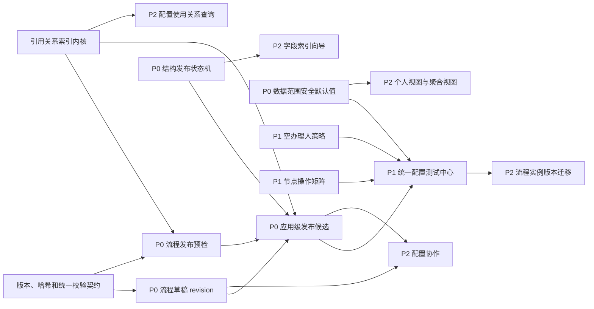

# 实体与流程配置改进实施计划

> 历史说明：原 4.3“节点操作矩阵”已于 2026-09-09 被
> [节点操作权限三开关方案](./node-operation-permission-simplification.md)替代；相关章节保留用于追溯原始计划。

> 编制日期：2026-08-21  
> 依据：[实体配置与流程配置功能完善度分析](./entity-process-configuration-gap-analysis.md)  
> 计划范围：完整实施 P0、完整实施 P2，并实施 P1 中的 4.2、4.3、4.5。

## 1. 实施目标

本计划解决三类问题：

1. 通过安全默认值、并发冲突控制、发布预检、结构一致性和应用级发布候选，消除高风险配置直接进入生产的路径。
2. 通过空办理人策略、节点操作矩阵和统一配置测试中心，形成从设计、验证、发布到运行处置的闭环。
3. 通过个人视图、聚合视图、索引向导、配置协作、实例迁移、引用关系和表单细节增强，提高平台的规模化使用能力。

## 2. 范围边界

### 2.1 本期纳入

| 优先级 | 编号 | 功能 |
| --- | --- | --- |
| P0 | 3.1 | 流程发布预检中心 |
| P0 | 3.2 | 流程草稿 revision 与冲突处理 |
| P0 | 3.3 | 数据范围安全默认值 |
| P0 | 3.4 | 实体结构一致性与唯一性保障 |
| P0 | 3.5 | HOTFIX 风险治理 |
| P0 | 3.6 | 应用级发布候选 |
| P1 | 4.2 | 空办理人策略 |
| P1 | 4.3 | 节点操作矩阵 |
| P1 | 4.5 | 统一配置测试中心 |
| P2 | 5.1 | 列表个人视图 |
| P2 | 5.2 | 列表聚合和多视图 |
| P2 | 5.3 | 字段索引向导 |
| P2 | 5.4 | 配置协作 |
| P2 | 5.5 | 流程实例版本迁移 |
| P2 | 5.6 | 配置使用关系查询 |
| P2 | 5.7 | TAB_SET 默认激活页 |

### 2.2 本期不纳入

以下 P1 项不在本计划范围，后续需要单独立项：

- 4.1 BPMN 专用配置面板；
- 4.4 实体业务数据批量导入中心；
- 4.6 表单多终端与无障碍能力；
- 4.7 收口字段事件配置；
- 4.8 通知渠道。

现有配置迁移继续负责 `.wfpack` 配置资产的跨环境交付。本计划中的“应用级发布候选”复用其快照、迁移标记和依赖能力，不扩展为业务数据导入。

## 3. 总体实施原则

1. 服务端是最终安全边界。前端隐藏按钮、禁用控件或提示警告不能替代服务端校验和授权。
2. 所有发布操作绑定不可变快照、版本号和内容哈希，预检与实际发布之间不得发生静默漂移。
3. 所有高风险能力支持幂等、重试、审计、可观测和人工恢复，不以“查看日志后手工改库”作为正常处置方式。
4. 新默认值采用安全默认，但必须为现有数据提供盘点、显式确认、灰度切换和回退窗口。
5. 配置测试默认无外部副作用。接口、消息、通知和流程动作必须使用模拟适配器或隔离环境。
6. P2 功能不得绕过数据范围、字段权限、租户隔离、流程版本和发布快照。
7. 数据库变更只新增高版本 Flyway 迁移；实施前检查当前最大版本号，不修改、删除或重命名主分支已有迁移。

## 4. 目标架构与依赖关系

配置使用关系在 P0 阶段先建设“内部引用索引内核”，供发布预检、影响分析和发布候选使用；P2 阶段再补齐面向管理员的查询页面、反向检索和可视化，因此不等待 P2 才开始采集引用关系。

## 5. 分阶段路线图

以下周期按 2 名后端、1 名前端、1 名测试、产品与 DBA/SRE 兼职参与估算。总周期约 24 至 28 周；实际排期应在接口和数据模型评审后按团队容量调整。

| 阶段 | 建议周期 | 主要范围 | 阶段出口 |
| --- | --- | --- | --- |
| M0 基线与设计 | 第 1-2 周 | 现状基线、ADR、统一问题模型、权限和审计规范、迁移盘点 | 方案评审通过，接口和迁移清单冻结 |
| M1 安全与并发底座 | 第 3-6 周 | 3.2 revision、3.3 安全默认值、3.5 HOTFIX、引用索引内核 | 多人覆盖被阻止，未绑定数据范围不再静默放开，高风险 HOTFIX 受控 |
| M2 发布可靠性 | 第 7-12 周 | 3.1 发布预检、3.4 结构一致性、3.6 发布候选 | 实体和流程可完成统一预检、按序发布、失败停止和报告输出 |
| M3 指定 P1 闭环 | 第 13-17 周 | 4.2 空办理人、4.3 操作矩阵、4.5 测试中心 | 节点策略服务端生效，关键配置可在发布前无副作用验证 |
| M4 P2 查询与体验 | 第 18-22 周 | 5.1、5.2、5.3、5.6、5.7 | 个人/聚合视图、索引建议、引用查询和默认页签可用 |
| M5 P2 协作与迁移 | 第 23-28 周 | 5.4 配置协作、5.5 实例版本迁移 | 评审与定时发布闭环完成，实例迁移支持干运行、分批执行和审计 |

允许并行的工作：

- 3.3 数据范围安全默认值可与 3.2 revision 并行；
- 3.4 结构一致性可与 3.1 发布预检并行；
- 4.2 空办理人策略可与 4.3 节点操作矩阵并行；
- 5.1 个人视图、5.7 默认页签可与 5.6 引用查询并行；
- 5.5 实例迁移必须在发布预检、测试中心和版本引用模型稳定后开始生产启用。

## 6. P0 工作包：安全性和发布可靠性

### 6.1 P0-01 流程发布预检中心

**目标**：发布前统一发现 BPMN、办理人、表达式、分支、表单版本、动作接口和运行影响问题，并定位到具体节点或连线。

**服务端任务**：

- 建立统一 `ValidationIssue` 模型，至少包含 `code`、`severity`、`blocking`、`assetType`、`assetId`、`elementId`、`message`、`suggestion` 和 `fixRoute`。
- 增加流程 `validate`、`diff`、`publish-preview` 接口；预览返回草稿 revision、内容哈希、依赖快照、影响统计和短期有效的预检令牌。
- 发布接口必须提交 `expectedRevision`、`draftHash` 和预检令牌；任一值变化则拒绝发布并要求重新预检。
- 校验 BPMN 结构、不可达节点、无默认分支、错误表达式、空办理人风险、循环调用、表单 release、实体状态、动作和接口依赖。
- 统计当前运行实例、待办任务及受影响版本；对不能自动判断的问题返回警告，不伪装为已验证。
- 把预检结果写入审计记录，并允许应用级发布候选复用同一结果。

**前端任务**：

- 在流程设计器增加“校验”“查看差异”“发布预览”入口。
- 按阻断、警告、提示分组展示问题；点击问题时定位并高亮 BPMN 节点或连线。
- 展示配置差异、依赖问题、运行实例影响和修复入口。
- 发布按钮仅在最新预检通过且草稿未变化时可提交。

**验收标准**：

- 人为构造的无办理人、错误表达式、无默认流和缺失表单版本均在发布前被识别。
- 阻断项存在时直接调用发布 API 也不能绕过。
- 预检后修改草稿，再使用旧令牌发布时返回冲突。
- 问题定位可以从报告跳转至对应 BPMN 元素。
- 预检报告可被发布候选和统一测试中心引用。

### 6.2 P0-02 流程草稿 revision 与冲突处理

**目标**：防止多人、多标签页和延迟请求覆盖整份 BPMN 草稿。

**服务端任务**：

- 为流程草稿增加单调递增 `revision`、`draftHash`、`basePublishedVersion` 和最后修改人/时间。
- 保存请求增加 `expectedRevision`；不匹配时返回 HTTP 409 和结构化冲突摘要，禁止最后写入者静默覆盖。
- 对完全相同的内容哈希支持幂等保存，不产生无意义 revision。
- 保留必要的草稿基线，以支持服务器版本、本地版本和共同基线三方比较。
- 列表状态区分“仅草稿”“已发布”“已发布且有待发布修改”。

**前端任务**：

- 编辑器始终携带当前 revision 保存。
- 冲突时提供重新加载、下载本地草稿、比较差异和基于最新版本继续编辑，禁止只有“确认覆盖”。
- 离开页面前提示未保存修改；自动保存与手动保存共用同一并发协议。

**验收标准**：

- 两个客户端基于同一 revision 修改时，后提交者必然收到 409。
- 冲突不会导致本地 BPMN 丢失，用户可导出或比较本地版本。
- 流程列表能准确显示是否存在未发布修改。
- 并发保存测试覆盖相同内容、不同内容、重复请求和网络重试。

### 6.3 P0-03 数据范围安全默认值

**目标**：未配置数据范围时不再隐式拥有全部数据访问权。

**服务端任务**：

- 引入 `DENY_ALL`、`PERSONAL`、`EXPLICIT_ALL` 三种明确模式，并把授权判断集中到服务端数据查询和详情访问链路。
- 新建实体和列表默认使用 `DENY_ALL`，或由租户级安全模板明确指定 `PERSONAL`；不得默认 `EXPLICIT_ALL`。
- 对存量未绑定规则生成盘点清单，不直接一次性切换导致生产中断。
- 提供批量确认接口，管理员必须为每个存量对象选择模式；选择 `EXPLICIT_ALL` 时要求高风险权限、原因和审计记录。
- 列表、详情、导出、聚合、个人视图和配置测试统一复用同一数据范围决策，不允许只保护列表查询。

**灰度步骤**：

1. 观察模式只记录“按新规则会被拒绝”的请求，不改变结果。
2. 管理员完成存量策略确认并处理异常用户。
3. 对试点实体启用强制模式，观察拒绝率和工单。
4. 全量启用后移除旧的隐式放开分支。

**验收标准**：

- 新对象未配置策略时，普通用户不能读取任意业务记录。
- `EXPLICIT_ALL` 必须有明确配置、权限和审计证据。
- 直接访问详情、导出和聚合接口不能绕过数据范围。
- 存量对象切换前有完整盘点、负责人和处理状态。

### 6.4 P0-04 实体结构一致性与唯一性保障

**目标**：使元数据与物理表结构的差异可发现、可恢复，并消除应用层唯一性检查的并发窗口。

**服务端任务**：

- 建立 `METADATA_SAVED -> DDL_PENDING -> DDL_RUNNING -> SCHEMA_CONSISTENT` 状态机，并支持 `DDL_FAILED`、重试和人工终止。
- 每次结构变更生成不可变操作计划、幂等键、目标结构指纹和执行记录。
- 增加真实表结构比对、漂移检测、修复计划预览和重试接口。
- 同一实体的 DDL 操作串行化，节点故障后可安全续跑，不重复创建字段或索引。
- 对适合数据库约束的字段创建唯一索引；对超长文本、复杂引用等不适合直接建唯一索引的类型，采用标准化唯一值占位表或带锁方案。
- 在执行可能锁表的 DDL 前给出数据量、锁风险和建议发布窗口。

**前端任务**：

- 实体发布页面展示结构状态、操作计划、真实结构差异、失败原因和重试入口。
- 唯一性配置展示实现方式、历史重复值扫描结果和阻断项。
- 对高风险 DDL 要求二次确认并显示影响范围。

**验收标准**：

- 模拟 DDL 失败后状态为 `DDL_FAILED`，可在修复原因后幂等重试至一致。
- 元数据与物理表不一致时能主动检测并生成修复计划。
- 两个并发请求写入同一唯一值时最多一个成功。
- 大表 DDL 有风险提示、超时策略和恢复手册。

### 6.5 P0-05 HOTFIX 风险提示与运行观察

**目标**：在不引入人工审批门禁的前提下，为 HOTFIX 提供明确风险提示、影响预检、运行观察和可回滚能力。

**服务端任务**：

- HOTFIX 发布记录风险等级、影响对象、发布人和完整预检快照。
- `REVIEW` 表示需要在发布确认框中重点提醒，不产生人工审批状态或额外授权门禁。
- 发布前检查受影响运行实例和表单 release 兼容性；技术不兼容、草稿漂移或影响范围变化仍拒绝发布。
- 发布后创建观察窗口，采集表单加载失败、提交失败和流程任务异常指标。
- 回滚只允许恢复到已验证的不可变版本，并完整记录回滚原因和执行人。

**前端任务**：

- 提供风险摘要、影响目标、明确的二次确认及回滚入口。
- 用户确认风险后直接发布，不进入申请、复核或待办流程。

**验收标准**：

- 高风险 HOTFIX 在确认前展示具体风险和影响范围，确认后可以直接发布。
- 不存在待复核状态、独立复核权限或已批准申请 ID 门禁。
- 发布后观察窗口和异常指标可查询。
- 一键回滚只能选择兼容且已发布的历史版本。

### 6.6 P0-06 应用级发布候选

**目标**：把实体结构、表单、列表、数据范围、流程、菜单权限和接口依赖作为一个可预检、可排序、可审计的发布单元。

**服务端任务**：

- 建立发布候选、候选条目、依赖边、校验结果、执行步骤和发布报告模型。
- 从配置迁移资产依赖和引用索引内核生成有向无环图；检测循环依赖并阻断。
- 固化每个条目的版本、revision、哈希和迁移标记，发布前再次检查未发生漂移。
- 按实体结构、实体配置、表单/列表、数据范围、流程、菜单权限和外部依赖的确定顺序执行。
- 任一步骤失败后停止后续发布；对已完成步骤执行明确的补偿或回滚策略，不宣称跨 DDL、流程部署和外部系统的全局数据库事务。
- 生成包含每一步输入、输出、耗时、操作者、失败原因和恢复建议的发布报告。

**前端任务**：

- 提供候选创建、资产选择、依赖图、统一预检、顺序预览、发布进度和结果页面。
- 明确区分“尚未执行”“已完成”“已补偿”“需人工处置”。
- 支持从失败步骤续跑，但必须重新确认版本和哈希。

**验收标准**：

- 缺少硬依赖、存在循环依赖或条目版本漂移时不能发布。
- 中间步骤失败后，后续条目不会继续发布。
- 重复提交同一发布请求不会重复部署或重复执行 DDL。
- 发布报告可下载并能追溯到配置迁移标记和各资产版本。

## 7. 指定 P1 工作包：配置体验和运行闭环

### 7.1 P1-02 空办理人策略

**目标**：动态办理人结果为空时按显式策略处置，避免流程进入无人可办状态。

**策略模型**：

| 策略 | 发布时行为 | 运行时行为 |
| --- | --- | --- |
| `BLOCK_PUBLISH` | 静态校验或模拟无法解析到办理人时阻断 | 对无法预判的动态空结果创建阻断 incident |
| `CREATE_INCIDENT` | 允许但给出警告 | 创建 incident，暂停节点并等待处理 |
| `FALLBACK_GROUP` | 校验兜底组有效 | 分配给指定管理员组 |
| `FALLBACK_USER` | 校验兜底用户有效 | 分配给指定兜底人员 |
| `WAIT_AND_RETRY` | 校验重试参数 | 按退避策略等待，超过上限后转 incident |

**实施任务**：

- 在流程级设置默认策略，节点级允许覆盖，并随流程版本形成不可变快照。
- 办理人解析服务返回结构化结果和空结果原因，不使用 `null` 或空集合静默继续。
- 增加 incident、处理记录、重试次数、下次重试时间和恢复动作。
- 发布预检和测试中心复用同一解析器，支持指定模拟身份、组织和流程变量。
- 管理员可补充办理人后重试、转兜底组或终止实例，所有操作写入审计。

**验收标准**：

- 每个用户任务都能解析出有效策略，未配置时使用流程级安全默认值。
- 五种策略均有运行测试，重试操作幂等。
- 空办理人不会创建一个普通用户无法发现且永远无人处理的任务。
- incident 有告警指标、责任人、处置入口和完整审计链。

### 7.2 P1-03 节点操作矩阵

**目标**：按流程版本和用户任务节点统一控制可用操作、条件、权限码和原因要求。

**操作范围**：

- 审批、驳回、转办、前加签、后加签、人工知会、撤回、终止；
- 每项操作的启用状态、适用条件、权限码、原因是否必填、原因模板和可选择目标范围；
- 加签类型、驳回目标、撤回时限和终止权限等操作专属参数。

**实施任务**：

- 定义版本化 `NodeOperationPolicy`，随流程发布快照固化。
- 建立服务端统一 `available-actions` 决策服务，输入用户、任务、流程实例、节点策略和业务数据，输出允许操作及拒绝原因。
- 所有任务操作 API 在执行前调用同一决策服务；前端只负责展示，不能通过手工请求绕过。
- 条件表达式使用受控表达式引擎，校验可引用变量和返回类型，禁止任意脚本执行。
- 设计器提供矩阵编辑、批量复制到节点、冲突提示和模拟身份预览。

**验收标准**：

- 前端隐藏某操作且直接调用 API 时，服务端仍按策略拒绝。
- 原因必填、权限码、条件表达式和操作专属参数均有正反向测试。
- 历史实例继续使用启动时绑定的流程版本策略，不受新版本修改影响。
- 节点操作矩阵可被统一测试中心自动生成覆盖用例。

### 7.3 P1-05 统一配置测试中心

**目标**：使用测试数据、模拟身份和隔离适配器，在发布前串联验证实体、表单、列表、权限、流程、动作和 SLA。

**核心模型**：

- 测试套件：绑定草稿、发布版本或发布候选；
- 测试用例：身份、组织、时间、输入数据、流程变量和前置数据；
- 测试步骤：表单初始化/提交、列表查询、流程启动/推进、任务操作、时间推进；
- 断言：字段值、可见性、数据范围、路径、办理人、可用操作、动作结果和 SLA；
- 测试运行：状态、日志、耗时、覆盖范围、失败差异和执行环境。

**实施任务**：

- 建立测试编排服务和表单、列表、权限、流程、动作、日历适配器，不直接复制各模块业务规则。
- 外部 REST、消息、通知和流程动作默认走 mock/stub；禁止仅依靠数据库事务回滚来声称无副作用。
- 支持从现有数据范围模拟、下一审批人预览和工作日历模拟导入用例。
- 支持单用例、测试套件和发布候选门禁三种执行方式。
- 失败结果能定位到表单字段、列表规则、BPMN 节点、操作策略或外部动作。
- 为测试数据设置隔离标识、保留期和自动清理策略。

**前端任务**：

- 提供套件、用例、数据集、模拟身份、运行记录和差异报告页面。
- 支持从表单、列表、流程设计器及发布候选页面快速创建测试。
- 展示路径覆盖、节点覆盖、操作矩阵覆盖和阻断失败。

**验收标准**：

- 能完成表单初始化/提交、列表数据范围、流程分支、办理人、操作矩阵、动作失败和 SLA 的端到端模拟。
- 默认测试运行不会调用真实外部接口、发送真实通知或污染生产业务记录。
- 同一固定输入可重复得到一致结果；时间和外部响应可冻结。
- 发布候选可以配置“指定套件全部通过”作为发布门禁。

## 8. P2 工作包：平台竞争力

### 8.1 P2-01 列表个人视图

**实施内容**：

- 保存筛选、排序、列宽、列顺序、显示列和默认视图。
- 支持个人视图和团队共享视图，团队共享需权限、所有者和变更审计。
- 视图引用字段稳定标识；字段下线后标记失效项并提供修复，不静默产生错误过滤。
- 读取视图时重新执行字段权限和数据范围检查，不能保存或共享越权结果。
- 提供视图复制、重命名、设为默认、取消共享和恢复系统视图。

**验收标准**：不同用户拥有独立默认视图，共享视图按权限可见，配置升级后失效字段有明确提示，任何视图均不能绕过数据范围。

### 8.2 P2-02 列表聚合和多视图

**实施内容**：

- 服务端增加受控的分组、计数、合计、平均、最小、最大和小计查询模型。
- 所有聚合先应用数据范围和字段权限，再执行数据库聚合。
- 增加表格、图表、看板和日历视图；视图配置进入发布版本和个人视图模型。
- 设置最大分组数、最大时间范围、查询超时和结果截断提示。
- 看板拖拽改变业务状态时复用实体状态转换和权限规则，不直接更新字段。

**验收标准**：聚合值与同一数据范围下的明细一致，大数据量查询有超时和限额保护，图表/看板/日历切换不泄露无权字段。

### 8.3 P2-03 字段索引向导

**实施内容**：

- 分析已发布列表查询、固定过滤、排序、关联条件和可选的脱敏查询统计，形成候选索引。
- 输出普通索引、联合索引、字段顺序、预估选择性、预估扫描行数和写入成本。
- 对低选择性字段、超长文本、高更新频率字段和重复索引给出反建议。
- 索引建议先进入结构操作计划，不允许页面直接执行任意 DDL。
- 复用 P0 结构状态机执行、跟踪和恢复索引变更。

**验收标准**：建议可解释、可预览且可拒绝；重复或无效索引能识别；执行失败进入 `DDL_FAILED` 并可安全重试；索引创建前后有执行计划对比。

### 8.4 P2-04 配置协作

**实施内容**：

- 将 P0 revision 和三方冲突模型推广到实体、表单、列表、流程和发布候选。
- 为表单设计增加撤销/重做，操作历史只保存结构化配置命令。
- 增加配置分支、草稿比较、合并冲突、评论、评审和变更审批。
- 定时发布必须绑定已审批且哈希不变的发布候选，并校验发布窗口和操作者权限。
- 评论和审批绑定稳定配置节点或字段标识，配置调整后保留上下文。

**验收标准**：多人编辑不会静默覆盖；审批后内容变化会使审批失效；定时发布前重新校验版本和依赖；所有评论、审批、合并和发布均可审计。

### 8.5 P2-05 流程实例版本迁移

**实施内容**：

- 建立迁移批次、实例筛选、活动节点映射、变量转换、表单 release 映射和执行记录。
- 干运行检查当前活动、并行/多实例状态、待办任务、作业、事件订阅、变量 Schema 和目标版本兼容性。
- 对实例加迁移锁，分批执行并限制并发；重复请求必须幂等。
- 明确可逆范围。尚未产生外部副作用的迁移可恢复快照；已发送消息或调用外部系统的实例使用补偿方案，不承诺虚假的全局回滚。
- 支持暂停批次、失败隔离、人工修复后续跑和完整审计。

**验收标准**：支持用户任务、网关、并行路径和多实例等约定场景；不兼容实例在干运行阶段被阻断；批次失败不影响未开始实例；迁移后任务、变量、表单和历史记录一致。

### 8.6 P2-06 配置使用关系查询

**实施内容**：

- 发布和保存草稿时抽取字段、表单、列表、状态、流程节点、权限规则、菜单、数据源、接口服务和动作之间的正反向引用。
- 复用或扩展现有配置迁移资产依赖模型，先完成数据模型评审，避免建立两套互不一致的依赖图。
- 引用记录包含来源版本、目标稳定标识、引用位置、依赖强度、抽取时间和解析状态。
- 提供“被谁引用”“引用了谁”、路径追踪、按版本过滤和失效引用查询。
- 为字段删除、状态变更、表单下线和流程发布提供影响分析入口。

**验收标准**：抽样资产的正反向引用完整且可定位；删除被硬依赖资产时发布被阻断；历史版本与当前草稿引用不混淆；无法解析的动态引用明确标为未知。

### 8.7 P2-07 TAB_SET 默认激活页

**实施内容**：

- 为 `TAB_SET` 增加 `defaultActiveTabKey`，引用稳定页签标识而不是显示顺序。
- 设计器支持选择默认页签，并在页签删除、隐藏或无权限时给出校验。
- 运行时按“配置默认页、首个可见且有权限页签、空状态”顺序安全降级。
- 配置进入表单版本、差异、快照和配置迁移。

**验收标准**：创建、编辑、查看和审批模式均正确激活默认页；默认页无权限或被删除时不出现空白页面；历史表单无该字段时保持原行为。

## 9. 数据模型与 Flyway 迁移计划

实施阶段可能涉及以下数据库主题，具体表名和字段在详细设计评审后确定：

| 阶段 | 迁移主题 |
| --- | --- |
| M1 | 流程草稿 revision/hash、数据范围默认模式、HOTFIX 发布观察、引用关系索引 |
| M2 | 结构操作状态与修复记录、发布候选/条目/步骤/报告 |
| M3 | 空办理人策略与 incident、节点操作策略快照、测试套件/用例/运行记录 |
| M4 | 个人/共享视图、聚合视图配置、索引建议、TAB_SET 默认页签配置兼容 |
| M5 | 配置分支/评论/审批、流程实例迁移批次/条目/映射/审计 |

执行约束：

1. 每个阶段创建迁移前先检查 `workflow-db-migrator` 当前最大版本号。
2. 只新增更高版本的 `V*__*.sql`，不修改主分支已有迁移，也不回写 `V001__business_schema.sql`。
3. 大表字段和索引变更先在同等数据量环境评估锁时长、回滚方式和发布窗口。
4. 安全默认值切换分为字段落库、存量回填、观察模式、强制启用四步，不在一个迁移中直接改变所有线上授权行为。
5. 每个迁移提供数据校验 SQL 或应用层检查项，但不得使用 `flyway repair` 掩盖历史变更。

本计划文档本身不新增、修改或删除任何数据库迁移文件。

## 10. API 与权限规划

### 10.1 建议接口组

| 接口组 | 主要能力 |
| --- | --- |
| `/api/process/definitions/{id}/validation` | 校验、差异、发布预览和问题定位 |
| `/api/process/definitions/{id}/draft` | 携带 expectedRevision 的草稿保存和冲突摘要 |
| `/api/schema-operations` | 结构计划、状态、漂移比对、重试和修复 |
| `/api/release-candidates` | 候选创建、依赖、预检、发布、续跑和报告 |
| `/api/config-tests` | 套件、用例、数据集、运行和报告 |
| `/api/config-references` | 正反向引用、路径和影响分析 |
| `/api/process-incidents` | 空办理人 incident 查询、修复和重试 |
| `/api/tasks/{id}/available-actions` | 节点操作矩阵决策结果 |
| `/api/list-views` | 个人/共享视图和多视图配置 |
| `/api/index-advisor` | 索引分析、建议、预览和结构计划转换 |
| `/api/process-instance-migrations` | 干运行、批次执行、暂停、续跑和报告 |

接口路径为计划建议，详细设计时应与现有 Controller 路径和命名规范统一，不为追求新路径而重复已有 API。

### 10.2 权限最小集合

建议新增或细化以下权限，不把高风险操作复用为普通编辑权限：

- `process-definition:validate`、`process-definition:publish`；
- `data-scope:configure-all`；
- `schema-operation:preview`、`schema-operation:execute`、`schema-operation:repair`；
- `entity:ui-config:hotfix`、`entity:ui-config:hotfix:observe`、`entity:ui-config:hotfix:rollback`；
- `release-candidate:create`、`release-candidate:publish`、`release-candidate:recover`；
- `process-incident:handle`；
- `config-test:execute`、`config-test:manage`；
- `list-view:share`；
- `config-review:approve`、`config-release:schedule`；
- `process-instance-migration:preview`、`process-instance-migration:execute`。

权限名称最终以项目现有命名规范为准。所有高风险接口同时记录系统审计，不能只依赖菜单权限。

## 11. 测试计划

| 测试层级 | 必测内容 |
| --- | --- |
| 单元测试 | 校验规则、revision 比较、数据范围决策、依赖排序、策略继承、操作矩阵、变量转换 |
| API 契约测试 | 409 冲突、阻断问题模型、幂等键、权限拒绝、分页和错误码 |
| 数据库集成测试 | DDL 状态机、唯一约束并发、漂移检测、迁移脚本升级和存量回填 |
| Flowable 集成测试 | 发布、空办理人、操作策略、并行/多实例及实例版本迁移 |
| 安全测试 | 未绑定数据范围、详情/导出/聚合绕过、越权发布、HOTFIX 越权直发、租户隔离 |
| 并发测试 | 多标签保存、重复发布、DDL 重试、发布候选重复提交、迁移批次锁 |
| 端到端测试 | 设计、预检、测试、审批、发布、运行 incident、回滚完整旅程 |
| 性能测试 | 大 BPMN 校验、依赖图、百万级聚合、索引建议、大批量实例干运行 |
| 故障恢复测试 | 发布中断、节点重启、DDL 失败、外部动作超时、迁移批次部分失败 |

每个工作包必须同时提供正常路径、拒绝路径、恢复路径和审计断言。P0 不接受只有前端页面演示而缺少服务端绕过测试的交付。

## 12. 发布与灰度策略

建议为高风险行为变更设置功能开关：

| 开关 | 初始状态 | 全量条件 |
| --- | --- | --- |
| `PROCESS_DRAFT_REVISION_ENFORCED` | 试点流程开启 | 旧客户端已升级且冲突处理通过验收 |
| `DATA_SCOPE_SECURE_DEFAULT` | 观察模式 | 存量对象完成显式确认 |
| `PROCESS_PUBLISH_PREFLIGHT_REQUIRED` | 先告警后阻断 | 校验误报率达到可接受水平 |
| `SCHEMA_OPERATION_STATE_MACHINE` | 新实体先启用 | 重试和漂移修复演练通过 |
| `HOTFIX_RISK_CONFIRM_ENABLED` | 默认开启 | 风险文案、影响预检和观察告警通过验收 |
| `RELEASE_CANDIDATE_ENABLED` | 试点应用 | 发布/补偿/续跑演练通过 |
| `EMPTY_ASSIGNEE_POLICY_ENFORCED` | 新流程先启用 | 存量节点均完成策略补齐 |
| `NODE_OPERATION_MATRIX_ENFORCED` | 影子决策 | 影子结果与现网操作差异完成处理 |
| `CONFIG_TEST_PUBLISH_GATE` | 默认不阻断 | 核心套件稳定且无外部副作用 |
| `INSTANCE_MIGRATION_ENABLED` | 默认关闭 | 指定流程类型完成演练和审批 |

每次全量切换前应形成上线清单、回退条件、负责人和观察指标。功能开关不得成为永久保留两套安全语义的理由，稳定后应删除旧分支。

## 13. 可观测与运营指标

建议至少建立以下指标和告警：

- 流程预检次数、阻断率、警告率和发布后同类错误漏检数；
- 草稿 revision 冲突次数、冲突处理成功率和未保存草稿恢复率；
- 数据范围观察模式命中数、强制拒绝数和 `EXPLICIT_ALL` 配置数量；
- DDL 各状态数量、失败率、平均恢复时间和结构漂移数量；
- HOTFIX 风险等级、确认后发布耗时、观察窗口异常和回滚率；
- 发布候选成功率、失败步骤、重复提交拦截数和平均发布耗时；
- 空办理人次数、策略分布、incident 积压和平均处置时间；
- 节点操作拒绝原因分布和前后端决策不一致数；
- 配置测试通过率、路径覆盖率、外部副作用拦截数和不稳定用例数；
- 聚合查询耗时、截断率、索引建议采纳率和采纳后性能变化；
- 实例迁移干运行阻断率、批次成功率和人工处置数量。

## 14. 主要风险与应对

| 风险 | 影响 | 应对措施 |
| --- | --- | --- |
| 安全默认值导致存量用户突然无数据 | 高 | 先盘点和观察，再显式确认、试点、全量；保留短期受审计回退开关 |
| 流程预检误报阻塞正常发布 | 高 | 校验规则分阻断/警告；影子运行；每条规则有稳定错误码和例外治理 |
| 大表 DDL 锁表或失败 | 高 | 执行计划、数据量评估、在线 DDL、发布窗口、串行锁和恢复演练 |
| 发布候选跨模块无法真正原子回滚 | 高 | 不承诺全局事务；采用步骤状态机、停止后续、幂等和明确补偿 |
| 配置测试误调用真实外部系统 | 高 | 强制测试适配器、网络白名单、测试凭据隔离和副作用审计 |
| 节点操作矩阵只在前端生效 | 高 | 所有任务操作 API 强制调用统一决策服务并增加绕过测试 |
| 实例版本迁移破坏运行状态 | 高 | 干运行、白名单场景、分批、实例锁、快照和人工审批；复杂场景先阻断 |
| P2 范围过大拖慢 P0 | 中 | M1-M3 设置独立验收门，P0 未通过不得抽调核心人员提前建设高级 P2 |
| 引用关系存在动态表达式无法静态解析 | 中 | 标记未知引用并在发布时要求人工确认，不把“未解析”当作“未引用” |

## 15. 里程碑验收门

### Gate A：安全与并发

- 流程草稿并发覆盖测试全部通过；
- 新对象安全默认值生效，存量对象盘点率达到 100%；
- 高风险 HOTFIX 会展示明确风险与影响范围，且技术阻断项不能被确认操作绕过；
- 引用索引内核可为发布预检提供稳定依赖数据。

### Gate B：发布可靠性

- 流程阻断问题无法绕过预检直接发布；
- DDL 失败、重试和漂移修复完成故障演练；
- 发布候选支持依赖排序、漂移检查、失败停止、幂等续跑和完整报告；
- P0 安全和恢复手册完成评审。

### Gate C：运行闭环

- 空办理人所有策略均通过运行测试并有 incident 告警；
- 节点操作矩阵在全部任务操作 API 上统一强制；
- 测试中心覆盖表单、列表、权限、流程、动作和 SLA，且副作用隔离验证通过；
- 发布候选可启用配置测试门禁。

### Gate D：P2 完成

- 个人/共享视图和聚合视图不绕过数据权限；
- 索引建议通过结构状态机安全执行；
- 引用关系支持正反向查询和发布影响分析；
- 配置协作能处理冲突、评审失效和定时发布；
- 实例迁移完成白名单场景的干运行、分批执行和恢复演练；
- TAB_SET 默认激活页具备权限降级和历史兼容。

## 16. 交付物清单

每个里程碑应交付：

- 方案 ADR、领域模型、状态机和接口契约；
- 新增 Flyway 迁移及迁移前后校验说明；
- 服务端实现、前端页面和权限菜单；
- 自动化测试、测试数据和验收报告；
- 运维指标、告警、故障恢复和灰度/回退手册；
- 用户手册、管理员手册和配置迁移兼容说明；
- 发布候选、测试运行或迁移批次的可下载审计报告。

## 17. 启动前决策清单

进入编码前需要由产品、架构、研发、安全和运维共同确认：

1. 新实体默认采用 `DENY_ALL` 还是租户模板指定的 `PERSONAL`。
2. HOTFIX 风险提示内容、直接发布确认文案，以及哪些技术不兼容项必须阻断。
3. 发布候选的补偿边界，哪些步骤允许自动回滚，哪些必须人工处置。
4. 配置测试中心允许使用哪些脱敏数据，外部服务采用 stub、沙箱还是专用测试租户。
5. 空办理人的平台默认策略和管理员兜底组。
6. 节点操作矩阵对历史流程版本的兼容方式。
7. 实例版本迁移第一批支持的流程结构白名单和明确不支持的场景。
8. 个人共享视图、评论和评审数据的租户隔离及保留周期。

上述决策完成后，先启动 M0 详细设计和存量数据盘点，再按 Gate A 至 Gate D 推进，不建议跳过 P0 直接并行上线实例迁移或配置协作。

## 18. 本次文档变更说明

- 产品代码：无修改。
- 数据库迁移：无新增、修改或删除。
- 新增计划文档：`docs/entity-process-configuration-implementation-plan.md`。
