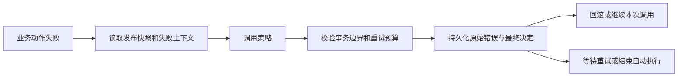

# 流程动作自定义失败策略设计方案

日期：2026-09-26。状态：第一阶段已实现；通知与补偿属于后续扩展。

本方案面向流程、节点、连线上的“流程动作”。目标是让项目开发者注册失败策略，配置人员在设计器中选择策略、填写参数，运行时根据异常和执行上下文决定后续处理。

采用“策略判断 + 平台执行”的结构：项目代码返回处理决定，平台统一维护事务、重试队列、幂等约束、执行状态和审计。通知、补偿等有副作用的操作独立调度。

实施说明：四种内置策略的自动执行逻辑保持；动作抛出异常后才触发失败策略，不增加失败触发条件。异常分类由自定义实现按需决定，也可以直接返回固定处理结果。

本次新增迁移为 `V108__flow_action_custom_failure_strategy.sql`，历史迁移未修改。决策审计和人工处理记录复用现有 `execution_trace_json`，与执行状态原子更新，不另建两张审计表。自定义动作发生执行结果不确定的租约中断时，保守转人工核对；尚未开始调用的记录可以自动恢复。

已提供 `PROJECT_FAILURE_MANUAL@1`（事务内回滚、提交后转人工）和 `PROJECT_TRANSIENT_RETRY@1`（网络异常指数退避重试）两个可选择的项目示例。它们不会自动绑定到已有流程。

## 1. 当前实现与改造起点

| 当前能力 | 代码位置 | 对本方案的影响 |
|---|---|---|
| 前端固定四种策略 | `workflow-web/src/components/FlowActionConfigPanel.vue` | 改成服务端能力目录，保留现有选项 |
| 后端固定枚举与执行方式组合 | `FlowActionFailurePolicy`、`FlowActionConfigurationValidator` | 新增 `CUSTOM` 配置类型，并校验策略声明和实际决定 |
| 事务内失败处理 | `FlowActionEventDispatcher` | 异常捕获后接入策略决策，仍由外层业务事务决定最终提交或回滚 |
| 提交后执行与重试 | `FlowActionExecutionProcessor`、`FlowActionExecutionService` | 接入策略，并复用现有数据库执行队列 |
| 自定义业务处理器 | `workflow-spi` 中的 `FlowActionProvider` | 新增同层次的失败策略 SPI；业务动作与失败策略可分别复用 |
| 草稿发布时逐字段复制 | `FlowActionService.publishActions` | 新字段必须进入发布快照、复制、导入导出链路 |
| 执行租约与并发保护 | `FlowActionExecutionMapper` | 新的决策落库必须继续检查 owner、leaseToken 和租约有效期 |

当前“失败回滚流程”回滚的是本次流程操作的事务，不能撤销历史已提交操作；“继续”也没有自动撤销失败动作的局部写入。当前自动重试还依赖处理器 `retryable()`，并非选了 `RETRY` 就必然重试。

## 2. 用户能配置什么

保留四种内置策略，增加“自定义策略”。选择后展示：策略名称、用途、适用执行方式，以及由策略参数 Schema 描述的表单（一期支持文本、整数、布尔和枚举）。

例如“项目同步失败处理”策略可以配置为：

| 条件 | 处理结果 |
|---|---|
| 外部服务暂时不可用 | 等待后重试 |
| 业务数据不合法 | 停止自动执行，标记待人工处理 |
| 已由下游确认完成的重复请求 | 按业务处理器的成功路径返回；不通过失败策略伪造成功 |
| 超过重试预算 | 标记待人工处理 |

一期提供 Java SPI 和参数表单，不引入在线脚本执行或通用可视化规则引擎。配置人员可以调整已注册策略的参数；增加新的判断逻辑由项目开发者实现、部署。

策略选择器根据执行方式、处理器重试能力和当前流程实体过滤。切换执行方式时，明确提示原策略不再适用并要求重新选择，不静默清空或替换用户配置。对于打开旧版本配置的场景，即使策略当前缺失，也保留原编码、版本和参数，并显示不可用原因。

## 3. 处理决定与事务边界

策略输出使用独立枚举 `FailureDisposition`，不要把配置类型 `CUSTOM` 当作执行结果。

| 决定 | 事务内 | 提交后 | 平台行为 |
|---|---|---|---|
| `ROLLBACK` | 支持 | 不支持 | 保留失败审计，传播原始异常，使本次业务事务回滚 |
| `CONTINUE` | 有条件支持 | 不支持 | 保留失败记录，继续当前调用链 |
| `RETRY` | 一期不支持 | 有条件支持 | 计算并持久化下次执行时间，由工作线程调度 |
| `IGNORE` | 不支持 | 支持 | 结束本动作的自动执行，保留原始失败 |
| `MANUAL` | 一期不支持 | 支持 | 结束自动执行，进入待人工处理列表 |

`CONTINUE` 的条件是事务仍可提交。若事务已被内部调用标记为 rollback-only，或数据库错误已使事务不可用，就不能通过捕获异常恢复事务；平台应回滚并记录决定被拒绝的原因。不能仅凭 Spring 的 rollback-only 标志为 false 就断言数据库事务健康；新策略遇到 SQL、资源异常或无法确认原事务状态时回滚；其余业务失败是否适合继续由策略实现判断。它也不承诺撤销动作失败前的部分写入，设计器应明确说明这一点。

`RETRY` 必须同时满足：执行方式为提交后、业务处理器声明可安全重试、重试预算未耗尽、策略返回合法间隔。策略不能覆盖处理器的幂等声明，也不能绕过平台最大次数和等待时间上限。

`MANUAL` 仅表示动作执行需要人工处理，不自动暂停或退回 BPMN 流程。若业务要求“外部同步成功后才能流转”，应建模显式等待节点，或者在事务内执行可阻断审批的校验。

## 4. 模块与接口

沿用当前仓库 `workflow-spi`、`workflow-process`、`biz-project` 的依赖方向。

| 模块 | 新增职责 |
|---|---|
| `workflow-spi` | 策略接口、不可变失败上下文、策略元数据、决策结果 |
| `workflow-process` | 策略注册目录、参数校验、决策协调、执行约束、持久化、目录 API |
| `biz-project` | 项目策略实现，`ProjectCustomFailureStrategy` 与 `ProjectTransientFailureStrategy` |
| `workflow-web` | 策略选择、参数编辑、执行决定和人工处理展示 |

SPI 不引用 `FlowAction`、`FlowActionExecution` 等持久化实体，不提供 Mapper、Flowable 引擎对象或修改流程的运行时助手。

实现的核心接口如下：

```java
public interface FlowActionFailureStrategyProvider {
    /** 返回稳定编码、版本、适用模式、可能输出的决定和参数 Schema，供目录与发布校验使用。 */
    FailureStrategyDescriptor descriptor();

    /**
     * 根据失败事实和已校验参数决定后续处理，不写业务数据或调用外部系统。
     * 同样的上下文与配置应产生同样的决定；异常和非法结果由平台统一兜底。
     */
    FailureDecision decide(
            FlowActionFailureContext context,
            Map<String, Object> configuration);
}
```

`FailureStrategyDescriptor` 至少包含 `code`、`version`、`displayName`、`description`、`supportedExecutionModes`、`possibleDispositions`、`configSchema` 和可选的实体适用范围。平台按 `(code, version)` 注册；重复注册必须启动失败，不能静默覆盖。

`FlowActionFailureContext` 包含：动作执行记录 ID、动作与流程发布版本、执行方式、触发时机、引擎执行实例和实体标识、当前尝试序号、最大额外重试次数、是否已耗尽预算、处理器可重试能力，以及异常摘要。异常摘要包含异常类型链和截断后的错误消息；原始完整堆栈由平台单独审计。不能只凭错误消息文本判断业务状态。

上下文中的 `actionExecutionId` 指平台动作执行记录，`engineExecutionId` 指 Flowable 执行实例，避免与现有同名字段混淆。一期不开放任意流程变量或实体数据给策略；上下文为不可变 record，异常类型集合不可修改。判断依据与原始错误保存在执行记录中。

`FailureDecision` 包含 `disposition`、可选的 `retryDelaySeconds`、稳定的 `reasonCode` 和供人阅读的 `reason`。只允许 `RETRY` 携带延迟。一期不允许返回“成功”、直接创建任务、修改流程变量或指定任意 URL。

策略作为受信任的项目 Java 代码运行，纯计算是开发契约，不是 JVM 沙箱保证。记录决策耗时并对慢策略告警；不能声称用线程超时就能安全终止任意插件。需要远程查询或写操作的业务放入动作或后续补偿任务。

## 5. 配置契约与版本

保留 `failurePolicy` 的现有四个值，增加 `CUSTOM`。新增配置示例：

```json
{
  "executionMode": "AFTER_COMMIT",
  "failurePolicy": "CUSTOM",
  "failureStrategyCode": "PROJECT_TRANSIENT_RETRY",
  "failureStrategyVersion": "1",
  "failureStrategyConfig": "{\"initialDelaySeconds\":60}",
  "retryConfig": "{\"semanticsVersion\":2,\"maxRetries\":3}"
}
```

沿用流程动作现有 API 约定，`failureStrategyConfig` 与 `retryConfig` 使用 JSON 对象的字符串形式；页面以表单编辑，发送时统一序列化。`retryConfig` 管理平台统一预算，`failureStrategyConfig` 管理策略专有规则，避免两个位置同时配置次数。

新策略的 `maxRetries=3` 明确表示首次执行之外最多再执行三次。首次尝试 `attemptNo=1`，第 N 次重试为 `attemptNo=N+1`；当 `attemptNo >= 1 + maxRetries` 时没有重试额度。预算耗尽时仍调用策略，以便选择 `IGNORE` 或 `MANUAL`；再次返回 `RETRY` 会被平台拒绝并进入死信。

保存与发布时都校验策略存在、版本、可见范围、模式、Schema 和可能输出的决定；凡是声明可能返回 `RETRY` 的配置，还需要业务处理器可安全重试。字段类型、未知参数、延迟范围和最大次数都由服务端校验，前端仅做提前反馈。

发布时将策略编码、版本、参数和预算完整复制到发布版本。执行记录再保存该配置快照，后续重试不读取草稿或策略“最新版本”。策略版本约定语义不可变；改变判断逻辑必须增加版本，保留仍有引用的旧版本实现。配置快照无法自动保留旧 Java 字节码，需要部署流程保证版本实现仍可用。

## 6. 执行链路



在 `FlowActionEventDispatcher` 和 `FlowActionExecutionProcessor` 的异常路径中接入 `FlowActionFailureCoordinator`。协调器调用目录中的策略，校验决定，再交给现有事务内分发或队列服务落实。内置策略保留原语义，可通过适配器逐步进入同一协调层。

事务内入口必须确认实际存在主事务，缺少事务时拒绝执行，不能只依据配置字符串承诺回滚。失败审计继续用独立事务保存，之后再传播原始异常或继续调用。需要分别记录“策略选择继续”和“外层事务最终提交”两个事实，不能在 catch 块中提前宣布审批已提交。外层事务结局可通过事务完成回调补记；若进程中断无法确认，保留 UNKNOWN，不推测成功。

提交后失败使用独立的短事务：在有效租约下更新执行状态，并追加决策审计。两个写入必须原子提交；只有状态更新成功才允许写出后续事件。旧工作线程失去租约后不能安排重试、写入有效决定或产生通知任务。重试只写数据库时间，不在请求线程中 sleep。

策略自身抛异常、缺失、返回空值或非法决定时，保留原始业务异常，并另存策略错误。事务内按 `ROLLBACK`；提交后进入 `DEAD`，原因 `STRATEGY_ERROR`，需要人工处理。不能静默改成成功、继续或无限重试。

若最终决定和审计本身无法落库，事务内应传播失败；提交后保持未确认状态并由恢复机制处理，不能宣称已完成终态。基础设施故障恢复必须遵循下一节的执行不确定性规则。策略版本缺失或执行上下文损坏等执行准备错误直接回滚或转人工，不交由业务策略重试，避免尚未登记尝试次数时无限循环。

## 7. 重试、并发和人工处理

一期继续使用现有 `PENDING / RUNNING / SUCCESS / FAILED / DEAD` 状态。增加 `terminationReason`，区分 `IGNORED`、`MANUAL_REQUIRED`、`RETRY_EXHAUSTED`、`HANDLER_NOT_RETRYABLE`、`STRATEGY_ERROR`、`ROLLED_BACK`、`CONTINUED` 和 `EXECUTION_UNCERTAIN`。处理决定不等于业务结果，失败后继续、忽略、转人工都不写 `SUCCESS`。

新增策略采用显式 `attemptNo`：工作线程在即将调用业务处理器前，以租约条件原子登记本次尝试。线程池拒绝、尚未调用处理器的情况不消耗尝试次数；已经登记调用后进程退出，则按一次可能发生的执行计入预算。重试间隔由平台校验后持久化，使用现有数据库 UTC 时间计算。

当前租约到期恢复会重新置为可执行状态，实施时必须一并改造，不能仅在 catch 路径校验幂等性。对于已经开始但结果未知的调用，进入 `EXECUTION_UNCERTAIN` 等待核对，即使处理器支持重放也不自动假设下游未执行；管理员核对后可以安全重放。租约 token 只能阻止过期线程写本地状态，外部系统仍必须落实幂等键。

自动重试沿用原动作幂等键。失败后的响应丢失不代表外部系统未执行，不能为每次重试生成新键。

`MANUAL_REQUIRED` 列表展示失败原因、策略判断、执行参数摘要和处理记录。一期处理入口沿用现有超级管理员权限。可以登记处理说明、确认已处理，以及对符合条件的提交后动作发起手工重试；登记“已处理”只改变人工处理状态，原失败记录仍然保留。

对新策略，手工重试仅允许已结束自动执行的 `DEAD` 记录，还需校验原模式为 `AFTER_COMMIT`、处理器允许安全重放、原发布快照可用。事务内失败动作需要重新发起原业务操作，不能把动作单独移到后台重跑。

手工重试创建关联原记录的新执行记录，沿用原幂等键和配置快照，保存发起人和来源记录；不要清空原失败记录后重新计数。平台锁定重放根记录并校验当前没有进行中的重放，避免并发点击创建多个任务。旧手工重试入口也必须执行模式与安全重放校验；这是明确的行为收紧，需要在发布说明中列出。

## 8. 持久化设计

具体类型和索引需按项目数据库适配规范实现，以下为逻辑字段。

| 对象 | 新增内容 | 用途 |
|---|---|---|
| `process_action` | `failure_strategy_code`、`failure_strategy_version`、`failure_strategy_config` | 保存草稿与发布版本的策略绑定 |
| `process_action_execution` | `failure_strategy_snapshot`、`attempt_no`、`termination_reason` | 固定执行依据，明确当前尝试和最终原因 |
| `process_action_execution` | `replay_root_id`、`replay_of_id`、`resolution_status` | 关联手工重放、串行化重放操作、展示人工处理状态 |
| `process_action_execution.execution_trace_json` | `FAILURE_DECISION`：尝试序号、建议与最终决定、原因、延迟、策略错误 | 与状态使用同一条件更新，解释平台为何覆盖策略请求 |
| `process_action_execution.execution_trace_json` | `MANUAL_REPLAY` / `MANUAL_RESOLVED`：操作者、处理说明或原失败记录、时间 | 不清空历史地记录人工操作 |
| `process_action_execution` | `attempt_lease_token`、`handler_idempotency_key` | 区分已开始与未开始的租约中断；重放记录使用新唯一键，下游继续使用原幂等键 |

提交后的有效决定与状态通过 `RUNNING + owner + leaseToken + 未过期` 条件原子写入；写入后状态变为 FAILED/DEAD，同一租约不能重复提交决定。事务内执行使用独立的动作执行记录和 `attemptNo=1`，其事务完成结果作为单独轨迹补记，不能伪造第二次失败。

`resolution_status` 至少区分 `NONE / OPEN / RESOLVED / REPLAYING`；“关闭待办”和“动作执行成功”分别展示。人工操作通过根记录状态条件更新互斥，重复提交会被拒绝，不覆盖已有说明或创建重复任务。

一期无需新增独立“策略定义”数据库表：策略元数据来源于代码注册，具体配置随流程发布版本保存。后续需要跨流程共享配置模板时，再独立设计模板及版本，不能把可变模板直接作为运行时依据。

## 9. 目录、界面和可观察性

新增 `GET /api/process-actions/failure-strategies?processConfigId=...`，按当前流程实体返回可见策略；页面结合执行方式和处理器能力展示不兼容原因。使用现有流程定义管理权限，服务端重新判断实体范围，不能相信客户端传入的过滤结果。

`FlowActionConfigPanel.vue` 增加“自定义策略”选项和参数编辑；现有处理器目录补充 `retryable` 能力供界面解释。保存契约和发布前校验共同限制不合法组合。

`FlowActionExecutionLog.vue` 增加策略编码与版本、尝试次数、处理原因、人工处理状态及重放关联。原始错误保留在错误详情中，策略建议、最终决定及策略错误保存在执行轨迹中，计划重试时间沿用现有展示。慢策略记录编码、版本和耗时告警。

保留原内置策略名称；自定义策略使用“额外重试次数”，提示由动作异常触发以及“转人工不会自动暂停流程”。

## 10. 通知与补偿的后续扩展

第二期可增加“最终失败后执行的动作”，例如通知管理员、登记补偿任务、调用撤销接口。该动作由平台持久化调度，不能在 `decide()` 中同步执行。

优先支持提交后失败：在确认失败的同一短事务内写入 Outbox 事件，使用 `failureDecisionId + followupType` 作为稳定事件键。后续任务拥有独立执行记录、幂等键和有界重试预算；重复消费不能产生重复补偿。补偿失败进入其自身的人工处理状态，不递归触发同一个补偿链。

补偿成功只表示补偿任务成功，原动作仍然保留失败事实。补偿目标也必须绑定发布版本并声明适用条件；不能任意选择依赖活跃任务或当前事务的处理器。

事务内回滚后的通知要等待主事务结局明确，再通过可恢复的持久化机制触发；仅用内存事务回调不能承诺可靠投递。该能力另行实施，不作为一期“自定义策略”交付条件。

退回节点、撤销审批、挂起与恢复流程属于业务流程状态变更，需另行定义权限、并发状态校验和恢复规则。

## 11. 兼容与上线

历史动作仍用原四种策略；新字段为空时走原行为。已有 `retryConfig` 不自动改变次数语义，运行中的执行记录也不重新计算预算。新 `CUSTOM` 配置使用 `semanticsVersion=2`。

现有实现将首次失败计入 `maxRetries`。若后续提供显式升级工具，持续失败条件下可将旧值 N 转换为新额外重试次数 `max(0, N-1)`；升级必须生成新流程发布版本，不能改写历史记录。

数据库先执行增量迁移，再部署支持新字段和新策略的服务；所有工作节点都支持目标策略版本后，才能启用新配置和发布新流程。旧节点不能继续领取新策略任务。回退前先停止新策略任务领取并处理其存量，不能直接启动无法识别 `CUSTOM` 的旧程序。

实施前确认最大版本为 V107，本次只新增 `V108__flow_action_custom_failure_strategy.sql`。没有修改、删除或重命名主分支已有迁移；后续继续按实际最大版本递增。

## 12. 实施顺序与验收

第一阶段交付完整的自定义策略闭环：SPI、注册目录、模式和参数校验、事务内及提交后运行接入、配置快照、决策记录、重试次数语义、租约恢复保护、参数界面、最小人工处理与安全重放入口。提供无需额外条件的回滚/转人工示例，以及按网络异常类型重试的示例策略。

第二阶段再扩展最终失败通知、补偿动作调度、共享策略配置模板；流程退回和挂起按独立业务功能评审。

关键验收场景：

| 场景 | 预期 |
|---|---|
| 老流程使用四种内置策略 | 自动执行语义保持，手工重放的安全限制有明确提示 |
| 自定义事务内策略返回回滚 | 本次业务事务回滚，失败审计可查询 |
| 策略返回继续但事务已 rollback-only | 拒绝继续，保留原异常及覆盖原因 |
| 提交后策略返回回滚 | 保存或发布时拒绝；运行时意外出现则进入策略错误终态 |
| 不可重试处理器绑定可能重试的策略 | 保存或发布失败，并明确原因 |
| 新配置额外重试为 0、1、3 | 持续失败时最多调用 1、2、4 次 |
| 进程在外部调用后、结果落库前退出 | 转人工核对；只有未开始处理器调用的租约可以自动恢复 |
| 两个工作线程处理同一记录、旧线程租约失效 | 只有当前租约可以提交决定和后续事件 |
| 策略异常、缺失、参数损坏、预算越界 | 按执行方式兜底，原始错误不被覆盖 |
| 修改草稿、升级策略代码后旧记录重试 | 仍使用原发布快照与原策略版本 |
| 连续或并发提交手工重放 | 保留原记录，只创建一个有效重放任务 |
| 事务内失败记录尝试后台重放 | 拒绝，并引导重新执行原业务操作 |
| 人工确认处理完成 | 更新人工处理状态，原失败事实不变 |

策略规则使用单元测试；事务回滚、rollback-only、审计独立提交与并发抢占必须使用真实事务和数据库集成测试。前端验证执行方式联动、参数 Schema、发布错误提示及执行详情。新数据库按全部迁移顺序初始化，同时验证已有数据库增量升级。

测试覆盖策略参数、发布快照、事务回滚与继续、额外重试次数、原幂等键重放、并发互斥和 H2 增量迁移烟测；MySQL 全量迁移需在具备数据库或 Docker 的环境另行验证。
