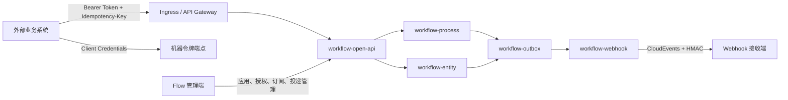

# Flow 开放集成 V1 实施计划

> 文档状态：评审稿
>
> 基线分支：`main`
>
> 编写日期：2026-07-29
>
> 目标版本：开放集成 V1

## 1. 背景与结论

Flow 已具备实体建模、流程运行、任务处理、权限控制、Outbox、受控 HTTP 调用和
Kubernetes 多副本部署能力。当前扩展能力主要服务于平台内部模块，尚未形成可供其他
系统稳定接入的产品边界：

- `IntegrationConnector` 和 `IntegrationSecretResolver` 已定义，但没有生产实现。
- Outbox 只路由本进程内注册的处理器，没有外部事件订阅和 Webhook 投递能力。
- 现有 `/api` 主要面向 Flow 前端，未版本化，也没有独立的机器身份、Scope 和兼容策略。
- 当前用户 JWT 面向交互式登录，不适合作为系统对系统的长期接入协议。
- REST 服务任务具备目标地址限制，但连接器密钥、投递审计和运维闭环尚未产品化。

V1 不拆微服务。新增能力继续运行在现有模块化单体中，通过独立模块、稳定端口和数据库
边界隔离。只有当接入量、发布节奏或故障域产生真实拆分需求时，才将开放接口或 Webhook
投递器独立部署。

## 2. 产品目标

V1 要完成一条可以正式交付给外部系统的闭环：

1. 管理员创建一个接入应用并授予最小权限。
2. 外部系统使用短期访问令牌调用版本化开放接口。
3. 外部系统以幂等方式发起流程并查询处理状态。
4. Flow 在任务和流程状态变化后可靠投递签名事件。
5. 投递失败可以自动重试、告警、查询和人工重放。
6. 所有接入、授权、调用和重放操作均可审计和追踪。

典型首发场景：

```text
项目管理系统创建申请
        |
        v
Flow 发起审批并由平台用户处理
        |
        v
Flow 将任务变化和最终结果回调项目管理系统
```

## 3. V1 范围

### 3.1 纳入范围

- 接入应用、凭据、Scope、流程授权和状态管理。
- OAuth 2.0 Client Credentials 机器认证。
- `/api/open/v1` 版本化开放接口。
- 流程目录查询、流程发起、状态查询、任务查询和消息关联。
- 基于 CloudEvents 1.0 JSON 格式的流程事件。
- Webhook 订阅、签名、重试、死信、重放和投递审计。
- HTTP JSON 连接器和生产可用的密钥解析实现。
- OpenAPI 3.1 文档、契约测试和接入示例。
- 多 Pod 下的任务认领、fencing、指标和告警。

### 3.2 不纳入范围

- 不向外部开放流程设计、实体设计、DDL 发布和系统管理接口。
- 不在 V1 开放“机器代替用户完成审批”。需要此能力时必须另行设计委托身份和审批责任。
- 不把动态实体的任意 CRUD 直接包装成公共 API。
- 不引入用户自定义脚本、表达式执行或任意 Java 插件上传。
- 不在 V1 拆分网关、认证服务或消息队列。
- 不承诺 SaaS 多租户隔离。V1 面向单实例部署下的多个接入应用。
- OIDC 单点登录、SCIM 和 HR 主数据同步放在后续版本。

## 4. 设计原则

1. **外部契约与内部模型隔离**：开放 DTO 不直接复用 Controller DTO、MyBatis Record、
   Flowable 对象或动态表结构。
2. **最小授权**：应用只能访问明确授权的 Scope 和流程定义。
3. **机器身份与用户身份分离**：应用令牌不能转换为平台用户令牌，也不能调用内部 `/api`。
4. **至少一次投递**：Webhook 明确采用 at-least-once，接收方必须按事件 ID 去重。
5. **幂等优先**：所有外部写操作要求 `Idempotency-Key`，重试不得重复创建业务结果。
6. **配置不可携带明文密钥**：流程、表单、动作和连接器配置只保存 Secret 引用。
7. **默认拒绝外联**：目标地址必须经过管理员授权、应用层校验和网络出口策略。
8. **版本先于实现**：先固化 OpenAPI、事件 Schema 和错误码，再开发 Controller。
9. **可运维**：没有指标、审计、死信处理和重放能力的集成不视为完成。

## 5. 目标架构



模块保持同进程部署，但依赖方向必须满足：

```text
workflow-open-api ----> workflow-contracts <---- workflow-process
        |
        +-------------> workflow-webhook -----> workflow-outbox
        |
        +-------------> workflow-core
```

`workflow-open-api` 不得直接依赖业务模块的 Mapper。流程发起、查询和消息关联通过
`workflow-contracts` 中的应用端口完成。

## 6. 模块与代码边界

### 6.1 新增模块

在 `workflow-server/workflow-integration` 下新增：

| 模块 | 职责 |
| --- | --- |
| `workflow-open-api` | 接入应用、机器认证、开放 API、幂等记录、Scope 校验 |
| `workflow-webhook` | 事件物化、订阅匹配、签名投递、重试、死信和重放 |

`workflow-integration/pom.xml`、父 POM 的依赖管理和 `workflow-app` 需要显式聚合上述模块。

### 6.2 扩展现有模块

| 模块 | 调整 |
| --- | --- |
| `workflow-contracts` | 增加流程开放访问端口、事件契约和应用身份模型 |
| `workflow-process` | 实现流程目录、发起、状态、任务和消息关联端口 |
| `workflow-entity` | 仅在确有首发场景时增加受控业务摘要端口，不开放通用动态 SQL |
| `workflow-http` | 增加 `HttpIntegrationConnector`，复用目标地址策略和超时限制 |
| `workflow-admin` | 增加接入管理权限码、审计动作和管理端 API |
| `workflow-app` | 增加配置、过滤器、指标和生产启动保护 |
| `workflow-db-migrator` | 从 `V013` 开始增加开放集成表结构 |

### 6.3 建议新增的稳定端口

```java
public interface OpenProcessCatalogPort {
    List<OpenProcessDefinition> listPublished(OpenApplicationActor actor);
}

public interface OpenProcessRuntimePort {
    OpenProcessStartResult start(OpenProcessStartCommand command);
    OpenProcessView get(String processInstanceId, OpenApplicationActor actor);
    List<OpenTaskView> listActiveTasks(
            String processInstanceId,
            OpenApplicationActor actor);
    OpenMessageCorrelationResult correlate(
            OpenMessageCorrelationCommand command);
}

public interface IntegrationDomainEventPublisher {
    void publish(IntegrationDomainEvent event);
}
```

端口参数必须携带接入应用身份、授权流程范围、业务关联键和追踪信息，不能依赖
`UserContext` 隐式获取机器身份。

## 7. 接入应用与机器认证

### 7.1 应用模型

每个外部系统对应一个接入应用：

- `client_id`：公开、不可变、全局唯一。
- `client_secret`：创建或轮换时只展示一次，数据库只保存 Argon2id 哈希。
- `status`：`ACTIVE`、`DISABLED`、`REVOKED`。
- `owner_organization_id`：管理责任归属，不作为 SaaS 租户隔离声明。
- `scopes`：允许调用的能力。
- `allowed_process_keys`：允许发起和查询的流程定义。
- `rate_limit`：每分钟请求上限及并发上限。
- `allowed_source_cidrs`：可选来源网段限制。
- `expires_at`：可选应用有效期。

建议的 V1 Scope：

| Scope | 能力 |
| --- | --- |
| `process.definition.read` | 查询授权的已发布流程目录 |
| `process.instance.start` | 发起授权流程 |
| `process.instance.read` | 查询本应用关联的流程实例 |
| `process.task.read` | 查询本应用关联实例的当前任务摘要 |
| `process.message.correlate` | 向本应用关联实例投递受控流程消息 |

应用即使拥有 Scope，也只能访问由该应用发起或显式绑定的流程实例。不能仅凭
`processInstanceId` 跨应用读取。

### 7.2 令牌模型

采用 OAuth 2.0 Client Credentials：

```http
POST /oauth2/token
Authorization: Basic base64(client_id:client_secret)
Content-Type: application/x-www-form-urlencoded

grant_type=client_credentials&scope=process.instance.start process.instance.read
```

要求：

- 使用成熟的 OAuth 2.0 实现，不自行拼接非标准认证协议。
- 访问令牌有效期默认 10 分钟，最长不得超过 30 分钟。
- 令牌使用独立非对称签名密钥，不能复用当前用户 JWT 的 HMAC 密钥。
- Claims 至少包含 `iss`、`sub`、`aud=flow-open-api`、`scope`、`iat`、`exp`、`jti`。
- 签名密钥通过 Kubernetes Secret 或部署密钥系统注入，并支持 `kid` 和重叠轮换。
- 禁止 Refresh Token；应用重新执行 Client Credentials 获取令牌。
- 应用禁用或吊销后，新令牌签发立即停止；紧急吊销通过短令牌周期控制影响窗口。

### 7.3 权限与审计

新增平台权限码：

- `system:integration:view`
- `system:integration:manage`
- `system:integration:secret-rotate`
- `system:integration:delivery-replay`

审计至少记录：

- 应用创建、启停、删除和流程授权变更。
- 凭据创建、轮换和吊销，不记录凭据原文。
- Webhook 订阅创建、修改、验证和删除。
- 死信重放的操作者、原因、原投递和新投递 ID。
- 开放 API 的应用 ID、Scope、资源 ID、结果、耗时和 Trace ID。

## 8. 开放 API 契约

### 8.1 基础约定

- 根路径：`/api/open/v1`
- 内容类型：`application/json`
- 时间：UTC ISO-8601，例如 `2026-07-29T08:30:00Z`
- ID：不暴露数据库自增规律，使用现有不可预测 ID 或独立公开 ID。
- 分页：游标分页，参数 `cursor`、`limit`，`limit` 默认 50、最大 200。
- 写请求必须携带 `Idempotency-Key`，格式为 1 至 128 个可打印 ASCII 字符。
- 请求可携带 `X-Trace-Id`；服务端校验后透传，否则生成新值。
- 响应必须包含真实 HTTP 状态码，不能始终返回 HTTP 200 再把错误放入 JSON。

### 8.2 V1 端点

| 方法 | 路径 | Scope | 说明 |
| --- | --- | --- | --- |
| `GET` | `/process-definitions` | `process.definition.read` | 查询已授权、已发布的流程 |
| `POST` | `/process-instances` | `process.instance.start` | 幂等发起流程 |
| `GET` | `/process-instances/{id}` | `process.instance.read` | 查询流程状态和业务关联 |
| `GET` | `/process-instances/{id}/tasks` | `process.task.read` | 查询当前任务摘要 |
| `POST` | `/process-instances/{id}/messages/{messageKey}` | `process.message.correlate` | 关联等待中的受控消息 |

不在 V1 开放任务完成接口。若后续需要由外部系统完成任务，必须明确机器动作与人工审批的
责任边界，并设计委托主体、业务签名和不可抵赖审计。

### 8.3 发起流程示例

```http
POST /api/open/v1/process-instances
Authorization: Bearer eyJ...
Idempotency-Key: project-system:change-request:20260729-001
X-Trace-Id: erp-20260729-001
Content-Type: application/json
```

```json
{
  "processKey": "project_change_process",
  "businessReference": {
    "system": "project-system",
    "type": "change-request",
    "id": "20260729-001"
  },
  "initiator": {
    "externalUserId": "u-10086"
  },
  "variables": {
    "title": "生产发布申请",
    "riskLevel": "HIGH"
  }
}
```

成功响应：

```json
{
  "code": 201,
  "message": "created",
  "errorCode": null,
  "data": {
    "processInstanceId": "01J...",
    "processKey": "project_change_process",
    "status": "RUNNING",
    "businessReference": {
      "system": "project-system",
      "type": "change-request",
      "id": "20260729-001"
    },
    "createdAt": "2026-07-29T08:30:00Z"
  },
  "traceId": "erp-20260729-001"
}
```

### 8.4 错误模型

开放接口应使用独立、稳定的错误模型：

```json
{
  "code": 409,
  "message": "同一幂等键对应的请求内容不一致",
  "errorCode": "IDEMPOTENCY_KEY_REUSED",
  "data": null,
  "traceId": "erp-20260729-001"
}
```

首批错误码：

| HTTP | `errorCode` | 含义 |
| --- | --- | --- |
| 400 | `INVALID_REQUEST` | 请求结构或字段非法 |
| 401 | `INVALID_ACCESS_TOKEN` | 令牌无效或已过期 |
| 403 | `INSUFFICIENT_SCOPE` | Scope 不足 |
| 403 | `PROCESS_NOT_GRANTED` | 应用未获流程授权 |
| 404 | `RESOURCE_NOT_FOUND` | 资源不存在或不属于当前应用 |
| 409 | `IDEMPOTENCY_KEY_REUSED` | 相同幂等键对应不同请求 |
| 409 | `PROCESS_STATE_CONFLICT` | 当前流程状态不允许操作 |
| 422 | `VARIABLE_VALIDATION_FAILED` | 流程输入不满足发布 Schema |
| 429 | `RATE_LIMIT_EXCEEDED` | 超过应用配额 |
| 503 | `INTEGRATION_TEMPORARILY_UNAVAILABLE` | 临时不可用，可安全重试 |

错误信息可以优化，但 `errorCode` 在同一主版本内不得改变语义。

## 9. 幂等与业务关联

### 9.1 写请求幂等

`integration_idempotency_record` 保存：

- `application_id`
- `operation`
- `idempotency_key`
- 规范化请求体 SHA-256
- 执行状态：`PROCESSING`、`SUCCEEDED`、`FAILED_RETRYABLE`
- 资源类型和资源 ID
- 首次响应 HTTP 状态和响应摘要
- 创建时间、过期时间和 fencing token

唯一约束：

```text
(application_id, operation, idempotency_key)
```

处理规则：

1. 首次请求原子创建 `PROCESSING` 记录。
2. 相同键、相同请求哈希且已成功时返回首次结果。
3. 相同键、不同请求哈希时返回 `409 IDEMPOTENCY_KEY_REUSED`。
4. 处理中重复请求返回 `409 REQUEST_IN_PROGRESS` 和 `Retry-After`。
5. 记录默认保留 7 天；重要业务可配置更长周期。
6. 清理任务不得删除仍处于处理状态或关联活跃流程的记录。

### 9.2 业务关联

`integration_process_binding` 将外部业务主键绑定到流程实例：

```text
application_id
external_system
business_type
business_id
process_instance_id
process_definition_key
created_at
```

唯一约束：

```text
(application_id, external_system, business_type, business_id)
```

查询、消息关联和事件投递必须先校验该绑定，不能只按流程实例 ID 授权。

## 10. Webhook 与事件契约

### 10.1 V1 事件

| 事件类型 | 触发时机 |
| --- | --- |
| `com.flow.process.started.v1` | 流程实例成功创建 |
| `com.flow.task.created.v1` | 新的人工任务可处理 |
| `com.flow.task.completed.v1` | 人工任务完成 |
| `com.flow.process.completed.v1` | 流程正常结束 |
| `com.flow.process.terminated.v1` | 流程被终止 |
| `com.flow.process.failed.v1` | 流程进入需要人工处理的失败状态 |

事件仅包含稳定摘要和业务关联，不发送完整表单、审批意见、附件 URL、令牌、密钥或内部
Flowable 变量。需要详情时由接收方使用开放 API 按权限查询。

### 10.2 CloudEvents 示例

```json
{
  "specversion": "1.0",
  "id": "01J...",
  "source": "/flow/process",
  "type": "com.flow.process.completed.v1",
  "subject": "process-instance/01J...",
  "time": "2026-07-29T09:15:00Z",
  "datacontenttype": "application/json",
  "dataschema": "/schemas/events/process-completed-v1.json",
  "traceid": "erp-20260729-001",
  "data": {
    "processInstanceId": "01J...",
    "processKey": "project_change_process",
    "status": "COMPLETED",
    "businessReference": {
      "system": "project-system",
      "type": "change-request",
      "id": "20260729-001"
    },
    "completedAt": "2026-07-29T09:15:00Z"
  }
}
```

### 10.3 投递签名

请求头：

```text
Flow-Webhook-Id: 01J...
Flow-Webhook-Timestamp: 1785316500
Flow-Webhook-Signature: v1=<base64-hmac-sha256>
Content-Type: application/cloudevents+json
```

签名原文：

```text
<event-id>.<unix-timestamp>.<raw-request-body>
```

要求：

- 每个订阅使用独立 256-bit 随机签名密钥。
- 密钥创建和轮换时只展示一次，数据库保存加密密文，不写日志。
- 支持新旧密钥重叠验证窗口，便于无中断轮换。
- 接收方必须校验签名、时间偏差和事件 ID 去重。
- 文档建议接收方仅接受 5 分钟内的时间戳。

### 10.4 投递策略

- 只有 HTTP `2xx` 视为成功。
- 不跟随 `3xx`，避免重定向绕过目标地址策略。
- 连接超时 3 秒，请求总超时 10 秒。
- 请求体上限 256 KiB，响应只读取前 64 KiB。
- 默认最大 8 次投递，建议间隔：立即、30 秒、2 分钟、10 分钟、30 分钟、
  2 小时、6 小时、24 小时。
- `408`、`409`、`425`、`429` 和 `5xx` 可重试；其他 `4xx` 进入死信。
- 尊重受限范围内的 `Retry-After`，不得无限延后。
- 重放创建新的 delivery ID，但保留原 event ID，接收方仍可去重。

### 10.5 可靠性模型

业务事务写入现有 `workflow_outbox_event`：

```text
业务状态变更
  + 同事务写入 INTEGRATION_DOMAIN_EVENT
  + 提交后由本地 Outbox 处理器物化 Webhook Delivery
  + 多 Pod Delivery Worker 认领并投递
```

Webhook 采用至少一次投递，不承诺 exactly-once。数据库唯一键保证一个订阅只为一个事件
创建一条初始投递记录；网络超时仍可能导致接收方已成功但 Flow 未收到响应，因此事件 ID
去重是协议的一部分。

## 11. HTTP JSON Connector

V1 提供一个生产实现：

```text
connectorCode = http-json
```

支持：

- `GET`、`POST`、`PUT`、`PATCH`、`DELETE`
- 固定 URL 模板和查询参数映射
- JSON 请求体映射
- 响应状态和 JSON 字段映射
- 连接/请求超时
- 有边界的重试策略
- `Idempotency-Key`、Trace ID 和业务关联头透传
- Basic、Bearer 和自定义 Header，但凭据值必须来自 Secret 引用

不支持：

- 任意脚本、SpEL、Shell、Groovy 或 JavaScript。
- 动态修改目标主机。
- 跟随重定向。
- 从响应写入未在配置 Schema 中声明的任意流程变量。
- 将完整响应、认证头或密钥写入业务日志。

Secret 引用格式：

```text
secret://integration/{applicationId}/{secretName}
```

`IntegrationSecretResolver` 的 V1 实现使用信封加密：

- 数据密钥使用 AES-256-GCM 加密 Secret。
- 主密钥由部署环境注入，不存数据库、不进入镜像。
- 密文保存 key version、nonce、ciphertext 和认证标签。
- 解密只发生在执行调用的最短作用域内。
- 日志、审计和异常统一执行敏感值脱敏。
- 后续可增加 Vault、云 Secret Manager 或 Kubernetes External Secrets 适配器。

目标地址继续复用 `RestEndpointPolicy`，并增加：

- 每个连接器实例的精确主机白名单。
- 生产配置禁止通配顶级域名。
- DNS 解析结果校验和出口 NetworkPolicy。
- 可选企业出站代理。
- 私网目标必须由管理员显式启用，不能由流程设计者自行开启。

## 12. 数据模型

从 `V013` 起按不可回写原则新增迁移，建议拆分如下：

| 迁移 | 表 | 目的 |
| --- | --- | --- |
| `V013__integration_applications.sql` | `integration_application`、`integration_application_credential`、`integration_application_scope`、`integration_process_grant` | 应用、凭据和授权 |
| `V014__integration_idempotency.sql` | `integration_idempotency_record`、`integration_process_binding` | 幂等和业务绑定 |
| `V015__webhook_delivery.sql` | `webhook_subscription`、`webhook_event`、`webhook_delivery` | 订阅、事件和投递 |
| `V016__integration_secrets.sql` | `integration_secret`、`integration_connector_config` | Secret 和连接器配置 |

所有表至少包含：

- 不可预测主键。
- `create_time`、`update_time`。
- 必要的 `created_by`、`updated_by` 或应用身份字段。
- 乐观修订号或状态转换条件。
- 软删除只用于配置；事件和审计记录采用保留策略，不逻辑恢复。

关键约束：

```text
integration_application(client_id) UNIQUE
integration_application_credential(application_id, credential_version) UNIQUE
integration_process_grant(application_id, process_key) UNIQUE
integration_idempotency_record(application_id, operation, idempotency_key) UNIQUE
integration_process_binding(application_id, external_system, business_type, business_id) UNIQUE
webhook_subscription(application_id, endpoint_hash, event_type) UNIQUE
webhook_event(event_id) UNIQUE
webhook_delivery(subscription_id, event_id, replay_sequence) UNIQUE
integration_secret(application_id, secret_name, version) UNIQUE
```

Webhook Delivery 需要与现有 Outbox 类似的 `owner_id`、`lease_until`、`lease_token` 和
状态条件更新，确保多 Pod 下过期 Worker 不能覆盖新 Worker 的结果。

## 13. 管理端产品能力

新增“系统管理 / 开放集成”入口，至少包含四个视图：

### 13.1 接入应用

- 创建、查看、启停和删除应用。
- 授予 Scope 和允许访问的流程。
- 查看最近调用、错误率和最后使用时间。
- 创建、轮换和吊销凭据。
- Secret 只在创建或轮换成功后显示一次。

### 13.2 Webhook 订阅

- 配置名称、目标 URL、事件类型和启停状态。
- 发送不包含业务数据的验证事件。
- 显示签名密钥创建时间和版本，不回显密钥。
- 展示成功率、连续失败次数和最后成功时间。

### 13.3 投递记录

- 按应用、订阅、事件、状态和时间查询。
- 查看请求摘要、HTTP 状态、耗时和脱敏后的响应摘要。
- 对死信执行带原因的人工重放。
- 默认不展示完整业务 Payload；拥有专用权限后才可查看脱敏内容。

### 13.4 连接器配置

- 选择 `http-json` 连接器。
- 配置 Schema 驱动的请求、响应映射。
- 绑定 Secret 引用和主机白名单。
- 提供连接测试，但必须使用脱敏测试数据并写入审计。

## 14. 可观测性与运维

### 14.1 指标

建议增加：

```text
flow_open_api_requests_total{application,operation,status}
flow_open_api_request_duration_seconds{operation}
flow_open_api_rate_limited_total{application}
flow_open_api_idempotency_replays_total{application,operation}
flow_webhook_deliveries_total{application,event_type,status}
flow_webhook_delivery_duration_seconds{application}
flow_webhook_pending
flow_webhook_dead
flow_webhook_oldest_pending_seconds
flow_connector_calls_total{connector,operation,status}
flow_connector_call_duration_seconds{connector,operation}
```

指标标签不得包含 `processInstanceId`、业务 ID、URL、用户 ID 等高基数字段。

### 14.2 日志与追踪

- 开放 API、Outbox、Webhook 和连接器统一使用 `X-Trace-Id`。
- 每条日志可以包含应用 ID、事件 ID、投递 ID和操作名，不记录凭据和完整 Payload。
- Webhook 请求携带事件原始 Trace ID，同时为每次投递生成 delivery span。
- 错误日志只保留脱敏后的响应前缀和长度。

### 14.3 告警

- 死信数大于 0。
- 最老待投递事件超过 5 分钟。
- 单应用连续失败超过阈值。
- Webhook 成功率在 15 分钟窗口低于 95%。
- 令牌签发失败、凭据暴力尝试或应用限流显著升高。
- Worker 租约持续回收或执行队列持续拒绝。

### 14.4 运维手册

新增：

- `deploy/runbooks/open-api-client-incident.md`
- `deploy/runbooks/webhook-delivery.md`
- `deploy/runbooks/integration-secret-rotation.md`

手册覆盖应用吊销、密钥泄露、Webhook 大面积失败、目标系统超时、死信重放和签名密钥轮换。

## 15. 安全控制

### 15.1 接口安全

- 生产环境强制 HTTPS，并通过 Ingress 终止 TLS。
- 令牌端点、开放 API 和内部管理 API 使用不同过滤链和 Audience。
- 内部用户 JWT 调用开放 API必须被拒绝；机器令牌调用内部 `/api` 也必须被拒绝。
- 每个应用独立限流，Ingress 再提供全局连接和请求体保护。
- 写接口限制请求体大小、字段数量、变量深度和字符串长度。
- 流程变量必须依据已发布输入 Schema 白名单校验。
- 对外统一返回资源不存在，避免通过 403/404 差异枚举其他应用资源。

### 15.2 Webhook 安全

- 目标协议默认仅 HTTPS。
- 禁止用户信息 URL、重定向、环回、链路本地、元数据地址和未授权私网。
- 目标主机必须由管理员授权，不能由普通流程设计者修改。
- Kubernetes NetworkPolicy 限制只允许 Webhook Worker 访问批准的出口。
- 签名密钥、OAuth 凭据和连接器 Secret 不出现在日志、审计详情、指标和错误响应中。

### 15.3 数据最小化

- 事件只发送状态摘要和业务关联。
- 审批意见、附件、表单数据默认不出站。
- 开放查询 DTO 按字段白名单组装。
- 投递记录中的 Payload 按保留策略清理，默认保留 30 天。
- Secret 元数据和审计记录保留，但密文在应用删除或合规到期后执行不可恢复销毁。

## 16. 兼容性与版本策略

- URL 主版本为 `/v1`；破坏性变更发布 `/v2`。
- 同一主版本允许新增可选字段和新增事件类型，不删除字段、不改变字段语义。
- 客户端必须忽略未知 JSON 字段。
- 枚举新增值视为兼容变更，客户端必须提供未知值兜底。
- 字段废弃至少经历：文档标记、指标观测、一个正式版本通知周期、再进入下一主版本删除。
- OpenAPI 和事件 JSON Schema 纳入 Git，代码生成和契约测试以它们为准。
- 每次发布在 CI 中执行基线契约差异检查，阻止无版本升级的破坏性变更。

## 17. 性能和容量目标

以下为 V1 验收目标，不代表当前系统已经达到：

| 指标 | 目标 |
| --- | --- |
| 开放查询 API | 正常负载下 p95 小于 300 ms |
| 发起流程 API | 不含外部同步调用时 p95 小于 800 ms |
| 令牌签发 | p95 小于 200 ms |
| Webhook 首次投递延迟 | 业务事务提交后 p95 小于 5 秒 |
| 单事件订阅数 | V1 限制不超过 100 |
| 单应用默认限流 | 60 请求/分钟，可配置 |
| 开放 API 请求体 | 最大 1 MiB |
| Webhook 事件体 | 最大 256 KiB |
| 投递积压恢复 | 恢复后持续处理速度高于正常产生速度 2 倍 |

容量测试必须使用至少 2 个后端 Pod，验证并发认领、租约续期、过期回收和滚动发布。

## 18. 测试策略

### 18.1 单元测试

- Scope 与流程授权组合。
- 令牌 Audience、过期、吊销和密钥轮换。
- 幂等请求同键同体、同键异体、处理中重入和失败恢复。
- CloudEvents Schema 和 HMAC 签名固定向量。
- Webhook 状态码分类、`Retry-After`、退避和死信。
- Secret 加解密、版本轮换和脱敏。
- URL、DNS、私网、重定向、超时和响应大小限制。

### 18.2 集成测试

- Testcontainers MySQL 执行从空库开始的全部 Flyway 迁移。
- 外部系统从获取令牌到发起流程、查询状态、收到完成事件的闭环测试。
- WireMock 模拟成功、超时、连接断开、限流、5xx、恶意重定向和大响应。
- 两个 Worker 并发认领同一投递，只允许一个有效 lease token 更新结果。
- Worker 在发送中被终止后，租约过期可由另一实例恢复。
- 重放不创建新的业务事件，只创建新的投递尝试。
- 应用 A 无法读取、关联或订阅应用 B 的流程实例。

### 18.3 契约测试

- OpenAPI 3.1 文档可以生成并通过校验。
- Controller 请求和响应符合 OpenAPI。
- CloudEvents 示例符合 JSON Schema。
- CI 比较当前契约与已发布基线，检测破坏性变更。
- 提供至少一个 Java 和一个 JavaScript 客户端示例执行真实契约测试。

### 18.4 安全测试

- 机器令牌和用户令牌不能跨安全域使用。
- 凭据枚举、暴力尝试、限流绕过和 Scope 提权。
- IDOR、业务绑定绕过和错误差异枚举。
- SSRF、DNS rebinding、IPv4/IPv6 特殊地址和 URL 解析差异。
- Webhook 重放、签名篡改、时间戳超窗和密钥轮换窗口。
- 日志、审计、错误和指标的敏感信息泄漏检查。

### 18.5 性能与故障测试

- 固定规模流程发起和查询压测。
- Webhook 目标持续慢响应时的线程池、连接池和数据库积压。
- MySQL 短暂不可用、Pod 滚动重启和网络抖动。
- 大量死信重放时的配额和队列保护。
- 单一故障应用不得耗尽全部投递 Worker。

## 19. 分阶段实施

### 阶段 0：契约与决策

交付物：

- 架构决策记录：机器认证、事件格式、至少一次投递、Secret 存储。
- `openapi-v1.yaml` 初稿。
- 事件目录和首批 JSON Schema。
- 数据模型评审稿和权限矩阵。
- 选定一个真实接入系统作为首发验证方。

退出条件：

- 外部系统负责人确认业务关联键、流程输入和事件字段。
- 安全负责人确认令牌、签名、网络出口和密钥方案。
- 不存在需要通过暴露内部 DTO 才能满足的首发需求。

### 阶段 1：接入应用与机器认证

交付物：

- `V013` 迁移。
- 接入应用管理 API 和管理页面。
- Client Credentials、Scope、流程授权和审计。
- 独立机器身份过滤链。
- 应用级基础限流。

退出条件：

- 应用凭据只展示一次且数据库无明文。
- 用户 JWT 与机器令牌双向隔离。
- 应用禁用后不能获取新令牌。
- 多 Pod 下认证行为一致。

### 阶段 2：开放流程 API

交付物：

- `V014` 迁移。
- 流程目录、发起、状态、任务和消息关联端口。
- `/api/open/v1` Controller。
- 幂等记录和业务绑定。
- OpenAPI 文档、错误码和端到端测试。

退出条件：

- 真实接入系统可幂等发起流程并查询状态。
- 重复请求、并发请求和跨应用访问测试通过。
- 开放 DTO 不依赖内部持久化对象。

### 阶段 3：Webhook

交付物：

- `V015` 迁移。
- CloudEvents 物化、订阅管理、签名和投递 Worker。
- 重试、死信、重放和投递查询页面。
- 指标、告警和运维手册。

退出条件：

- 完整流程结果可以可靠回调首发系统。
- 超时、5xx、429、Pod 重启和租约过期测试通过。
- 接收方完成签名校验和事件 ID 去重。

### 阶段 4：HTTP JSON Connector

交付物：

- `V016` 迁移。
- Secret 加密存储与解析。
- `HttpIntegrationConnector`。
- Schema 驱动配置和连接测试。
- 出站网络策略和敏感信息脱敏测试。

退出条件：

- 流程配置不包含明文密钥。
- 未授权目标和私网访问默认拒绝。
- 外部调用具备超时、幂等、重试和审计。

### 阶段 5：试运行与发布

交付物：

- 首发系统灰度接入。
- 容量测试、安全复测和故障演练。
- 接入指南、示例项目、Postman 集合和变更策略。
- 生产仪表盘、告警和支持手册。

退出条件：

- 连续观察期内无未解释的重复流程、跨应用访问和丢失事件。
- Webhook 失败可在不查数据库的情况下定位和恢复。
- 回滚演练和凭据泄露应急演练通过。

## 20. 建议任务拆分

以下任务应分别提交和评审，避免一次大改：

1. ADR 与 OpenAPI/事件 Schema，不改运行代码。
2. `V013` 应用与凭据表、持久化层和迁移测试。
3. 机器令牌签发及安全过滤链。
4. 应用管理 API、权限和审计。
5. 开放流程端口与流程授权。
6. `V014` 幂等和业务绑定。
7. 开放流程 Controller 与错误模型。
8. CloudEvents 领域事件发布。
9. `V015` Webhook 表和多 Pod Worker。
10. 签名、重试、死信和重放。
11. Webhook 管理页面和指标告警。
12. `V016` Secret 加密存储。
13. HTTP JSON Connector 与配置页面。
14. 首发系统端到端和故障测试。
15. 文档、示例、运维手册和发布验收。

每个任务必须包含对应测试，不接受先提交无保护的公共接口、后续再补安全或幂等。

## 21. 发布与回滚

### 21.1 功能开关

建议配置：

```text
workflow.integration.open-api.enabled=false
workflow.integration.oauth.enabled=false
workflow.integration.webhook.enabled=false
workflow.integration.connector.http.enabled=false
```

升级后默认关闭。迁移先行，应用滚动发布后按“认证 -> 查询 API -> 写 API -> Webhook ->
Connector”顺序逐项开启。

### 21.2 回滚原则

- Flyway 迁移不回滚、不删除新表；应用回滚后保留未使用表。
- 关闭开放 API 后已有流程继续由内部运行时处理。
- 关闭 Webhook 后停止认领新投递，不把待处理记录标记成功。
- 恢复新版后继续处理原投递，不能重新生成业务事件。
- 密钥轮换期间必须保留上一版本，直到所有实例确认加载新版本。

### 21.3 数据保留

- 幂等记录：默认 7 天。
- Webhook 事件和投递：默认 30 天。
- 接入调用审计：沿用系统审计保留策略。
- 已吊销凭据元数据保留用于审计，密钥哈希不支持恢复。
- 清理任务必须分页、限速并提供指标。

## 22. 验收定义

开放集成 V1 完成需要同时满足：

- 外部系统不使用平台用户账号即可安全获取短期令牌。
- 应用只能发起授权流程，只能查询自己关联的实例。
- 重复发起请求不会创建重复流程。
- 流程状态事件与业务事务一致，不存在提交成功却永久无事件记录的窗口。
- Webhook 支持签名、至少一次投递、自动重试、死信和人工重放。
- 两个以上 Pod 并发运行时不会由过期 Worker 覆盖新 Worker 的结果。
- 连接器配置中不存在明文凭据，日志和审计不泄露 Secret。
- OpenAPI、事件 Schema、端到端、权限、安全、故障和容量测试全部通过。
- CI 可以阻止公共契约的未版本化破坏性变更。
- 接入、故障处理、密钥轮换和事件重放均有可执行文档。

## 23. 后续路线

V1 稳定后再按真实客户需求推进：

1. OIDC 企业单点登录。
2. SCIM 或 HR 用户、组织和用户组同步。
3. Kafka、RabbitMQ 或云事件总线投递适配器。
4. 外部 Secret Manager 适配器。
5. 受控的业务对象开放 API 和字段级授权。
6. 客户端 SDK、开发者门户和沙箱环境。
7. 当 Webhook 吞吐或发布节奏成为独立瓶颈时拆分投递服务。

不应仅因为已有微服务设计文档就提前拆分。开放契约、身份边界、事件语义和运维闭环比
进程数量更优先。

## 24. 评审待决策项

开始开发前需要确认：

1. 首发接入系统是什么，业务主键由哪些字段组成。
2. 首发流程允许传入哪些变量，变量 Schema 由谁维护。
3. 机器认证由 Flow 自建 Client Credentials，还是接入企业现有 IdP。
4. Webhook 是否需要访问企业私网；若需要，采用固定出口、代理还是专用网络。
5. Secret 主密钥由 Kubernetes Secret、Vault 还是云 KMS 提供。
6. 首发系统需要哪些事件，是否只需要最终结果还是也需要任务变化。
7. 应用默认限流、事件保留期和审计保留期。
8. 是否需要在 V1 支持流程消息关联；没有真实场景则可延后。
9. 开放集成由哪个产品负责人和技术负责人维护兼容性。

上述决策不影响先完成阶段 0，但必须在对应运行能力开发前形成 ADR。
