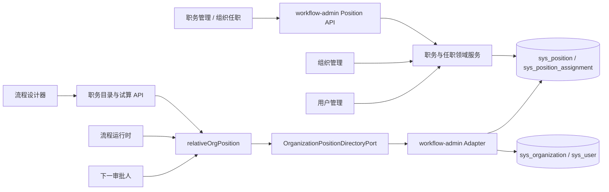
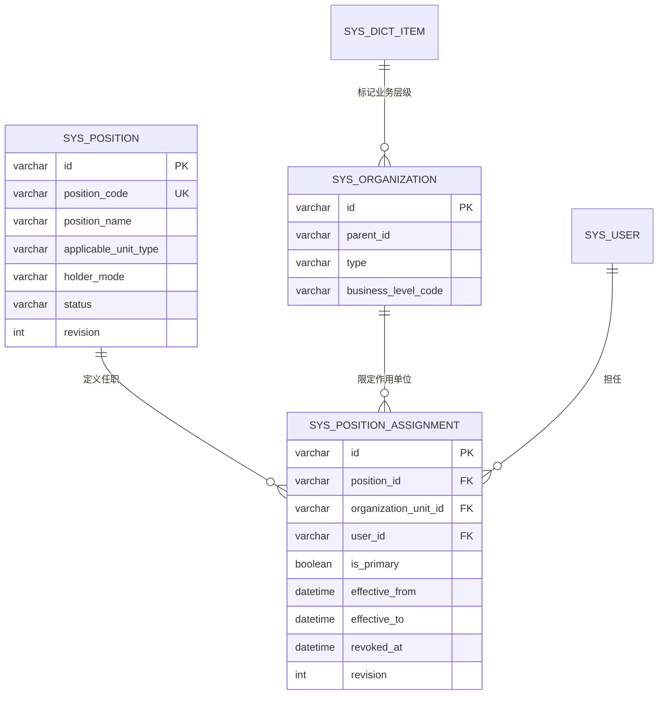
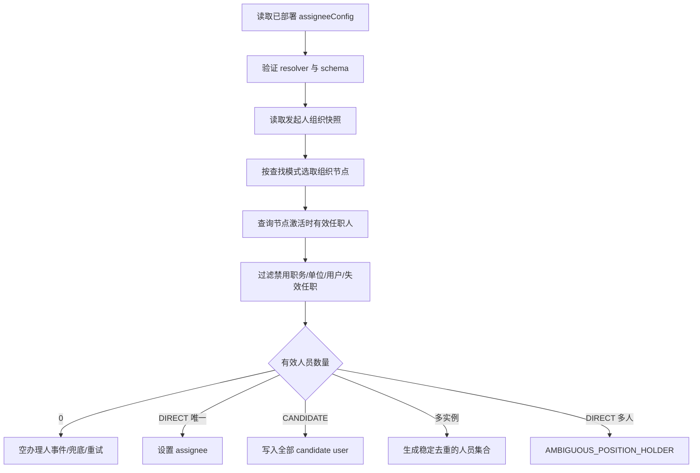

# Flow 职务管理与相对组织审批详细设计

> 状态：当前工作区实现基线，待迁移演练与上线验收
>
> 文档版本：1.1
>
> 日期：2026-08-28
>
> 适用范围：系统管理中的职务定义与组织任职，以及流程节点按发起人相对部门/组织动态选取审批人
>
> 实现状态：管理端、流程运行时、设计器和 `V069/V070` 迁移已在当前工作区实现；`relativeOrgPosition` 目录仍按发布门禁默认关闭，上线核对后显式启用

## 0. 方案摘要

本方案新增“全局职务字典 + 组织任职关系”，并将其接入现有流程人员解析机制。

| 关键问题 | 设计结论 |
| --- | --- |
| 职务是否等同角色 | 否。角色负责菜单/API 权限，职务负责组织范围内的业务身份，两者完全解耦 |
| 平行部门是否重复创建职务 | 否。`部门负责人` 等职务全局只创建一次；每个部门只维护自己的任职关系 |
| 任职如何表达 | `职务 + 组织节点 + 用户 + 有效期` 构成一段任职事实 |
| 是否建立部门岗位实例 | 不建立用户可管理的岗位实例；任命时直接写组织任职关系 |
| 流程是否绑定固定部门 | 否。流程只保存稳定 `positionCode` 和相对组织查找规则 |
| 不同部门深度如何兼容 | 默认使用“就近向上查找有任职人的单位”，自动计算实际上溯层数 |
| 如何固定到一级部门 | 组织节点增加稳定的业务层级编码，使用“按业务层级查找”，不依赖物理树深度 |
| 发起人调岗后如何处理 | 发起时冻结组织链；节点激活时查询当前任职人；任务创建后人员不自动漂移 |
| 如何接入现有流程 | 复用 `PersonResolver`，新增内置解析器 `relativeOrgPosition` |
| 无人命中如何处理 | 复用空办理人策略，默认创建可处置事件，不允许隐式跳过审批 |

核心示例：

```text
全局职务：部门负责人（UNIT_LEADER）

组织任职：
销售一部 + UNIT_LEADER -> 王敏
销售二部 + UNIT_LEADER -> 李雷
研发一部 + UNIT_LEADER -> 赵强

同一个流程节点：
“从流程发起人所在部门开始，查找最近配置了 UNIT_LEADER 的部门”

张三在销售一部发起 -> 王敏审批
李四在销售二部发起 -> 李雷审批
```

## 1. 背景、目标与范围

### 1.1 背景

当前系统已有用户、角色、用户组、组织/部门树和流程人员解析能力，但缺少“某人在某个组织节点担任某个职务”的业务模型。

现有角色是全局权限身份，无法表达：

- 王敏是销售一部负责人；
- 李雷是销售二部负责人；
- 张三提交的流程由其本部门或上级部门负责人审批；
- 发起人位于不同组织深度时，流程自动找到同一业务层级或最近有效负责人。

### 1.2 建设目标

1. 在系统管理菜单下提供职务定义和组织任职管理。
2. 一个职务定义可复用于任意数量的平行部门或组织。
3. 支持单人职务、多人职务、主职、有效期、转任、撤销和批量任命。
4. 在流程设计器中提供可理解的“相对组织职务”配置。
5. 支持本级、固定父级、就近向上和指定业务层级四种组织定位方式。
6. 保证发起人调岗、组织移动、负责人交接时的运行语义确定且可审计。
7. 普通任务、候选人任务、多实例任务和下一审批人预览使用同一解析规则。
8. 保持已有角色、用户组、人员接口和历史流程配置兼容。

### 1.3 非目标

1. 不将职务自动映射为菜单、接口或数据权限。
2. 不把 `sys_role` 或 `sys_user_role` 改造成组织职务。
3. V1 不支持按“当前办理人”或任意实体用户字段作为相对人员，先只支持流程发起人。
4. V1 不建设编制、岗位空缺、薪酬职级或人力资源岗位体系。
5. 不要求管理员为每个部门预先创建一个“部门岗位实例”。
6. 不因后台任职变化自动改派已经创建的 Flowable 任务。
7. 不允许无人审批时自动通过或静默跳过节点。

## 2. 术语与核心设计决策

### 2.1 角色、职务与任职

| 概念 | 含义 | 是否带组织范围 | 是否产生系统权限 |
| --- | --- | --- | --- |
| 角色 Role | 菜单、API、操作权限身份 | 当前模型不带 | 是 |
| 职务 Position | 稳定的业务责任定义，如部门负责人 | 定义本身不绑定具体单位 | 否 |
| 任职 Assignment | 某用户在某组织节点担任某职务的一段有效期 | 是 | 否 |

“职务赋权”在产品文案中统一改为“职务任命”或“任职授权”，避免与系统权限授权混淆。

### 2.2 全局职务只创建一次

`UNIT_LEADER` 是一条全局职务定义。销售一部、销售二部和研发一部各自配置负责人时，产生的是三条任职关系，不是三条职务定义。

```text
Position(UNIT_LEADER)
  ├─ Assignment(销售一部, 王敏)
  ├─ Assignment(销售二部, 李雷)
  └─ Assignment(研发一部, 赵强)
```

`applicableUnitType=DEPT` 的含义是“可在任意部门节点任职”，不是“绑定某个具体部门”。

### 2.3 不建立用户可见的部门岗位实例

V1 直接使用 `sys_position_assignment(position_id, organization_unit_id, user_id)` 表达任职，不增加需要管理员维护的 `sys_org_position` 页面或业务概念。

并发安全通过固定顺序锁定职务记录和目标组织记录实现：

1. `SELECT sys_position ... FOR UPDATE`；
2. `SELECT sys_organization ... FOR UPDATE`；
3. 查询重叠任职区间；
4. 校验并写入任职。

这样既避免首条任职并发插入漏洞，也不会让用户为平行部门创建大量重复岗位。

### 2.4 组织锚点冻结、任职人动态、已建任务冻结

本方案采用三段时间语义：

1. 流程发起时冻结发起人的组织/部门及祖先链。
2. 审批节点激活时，在冻结链上查询当时有效的任职人。
3. 任务一旦创建，办理人或候选人不随任职变化自动修改。

因此：

- 张三发起后调岗，流程仍沿张三发起时的组织链运行；
- 后续节点尚未激活时发生负责人交接，新负责人承接后续节点；
- 已创建任务需要通过转办、改派或事件处置显式调整。

### 2.5 物理层级与业务层级分离

`sys_organization.level` 是树的物理深度，不能代表“集团、公司、中心、一级部门、二级部门、团队”等业务层级。

新增 `business_level_code` 表达稳定业务层级，并复用现有系统字典 `sys_dict/sys_dict_item` 管理选项。组织移动后物理深度可以变化，业务层级编码只有在管理员明确变更时才变化。

## 3. 当前系统能力与差距

| 能力 | 当前状态 | 本次处理 |
| --- | --- | --- |
| 用户组织归属 | `SysUser` 已有单一 `orgId/deptId` | 增加部门属于组织的一致性校验 |
| 组织树 | `sys_organization` 已有 `parent_id/path/type/leader_id` | 增加业务层级编码，遍历使用 `parent_id` |
| 角色 | `sys_role/sys_user_role` 为全局权限角色 | 不复用、不改变 |
| 组织负责人 | 单一 `leader_id/leader_name` | 回填为内置 `UNIT_LEADER` 任职，旧字段作为兼容投影 |
| 人员解析 SPI | 已有 `PersonResolver`、描述符和 `extraParams` | 新增内置 `relativeOrgPosition` |
| 普通动态办理人 | `TASK_CREATED` 时解析 | 修正为尊重 `assignmentMode` |
| 多实例办理人 | 当前主要在流程启动前预计算 | 改为 Flowable 读取 collection 前调用同一解析器 |
| 空办理人 | 已有阻断、事件、兜底、重试策略 | 普通任务复用，多实例补节点进入级处理 |
| 下一审批人 | 已有预览、选项和提交前重验 | 调用同一职务解析器 |
| 流程配置 | 已有 `assigneeConfig v2` 和人员接口 | UI 新增一等公民入口，底层仍保存 v2 resolver 配置 |

相关现有实现：

- `workflow-admin/.../SysOrganization.java`
- `workflow-admin/.../SysUser.java`
- `workflow-contracts/.../IdentityDirectoryPort.java`
- `workflow-contracts/.../PersonResolveRequest.java`
- `workflow-process/.../PersonResolverRuntimeService.java`
- `workflow-process/.../PersonResolverTaskAssignmentListener.java`
- `workflow-process/.../MultiInstanceCollectionListener.java`
- `workflow-process/.../NextApproverCandidateService.java`
- `workflow-web/src/components/NodeConfigPanel.vue`
- `workflow-web/src/shared/process-config/index.js`

## 4. 总体架构



### 4.1 模块边界

| 模块 | 职责 |
| --- | --- |
| `workflow-db-migrator` | 新表、索引、组织业务层级字段、内置职务、负责人回填、菜单权限、resolver 目录 |
| `workflow-contracts` | 组织职务查询端口、组织快照值对象、解析结果与错误契约 |
| `workflow-admin` | 职务定义、任职事务、组织数据范围、批量任命、负责人兼容投影、查询适配器 |
| `workflow-process` | 发起时组织快照、内置 resolver、发布校验、任务/多实例/下一审批人接入 |
| `workflow-web` | 职务管理页、组织/用户快捷入口、流程节点配置和试算展示 |

### 4.2 依赖规则

`workflow-process` 不得新增对 `workflow-admin` Mapper 或内部 Service 的直接依赖。跨模块查询统一通过 `workflow-contracts` 中的 `OrganizationPositionDirectoryPort`。

当前实现端口：

```java
public interface OrganizationPositionDirectoryPort {
    InitiatorOrganizationSnapshot captureInitiatorSnapshot(String idOrUsername);

    OrganizationUnitStateView requireActiveOrganizationUnit(String unitId);

    PositionDefinitionView requireEnabledPosition(String positionCode);

    List<PositionDefinitionView> listEnabledPositions(String applicableUnitType);

    PositionHolderResolution findEffectiveHolders(
            String positionCode,
            String organizationUnitId,
            Instant asOf);

    boolean isOrganizationBusinessLevelEnabled(String businessLevelCode);

    List<OrganizationBusinessLevelView> listEnabledOrganizationBusinessLevels();
}
```

端口只暴露流程所需的轻量值对象，不泄漏 MyBatis Record、Mapper 或管理端 DTO。

## 5. 领域模型



### 5.1 职务定义聚合

核心属性：

- `positionCode`：全局稳定编码，创建后不可改、删除后不可复用；
- `positionName`：展示名称，可以修改；
- `applicableUnitType`：`ORG/DEPT/ANY`；
- `holderMode`：`SINGLE/MULTIPLE`；
- `builtIn`：内置职务标记；
- `status`：`ENABLED/DISABLED`；
- `revision`：乐观锁版本。

规则：

1. 已被任职或流程引用的职务不得删除，只能停用。
2. 修改 `applicableUnitType` 前必须验证现有任职节点类型。
3. `MULTIPLE -> SINGLE` 前必须验证所有当前及未来任职区间不存在多人重叠。
4. 内置 `UNIT_LEADER` 不可删除、不可修改编码。

### 5.2 任职事实

任职是一段有时间范围的业务事实，不使用覆盖更新抹除历史。

```text
[effectiveFrom, effectiveTo)
```

- `effectiveFrom` 包含；
- `effectiveTo` 不包含，空表示无限期；
- 撤销设置 `revokedAt/revokedBy/revokeReason`，并按需要缩短 `effectiveTo`；
- 重新任职新增一条新的任职记录；
- 数据库存 UTC，API 使用带时区的 ISO-8601 时间。

有效任职判断：

```text
revokedAt IS NULL
AND effectiveFrom <= asOf
AND (effectiveTo IS NULL OR effectiveTo > asOf)
```

### 5.3 单人职务与多人职务

`SINGLE`：

- 同一职务、同一组织节点不允许不同人员的任职区间重叠；
- 新负责人上任必须执行“转任”，显式结束原任职；
- 普通 `DIRECT` 审批应解析为唯一人员。

`MULTIPLE`：

- 同一组织节点允许多人同时任职；
- 同一时点最多一名主职人员；
- `CANDIDATE` 返回全部有效人员；
- `DIRECT + PRIMARY_OR_ERROR` 返回唯一主职，否则产生歧义事件；
- 多实例返回全部人员。

### 5.4 业务层级

组织增加 `businessLevelCode`，选项复用系统字典：

```text
dictCode: organization_business_level

示例项：
GROUP                 集团
COMPANY               公司
CENTER                中心
FIRST_LEVEL_DEPT      一级部门
SECOND_LEVEL_DEPT     二级部门
TEAM                  团队
```

业务层级编码一旦被已发布流程引用，不允许直接删除或复用；可停用，但历史实例仍使用发起时快照中的编码。

## 6. 数据模型详细设计

### 6.1 `sys_position`

| 字段 | 类型建议 | 约束/说明 |
| --- | --- | --- |
| `id` | `varchar(64)` | 主键，与现有系统 ID 类型保持一致 |
| `position_code` | `varchar(100)` | 全局唯一，唯一键不带 `deleted` |
| `position_name` | `varchar(100)` | 必填 |
| `applicable_unit_type` | `varchar(16)` | `ORG/DEPT/ANY` |
| `holder_mode` | `varchar(16)` | `SINGLE/MULTIPLE` |
| `built_in` | `tinyint` | 内置标记 |
| `status` | `varchar(16)` | `ENABLED/DISABLED` |
| `sort_order` | `int` | 排序 |
| `description` | `varchar(500)` | 描述 |
| `revision` | `int` | 乐观锁 |
| `created_by/updated_by` | `varchar(64)` | 操作人 |
| `create_time/update_time` | `datetime(6)` | 审计时间 |
| `deleted` | `tinyint` | 逻辑删除；编码仍不可复用 |

索引：

- `UNIQUE(position_code)`；
- `(status, deleted, sort_order)`。

数据库约束：

- `CHECK (applicable_unit_type IN ('ORG','DEPT','ANY'))`；
- `CHECK (holder_mode IN ('SINGLE','MULTIPLE'))`；
- `CHECK (status IN ('ENABLED','DISABLED'))`；
- `CHECK (built_in IN (0,1) AND deleted IN (0,1))`；
- `CHECK (revision >= 1)`。

### 6.2 `sys_position_assignment`

| 字段 | 类型建议 | 约束/说明 |
| --- | --- | --- |
| `id` | `varchar(64)` | 主键 |
| `position_id` | `varchar(64)` | 指向全局职务 |
| `organization_unit_id` | `varchar(64)` | 统一指向 `sys_organization.id` |
| `user_id` | `varchar(64)` | 任职用户 |
| `is_primary` | `tinyint` | 是否主职 |
| `sort_order` | `int` | 多人结果稳定排序 |
| `effective_from` | `datetime(6)` | 必填，UTC |
| `effective_to` | `datetime(6)` | 可空，必须大于开始时间 |
| `revoked_at` | `datetime(6)` | 可空 |
| `revoked_by` | `varchar(64)` | 可空 |
| `revoke_reason` | `varchar(500)` | 可空 |
| `revision` | `int` | 乐观锁 |
| `created_by/updated_by` | `varchar(64)` | 操作人 |
| `create_time/update_time` | `datetime(6)` | 审计时间 |

索引：

- `UNIQUE(position_id, organization_unit_id, user_id, effective_from)`，防止完全相同的任职事实重复写入；
- `(position_id, organization_unit_id, effective_from, effective_to, revoked_at)`；
- `(user_id, effective_from, effective_to, revoked_at)`；
- `(organization_unit_id, position_id)`。

数据库约束：

- `CHECK (is_primary IN (0,1))`；
- `CHECK (effective_to IS NULL OR effective_to > effective_from)`；
- `CHECK (revoked_at IS NULL OR revoked_at >= effective_from)`；
- `CHECK (revision >= 1)`；
- `position_id/organization_unit_id/user_id` 使用限制删除的外键，不设置级联删除；
- 外键列的字符集和排序规则必须与被引用主键完全一致。

真正的区间重叠约束在锁定职务和组织记录后由领域服务校验，不能仅依赖普通唯一键。

两个区间重叠条件：

```text
existing.from < new.to(空视为正无穷)
AND existing.to(空视为正无穷) > new.from
```

### 6.3 `sys_organization` 扩展

新增：

| 字段 | 类型建议 | 说明 |
| --- | --- | --- |
| `business_level_code` | `varchar(100)` | 可空，引用 `organization_business_level` 字典项编码 |

不得使用现有 `level` 代替业务层级。组织移动时仍需修正现有子树 `level` 一致性问题，但该修正不属于本功能的业务层级语义。

### 6.4 用户组织一致性

用户保存时增加以下不变量：

1. `orgId` 必须指向启用的 `type=org` 节点；
2. `deptId` 必须指向启用的 `type=dept` 节点；
3. `deptId` 必须位于 `orgId` 的组织范围内；
4. 组织链不得存在环；
5. 没有部门的用户不能使用 `anchor=DEPARTMENT`，必须进入明确空结果。

### 6.5 任职事务与锁顺序

任命、转任、撤销、调整有效期统一使用事务：

1. 按 `positionId` 排序锁定相关 `sys_position`；
2. 按 `organizationUnitId` 排序锁定相关 `sys_organization`；
3. 校验职务、组织、用户状态和单位类型；
4. 查询任职区间重叠；
5. 校验 `SINGLE/MULTIPLE/isPrimary` 规则；
6. 写入或撤销任职；
7. 写必达审计；
8. 提交事务。

批量任命必须使用同一排序规则，避免多部门交叉操作产生死锁。

所有任职写入口必须遵循同一锁协议，因此即使当前没有任职记录，在 `READ_COMMITTED` 下也会通过已存在的职务行和组织行串行化“首条任命”。将职务从 `MULTIPLE` 改成 `SINGLE` 时先锁定职务行；新任职事务同样先锁该行，所以完成全部历史及未来区间检查前不会有新任职插入。

## 7. 系统管理产品设计

### 7.1 菜单与路由

在“系统管理”下新增：

```text
菜单：职务管理
路由：/system/position
图标：Briefcase
页面：workflow-web/src/views/system/Position.vue
```

侧栏由后端菜单树驱动，因此必须同时增加：

- 前端静态路由；
- 后端 `sys_menu` 菜单节点；
- 功能权限节点；
- 超级管理员默认菜单授权。

### 7.2 职务定义页签

查询条件：名称/编码、适用单位类型、任职模式、状态。

列表字段：

- 职务名称；
- 稳定编码；
- 可任职单位类型；
- 单人/多人；
- 当前有效任职数；
- 流程引用数；
- 状态；
- 内置标记；
- 更新时间。

操作：新增、编辑、启停、查看引用。被使用的职务不提供直接删除。

### 7.3 组织任职页签

采用左侧组织树、右侧职务与任职人矩阵：

```text
销售一部

职务             当前任职人       有效期             操作
部门负责人       王敏             长期               转任/撤销
财务负责人       李雷             2026-01-01 起      编辑/撤销
HRBP             张华、赵敏        长期               管理人员
```

新增任职流程：

1. 选择组织/部门；
2. 系统按 `applicableUnitType` 筛选可用职务；
3. 选择用户，默认只展示该组织范围内的用户；
4. 设置有效期、是否主职和排序；
5. 提交前预检冲突；
6. 确认后创建任职。

如业务允许跨部门兼任，可通过独立能力和明确提示开放，不能仅凭 `system:position:assign` 默认跨越管理员的数据范围。

### 7.4 用户管理快捷入口

用户列表增加：

- 职务筛选；
- 任职摘要；
- “职务任命”行操作。

打开抽屉后锁定当前用户，再选择职务、组织节点和有效期。不得在现有用户编辑表单中加入一个没有组织范围的普通职务多选框。

### 7.5 组织管理负责人快捷入口

组织页原“负责人”字段改为内置 `UNIT_LEADER` 的快捷维护入口：

- 选择新负责人等价于执行单人职务转任；
- 清空负责人等价于撤销当前任职；
- 组织接口不再独立写一套权威 `leader_id`；
- 过渡期由任职服务单向刷新旧 `leader_id/leader_name` 投影。

### 7.6 平行部门批量任命

提供表格式批量任命：

| 组织节点 | 职务 | 新任职人 | 生效时间 | 处理方式 |
| --- | --- | --- | --- | --- |
| 销售一部 | 部门负责人 | 王敏 | 立即 | 新任命 |
| 销售二部 | 部门负责人 | 李雷 | 立即 | 转任原负责人 |
| 销售三部 | 部门负责人 | 张华 | 下月一日 | 预约任命 |

规则：

- 一个职务定义可覆盖任意数量平行部门；
- 每一行产生一条任职事实，不产生新的职务定义；
- 默认最多 200 行，超出后使用受控导入；
- 提供只读预检，逐行显示重复、冲突、越权、用户禁用、单位类型不符等问题；
- 正式提交默认全量原子成功；
- 支持 `Idempotency-Key` 防止重复提交；
- 单人职务已有任职时，必须显式选择“转任并结束原任职”；
- 批量事务按职务 ID、组织 ID 排序加锁。

### 7.7 影响提示

停用职务、撤销任职、负责人转任时统一提示：

> 本操作只影响尚未创建的后续审批任务。已经生成的办理人、候选人和会签任务不会自动改派。

## 8. 权限、数据范围与审计

### 8.1 权限码

| 权限码 | 用途 |
| --- | --- |
| `system:position:view` | 查看职务和任职 |
| `system:position:manage` | 新增、编辑、启停职务 |
| `system:position:assign` | 任命、转任、撤销、调整有效期 |

流程设计者读取启用职务和执行试算，可由 `process:definition:view/manage` 与 `system:position:view` 任一权限放行，但不能因此获得任职修改权限。

### 8.2 组织数据范围

任职管理必须同时满足：

```text
功能权限
    ∩
管理员可管理的组织数据范围
```

具有 `system:position:assign` 不代表可以跨所有组织任命。查询、预检、提交、撤销必须重复执行服务端组织范围校验。

### 8.3 审计

职务定义变更记为高风险审计；任命、转任、撤销和主职变更记为必达审计。

审计载荷至少包含：

- 操作人、请求/Trace ID；
- 用户 ID；
- 职务 ID 和稳定编码；
- 组织节点 ID 和路径；
- 变更前后有效期；
- 变更前后主职标志；
- 转任或撤销原因；
- 批量请求标识。

新权限默认只赋予超级管理员，不能因为已有 `system:user:manage` 而静默扩大审批授权。

## 9. 管理端 API 设计

项目现有系统管理接口采用 `GET` 查询、`POST` 变更的兼容风格，本功能保持一致；集合命名和 DTO 仍按资源语义设计。

### 9.1 职务资源

| 方法 | 路径 | 权限 | 说明 |
| --- | --- | --- | --- |
| `GET` | `/api/system/position/page` | `view` | 分页查询 |
| `GET` | `/api/system/position/enabled` | `view`、`assign` 或流程设计权限 | 启用选项 |
| `GET` | `/api/system/position/{id}` | `view` | 详情与引用统计 |
| `POST` | `/api/system/position` | `manage` | 新建 |
| `POST` | `/api/system/position/{id}/update` | `manage` | 编辑可变字段 |
| `POST` | `/api/system/position/{id}/status` | `manage` | 启停 |
| `POST` | `/api/system/position/{id}/delete` | `manage` | 仅未使用定义可软删 |

新增请求示例：

```json
{
  "positionCode": "UNIT_LEADER",
  "positionName": "部门负责人",
  "applicableUnitType": "ANY",
  "holderMode": "SINGLE",
  "sortOrder": 10,
  "description": "组织或部门负责人"
}
```

### 9.2 任职资源

| 方法 | 路径 | 权限 | 说明 |
| --- | --- | --- | --- |
| `GET` | `/api/system/position/assignments/page` | `view` | 按用户、职务、组织、有效状态查询 |
| `GET` | `/api/system/org/{unitId}/position-assignments` | `view` | 组织视角任职矩阵 |
| `GET` | `/api/system/user/{userId}/position-assignments` | `view` | 用户视角任职 |
| `GET` | `/api/system/org/business-level-options` | `system:organization:view` | 组织编辑专用的启用业务层级，不放宽任意字典读取 |
| `POST` | `/api/system/org/{unitId}/leader` | `assign` | 通过 `UNIT_LEADER` 转任或清空负责人 |
| `POST` | `/api/system/position/assignments/precheck` | `assign` | 批量只读预检 |
| `POST` | `/api/system/position/assignments/batch` | `assign` | 原子批量任命/转任 |
| `POST` | `/api/system/position/assignments/{id}/revoke` | `assign` | 撤销任职 |
| `POST` | `/api/system/position/assignments/{id}/update-period` | `assign` | 调整尚未发生或未来结束时间 |

批量请求示例：

```json
{
  "atomic": true,
  "reason": "2026 年销售体系负责人调整",
  "items": [
    {
      "positionCode": "UNIT_LEADER",
      "organizationUnitId": "dept-sales-1",
      "userId": "user-wang",
      "effectiveFrom": "2026-09-01T00:00:00+08:00",
      "effectiveTo": null,
      "isPrimary": true,
      "replaceExisting": true
    },
    {
      "positionCode": "UNIT_LEADER",
      "organizationUnitId": "dept-sales-2",
      "userId": "user-li",
      "effectiveFrom": "2026-09-01T00:00:00+08:00",
      "effectiveTo": null,
      "isPrimary": true,
      "replaceExisting": true
    }
  ]
}
```

预检和提交使用相同领域校验器。提交时必须再次校验，不能信任预检结果。

### 9.3 流程设计辅助接口

| 方法 | 路径 | 权限 | 说明 |
| --- | --- | --- | --- |
| `GET` | `/api/process-design/position-options` | 流程设计或职务查看 | 按组织基准过滤职务选项 |
| `GET` | `/api/process-design/organization-business-levels` | 流程设计 | 业务层级选项 |
| `POST` | `/api/process-design/relative-position-preview` | 流程设计 | 使用样例用户执行权威试算 |

试算请求：

```json
{
  "sampleUserId": "user-zhang",
  "config": {
    "schemaVersion": 1,
    "subject": "PROCESS_INITIATOR",
    "anchor": "DEPARTMENT",
    "positionCode": "UNIT_LEADER",
    "hierarchy": {
      "mode": "NEAREST_WITH_HOLDER",
      "startLevel": 0,
      "maxHops": 16,
      "eligibleUnitTypes": ["dept"]
    },
    "multipleMatchPolicy": "PRIMARY_OR_ERROR"
  }
}
```

试算响应：

```json
{
  "anchorUnit": {"id": "dept-c", "name": "三级部门 C"},
  "scannedUnits": [
    {"id": "dept-c", "name": "三级部门 C", "depth": 0, "result": "NO_HOLDER"},
    {"id": "dept-b", "name": "二级部门 B", "depth": 1, "result": "NO_HOLDER"},
    {"id": "dept-a", "name": "一级部门 A", "depth": 2, "result": "MATCHED"}
  ],
  "matchedUnit": {"id": "dept-a", "name": "一级部门 A", "depth": 2},
  "holders": [{"userId": "user-wang", "displayName": "王经理"}],
  "resultCode": "RESOLVED"
}
```

### 9.4 稳定错误码

| 错误码 | 含义 |
| --- | --- |
| `POSITION_CODE_DUPLICATED` | 职务编码重复 |
| `POSITION_REFERENCED` | 职务已被任职或流程引用 |
| `POSITION_UNIT_TYPE_MISMATCH` | 职务不适用于目标组织节点 |
| `ASSIGNMENT_PERIOD_INVALID` | 有效期不合法 |
| `ASSIGNMENT_PERIOD_OVERLAPPED` | 任职区间冲突 |
| `SINGLE_POSITION_OCCUPIED` | 单人职务已有重叠任职人 |
| `PRIMARY_HOLDER_CONFLICT` | 多人职务存在重叠主职 |
| `ORGANIZATION_SCOPE_FORBIDDEN` | 超出管理员组织数据范围 |
| `ORGANIZATION_HIERARCHY_INVALID` | 组织链不完整或存在环 |
| `ASSIGNMENT_REVISION_CONFLICT` | 并发修改冲突 |

## 10. 流程设计器详细设计

### 10.1 指定方式

在用户任务“指定方式”中新增展示类型“相对组织职务”。该类型只属于设计器 UI；持久化继续使用已有 `assigneeConfigVersion=2` 和 `assigneeType=interface`。

这样无需引入 v3，也不会影响已有固定人员、用户组、角色、表达式和第三方人员接口。

### 10.2 配置字段

| 字段 | V1 取值 | 说明 |
| --- | --- | --- |
| 职务 | 启用的稳定 `positionCode` | 不保存数据库 ID 或名称 |
| 相对人员 | `PROCESS_INITIATOR` | V1 仅流程发起人 |
| 组织锚点 | `DEPARTMENT/ORGANIZATION` | 发起人所属部门或组织 |
| 查找方式 | 四种模式 | 见下节 |
| 任务分配 | `DIRECT/CANDIDATE` | 多实例由 BPMN loop 决定 |
| 多人处理 | `ERROR/PRIMARY_OR_ERROR/ALL` | 必须与任务模式兼容 |
| 空办理人 | 复用现有策略 | 默认运行时事件 |

### 10.3 四种组织查找方式

#### `SELF`：当前单位

- 只检查锚点；
- 当前单位没有任职人时返回空结果；
- 不自动向上。

#### `FIXED_ANCESTOR`：固定父级

- `ancestorHops=N` 按原始 `parent_id` 边数计算；
- `N=1` 表示直接父节点，不表示“第一个上级部门”；
- 目标节点类型不符合时返回空结果，不继续查找；
- 适用于树结构固定且产品明确要求父子边数的场景。

#### `NEAREST_WITH_HOLDER`：就近向上查找有任职人的单位

- 从 `startLevel` 指定位置开始逐级向上；
- `startLevel=0` 包含本级，`1` 从父级开始；
- 每一级先校验单位类型，再查询该单位当前有效任职人；
- 命中第一个存在有效任职人的单位后立即停止；
- 不合并多个层级的任职人；
- 到根或 `maxHops` 后仍无人则返回空结果。

这是不同部门深度场景的默认方案：

```text
一级部门 A（负责人：王经理）
└─ 二级部门 B（无负责人）
   └─ 三级部门 C（无负责人）

C 的人员发起：C -> B -> A，上溯 2 级命中王经理
B 的人员发起：B -> A，上溯 1 级命中王经理
A 的人员发起：A，当前级命中王经理
```

#### `BUSINESS_LEVEL`：指定业务层级

- `businessLevelCode` 必填；
- 在冻结组织链中向上查找第一个业务层级编码精确匹配的节点；
- 同一路径重复出现同一业务层级时取最近者并记录数据质量告警；
- 找到目标层级但该节点无人任职时返回空结果，不继续找另一个同层级节点；
- 用于中间层也有同名职务、但流程必须固定到一级部门等场景。

```text
A：FIRST_LEVEL_DEPT，负责人王经理
└─ B：SECOND_LEVEL_DEPT，负责人李经理
   └─ C：TEAM

配置 BUSINESS_LEVEL + FIRST_LEVEL_DEPT：
C 发起 -> A，上溯 2 级 -> 王经理
B 发起 -> A，上溯 1 级 -> 王经理
```

### 10.4 配置协议

推荐完整配置：

```json
{
  "assignmentConfigVersion": 2,
  "assigneeType": "interface",
  "resolverCode": "relativeOrgPosition",
  "resolverDisplayName": "相对组织职务",
  "assignmentMode": "CANDIDATE",
  "extraParams": {
    "schemaVersion": 1,
    "subject": "PROCESS_INITIATOR",
    "anchor": "DEPARTMENT",
    "positionCode": "UNIT_LEADER",
    "hierarchy": {
      "mode": "NEAREST_WITH_HOLDER",
      "startLevel": 0,
      "maxHops": 16,
      "eligibleUnitTypes": ["dept"]
    },
    "multipleMatchPolicy": "ALL"
  },
  "emptyAssigneeStrategy": {
    "policy": "CREATE_INCIDENT",
    "responsibilityOwner": "workflow-admin"
  }
}
```

配置规则：

- `schemaVersion` 必须为 `1`，未知版本发布失败；
- `subject` V1 只允许 `PROCESS_INITIATOR`；
- `positionCode` 必须存在且启用；
- `anchor` 只允许 `DEPARTMENT/ORGANIZATION`；
- `maxHops` 严格限制为 `1..32`；
- `NEAREST_WITH_HOLDER.startLevel` 必须小于等于 `maxHops`；
- `BUSINESS_LEVEL` 不接受外部 `maxHops`，统一受 32 节点冻结链上限保护；
- `DIRECT` 只允许 `ERROR/PRIMARY_OR_ERROR`；
- `CANDIDATE` 和多实例只允许 `ALL`；
- 与当前模式无关的字段应校验失败，不能静默忽略；
- 部门锚点默认只匹配 `dept`，组织锚点默认只匹配 `org`；
- 如后续开放跨类型查找，必须在 UI 中显式配置，不能隐式越过边界。

### 10.5 自然语言摘要与试算

设计器实时显示摘要：

> 从流程发起人所在部门开始，逐级向上查找最近配置了“部门负责人”的部门；命中多人时作为候选人。

试算必须调用后端同一个权威解析器，前端只渲染：

- 样例用户及组织路径；
- 起始单位；
- 扫描单位和每一级结果；
- 命中单位及实际上溯层数；
- 最终人员；
- 被过滤人员及原因；
- 空结果或配置错误说明。

## 11. 流程运行时设计

### 11.1 发起人组织快照

内部变量：

```json
{
  "_wfInitiatorOrgSnapshotV1": {
    "snapshotVersion": 1,
    "userId": "user-zhang",
    "username": "zhangsan",
    "organizationId": "org-a",
    "departmentId": "dept-c",
    "units": [
      {"id": "dept-c", "type": "dept", "businessLevelCode": "TEAM"},
      {"id": "dept-b", "type": "dept", "businessLevelCode": "SECOND_LEVEL_DEPT"},
      {"id": "dept-a", "type": "dept", "businessLevelCode": "FIRST_LEVEL_DEPT"},
      {"id": "org-a", "type": "org", "businessLevelCode": "COMPANY"}
    ],
    "capturedAt": "2026-08-27T10:00:00+08:00"
  }
}
```

要求：

1. 本地实体流程和开放流程入口都必须捕获快照；
2. 外部发起人先映射为本地用户；
3. 业务变量合并完成后由服务端最后写入快照；
4. 快照变量加入 reserved-variable 列表，调用方不能覆盖；
5. 任务详情、开放 API 和实体数据回显统一过滤内部快照；
6. 使用 `parent_id` 构造完整祖先链，设置 visited 集合和最大 32 层；
7. 不依赖可能过期的 `path/level`；
8. 快照同时保存业务层级编码，组织后续移动或重分类不改变历史实例。

历史实例不存在快照时：

- 默认严格模式进入 `ORG_CONTEXT_NOT_SNAPSHOTTED` 事件；
- 可通过显式兼容开关临时使用发起人当前组织，并记录警告；
- 不允许静默回退。

### 11.2 权威解析流程



### 11.3 组织节点状态规则

- 活跃单位但没有有效任职人：`NEAREST_WITH_HOLDER` 继续向上；
- 任职人被禁用、任职失效或撤销：视为该级没有有效任职人；
- 快照中的组织节点已删除、禁用或不存在：Fail Closed，产生组织上下文事件，不按新的实时父链重路由；
- `SELF/FIXED/BUSINESS_LEVEL` 命中单位无人时直接空结果，不退化为就近查找；
- `NEAREST_WITH_HOLDER` 命中第一层有效人员后停止，不合并更高层人员。

### 11.4 普通任务

普通任务继续在 `TASK_CREATED` 时解析，但需要修正当前 resolver 分支：

- `DIRECT`：只设置唯一办理人；
- `CANDIDATE`：全部写为 candidate user，不预先指定第一人；
- 禁止把 `positionCode` 写成 Flowable candidate group，因为职务没有携带相对组织范围；
- 复用统一 `applyResolvedUsers`，删除“第一人 assignee、其余 candidate”的硬编码。

### 11.5 多实例任务

当前多实例主要在流程启动前预计算全部节点人员，与“节点激活时使用当前任职人”的语义不一致。

目标设计：

1. 为相对职务注册平台受控的 multi-instance collection handler；
2. 在 Flowable 读取 collection 前调用同一 resolver；
3. 去重并稳定排序；
4. 将人工下一审批人覆盖在读取 collection 前一次性消费；
5. 空集合在创建 0 个实例前阻断节点进入，不能自动越过审批；
6. 并行/串行和会签/或签完成条件继续复用现有配置。

不能依赖 `ACTIVITY_STARTED` 再填充 collection，因为引擎可能已经读取集合。

### 11.6 下一审批人

以下三个阶段调用同一个 resolver：

1. 前序任务展示下一审批人预览；
2. 用户打开可选人员范围；
3. 完成任务前在同一事务内重新解析并验证。

预览后若负责人被撤销，旧选择必须在提交时被拒绝。人工指定的用户只能来自当前解析范围，不能通过直接传 `userId` 越权注入。

下一审批人 `scopeKey` 应包含规范化后的完整相对职务规则 JSON。赋权变化不改变 `scopeKey`，但提交前仍必须实时重验；响应可返回 `directoryRevision/resolvedAt`，提示前端候选范围已经变化。

当 `node_reference` 引用一个相对职务节点时，引用方仍使用当前流程实例的发起人组织快照重新执行目标节点规则，不能复制发布时或其他实例中的静态人员名单。

### 11.7 结果去重与排序

- 同一用户由多条任职记录命中时只保留一次；
- 排序：`isPrimary DESC, assignment.sortOrder ASC, effectiveFrom ASC, userId ASC`；
- `DIRECT + 0`：空结果；
- `DIRECT + 1`：直接分配；
- `DIRECT + 多人 + ERROR`：歧义事件；
- `DIRECT + 多人 + PRIMARY_OR_ERROR`：只接受唯一主职；
- `CANDIDATE`：全部作为候选人；
- 多实例：全部生成实例。

### 11.8 空结果与结构化原因

至少提供：

- `INITIATOR_NOT_FOUND`
- `INITIATOR_DEPARTMENT_MISSING`
- `INITIATOR_ORGANIZATION_MISSING`
- `ORG_CONTEXT_NOT_SNAPSHOTTED`
- `ORG_SNAPSHOT_INVALID`
- `HIERARCHY_CYCLE`
- `HIERARCHY_EXHAUSTED`
- `BUSINESS_LEVEL_NOT_FOUND`
- `POSITION_NOT_FOUND`
- `POSITION_DISABLED`
- `POSITION_NO_ACTIVE_HOLDER`
- `AMBIGUOUS_POSITION_HOLDER`

发布时只验证静态配置、职务和业务层级编码。动态无人属于运行时事件，默认使用 `CREATE_INCIDENT`；不得以 `BLOCK_PUBLISH` 假装能验证所有未来发起人。

多实例必须增加节点进入级 incident/retry/fallback，不能直接复用只在任务创建后运行的单任务空办理人逻辑。

## 12. 发布校验与兼容性

### 12.1 发布校验

新增 `PersonResolverConfigurationValidator` 扩展点，由 resolver 自己验证配置，避免 `ProcessBpmnPublishSanitizer` 硬编码职务规则。

校验内容：

- resolver 已注册、目录启用、支持 `ASSIGNEE/MULTI_INSTANCE`；
- `extraParams.schemaVersion`；
- 职务编码存在且启用；
- 组织锚点、查找模式和模式专属参数；
- 业务层级编码存在；
- `assignmentMode/multipleMatchPolicy` 兼容；
- 最大上溯层数；
- 不认识的必需字段或版本直接拒绝发布。

发布校验不要求每个部门当前都有任职人；设计器试算和运行时空办理人策略负责动态数据。

### 12.2 现有配置兼容

- 保持 `assignmentConfigVersion=2`；
- 已有固定人员、用户组、角色、表达式、节点引用和其他 interface resolver 不改变；
- “相对组织职务”只是 UI 语义，底层是特定 resolver；
- 老流程实例没有该 resolver 配置时完全不受影响；
- 已发布的职务编码不可重命名或复用。

## 13. `leader_id` 兼容迁移

### 13.1 内置职务

新增：

```text
positionCode: UNIT_LEADER
positionName: 负责人
applicableUnitType: ANY
holderMode: SINGLE
builtIn: true
```

### 13.2 回填

迁移前置检查所有非空 `leader_id`：

- 用户必须存在；
- 组织节点必须存在；
- 同一组织节点只有一个负责人；
- 悬空引用必须在 DDL 前失败并要求修复，不能静默跳过。

回填为：

```text
positionId = UNIT_LEADER.id
organizationUnitId = sys_organization.id
userId = sys_organization.leader_id
isPrimary = true
effectiveFrom = 迁移执行时刻
```

现有表无法推断历史任职开始时间，因此回填的 `effectiveFrom` 只能取迁移时刻，必须在发布说明中声明。

### 13.3 过渡期单一权威来源

- 新任职表是权威来源；
- `leader_id/leader_name` 仅作为单向兼容投影；
- 组织负责人修改必须调用任职领域服务；
- 多人职务只有唯一主职可以投影到旧负责人字段；
- 首个版本不删除旧字段；
- 全部读写完成切换后，再用未来的新迁移删除旧字段。

## 14. Flyway 迁移与发布策略

### 14.1 迁移约束

截至本文编写时：

- Git 已跟踪的最大 Flyway 版本为 `V065`；
- 当前共享工作区另有未跟踪的 `V066/V067/V068`；
- 本功能已在复核版本占用后使用 `V069/V070`，未修改共享工作区已有的 `V066/V067/V068`；
- 严禁修改、删除或重命名 `V001` 及任何已进入主分支的版本迁移；
- 不得使用 `flyway repair` 掩盖历史变化；
- 新数据库必须按全部版本顺序执行。
- 新表外键列必须显式使用与 `sys_user.id/sys_organization.id` 相同的字符集和排序规则；
- resolver Bean、目录记录和设计器入口必须在同一兼容发布包中交付，不能只写目录记录而没有可调用实现。

### 14.2 已实现迁移拆分

1. `V069__organization_position_model.sql`
   - 增加 `sys_organization.business_level_code`；
   - 创建职务和任职表、索引与约束；
   - 创建业务层级字典；
   - 插入内置 `UNIT_LEADER`；
   - 回填现有负责人任职。
2. `V070__position_management_menu_and_resolver.sql`
   - 在全量基线缺少稳定父目录时补建 `id=400` 的“系统管理”目录，既有合法目录不覆盖；
   - 新增职务管理菜单和权限资源；
   - 默认授权超级管理员；
   - 插入并默认关闭 `relativeOrgPosition` resolver 目录记录；
   - 完成部署验证后由管理员启用。

`V069/V070` 创建前已复核：Git 已跟踪最大版本仍为 `V065`，共享工作区已有未跟踪的 `V066/V067/V068`，因此本功能从 `V069` 起顺延且未触碰前述文件。

### 14.3 前置检查

利用现有 `BusinessMigrationPreflight` 在任何新 DDL 前检查：

- 悬空 `leader_id`；
- 用户部门与组织不一致；
- 组织父链成环；
- 业务层级字典编码冲突；
- 预留职务编码冲突；
- 迁移文件版本冲突。

### 14.4 部署顺序

1. 执行数据前置检查；
2. 部署新迁移与应用代码；
3. 验证负责人回填和兼容投影；
4. 超级管理员完成职务和组织层级基础数据；
5. 启用 resolver 目录；
6. 开放设计器配置入口；
7. 观察空结果、歧义和解析延迟指标；
8. 再向普通管理员授权任职权限。

### 14.5 回退策略

- 停用 `relativeOrgPosition` resolver 和职务管理菜单；
- 禁止新流程发布该配置；
- 已运行实例继续使用已部署代码处置或暂停；
- 旧 `leader_id/leader_name` 因持续投影仍可供兼容读取；
- 不逆向删除任职历史，不修改 Flyway 历史，不执行 `repair`。

## 15. 可观测性与运维处置

每次解析记录结构化信息：

- `processDefinitionId/processInstanceId/nodeId/taskId`；
- `resolverCode/positionCode`；
- `initiatorId/anchorUnitId`；
- `lookupMode/startLevel/maxHops`；
- 扫描单位 ID、命中单位 ID、实际上溯层数；
- 解析人数、过滤人数和结果码；
- `resolvedAt/directoryRevision`。

建议指标：

- `workflow_position_resolve_total{resultCode}`；
- `workflow_position_resolve_duration`；
- `workflow_position_empty_total{reason}`；
- `workflow_position_ambiguous_total`；
- `workflow_org_snapshot_missing_total`。

incident 保存职务编码、组织快照版本、扫描轨迹和失败原因，管理员可选择：

- 修复任职后重试；
- 使用受控兜底用户/组；
- 显式改派；
- 终止流程。

## 16. 测试方案

### 16.1 数据与并发

- 职务编码唯一且不可复用；
- 职务适用单位类型校验；
- 单人职务区间重叠；
- 多人职务唯一主职；
- 转任在相邻半开区间无重叠；
- 两个管理员并发进行首条任命；
- 批量锁顺序和死锁重试；
- 任职撤销保留历史和审计；
- 用户、职务、组织节点禁用过滤；
- 用户部门属于组织的数据一致性。

### 16.2 层级解析

- `SELF` 本级一人、多人、无人；
- `FIXED_ANCESTOR` 上溯 1/2 层、越过根、节点类型不符；
- `NEAREST_WITH_HOLDER` 本级命中、上一级命中、上两级命中；
- 多个层级均有任职人时只取最近一级；
- 全链无人；
- `BUSINESS_LEVEL` 正常命中、缺失、重复标记和层级重分类；
- 组织链成环或超过最大深度；
- 快照节点被删除或禁用。

### 16.3 时间变化

- 发起后用户调部门；
- 发起后组织节点移动；
- 发起后负责人转任，节点尚未激活；
- 任务创建后撤销任职；
- 任职到期恰好位于半开区间边界；
- 历史实例缺少组织快照的严格和兼容模式。

### 16.4 流程运行时

- 普通 `DIRECT` 唯一人员；
- `DIRECT` 多人产生歧义事件；
- 普通 `CANDIDATE` 不预设第一办理人；
- 多实例并行、串行、会签和或签；
- 多实例空集合不自动通过；
- 空办理人事件、重试和兜底；
- 下一审批人预览后任职变化，提交前重验；
- 人工传入越权用户被拒绝；
- 本地流程与开放流程均正确生成快照。

### 16.5 前端

- `/system/position` 路由、菜单和标题；
- 查看、维护、任职三类权限矩阵；
- 职务编码只读和引用提示；
- 组织树单位类型过滤；
- 单人职务转任确认；
- 平行部门批量预检、原子提交和幂等；
- 节点配置构建、回显和切换清理；
- 四种查找方式字段显隐和校验；
- 自然语言摘要；
- 试算轨迹、失败态和重试；
- 下一审批人仍只展示后端返回的具体用户。

### 16.6 迁移

- 空库按完整 Flyway 链初始化；
- 当前最大版本数据库升级；
- 有效负责人完整回填；
- 悬空负责人在 preflight 阶段失败且未执行部分 DDL；
- 升级前后 `leader_id` 兼容读取；
- 提交前确认没有修改、删除或重命名既有迁移。

## 17. 验收场景

### 17.1 平行部门复用同一职务

给销售一部、销售二部和研发一部分别任命负责人，职务字典中只能存在一条 `UNIT_LEADER`。

### 17.2 不同深度自动找到同一负责人

```text
一级部门 A（王经理）
└─ 二级部门 B
   └─ 三级部门 C
```

配置 `NEAREST_WITH_HOLDER` 后：

- C 人员发起，上溯 2 级命中王经理；
- B 人员发起，上溯 1 级命中王经理；
- A 人员发起，本级命中王经理。

### 17.3 中间层有同名职务但固定一级部门

B 也有负责人李经理时，`NEAREST_WITH_HOLDER` 应命中李经理；改用 `BUSINESS_LEVEL + FIRST_LEVEL_DEPT` 后必须命中 A 的王经理。

### 17.4 负责人交接

张三发起后、节点激活前，销售一部负责人从王敏转任李雷。节点应交给李雷；王敏已经收到的历史任务不自动变更。

### 17.5 无人任职

扫描到根仍无人时创建结构化事件，流程不得自动通过。管理员补齐任职后重试，仍使用原发起组织快照并命中新任职人。

## 18. 实施拆分与完成定义

### 18.1 阶段一：身份与组织模型

- 数据前置检查；
- 职务和任职表；
- 组织业务层级；
- 职务/任职 API；
- 负责人回填和兼容投影；
- 管理页面与批量任命。

完成定义：系统管理可以安全完成单笔、批量任命和转任，审计、并发和有效期测试通过。

### 18.2 阶段二：流程解析

- 组织快照；
- `OrganizationPositionDirectoryPort`；
- `relativeOrgPosition`；
- 配置校验器；
- 普通任务 assignmentMode 修复；
- 多实例动态 collection；
- 空结果和下一审批人链路。

完成定义：同一权威解析器覆盖普通、候选、多实例和下一审批人，所有失败均可解释、可处置。

### 18.3 阶段三：设计器与灰度

- 相对组织职务 UI；
- 四种查找模式；
- 自然语言摘要和试算；
- resolver 启用门禁；
- 指标、告警和灰度发布。

完成定义：设计者无需理解 resolver 内部配置即可正确完成配置，试算与真实运行结果一致。

## 19. 已确定决策与后续扩展

### 19.1 本方案已确定

1. 职务定义全局唯一，不绑定具体部门。
2. 组织任职直接关联职务、组织节点和用户。
3. 不创建用户可维护的部门岗位实例。
4. 职务不自动产生系统权限。
5. V1 相对人员只支持流程发起人。
6. 默认使用就近向上查找，固定业务层级使用稳定编码。
7. 组织链发起时冻结，任职人节点激活时动态解析。
8. 已创建任务不自动改派。
9. 多实例必须在引擎读取 collection 前解析。
10. 无人审批不得隐式跳过。

### 19.2 可后续扩展

- 相对当前办理人；
- 相对实体用户字段；
- 职务代理和临时委托；
- 跨组织矩阵任职；
- 人力编制和岗位空缺；
- 职务与系统角色的显式、可审计映射；
- 按组织标签或成本中心查找；
- 负责人变更后对未领取任务提供受控批量改派。

## 20. 评审与上线门禁

实现评审已采用以下决策；上线前如需改变任一项，应重新评审：

- 产品确认四种查找模式及默认值；
- 产品确认 `UNIT_LEADER` 与现有负责人完全统一；
- 安全确认任职授权的数据范围；
- 流程团队确认多实例动态 collection 方案；
- 数据库团队确认区间、索引、锁顺序和迁移前置检查；
- 前端确认批量任命与试算交互；
- 运维确认 resolver 启用和回退流程。

上线前必须满足：

- 新旧负责人数据核对为零差异；
- 悬空组织和用户引用为零；
- 多实例空集合不会自动通过；
- 下一审批人提交前重验通过；
- 权限矩阵和组织数据范围测试通过；
- 空库与升级迁移测试通过；
- resolver 指标和 incident 处置可用。

## 21. 参考代码位置

- `workflow-server/workflow-admin/src/main/java/com/workflow/admin/organization/`
- `workflow-server/workflow-admin/src/main/java/com/workflow/admin/identity/position/`
- `workflow-server/workflow-admin/src/main/java/com/workflow/admin/identity/user/`
- `workflow-server/workflow-admin/src/main/java/com/workflow/admin/authorization/`
- `workflow-server/workflow-contracts/src/main/java/com/workflow/contracts/identity/`
- `workflow-server/workflow-contracts/src/main/java/com/workflow/contracts/identity/position/`
- `workflow-server/workflow-process/src/main/java/com/workflow/process/assignment/`
- `workflow-server/workflow-process/src/main/java/com/workflow/process/assignment/relative/`
- `workflow-server/workflow-process/src/main/java/com/workflow/process/definition/application/ProcessBpmnPublishSanitizer.java`
- `workflow-server/workflow-process/src/main/java/com/workflow/process/instance/application/ProcessRuntimeService.java`
- `workflow-server/workflow-process/src/main/java/com/workflow/process/open/application/OpenProcessAdapter.java`
- `workflow-web/src/views/system/Organization.vue`
- `workflow-web/src/views/system/User.vue`
- `workflow-web/src/components/NodeConfigPanel.vue`
- `workflow-web/src/shared/process-config/index.js`

## 22. 本文档对应的迁移文件状态

当前工作区对应迁移变更为：

- 新增迁移文件：2；
  - `V069__organization_position_model.sql`；
  - `V070__position_management_menu_and_resolver.sql`；
- 修改迁移文件：0；
- 删除迁移文件：0。

Git 已跟踪的 `V001` 至 `V065` 均未修改、删除或重命名；共享工作区其他功能的未跟踪 `V066/V067/V068` 也未被本功能修改。

## 23. 实施验证与剩余上线项

当前工作区已完成以下验证：

- 全应用 17 个 Maven 模块编译通过；
- `workflow-admin` 71 个测试、`workflow-outbox` 10 个测试全部通过；
- `workflow-process` 269 个测试全部通过，其中相对职务、组织快照、多实例、发布校验和内部变量边界的 33 个定向测试全部通过；
- 管理端生产构建及相对职务配置、幂等提交契约测试通过；
- 独立静态审计未发现相对职务主链的未决高风险问题；
- `git diff --check` 通过。

本机未运行 Docker daemon 或 MySQL，因此 `PositionManagementMigrationTest` 的 7 个真实 MySQL/Testcontainers 场景仅完成测试编译并按环境条件跳过。上线前必须在 CI 或预发布 MySQL 8.4 环境运行空库迁移、存量升级、前置阻断和 resolver 目录校验；通过数据核对后再启用 `relativeOrgPosition`。
