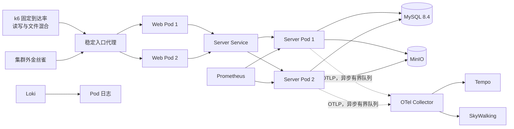
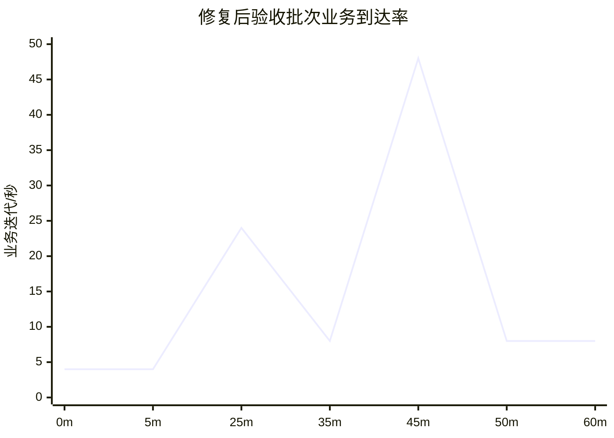
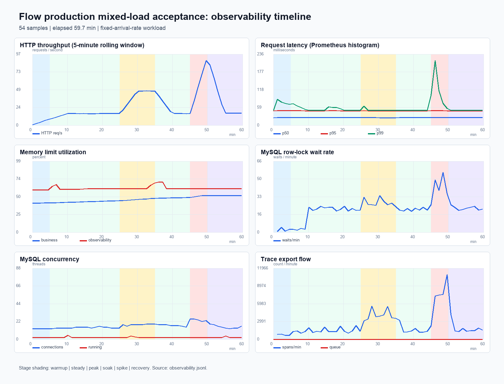

# Flow 生产级混合压测与容量评估报告

报告日期：2026-07-31

## 1. 结论摘要

本次测试覆盖登录、权限与用户信息读取、用户组和字典读写生命周期、流程任务查询、
文件上传/预览/删除、上传幂等重放，以及 Outbox、审计、对象存储和完整可观测链路。
测试使用固定到达率而不是闭环并发循环，因此结果同时记录业务到达率、实际 HTTP
吞吐和活跃 VU，避免把 VU 数量直接等同于服务端并发能力。

最终发布结论由 5 小时 35 分钟定位批次和修复后的连续 1 小时验收批次共同支撑。
后一批次完成 94,926 次 HTTP 请求和 49,927 次迭代，HTTP 与业务错误均为 0，
14,927 次创建和删除完全一致；突增阶段达到 48 次业务到达/秒、约 88.41 次 HTTP
请求/秒和 47 个活跃 VU。总体 HTTP p95 / p99 为 18.53 / 33.51 ms，读取 p95 为
10.65 ms，写入 p95 为 20.45 ms。业务、数据库和全部观测 Pod 零重启，OTel 队列
始终为 0，测试数据和对象存储清理完成。

首个有效扩展瓶颈仍是多 Pod Outbox 批量认领的数据库锁竞争：最终批次平均 21.70 次
行锁等待/分钟，突增分钟峰值约 55 次，低于 60 次门禁且未造成错误或持续积压，但应作为
下一轮阶梯测试的首要停止条件。此前确认的租约回收死锁已消除，InnoDB 最近死锁时间
保持在新镜像部署前。SkyWalking 容量、队列历史扫描、文件上传幂等和压测指标基数
问题也已完成修复和回归。

应用代码与部署清单具备合并发布条件。当前服务器仍是单节点验证环境，不应据此宣称
基础设施已经达到生产高可用；多节点调度、高可用 MySQL、分布式对象存储，以及
Promtail / 单体 Tempo 迁移属于正式生产上线前的外部基础设施前置项。

本报告不把 48 次业务到达/秒描述为系统极限。测试没有把 CPU、连接池或延迟推到
拐点，因此它只能证明当前拓扑的可持续容量下限。生产初始限流建议按已验证峰值保留
至少 30% 余量，即不高于 33 次业务到达/秒；按 20% / 30% 写入混合分别约为 52 / 62
次 HTTP 请求/秒。更高配额必须通过独立阶梯压力测试确定。

## 2. 环境与版本

| 项目 | 实际配置 |
| --- | --- |
| 服务器 | 腾讯云香港，8 vCPU，15 GiB 内存，Ubuntu，单节点 k3s |
| 业务副本 | server 2、web 2、schema worker 2 |
| 有状态依赖 | MySQL 8.4 单副本、MinIO 单副本，使用持久卷 |
| 可观测组件 | Prometheus、Grafana、Alertmanager、Loki、Promtail、Tempo、OTel Collector、SkyWalking OAP/UI、BanyanDB |
| 应用镜像 | `flow-hardening/server:lease-deadlock-9e1206e`、`flow-hardening/web:longtest-0e1a709` |
| 最终验证分支 | `feature/long-duration-load-testing` |
| 部署方式 | Helm 原子升级，滚动策略 `maxUnavailable=0`，业务 Ingress 前置稳定代理 |

该环境可以验证多 Pod 竞争、滚动升级和组件级故障隔离，但不能证明节点级高可用。
MySQL、MinIO、观测存储和所有业务 Pod 位于同一节点；生产部署必须使用多节点调度、
高可用数据库和具备备份恢复能力的对象存储。

## 3. 负载模型

定位批次采用以下固定到达率阶段，写入比例为 20%，文件生命周期开启，认证流量独立
运行。写操作完成后立即清理业务对象；审计和 Outbox 历史保留，用于观察异步处理与
历史数据增长下的查询成本。

| 阶段 | 时长 | 业务到达率 | 目的 |
| --- | ---: | ---: | --- |
| 预热 | 10 分钟 | 4 次/秒 | JIT、连接池和缓存预热 |
| 稳态 | 70 分钟 | 8 次/秒 | 建立业务与数据库基线 |
| 峰值 | 20 分钟 | 24 次/秒 | 验证常规业务高峰 |
| 长稳 | 195 分钟 | 8 次/秒 | 观察内存、磁盘、队列和时序漂移 |
| 突增 | 10 分钟 | 48 次/秒 | 验证短时并发和队列恢复 |
| 恢复 | 30 分钟 | 8 次/秒 | 验证延迟、资源和积压回落 |

写入场景不是单接口空转。一次用户组或字典生命周期包含创建、状态变更、详情读取和
删除；文件生命周期包含首次上传、同 Key 重放、预览和删除。因此业务到达率与 HTTP
请求率不是一比一关系。

修复后验收批次从北京时间 2026-07-31 04:54:35 连续运行 1 小时，写入比例提高到
30%，认证频率提高到每分钟 6 次：

| 阶段 | 时长 | 业务到达率 | 目的 |
| --- | ---: | ---: | --- |
| 预热 | 5 分钟 | 4 次/秒 | 验证新镜像启动后的缓存和连接池 |
| 稳态 | 20 分钟 | 8 次/秒 | 验证高写入比例下的持续锁竞争 |
| 峰值 | 10 分钟 | 24 次/秒 | 验证常规业务高峰 |
| 长稳 | 10 分钟 | 8 次/秒 | 检查峰值后资源和队列回落 |
| 突增 | 5 分钟 | 48 次/秒 | 验证短时并发与调度竞争 |
| 恢复 | 10 分钟 | 8 次/秒 | 验证尾延迟、积压和资源恢复 |

### 3.1 测量口径与验收门禁

k6 在集群外通过稳定入口发压，Prometheus 每分钟计算最近 5 分钟的请求量、错误量和
延迟直方图；集群观察器同步采集 Pod 重启、资源水位、OTel 队列以及 MySQL 全局计数器。
独立金丝雀不复用压测连接，用于识别入口不可用。数据库计数器以批次首尾差值计算，
避免把批次开始前的历史累计量算入结果。

| 类别 | 发布门禁 |
| --- | --- |
| 正确性 | HTTP 失败率 < 0.5%，业务失败率 < 0.5%，检查成功率 > 99.5% |
| 延迟 | 读取 p95 < 750 ms，写入 p95 < 1,500 ms，持续登录 p95 < 750 ms，全部登录与请求 p99 < 2,500 ms |
| 调度 | dropped iterations = 0，interrupted iterations = 0 |
| 数据 | 创建数 = 删除数，清理失败 = 0，数据库和 MinIO 无活跃测试对象 |
| 可用性 | 金丝雀失败 = 0；业务和观测组件不可用样本 = 0；Pod 重启增量 = 0 |
| 数据库 | 连接率 <= 80%，行锁等待 <= 60 次/分钟，临时磁盘表和日志等待增量 = 0 |
| 遥测 | OTel 队列不溢出，接收失败/拒绝增量 = 0，导出 span 增量 > 0 |
| 资源 | 业务与观测组件内存限额使用率均 <= 90% |

门禁判断由 `deploy/loadtest/analyze.sh` 从原始 JSON 自动计算。最终批次还会人工复核
Loki 错误日志、InnoDB 最近死锁时间、语句摘要、Tempo Trace 和 SkyWalking 查询，
自动门禁通过不能替代这些生产发布检查。

图中背景色与六个负载阶段一一对应。请求吞吐、Trace 导出量和数据库连接数随负载
同步变化；业务与观测内存没有持续爬升，突增结束后各项指标均进入恢复区间。

## 4. 测试结果

### 4.1 定位批次

| 指标 | 结果 | 门禁 |
| --- | ---: | ---: |
| HTTP 请求 | 312,257 | 记录项 |
| 业务迭代 | 204,287 | 记录项 |
| 平均 HTTP 吞吐 | 15.53 次/秒 | 记录项 |
| 峰值 5 分钟 HTTP 吞吐 | 约 74 次/秒 | 记录项 |
| 最大活跃 VU | 48，总突增场景 47 | 最大配置 120 |
| HTTP 失败率 | 0.00032%（1 次） | < 0.5% |
| 检查成功率 | 99.99968% | > 99.5% |
| HTTP p95 / p99 | 17.85 / 23.85 ms | p99 < 2,500 ms |
| 读取 p95 / p99 | 7.70 / 9.60 ms | p95 < 750 ms |
| 写入 p95 / p99 | 20.59 / 25.64 ms | p95 < 1,500 ms |
| 登录 p95 / p99 | 170.08 / 1,607.20 ms | p95 < 750 ms，p99 < 2,500 ms |
| 创建 / 删除 | 40,229 / 40,229 | 必须相等 |
| 金丝雀 | 672 次，0 失败，最大 17 ms | 0 失败 |
| 中断迭代 | 0 | 0 |

唯一 HTTP 失败发生在测试开始后的代理地址切换窗口，是一次文件上传连接 EOF。对应
数据库记录和 MinIO 对象均已清理。该事件保留在原始结果中，没有从统计中删除。

### 4.2 修复后 1 小时验收批次

| 指标 | 结果 | 门禁 / 判断 |
| --- | ---: | --- |
| HTTP 请求 / 平均吞吐 | 94,926 / 26.36 次/秒 | 记录项 |
| 总迭代 / 业务计划迭代 | 49,927 / 49,200 | 记录项 |
| 峰值 5 分钟 HTTP 吞吐 | 88.41 次/秒 | 记录项 |
| 最大活跃 / 最大配置 VU | 47 / 119 | 无 VU 不足 |
| HTTP / 业务失败率 | 0 / 0 | < 0.5% |
| 检查成功率 | 100% | > 99.5% |
| HTTP p95 / p99 | 18.53 / 33.51 ms | p99 < 2,500 ms |
| 读取 p95 / p99 | 10.65 / 14.44 ms | p95 < 750 ms |
| 写入 p95 / p99 | 20.45 / 27.74 ms | p95 < 1,500 ms |
| 持续登录复测 p95 / p99 | 91.97 / 96.19 ms | p95 < 750 ms，p99 < 2,500 ms |
| 全部登录 p99 / 最大值 | 1,292.41 / 1,700.63 ms | p99 < 2,500 ms |
| 创建 / 删除 / 清理失败 | 14,927 / 14,927 / 0 | 必须相等，失败为 0 |
| dropped / interrupted iterations | 0 / 0 | 必须为 0 |
| 金丝雀 | 122 次，0 失败，最大 22 ms | 0 失败 |

原始 1 小时 summary 的登录 p95 为 912.75 ms，因此旧门禁返回非零。Prometheus 分项
证据显示独立持续认证场景 p99 最高 122.40 ms，超时样本全部来自突增阶段新 VU 首次
使用时的集中 `login_vu`，该路径 p99 为 1.61 秒。旧口径把客户端会话冷启动和持续
登录 SLA 混在一起。门禁已改为对 `login_traffic` 严格执行 p95 / p99，同时对全部登录
保留 p99 2.5 秒上限。修正后以 60 次登录/分钟复测 2 分钟，全部自动门禁通过。原始
summary 和旧分析文件均保留，未修改结果来制造通过状态。

## 5. 资源与可观测结果

| 资源或链路 | 定位批次 / 最终验收 | 分析 |
| --- | ---: | --- |
| Node CPU | 14% / 23% | 未形成 CPU 瓶颈 |
| Node 内存 | 68% / 55% | 最终恢复阶段约 53% |
| 单个 server CPU | 350m / 281m | 低于 2 Core 限额 |
| 单个 server 内存 | 748 MiB / 约 600 MiB | 低于 2 GiB 限额 |
| MySQL CPU / 内存 | 337m / 634 MiB；370m / 779 MiB | CPU 与内存均有余量 |
| MinIO CPU / 内存 | 21m / 347 MiB | 未形成吞吐瓶颈 |
| JVM 已用内存 | 858 MiB / 830 MiB | 长稳期间无持续失控增长 |
| Prometheus 内存 | 1,496 MiB | TSDB 压缩时出现瞬时峰值，随后回落 |
| Tempo 内存 | 975 MiB | 峰值后回落到约 250 MiB |
| OTel Collector 内存 | 92 MiB | 队列峰值始终为 0 |
| OAP 内存 | 1,400-1,551 MiB | 原 1,536 MiB 限额余量不足，已扩容 |
| 内存限额利用率 | 最终业务 51.25%，观测 70.07% | 均低于 90% 门禁 |
| OTel 已发送 span 增量 | 502,473 / 146,826 | 接收拒绝和失败增量为 0 |
| 磁盘占用 | 最高约 12% | 无磁盘压力 |

完整链路验收确认 Prometheus 目标正常、Loki 返回 200 条带 trace id 的日志、Tempo
可查询 20 条 Trace，SkyWalking Zipkin 查询可返回 `workflow-server` 服务和 20 条
Trace。OTel Collector 到 Tempo 和 SkyWalking 的队列均为空，观测后端没有反向阻塞
业务请求。

## 6. 已发现问题与修复

### 6.1 Outbox 多副本锁竞争

原实现由两个 server Pod 分别扫描并逐条争抢待处理事件，稳态产生约 260 次 InnoDB
行锁等待/分钟，突增窗口显著放大。第一步改为按批次所有者原子认领，锁等待下降到
约 84 次/分钟。

启用 `performance_schema` 后确认剩余锁时间主要来自 Outbox 完成更新：租约心跳使用
`TaskScheduler.scheduleAtFixedRate(Runnable, Duration)`，首次心跳会立即执行，与快速
完成更新竞争同一行。修复后 Outbox、流程动作和 Webhook 均将首次心跳延迟到租约周期
的三分之一，只有真正的长任务才续租。

同负载复测结果：

| 指标 | 初始实现 | 批量认领后 | 延迟首次心跳后 |
| --- | ---: | ---: | ---: |
| 行锁等待/分钟 | 约 260 | 84.8 | 1.1 |
| 5 分钟行锁等待增量 | 约 1,300 | 380 | 5 |
| 5 分钟行锁等待时间 | 未单独隔离 | 1,175 ms | 7 ms |
| HTTP / 业务错误 | 0 | 0 | 0 |

短复测结果相对批量认领后的复测下降 98.7%，相对初始实现下降约 99.6%。数据库日志等待
和临时磁盘表增量均为 0。

修复后验收预热阶段又发现一种独立的锁序问题：租约回收使用
`status + lease_until` 二级索引范围更新，而快速任务完成先锁主键行、再维护该二级
索引。在两个 Pod 同时调度时，两条路径形成相反锁序。InnoDB 死锁图确认参与事务分别
为 `recoverExpiredLeases` 和 `markProcessed`，因此没有把异常简单归因于压力抖动。

Outbox、流程动作和 Webhook 的租约回收已统一改为两步：先无锁、限量查询过期 ID，
再逐条强制按主键更新，并在更新条件中重新校验状态和数据库时间。这样既保持租约
过期语义，也使回收与任务完成使用相同锁序；多 Pod 同时看到同一 ID 时，只有一个
更新成功。该修复通过 7 项定向测试后滚动部署。新镜像随后完成 1 小时验收，应用日志
中没有死锁或事务异常；InnoDB 最近死锁时间仍为 20:43:47，早于 20:52 的新 Pod
部署时间，确认修复路径没有再产生死锁。

高写入最终批次产生 1,295 次行锁等待、累计等待 7,569 ms，平均 21.70 次/分钟；
突增分钟峰值约 55 次。语句摘要显示剩余等待主要位于 Outbox 批量认领，而不是租约
回收。积压峰值 93 条、最老 2 秒，恢复阶段降到 2 条以内，未形成业务故障。该指标是
更高吞吐扩容的第一约束，达到 60 次/分钟或最老事件持续超过 30 秒时应停止升压。

### 6.2 队列指标扫描历史数据

旧队列指标查询每 15 秒在两个 Pod 上聚合整张 Outbox 历史表。表增长到约 4.8 万行
时，单次查询约 26-30 ms，并随历史数据线性增长。修复将一次全表条件聚合拆为使用
状态和时间索引的标量子查询；MySQL `EXPLAIN ANALYZE` 从扫描约 4.8 万行、约 30 ms
下降到读取约 7 个索引行、约 0.06 ms。最终表超过 11 万行后，临时 20 ms 慢查询
窗口中未再出现该指标查询。

### 6.3 SkyWalking 内存门禁

SkyWalking UI 在原 256 MiB 限额下发生一次 OOM，自动恢复但违反零重启门禁；OAP
长期位于 1,400-1,477 MiB，接近原 1,536 MiB 限额。修复将 UI 限额提高到 512 MiB，
OAP 请求提高到 1 GiB、限额提高到 2,560 MiB，并增加 90% 持续 5 分钟告警和 97%
持续 2 分钟严重告警。扩容后验收期间 UI 和 OAP 均无重启。

### 6.4 文件上传重试语义

文件上传新增用户级 `Idempotency-Key`、请求摘要、唯一约束和 V018 数据库迁移。真实
接口验收确认首次上传与同文件重放返回同一 URL，不同内容复用同一 Key 返回 409，
并发失败路径会删除未登记对象。删除后数据库活跃记录为 0，MinIO 未留下测试对象。

最终清点还发现此前中止的 `final-6h-20260731t0440` 遗留了 1 个 51 字节文件。它不属于
最终 1 小时批次，但证明旧 `cleanup.sh` 只清理用户组和字典并不完整。残留已通过业务
删除接口精确清理；工具随后增加 k3s 文件清理模式，以
`load-file-<run-id>-` 幂等键做只读、等值前缀发现，实际删除仍经过应用权限、对象存储
操作和审计链路，不直接修改数据库。

清理能力使用临时文件做了真实回归：执行前活跃记录为 1，执行后为 0，脚本记录删除
1 个文件；再次清点所有 `load-*` 活跃记录和 MinIO 桶，结果均为 0。危险 run id 和
缺少二次确认两条负向测试均被拒绝。

### 6.5 压测指标高基数

定位批次中动态资源 ID 进入 k6 默认 URL 标签，曾产生超过 40 万条时间序列。该问题
影响负载机和 Prometheus 资源，不是业务服务错误。脚本已为每类请求设置稳定的
`name` 标签，同时保留 `operation` 和 `kind`，避免资源 ID 扩大指标基数。

### 6.6 观测组件 Chart 生命周期

部署清单复核确认当前固定版本中 `grafana/promtail 6.17.1` 和单体
`grafana/tempo 1.24.4` Chart 已由上游标记为 deprecated。该状态不影响本次隔离环境
的运行结果，但不应作为新的长期生产安装基线。本轮没有在有效压测中途替换日志和
Trace 数据面；生产部署前应将 Promtail 迁移至 Grafana Alloy，并将单体 Tempo 迁移至
`tempo-distributed` 或受管 Trace 服务，完成保留策略、对象存储、容量和故障恢复验收
后再切换。迁移期间 OTel 出口必须继续保持异步、有界队列和 500 ms 超时，观测后端
故障不得影响业务 readiness。

### 6.7 登录门禁口径

旧脚本使用一个聚合 Trend 同时评价独立认证流量和每个业务 VU 的首次登录。固定到达率
在新阶段启用 VU 时会集中建立客户端会话，导致突增阶段的冷启动样本支配聚合 p95，
但不能代表稳定登录接口的 SLA。修复后持续登录和冷启动分别设置门禁，并在 summary
中分别输出；60 次登录/分钟复测的 p95 为 91.97 ms。密码校验仍使用 BCrypt 默认强度，
没有通过降低哈希成本换取延迟。

## 7. 故障隔离

故障矩阵逐项将 OTel Collector、Prometheus、Loki、Tempo、Grafana 和 SkyWalking
OAP 缩容到 0，再恢复原副本。每个下线和恢复窗口均从 web Pod 向 server 发起独立
业务健康请求，并由集群外探针持续请求 `/livez`。此外将 OTel 出口分别指向连接拒绝、
超时地址和 HTTP 错误端点，验证遥测失败不影响业务就绪与请求处理。

故障测试结束后已确认全部组件恢复到原副本、OTel 出口恢复、导出队列排空，再进入
最终验收批次。最终可观测回归返回 Prometheus 目标 1 个、Loki 2 个日志流及 200 条
带 Trace ID 的日志、Tempo 20 条 Trace、SkyWalking 1 个服务及 20 条 Trace。

## 8. 发布前验证

| 验证项 | 结果 |
| --- | --- |
| 后端 Maven 全量 `verify` | 17 模块成功；953 个 Surefire 测试、1 个 Failsafe 集成测试；0 失败、0 错误、1 跳过 |
| 依赖安全复核 | Spring Boot 3.5.16；Spring Framework 6.2.19；CVE-2026-41842、CVE-2026-41845、CVE-2026-41850 对应组件已升级 |
| 前端完整测试 | 单元、集成、功能、配置审计、术语和可维护性门禁全部通过 |
| 前端生产构建 | Vite 构建成功 |
| 数据库迁移 | V001-V018 全量迁移和升级路径通过；服务器 V018 已成功应用 |
| Helm test | `flow-local-flow-smoke-test` 成功 |
| 部署清单 | Helm lint、Kubernetes 资源 kubeconform、Compose 配置全部通过 |
| 完整观测验收 | Prometheus、Loki、Tempo、SkyWalking 全部通过 |
| 上传幂等实测 | 首传、重放、冲突、删除和无孤儿对象全部通过 |
| 中断文件清理 | 真实文件 1 -> 0；数据库与 MinIO 双重清点为 0；安全拒绝用例通过 |
| 1 小时混合负载 | 94,926 HTTP、0 错误、0 dropped、0 重启、创建删除一致 |
| 修正后认证门禁 | 60 次登录/分钟；p95 91.97 ms，p99 96.19 ms；强化分析通过 |
| k6 配置审计 | k6 2.0 `inspect` 通过，持续登录与冷启动阈值分别生效 |
| 临时管理入口 | Grafana 3000、SkyWalking 8082 公网代理已关闭；业务 8081 保留 |

## 9. 容量判断与生产建议

当前结果证明 2 个 server Pod 在该测试数据和混合比例下可持续承载至少 48 次业务
到达/秒、约 88 次 HTTP 请求/秒和 47 个活跃 VU。由于最终峰值 Node CPU 仅 23%，
server 和 MySQL CPU 均低于 0.4 Core，本次没有测到在线服务的饱和点。不能根据低
CPU 线性外推极限，后续仍需以 1x、2x、4x 阶梯测试找到连接池、数据库 IOPS、锁和
尾延迟的第一个拐点。

生产初始建议：

- server 保持至少 2 副本，跨节点和可用区分布；HPA 初始可设 2-6 副本，CPU 目标
  65%-70%，同时以 Hikari pending、p95 和队列最老年龄作为扩容保护信号。
- 在完成更高阶梯测试前，入口限流不高于 33 次业务到达/秒；按 20% / 30% 写入混合
  分别约为 52 / 62 次 HTTP 请求/秒。该值是带 30% 故障余量的保守运行线。
- MySQL 使用高可用托管实例或主从架构，保留 `performance_schema`，持续监控行锁、
  连接、日志等待、慢查询和磁盘延迟。不要在生产关闭性能采集来换取表面吞吐。
- MinIO 使用分布式或托管对象存储，配置版本化、生命周期、容量告警和恢复演练。
- Prometheus、Loki、Tempo、SkyWalking 的存储保留期和资源应按生产流量重新估算；
  业务只依赖有界、500 ms 超时的 OTel 出口，任何观测后端不得进入 readiness 依赖。

## 10. 证据位置

服务器保留以下原始证据，目录权限限制为运维用户：

- 定位长稳批次：`/home/ubuntu/flow-runtime/results/20260730T134438Z`
- 锁竞争复测：`/home/ubuntu/flow-runtime/results/heartbeat-fix-20260731T0410`
- 认证高采样复测：`/home/ubuntu/flow-runtime/results/auth-validation-20260731T0418`
- 修复后最终验收：`/home/ubuntu/flow-runtime/results/final-1h-20260731T0455`
- 修正后认证门禁：`/home/ubuntu/flow-runtime/results/auth-gate-final-20260731T0600`
- 后端全量验证：`/home/ubuntu/flow-runtime/full-verify-9e1206e.log`
- 可观测验收：`/home/ubuntu/flow-runtime/verify-observability-after-final-1h.json`
- Helm smoke test：`/home/ubuntu/flow-runtime/helm-test-after-final-1h.log`
- 故障矩阵：`/home/ubuntu/flow-runtime/observability-fault-final.csv`

原始结果包含 k6 summary、阶段日志、外部金丝雀、每分钟观测样本、Kubernetes 资源与
事件快照。报告中的结论可以从这些文件重新计算，不依赖截图或人工抄录。
