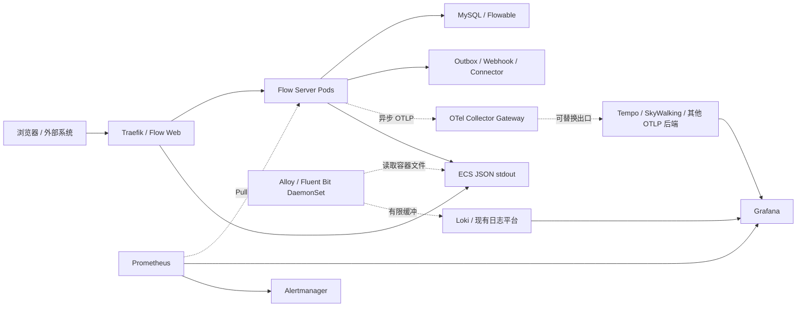

# Flow 生产可观测性执行方案

> 状态：待执行
> 实施分支：`feature/production-observability`
> 基线提交：`d541adb`
> 适用范围：Flow Web、Flow Server、MySQL、Flowable、Outbox、Webhook、
> HTTP Connector 和 Kubernetes 运行环境

## 1. 目标

建设 Metrics、Logs 和 Traces 三类生产可观测能力，同时确保可观测平台始终处于业务
旁路。Prometheus、Grafana、Loki、Tempo、SkyWalking、OpenTelemetry Collector 或
日志采集器任一组件故障时，业务请求、流程执行、后台任务、数据库事务和健康检查不得
依赖它们继续工作。

本方案允许在可观测平台长时间故障时丢弃部分可观测数据。与阻塞业务、耗尽 JVM
内存、占满节点磁盘相比，丢弃遥测是正确的降级行为。

生产服务器、域名、对象存储、TLS、认证和通知渠道当前允许为空。前六个实施批次在
本地 k3s 使用临时后端完成，生产接入只填充配置，不重新修改业务观测模型。

## 2. 不可违反的隔离约束

1. 应用不得同步调用日志、Trace 或 Metrics 后端。
2. 应用不得向 Prometheus Pushgateway 推送运行指标。Prometheus 只允许 Pull。
3. Trace 必须使用异步 Batch Processor、有界队列和有限超时。
4. 日志必须先进入有界异步 Appender，再写容器标准输出。
5. 日志采集器只读取容器日志文件，应用不得直接调用 Loki、Elasticsearch 或日志 API。
6. Collector、日志采集器和可观测后端不得加入业务 Pod 的 startup、liveness 或
   readiness 探针。
7. 不得使用等待 Collector 就绪的 initContainer。
8. 不在业务 Pod 中部署必须存活的可观测 Sidecar。采集器使用独立 Deployment 或
   DaemonSet。
9. 遥测队列满、导出超时、DNS 失败或连接拒绝时必须丢弃遥测并计数，不得阻塞业务。
10. 可观测组件使用独立 namespace、ResourceQuota、PriorityClass、PDB 和
    NetworkPolicy。资源争用时先驱逐可观测组件。
11. 业务健康检查只检查服务自身和业务必要依赖，不检查任何可观测组件。
12. 系统审计是业务安全能力，不等同于应用日志。审计的失败语义维持现有业务规则，
    但审计数据不得依赖 Loki 或 Trace 后端持久化。

## 3. 当前基线

### 3.1 已具备

- Spring Boot Actuator 独立监听 `9090`。
- `/actuator/prometheus` 可输出 JVM、HTTP、Hikari 和应用自定义指标。
- 生产 Profile 使用 ECS 单行 JSON 输出后端日志。
- Kubernetes Service 已定义 `management` 端口。
- Helm 已有 ServiceMonitor、PrometheusRule 和开放集成 Grafana Dashboard 模板。
- Outbox、Flow Action、Webhook 和 Connector 已有少量业务指标。
- 请求链已有 `X-Trace-Id`、MDC 和数据库系统审计基础。

### 3.2 已确认问题

- 本地 k3s 未安装 Prometheus Operator CRD、Prometheus、Grafana、Alertmanager、
  Loki、Tempo、SkyWalking 或 Collector。
- 本地 values 关闭 ServiceMonitor 和 PrometheusRule。
- Dashboard 的 `up{application="workflow-server"}` 查询不成立，`up` 不会自动继承
  应用暴露指标中的公共标签。
- 健康探针流量远高于实际业务请求，会稀释当前 HTTP 错误比率。
- HTTP Histogram 桶过多，需要按 SLO 收敛。
- Webhook Counter 首次执行前不存在序列，Dashboard 无法区分 0 和 No data。
- Webhook 使用接入应用 ID 作为 `application` 标签，与服务公共标签重名并引入
  高基数。
- 两个请求过滤器会分别生成 Trace ID。客户端不传 ID 时，响应 ID、MDC ID 和开放
  API 响应体 ID 可能不一致。
- MDC 只覆盖 Servlet 请求线程，不能覆盖 Outbox、Flowable Job、Webhook 和
  Connector 异步边界。
- OpenTelemetry Trace SDK、Micrometer Tracing Bridge 和 OTLP Exporter 尚未引入。
- Nginx 仍使用默认文本访问日志，缺少请求 ID、上游耗时和结构化字段。
- 后端和 Web 日志都没有集中采集、保留、检索和容量限制。
- 当前 PrometheusRule 采用静态阈值，缺少 SLO Burn Rate、数据缺失和遥测自身告警。

## 4. 目标数据流



应用只知道本地或集群内 OTLP Gateway 地址，不知道最终是 Tempo 还是 SkyWalking。
后端切换不得要求修改业务埋点。

## 5. 标识和上下文规范

| 字段 | 语义 | 传播范围 |
| --- | --- | --- |
| `trace.id` | OpenTelemetry 32 位十六进制 Trace ID | W3C `traceparent` |
| `span.id` | 当前 Span ID | OpenTelemetry Context |
| `request.id` | 单次入口请求 ID | Edge 到 Server |
| `business_trace_id` | 兼容现有 `X-Trace-Id` 的业务关联 ID | API、审计、事件 |
| `event.id` | CloudEvent / Outbox 事件 ID | 异步事件 |
| `delivery.id` | Webhook 单次投递 ID | Webhook 投递 |

不得继续将自定义 `X-Trace-Id` 当成 OpenTelemetry Trace ID。API 兼容性保留该 Header，
但内部字段明确命名为 `business_trace_id`。

建立统一 `CorrelationContextFilter`：

1. 校验或生成一次 `X-Trace-Id`。
2. 同时写入 response Header、request attribute、MDC 和审计上下文。
3. Open API Guard 只读取统一结果，不再次生成。
4. 请求结束后清理 MDC。
5. Spring Executor 使用 `TaskDecorator` 传播短生命周期上下文。
6. Outbox 等持久化异步边界保存 W3C Trace Context 或 Span Link 必需信息，由消费者
   创建新的 Consumer Span。

## 6. Metrics 规范

### 6.1 收集范围

| 层级 | 指标 |
| --- | --- |
| Kubernetes | Pod Ready、重启、OOM、CPU、内存、Deployment、HPA、节点磁盘 |
| JVM | Heap、GC Pause、线程、CPU、类加载、进程存活时间 |
| HTTP | 路由模板、方法、状态类别、RPS、并发、p50/p95/p99 |
| 数据库 | Hikari active/pending/timeout、MySQL 连接、锁等待、慢查询、磁盘 |
| Flowable | Async Job、Timer Job、失败 Job、执行延迟 |
| 业务流程 | 发起、完成、失败、撤回、审批耗时、待办、SLA 超时 |
| 异步队列 | Outbox、Flow Action 的 ready/running/dead、最老任务时间、租约恢复 |
| 开放集成 | OAuth、限流、Open API、幂等、Webhook、Connector |
| 外部探测 | 首页、健康端点和受控 API 合成请求 |

### 6.2 标签约束

Metrics 标签禁止包含：

- 用户 ID、接入应用 ID、Client ID。
- 流程实例 ID、业务主键、Trace ID、Request ID。
- 完整 URL、远端 Host、异常消息、SQL、文件名。
- 无上限的流程 Key、Connector Operation 或事件类型。

需要定位具体对象时使用日志、审计或 Trace。Metrics 只保留有界枚举和路由模板。

### 6.3 Prometheus 语义

- HTTP SLI 排除 `/healthz`、`/livez` 和 `/actuator/**`。
- 业务可用性分母不包含 4xx 和健康探针。
- Deployment 可用副本使用 kube-state-metrics，不用错误的 `up{application=...}`。
- `up` 只表示 Prometheus 能抓取目标，不表示业务依赖全部健康。
- 数据库全局队列 Gauge 在多 Pod 重复暴露时使用 `max`，不能 `sum`。
- Counter 使用 `sum(rate(...))` 聚合所有 Pod。
- 对语义上必须存在的 Counter 预注册有限标签组合。
- Dashboard 明确区分 `0` 和 `No data`。
- 增加 `absent()`、抓取失败和 Recording Rule 缺失告警。
- HTTP Histogram 只保留与 SLO 有关的固定桶，限制活跃序列数量。

### 6.4 数据库采样隔离

当前队列 Gauge 会由每个 Pod 定时查询数据库。实施时改为以下二选一，并通过负载测试
决定：

1. 单一租约持有者采样全局数据库 Gauge。
2. 独立 SQL Exporter 使用只读账号采样。

无论采用哪种方式，查询超时不得超过 1 秒，不重试，失败后保留最后成功值并输出
`workflow_metrics_snapshot_stale`。不得占满业务 Hikari 连接池。

## 7. Trace 规范

使用 Spring Boot OpenTelemetry Starter 和 Micrometer Tracing，不使用必须注入的
SkyWalking Java Agent。默认关闭导出，未配置服务器时应用正常启动。

建议初始限制：

| 参数 | 初始值 |
| --- | --- |
| 应用 Export Timeout | 500 ms |
| Batch Export Timeout | 1 s |
| Batch Schedule Delay | 5 s |
| Span Queue | 2048 |
| Export Batch | 256 |
| Span Attributes | 最多 64 |
| Attribute Value | 最多 256 字符 |
| 正常 Trace 采样 | 5% |
| 错误、超时、慢 Trace | Collector Tail Sampling 100% |
| Shutdown Flush | 最多 2 s |

必须使用 Batch Processor。队列满后丢 Span并增加 dropped 指标，禁止扩容队列直到耗尽
JVM Heap。OTLP 连接错误必须限频记录，不允许每次批量失败都打印堆栈。

自动或显式覆盖：

- Spring MVC 入站请求。
- 使用受支持 Builder 创建的出站 HTTP Client。
- MySQL 调用，仅记录操作类型和安全后的表/组件，不记录 SQL 参数。
- Flowable 命令边界。
- Outbox Producer、Consumer 和 Lease Recovery。
- Webhook Materialize、Lease、HTTP Attempt、Retry、Dead Letter、Replay。
- Connector 配置解析、Secret 解析、HTTP Attempt、Retry 和结果映射。

Span 禁止记录 Token、Cookie、Authorization、Secret、Webhook 签名、请求正文、响应
正文和流程变量全文。

## 8. 日志规范

### 8.1 后端日志

生产继续使用 ECS 单行 JSON，并用 Logback AsyncAppender 包装 Console Appender。

| 参数 | 初始值 |
| --- | --- |
| Queue Size | 8192 |
| Never Block | true |
| 丢弃水位 | 80% |
| Include Caller Data | false |
| Flush Timeout | 最多 1 s |

队列紧张时优先丢弃 TRACE、DEBUG、INFO。WARN、ERROR 尽量保留，但队列完全满时仍允许
丢弃，不能阻塞业务线程。Dropped 数量通过本地 Metrics 统计。

必需字段：

- `@timestamp`、`log.level`、`log.logger`、`message`。
- `service.name`、`service.version`、`deployment.environment`。
- `trace.id`、`span.id`、`request.id`、`business_trace_id`。
- `event.action`、`event.outcome`、`error.type`。
- 路由模板、HTTP 状态、耗时。
- 由采集器补充的 namespace、pod、container、node。

### 8.2 Web 访问日志

Nginx 改为 JSON Access Log，记录：

- 请求 ID、Trace Header。
- 方法、规范化路由、状态码。
- 请求时间、upstream 时间、upstream 状态。
- 请求和响应字节数。
- 可信代理处理后的客户端网络信息。

关闭健康探针 Access Log。静态资源成功日志可采样，4xx/5xx 和 API 请求完整保留。

### 8.3 敏感信息

禁止写入：

- Authorization、Cookie、Access Token、Refresh Token。
- 密码、Client Secret、Connector Secret、Webhook 签名密钥。
- 数据库密码、对象存储凭据和 Kubernetes Secret。
- 请求/响应正文、流程变量全文和文件内容。
- 未脱敏的第三方错误响应。

日志脱敏需要单元测试和 Gitleaks 风格的运行日志扫描，不只依赖代码审查。

## 9. 采集器和后端隔离

### 9.1 OpenTelemetry Collector

Collector Gateway 至少两个副本，处理器顺序固定为：

```text
memory_limiter
k8sattributes
filter / transform / redaction
tail_sampling
batch
```

远端 Exporter 开启：

- 有界 `sending_queue`。
- `file_storage` 持久队列。
- 指数退避和抖动。
- 最大重试时间 10 分钟。
- 每副本磁盘上限 5 GiB。
- 队列满或达到磁盘高水位后丢最老数据。

Collector 暴露自身队列、拒绝、丢弃、导出失败、内存和 CPU 指标。业务应用不消费这些
指标，也不依赖 Collector 状态。

### 9.2 日志采集器

Alloy 或 Fluent Bit 使用 DaemonSet 读取 `/var/log/containers`：

- 内存 Buffer 有界。
- 文件 Buffer 有容量上限。
- 后端故障时先缓冲，达到上限后丢旧日志。
- 不能通过无限重试占满节点磁盘。
- 配置 Kubernetes 容器日志轮转和 Pod ephemeral-storage Limit。
- 采集器使用低于业务工作负载的 PriorityClass。

### 9.3 存储

本地 k3s 使用独立 MinIO Bucket：

- `flow-observability-loki-local`
- `flow-observability-tempo-local`

不得复用业务文件 Bucket。生产使用独立对象存储、独立凭据、服务端加密、生命周期、
容量告警和备份策略。生产存储信息当前留空。

## 10. SLO 和告警

### 10.1 初始目标

| 场景 | 目标 |
| --- | --- |
| 用户/API 月可用性 | 99.9% |
| 开放查询 API | p95 < 300 ms |
| 发起流程 API | p95 < 800 ms |
| OAuth Token | p95 < 200 ms |
| Webhook 首次投递 | p95 < 5 s |
| Webhook 15 分钟成功率 | >= 95%，且达到最小样本数 |

### 10.2 告警分级

- Critical：用户错误预算快速燃尽、所有副本不可用、死信、审计持久化失败。
- Warning：慢燃尽、队列持续变老、连接池等待、Webhook/Connector 成功率下降。
- Info：容量趋势、磁盘增长、采样/日志丢弃增加。

用户可用性采用多窗口 Burn Rate，不能只使用单个固定 5xx 阈值。每个告警必须包含：

- 环境、服务、当前值和阈值。
- 用户影响。
- Dashboard 和日志查询链接。
- 可访问的绝对 Runbook URL。
- 值班组和升级路径。

部署 Dead Man's Switch 和独立 Blackbox 探测，避免主监控平台整体失效后无人感知。

## 11. 分批实施

### 批次 0：ADR、基线和 Kill Switch

工作：

- 编写可观测架构 ADR、字段词典和数据分类。
- 增加 `observability.enabled` 总开关和 Metrics/Trace/Logs 子开关。
- 所有后端地址默认空，默认配置不尝试网络导出。
- 建立遥测资源预算和静态配置校验。

验证：

- 所有地址为空时生产 JAR 正常启动。
- 地址为 NXDOMAIN、拒绝连接和黑洞时正常启动。
- 关闭开关后不创建 Exporter 线程。

AI 墙钟估算：15 到 30 分钟。

### 批次 1：Metrics 正确性

工作：

- 修正 Dashboard `up` 查询、Probe 分母和 No data。
- 修正 Webhook 标签冲突和高基数。
- 预注册有界 Counter。
- 收敛 HTTP Histogram 桶。
- 增加 Flowable、认证、开放 API 和遥测丢弃指标。
- 调整全局数据库 Gauge 采样。

验证：

- Micrometer 单元测试。
- Prometheus 文本契约测试。
- PromQL 静态检查和本地真实查询。
- 1000 个随机业务 ID 不增加时间序列数量。

AI 墙钟估算：45 到 75 分钟。

### 批次 2：日志旁路

工作：

- 配置 ECS AsyncAppender。
- 增加日志字段和脱敏规范。
- Nginx JSON Access Log、Probe 排除和 Trace Header 传播。
- 增加 Alloy/Fluent Bit 本地配置、容量和丢弃策略。

验证：

- JSON Schema 校验。
- 敏感信息扫描。
- 日志队列写满和 Collector/Loki 停机压测。
- Pod 重启后日志仍可查询。

AI 墙钟估算：45 到 90 分钟。

### 批次 3：Trace 和异步上下文

工作：

- 引入 Spring Boot OpenTelemetry Starter。
- 统一请求关联过滤器。
- 增加 Trace、Span、Request 和业务 Trace 日志字段。
- 覆盖 MySQL、Flowable、Outbox、Webhook 和 Connector。
- 增加 OTLP 有界队列、超时、采样和 Kill Switch。

验证：

- 过滤器一致性测试。
- Executor 上下文传播和清理测试。
- Outbox 跨事务 Span Link 测试。
- Mock Collector 超时、断连和返回 5xx。
- 所有敏感属性不得进入 Span。

AI 墙钟估算：75 到 120 分钟。

### 批次 4：本地可观测平台

工作：

- 增加 `deploy/observability`，锁定 Helm Chart 版本。
- 部署本地 kube-prometheus-stack、Loki、Tempo、Collector 和日志 Agent。
- 启用 Flow ServiceMonitor、PrometheusRule 和 NetworkPolicy。
- Provision Datasource、Dashboard、Alertmanager 测试 Receiver。

验证：

- 两个 Server Pod Targets 为 Up。
- Metrics、Logs、Traces 可相互跳转。
- NetworkPolicy 只允许 monitoring namespace 访问管理端口。
- 删除任一观测组件不会影响业务 Pod。

AI 墙钟估算：60 到 120 分钟，主要取决于镜像下载。

### 批次 5：Dashboard、SLO 和 Runbook

工作：

- 建立平台、JVM、HTTP、流程、异步队列、开放集成六套 Dashboard。
- 建立 Recording Rule、Burn Rate、容量和缺失告警。
- 修订故障处理、队列、Webhook、Connector 和 Trace Runbook。

验证：

- 生成正常、错误、超时和 No data 四类样本。
- 每条告警实际触发并进入测试 Receiver。
- Dashboard 查询没有无限基数和错误聚合。

AI 墙钟估算：45 到 90 分钟。

### 批次 6：故障注入和容量验收

工作：

- 运行稳定业务压测。
- 分别停止 Prometheus、Collector、Loki、Tempo/SkyWalking。
- 注入 NXDOMAIN、连接拒绝、黑洞、慢响应、队列满和节点磁盘高水位。
- 删除 Collector 和日志 Agent Pod。
- 验证恢复后的新遥测继续上报。

发布门禁：

- 业务成功率不下降。
- p95 延迟增幅不超过 5%。
- 吞吐下降不超过 3%。
- 遥测额外 CPU 不超过业务容器 5%。
- 额外 JVM Heap 不超过 64 MiB。
- 应用启动增加不超过 2 秒。
- 所有业务 Pod无重启，readiness 保持正常。
- 日志和 Trace 丢弃有界且可计数。
- 30 分钟后节点磁盘不继续无界增长。

AI 墙钟估算：120 到 180 分钟，其中至少 120 分钟是不可压缩的观察窗口。

### 批次 7：生产参数接入

工作：

- 填入服务器、域名、TLS、认证、存储和通知信息。
- Render 和审查生产清单。
- 使用测试租户和专用凭据进行生产前验证。
- 验证后端整体停止和恢复。

AI 墙钟估算：配置 30 到 90 分钟，稳定观察至少 90 分钟。

## 12. 服务器信息待补清单

| 项目 | 当前值 |
| --- | --- |
| 环境名称和 Kubernetes 集群 | 待补充 |
| monitoring namespace | 待补充 |
| Prometheus：集群内、独立服务器或托管服务 | 待补充 |
| Prometheus URL、保留期和容量 | 待补充 |
| Grafana URL、域名和 SSO/RBAC | 待补充 |
| Alertmanager URL | 待补充 |
| 告警渠道、值班组和升级路径 | 待补充 |
| Trace 后端：Tempo、SkyWalking 或其他 | 待补充 |
| 后端版本 | 待补充 |
| OTLP gRPC / HTTP Endpoint | 待补充 |
| 日志后端：Loki 或现有平台 | 待补充 |
| 对象存储类型和 Endpoint | 待补充 |
| Loki、Tempo、Ruler 独立 Bucket | 待补充 |
| TLS CA、mTLS 或认证 Header | 待补充 |
| 可观测出口 CIDR、DNS 和代理要求 | 待补充 |
| 日均请求、峰值 QPS | 待补充 |
| 每日日志 GB、Span 数和活跃序列预算 | 待补充 |
| Metrics、Logs、Traces、审计保留期 | 待补充 |
| 备份、RPO 和 RTO | 待补充 |

这些值必须通过 Kubernetes Secret、External Secrets 或工作负载身份注入。禁止提交
真实地址中的认证信息、Token、密码和私钥。

## 13. 回滚和降级

每批必须提供独立 Kill Switch：

```text
OBSERVABILITY_ENABLED=false
OBSERVABILITY_TRACING_ENABLED=false
OBSERVABILITY_LOG_ENRICHMENT_ENABLED=false
```

Metrics Pull 保持可用，但可以通过 Helm 关闭 ServiceMonitor。关闭 Trace 后保留 W3C
Header 传播和业务 Trace ID，不导出 Span。关闭集中日志后仍保留有界 stdout，不能回退
到同步远端日志调用。

回滚可观测组件只删除独立 Helm Release，不修改业务数据库，不停止 Flow Deployment，
不更改 Docker daemon 和全局网络配置。

## 14. AI 工作量评估

本任务不使用传统人日。估算按 AI 连续执行的墙钟时间计算，包含代码生成、测试、
镜像构建、Kubernetes 等待、故障注入和观察窗口。

| 类型 | 估算 |
| --- | --- |
| 代码、配置、测试和文档 | 4 到 7 小时 |
| 镜像下载、构建、部署和 CI 等待 | 1.5 到 3 小时 |
| 故障注入和稳定观察 | 2.5 到 4 小时 |
| 无生产服务器阶段总计 | 8 到 14 小时 |
| 建议预留墙钟窗口 | 8 到 14 小时连续执行 |
| 生产服务器信息补齐后的接入与复验 | 2 到 4 小时 |

不能压缩的部分是镜像下载、全量测试、Pod 稳定、告警窗口和故障观察。AI 可以快速完成
实现和分析，但不能用推理替代真实运行时间，也不能在没有观察数据时声称生产隔离已经
通过。

## 15. 完成定义

满足以下全部条件才可标记完成：

1. 所有可观测后端缺失时生产 JAR 和 Kubernetes Deployment 正常启动。
2. Metrics、Logs、Traces 三类信号均能在本地 k3s 查询。
3. 同一个请求能从 Metrics exemplar 跳转 Trace，再按 Trace ID 查询日志和审计。
4. Outbox、Webhook 和 Connector 的异步链路可关联且不泄露敏感信息。
5. Dashboard 能区分真实 0 和 No data。
6. 所有 Prometheus Target、Recording Rule 和 Alert Rule 有真实验收。
7. 关闭各类后端和 Collector 后，业务成功率、延迟、吞吐、内存和 Pod 状态满足门禁。
8. 日志、Trace 和 Collector 队列均有上限、丢弃策略和自监控。
9. Gitleaks、CodeQL、依赖审计、后端全量测试、前端测试、清单校验和镜像扫描通过。
10. 生产服务器接入只需填充受保护的 values 和 Secret，不需要修改业务代码。

## 16. 主要技术依据

- [Spring Boot Tracing](https://docs.spring.io/spring-boot/reference/actuator/tracing.html)
- [Spring Boot Observability](https://docs.spring.io/spring-boot/reference/actuator/observability.html)
- [OpenTelemetry Java SDK 配置](https://opentelemetry.io/docs/languages/java/configuration/)
- [OpenTelemetry OTLP Exporter 配置](https://opentelemetry.io/docs/languages/sdk-configuration/otlp-exporter/)
- [OpenTelemetry Collector Resiliency](https://opentelemetry.io/docs/collector/resiliency/)
- [SkyWalking OTLP Trace](https://skywalking.apache.org/docs/main/next/en/setup/backend/otlp-trace/)
- [Grafana Loki 存储](https://grafana.com/docs/loki/latest/operations/storage/)
- [Grafana Tempo 对象存储](https://grafana.com/docs/tempo/latest/reference-tempo-architecture/object-storage/)
