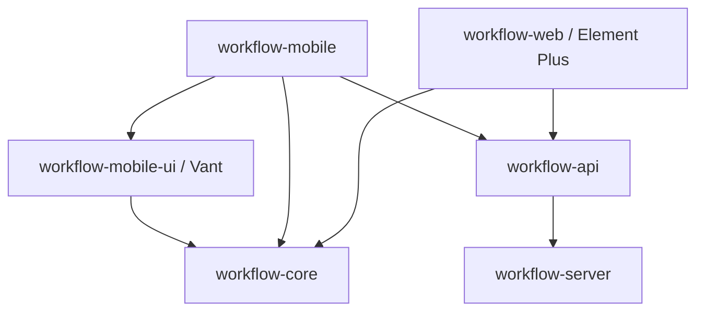

# 移动端 Vant 独立展示层设计

日期：2026-09-21  
状态：已实施；验证记录见 [移动端使用说明](../workflow-mobile/README.md)。  
设计基线：`8822c2c5`。以下保留设计依据与验收标准。

## 1. 结论与范围

移动端使用 **Vue 3 + Vant，自建薄层业务组件**；PC 继续使用 Element Plus。两端共享 API、表单数据契约、校验和审批业务规则，各自维护页面、字段渲染器和样式。

“移动端一个组件库”指基于 Vant 封装流程业务组件，不从零开发按钮、弹窗、日期选择器，也不把 PC 组件换个尺寸继续使用。

本期业务入口只有待办、已办、我发起的、知会，另有登录和流程详情；“我发起的”是查询入口，不因此新增移动端流程设计、新建业务数据或管理后台。先交付独立 H5，暂不涉及 iOS、Android 打包。

沿用已确认的交互要求：列表头紧凑，不放大幅品牌和问候语；用户菜单不提供修改密码；详情优先展示业务信息，保留流程进度和审批历史。

### 架构决策记录

| 方案 | 收益 | 代价 / 风险 | 决定 |
| --- | --- | --- | --- |
| 两端共用 Element Plus 组件，用 CSS 适配 | 初期复用较多 | 桌面交互难以适合手机；共享模板修改会牵连 PC；移动端继续依赖桌面 UI | 不采用 |
| 移动端完整复制全部业务代码 | 可独立开发页面 | 校验、权限和提交规则逐渐出现两份实现 | 不采用 |
| 共享业务核心，Element Plus / Vant 分别实现 UI | 页面和体验可以独立演进，业务规则保持一致 | 需要维护两套字段组件，并逐步拆出原组件里的业务逻辑 | 采用 |

首次抽取共享业务核心会修改 PC 的引用，因此仍需 PC 回归。完成隔离后，仅修改移动端组件或 CSS，不应改变 PC 的构建依赖和页面样式；修改共享规则时，两端都需要验证。

## 2. 代码现状与拆分依据

回退后的仓库有 `workflow-web` 和 `workflow-server`，尚无独立移动端和共享 workspace 包。以下是实际存在的关键代码：

| 现有位置（相对仓库根目录） | 当前职责 | 后续处理 |
| --- | --- | --- |
| `workflow-web/src/api/processTask.js` | 四类列表、审批、知会已读、下一审批人等接口 | 抽取 API 调用，保持路径与参数不变 |
| `workflow-web/src/api/auth.js`、`src/shared/request/index.js` | 登录、刷新、错误处理、登录态 | 协议共享，通知和页面跳转改由宿主注入 |
| `workflow-web/src/shared/form-runtime/` | 表单归一化、字段规则、数据源、Tab 解析等 | 按依赖逐项抽取业务核心，不整体搬迁所有目录 |
| `workflow-web/src/utils/calcEngine.js`、`linkageEngine.js` | 计算、联动 | 检查平台依赖后共享，保留原语义 |
| `workflow-web/src/composables/useProcessDetail.js` | 流程详情加载及结果整理 | 抽出数据加载、转换；呈现文案及颜色由各端决定 |
| `workflow-web/src/views/entity/components/approval/EntityApprovalDialog.vue` | 审批编排、Element Plus 弹窗、页签、桌面工作区联动 | PC 视图留在原处，仅逐步提取业务控制逻辑 |
| `workflow-web/src/extensions/contracts/form-field.js` | 字段值、属性和事件契约 | 提炼共享契约，两端分别实现渲染 |
| `extensions/manifests/` | 扩展元数据及实现入口 | 保持扩展身份；增加平台实现解析机制 |

目前 PC 审批组件既含业务逻辑，也依赖 `ElMessage`、`ElMessageBox`、`useWorkspacePage`。它不能直接作为移动端公共审批组件。仅给这个组件增加 `mobile` 参数或覆盖 `.el-*` 样式，不能完成架构隔离。

## 3. 目标目录与依赖方向

以下为目标职责结构；已落地目录和入口见移动端使用说明，共享纯逻辑沿用原目录名以降低迁移成本。

```text
flow/
├── workflow-web/                  # PC 应用；原 Element Plus 组件先保留原路径
├── workflow-mobile/               # 移动应用、路由、页面、登录态与宿主适配
│   └── src/
│       ├── pages/                 # Login、Inbox、ProcessDetail
│       ├── adapters/              # 通知、导航、选择器、会话等平台实现
│       ├── extensions/            # 移动端业务扩展实现和注册
│       └── styles/                # 应用布局与移动主题
├── packages/
│   ├── workflow-api/              # 接口客户端、请求协议与错误模型
│   ├── workflow-core/             # 表单、校验、联动、审批状态与共享契约
│   │   └── src/
│   │       ├── form/
│   │       ├── validation/
│   │       ├── workflow/
│   │       ├── contracts/
│   │       └── vue/               # 可选无界面 composables；单独入口
│   └── workflow-mobile-ui/        # Vant 业务组件、字段注册表和主题
│       └── src/
│           ├── form/
│           ├── fields/
│           ├── workflow/
│           ├── pickers/
│           └── styles/
├── package.json                   # npm workspaces 和统一构建入口
├── package-lock.json              # 实施迁移后使用的唯一 workspace 锁文件
└── start.sh                       # 统一启动、停止、状态和重启
```



依赖约束：

- `workflow-core` 根入口不依赖 Vue、DOM、路由、Pinia 或任一 UI 库；可选 `/vue` 入口只依赖 Vue 和核心。控制器通过参数接受接口服务，不反向导入应用。
- `workflow-api` 不导入应用 store、页面、UI 提示组件；创建客户端时注入会话读取、刷新及错误回调，避免共享可变单例。
- `workflow-mobile-ui` 可以依赖 Vant 和核心；通过 props、事件、注入的能力调用宿主，不直接导入 PC 页面或固定业务接口客户端。
- 移动端禁止直接或间接引入 Element Plus、其图标与样式、PC 设计器和 PC 页面。PC 不导入移动端 UI 包。
- 初期无需再拆 `workflow-pc-ui`：PC 已有大量组件，保持原路径可以降低迁移面。出现第二个 PC 消费者后再评估抽包。
- 包只通过显式 `exports` 暴露接口；跨包不用 `@/` 私有别名，不用文件系统软链接维持兼容。PC 老路径需要过渡时，用普通转导出文件，并安排移除阶段。

## 4. 移动端页面和视觉组织

### 4.1 四类列表

底部 `Tabbar` 提供待办、已办、我发起的、知会。共用列表页面结构，通过业务类型选择接口；不同列表保留独立筛选、分页和滚动位置。

- 顶栏目标高度约 52–56px，只放标题、数量、刷新和用户入口。
- 搜索与筛选单独占一行，筛选内容在底部面板中显示。
- 每条流程卡片突出业务标题、当前节点和状态，辅助展示发起人、时间；长编号可以折叠或复制，不挤压主信息。
- 下拉刷新、分页加载、加载失败、空状态各有明确状态，刷新时不先清空已有列表。
- 用户入口只显示用户信息和退出登录。

### 4.2 流程详情：区分“详情导航”与“表单分组”

```text
‹ 流程详情
业务标题                        审批中
发起人 · 发起时间
┌ 基本信息 │ 流程进度 │ 审批历史 ┐   ← 唯一一层主导航
│ 基础资料                  ∨  │
│ 数据名称    流程动作           │
│ 数据编码    ALL_ENTITY…       │   ← 只读值直接展示
│ 申请说明    多行文字内容        │
├ 附件信息                  ›  ┤   ← 表单原 Tab 转为分组
├ 明细信息            3 条  ›  ┤
└─────────────────────────────┘
       更多操作       审批操作       ← 仅有操作权限时出现
```

主导航采用紧凑分段外观，可由 Vant Tabs 配合局部样式实现。表单自身的 `TAB_SET/TAB` 在“基本信息”内部映射成折叠分组，避免出现上下两排 Tab。

具体规则：

1. 保留发布配置中的节点 ID、稳定键、顺序、可见条件及表单绑定。仅转换展示方式，不修改后端表单配置，不改变 PC Tab。
2. 优先展开配置中的默认可见分组；没有默认项时展开第一组。允许同时展开多个分组；隐藏或空分组不占位置。
3. 切换详情主导航、折叠分组都不丢表单值。校验覆盖应参与校验的所有字段；不能因为内容未挂载而跳过必填或子表校验。
4. 有校验错误时，切到“基本信息”、展开对应分组，并定位第一个错误。跨字段和子表错误需要携带完整字段路径。
5. 只读内容使用标签和值；长内容上下排列，附件显示文件项。空值显示“—”，`0` 和 `false` 不视为空值；不显示“请输入”占位或灰色禁用输入框。
6. 当前任务允许编辑的字段使用 Vant 表单控件；业务只读与页面只读状态均需生效。
7. 进度默认使用适合窄屏的节点信息展示，保留并行分支和真实状态。完整 BPMN 只读图按需在全屏查看器加载，支持缩放；不把并行流程伪装成唯一线性路径。
8. 审批历史使用时间线。后台诊断或动作执行日志不加入首期主导航，PC 原有入口保留。

视觉建议：页面边距 12–16px、分组间距约 12px、正文 14–16px；触摸操作区域至少约 44px。固定操作栏预留底部安全区和内容占位，键盘弹起时不能遮挡当前编辑字段。

### 4.3 样式隔离

移动端使用 `--flow-mobile-*` 主题变量和独立样式入口。组件内部优先 `scoped` 或 CSS Modules，不在共享核心里导出 CSS。

仅使用 `scoped` 并不能修复业务组件耦合：共享同一组件时，模板和逻辑修改仍会影响所有消费者。真正的隔离来自不同 UI 组件、不同入口和受检查的依赖方向。弹出到 `body` 的面板需显式设置移动端类名或主题容器，不能假定一定继承页面祖先选择器。

## 5. 移动业务组件库

只封装有业务含义的组件，简单按钮、图标等直接使用 Vant。应用页面负责获取数据和导航，组件库负责交互和呈现。

| 组件 | 作用 / 交互 |
| --- | --- |
| `MobileTaskCard` | 统一四类列表的流程摘要，接收标准化展示数据 |
| `MobileFormRenderer` | 按表单模型组织分组和字段，不拥有第二套规则引擎 |
| `MobileFormSections` | 原 Tab / 分组的窄屏映射、错误展开与定位 |
| `MobileFieldRenderer` | 根据字段类型和扩展标识解析移动端组件 |
| `MobileReadonlyField` | 只读文本、状态、长文本、附件等值展示 |
| `MobileSubForm` | 子表一行一张摘要卡，进入行编辑面板；稳定行标识不使用数组下标替代 |
| `MobileUserPicker` / `MobileEntityPicker` | 搜索、分页、选中摘要、确认回填；候选范围由宿主受控服务提供 |
| `MobileFileField` | 选文件、上传进度、重试、预览，遵守附件分类与必填契约 |
| `MobileApprovalPanel` | 动作、意见、受控下一审批人，面板内部滚动 |
| `MobileActionBar` | 配置驱动的主操作和更多操作，统一提交中状态 |
| `MobileProcessProgress` / `MobileApprovalHistory` | 进度和历史；复杂图依赖按需加载 |

普通文本、数值、开关、单选、多选、日期等用 Vant 对应控件适配。日期序列化、数值精度、空值约定以既有 API/字段契约为准，不直接提交选择器内部数组，也不擅自转换精确数值。

富文本、关联内容、子表、自定义整表等列为单独适配项。只读富文本保持既有清洗规则；缺少移动编辑能力时不能悄悄改成普通文本编辑，避免破坏原数据。

## 6. 共享业务核心与扩展契约

### 6.1 核心职责

核心统一处理：发布表单归一化、默认值、可见/只读/必填状态、计算和联动、字段事件、数据源参数、同步及异步校验、提交数据过滤、审批操作能力和下一审批人预览状态。

核心返回状态与结构化错误，例如字段路径、错误码、提示内容及对应分组键。UI 决定用哪个控件展示，如何提示和滚动。Vant 的表单校验接口用于接入和呈现，不能成为与 PC 规则不同的第二份业务校验。

抽取时重点保留以下现有语义：

- 使用实例实际运行的发布版本、节点绑定和任务上下文，不能用当前草稿或最新配置替换。
- 只读、隐藏、权限、校验和提交过滤之间的关系沿用既有规则；前端隐藏不替代服务端鉴权。
- 预览动作必须携带未提交表单值；异步结果需要防止旧请求覆盖新状态。动作或数据变化后清理失效的下一审批人选择。
- 提交期间防止重复点击；沿用现有版本/并发校验。冲突时刷新任务状态，不能盲目重试一次审批写操作。
- 操作可用性取自服务端和共享规则，不按“待办页”直接认定用户可审批。
- PC 弹窗确认、Vant Toast、路由跳转、滚动定位都留在 UI 适配层。

### 6.2 字段组件契约

继续使用现有 `field`、`modelValue`、`disabled`、`options`、`context`、`dataSourceRuntime`、`attachmentItemRequiredState` 语义。字段配置作为只读快照传入，受控候选范围和可信身份只能由宿主提供。

沿用 `update:modelValue`、`change`、`blur`、`focus` 事件：一次用户交互各触发一次值更新和 change，不因双向绑定与适配器重复触发联动。需要特别校验的复杂字段提供统一校验适配能力，其规则必须在折叠或未挂载时仍可执行。

### 6.3 自定义扩展必须按平台注册

当前扩展清单的 `implementation.path` 指向具体 Vue 组件。不能把整套 PC 清单直接拿来生成移动端注册表。

建议保留现有 `type + name + version` 身份和业务配置，并分离共享描述与平台实现：

- PC 现有清单暂按 PC 实现解析，保持历史配置兼容。
- 移动端注册同一扩展身份的移动实现，不能通过改业务名称绕开适配。
- 共享校验器、计算函数等通过无 UI 模块导出；PC / mobile 组件入口分别生成。
- 构建时按目标平台生成静态导入，只校验并包含该平台的实现路径；运行时不再导入一个包含所有平台组件的总注册表。
- 扩展 schema 和发现器的具体改动放在实施阶段，先用项目现有自定义字段、整表、关联内容样例验证兼容。

每个扩展声明移动端支持查看、编辑、校验中的哪些能力。未适配扩展可以在已有可靠格式化器支持时只读展示；若当前操作依赖其编辑或校验能力，明确提示需要在 PC 处理并阻止该操作。不能隐藏必填字段、显示空白组件后继续提交，也不能静默回退加载 Element Plus。

## 7. 接口与会话

后端继续共用，不新增一套 `/mobile` 业务 API。现有接口可覆盖主流程，以下路径均相对 `/api`：

| 用途 | 现有接口 |
| --- | --- |
| 登录 / 当前用户 / 退出 | `POST /auth/login`、`GET /auth/current`、`POST /auth/logout` |
| 待办 / 已办 / 统计 | `GET /process-task/todo`、`/process-task/done`、`/process-task/statistics` |
| 我发起的 | `GET /process-instance/my-started` |
| 知会 / 标记已读 | `GET /process-cc/my-cc`、`POST /process-cc/read/{ccId}` |
| 任务详情 | `GET /process-task/detail/{taskId}` |
| 实例详情与进度 | `GET /process-instance/{instanceId}/progress`，有任务时携带 `taskId` |
| 审批历史 | `GET /process-task/history/{instanceId}` |
| 提交审批 | `POST /process-task/complete` |
| 下一审批人预览 / 候选 | `POST /process-task/{taskId}/next-approval-preview`、`/next-approver-options` |

撤回、转办、驳回、重新提交等是否展示，要根据实例/任务状态、发布配置及可用操作判定，并复用已有对应接口，不能为移动端硬编码另一份动作权限。

知会列表打开详情并确认成功加载后才标记已读；接口失败时保留未读状态并允许重试。审批成功后按业务类型刷新对应列表与数量，返回时恢复位置。

会话沿用现有内存访问令牌与 HttpOnly 刷新 Cookie 协议。共享请求层提供刷新合并和会话失效通知，应用分别注入路由及提示行为；不把令牌改存 localStorage，不假定跨域自动共享登录态。

移动端没有主动修改密码入口。如果服务端返回强制改密状态，应显示“请先到电脑端修改密码后重新登录”，提供受配置约束的 PC 入口或退出，阻止进入业务操作；不能忽略强制改密标记。PC 原有改密流程保留。

## 8. 构建、启动与部署设计

实施时引入根 npm workspaces，统一锁文件。先建立并验证根锁，再移除子项目锁；不一边保留多份冲突锁文件，一边混用安装命令。

目标构建顺序：

```text
npm ci
  → workflow-api + workflow-core
  → workflow-mobile-ui
  → workflow-web（admin + embed）与 workflow-mobile
```

包通过一致的构建入口输出 `dist` 和声明/契约信息；应用生产构建解析公开包入口。开发阶段为包启动 watch 构建，避免“源码改了但旧 dist 仍在运行”。包内部的 Vue/Vant 依赖应合理外置，确保最终应用只有一份 Vue 实例。

根脚本提供 `build:packages`、`build:web`、`build:mobile`、`build`。单独构建任一应用也要先构建所需公共包。CI 的两端构建都从干净安装开始验证，不能依赖本机残留软链接或 dist。

`start.sh` 的目标行为：

| 命令 | 行为 |
| --- | --- |
| `./start.sh start` | 按既有后端流程启动，并先构建公共包，再启动 PC 和移动端 |
| `./start.sh restart` | 显式执行统一重启，失败时清理本次启动的子进程 |
| `./start.sh stop` | 停止脚本管理的应用及包 watch；保留数据库数据 |
| `./start.sh pause` | 作为 stop 的别名，含义是停止应用服务，不是业务流程挂起 |
| `./start.sh status` | 分别报告后端、PC、移动端及包 watch 状态 |

默认 PC 3000、移动端 3001、后端 8080，端口来自环境变量。每个服务独立 PID/日志；端口已被非本项目进程占用时明确失败，不按端口无差别杀进程。保留既有迁移与 schema worker 职责划分，不为移动端重新设计数据库启动流程。

开发阶段两端使用相对 `/api`，各自 Vite 代理到后端。鉴于已出现 `Invalid CORS request`，后端 CORS 配置需要覆盖实际 PC 与移动端 Origin（包括使用的主机名、协议、端口），正确处理代理传递的 Origin；不能只改前端代理或只改 `.env.example`。使用凭据时不放开通配 Origin。

手机真机访问使用开发机局域网地址，不能把手机上的 localhost 当作开发机。实际局域网 Origin 显式配置；localhost 与 127.0.0.1 分别核验。

生产建议同域部署：PC `/`、移动端 `/m/`、API `/api/`；移动 Vite base、路由 base 与 Nginx `/m/` history fallback 一致。公共包参与构建，不作为独立服务部署。Embed 的独立来源、认证协议和构建边界保持原有约束。

## 9. 分阶段实施与验收

| 阶段 | 改动 | 完成条件 |
| --- | --- | --- |
| 1. 依赖与契约准备 | 建立 workspace，抽取最小 API、契约和无 UI 规则；PC 通过适配器接入 | PC admin/embed 构建及相关现有测试通过；行为保持一致 |
| 2. 移动应用骨架 | Vant 登录、四类列表、紧凑头部、会话和启动脚本 | 浏览器实际登录、刷新、退出和四类分页可用；CORS 验证通过 |
| 3. 详情只读展示 | 三段主导航、表单分组映射、只读字段、附件、历史、进度 | 同一实例在两端数据和权限一致，所有显示类型有明确适配结果 |
| 4. 审批与可编辑表单 | 移动字段、子表、选择器、上传、校验、审批面板 | 支持的业务流程完成审批闭环；不支持的扩展有清晰能力限制 |
| 5. 扩展覆盖与收尾 | 适配实际业务扩展、移除临时转导出、补齐构建边界约束 | 目标业务表单覆盖完整，移动产物无 PC UI 依赖，可独立部署 |

阶段 3 是中间交付点，不能在只读页面可用后就宣称移动端审批完成。每阶段采用可单独回退的变更，避免一次移动数百文件后才检查兼容性。

关键验收内容：

1. **隔离**：对包依赖和 Vite 实际解析的模块图检查，移动入口及其懒加载模块不能包含 Element Plus、PC 页面或设计器；PC 不加载移动端样式。不能仅搜索压缩产物字符串来证明隔离。
2. **业务一致**：同一发布配置和输入数据在两端得到一致的默认值、联动结果、校验错误、提交数据和可用动作。覆盖必填、跨字段、异步校验、子表、附件、自定义扩展及历史发布版本。
3. **审批闭环**：实际验证已有业务所需的通过、驳回、转办、下一审批人、撤回/重新提交等路径，并覆盖重复点击、旧预览响应、会话过期和任务被他人处理。
4. **移动体验**：在 360/390/430px 宽度检查长文本、嵌套分组、折叠错误定位、软键盘、底部安全区和返回位置；PC 常用宽度回归布局。
5. **运行环境**：公共包先构建；干净安装可运行；统一重启后各端可访问；真实浏览器验证登录刷新 Cookie、预检及跨域响应，而不仅是 curl 或接口 Mock 成功。
6. **PC 回归**：首次核心抽取和后续共享规则变更均验证 PC 审批、表单扩展和 Embed；纯移动 UI 改动仍执行依赖边界检查。

## 10. 本次交付边界与参考

已实施独立移动应用、Vant 业务组件、共享核心/API、目标平台扩展注册、根 workspace 构建、统一启动和同域 `/m/` 部署。PC 的 Element Plus 视图保留，引用共享业务模块；过渡转导出仍保留以兼容现有调用方。

未声明移动实现的自定义扩展会显示明确提示，需要编辑或校验时阻止提交。关联内容和内嵌列表支持读取；关联写入仍引导至 PC，`SAVE_WITH_FORM` 等依赖关联写入的提交不会静默丢失数据。这些限制与第 6.3 节的能力降级契约一致。

本次数据库迁移：新增无、修改无、删除无。此设计本身也不需要数据库结构变更。

参考资料：

- [Vant 官方文档](https://vant-ui.github.io/vant/)：移动 Web UI 组件库；本文的业务组件拆分为项目设计决策。
- [Vue 单文件组件 CSS 功能](https://vuejs.org/api/sfc-css-features.html)：scoped、深层选择器和 CSS Modules 的边界；不能用样式作用域代替组件依赖隔离。
