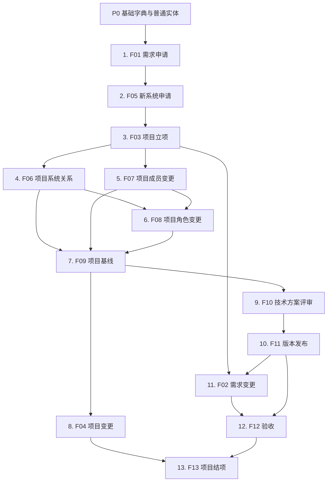

# 软件项目开发全生命周期审批与数据关系需求文档

## 1. 文档说明

| 项目 | 内容 |
| --- | --- |
| 文档版本 | V1.4 |
| 文档状态 | 需求基线与 F01/F03/F05/F06 阶段实施验收记录 |
| 编制日期 | 2026-07-28 |
| 适用范围 | 软件研发、数字化建设、系统改造、系统集成和数据迁移类项目，以及流程平台配置实施 |
| 目标读者 | 业务负责人、需求经理、PMO、项目经理、产品、架构、研发、测试、安全、运维、数据治理和流程建设人员 |

### 1.1 建设背景

软件项目开发过程中，需求、项目、系统、人员、角色、版本和验收数据通常由不同团队分别管理，容易出现以下问题：

1. 需求已经立项，但无法追踪由哪个项目、哪个版本和哪个系统交付。
2. 一个需求被多个项目拆分承接后，整体完成情况无法准确计算。
3. 项目涉及多个系统，但系统负责人、技术负责人和改造边界不清晰。
4. 项目成员变动后，角色、待办、系统权限和交付责任未同步移交。
5. 发布申请与批准需求、测试结果、系统影响范围脱节。
6. 项目结项时仍存在未交付需求、未关闭发布、未移交角色或未归档资料。

本需求以业务治理为出发点，建立“需求池 → 项目 → 系统资产 → 项目团队 → 项目基线 → 技术方案 → 发布 → 验收 → 结项”的完整关系链。

### 1.2 建设目标

1. 建立统一需求条目和需求关系模型，支持需求合并、拆分、依赖和多项目承接。
2. 建立项目与系统多对多关系，明确每个系统在项目中的建设方式和影响范围。
3. 建立项目成员与角色分离模型，支持项目级、系统级和发布级职责授权。
4. 建立从立项、系统申请、团队组建、基线、方案、发布到验收结项的审批闭环。
5. 通过字段级校验、状态约束、版本快照和审计记录保证跨流程数据一致。
6. 为后续流程平台配置、功能差距分析和验收测试提供业务基线。
7. 明确流程、流程实体、普通实体、列表数据范围、表单逻辑和流程动作的实施数量及边界。

### 1.3 业务范围

本期包含：

- 需求申请、评估、入池、合并、拆分、变更、取消和关闭。
- 项目立项、项目基线、项目变更、暂停、恢复、验收和结项。
- 新系统申请、系统资产登记及项目系统关系管理。
- 项目成员加入、退出、暂停、恢复和交接。
- 项目角色授权、变更、移交和失效。
- 技术方案评审、版本发布、上线验证、回滚和补审。
- 需求、项目、系统、成员、角色、版本和验收的交叉校验。

本期不包含：

- 研发任务、工时、代码提交、测试用例和缺陷的完整执行管理。
- 预算、采购、合同、付款等商务资金流程的详细字段。
- 数据库物理表、接口地址、程序类名和部署架构等代码级技术实现。

## 2. 业务角色

| 角色 | 主要职责 |
| --- | --- |
| 需求申请人 | 提交需求、补充材料、确认问题和参与验收 |
| 业务负责人 | 确认业务价值、范围、优先级和验收结论 |
| 需求经理 | 检查需求质量、组织评估、维护需求池和规划结论 |
| 需求决策人 | 决定需求入池、优先级、项目化或终止 |
| 项目发起人 | 对项目必要性、目标、资源和最终结果负责 |
| PMO | 负责项目治理、立项、基线、变更和结项审核 |
| 项目经理 | 负责范围、计划、团队、风险、发布和交付闭环 |
| 产品负责人 | 负责需求拆解、版本规划和业务验收 |
| 企业架构师 | 审核系统复用、总体架构、集成和技术边界 |
| 系统负责人 | 对系统业务边界、生命周期和系统级决策负责 |
| 技术负责人 | 对技术设计、研发交付、质量和技术风险负责 |
| 测试负责人 | 对测试范围、测试结论和发布质量门禁负责 |
| 安全负责人 | 审核安全设计、数据保护、权限和高风险发布 |
| 数据负责人 | 审核数据分类分级、数据流、数据模型和迁移方案 |
| 运维负责人 | 审核部署、容量、监控、备份、容灾和运维交接 |
| 发布负责人 | 组织上线窗口、实施、验证和回滚 |
| 部门负责人 | 审核人员投入、成员加入退出和部门资源安排 |

## 3. 业务对象关系

```mermaid
erDiagram
    REQUIREMENT ||--o{ REQUIREMENT_RELATION : "关联其他需求"
    REQUIREMENT ||--o{ REQUIREMENT_PROJECT_LINK : "由项目承接"
    REQUIREMENT ||--o{ REQUIREMENT_SYSTEM_IMPACT : "影响系统"
    SYSTEM_ASSET ||--o{ REQUIREMENT_SYSTEM_IMPACT : "接受需求评估"
    PROJECT ||--o{ REQUIREMENT_PROJECT_LINK : "承接需求"
    PROJECT ||--o{ PROJECT_SYSTEM_LINK : "建设或改造"
    SYSTEM_ASSET ||--o{ PROJECT_SYSTEM_LINK : "参与项目"
    SYSTEM_ASSET ||--o{ SYSTEM_DEPENDENCY_LINK : "依赖其他系统"
    SYSTEM_APPLICATION ||--o| SYSTEM_ASSET : "审批后生成"
    PROJECT ||--o{ PROJECT_MEMBER : "拥有成员"
    PROJECT_MEMBER ||--o{ PROJECT_ROLE_ASSIGNMENT : "承担角色"
    PROJECT_ROLE_CATALOG ||--o{ PROJECT_ROLE_ASSIGNMENT : "定义角色"
    SYSTEM_ASSET ||--o{ PROJECT_ROLE_ASSIGNMENT : "系统级角色"
    PROJECT ||--o{ PROJECT_BASELINE : "形成基线"
    PROJECT_BASELINE ||--o{ PROJECT_MILESTONE : "包含里程碑"
    REQUIREMENT ||--o{ REQUIREMENT_CHANGE_REQUEST : "发起需求变更"
    PROJECT ||--o{ PROJECT_CHANGE_REQUEST : "发起项目变更"
    PROJECT ||--o{ PROJECT_SYSTEM_CHANGE_REQUEST : "变更系统范围"
    PROJECT ||--o{ PROJECT_MEMBER_CHANGE_REQUEST : "变更项目成员"
    PROJECT ||--o{ PROJECT_ROLE_CHANGE_REQUEST : "变更项目角色"
    PROJECT ||--o{ SOLUTION_REVIEW : "发起评审"
    SYSTEM_ASSET ||--o{ SOLUTION_REVIEW : "评审方案"
    SOLUTION_REVIEW ||--o{ SOLUTION_REVIEW_ACTION : "产生整改项"
    PROJECT ||--o{ RELEASE_APPLICATION : "发起发布"
    RELEASE_APPLICATION ||--o{ RELEASE_REQUIREMENT_LINK : "交付需求"
    REQUIREMENT ||--o{ RELEASE_REQUIREMENT_LINK : "进入版本"
    RELEASE_APPLICATION ||--o{ RELEASE_SYSTEM_LINK : "发布到系统"
    SYSTEM_ASSET ||--o{ RELEASE_SYSTEM_LINK : "产生版本"
    SYSTEM_ASSET ||--o{ SYSTEM_VERSION : "拥有版本"
    PROJECT ||--o{ ACCEPTANCE_RECORD : "执行验收"
    ACCEPTANCE_RECORD ||--o{ ACCEPTANCE_SCOPE_LINK : "包含验收范围"
    ACCEPTANCE_RECORD ||--o{ ACCEPTANCE_ISSUE : "产生遗留问题"
    PROJECT ||--o| PROJECT_CLOSURE : "项目结项"
    PROJECT ||--o{ PROJECT_DOCUMENT_ARCHIVE : "归档文档"
```



核心关系原则：

1. 需求与项目为多对多关系。
2. 项目与系统为多对多关系。
3. 人员必须先成为项目成员，才能获得项目、系统或发布角色。
4. 系统资产独立于项目长期存在，不随单个项目结项而删除。
5. 发布必须同时关联项目、需求和系统，形成可追溯交付链。

## 4. 字段与数据规范

### 4.1 数据类型

| 类型 | 说明 |
| --- | --- |
| `STRING(n)` | 长度不超过 n 的文本 |
| `TEXT` | 长文本 |
| `INTEGER` | 整数 |
| `DECIMAL(18,2)` | 金额或精确数值 |
| `DECIMAL(5,2)` | 百分比，范围 0.00 至 100.00 |
| `BOOLEAN` | 布尔值 |
| `DATE` | 日期 |
| `DATETIME` | 日期时间 |
| `ENUM` | 单选枚举 |
| `MULTI_ENUM` | 多选枚举 |
| `REFERENCE` | 单个业务对象引用，保存目标 ID |
| `MULTI_REFERENCE` | 多个业务对象引用，保存关系记录，不保存名称拼接 |
| `FILE` | 文件或附件集合 |
| `JSON_SNAPSHOT` | 提交或审批时生成的只读数据快照 |

### 4.2 公共主数据字段

所有业务对象均包含以下字段：

| 字段编码 | 中文名称 | 类型 | 必填 | 默认值 | 业务规则 |
| --- | --- | --- | --- | --- | --- |
| `id` | 主键 | `STRING(64)` | 是 | 系统生成 | 全局唯一，不展示为业务编号 |
| `status` | 状态 | `ENUM` | 是 | 对象初始状态 | 只能按该对象状态机流转 |
| `version` | 数据版本 | `INTEGER` | 是 | `1` | 每次有效修改递增，用于并发冲突检查 |
| `created_by` | 创建人 | `REFERENCE(USER)` | 是 | 当前用户 | 创建后不可为空 |
| `created_at` | 创建时间 | `DATETIME` | 是 | 当前时间 | 创建后不可修改 |
| `updated_by` | 最后修改人 | `REFERENCE(USER)` | 是 | 当前用户 | 每次修改更新 |
| `updated_at` | 最后修改时间 | `DATETIME` | 是 | 当前时间 | 每次修改更新 |
| `deleted_flag` | 删除标识 | `BOOLEAN` | 是 | `false` | 仅草稿且无引用对象允许逻辑删除 |

### 4.3 审批对象公共字段

所有进入审批的业务对象增加以下字段：

| 字段编码 | 中文名称 | 类型 | 必填 | 默认值 | 业务规则 |
| --- | --- | --- | --- | --- | --- |
| `applicant_id` | 申请人 | `REFERENCE(USER)` | 是 | 当前用户 | 提交后不可直接修改 |
| `applicant_dept_id` | 申请部门 | `REFERENCE(DEPT)` | 是 | 申请人当前部门 | 提交时保存部门快照 |
| `submitted_at` | 提交时间 | `DATETIME` | 否 | 空 | 首次或重新提交时写入 |
| `approved_at` | 审批通过时间 | `DATETIME` | 否 | 空 | 最终批准时写入 |
| `approval_result` | 审批结果 | `ENUM` | 否 | 空 | `APPROVED`、`REJECTED`、`CANCELLED` |
| `approval_comment_summary` | 审批意见摘要 | `TEXT` | 否 | 空 | 保存最终审批结论摘要 |
| `submitted_snapshot` | 提交数据快照 | `JSON_SNAPSHOT` | 否 | 空 | 每次提交生成，不被后续编辑覆盖 |

### 4.4 业务编号规则

| 对象 | 编号示例 | 规则 |
| --- | --- | --- |
| 需求 | `REQ-2026-000001` | `REQ-年份-6位序号` |
| 项目 | `PRJ-2026-0001` | `PRJ-年份-4位序号` |
| 系统申请 | `SYSA-2026-0001` | `SYSA-年份-4位序号` |
| 系统资产 | `SYS-CRM-001` | `SYS-业务域缩写-3位序号` |
| 项目基线 | `BL-PRJ20260001-V1` | `BL-项目编号简写-版本` |
| 里程碑 | `MS-PRJ20260001-01` | `MS-项目编号简写-2位序号` |
| 方案评审 | `SR-2026-0001` | `SR-年份-4位序号` |
| 发布申请 | `REL-2026-000001` | `REL-年份-6位序号` |
| 验收 | `ACC-2026-000001` | `ACC-年份-6位序号` |
| 结项 | `CLS-2026-0001` | `CLS-年份-4位序号` |
| 治理变更 | `CHG-2026-000001` | `CHG-年份-6位序号` |

业务编号创建后不可修改，也不得重复使用已作废编号。

### 4.5 外部主数据引用

本文档中的以下对象属于外部主数据，业务审批只保存其稳定 ID 和提交时快照：

| 引用对象 | 必需信息 | 主要用途 |
| --- | --- | --- |
| 用户 `USER` | 用户 ID、姓名、账号、状态、主部门 | 申请人、负责人、成员和审批责任 |
| 部门 `DEPT` | 部门 ID、名称、组织路径、负责人 | 申请部门、归属部门和资源审批 |
| 项目群 `PROJECT_GROUP` | 项目群 ID、名称、负责人、状态 | 企业级项目组合管理 |
| 业务领域 `BUSINESS_DOMAIN` | 领域编码、名称、负责人 | 需求和系统业务归属 |

主数据名称变化不得改写历史提交快照。主数据停用后不得用于新申请，但历史数据必须可以正常展示。

## 5. 字段级业务对象

### 5.1 需求条目 `requirement`

#### 5.1.1 字段定义

| 字段编码 | 中文名称 | 类型 | 必填 | 默认值 | 业务规则 |
| --- | --- | --- | --- | --- | --- |
| `requirement_code` | 需求编号 | `STRING(32)` | 是 | 自动生成 | 唯一、不可修改 |
| `title` | 需求标题 | `STRING(200)` | 是 | 无 | 同一申请部门存在相似标题时提示重复 |
| `requirement_type` | 需求类型 | `ENUM` | 是 | `BUSINESS` | `BUSINESS`、`REGULATORY`、`TECHNICAL`、`SECURITY`、`DATA`、`DEFECT_IMPROVEMENT` |
| `source_type` | 需求来源 | `ENUM` | 是 | `INTERNAL` | `INTERNAL`、`CUSTOMER`、`REGULATION`、`AUDIT`、`OPERATIONS`、`PROJECT_DERIVED` |
| `source_reference` | 来源依据 | `STRING(200)` | 否 | 空 | 客户、制度、审计编号或原项目编号 |
| `requester_id` | 需求申请人 | `REFERENCE(USER)` | 是 | 当前用户 | 必须为有效用户 |
| `requester_dept_id` | 申请部门 | `REFERENCE(DEPT)` | 是 | 当前部门 | 提交时保存，不随后续调岗变化 |
| `business_owner_id` | 业务负责人 | `REFERENCE(USER)` | 是 | 无 | 对需求价值和验收负责 |
| `business_domain` | 业务领域 | `ENUM` | 是 | 无 | 例如客户、销售、供应链、财务、人力、数据平台 |
| `background` | 业务背景 | `TEXT` | 是 | 无 | 至少 20 个字符 |
| `current_problem` | 当前问题 | `TEXT` | 是 | 无 | 描述现状、影响和问题证据 |
| `requirement_description` | 需求描述 | `TEXT` | 是 | 无 | 描述需要实现的业务能力，不写纯技术方案 |
| `target_outcome` | 目标结果 | `TEXT` | 是 | 无 | 应包含可验证结果 |
| `business_value` | 业务价值 | `TEXT` | 是 | 无 | 至少包含效率、收入、成本、合规或风险中的一项 |
| `acceptance_criteria` | 初始验收标准 | `TEXT` | 是 | 无 | 必须可观察、可测试或可确认 |
| `priority` | 优先级 | `ENUM` | 是 | `P2` | `P0`、`P1`、`P2`、`P3` |
| `urgency` | 紧急程度 | `ENUM` | 是 | `NORMAL` | `IMMEDIATE`、`URGENT`、`NORMAL`、`LOW` |
| `expected_delivery_date` | 期望交付日期 | `DATE` | 否 | 空 | 不得早于提交日期 |
| `affected_user_count` | 预计影响用户数 | `INTEGER` | 否 | `0` | 不得小于 0 |
| `cross_department_flag` | 是否跨部门 | `BOOLEAN` | 是 | `false` | 为 true 时至少填写一个协同部门 |
| `collaborating_dept_ids` | 协同部门 | `MULTI_REFERENCE(DEPT)` | 否 | 空 | 跨部门需求必填 |
| `affected_process` | 影响业务流程 | `TEXT` | 否 | 空 | 描述流程名称、环节和变化 |
| `data_involved_flag` | 是否涉及数据 | `BOOLEAN` | 是 | `false` | 为 true 时数据分类必填 |
| `data_classification` | 数据分类等级 | `ENUM` | 否 | 空 | `PUBLIC`、`INTERNAL`、`SENSITIVE`、`HIGHLY_SENSITIVE` |
| `initial_system_scope` | 初步影响系统说明 | `TEXT` | 否 | 空 | 仅用于申请阶段初步描述，正式关系通过评估记录建立 |
| `attachment_files` | 需求附件 | `FILE` | 否 | 空 | 可上传流程图、制度、原型和数据样例 |
| `estimated_workload` | 初步工作量 | `DECIMAL(18,2)` | 否 | 空 | 单位由 `workload_unit` 决定 |
| `workload_unit` | 工作量单位 | `ENUM` | 否 | `PERSON_DAY` | `PERSON_DAY`、`PERSON_MONTH` |
| `recommended_solution` | 建议处理方案 | `TEXT` | 否 | 空 | 由评估阶段填写 |
| `planned_flag` | 是否已规划 | `BOOLEAN` | 是 | `false` | 存在有效需求项目关系时自动更新 |
| `delivered_percentage` | 已交付比例 | `DECIMAL(5,2)` | 是 | `0.00` | 由需求项目关系计算，不允许手工修改 |
| `decision_conclusion` | 需求决策结论 | `TEXT` | 否 | 空 | 入池、驳回、合并或拆分时必填 |
| `close_reason` | 关闭原因 | `TEXT` | 否 | 空 | 取消、驳回、合并和关闭时必填 |

#### 5.1.2 状态机

```text
DRAFT
  -> SUBMITTED
  -> ASSESSING
  -> PENDING_DECISION
  -> BACKLOG
  -> PLANNED
  -> DEVELOPING
  -> ACCEPTING
  -> COMPLETED
```

异常终态为 `REJECTED`、`CANCELLED`、`MERGED`。`PLANNED` 之后取消需求必须走需求变更审批，不允许直接改状态。

### 5.2 需求关系 `requirement_relation`

| 字段编码 | 中文名称 | 类型 | 必填 | 默认值 | 业务规则 |
| --- | --- | --- | --- | --- | --- |
| `relation_code` | 关系编号 | `STRING(32)` | 是 | 自动生成 | 唯一 |
| `source_requirement_id` | 来源需求 | `REFERENCE(REQUIREMENT)` | 是 | 无 | 不能等于目标需求 |
| `target_requirement_id` | 目标需求 | `REFERENCE(REQUIREMENT)` | 是 | 无 | 必须存在且未删除 |
| `relation_type` | 关系类型 | `ENUM` | 是 | 无 | `PARENT_CHILD`、`SPLIT_TO`、`MERGED_INTO`、`DEPENDS_ON`、`DUPLICATE_OF`、`RELATED_TO` |
| `scope_description` | 关系范围说明 | `TEXT` | 是 | 无 | 说明继承、拆分、合并或依赖的具体内容 |
| `allocation_percentage` | 拆分比例 | `DECIMAL(5,2)` | 否 | 空 | `SPLIT_TO` 时可填，同一来源需求合计不得超过 100% |
| `dependency_type` | 依赖类型 | `ENUM` | 否 | 空 | `STRONG`、`WEAK`；仅 `DEPENDS_ON` 使用 |
| `effective_at` | 生效时间 | `DATETIME` | 是 | 审批通过时间 | 不得早于关系创建时间 |
| `invalid_at` | 失效时间 | `DATETIME` | 否 | 空 | 必须晚于生效时间 |
| `change_reason` | 关系变更原因 | `TEXT` | 否 | 空 | 失效或修改关系时必填 |
| `status` | 关系状态 | `ENUM` | 是 | `PROPOSED` | `PROPOSED`、`ACTIVE`、`INVALID`、`REJECTED`、`CANCELLED` |

业务规则：

1. `PARENT_CHILD` 和 `SPLIT_TO` 不得形成循环关系。
2. `MERGED_INTO` 生效后，来源需求状态变为 `MERGED`，不得继续独立规划。
3. 强依赖需求未完成时，依赖方不得进入最终验收。
4. 已被发布版本引用的关系不得删除，只能失效并保留历史。

### 5.3 项目 `project`

| 字段编码 | 中文名称 | 类型 | 必填 | 默认值 | 业务规则 |
| --- | --- | --- | --- | --- | --- |
| `project_code` | 项目编号 | `STRING(32)` | 是 | 立项批准后生成 | 唯一、不可修改 |
| `project_name` | 项目名称 | `STRING(200)` | 是 | 无 | 同一项目群内不可重名 |
| `project_type` | 项目类型 | `ENUM` | 是 | 无 | `NEW_SYSTEM`、`ENHANCEMENT`、`INTEGRATION`、`DATA`、`SECURITY`、`MIGRATION`、`RESEARCH` |
| `project_level` | 项目级别 | `ENUM` | 是 | `DEPARTMENT` | `ENTERPRISE`、`CROSS_DEPARTMENT`、`DEPARTMENT`、`SMALL_CHANGE` |
| `project_group_id` | 所属项目群 | `REFERENCE(PROJECT_GROUP)` | 否 | 空 | 企业级项目建议必填 |
| `sponsor_dept_id` | 发起部门 | `REFERENCE(DEPT)` | 是 | 申请部门 | 对项目资源和业务结果负责 |
| `project_sponsor_id` | 项目发起人 | `REFERENCE(USER)` | 是 | 无 | 应为发起部门负责人或授权人 |
| `business_owner_id` | 业务负责人 | `REFERENCE(USER)` | 是 | 无 | 负责业务目标和验收 |
| `project_manager_id` | 项目经理 | `REFERENCE(USER)` | 是 | 无 | 必须同步存在有效项目经理角色 |
| `product_owner_id` | 产品负责人 | `REFERENCE(USER)` | 是 | 无 | 必须为项目有效成员 |
| `project_background` | 项目背景 | `TEXT` | 是 | 无 | 说明项目来源和必要性 |
| `project_objective` | 项目目标 | `TEXT` | 是 | 无 | 目标应可衡量 |
| `scope_in` | 项目范围内 | `TEXT` | 是 | 无 | 明确本项目负责内容 |
| `scope_out` | 项目范围外 | `TEXT` | 是 | 无 | 明确不负责内容和边界 |
| `expected_deliverables` | 预期交付物 | `TEXT` | 是 | 无 | 说明系统、版本、文档和验收成果 |
| `success_metrics` | 成功指标 | `TEXT` | 是 | 无 | 至少一项量化指标 |
| `planned_start_date` | 计划开始日期 | `DATE` | 是 | 无 | 不得晚于计划结束日期 |
| `planned_end_date` | 计划结束日期 | `DATE` | 是 | 无 | 不得早于计划开始日期 |
| `actual_start_date` | 实际开始日期 | `DATE` | 否 | 空 | 项目激活时写入 |
| `actual_end_date` | 实际结束日期 | `DATE` | 否 | 空 | 项目结项时写入 |
| `current_baseline_version` | 当前基线版本 | `INTEGER` | 是 | `0` | 首个基线批准后为 1 |
| `priority` | 项目优先级 | `ENUM` | 是 | `P2` | `P0`、`P1`、`P2`、`P3` |
| `risk_level` | 项目风险等级 | `ENUM` | 是 | `MEDIUM` | `LOW`、`MEDIUM`、`HIGH`、`CRITICAL` |
| `security_involved_flag` | 是否涉及安全专项 | `BOOLEAN` | 是 | `false` | 为 true 时立项和方案增加安全审批 |
| `data_involved_flag` | 是否涉及数据专项 | `BOOLEAN` | 是 | `false` | 为 true 时增加数据负责人审批 |
| `completion_percentage` | 项目完成比例 | `DECIMAL(5,2)` | 是 | `0.00` | 由当前基线里程碑加权计算 |
| `pause_reason` | 暂停原因 | `TEXT` | 否 | 空 | 暂停项目时必填 |
| `cancel_reason` | 取消原因 | `TEXT` | 否 | 空 | 取消项目时必填 |

状态：`DRAFT`、`PENDING_APPROVAL`、`APPROVED`、`ACTIVE`、`PAUSED`、`ACCEPTING`、`CLOSING`、`CLOSED`、`REJECTED`、`CANCELLED`。

项目进入 `ACTIVE` 前必须满足：

- 至少关联一条已入池需求。
- 存在至少一条有效项目系统关系，或立项明确为纯咨询研究项目。
- 项目经理和产品负责人已成为有效项目成员。
- 首版项目基线已批准。

### 5.4 需求项目关系 `requirement_project_link`

| 字段编码 | 中文名称 | 类型 | 必填 | 默认值 | 业务规则 |
| --- | --- | --- | --- | --- | --- |
| `link_code` | 关系编号 | `STRING(32)` | 是 | 自动生成 | 唯一 |
| `requirement_id` | 需求 | `REFERENCE(REQUIREMENT)` | 是 | 无 | 需求必须处于 `BACKLOG` 及以后状态 |
| `project_id` | 项目 | `REFERENCE(PROJECT)` | 是 | 无 | 项目不得已关闭或取消 |
| `relation_role` | 承接角色 | `ENUM` | 是 | `PRIMARY` | `PRIMARY`、`SUPPORTING`、`DEPENDENCY` |
| `delivery_scope` | 承接范围 | `TEXT` | 是 | 无 | 说明本项目具体交付的需求范围 |
| `allocation_percentage` | 分配比例 | `DECIMAL(5,2)` | 是 | 无 | 大于 0；同一需求有效关系合计不得超过 100% |
| `target_milestone_id` | 目标里程碑 | `REFERENCE(MILESTONE)` | 否 | 空 | 必须属于同一项目 |
| `target_release_id` | 目标发布 | `REFERENCE(RELEASE)` | 否 | 空 | 必须属于同一项目 |
| `responsible_member_id` | 交付责任人 | `REFERENCE(PROJECT_MEMBER)` | 是 | 无 | 必须为有效项目成员 |
| `planned_start_date` | 计划开始日期 | `DATE` | 是 | 无 | 应位于项目计划周期内 |
| `planned_end_date` | 计划完成日期 | `DATE` | 是 | 无 | 不得早于计划开始日期 |
| `actual_completion_date` | 实际完成日期 | `DATE` | 否 | 空 | 交付或验收时写入 |
| `completion_percentage` | 当前完成比例 | `DECIMAL(5,2)` | 是 | `0.00` | 0 至 100 |
| `acceptance_record_id` | 验收记录 | `REFERENCE(ACCEPTANCE)` | 否 | 空 | `ACCEPTED` 状态必须存在 |
| `cancel_reason` | 取消原因 | `TEXT` | 否 | 空 | 取消关系时必填 |
| `status` | 交付状态 | `ENUM` | 是 | `PROPOSED` | `PROPOSED`、`APPROVED`、`DELIVERING`、`DELIVERED`、`ACCEPTED`、`CANCELLED` |

需求已交付比例计算：

```text
delivered_percentage =
SUM(allocation_percentage * completion_percentage / 100)
```

需求关闭前，所有有效关系的已验收比例与明确取消比例合计必须达到 100%。

### 5.5 系统申请 `system_application`

| 字段编码 | 中文名称 | 类型 | 必填 | 默认值 | 业务规则 |
| --- | --- | --- | --- | --- | --- |
| `application_code` | 系统申请编号 | `STRING(32)` | 是 | 自动生成 | 唯一 |
| `proposed_system_name` | 拟建系统名称 | `STRING(200)` | 是 | 无 | 进入审批前执行相似系统检查 |
| `proposed_abbreviation` | 系统简称 | `STRING(50)` | 是 | 无 | 仅大写字母、数字和短横线 |
| `applicant_id` | 申请人 | `REFERENCE(USER)` | 是 | 当前用户 | 必须为有效用户 |
| `owner_dept_id` | 拟归属部门 | `REFERENCE(DEPT)` | 是 | 无 | 负责系统长期运营 |
| `business_background` | 建设背景 | `TEXT` | 是 | 无 | 至少 20 个字符 |
| `system_positioning` | 系统定位 | `TEXT` | 是 | 无 | 说明系统在企业应用架构中的职责 |
| `business_scope` | 业务范围 | `TEXT` | 是 | 无 | 明确系统内外边界 |
| `necessity_description` | 建设必要性 | `TEXT` | 是 | 无 | 说明不建设的影响 |
| `existing_system_analysis` | 已有系统分析 | `TEXT` | 是 | 无 | 必须列出可复用或相似系统 |
| `non_reuse_reason` | 不复用原因 | `TEXT` | 是 | 无 | 新建系统必须说明 |
| `proposed_system_owner_id` | 拟系统负责人 | `REFERENCE(USER)` | 是 | 无 | 审批后写入系统资产 |
| `proposed_technical_owner_id` | 拟技术负责人 | `REFERENCE(USER)` | 是 | 无 | 审批后写入系统资产 |
| `proposed_ops_owner_id` | 拟运维负责人 | `REFERENCE(USER)` | 是 | 无 | 上线前必须有效 |
| `system_type` | 系统类型 | `ENUM` | 是 | 无 | `BUSINESS`、`PLATFORM`、`DATA`、`INTEGRATION`、`INFRASTRUCTURE`、`TOOL` |
| `deployment_mode` | 部署方式 | `ENUM` | 是 | 无 | `PUBLIC_CLOUD`、`PRIVATE_CLOUD`、`ON_PREMISE`、`HYBRID`、`SAAS` |
| `architecture_summary` | 初步架构说明 | `TEXT` | 是 | 无 | 包含客户端、服务、数据和集成边界 |
| `upstream_systems` | 初步上游系统 | `MULTI_REFERENCE(SYSTEM)` | 否 | 空 | 正式关系在系统批准后建立 |
| `downstream_systems` | 初步下游系统 | `MULTI_REFERENCE(SYSTEM)` | 否 | 空 | 不允许引用已退役系统作为唯一依赖 |
| `criticality_level` | 系统重要性 | `ENUM` | 是 | `L3` | `L1` 核心、`L2` 重要、`L3` 一般、`L4` 辅助 |
| `data_classification` | 最高数据等级 | `ENUM` | 是 | `INTERNAL` | `PUBLIC`、`INTERNAL`、`SENSITIVE`、`HIGHLY_SENSITIVE` |
| `security_level` | 安全保护等级 | `ENUM` | 是 | `S2` | `S1`、`S2`、`S3`、`S4` |
| `availability_target` | 可用性目标 | `DECIMAL(5,2)` | 是 | `99.90` | 范围 0 至 100 |
| `rto_minutes` | 恢复时间目标 | `INTEGER` | 是 | `240` | 大于等于 0 |
| `rpo_minutes` | 恢复点目标 | `INTEGER` | 是 | `60` | 大于等于 0 |
| `source_requirement_id` | 来源需求 | `REFERENCE(REQUIREMENT)` | 否 | 空 | 来源需求和来源项目至少填写一项 |
| `source_project_id` | 来源项目 | `REFERENCE(PROJECT)` | 否 | 空 | 填写时项目必须未关闭 |
| `expected_build_date` | 预计开工日期 | `DATE` | 是 | 无 | 不得晚于预计上线日期 |
| `expected_go_live_date` | 预计上线日期 | `DATE` | 是 | 无 | 核心系统至少预留完整评审周期 |
| `duplicate_check_result` | 重复系统检查结果 | `ENUM` | 否 | 空 | `NO_DUPLICATE`、`POSSIBLE_DUPLICATE`、`REUSE_REQUIRED` |
| `duplicate_system_ids` | 疑似重复系统 | `MULTI_REFERENCE(SYSTEM)` | 否 | 空 | 存在疑似重复时必填 |
| `review_conclusion` | 最终评审结论 | `TEXT` | 否 | 空 | 审批结束时写入 |
| `approved_system_id` | 生成系统资产 | `REFERENCE(SYSTEM)` | 否 | 空 | 仅批准后生成且不可改绑 |

状态：`DRAFT`、`ASSESSING`、`ARCH_REVIEW`、`SECURITY_REVIEW`、`OPS_REVIEW`、`APPROVED`、`REJECTED`、`CANCELLED`。

### 5.6 系统资产 `system_asset`

| 字段编码 | 中文名称 | 类型 | 必填 | 默认值 | 业务规则 |
| --- | --- | --- | --- | --- | --- |
| `system_code` | 系统编号 | `STRING(32)` | 是 | 批准后生成 | 唯一、不可修改 |
| `system_name` | 系统名称 | `STRING(200)` | 是 | 来源申请 | 重命名需走系统信息变更 |
| `system_abbreviation` | 系统简称 | `STRING(50)` | 是 | 来源申请 | 企业范围唯一 |
| `system_type` | 系统类型 | `ENUM` | 是 | 来源申请 | 与系统申请一致 |
| `business_domain` | 业务领域 | `ENUM` | 是 | 无 | 用于系统资产分类 |
| `owner_dept_id` | 归属部门 | `REFERENCE(DEPT)` | 是 | 来源申请 | 变更需审批 |
| `system_owner_id` | 系统负责人 | `REFERENCE(USER)` | 是 | 来源申请 | 必须为有效用户 |
| `technical_owner_id` | 技术负责人 | `REFERENCE(USER)` | 是 | 来源申请 | 必须为有效用户 |
| `ops_owner_id` | 运维负责人 | `REFERENCE(USER)` | 是 | 来源申请 | 上线后不得为空 |
| `criticality_level` | 系统重要性 | `ENUM` | 是 | 来源申请 | `L1` 至 `L4` |
| `data_classification` | 最高数据等级 | `ENUM` | 是 | 来源申请 | 数据降级需数据负责人批准 |
| `security_level` | 安全保护等级 | `ENUM` | 是 | 来源申请 | 不得低于数据等级要求 |
| `deployment_mode` | 部署方式 | `ENUM` | 是 | 来源申请 | 变更需架构和运维评审 |
| `production_url` | 生产访问地址 | `STRING(500)` | 否 | 空 | 上线系统建议填写 |
| `repository_url` | 代码仓库地址 | `STRING(500)` | 否 | 空 | 自研系统必填 |
| `documentation_url` | 文档地址 | `STRING(500)` | 否 | 空 | 上线前必填 |
| `current_version` | 当前生产版本 | `STRING(100)` | 否 | 空 | 成功发布后自动更新 |
| `availability_target` | 可用性目标 | `DECIMAL(5,2)` | 是 | 来源申请 | 0 至 100 |
| `rto_minutes` | 恢复时间目标 | `INTEGER` | 是 | 来源申请 | 不得小于 0 |
| `rpo_minutes` | 恢复点目标 | `INTEGER` | 是 | 来源申请 | 不得小于 0 |
| `go_live_date` | 首次上线日期 | `DATE` | 否 | 空 | 首次成功发布后写入 |
| `retired_at` | 退役时间 | `DATETIME` | 否 | 空 | 仅 `RETIRED` 状态填写 |
| `retirement_reason` | 退役原因 | `TEXT` | 否 | 空 | 退役时必填 |
| `source_application_id` | 来源申请 | `REFERENCE(SYSTEM_APPLICATION)` | 是 | 来源审批 | 不可修改 |
| `status` | 生命周期状态 | `ENUM` | 是 | `PROPOSED` | `PROPOSED`、`BUILDING`、`TESTING`、`ACTIVE`、`SUSPENDED`、`RETIRING`、`RETIRED` |

### 5.7 项目系统关系 `project_system_link`

| 字段编码 | 中文名称 | 类型 | 必填 | 默认值 | 业务规则 |
| --- | --- | --- | --- | --- | --- |
| `link_code` | 关系编号 | `STRING(32)` | 是 | 自动生成 | 唯一 |
| `project_id` | 项目 | `REFERENCE(PROJECT)` | 是 | 无 | 项目不得已关闭 |
| `system_id` | 系统 | `REFERENCE(SYSTEM)` | 是 | 无 | 系统不得已退役 |
| `construction_mode` | 建设方式 | `ENUM` | 是 | 无 | `NEW_BUILD`、`ENHANCEMENT`、`INTEGRATION`、`MIGRATION`、`SECURITY_REMEDIATION`、`RETIREMENT` |
| `relation_reason` | 关联原因 | `TEXT` | 是 | 无 | 说明系统为何进入项目范围 |
| `affected_modules` | 影响模块 | `TEXT` | 是 | 无 | 至少填写一个模块或能力范围 |
| `interface_impact` | 接口影响 | `TEXT` | 否 | 空 | 涉及接口时必填 |
| `data_impact` | 数据影响 | `TEXT` | 否 | 空 | 涉及数据时必填 |
| `deployment_impact` | 部署影响 | `TEXT` | 否 | 空 | 涉及基础设施变化时必填 |
| `target_system_version` | 目标系统版本 | `STRING(100)` | 否 | 空 | 进入发布规划后必填 |
| `project_system_lead_id` | 项目内系统负责人 | `REFERENCE(PROJECT_MEMBER)` | 是 | 无 | 必须为有效项目成员 |
| `technical_lead_id` | 项目内技术负责人 | `REFERENCE(PROJECT_MEMBER)` | 是 | 无 | 必须存在对应系统角色 |
| `risk_level` | 关系风险等级 | `ENUM` | 是 | `MEDIUM` | `LOW`、`MEDIUM`、`HIGH`、`CRITICAL` |
| `planned_start_date` | 计划开始日期 | `DATE` | 是 | 无 | 应位于项目周期内 |
| `planned_end_date` | 计划完成日期 | `DATE` | 是 | 无 | 不得早于计划开始日期 |
| `effective_at` | 生效时间 | `DATETIME` | 否 | 审批通过时间 | 同一项目系统仅一条有效关系 |
| `invalid_at` | 失效时间 | `DATETIME` | 否 | 空 | 移出项目范围时写入 |
| `invalid_reason` | 失效原因 | `TEXT` | 否 | 空 | 失效时必填 |
| `status` | 关系状态 | `ENUM` | 是 | `PROPOSED` | `PROPOSED`、`PENDING_APPROVAL`、`ACTIVE`、`INVALID`、`REJECTED`、`CANCELLED` |

移除项目系统关系前必须满足：

- 不存在该关系下未完成的需求项目关系。
- 不存在该系统的已批准待发布版本。
- 不存在未关闭的方案评审或验收。
- 对应系统级项目角色已经移交或结束。

### 5.8 项目成员 `project_member`

| 字段编码 | 中文名称 | 类型 | 必填 | 默认值 | 业务规则 |
| --- | --- | --- | --- | --- | --- |
| `member_code` | 成员记录编号 | `STRING(32)` | 是 | 自动生成 | 唯一 |
| `project_id` | 项目 | `REFERENCE(PROJECT)` | 是 | 无 | 项目不得已关闭 |
| `user_id` | 人员 | `REFERENCE(USER)` | 是 | 无 | 同一项目同一时间仅一条有效成员记录 |
| `source_dept_id` | 来源部门 | `REFERENCE(DEPT)` | 是 | 人员当前部门 | 加入时保存快照 |
| `employment_type` | 人员类型 | `ENUM` | 是 | `INTERNAL` | `INTERNAL`、`VENDOR`、`CONTRACTOR`、`PART_TIME` |
| `join_date` | 加入日期 | `DATE` | 是 | 无 | 不得晚于计划退出日期 |
| `planned_leave_date` | 计划退出日期 | `DATE` | 否 | 空 | 应位于项目周期内 |
| `actual_leave_date` | 实际退出日期 | `DATE` | 否 | 空 | 退出完成时写入 |
| `allocation_percentage` | 项目投入比例 | `DECIMAL(5,2)` | 是 | `100.00` | 0 至 100；跨项目总投入超 100% 时提示 |
| `join_reason` | 加入原因 | `TEXT` | 是 | 无 | 说明职责和投入必要性 |
| `leave_reason` | 退出原因 | `TEXT` | 否 | 空 | 申请退出时必填 |
| `handover_user_id` | 交接人 | `REFERENCE(PROJECT_MEMBER)` | 否 | 空 | 存在角色或待办时必填 |
| `handover_description` | 交接说明 | `TEXT` | 否 | 空 | 说明需求、系统、发布和资料交接 |
| `account_required_flag` | 是否需要项目账号 | `BOOLEAN` | 是 | `true` | 外部人员必须明确 |
| `environment_access_required_flag` | 是否需要环境权限 | `BOOLEAN` | 是 | `false` | 为 true 时需指定环境范围 |
| `environment_scope` | 环境权限范围 | `MULTI_ENUM` | 否 | 空 | `DEV`、`TEST`、`UAT`、`PROD_READ`、`PROD_OPERATE` |
| `access_revoked_flag` | 权限是否回收 | `BOOLEAN` | 是 | `false` | 退出完成前必须为 true |
| `handover_completed_flag` | 交接是否完成 | `BOOLEAN` | 是 | `false` | 存在交接要求时退出前必须为 true |
| `status` | 成员状态 | `ENUM` | 是 | `PENDING_JOIN` | `PENDING_JOIN`、`ACTIVE`、`SUSPENDED`、`PENDING_LEAVE`、`LEFT`、`REJECTED` |

### 5.9 项目角色分配 `project_role_assignment`

| 字段编码 | 中文名称 | 类型 | 必填 | 默认值 | 业务规则 |
| --- | --- | --- | --- | --- | --- |
| `assignment_code` | 角色记录编号 | `STRING(32)` | 是 | 自动生成 | 唯一 |
| `project_id` | 项目 | `REFERENCE(PROJECT)` | 是 | 无 | 与成员项目一致 |
| `system_id` | 系统 | `REFERENCE(SYSTEM)` | 条件必填 | 空 | `SYSTEM` 作用域必填 |
| `release_id` | 发布申请 | `REFERENCE(RELEASE)` | 条件必填 | 空 | `RELEASE` 作用域必填 |
| `member_id` | 项目成员 | `REFERENCE(PROJECT_MEMBER)` | 是 | 无 | 必须为有效成员 |
| `user_id` | 人员 | `REFERENCE(USER)` | 是 | 由成员带出 | 不允许与成员人员不一致 |
| `role_code` | 角色编码 | `ENUM` | 是 | 无 | 见标准角色目录 |
| `role_scope` | 角色作用域 | `ENUM` | 是 | `PROJECT` | `PROJECT`、`SYSTEM`、`RELEASE` |
| `primary_flag` | 是否主负责人 | `BOOLEAN` | 是 | `false` | 唯一角色必须为 true |
| `responsibility_description` | 职责说明 | `TEXT` | 是 | 无 | 说明具体责任边界 |
| `effective_from` | 生效日期 | `DATE` | 是 | 无 | 不得早于成员加入日期 |
| `effective_to` | 失效日期 | `DATE` | 否 | 空 | 不得晚于成员退出日期 |
| `predecessor_assignment_id` | 前任角色记录 | `REFERENCE(ROLE_ASSIGNMENT)` | 否 | 空 | 角色移交时填写 |
| `handover_required_flag` | 是否需要交接 | `BOOLEAN` | 是 | `false` | 关键角色默认 true |
| `handover_completed_flag` | 交接是否完成 | `BOOLEAN` | 是 | `false` | 未完成不得结束前任角色 |
| `delegated_approval_flag` | 是否具有审批职责 | `BOOLEAN` | 是 | `false` | 根据角色目录带出 |
| `status` | 角色状态 | `ENUM` | 是 | `PENDING_APPROVAL` | `PENDING_APPROVAL`、`ACTIVE`、`SUSPENDED`、`EXPIRED`、`REVOKED`、`REJECTED` |

标准角色目录：

| `role_code` | 角色名称 | 默认作用域 | 唯一主角色 | 关键角色 |
| --- | --- | --- | --- | --- |
| `PROJECT_MANAGER` | 项目经理 | 项目 | 是 | 是 |
| `BUSINESS_OWNER` | 业务负责人 | 项目 | 是 | 是 |
| `PRODUCT_OWNER` | 产品负责人 | 项目 | 是 | 是 |
| `REQUIREMENT_ANALYST` | 需求分析师 | 项目 | 否 | 否 |
| `ARCHITECT` | 架构师 | 项目/系统 | 否 | 是 |
| `SYSTEM_LEAD` | 项目内系统负责人 | 系统 | 是 | 是 |
| `TECH_LEAD` | 技术负责人 | 系统 | 是 | 是 |
| `DEVELOPER` | 开发人员 | 系统 | 否 | 否 |
| `TEST_LEAD` | 测试负责人 | 项目/系统 | 是 | 是 |
| `TESTER` | 测试人员 | 系统 | 否 | 否 |
| `OPS_LEAD` | 运维负责人 | 系统 | 是 | 是 |
| `SECURITY_OWNER` | 安全负责人 | 项目/系统 | 是 | 是 |
| `DATA_OWNER` | 数据负责人 | 项目/系统 | 是 | 是 |
| `RELEASE_MANAGER` | 发布负责人 | 发布 | 是 | 是 |

### 5.10 项目基线 `project_baseline`

| 字段编码 | 中文名称 | 类型 | 必填 | 默认值 | 业务规则 |
| --- | --- | --- | --- | --- | --- |
| `baseline_code` | 基线编号 | `STRING(40)` | 是 | 自动生成 | 项目内唯一 |
| `project_id` | 项目 | `REFERENCE(PROJECT)` | 是 | 无 | 不得为已关闭项目 |
| `baseline_version` | 基线版本 | `INTEGER` | 是 | 上一版本加 1 | 项目内连续递增 |
| `baseline_type` | 基线类型 | `ENUM` | 是 | `INITIAL` | `INITIAL`、`REBASELINE` |
| `scope_summary` | 范围摘要 | `TEXT` | 是 | 无 | 描述本版范围变化 |
| `requirement_snapshot` | 需求范围快照 | `JSON_SNAPSHOT` | 是 | 提交时生成 | 包含需求项目关系和比例 |
| `system_snapshot` | 系统范围快照 | `JSON_SNAPSHOT` | 是 | 提交时生成 | 包含项目系统关系和建设方式 |
| `team_snapshot` | 团队快照 | `JSON_SNAPSHOT` | 是 | 提交时生成 | 包含有效成员和关键角色 |
| `risk_summary` | 风险摘要 | `TEXT` | 是 | 无 | 高风险项必须有责任人和计划 |
| `planned_start_date` | 基线开始日期 | `DATE` | 是 | 项目计划开始 | 不得晚于结束日期 |
| `planned_end_date` | 基线结束日期 | `DATE` | 是 | 项目计划结束 | 变更时说明原因 |
| `change_source` | 基线变化来源 | `ENUM` | 否 | 空 | `SCOPE`、`SCHEDULE`、`SYSTEM`、`TEAM`、`RISK` |
| `change_reason` | 变更原因 | `TEXT` | 否 | 空 | 重设基线时必填 |
| `status` | 基线状态 | `ENUM` | 是 | `DRAFT` | `DRAFT`、`PENDING_APPROVAL`、`ACTIVE`、`SUPERSEDED`、`REJECTED`、`CANCELLED` |

批准新基线时，原 `ACTIVE` 基线自动变为 `SUPERSEDED`。旧基线、旧里程碑和旧快照不得覆盖。

### 5.11 项目里程碑 `project_milestone`

| 字段编码 | 中文名称 | 类型 | 必填 | 默认值 | 业务规则 |
| --- | --- | --- | --- | --- | --- |
| `milestone_code` | 里程碑编号 | `STRING(40)` | 是 | 自动生成 | 项目内唯一 |
| `project_id` | 项目 | `REFERENCE(PROJECT)` | 是 | 无 | 与基线项目一致 |
| `baseline_id` | 所属基线 | `REFERENCE(BASELINE)` | 是 | 无 | 基线批准后里程碑版本固定 |
| `milestone_name` | 里程碑名称 | `STRING(200)` | 是 | 无 | 同一基线不可重名 |
| `milestone_type` | 里程碑类型 | `ENUM` | 是 | 无 | `REQUIREMENT`、`DESIGN`、`DEVELOPMENT`、`TEST`、`GO_LIVE`、`ACCEPTANCE`、`CLOSURE` |
| `planned_date` | 计划日期 | `DATE` | 是 | 无 | 应位于基线周期内 |
| `actual_date` | 实际完成日期 | `DATE` | 否 | 空 | 完成时写入 |
| `owner_id` | 责任人 | `REFERENCE(PROJECT_MEMBER)` | 是 | 无 | 必须为有效项目成员 |
| `deliverables` | 交付物 | `TEXT` | 是 | 无 | 明确文件、系统版本或业务结果 |
| `acceptance_criteria` | 完成标准 | `TEXT` | 是 | 无 | 必须可验证 |
| `weight_percentage` | 进度权重 | `DECIMAL(5,2)` | 是 | 无 | 同一基线里程碑合计必须为 100% |
| `completion_percentage` | 完成比例 | `DECIMAL(5,2)` | 是 | `0.00` | 0 至 100 |
| `delay_reason` | 延期原因 | `TEXT` | 否 | 空 | 超过计划日期未完成时必填 |
| `status` | 里程碑状态 | `ENUM` | 是 | `NOT_STARTED` | `NOT_STARTED`、`IN_PROGRESS`、`COMPLETED`、`DELAYED`、`CANCELLED` |

项目完成比例：

```text
project.completion_percentage =
SUM(milestone.weight_percentage * milestone.completion_percentage / 100)
```

### 5.12 技术方案评审 `solution_review`

| 字段编码 | 中文名称 | 类型 | 必填 | 默认值 | 业务规则 |
| --- | --- | --- | --- | --- | --- |
| `review_code` | 评审编号 | `STRING(32)` | 是 | 自动生成 | 唯一 |
| `project_id` | 项目 | `REFERENCE(PROJECT)` | 是 | 无 | 项目必须已批准 |
| `system_id` | 系统 | `REFERENCE(SYSTEM)` | 是 | 无 | 必须存在有效项目系统关系 |
| `review_type` | 评审类型 | `ENUM` | 是 | 无 | `OVERALL_ARCH`、`DETAILED_DESIGN`、`INTERFACE`、`DATA`、`SECURITY`、`DEPLOYMENT`、`MIGRATION` |
| `solution_version` | 方案版本 | `STRING(50)` | 是 | 无 | 同一项目系统评审类型内唯一 |
| `solution_summary` | 方案摘要 | `TEXT` | 是 | 无 | 说明目标、范围和关键决策 |
| `architecture_document` | 架构文档 | `FILE` | 条件必填 | 空 | 总体架构评审必填 |
| `interface_document` | 接口文档 | `FILE` | 条件必填 | 空 | 涉及接口时必填 |
| `data_model_document` | 数据模型文档 | `FILE` | 条件必填 | 空 | 涉及数据时必填 |
| `security_design_document` | 安全设计文档 | `FILE` | 条件必填 | 空 | 高敏感数据或高风险系统必填 |
| `deployment_document` | 部署文档 | `FILE` | 条件必填 | 空 | 上线前必须存在批准版本 |
| `capacity_plan` | 容量方案 | `TEXT` | 是 | 无 | 包含容量估算和扩容策略 |
| `migration_plan` | 迁移方案 | `TEXT` | 否 | 空 | 数据或系统迁移时必填 |
| `backup_plan` | 备份方案 | `TEXT` | 是 | 无 | 说明备份范围和恢复验证 |
| `rollback_plan` | 回退方案 | `TEXT` | 是 | 无 | 必须可执行 |
| `risk_items` | 方案风险 | `TEXT` | 否 | 空 | 高风险项需明确责任人 |
| `review_conclusion` | 评审结论 | `ENUM` | 否 | 空 | `APPROVED`、`CONDITIONALLY_APPROVED`、`REJECTED` |
| `required_actions` | 待整改事项 | `TEXT` | 否 | 空 | 条件通过时必填 |
| `action_owner_id` | 整改责任人 | `REFERENCE(PROJECT_MEMBER)` | 否 | 空 | 存在整改事项时必填 |
| `action_due_date` | 整改截止日期 | `DATE` | 否 | 空 | 不得晚于计划发布日 |
| `action_closed_at` | 整改完成时间 | `DATETIME` | 否 | 空 | 关闭整改时写入 |
| `status` | 评审状态 | `ENUM` | 是 | `DRAFT` | `DRAFT`、`SUBMITTED`、`REVIEWING`、`CONDITIONALLY_APPROVED`、`APPROVED`、`REJECTED`、`CLOSED` |

### 5.13 发布申请 `release_application`

| 字段编码 | 中文名称 | 类型 | 必填 | 默认值 | 业务规则 |
| --- | --- | --- | --- | --- | --- |
| `release_code` | 发布编号 | `STRING(32)` | 是 | 自动生成 | 唯一 |
| `release_name` | 发布名称 | `STRING(200)` | 是 | 无 | 包含项目或版本识别信息 |
| `project_id` | 项目 | `REFERENCE(PROJECT)` | 是 | 无 | 项目必须为 `ACTIVE` 或 `ACCEPTING` |
| `version_number` | 版本号 | `STRING(100)` | 是 | 无 | 同一系统不得重复成功发布同版本 |
| `release_type` | 发布类型 | `ENUM` | 是 | `NORMAL` | `NORMAL`、`HIGH_RISK`、`EMERGENCY`、`ROLLBACK` |
| `risk_level` | 发布风险 | `ENUM` | 是 | `MEDIUM` | `LOW`、`MEDIUM`、`HIGH`、`CRITICAL` |
| `target_environment` | 目标环境 | `ENUM` | 是 | `PRODUCTION` | `UAT`、`PRODUCTION` |
| `planned_start_at` | 计划开始时间 | `DATETIME` | 是 | 无 | 普通发布至少提前 1 个工作日申请 |
| `planned_end_at` | 计划结束时间 | `DATETIME` | 是 | 无 | 必须晚于开始时间 |
| `change_summary` | 变更摘要 | `TEXT` | 是 | 无 | 说明需求、修复和技术变化 |
| `affected_users` | 影响用户说明 | `TEXT` | 是 | 无 | 包含影响范围和时长 |
| `test_report` | 测试报告 | `FILE` | 是 | 无 | 必须为测试负责人确认版本 |
| `security_report` | 安全报告 | `FILE` | 条件必填 | 空 | 高风险、安全专项或敏感数据发布必填 |
| `critical_defect_count` | 严重缺陷数 | `INTEGER` | 是 | `0` | 普通和高风险发布必须为 0 |
| `major_defect_count` | 主要缺陷数 | `INTEGER` | 是 | `0` | 大于 0 时需要风险接受说明 |
| `risk_acceptance_reason` | 风险接受原因 | `TEXT` | 否 | 空 | 存在未关闭主要缺陷时必填 |
| `database_change_flag` | 是否数据库变更 | `BOOLEAN` | 是 | `false` | 为 true 时数据库脚本和回退脚本必填 |
| `interface_change_flag` | 是否接口变更 | `BOOLEAN` | 是 | `false` | 为 true 时接口兼容说明必填 |
| `configuration_change_flag` | 是否配置变更 | `BOOLEAN` | 是 | `false` | 为 true 时配置清单必填 |
| `data_migration_flag` | 是否数据迁移 | `BOOLEAN` | 是 | `false` | 为 true 时迁移方案和核对方案必填 |
| `database_scripts` | 数据库脚本 | `FILE` | 条件必填 | 空 | 数据库变更时必填 |
| `configuration_list` | 配置清单 | `FILE` | 条件必填 | 空 | 配置变更时必填 |
| `compatibility_description` | 兼容性说明 | `TEXT` | 条件必填 | 空 | 接口或数据结构变更时必填 |
| `deployment_steps` | 发布步骤 | `TEXT` | 是 | 无 | 必须有顺序、责任人和预计耗时 |
| `verification_steps` | 验证步骤 | `TEXT` | 是 | 无 | 必须覆盖核心业务功能 |
| `rollback_conditions` | 回滚触发条件 | `TEXT` | 是 | 无 | 条件应可判断 |
| `rollback_steps` | 回滚步骤 | `TEXT` | 是 | 无 | 必须可执行并说明数据处理 |
| `release_executor_id` | 发布实施人 | `REFERENCE(PROJECT_MEMBER)` | 是 | 无 | 不得同时作为高风险发布最终批准人 |
| `verification_owner_id` | 上线验证负责人 | `REFERENCE(PROJECT_MEMBER)` | 是 | 无 | 建议由业务或测试角色承担 |
| `rollback_owner_id` | 回滚负责人 | `REFERENCE(PROJECT_MEMBER)` | 是 | 无 | 必须具备对应系统权限 |
| `duty_members` | 值守人员 | `MULTI_REFERENCE(PROJECT_MEMBER)` | 是 | 无 | 至少包含研发、测试和运维 |
| `actual_start_at` | 实际开始时间 | `DATETIME` | 否 | 空 | 开始发布时写入 |
| `actual_end_at` | 实际结束时间 | `DATETIME` | 否 | 空 | 发布结束时写入 |
| `verification_result` | 验证结果 | `ENUM` | 否 | 空 | `PASSED`、`FAILED`、`PARTIAL` |
| `failure_reason` | 失败原因 | `TEXT` | 否 | 空 | 发布失败或回滚时必填 |
| `emergency_reason` | 紧急原因 | `TEXT` | 条件必填 | 空 | 紧急发布必填 |
| `supplement_review_due_at` | 补审截止时间 | `DATETIME` | 条件必填 | 空 | 紧急发布后 2 个工作日内 |
| `supplement_review_completed_at` | 补审完成时间 | `DATETIME` | 否 | 空 | 完成补审时写入 |
| `status` | 发布状态 | `ENUM` | 是 | `DRAFT` | `DRAFT`、`PENDING_REVIEW`、`APPROVED`、`SCHEDULED`、`DEPLOYING`、`VERIFYING`、`SUCCESS`、`ROLLED_BACK`、`FAILED`、`CANCELLED` |

#### 5.13.1 发布需求关系 `release_requirement_link`

| 字段编码 | 中文名称 | 类型 | 必填 | 业务规则 |
| --- | --- | --- | --- | --- |
| `release_id` | 发布申请 | `REFERENCE(RELEASE)` | 是 | 发布不得已取消 |
| `requirement_id` | 需求 | `REFERENCE(REQUIREMENT)` | 是 | 必须存在有效需求项目关系 |
| `requirement_project_link_id` | 需求项目关系 | `REFERENCE(REQUIREMENT_PROJECT_LINK)` | 是 | 必须属于发布项目 |
| `delivery_scope` | 本次交付范围 | `TEXT` | 是 | 不得超过项目承接范围 |
| `delivery_percentage` | 本次交付比例 | `DECIMAL(5,2)` | 是 | 同一需求累计不得超过分配比例 |
| `verification_result` | 上线验证结果 | `ENUM` | 否 | `PASSED` 后才可进入验收 |

#### 5.13.2 发布系统关系 `release_system_link`

| 字段编码 | 中文名称 | 类型 | 必填 | 业务规则 |
| --- | --- | --- | --- | --- |
| `release_id` | 发布申请 | `REFERENCE(RELEASE)` | 是 | 无 |
| `project_system_link_id` | 项目系统关系 | `REFERENCE(PROJECT_SYSTEM_LINK)` | 是 | 必须为有效关系 |
| `system_id` | 系统 | `REFERENCE(SYSTEM)` | 是 | 与项目系统关系一致 |
| `from_version` | 发布前版本 | `STRING(100)` | 否 | 生产系统建议必填 |
| `to_version` | 发布后版本 | `STRING(100)` | 是 | 成功后写入系统当前版本 |
| `deployment_order` | 发布顺序 | `INTEGER` | 是 | 多系统发布不得重复 |
| `system_verification_result` | 系统验证结果 | `ENUM` | 否 | 所有系统通过后发布才成功 |

### 5.14 验收记录 `acceptance_record`

| 字段编码 | 中文名称 | 类型 | 必填 | 默认值 | 业务规则 |
| --- | --- | --- | --- | --- | --- |
| `acceptance_code` | 验收编号 | `STRING(32)` | 是 | 自动生成 | 唯一 |
| `acceptance_type` | 验收类型 | `ENUM` | 是 | 无 | `REQUIREMENT`、`MILESTONE`、`RELEASE`、`SYSTEM`、`PROJECT_FINAL` |
| `project_id` | 项目 | `REFERENCE(PROJECT)` | 是 | 无 | 项目不得已关闭 |
| `requirement_id` | 需求 | `REFERENCE(REQUIREMENT)` | 条件必填 | 空 | 需求验收必填 |
| `requirement_project_link_id` | 需求项目关系 | `REFERENCE(REQUIREMENT_PROJECT_LINK)` | 条件必填 | 空 | 需求验收必填 |
| `system_id` | 系统 | `REFERENCE(SYSTEM)` | 条件必填 | 空 | 系统验收必填 |
| `release_id` | 发布申请 | `REFERENCE(RELEASE)` | 条件必填 | 空 | 发布验收必须为成功发布 |
| `milestone_id` | 里程碑 | `REFERENCE(MILESTONE)` | 条件必填 | 空 | 里程碑验收必填 |
| `criteria_snapshot` | 验收标准快照 | `JSON_SNAPSHOT` | 是 | 提交时生成 | 来源需求、里程碑或项目基线 |
| `evidence_files` | 验收证据 | `FILE` | 是 | 无 | 包括测试、截图、确认单或运行数据 |
| `result` | 验收结果 | `ENUM` | 否 | 空 | `PASSED`、`CONDITIONALLY_PASSED`、`FAILED` |
| `remaining_issues` | 遗留问题 | `TEXT` | 否 | 空 | 条件通过时必填 |
| `remaining_issue_owner_id` | 遗留问题责任人 | `REFERENCE(PROJECT_MEMBER)` | 否 | 空 | 存在遗留问题时必填 |
| `remaining_issue_due_date` | 遗留问题截止日期 | `DATE` | 否 | 空 | 存在遗留问题时必填 |
| `accepted_by` | 验收确认人 | `REFERENCE(USER)` | 否 | 空 | 通过时写入 |
| `accepted_at` | 验收时间 | `DATETIME` | 否 | 空 | 通过时写入 |
| `status` | 验收状态 | `ENUM` | 是 | `DRAFT` | `DRAFT`、`PENDING_ACCEPTANCE`、`PASSED`、`CONDITIONALLY_PASSED`、`FAILED`、`CANCELLED`、`CLOSED` |

### 5.15 项目结项 `project_closure`

| 字段编码 | 中文名称 | 类型 | 必填 | 默认值 | 业务规则 |
| --- | --- | --- | --- | --- | --- |
| `closure_code` | 结项编号 | `STRING(32)` | 是 | 自动生成 | 唯一 |
| `project_id` | 项目 | `REFERENCE(PROJECT)` | 是 | 无 | 一个项目仅一条有效结项申请 |
| `delivery_summary` | 交付总结 | `TEXT` | 是 | 无 | 说明目标和实际交付结果 |
| `requirement_summary` | 需求完成总结 | `TEXT` | 是 | 自动汇总后补充 | 列出完成、取消和移交需求 |
| `system_summary` | 系统建设总结 | `TEXT` | 是 | 自动汇总后补充 | 列出新建、改造和未完成系统 |
| `milestone_summary` | 里程碑总结 | `TEXT` | 是 | 自动汇总后补充 | 包含延期和差异说明 |
| `open_defects` | 未关闭缺陷说明 | `TEXT` | 否 | 空 | 有遗留缺陷时必填责任人和计划 |
| `open_risks` | 未关闭风险说明 | `TEXT` | 否 | 空 | 关键风险未关闭时不得结项 |
| `ops_handover_result` | 运维移交结果 | `ENUM` | 是 | 无 | `COMPLETED`、`NOT_REQUIRED`、`INCOMPLETE` |
| `document_archive_result` | 文档归档结果 | `ENUM` | 是 | 无 | `COMPLETED`、`INCOMPLETE` |
| `member_exit_result` | 成员与角色处理结果 | `ENUM` | 是 | 无 | `COMPLETED`、`RETAINED_WITH_REASON`、`INCOMPLETE` |
| `lessons_learned` | 项目复盘 | `TEXT` | 是 | 无 | 包含成功经验、问题和改进项 |
| `follow_up_actions` | 后续行动项 | `TEXT` | 否 | 空 | 存在后续事项时必填责任人和时间 |
| `planned_closure_date` | 计划结项日期 | `DATE` | 是 | 项目计划结束日期 | 无 |
| `actual_closure_date` | 实际结项日期 | `DATE` | 否 | 空 | 批准时写入 |
| `status` | 结项状态 | `ENUM` | 是 | `DRAFT` | `DRAFT`、`CHECKING`、`PENDING_APPROVAL`、`APPROVED`、`REJECTED`、`CANCELLED` |

### 5.16 治理变更公共字段模板 `governance_change_fields`

本节是需求变更、项目变更、项目系统关系变更、成员变更和角色变更五个流程实体共同复制使用的字段模板，不作为独立实体发布，也不计入实体数量。

| 字段编码 | 中文名称 | 类型 | 必填 | 默认值 | 业务规则 |
| --- | --- | --- | --- | --- | --- |
| `change_code` | 变更编号 | `STRING(32)` | 是 | 自动生成 | 唯一、不可修改 |
| `change_title` | 变更标题 | `STRING(200)` | 是 | 无 | 应简要描述对象和变更目的 |
| `target_type` | 变更对象类型 | `ENUM` | 是 | 无 | `REQUIREMENT`、`PROJECT`、`PROJECT_SYSTEM_LINK`、`BASELINE`、`MEMBER`、`ROLE` |
| `target_id` | 变更对象 | `REFERENCE` | 是 | 无 | 必须与 `target_type` 一致 |
| `project_id` | 所属项目 | `REFERENCE(PROJECT)` | 条件必填 | 空 | 项目内对象变更必填 |
| `change_type` | 变更类型 | `ENUM` | 是 | 无 | `SCOPE`、`SCHEDULE`、`SYSTEM`、`TEAM`、`ROLE`、`PRIORITY`、`CANCEL`、`PAUSE`、`RESUME` |
| `change_reason` | 变更原因 | `TEXT` | 是 | 无 | 至少说明触发事件和不变更的影响 |
| `before_snapshot` | 变更前快照 | `JSON_SNAPSHOT` | 是 | 提交时生成 | 不得手工修改 |
| `proposed_change` | 拟变更内容 | `TEXT` | 是 | 无 | 明确字段、关系和范围变化 |
| `after_snapshot` | 拟变更后快照 | `JSON_SNAPSHOT` | 是 | 提交时生成 | 用于审批差异比较 |
| `affected_requirement_ids` | 影响需求 | `MULTI_REFERENCE(REQUIREMENT)` | 否 | 空 | 范围或优先级变化时填写 |
| `affected_system_ids` | 影响系统 | `MULTI_REFERENCE(SYSTEM)` | 否 | 空 | 系统或技术范围变化时填写 |
| `affected_release_ids` | 影响发布 | `MULTI_REFERENCE(RELEASE)` | 否 | 空 | 已规划或已批准发布受影响时填写 |
| `scope_impact` | 范围影响 | `TEXT` | 否 | 空 | 增删交付范围时必填 |
| `schedule_impact_days` | 工期影响天数 | `INTEGER` | 是 | `0` | 延期为正数，提前为负数 |
| `team_impact` | 团队影响 | `TEXT` | 否 | 空 | 人员或角色变化时必填 |
| `system_impact` | 系统影响 | `TEXT` | 否 | 空 | 项目系统关系变化时必填 |
| `security_impact` | 安全影响 | `TEXT` | 否 | 空 | 涉及权限、数据或架构变化时必填 |
| `data_impact` | 数据影响 | `TEXT` | 否 | 空 | 涉及数据范围、迁移或分级变化时必填 |
| `rebaseline_required_flag` | 是否需要重设基线 | `BOOLEAN` | 是 | 自动判断 | 范围、系统、关键角色或关键日期变化时默认 true |
| `planned_effective_date` | 计划生效日期 | `DATE` | 是 | 无 | 不得早于批准日期 |
| `rollback_plan` | 变更撤销方案 | `TEXT` | 否 | 空 | 高风险或已上线对象变更时必填 |
| `implementation_result` | 变更实施结果 | `TEXT` | 否 | 空 | 生效后填写 |
| `effective_at` | 实际生效时间 | `DATETIME` | 否 | 空 | 变更执行完成时写入 |
| `status` | 变更状态 | `ENUM` | 是 | `DRAFT` | `DRAFT`、`IMPACT_ASSESSING`、`PENDING_APPROVAL`、`APPROVED`、`IMPLEMENTING`、`EFFECTIVE`、`REJECTED`、`CANCELLED`、`FAILED` |

审批通过只代表允许实施，不直接覆盖原对象。变更执行成功后，按业务规则更新目标对象、建立新关系或创建新基线，并将具体变更申请状态置为 `EFFECTIVE`。

## 6. 审批流程需求

### 6.1 需求申请与入池

前置条件：

- 需求申请字段完整。
- 验收标准不为空。
- 涉及数据时已填写数据等级。
- 跨部门时已选择协同部门。

审批路径：

1. **业务负责人确认**：确认问题真实、价值合理、范围属于本业务域。
2. **需求经理完整性检查**：检查描述、验收标准、重复需求和分类。
3. **系统影响会签**：初步涉及系统的负责人并行评估影响。
4. **架构/安全/数据条件评估**：新系统、核心系统或敏感数据需求触发。
5. **需求决策**：决定入池、驳回、合并、拆分或转其他事项。

输出：

- 通过：状态进入 `BACKLOG`。
- 退回：返回申请人补充，不改变需求编号。
- 合并：建立 `MERGED_INTO` 关系，来源需求进入 `MERGED`。
- 拆分：建立子需求和 `SPLIT_TO` 关系。
- 驳回：进入 `REJECTED`，必须填写原因。

### 6.2 需求关系变更

需求合并、拆分、取消和依赖关系变更必须独立申请。

所有变更使用对应的专业变更流程实体，并复制 `governance_change_fields` 中的公共字段，记录变更前后快照、影响需求、影响项目和实施结果。

审批路径：

1. 需求经理确认关系类型和范围。
2. 所有关联业务负责人确认业务影响。
3. 已规划需求由对应项目经理会签。
4. 已进入发布版本的需求由发布负责人和系统负责人会签。
5. 需求决策人批准。

已发布需求不得直接合并或取消；必须说明对已上线能力、文档和后续验收的处理。

### 6.3 项目立项

前置条件：

- 至少关联一条 `BACKLOG` 或 `PLANNED` 需求。
- 项目目标、范围、计划、项目经理和产品负责人已明确。
- 涉及新系统时已创建系统申请，允许系统申请与立项并行，但项目激活前系统必须批准。

审批路径：

1. 业务负责人确认项目目标和范围。
2. PMO 审核项目级别、计划、治理方式和重复项目。
3. 关联系统负责人会签。
4. 新系统或跨系统项目由企业架构师审批。
5. 涉及安全或敏感数据时由安全、数据负责人审批。
6. 项目发起人最终批准。

输出：

- 生成正式项目编号。
- 创建项目经理、业务负责人和产品负责人初始角色申请。
- 状态进入 `APPROVED`，首版基线批准后进入 `ACTIVE`。

### 6.4 新系统申请

审批路径：

1. 业务负责人确认建设必要性和长期归属。
2. 企业架构师审核系统复用、定位、边界和集成。
3. 数据负责人审核数据分类、数据流和数据责任。
4. 安全负责人审核安全等级和安全建设要求。
5. 运维负责人审核部署、容量、可用性、RTO 和 RPO。
6. IT 治理负责人最终批准。

特殊规则：

- `duplicate_check_result=REUSE_REQUIRED` 时不得批准新系统。
- `criticality_level=L1` 或 `data_classification=HIGHLY_SENSITIVE` 时所有专业评审均必需。
- 审批通过后创建唯一系统资产，并回写 `approved_system_id`。

### 6.5 项目系统关系申请

审批路径：

1. 项目经理提交建设方式、影响范围和项目内系统负责人。
2. 系统负责人确认系统边界和责任安排。
3. 技术负责人确认模块、接口、数据和部署影响。
4. 高风险关系由架构、安全或数据负责人条件审批。
5. PMO 确认纳入项目基线。

关系批准后才能进入项目基线和发布范围。

### 6.6 项目成员加入

审批路径：

1. 项目经理确认加入必要性、投入比例和计划周期。
2. 人员所属部门负责人确认资源投入。
3. 涉及具体系统时由项目内系统负责人确认。
4. 需要生产环境操作或敏感数据权限时由安全负责人审批。

批准后成员状态进入 `ACTIVE`，但不会自动获得任何项目角色。

### 6.7 项目成员退出

前置检查：

- 是否存在有效项目或系统角色。
- 是否存在负责中的需求、里程碑、整改事项或发布。
- 是否存在未完成审批待办。
- 是否持有开发、测试、生产或数据权限。

审批路径：

1. 项目经理确认退出时间和交接范围。
2. 所有受影响角色负责人确认接任人。
3. 部门负责人确认人员安排。
4. 系统负责人确认系统工作交接。
5. 安全或运维确认权限回收。

全部交接完成后状态进入 `LEFT`。

### 6.8 项目角色授权与变更

审批路径：

1. 项目经理发起或确认角色分配。
2. 系统级角色由系统负责人审批。
3. 项目经理、业务负责人等唯一角色由 PMO 审批。
4. 安全、数据、运维和发布角色由对应专业负责人审批。

关键约束：

- 非有效项目成员不得授权。
- 唯一主角色不得存在生效时间重叠。
- 前任关键角色未完成交接时，新角色可批准但不得正式生效。
- 角色撤销不得删除历史授权记录。

### 6.9 项目基线审批

审批路径：

1. 项目经理提交需求、系统、团队、里程碑和风险快照。
2. 产品和业务负责人确认需求范围。
3. 所有关联系统负责人会签系统范围。
4. 关键成员所属部门确认资源计划。
5. PMO 审核里程碑权重、日期和治理要求。
6. 项目发起人批准。

批准后：

- 新基线进入 `ACTIVE`。
- 原基线进入 `SUPERSEDED`。
- 项目当前基线版本更新。
- 基线范围变化必须保留前后差异。

需求范围、项目系统关系、项目计划或关键角色变化时，必须先批准治理变更，再创建新基线。

### 6.10 技术方案评审

评审节点根据 `review_type` 动态组成：

- 总体架构：企业架构师、系统负责人、技术负责人。
- 接口方案：上下游系统负责人和架构师。
- 数据方案：数据负责人、安全负责人和系统负责人。
- 安全方案：安全负责人、技术负责人和运维负责人。
- 部署方案：运维负责人、技术负责人和发布负责人。
- 迁移方案：数据负责人、业务负责人、测试负责人和运维负责人。

`CONDITIONALLY_APPROVED` 必须产生整改事项、责任人和截止日期。整改未关闭不得进入高风险或生产发布。

### 6.11 发布审批

普通发布路径：

1. 测试负责人确认测试报告和缺陷门禁。
2. 各发布系统负责人会签影响范围。
3. 技术负责人确认实施、验证和回滚步骤。
4. 运维负责人确认窗口、监控、备份和权限。
5. 业务负责人确认业务影响和验证安排。

高风险发布增加：

- 企业架构师审批。
- 安全负责人审批。
- 数据负责人在数据库或数据迁移变更时审批。
- 项目发起人最终批准。

紧急发布：

- 必须由系统负责人、技术负责人和运维负责人快速批准。
- 实施人与最终批准人必须分离。
- 发布后 2 个工作日内完成测试补充、正式补审和复盘。
- 补审逾期时系统产生治理告警，并限制同一项目再次发起紧急发布。

### 6.12 验收审批

需求验收：

1. 产品负责人确认交付范围。
2. 测试负责人确认质量证据。
3. 需求申请人确认使用结果。
4. 业务负责人最终验收。

系统或项目验收增加系统负责人、运维负责人和 PMO。

条件通过时必须记录遗留问题、责任人和完成日期。遗留问题关闭前验收状态不得变为 `CLOSED`。

### 6.13 项目结项

自动前置检查：

- 未完成或未明确取消的需求分配数量为 0。
- 未完成里程碑数量为 0。
- 运行中、待审批或待补审发布数量为 0。
- 未关闭关键风险和严重缺陷数量为 0。
- 未完成关键角色交接数量为 0。
- 运维移交和文档归档完成。

审批路径：

1. 项目经理提交结项材料和复盘。
2. 产品、业务负责人确认业务目标和需求完成情况。
3. 各系统负责人会签系统建设和遗留事项。
4. 运维负责人确认运维移交。
5. PMO 确认治理数据完整。
6. 项目发起人最终批准。

批准后项目进入 `CLOSED`，项目基线、关系和历史审批数据冻结。

## 7. 跨对象数据规则

### 7.1 需求与项目

1. 未入池需求不得建立正式需求项目关系。
2. 同一需求有效分配比例不得超过 100%。
3. 需求进入 `DEVELOPING` 时至少存在一条 `DELIVERING` 关系。
4. 一条需求被多个项目承接时，必须分别维护交付范围和验收记录。
5. 需求取消前必须检查项目关系、发布关系和验收关系。

### 7.2 项目与系统

1. 未批准系统资产不得进入有效项目系统关系。
2. 同一项目与同一系统只能存在一条当前有效关系。
3. 项目系统关系未批准，不得进入基线、技术评审和发布。
4. 系统退役前必须检查所有活动项目和发布。
5. 新系统申请不得绕过相似系统和复用检查。

### 7.3 成员与角色

1. 角色有效期必须被成员有效期完整覆盖。
2. 成员暂停时，其角色同步暂停，但历史审批和操作记录保留。
3. 成员退出前必须完成角色移交和权限回收。
4. 项目经理、项目内系统负责人、技术负责人等唯一主角色不得出现有效期重叠。
5. 生产发布实施人不得同时作为高风险发布最终批准人。

### 7.4 基线与变更

1. 需求范围、系统范围、关键角色、计划日期或里程碑发生重大变化时必须重设基线。
2. 审批中的基线使用提交快照，上游关系变化时提示重新提交。
3. 发布和验收必须关联其提交时有效的基线版本。
4. 历史基线不得因当前需求名称、人员或系统信息变化而被改写。

### 7.5 发布门禁

发布提交时必须同时满足：

- 发布需求均存在有效需求项目关系。
- 发布系统均存在有效项目系统关系。
- 所有相关系统存在有效系统负责人、技术负责人和运维负责人。
- 所需技术方案评审已批准或整改已关闭。
- 普通和高风险发布的严重缺陷数为 0。
- 发布、验证和回滚责任人均为有效项目成员。
- 生产发布必须存在测试报告、验证步骤和回滚步骤。

### 7.6 验收与结项

1. 验收标准从需求、里程碑或基线生成只读快照。
2. 需求项目关系只有验收通过后才能进入 `ACCEPTED`。
3. 项目最终验收必须覆盖当前有效基线中的所有交付范围。
4. 项目结项不得自动取消未完成需求，必须逐条完成、移交或批准取消。
5. 项目结项后，系统资产仍继续有效并由系统负责人长期维护。

### 7.7 并发与版本冲突

1. 所有更新必须携带当前 `version`。
2. 版本不一致时拒绝保存，并返回当前数据供申请人比较。
3. 审批过程中上游对象变化不直接修改审批快照。
4. 影响审批结论的变化必须撤回或终止当前申请，再基于新版本重新提交。

## 8. 权限、审计与数据可见性

### 8.1 权限原则

| 对象 | 默认可见范围 |
| --- | --- |
| 需求草稿 | 创建人和被授权协作者 |
| 已提交需求 | 申请人、业务负责人、需求治理人员及关联项目成员 |
| 项目 | 项目成员、发起部门、PMO和关联系统负责人 |
| 系统资产 | 企业内默认可查基础信息；敏感技术字段按角色限制 |
| 成员与角色 | 项目经理、成员本人、部门负责人、PMO和专业负责人 |
| 技术方案 | 项目成员和评审人；安全、数据文档按专项权限限制 |
| 发布申请 | 项目成员、关联系统负责人、运维、安全和业务验证人员 |
| 验收结项 | 项目相关人员和治理人员 |

### 8.2 职责分离

以下场景不得由同一人完成全部关键动作：

- 新系统申请人与最终批准人。
- 高风险发布申请人、发布实施人和最终批准人。
- 安全方案编制人与安全最终审批人。
- 项目结项申请人与最终批准人。

小型项目确因人员限制无法分离时，必须由上级负责人增加一次例外审批并记录原因。

### 8.3 审计记录

每次业务操作至少记录：

- 操作对象类型和对象 ID。
- 操作前状态、操作后状态。
- 操作类型：创建、修改、提交、撤回、批准、驳回、转交、取消、作废、失效。
- 操作人、代理人、操作时间和来源。
- 修改字段清单及前后值。
- 审批意见、附件和关联快照版本。

审计记录不得修改或删除。用户停用、离职或改名后，历史记录仍保留当时的人员名称和部门快照。

## 9. 通知与时效

| 事项 | 默认处理时限 | 超时处理 |
| --- | --- | --- |
| 需求完整性检查 | 2 个工作日 | 提醒需求经理，1 日后升级业务负责人 |
| 需求系统影响评估 | 5 个工作日 | 提醒系统负责人，2 日后升级系统归属部门 |
| 需求决策 | 3 个工作日 | 提醒需求决策人和 PMO |
| 项目立项 | 5 个工作日 | 按当前审批节点逐级提醒 |
| 系统专业评审 | 每专业 5 个工作日 | 升级对应专业负责人 |
| 成员加入退出 | 2 个工作日 | 退出申请优先提醒，避免权限滞留 |
| 技术方案评审 | 5 个工作日 | 临近发布时同步项目经理 |
| 普通发布申请 | 上线前至少 1 个工作日 | 时间不足不得按普通发布提交 |
| 高风险发布申请 | 上线前至少 3 个工作日 | 时间不足需转紧急发布并说明原因 |
| 紧急发布补审 | 发布后 2 个工作日 | 逾期告警并限制再次紧急发布 |
| 验收 | 5 个工作日 | 提醒验收人和业务负责人 |
| 项目结项 | 10 个工作日 | 提醒项目发起人和 PMO |

关键通知事件包括提交、退回、驳回、批准、即将超时、已经超时、角色即将失效、成员计划退出、发布窗口临近、补审逾期和遗留问题到期。

## 10. 完整模拟场景

### 10.1 场景背景

企业计划建设“统一客户运营平台”，整合客户信息、统一身份认证、经营分析和历史数据迁移能力。

### 10.2 组织与人员

| 用户 ID | 姓名 | 部门 | 初始职责 |
| --- | --- | --- | --- |
| `U001` | 李明 | 数字化部 | 项目发起人 |
| `U002` | 王芳 | 客户运营部 | 业务负责人 |
| `U003` | 陈杰 | 产品部 | 产品负责人 |
| `U004` | 赵敏 | PMO | 项目经理 |
| `U005` | 周强 | 架构部 | 企业架构师 |
| `U006` | 孙丽 | 研发部 | CRM 技术负责人 |
| `U007` | 郑伟 | 研发部 | 客户数据平台技术负责人 |
| `U008` | 吴涛 | 测试部 | 测试负责人 |
| `U009` | 刘静 | 运维部 | 运维负责人 |
| `U010` | 何峰 | 安全部 | 安全负责人 |
| `U011` | 高洁 | 数据治理部 | 数据负责人 |
| `U012` | 林浩 | 研发部 | 开发人员 |

### 10.3 需求数据

| 需求编号 | 标题 | 优先级 | 数据等级 | 规划结果 |
| --- | --- | --- | --- | --- |
| `REQ-2026-000001` | 建立客户统一视图 | P0 | SENSITIVE | 60% 由客户平台一期承接，40% 由身份认证升级承接 |
| `REQ-2026-000002` | 统一登录与账号关联 | P1 | SENSITIVE | 100% 由身份认证升级承接 |
| `REQ-2026-000003` | 客户经营分析看板 | P1 | INTERNAL | 100% 由客户平台一期承接 |
| `REQ-2026-000004` | 历史 CRM 客户数据迁移 | P0 | HIGHLY_SENSITIVE | 100% 由客户平台一期承接 |

需求 `REQ-2026-000001` 拆分为身份关联和客户数据聚合两个交付范围，用于验证需求多项目承接。

### 10.4 项目数据

| 项目编号 | 项目名称 | 项目类型 | 计划周期 | 风险 |
| --- | --- | --- | --- | --- |
| `PRJ-2026-0001` | 统一客户运营平台一期 | NEW_SYSTEM | 2026-08-03 至 2027-01-29 | HIGH |
| `PRJ-2026-0002` | 企业身份认证升级 | ENHANCEMENT | 2026-08-17 至 2026-11-30 | MEDIUM |

### 10.5 系统数据

| 系统编号 | 系统名称 | 状态 | 项目关系 |
| --- | --- | --- | --- |
| `SYS-CRM-001` | 现有客户关系管理系统 | ACTIVE | 两个项目均以集成或增强方式关联 |
| `SYS-IAM-001` | 企业身份认证系统 | ACTIVE | 身份认证升级项目增强，客户平台项目集成 |
| `SYS-DW-001` | 企业数据仓库 | ACTIVE | 客户平台项目集成 |
| `SYS-CDP-001` | 客户数据平台 | BUILDING | 先完成新系统申请，再由客户平台一期新建 |

新系统申请 `SYSA-2026-0001` 对应客户数据平台，重复检查结论为 `NO_DUPLICATE`。

### 10.6 需求项目关系

| 需求 | 项目 | 分配比例 | 承接范围 |
| --- | --- | --- | --- |
| REQ-2026-000001 | PRJ-2026-0001 | 60% | 客户主数据聚合、标签和统一视图 |
| REQ-2026-000001 | PRJ-2026-0002 | 40% | 登录账号与客户身份关联 |
| REQ-2026-000002 | PRJ-2026-0002 | 100% | 单点登录和账号关联 |
| REQ-2026-000003 | PRJ-2026-0001 | 100% | 经营指标和分析看板 |
| REQ-2026-000004 | PRJ-2026-0001 | 100% | 历史客户数据清洗、迁移和核对 |

### 10.7 项目系统关系

| 项目 | 系统 | 建设方式 | 风险 |
| --- | --- | --- | --- |
| PRJ-2026-0001 | SYS-CDP-001 | NEW_BUILD | HIGH |
| PRJ-2026-0001 | SYS-CRM-001 | INTEGRATION | HIGH |
| PRJ-2026-0001 | SYS-IAM-001 | INTEGRATION | MEDIUM |
| PRJ-2026-0001 | SYS-DW-001 | INTEGRATION | MEDIUM |
| PRJ-2026-0002 | SYS-IAM-001 | ENHANCEMENT | MEDIUM |
| PRJ-2026-0002 | SYS-CRM-001 | INTEGRATION | MEDIUM |
| PRJ-2026-0002 | SYS-CDP-001 | INTEGRATION | HIGH |

### 10.8 项目成员与角色

#### 10.8.1 十二名参与人员与十九条成员记录

客户平台一期的 12 条成员记录：

| 成员 | 项目 | 投入比例 | 计划周期 | 主要工作 |
| --- | --- | --- | --- | --- |
| U001 | PRJ-2026-0001 | 10% | 全周期 | 项目发起与重大决策 |
| U002 | PRJ-2026-0001 | 20% | 全周期 | 业务决策与验收 |
| U003 | PRJ-2026-0001 | 60% | 全周期 | 产品和需求管理 |
| U004 | PRJ-2026-0001 | 70% | 全周期 | 项目管理 |
| U005 | PRJ-2026-0001 | 20% | 方案至上线 | 架构评审 |
| U006 | PRJ-2026-0001 | 40% | 开发至上线 | CRM 集成 |
| U007 | PRJ-2026-0001 | 100% | 全周期 | CDP 技术交付 |
| U008 | PRJ-2026-0001 | 60% | 测试至验收 | 测试管理 |
| U009 | PRJ-2026-0001 | 30% | 方案至运维移交 | 部署和运维 |
| U010 | PRJ-2026-0001 | 20% | 方案至上线 | 安全评审 |
| U011 | PRJ-2026-0001 | 40% | 数据方案至迁移 | 数据治理 |
| U012 | PRJ-2026-0001 | 100% | 开发阶段 | CDP 开发 |

身份认证升级项目的 7 条成员记录：

| 成员 | 项目 | 投入比例 | 计划周期 | 主要工作 |
| --- | --- | --- | --- | --- |
| U002 | PRJ-2026-0002 | 10% | 全周期 | 业务决策与验收 |
| U003 | PRJ-2026-0002 | 30% | 全周期 | 产品和需求管理 |
| U004 | PRJ-2026-0002 | 30% | 全周期 | 项目管理 |
| U005 | PRJ-2026-0002 | 10% | 方案至上线 | 架构评审 |
| U006 | PRJ-2026-0002 | 50% | 开发至上线 | IAM 技术交付 |
| U008 | PRJ-2026-0002 | 30% | 测试至验收 | 测试管理 |
| U009 | PRJ-2026-0002 | 20% | 方案至运维移交 | 部署和运维 |

共 12 名独立人员、19 条项目成员记录。每人的跨项目投入比例合计均不超过 100%。

#### 10.8.2 二十条角色记录

| 序号 | 项目 | 人员 | 角色 | 作用域 |
| --- | --- | --- | --- | --- |
| 1 | PRJ-2026-0001 | U004 | PROJECT_MANAGER | PROJECT |
| 2 | PRJ-2026-0001 | U002 | BUSINESS_OWNER | PROJECT |
| 3 | PRJ-2026-0001 | U003 | PRODUCT_OWNER | PROJECT |
| 4 | PRJ-2026-0001 | U005 | ARCHITECT | PROJECT |
| 5 | PRJ-2026-0001 | U007 | SYSTEM_LEAD | SYS-CDP-001 |
| 6 | PRJ-2026-0001 | U007 | TECH_LEAD | SYS-CDP-001 |
| 7 | PRJ-2026-0001 | U006 | SYSTEM_LEAD | SYS-CRM-001 |
| 8 | PRJ-2026-0001 | U006 | TECH_LEAD | SYS-CRM-001 |
| 9 | PRJ-2026-0001 | U008 | TEST_LEAD | PROJECT |
| 10 | PRJ-2026-0001 | U009 | OPS_LEAD | SYS-CDP-001 |
| 11 | PRJ-2026-0001 | U010 | SECURITY_OWNER | PROJECT |
| 12 | PRJ-2026-0001 | U011 | DATA_OWNER | PROJECT |
| 13 | PRJ-2026-0001 | U012 | DEVELOPER | SYS-CDP-001 |
| 14 | PRJ-2026-0002 | U004 | PROJECT_MANAGER | PROJECT |
| 15 | PRJ-2026-0002 | U002 | BUSINESS_OWNER | PROJECT |
| 16 | PRJ-2026-0002 | U003 | PRODUCT_OWNER | PROJECT |
| 17 | PRJ-2026-0002 | U005 | ARCHITECT | PROJECT |
| 18 | PRJ-2026-0002 | U006 | TECH_LEAD | SYS-IAM-001 |
| 19 | PRJ-2026-0002 | U008 | TEST_LEAD | PROJECT |
| 20 | PRJ-2026-0002 | U009 | OPS_LEAD | SYS-IAM-001 |

变更场景：

1. 2026-10-01，U004 退出 `PRJ-2026-0001` 项目经理角色，由 U003 临时接任。
2. 前任角色未完成交接前，新项目经理记录处于批准但待生效状态。
3. U012 于 2026-12-15 退出项目，必须把开发责任和环境权限移交给新增成员。
4. SYS-CDP-001 上线前将长期系统负责人从 U007 移交给客户运营部 U002。

### 10.9 项目基线

| 基线 | 项目 | 主要里程碑 |
| --- | --- | --- |
| BL-PRJ20260001-V1 | PRJ-2026-0001 | 需求确认 10%、方案评审 15%、开发完成 30%、测试完成 20%、上线 15%、验收结项 10% |
| BL-PRJ20260002-V1 | PRJ-2026-0002 | 需求确认 15%、方案评审 15%、开发完成 30%、测试完成 20%、上线 10%、验收结项 10% |

若客户统一视图范围扩大，`PRJ-2026-0001` 先发起治理变更 `CHG-2026-000001`，批准后创建 V2 基线，旧 V1 进入 `SUPERSEDED`。

### 10.10 三个发布版本

| 发布编号 | 类型 | 项目 | 系统 | 主要需求 | 预期结果 |
| --- | --- | --- | --- | --- | --- |
| REL-2026-000001 | NORMAL | PRJ-2026-0002 | IAM、CRM | 统一登录 | 正常审批并成功发布 |
| REL-2026-000002 | HIGH_RISK | PRJ-2026-0001 | CDP、CRM、DW | 客户统一视图、数据迁移 | 增加架构、安全、数据审批 |
| REL-2026-000003 | EMERGENCY | PRJ-2026-0001 | CDP | 上线后客户查询严重问题修复 | 快速审批，2 个工作日内补审 |

### 10.11 验收与结项

1. `REQ-2026-000001` 的 40% 身份关联范围先由 `PRJ-2026-0002` 验收。
2. 剩余 60% 客户统一视图范围由 `PRJ-2026-0001` 验收。
3. 两条关系全部通过后，`REQ-2026-000001` 整体交付比例达到 100%。
4. `PRJ-2026-0001` 结项前，紧急发布必须完成补审，U012 权限必须回收，SYS-CDP-001 运维负责人必须生效。
5. 所有检查通过后提交项目结项。

## 11. 验收用例

| 编号 | 场景 | 操作 | 预期结果 |
| --- | --- | --- | --- |
| REQ-001 | 需求字段不完整 | 缺少验收标准后提交 | 拒绝提交并定位字段 |
| REQ-002 | 跨部门未选部门 | 设置跨部门但不选协同部门 | 拒绝提交 |
| REQ-003 | 敏感数据未分级 | 涉及数据但无数据等级 | 拒绝提交 |
| REQ-004 | 需求合并 | 将重复需求合并至主需求 | 建立关系，来源状态变为 MERGED |
| REQ-005 | 循环拆分关系 | A 拆分到 B，B 再拆分到 A | 拒绝保存 |
| RP-001 | 需求多项目分配 | 分别建立 60% 和 40% 关系 | 允许，总比例为 100% |
| RP-002 | 分配比例超额 | 再增加 10% 有效关系 | 拒绝批准 |
| RP-003 | 未入池需求关联项目 | 使用 SUBMITTED 需求建立关系 | 拒绝批准 |
| PRJ-001 | 无需求项目立项 | 项目未关联需求 | 拒绝提交 |
| PRJ-002 | 项目激活条件不足 | 无批准基线时激活 | 拒绝激活 |
| SYS-001 | 新系统疑似重复 | 重复检查为 REUSE_REQUIRED | 不允许批准新系统 |
| SYS-002 | 高敏数据缺安全审批 | 跳过安全节点 | 不允许最终批准 |
| PS-001 | 重复项目系统关系 | 同项目系统建立第二条有效关系 | 拒绝批准 |
| PS-002 | 移除有关联发布的系统 | 系统仍存在待发布版本 | 拒绝失效关系 |
| MEM-001 | 重复有效成员 | 同一用户重复加入同一项目 | 拒绝批准 |
| MEM-002 | 跨项目投入超额 | 人员总投入超过 100% | 提示冲突并要求确认或调整 |
| MEM-003 | 成员带角色退出 | 未设置接任人直接退出 | 拒绝批准 |
| MEM-004 | 权限未回收退出 | access_revoked_flag=false | 不允许完成退出 |
| ROLE-001 | 非成员授权 | 为非项目成员分配角色 | 拒绝提交 |
| ROLE-002 | 双项目经理重叠 | 两名主项目经理有效期重叠 | 拒绝生效 |
| ROLE-003 | 角色移交未完成 | 前任未交接，结束前任角色 | 拒绝结束 |
| BL-001 | 里程碑权重不足 | 权重合计 90% | 拒绝提交基线 |
| BL-002 | 新基线批准 | 批准 V2 | V2 ACTIVE，V1 SUPERSEDED |
| SR-001 | 条件通过无整改 | 选择条件通过但无整改项 | 拒绝完成评审 |
| SR-002 | 整改未关闭发布 | 高风险发布关联未关闭整改 | 拒绝提交发布 |
| REL-001 | 发布需求无项目关系 | 发布引用未规划需求 | 拒绝提交 |
| REL-002 | 发布系统关系无效 | 关联已失效项目系统关系 | 拒绝提交 |
| REL-003 | 严重缺陷未清零 | critical_defect_count=1 | 普通和高风险发布拒绝审批 |
| REL-004 | 高风险职责未分离 | 实施人与最终批准人为同一人 | 拒绝最终批准 |
| REL-005 | 紧急发布补审逾期 | 超过 2 个工作日未补审 | 产生告警并限制再次紧急发布 |
| REL-006 | 多系统发布部分失败 | 一个系统验证失败 | 整体不得进入 SUCCESS |
| ACC-001 | 未成功发布验收 | release 状态不是 SUCCESS | 拒绝发起发布验收 |
| ACC-002 | 条件验收无遗留计划 | 条件通过但无责任人和日期 | 拒绝通过 |
| ACC-003 | 多项目需求部分验收 | 40% 范围通过验收 | 需求交付比例更新为 40%，不得关闭 |
| CLS-001 | 有未完成需求结项 | 存在 DELIVERING 关系 | 拒绝提交结项 |
| CLS-002 | 有发布待补审结项 | 紧急发布未补审 | 拒绝提交结项 |
| CLS-003 | 关键角色未交接结项 | 项目经理交接未完成 | 拒绝提交结项 |
| CLS-004 | 正常结项 | 所有自动检查通过并审批完成 | 项目 CLOSED，历史数据冻结 |
| CON-001 | 并发修改 | 使用过期 version 保存 | 返回版本冲突，不覆盖新数据 |
| AUD-001 | 历史追溯 | 用户离职后查看审批记录 | 仍展示当时人员和部门快照 |

## 12. 业务报表与查询

至少提供以下业务视图：

1. **需求全链路视图**：需求关系、承接项目、目标版本、涉及系统、交付比例和验收记录。
2. **项目全景视图**：需求范围、系统范围、基线、里程碑、团队、角色、方案、发布和验收。
3. **系统建设历史**：系统由哪些项目建设、每次建设方式、版本、负责人和发布记录。
4. **成员责任视图**：人员参与项目、投入比例、有效角色、负责需求和交接情况。
5. **发布治理视图**：普通、高风险、紧急、失败、回滚和补审逾期统计。
6. **项目结项准备度**：未完成需求、未关闭发布、未移交角色、未归档资料和遗留风险。

核心指标：

- 需求平均评估周期、入池到规划周期、入池到交付周期。
- 需求按期交付率和跨项目需求完整交付率。
- 项目按期里程碑率、基线变更次数和项目延期率。
- 系统复用率、新系统申请驳回率和重复系统识别率。
- 成员投入冲突率、关键角色空缺时长和退出权限回收及时率。
- 发布成功率、回滚率、紧急发布占比和补审及时率。
- 验收一次通过率和项目结项前置检查通过率。

## 13. 实施边界

后续章节给出流程平台的业务配置蓝图。实施时仍需另行完成：

1. 将实体和字段创建为可发布配置。
2. 将审批路径、条件节点和会签规则绘制为流程定义。
3. 对跨实体聚合、版本快照、唯一角色、交接和发布门禁开发必要扩展。
4. 以本文模拟数据执行端到端配置验收。

## 14. 流程平台建模总量

### 14.1 总量结论

| 配置类型 | 规划数量 | 已形成源码配置 | 已通过阶段验收 | 说明 |
| --- | ---: | ---: | ---: | --- |
| 审批流程 | 13 | 4 | 4 | F01、F05 通过 R11；F03、F06 通过 R13 发布和真实审批验收 |
| 流程实体 | 13 | 4 | 4 | `requirement`、`project`、`system_application`、`project_system_change_request` 已完成正常路径验收 |
| 普通实体 | 18 | 10 | 6 | E03、E05、E07、E08、E09、E10 已被真实流程创建、更新或用于代码门禁 |
| 业务实体总数 | 31 | 14 | 10 | 4 个流程实体和 6 个普通实体通过当前模拟范围验收 |
| 实体列表配置 | 至少 31 个默认列表 | 22 | 10 个实体被真实场景读取 | 共 22 张列表、34 个范围策略、37 个范围绑定；多账号隔离仍待专项验收 |
| 实体表单配置 | 基础 39 张 | 22 | 12 张流程实体表单随发布配置生效 | 复杂专业节点后续仍需扩展，当前 4 个流程实体各 3 张基础表单 |
| 通用及专用流程动作 | 39 | 9 | 9 | F01/F03/F05/F06 的校验、生效和通知动作全部成功，重试次数为 0 |

当前 R13 完整发布包包含 14 个实体、4 个流程、287 个自定义字段、22 张表单、22 张列表、34 个数据范围策略、37 个范围绑定、17 个菜单、27 个用户任务、48 条状态映射、9 个流程动作和 18 个迁移资产。复杂流程还需增加专业评审表单或节点专属表单，预计最终表单数量为 45 至 50 张。表单数量允许在实施时按节点复用情况调整，但实体和流程数量按本节执行。

### 14.2 建模原则

1. 一个流程实体只绑定一个主审批流程，避免一个实体根据类型选择多个完全不同流程。
2. 审批申请与生效结果分离。例如系统申请是流程实体，系统资产是普通实体。
3. 关系变化通过变更申请审批，审批通过后由流程动作写入普通关系实体。
4. 普通实体不直接发起审批，涉及受控变化时通过对应流程实体申请。
5. 所有流程实体保留提交快照、源数据版本和生效结果，保证审批过程可复现。

## 15. 十三个流程与流程实体

### 15.1 流程清单

| 序号 | 流程标识 | 流程名称 | 流程实体 | 主要生效对象 | 实现标记 |
| --- | --- | --- | --- | --- | --- |
| F01 | `requirement_intake_process` | 需求申请与入池审批 | `requirement` | 需求主数据 | `[x] 首批模拟场景已实现` |
| F02 | `requirement_change_process` | 需求变更审批 | `requirement_change_request` | 需求、需求关系 | `[ ] 未实现` |
| F03 | `project_initiation_process` | 项目立项审批 | `project` | 项目、初始需求项目关系 | `[x] R13 单账号真实场景已实现` |
| F04 | `project_change_process` | 项目变更审批 | `project_change_request` | 项目、项目基线 | `[ ] 未实现` |
| F05 | `system_application_process` | 新系统申请审批 | `system_application` | 系统资产 | `[x] 首批模拟场景已实现` |
| F06 | `project_system_change_process` | 项目系统关系变更审批 | `project_system_change_request` | 项目系统关系 | `[x] ADD 正常路径与 REMOVE 代码门禁已验收` |
| F07 | `project_member_change_process` | 项目成员变更审批 | `project_member_change_request` | 项目成员 | `[ ] 未实现` |
| F08 | `project_role_change_process` | 项目角色授权变更审批 | `project_role_change_request` | 项目角色分配 | `[ ] 未实现` |
| F09 | `project_baseline_process` | 项目基线审批 | `project_baseline` | 基线、里程碑 | `[ ] 未实现` |
| F10 | `solution_review_process` | 技术方案评审流程 | `solution_review` | 评审结论、整改项 | `[ ] 未实现` |
| F11 | `release_approval_process` | 版本发布审批 | `release_application` | 系统版本、需求交付进度 | `[ ] 未实现` |
| F12 | `acceptance_process` | 需求、版本及项目验收 | `acceptance_record` | 验收范围、需求项目关系 | `[ ] 未实现` |
| F13 | `project_closure_process` | 项目结项审批 | `project_closure` | 项目状态、归档记录 | `[ ] 未实现` |

### 15.2 变更流程实体专用字段

五个变更实体均包含公共审批字段和第 5.16 节公共变更字段，并增加以下专用字段。

实际复制字段时，公共模板中的 `target_type`、`target_id`、`project_id` 和通用 `change_type` 不重复创建，分别由各专业实体的目标字段和专业变更类型字段替代。其余快照、影响分析、计划生效、回滚和实施结果字段保持一致。

#### 15.2.1 需求变更 `requirement_change_request`

| 字段编码 | 中文名称 | 类型 | 必填 | 规则 |
| --- | --- | --- | --- | --- |
| `requirement_id` | 目标需求 | `REFERENCE(REQUIREMENT)` | 是 | 不得为已关闭需求 |
| `requirement_version` | 来源需求版本 | `INTEGER` | 是 | 提交时必须等于需求当前版本 |
| `requirement_change_type` | 需求变更类型 | `ENUM` | 是 | `CONTENT`、`PRIORITY`、`SPLIT`、`MERGE`、`CANCEL`、`ACCEPTANCE_CRITERIA` |
| `related_requirement_ids` | 关联需求 | `MULTI_REFERENCE(REQUIREMENT)` | 条件必填 | 合并、拆分或依赖变化时必填 |
| `project_reassessment_flag` | 是否需要项目复评 | `BOOLEAN` | 是 | 已规划需求默认 true |
| `release_impact_flag` | 是否影响发布 | `BOOLEAN` | 是 | 已进入发布版本时自动为 true |

#### 15.2.2 项目变更 `project_change_request`

| 字段编码 | 中文名称 | 类型 | 必填 | 规则 |
| --- | --- | --- | --- | --- |
| `project_id` | 目标项目 | `REFERENCE(PROJECT)` | 是 | 项目必须为已批准、活动或暂停状态 |
| `project_version` | 来源项目版本 | `INTEGER` | 是 | 用于并发校验 |
| `project_change_type` | 项目变更类型 | `MULTI_ENUM` | 是 | `SCOPE`、`SCHEDULE`、`OBJECTIVE`、`PRIORITY`、`PAUSE`、`RESUME`、`CANCEL` |
| `new_planned_end_date` | 新计划结束日期 | `DATE` | 条件必填 | 工期变化时必填 |
| `milestone_impact_summary` | 里程碑影响 | `TEXT` | 条件必填 | 计划变化时必填 |
| `baseline_required_flag` | 是否生成新基线 | `BOOLEAN` | 是 | 范围、计划或系统变化时为 true |

#### 15.2.3 项目系统关系变更 `project_system_change_request`

| 字段编码 | 中文名称 | 类型 | 必填 | 规则 |
| --- | --- | --- | --- | --- |
| `operation_type` | 操作类型 | `ENUM` | 是 | `ADD`、`UPDATE`、`REMOVE` |
| `project_id` | 项目 | `REFERENCE(PROJECT)` | 是 | 项目不得已关闭 |
| `system_id` | 系统 | `REFERENCE(SYSTEM)` | 是 | 新增时系统不得已退役 |
| `project_system_link_id` | 原关系 | `REFERENCE(PROJECT_SYSTEM_LINK)` | 条件必填 | 修改或移除时必填 |
| `construction_mode` | 建设方式 | `ENUM` | 条件必填 | 新增或修改时必填 |
| `new_project_system_lead_id` | 新系统负责人 | `REFERENCE(PROJECT_MEMBER)` | 条件必填 | 新增或负责人变化时必填 |
| `remove_dependency_result` | 移除前置检查 | `JSON_SNAPSHOT` | 条件必填 | 移除时必须全部通过 |

#### 15.2.4 项目成员变更 `project_member_change_request`

| 字段编码 | 中文名称 | 类型 | 必填 | 规则 |
| --- | --- | --- | --- | --- |
| `operation_type` | 操作类型 | `ENUM` | 是 | `JOIN`、`EXIT`、`SUSPEND`、`RESUME`、`EXTEND` |
| `project_id` | 项目 | `REFERENCE(PROJECT)` | 是 | 项目不得已关闭 |
| `member_id` | 原成员记录 | `REFERENCE(PROJECT_MEMBER)` | 条件必填 | 除加入外必填 |
| `user_id` | 人员 | `REFERENCE(USER)` | 是 | 加入时不得已有有效成员记录 |
| `allocation_percentage` | 新投入比例 | `DECIMAL(5,2)` | 条件必填 | 加入、恢复或延期时必填 |
| `handover_user_id` | 交接人 | `REFERENCE(PROJECT_MEMBER)` | 条件必填 | 退出且存在责任时必填 |
| `access_change_scope` | 权限变化范围 | `MULTI_ENUM` | 否 | `DEV`、`TEST`、`UAT`、`PROD_READ`、`PROD_OPERATE` |

#### 15.2.5 项目角色变更 `project_role_change_request`

| 字段编码 | 中文名称 | 类型 | 必填 | 规则 |
| --- | --- | --- | --- | --- |
| `operation_type` | 操作类型 | `ENUM` | 是 | `ASSIGN`、`TRANSFER`、`REVOKE`、`EXTEND` |
| `project_id` | 项目 | `REFERENCE(PROJECT)` | 是 | 无 |
| `assignment_id` | 原角色记录 | `REFERENCE(ROLE_ASSIGNMENT)` | 条件必填 | 转交、撤销或延期时必填 |
| `member_id` | 目标成员 | `REFERENCE(PROJECT_MEMBER)` | 是 | 必须为有效成员 |
| `role_catalog_id` | 角色目录 | `REFERENCE(ROLE_CATALOG)` | 是 | 必须为启用角色 |
| `role_scope` | 作用域 | `ENUM` | 是 | `PROJECT`、`SYSTEM`、`RELEASE` |
| `scope_reference_id` | 作用对象 | `REFERENCE` | 条件必填 | 系统或发布作用域必填 |
| `effective_from` | 生效日期 | `DATE` | 是 | 不得早于成员加入日期 |
| `effective_to` | 失效日期 | `DATE` | 否 | 不得晚于成员计划退出日期 |

### 15.3 流程节点与分支

| 流程 | 主要节点 | 条件分支与会签 |
| --- | --- | --- |
| F01 需求申请 | 业务负责人 → 需求经理 → 系统影响评估 → 需求决策 | 多系统负责人并行会签；新系统、L1/L2 系统、敏感数据分别增加架构、安全、数据审批 |
| F02 需求变更 | 需求经理 → 项目经理 → 系统/发布负责人 → 业务负责人 → 需求决策 | 未规划需求跳过项目经理；已进入发布时发布负责人必审；合并、拆分和取消走不同通过分支 |
| F03 项目立项 | 业务负责人 → PMO → 系统负责人 → 专业评审 → 项目发起人 | 多系统负责人会签；新系统增加架构；敏感数据增加安全和数据审批 |
| F04 项目变更 | PMO 影响评估 → 业务负责人 → 系统负责人 → 资源负责人 → 项目发起人 | 范围和工期小变更可简化；暂停、取消或关键目标变化必须项目发起人批准 |
| F05 系统申请 | 业务负责人 → 企业架构 → 数据/安全 → 运维 → IT 治理 | 数据和安全可并行；重复检查为复用要求时直接转驳回或退回 |
| F06 项目系统变更 | 项目经理 → 系统负责人 → 技术负责人 → 专业评审 → PMO | 移除关系先自动检查；高风险增加架构、安全、数据审批 |
| F07 成员变更 | 项目经理 → 部门负责人 → 系统负责人 → 安全/运维 | 加入、退出、暂停、恢复共享主流程；生产权限和敏感数据触发专业审批 |
| F08 角色变更 | 项目经理 → 系统负责人/PMO → 专业负责人 | 系统角色由系统负责人审批；唯一项目角色由 PMO；安全、数据、运维角色由专业负责人 |
| F09 基线审批 | 项目经理 → 产品/业务 → 系统负责人会签 → 部门负责人会签 → PMO → 发起人 | 初始基线全部审批；小范围重设基线可跳过项目发起人，但不可跳过 PMO |
| F10 方案评审 | 动态专业评审会签 → 系统负责人 → 整改确认 | 按评审类型决定评审人；支持通过、条件通过、驳回；条件通过进入整改循环 |
| F11 发布审批 | 测试 → 系统负责人会签 → 技术 → 运维 → 专业审批 → 业务 → 发起人 | 普通、高风险、紧急发布在一个流程内分支；高风险增加架构、安全、数据和发起人 |
| F12 验收 | 产品/测试 → 申请人/业务 → 系统负责人 → 运维/PMO | 按需求、里程碑、发布、系统、项目最终验收类型决定节点 |
| F13 项目结项 | 自动检查 → 产品/业务 → 系统负责人会签 → 运维 → PMO → 发起人 | 自动检查不通过退回；存在条件遗留事项时不得直接结项 |

## 16. 十八个普通实体

### 16.1 普通实体清单

| 序号 | 实体编码 | 名称 | 主要关系 | 实现标记 |
| --- | --- | --- | --- | --- |
| E01 | `project_group` | 项目群 | 一个项目群包含多个项目 | `[?] 已发布，待项目群数据专项验收` |
| E02 | `requirement_relation` | 需求关系 | 需求自关联，多对多 | `[?] 已发布，待循环与比例专项验收` |
| E03 | `requirement_project_link` | 需求项目关系 | 需求与项目多对多 | `[x] F03 已验证 60%+40%=100% 跨项目分配` |
| E04 | `requirement_system_impact` | 需求系统影响 | 需求与系统多对多 | `[?] 已发布，待多系统关系专项验收` |
| E05 | `system_asset` | 系统资产 | 由系统申请批准后生成 | `[x] 已由 F05 动作生成并回写` |
| E06 | `system_dependency_link` | 系统依赖关系 | 系统与系统多对多 | `[?] 已发布，待依赖生效专项验收` |
| E07 | `project_system_link` | 项目系统关系 | 项目与系统多对多 | `[x] F03 初始化与 F06 ADD 生效均已验收` |
| E08 | `project_member` | 项目成员 | 项目与用户多对多的成员记录 | `[x] F03 已自动初始化关键成员` |
| E09 | `project_role_catalog` | 项目角色目录 | 定义角色能力、作用域和唯一性 | `[x] F03 已按稳定角色编码幂等初始化` |
| E10 | `project_role_assignment` | 项目角色分配 | 成员与角色多对多 | `[x] F03 初始化 3 个关键角色，F06 REMOVE 门禁已使用` |
| E11 | `project_milestone` | 项目里程碑 | 基线一对多里程碑 | `[ ] 未实现` |
| E12 | `solution_review_action` | 方案整改项 | 方案评审一对多整改项 | `[ ] 未实现` |
| E13 | `system_version` | 系统版本 | 系统一对多版本历史 | `[ ] 未实现` |
| E14 | `release_requirement_link` | 发布需求关系 | 发布与需求多对多 | `[ ] 未实现` |
| E15 | `release_system_link` | 发布系统关系 | 发布与系统多对多 | `[ ] 未实现` |
| E16 | `acceptance_scope_link` | 验收范围关系 | 验收与需求、系统、发布或里程碑的统一关系 | `[ ] 未实现` |
| E17 | `acceptance_issue` | 验收遗留问题 | 验收一对多遗留问题 | `[ ] 未实现` |
| E18 | `project_document_archive` | 项目文档归档 | 项目一对多归档记录 | `[ ] 未实现` |

### 16.2 新增普通实体字段

#### 16.2.1 项目群 `project_group`

| 字段编码 | 类型 | 必填 | 说明 |
| --- | --- | --- | --- |
| `group_code` | `STRING(32)` | 是 | 项目群编号，唯一 |
| `group_name` | `STRING(200)` | 是 | 项目群名称 |
| `group_type` | `ENUM` | 是 | `STRATEGIC`、`BUSINESS_DOMAIN`、`ANNUAL_PLAN` |
| `sponsor_id` | `REFERENCE(USER)` | 是 | 项目群发起人 |
| `pmo_owner_id` | `REFERENCE(USER)` | 是 | 项目群治理负责人 |
| `objective` | `TEXT` | 是 | 项目群目标 |
| `planned_start_date` | `DATE` | 是 | 计划开始 |
| `planned_end_date` | `DATE` | 是 | 计划结束 |
| `status` | `ENUM` | 是 | `PLANNING`、`ACTIVE`、`CLOSED`、`CANCELLED` |

#### 16.2.2 需求系统影响 `requirement_system_impact`

| 字段编码 | 类型 | 必填 | 说明 |
| --- | --- | --- | --- |
| `requirement_id` | `REFERENCE(REQUIREMENT)` | 是 | 被评估需求 |
| `system_id` | `REFERENCE(SYSTEM)` | 是 | 受影响系统 |
| `impact_type` | `MULTI_ENUM` | 是 | `FUNCTION`、`INTERFACE`、`DATA`、`SECURITY`、`DEPLOYMENT` |
| `impact_level` | `ENUM` | 是 | `LOW`、`MEDIUM`、`HIGH`、`CRITICAL` |
| `affected_modules` | `TEXT` | 是 | 影响模块 |
| `interface_impact` | `TEXT` | 否 | 接口影响 |
| `data_impact` | `TEXT` | 否 | 数据影响 |
| `security_impact` | `TEXT` | 否 | 安全影响 |
| `estimated_workload` | `DECIMAL(18,2)` | 否 | 系统侧估算工作量 |
| `assessor_id` | `REFERENCE(USER)` | 是 | 系统评估人 |
| `assessment_conclusion` | `TEXT` | 是 | 评估结论 |
| `status` | `ENUM` | 是 | `DRAFT`、`CONFIRMED`、`INVALID` |

同一需求与系统只能存在一条当前有效影响记录。

#### 16.2.3 系统依赖关系 `system_dependency_link`

| 字段编码 | 类型 | 必填 | 说明 |
| --- | --- | --- | --- |
| `source_system_id` | `REFERENCE(SYSTEM)` | 是 | 调用方或数据来源系统 |
| `target_system_id` | `REFERENCE(SYSTEM)` | 是 | 被调用方或数据目标系统 |
| `dependency_type` | `ENUM` | 是 | `API`、`MESSAGE`、`DATA_SYNC`、`SSO`、`FILE`、`BATCH` |
| `dependency_name` | `STRING(200)` | 是 | 接口、消息或数据交换名称 |
| `direction` | `ENUM` | 是 | `SOURCE_TO_TARGET`、`BIDIRECTIONAL` |
| `protocol` | `STRING(100)` | 否 | HTTP、MQ、SFTP、JDBC 等 |
| `data_classification` | `ENUM` | 是 | 交换数据最高等级 |
| `business_owner_id` | `REFERENCE(USER)` | 是 | 业务责任人 |
| `technical_owner_id` | `REFERENCE(USER)` | 是 | 技术责任人 |
| `effective_from` | `DATE` | 是 | 生效日期 |
| `effective_to` | `DATE` | 否 | 失效日期 |
| `status` | `ENUM` | 是 | `PLANNED`、`ACTIVE`、`SUSPENDED`、`RETIRED` |

禁止同一系统自依赖。退役系统前必须处理所有活动依赖。

#### 16.2.4 项目角色目录 `project_role_catalog`

| 字段编码 | 类型 | 必填 | 说明 |
| --- | --- | --- | --- |
| `role_code` | `STRING(64)` | 是 | 角色稳定编码 |
| `role_name` | `STRING(100)` | 是 | 角色名称 |
| `supported_scopes` | `MULTI_ENUM` | 是 | `PROJECT`、`SYSTEM`、`RELEASE` |
| `unique_primary_flag` | `BOOLEAN` | 是 | 是否只允许一个有效主负责人 |
| `handover_required_flag` | `BOOLEAN` | 是 | 退出前是否强制交接 |
| `approval_duty_flag` | `BOOLEAN` | 是 | 是否承担审批责任 |
| `sensitive_role_flag` | `BOOLEAN` | 是 | 是否属于安全、数据、运维等敏感角色 |
| `description` | `TEXT` | 是 | 职责和使用边界 |
| `status` | `ENUM` | 是 | `ENABLED`、`DISABLED` |

#### 16.2.5 方案整改项 `solution_review_action`

| 字段编码 | 类型 | 必填 | 说明 |
| --- | --- | --- | --- |
| `review_id` | `REFERENCE(SOLUTION_REVIEW)` | 是 | 所属评审 |
| `action_code` | `STRING(32)` | 是 | 整改项编号 |
| `action_description` | `TEXT` | 是 | 整改要求 |
| `risk_level` | `ENUM` | 是 | `LOW`、`MEDIUM`、`HIGH`、`CRITICAL` |
| `owner_member_id` | `REFERENCE(PROJECT_MEMBER)` | 是 | 整改责任人 |
| `due_date` | `DATE` | 是 | 截止日期 |
| `evidence_files` | `FILE` | 否 | 整改证据 |
| `verified_by` | `REFERENCE(USER)` | 否 | 验证人 |
| `verified_at` | `DATETIME` | 否 | 验证时间 |
| `status` | `ENUM` | 是 | `OPEN`、`PROCESSING`、`PENDING_VERIFY`、`CLOSED`、`CANCELLED` |

#### 16.2.6 系统版本 `system_version`

| 字段编码 | 类型 | 必填 | 说明 |
| --- | --- | --- | --- |
| `system_id` | `REFERENCE(SYSTEM)` | 是 | 所属系统 |
| `version_number` | `STRING(100)` | 是 | 系统内唯一 |
| `release_id` | `REFERENCE(RELEASE)` | 是 | 来源成功发布 |
| `previous_version_id` | `REFERENCE(SYSTEM_VERSION)` | 否 | 上一生产版本 |
| `release_type` | `ENUM` | 是 | 普通、高风险、紧急或回滚 |
| `go_live_at` | `DATETIME` | 是 | 实际生效时间 |
| `change_summary` | `TEXT` | 是 | 版本变化 |
| `rollback_version_flag` | `BOOLEAN` | 是 | 是否为回滚生成版本 |
| `status` | `ENUM` | 是 | `ACTIVE`、`HISTORICAL`、`ROLLED_BACK` |

一个系统只能有一个 `ACTIVE` 版本。

#### 16.2.7 验收范围关系 `acceptance_scope_link`

| 字段编码 | 类型 | 必填 | 说明 |
| --- | --- | --- | --- |
| `acceptance_id` | `REFERENCE(ACCEPTANCE)` | 是 | 所属验收 |
| `scope_type` | `ENUM` | 是 | `REQUIREMENT`、`MILESTONE`、`RELEASE`、`SYSTEM` |
| `scope_reference_id` | `REFERENCE` | 是 | 与范围类型一致 |
| `planned_percentage` | `DECIMAL(5,2)` | 否 | 本次验收比例 |
| `criteria_snapshot` | `JSON_SNAPSHOT` | 是 | 对应对象验收标准 |
| `result` | `ENUM` | 否 | `PASSED`、`CONDITIONALLY_PASSED`、`FAILED` |

#### 16.2.8 验收遗留问题 `acceptance_issue`

| 字段编码 | 类型 | 必填 | 说明 |
| --- | --- | --- | --- |
| `acceptance_id` | `REFERENCE(ACCEPTANCE)` | 是 | 所属验收 |
| `issue_code` | `STRING(32)` | 是 | 验收内唯一 |
| `issue_description` | `TEXT` | 是 | 遗留问题 |
| `severity` | `ENUM` | 是 | `LOW`、`MEDIUM`、`HIGH`、`CRITICAL` |
| `owner_member_id` | `REFERENCE(PROJECT_MEMBER)` | 是 | 责任人 |
| `due_date` | `DATE` | 是 | 完成期限 |
| `closure_evidence` | `FILE` | 否 | 关闭证据 |
| `verified_by` | `REFERENCE(USER)` | 否 | 验证人 |
| `status` | `ENUM` | 是 | `OPEN`、`PROCESSING`、`PENDING_VERIFY`、`CLOSED`、`WAIVED` |

严重或关键问题未关闭时不得项目结项。

#### 16.2.9 项目文档归档 `project_document_archive`

| 字段编码 | 类型 | 必填 | 说明 |
| --- | --- | --- | --- |
| `project_id` | `REFERENCE(PROJECT)` | 是 | 所属项目 |
| `document_type` | `ENUM` | 是 | `REQUIREMENT`、`DESIGN`、`TEST`、`RELEASE`、`OPS`、`ACCEPTANCE`、`MANAGEMENT` |
| `document_name` | `STRING(200)` | 是 | 文档名称 |
| `document_version` | `STRING(50)` | 是 | 文档版本 |
| `file_items` | `FILE` | 是 | 归档文件 |
| `owner_member_id` | `REFERENCE(PROJECT_MEMBER)` | 是 | 文档责任人 |
| `required_flag` | `BOOLEAN` | 是 | 是否结项必需 |
| `archive_status` | `ENUM` | 是 | `MISSING`、`UPLOADED`、`VERIFIED`、`OBSOLETE` |
| `verified_by` | `REFERENCE(USER)` | 否 | 归档验证人 |
| `verified_at` | `DATETIME` | 否 | 验证时间 |

### 16.3 关系约束和删除策略

| 关系 | 基数 | 唯一约束 | 删除或失效策略 |
| --- | --- | --- | --- |
| 项目群 → 项目 | 1:N | 一个项目同一时间最多属于一个活动项目群 | 项目群关闭不删除项目 |
| 需求 ↔ 需求 | M:N | 来源、目标、关系类型和有效期内唯一 | 只允许失效 |
| 需求 ↔ 项目 | M:N | 需求、项目和有效状态组合唯一 | 已发布或验收关系只允许取消 |
| 需求 ↔ 系统 | M:N | 需求和系统当前有效记录唯一 | 新评估通过后旧记录失效 |
| 项目 ↔ 系统 | M:N | 项目和系统当前有效记录唯一 | 移除必须走 F06 |
| 系统 ↔ 系统 | M:N | 来源、目标、依赖类型和名称唯一 | 退役前必须处理 |
| 项目 ↔ 用户 | M:N | 项目和用户当前有效成员唯一 | 退出必须走 F07 |
| 成员 ↔ 角色 | M:N | 作用域、角色、主标志和有效期约束 | 撤销或到期，不删除 |
| 基线 → 里程碑 | 1:N | 基线内名称和编号唯一 | 基线发布后不可删除 |
| 方案 → 整改项 | 1:N | 评审内整改编号唯一 | 只允许关闭或取消 |
| 系统 → 版本 | 1:N | 系统内版本号唯一 | 历史版本不可删除 |
| 发布 ↔ 需求 | M:N | 发布和需求关系唯一 | 发布批准后不可删除 |
| 发布 ↔ 系统 | M:N | 发布和系统关系唯一 | 发布批准后不可删除 |
| 验收 → 范围 | 1:N | 验收、范围类型和对象唯一 | 验收提交后不可删除 |
| 验收 → 遗留问题 | 1:N | 验收内问题编号唯一 | 只允许关闭或豁免 |
| 项目 → 归档文档 | 1:N | 项目、类型、名称和版本唯一 | 已验证文档不可删除 |

### 16.4 实体发布顺序

1. 发布字典和外部主数据引用。
2. 发布 `project_group`、`project_role_catalog`、`system_asset` 等基础普通实体。
3. 发布需求、项目、系统申请等核心流程实体。
4. 发布需求关系、需求项目、需求系统、项目系统等关系实体。
5. 发布成员、角色、基线、里程碑和方案整改实体。
6. 发布发布、系统版本、验收和归档相关实体。
7. 最后发布 13 个流程定义及其节点表单、状态映射和流程动作。

## 17. 列表与数据范围要求

### 17.1 公共列表场景

每个流程实体至少配置以下列表场景：

| 场景 | 数据范围 | 主要用途 |
| --- | --- | --- |
| 我的草稿 | `created_by = currentUser` 且状态为草稿或退回 | 继续编辑和提交 |
| 我发起的 | `applicant_id = currentUser` | 查看本人申请全过程 |
| 与我相关 | 当前用户是业务负责人、项目成员、系统负责人或专业负责人 | 业务协同和跟踪 |
| 治理台账 | PMO、需求治理、IT 治理或对应专业治理角色 | 全量治理和统计 |

审批待办、已办和知会列表使用流程任务工作台，不与实体列表混为一张列表。

### 17.2 数据范围规则

| 范围编码 | 业务规则 |
| --- | --- |
| `SELF_CREATED` | 当前用户创建或申请的数据 |
| `OWN_DEPARTMENT` | 申请部门、归属部门或发起部门等于当前用户部门 |
| `RELATED_BUSINESS_OWNER` | 当前用户是业务负责人、产品负责人或项目发起人 |
| `PROJECT_MEMBER_SCOPE` | 当前用户存在有效 `project_member` 记录 |
| `PROJECT_ROLE_SCOPE` | 当前用户存在指定有效项目角色 |
| `SYSTEM_OWNER_SCOPE` | 当前用户是系统负责人、技术负责人或运维负责人 |
| `IMPACTED_SYSTEM_SCOPE` | 当前用户负责的系统存在需求系统影响、项目系统或发布系统关系 |
| `PROFESSIONAL_GOVERNANCE` | 当前用户属于 PMO、架构、安全、数据、运维或需求治理角色 |
| `PUBLIC_BASIC` | 仅开放编号、名称、状态、归属等非敏感基础字段 |
| `SENSITIVE_RESTRICTED` | 高敏感数据只允许业务负责人、项目经理、系统负责人、安全和数据负责人查看 |

数据范围组合采用“允许范围取并集，拒绝范围最后扣除”。高敏感数据拒绝规则优先级最高。

### 17.3 十三个流程实体列表范围

| 实体 | 默认可见范围 | 治理可见范围 | 关键操作限制 |
| --- | --- | --- | --- |
| `requirement` | 申请人、业务负责人、关联项目成员、影响系统负责人 | 需求治理、PMO | 草稿申请人可编辑；已规划后取消必须走 F02 |
| `requirement_change_request` | 申请人、需求负责人、关联项目经理 | 需求治理、PMO | 仅草稿或退回可编辑 |
| `project` | 项目成员、发起部门、关联系统负责人 | PMO、项目群负责人 | 已批准项目不能直接改范围和日期 |
| `project_change_request` | 项目成员和受影响负责人 | PMO、项目发起人 | 生效前不修改项目主数据 |
| `system_application` | 申请人、归属部门、专业评审人 | IT 治理、架构、安全、数据、运维 | 批准后只读 |
| `project_system_change_request` | 项目经理、系统负责人、技术负责人 | PMO、架构治理 | 移除申请必须展示前置检查 |
| `project_member_change_request` | 申请人、目标成员、项目经理、部门负责人 | PMO、安全、运维 | 退出申请隐藏无关成员信息 |
| `project_role_change_request` | 项目经理、目标成员、作用域负责人 | PMO、专业治理 | 敏感角色仅专业负责人可批准 |
| `project_baseline` | 项目成员和关联系统负责人 | PMO、项目发起人 | 历史基线只读 |
| `solution_review` | 项目成员、评审人、系统负责人 | 架构、安全、数据、运维治理 | 专业附件按权限隐藏 |
| `release_application` | 项目成员、发布系统负责人和值守人 | 运维、安全、PMO | 生产脚本和地址限制查看 |
| `acceptance_record` | 项目成员、需求申请人、业务负责人 | PMO、系统负责人 | 验收证据可见，敏感数据样例受限 |
| `project_closure` | 项目成员、发起人、系统负责人 | PMO | 批准后永久只读 |

### 17.4 十八个普通实体列表范围

| 实体组 | 默认范围 | 管理范围 |
| --- | --- | --- |
| 项目群、项目里程碑 | 项目成员、项目群相关人 | PMO |
| 需求关系、需求项目、需求系统影响 | 需求相关人和关联项目成员 | 需求治理、PMO |
| 系统资产 | 全员可见基础信息 | IT 治理维护完整信息 |
| 系统依赖 | 相关系统负责人和项目成员 | 架构、安全、数据、运维 |
| 项目系统、项目成员、角色分配 | 有效项目成员 | 项目经理、PMO和专业负责人 |
| 角色目录 | 全员可查看启用角色 | PMO 管理 |
| 方案整改项 | 评审参与人和整改责任人 | 专业评审负责人 |
| 系统版本 | 全员可见版本号和时间 | 系统负责人、运维查看完整信息 |
| 发布需求、发布系统 | 发布相关人 | 运维、PMO |
| 验收范围、验收问题 | 验收相关人和责任人 | 业务负责人、PMO |
| 项目归档文档 | 项目成员按文档权限查看 | 项目经理、PMO |

### 17.5 列表字段和按钮要求

1. 所有列表默认展示业务编号、名称、状态、申请人或负责人、更新时间和当前流程状态。
2. 关系列表必须同时显示两端对象编号和名称，不能只显示内部 ID。
3. 高敏感字段、生产地址、仓库地址、数据样例和发布脚本不得作为普通列表列。
4. 新增按钮仅在用户具备实体新增权限且满足业务前置条件时显示。
5. 编辑按钮仅对草稿、退回或允许维护的普通实体显示。
6. 删除按钮仅对未提交、无引用草稿显示；其他数据提供取消、失效或作废操作。
7. 查看关系图、查看流程、查看历史版本、查看审计记录作为标准行操作。
8. 导出必须复用当前列表数据范围和字段脱敏规则。

## 18. 表单逻辑控制要求

### 18.1 表单模式

| 模式 | 字段行为 |
| --- | --- |
| 新建 `create` | 申请字段可编辑，系统字段和结果字段隐藏或只读 |
| 编辑 `edit` | 仅草稿或退回允许编辑，编号、快照和审批结果只读 |
| 审批 `approve` | 申请内容原则上只读，仅当前节点专业评审字段可编辑 |
| 查看 `view` | 所有字段只读，按权限隐藏敏感字段 |

### 18.2 节点字段权限

1. 申请节点可编辑业务申请区，不能编辑系统计算、评审和生效结果。
2. 专业评审节点只编辑本专业评审结论、风险、整改要求和附件。
3. 最终审批节点只编辑审批意见和最终结论，不允许修改申请数据。
4. 退回后申请人只可编辑被退回字段和申请字段，历史评审意见只读。
5. 生效对象 ID、流程实例 ID、提交快照、源版本、审批时间和动作执行结果始终只读。

### 18.3 关键表单联动

| 表单 | 触发条件 | 控制逻辑 |
| --- | --- | --- |
| 需求申请 | `cross_department_flag=true` | 协同部门显示并必填 |
| 需求申请 | `data_involved_flag=true` | 数据等级、数据范围和数据负责人显示并必填 |
| 需求申请 | 选择初步影响系统 | 自动加载系统负责人并生成影响评估明细 |
| 需求变更 | `requirement_change_type=SPLIT` | 子需求方案、拆分比例和承接范围显示，比例合计必须为 100% |
| 需求变更 | `MERGE` | 目标主需求必填，禁止选择自身和已关闭需求 |
| 需求变更 | `CANCEL` | 取消原因、项目影响、发布影响和已上线处理方案必填 |
| 项目立项 | `project_type=NEW_SYSTEM` | 系统申请区显示，至少关联一条系统申请 |
| 项目立项 | `security_involved_flag=true` | 安全负责人和安全要求必填 |
| 项目立项 | `data_involved_flag=true` | 数据负责人、数据范围和数据等级必填 |
| 项目变更 | 包含 `SCHEDULE` | 新计划日期和里程碑影响必填 |
| 项目变更 | 包含 `SCOPE` 或 `SYSTEM` | `baseline_required_flag` 自动为 true 且不可关闭 |
| 系统申请 | `duplicate_check_result=REUSE_REQUIRED` | 新系统批准操作隐藏，只允许退回复用或驳回 |
| 系统申请 | `criticality_level=L1/L2` | 容灾、监控、容量和安全专项字段必填 |
| 系统申请 | 高敏感数据 | 安全等级不得低于 S3，RTO/RPO 必填并加强校验 |
| 项目系统变更 | `operation_type=ADD` | 原关系隐藏，新关系字段可编辑 |
| 项目系统变更 | `UPDATE` | 原值只读展示，新值区域可编辑 |
| 项目系统变更 | `REMOVE` | 新值区域隐藏，前置检查、移除原因和后续处理必填 |
| 成员变更 | `operation_type=JOIN` | 加入日期、投入比例、权限范围显示 |
| 成员变更 | `EXIT` | 交接人、角色、待办、权限回收和退出日期显示并必填 |
| 成员变更 | 涉及生产权限 | 安全和运维审批字段显示 |
| 角色变更 | `role_scope=SYSTEM` | 系统字段显示且只能选择项目有效关联系统 |
| 角色变更 | `role_scope=RELEASE` | 发布字段显示且只能选择未结束发布 |
| 角色变更 | 唯一主角色 | 自动检查时间重叠并展示前任交接 |
| 基线 | `baseline_type=REBASELINE` | 变更来源、变更原因和前版差异必填 |
| 基线 | 编辑里程碑子表 | 权重实时汇总，提交时必须等于 100% |
| 技术评审 | `review_type=INTERFACE` | 接口文档和上下游系统必填 |
| 技术评审 | `review_type=DATA/MIGRATION` | 数据模型、数据等级、迁移和核对方案必填 |
| 技术评审 | `review_conclusion=CONDITIONALLY_APPROVED` | 整改项子表至少一条 |
| 发布 | `release_type=EMERGENCY` | 紧急原因、快速审批人和补审截止时间必填 |
| 发布 | `risk_level=HIGH/CRITICAL` | 安全报告、架构结论和业务风险接受必填 |
| 发布 | `database_change_flag=true` | 数据库脚本、备份和回退脚本显示并必填 |
| 发布 | `data_migration_flag=true` | 迁移方案、核对方案、数据负责人和值守人必填 |
| 发布 | `critical_defect_count>0` | 普通和高风险发布提交按钮禁用 |
| 验收 | `acceptance_type=REQUIREMENT` | 需求和需求项目关系必填 |
| 验收 | `result=CONDITIONALLY_PASSED` | 遗留问题子表至少一条 |
| 验收 | `result=FAILED` | 失败原因和重新验收计划必填 |
| 结项 | 自动检查存在失败项 | 提交按钮禁用，并定位未完成对象 |

### 18.4 子表和关联选择要求

| 主表单 | 子表或选择器 |
| --- | --- |
| 需求详情 | 需求关系、需求项目关系、需求系统影响、发布和验收记录 |
| 项目详情 | 需求范围、系统范围、成员、角色、基线、里程碑、发布和归档 |
| 系统详情 | 项目建设历史、系统依赖、版本历史、负责人和发布记录 |
| 基线表单 | 里程碑一对多子表，需求、系统和团队快照只读 |
| 技术评审 | 整改项一对多子表 |
| 发布表单 | 发布需求、发布系统和值守人员子表 |
| 验收表单 | 验收范围、验收遗留问题子表 |
| 结项表单 | 自动检查结果、归档文档和遗留事项只读子表 |

关联选择器必须复用目标实体的数据范围。例如选择项目只能看到当前用户有权参与或管理的项目，选择系统时普通用户只能看到基础信息，不能通过选择器绕过敏感字段权限。

## 19. 流程动作要求

### 19.1 动作设计原则

1. 跨实体强校验在任务提交前执行，失败时阻止审批。
2. 主数据、关系和状态回写与审批事务保持一致。
3. 通知、索引刷新和报表刷新在事务提交后异步执行。
4. 所有写操作使用业务键和源版本保证幂等。
5. 动作执行记录必须能按流程实例、业务编号和动作编码查询。

幂等键建议：

```text
processInstanceId + actionCode + businessId + submittedVersion
```

### 19.2 通用流程动作目录

| 动作编码 | 触发时机 | 执行方式 | 失败策略 | 业务作用 |
| --- | --- | --- | --- | --- |
| `generate_business_code` | `PROCESS_STARTED` | 事务内 | 回滚 | 生成需求、项目、申请、发布等业务编号 |
| `capture_submission_snapshot` | `PROCESS_STARTED` | 事务内 | 回滚 | 保存主表、关系和关键主数据快照 |
| `validate_source_version` | `TASK_COMPLETING` | 事务内 | 回滚 | 检查源对象版本是否变化 |
| `resolve_dynamic_approvers` | `NODE_ENTERED` | 事务内 | 回滚 | 按项目、系统、角色和数据等级解析审批人 |
| `write_review_conclusion` | `NODE_COMPLETED` | 事务内 | 回滚 | 保存专业评审结果和风险 |
| `sync_business_status` | `TRANSITION_TAKEN` | 事务内 | 回滚 | 按通过、退回、驳回分支更新业务状态 |
| `release_business_lock` | `PROCESS_WITHDRAWN`、`PROCESS_TERMINATED` | 事务内 | 继续并告警 | 释放审批期间的业务锁和临时占用 |
| `send_process_notification` | 任务创建、分配、流程完成 | 提交后 | 重试 | 发送待办、转办、完成和异常通知 |
| `refresh_governance_metrics` | `PROCESS_COMPLETED` | 提交后 | 重试 | 刷新需求、项目、系统和发布统计 |
| `record_relation_audit` | `PROCESS_COMPLETED` | 提交后 | 重试 | 记录关系新增、变更和失效审计 |

### 19.3 专用流程动作目录

| 动作编码 | 使用流程 | 主要校验或回写 |
| --- | --- | --- |
| `validate_requirement_submission` | F01 | 校验验收标准、跨部门、数据等级和重复需求 |
| `create_requirement_impacts` | F01 | 将系统评估结果写入需求系统影响实体 |
| `apply_requirement_change` | F02 | 更新需求字段，创建或失效需求关系 |
| `recalculate_requirement_delivery` | F02、F12 | 重算需求分配和已交付比例 |
| `validate_project_initiation` | F03 | 校验需求、项目经理、系统申请和范围 |
| `create_initial_project_links` | F03 | 创建初始需求项目关系和待审批系统关系 |
| `activate_project_after_baseline` | F03、F09 | 首版基线批准后激活项目 |
| `apply_project_change` | F04 | 更新项目计划、暂停、恢复或取消状态 |
| `create_system_asset` | F05 | 根据批准申请创建系统资产并回写 ID |
| `validate_system_duplicate` | F05 | 阻止应复用场景批准新系统 |
| `apply_project_system_change` | F06 | 新增、修改或失效项目系统关系 |
| `validate_project_system_removal` | F06 | 检查未完成需求、发布、方案和角色 |
| `apply_project_member_change` | F07 | 创建、暂停、恢复或退出成员记录 |
| `validate_member_handover` | F07 | 检查角色、待办、责任和权限回收 |
| `apply_project_role_change` | F08 | 分配、移交、撤销或延期角色 |
| `validate_unique_primary_role` | F08 | 检查项目经理等唯一角色有效期重叠 |
| `activate_project_baseline` | F09 | 激活新基线、废止旧基线并更新项目版本 |
| `validate_milestone_weights` | F09 | 校验当前基线里程碑权重等于 100% |
| `create_review_actions` | F10 | 条件通过时创建整改项 |
| `validate_review_actions_closed` | F10、F11 | 阻止未关闭高风险整改进入发布 |
| `validate_release_gate` | F11 | 校验需求、系统、方案、缺陷、责任人和回滚方案 |
| `create_system_versions` | F11 | 成功发布后为每个系统创建版本记录 |
| `update_system_current_version` | F11 | 更新系统当前版本和首次上线时间 |
| `apply_release_delivery_progress` | F11 | 更新发布需求关系和需求项目关系交付比例 |
| `schedule_emergency_supplement_review` | F11 | 紧急发布后生成补审截止时间和提醒 |
| `apply_acceptance_result` | F12 | 更新验收范围、需求项目关系和里程碑状态 |
| `create_acceptance_issues` | F12 | 条件通过时创建遗留问题 |
| `validate_project_closure` | F13 | 检查需求、里程碑、发布、角色、问题和归档 |
| `freeze_project_records` | F13 | 冻结项目基线、关系和历史数据 |

### 19.4 各流程动作编排

| 流程 | 启动动作 | 审批前动作 | 完成动作 |
| --- | --- | --- | --- |
| F01 | 编号、快照、需求校验 | 动态解析系统和专业审批人 | 创建系统影响、同步需求状态 |
| F02 | 快照、源版本校验 | 校验项目和发布影响 | 应用需求变更、重算交付比例 |
| F03 | 项目编号、范围快照 | 校验需求、系统和关键人员 | 创建初始关系，等待基线激活 |
| F04 | 项目快照 | 校验变更影响和是否需重设基线 | 应用项目变化，创建基线待办 |
| F05 | 申请编号、重复检查 | 动态解析专业评审人 | 创建系统资产、回写批准系统 |
| F06 | 关系快照 | 移除前置检查、唯一关系检查 | 应用项目系统变化 |
| F07 | 成员快照 | 交接、投入和权限检查 | 应用成员变化、触发权限处理 |
| F08 | 角色快照 | 唯一角色、作用域和交接检查 | 应用角色变化 |
| F09 | 基线编号、三类快照 | 校验里程碑权重和范围版本 | 激活基线、更新项目状态 |
| F10 | 评审编号、方案快照 | 校验专业材料 | 写评审结论、创建整改项 |
| F11 | 发布编号、发布快照 | 发布门禁、职责分离和版本检查 | 创建系统版本、更新需求进度 |
| F12 | 验收编号、标准快照 | 校验成功发布和验收范围 | 更新验收、里程碑和需求进度 |
| F13 | 结项编号、自动检查快照 | 再次校验结项准备度 | 冻结项目数据、刷新治理指标 |

### 19.5 事务与失败策略

- 建档、关系回写、状态更新、版本更新和验收进度更新使用“事务内执行 + 失败回滚”。
- 通知、搜索索引、统计刷新和外部消息使用“提交后执行 + 自动重试”。
- 提交后动作必须支持幂等，超过重试次数进入死信并通知治理人员。
- 流程动作失败不得只记录日志后继续；影响业务一致性的动作必须阻止节点完成。
- 撤回和终止必须执行释放锁、取消临时关系、恢复可编辑状态和发送通知等清理动作。

## 20. 实施验收补充

完成配置后，除第 11 节业务用例外，还必须验证：

1. 13 个流程均能独立创建、发布、发起、审批、驳回、退回、撤回和查看历史。
2. 13 个流程实体与 18 个普通实体数量一致，无重复职责实体。
3. 普通关系实体只能通过授权维护或流程动作变更，不能绕过审批修改受控关系。
4. 31 个默认列表均执行数据范围，导出与详情接口不能绕过范围。
5. 高敏感需求、系统、方案和发布数据对无关项目成员不可见。
6. 四种表单模式和所有条件联动生效，隐藏字段不能通过提交请求绕过校验。
7. 关键流程动作失败时审批事务回滚，提交后通知失败时不回滚业务数据。
8. 使用第 10 节模拟数据完整跑通需求、项目、系统、人员、角色、发布、验收和结项链路。

## 21. 实现顺序与当前状态

### 21.1 状态标记规则

本文档使用以下标记维护实际实施进度：

| 标记 | 状态 | 判定标准 |
| --- | --- | --- |
| `[ ]` | 未实现 | 尚未建立完整实体、列表、表单、流程和动作配置 |
| `[~]` | 实施中 | 已开始配置，但尚未形成可发布的完整闭环 |
| `[?]` | 已配置待验收 | 配置已经发布，但未完成真实角色和交叉数据验收 |
| `[x]` | 已实现 | 已发布，并在标注的实施范围内通过真实数据、流程动作、权限和运行稳定性验收 |
| `[!]` | 阻塞 | 依赖未完成或平台能力缺失，暂时无法继续 |

实现状态基线日期为 **2026-07-28**。R11 首批包完成 F01、F05；R13 完整包 `WFP-PROJECT-F01-F06-V2-20260728-R13` 已通过正常登录账号完成上传、分析和发布，累计包含 4 个流程、4 个流程实体和 10 个普通实体。F03、F06 已使用真实业务数据完成 7+7 个审批任务，批准后的跨实体动作已生效；F06 REMOVE 在存在有效系统级角色时被代码门禁拒绝。E01、E02、E04、E06 已发布但仍需专项验收，其余未配置资产保持 `[ ] 未实现`。

平台通用能力、配置源码已生成、配置已发布和业务已验收是四个不同状态，不得相互替代。

### 21.2 总体依赖关系



依赖说明：

1. F01 先建立需求主数据，F05 才能从需求发起新系统申请。
2. F03 需要已入池需求，并可关联 F05 已批准的系统资产。
3. F06 和 F07 在项目批准后可以依次实施；F08 同时依赖项目系统范围和有效项目成员。
4. F09 必须在需求范围、系统范围、成员和关键角色都可管理后实施。
5. F04 需要基线能力，才能在项目变更后创建新基线。
6. F10 需要系统范围、关键角色和活动基线。
7. F11 依赖已批准方案、系统关系、角色和基线。
8. F02 虽然业务上可在需求入池后使用，但完整实现还要校验在建项目和待发布版本，因此排在 F11 后完成。
9. F12 依赖成功发布、需求关系和里程碑。
10. F13 依赖所有上游治理数据，是最后实施的流程。

### 21.3 普通实体实现顺序

| 阶段 | 顺序 | 普通实体 | 依赖 | 完成门槛 | 状态 |
| --- | ---: | --- | --- | --- | --- |
| P0 基础治理 | P0-01 | E01 `project_group` | 用户、部门 | 可维护项目群及负责人 | `[?] 已发布，待项目群数据验收` |
| P0 基础治理 | P0-02 | E09 `project_role_catalog` | 角色字典 | 14 个标准项目角色可维护 | `[x] F03 已按需初始化并用于角色分配` |
| P0 基础治理 | P0-03 | E05 `system_asset` | 用户、部门、系统字典 | 可导入现有系统资产 | `[x] F05 已自动创建并回写` |
| P0 基础治理 | P0-04 | E06 `system_dependency_link` | E05 | 可维护系统间依赖 | `[?] 已发布，待依赖专项验收` |
| P1 需求治理 | P1-01 | E02 `requirement_relation` | F01 实体定义 | 支持合并、拆分、依赖和失效 | `[?] 已发布，待循环与比例专项验收` |
| P1 需求治理 | P1-02 | E04 `requirement_system_impact` | F01、E05 | 支持多系统影响评估 | `[?] 已发布，待多系统关系专项验收` |
| P2 项目治理 | P2-01 | E03 `requirement_project_link` | F01、F03 | 支持需求多项目分配 | `[x] 60%+40%=100% 已验收，120% 被拦截` |
| P2 项目治理 | P2-02 | E07 `project_system_link` | F03、F05 | 支持项目系统多对多 | `[x] 初始化和新增关系均已生效` |
| P2 项目治理 | P2-03 | E08 `project_member` | F03、用户 | 支持成员有效期和投入比例 | `[x] 关键成员初始化已验收` |
| P2 项目治理 | P2-04 | E10 `project_role_assignment` | E08、E09 | 支持项目、系统和发布角色 | `[x] 项目级初始化与系统级移除门禁已验收` |
| P2 项目治理 | P2-05 | E11 `project_milestone` | F09 | 支持权重、计划和完成度 | `[ ] 未实现` |
| P3 方案治理 | P3-01 | E12 `solution_review_action` | F10、E08 | 支持整改、验证和关闭 | `[ ] 未实现` |
| P4 发布治理 | P4-01 | E13 `system_version` | E05、F11 | 支持一个活动版本和版本历史 | `[ ] 未实现` |
| P4 发布治理 | P4-02 | E14 `release_requirement_link` | F01、E03、F11 | 发布可追溯交付需求 | `[ ] 未实现` |
| P4 发布治理 | P4-03 | E15 `release_system_link` | E07、F11 | 发布可追溯目标系统和版本 | `[ ] 未实现` |
| P5 验收结项 | P5-01 | E16 `acceptance_scope_link` | F12、E03、E14、E15 | 支持统一验收范围 | `[ ] 未实现` |
| P5 验收结项 | P5-02 | E17 `acceptance_issue` | F12、E08 | 支持遗留问题闭环 | `[ ] 未实现` |
| P5 验收结项 | P5-03 | E18 `project_document_archive` | F03、E08 | 支持结项文档检查 | `[ ] 未实现` |

普通实体可以在依赖流程正式发布前先创建定义，但不得标记为已实现，直到对应列表、表单、数据范围、关系校验和真实数据验收全部完成。

### 21.4 十三个流程实现顺序

| 实施顺序 | 阶段 | 流程 | 必须先完成 | 本流程完成门槛 | 状态 |
| ---: | --- | --- | --- | --- | --- |
| 1 | P1 需求治理 | F01 需求申请与入池 | P0 基础实体、E02、E04 定义 | 可完成入池、驳回、合并/拆分决策及系统影响会签 | `[x] 首批全条件正常路径已验收` |
| 2 | P1 需求治理 | F05 新系统申请 | F01、E05、E06 | 审批通过可创建系统资产并建立初始依赖 | `[x] 批准路径与资产动作已验收` |
| 3 | P2 项目治理 | F03 项目立项 | F01、F05、E03、E07、E08、E10 定义 | 可从需求立项并生成项目编号和初始关系 | `[x] 7 节点、初始关系、成员和角色已验收` |
| 4 | P2 项目治理 | F06 项目系统关系变更 | F03、F05、E07 | 新增、修改、移除项目系统关系均受审批控制 | `[x] ADD 7 节点通过；REMOVE 角色门禁通过，UPDATE 待专项验收` |
| 5 | P2 项目治理 | F07 项目成员变更 | F03、E08 | 加入、退出、暂停、恢复和权限回收可闭环 | `[ ] 未实现` |
| 6 | P2 项目治理 | F08 项目角色变更 | F03、F06、F07、E09、E10 | 唯一角色、系统角色和交接规则可闭环 | `[ ] 未实现` |
| 7 | P2 项目治理 | F09 项目基线 | F03、F06、F07、F08、E11 | 可批准首版或重设基线，里程碑权重等于 100% | `[ ] 未实现` |
| 8 | P3 项目变更 | F04 项目变更 | F03、F09 | 范围、计划、暂停和取消变更可生成新基线要求 | `[ ] 未实现` |
| 9 | P3 方案治理 | F10 技术方案评审 | F06、F08、F09、E12 | 多专业评审、条件通过和整改闭环可运行 | `[ ] 未实现` |
| 10 | P4 发布治理 | F11 版本发布 | F09、F10、E13、E14、E15 | 普通、高风险、紧急发布及回滚可完整运行 | `[ ] 未实现` |
| 11 | P4 需求变更完善 | F02 需求变更 | F01、F03、F11、E02、E03、E14 | 能校验需求变更对项目和发布版本的影响 | `[ ] 未实现` |
| 12 | P5 验收治理 | F12 验收 | F02、F09、F11、E16、E17 | 需求、里程碑、发布、系统和项目验收可闭环 | `[ ] 未实现` |
| 13 | P5 项目结项 | F13 项目结项 | F04、F07、F08、F11、F12、E18 | 自动检查、归档、会签和冻结全部通过 | `[ ] 未实现` |

### 21.5 阶段进入与退出条件

| 阶段 | 进入条件 | 退出条件 |
| --- | --- | --- |
| P0 基础治理 | 用户、部门、平台字典可用 | 基础实体发布，现有系统和角色目录初始化完成 |
| P1 需求治理 | P0 完成 | 需求可入池，新系统申请可创建系统资产 |
| P2 项目治理 | P1 完成 | 项目、系统关系、成员、角色和基线形成闭环 |
| P3 方案治理 | P2 完成 | 项目变更和方案整改可追踪 |
| P4 发布治理 | P3 完成 | 正常、高风险、紧急、失败和回滚路径通过 |
| P5 验收结项 | P4 完成 | 验收、遗留问题、归档和结项全部通过 |

不得在上一阶段关键验收失败时将下一阶段流程标记为 `[x] 已实现`。允许提前创建后续实体定义，但不允许绕过依赖进行生产启用。

### 21.6 实现状态更新规则

`[x]` 必须同时写明验收范围。首批可以在“单账号正常路径模拟”范围内标记为 `[x]`，但不得据此宣称已达到生产启用标准。一个流程只有同时满足以下条件，才能标记为“生产级 `[x]`”：

1. 流程实体、依赖普通实体和关系字段已经发布。
2. 申请、审批、查看表单及节点字段权限已发布。
3. 默认列表、治理列表和数据范围已通过普通用户验证。
4. 流程节点、条件、会签、退回、驳回、撤回和终止路径已验证。
5. 事务内动作、提交后动作、失败重试和幂等已验证。
6. 至少使用第 10 节模拟数据完成一条正常路径和两条异常路径。
7. 验收证据包含流程实例编号、业务编号、动作记录和关键数据前后值。

普通实体只有在字段、表单、列表、数据范围、唯一约束、关系校验和关联流程回写全部通过后，才能标记为 `[x] 已实现`。

### 21.7 当前实现汇总

| 项目 | 规划数量 | 已形成源码配置 | 已发布并验收 | 验收完成率 | 当前标记 |
| --- | ---: | ---: | ---: | ---: | --- |
| 审批流程 | 13 | 4 | 4 | 30.77% | `[x] F01、F03、F05、F06 阶段模拟场景通过` |
| 流程实体 | 13 | 4 | 4 | 30.77% | `[x] 需求、项目、系统申请、项目系统变更实体通过` |
| 普通实体 | 18 | 10 | 6 | 33.33% | E03、E05、E07、E08、E09、E10 `[x]`；E01、E02、E04、E06 `[?]` |
| 实体列表配置 | 至少 31 | 22 | 10 个实体被实际读取 | - | 仍需多账号数据范围和导出专项验收 |
| 实体表单配置 | 基础 39 | 22 | 12 张流程实体表单已发布 | 30.77% | 普通实体维护表单和复杂节点表单按后续流程继续验收 |
| 流程动作 | 39 | 9 | 9 | 23.08% | 九条动作均 `SUCCESS`、重试次数 0 |

### 21.8 首批 F01、F05 配置实现明细

#### 21.8.1 配置资产清单

| 类型 | 编码 | 关键关系 | 自定义字段 | 表单 | 列表 | 数据范围策略 | 状态 |
| --- | --- | --- | ---: | ---: | ---: | ---: | --- |
| 流程实体 | `requirement` | 1:N 需求系统影响；1:N 来源需求关系 | 33 | 3 | 3 | 4 | `[x]` |
| 普通实体 | `requirement_relation` | 需求自关联，来源与目标均引用需求 | 10 | 1 | 1 | 2 | `[?]` |
| 普通实体 | `requirement_system_impact` | N:1 需求；N:1 既有系统 | 15 | 1 | 1 | 2 | `[?]` |
| 流程实体 | `system_application` | N:1 来源项目占位；N:1 批准系统；M:N 上下游系统选择 | 41 | 3 | 3 | 4 | `[x]` |
| 普通实体 | `system_asset` | 1:1 来源系统申请；1:N 出向系统依赖 | 24 | 1 | 1 | 4 | `[x]` |
| 普通实体 | `system_dependency_link` | 系统自关联，来源系统到目标系统 | 12 | 1 | 1 | 3 | `[?]` |
| 审批流程 | `requirement_intake_process` | 绑定 `requirement` | - | 7 个节点表单绑定 | - | - | `[x]` |
| 审批流程 | `system_application_process` | 绑定 `system_application` | - | 6 个节点表单绑定 | - | - | `[x]` |

首批合计：2 个流程、2 个流程实体、4 个普通实体、135 个自定义字段、10 张表单、10 张列表、19 个数据范围策略、19 个绑定、6 个菜单、13 个用户任务、13 个节点表单、13 组审批按钮、29 条状态映射和 3 个流程动作。

配置发布包：

```text
workflow-server/workflow-project/src/main/resources/project-config/packages/project-f01-f05-v1.wfpack
```

#### 21.8.2 首批实际实现顺序

| 顺序 | 配置步骤 | 依赖 | 完成标志 | 当前状态 |
| ---: | --- | --- | --- | --- |
| 1 | 定义 E05 `system_asset` 和 E06 `system_dependency_link` | 用户、部门、系统字典 | 字段、状态、表单、列表、负责人数据范围完成 | `[x] 配置完成并发布` |
| 2 | 定义 E02 `requirement_relation` 和 E04 `requirement_system_impact` | E05、需求字段规范 | 自关联、需求系统交叉关系和嵌入子表完成 | `[x] 配置完成并发布` |
| 3 | 定义 F01 流程实体 `requirement` | E02、E04 | 申请、评估、详情表单和三类列表完成 | `[x] 已发布并验收` |
| 4 | 定义 F01 BPMN、节点审批和状态映射 | `requirement` | 7 个用户任务、条件分支、驳回和三种决策结果完成 | `[x] 7 节点全条件正常路径通过` |
| 5 | 定义 F05 流程实体 `system_application` | E05、E06 | 申请、评审、详情表单和三类列表完成 | `[x] 已发布并验收` |
| 6 | 定义 F05 BPMN、节点审批、状态映射和生效动作 | `system_application`、E05 | 6 个用户任务、专业条件审批、复用分支和资产创建动作完成 | `[x] 批准路径与资产动作通过` |
| 7 | 生成并校验签名发布包 | 上述 8 个资产 | ZIP、SHA-256、HMAC、依赖清单均通过 | `[x] R11 校验通过` |
| 8 | 目标环境上传、分析和发布 | 正常登录账号及配置迁移权限 | 分析无阻断，发布批次成功 | `[x] R11 已发布` |
| 9 | 真实数据与交叉数据验收 | 已发布配置 | 首批正常路径、动作、时间同步和重启稳定性证据齐全 | `[x] 首批模拟范围通过` |

发布包中的实体存在相互引用。导入时必须先准备全部实体定义，再应用字段、关系、表单、列表和流程，不能按 ZIP 文件顺序逐个独立发布。

#### 21.8.3 首批列表与数据范围

| 实体/列表 | 范围模式 | 允许范围 | 额外限制 |
| --- | --- | --- | --- |
| `requirement/all` | `INHERIT` | 创建人、提交人、当前办理人、业务负责人 | 行按钮仍受状态和实体权限约束 |
| `requirement/my_pending` | `NARROW` | 上述范围与当前办理人取交集 | 仅展示本人当前待办 |
| `requirement/completed` | `NARROW` | 上述范围与终态集合取交集 | 仅 `BACKLOG`、`PLANNED`、`MERGED`、`REJECTED`、`COMPLETED` |
| `system_application/all` | `INHERIT` | 创建人、提交人、当前办理人、业务负责人 | 批准后只读 |
| `system_application/my_pending` | `NARROW` | 上述范围与当前办理人取交集 | 仅本人当前待办 |
| `system_application/approved` | `NARROW` | 上述范围与 `APPROVED` 取交集 | 仅批准记录 |
| `requirement_relation/all` | `INHERIT` | 创建人或关系责任人 | 嵌入需求详情时按 `source_requirement_id` 绑定 |
| `requirement_system_impact/all` | `INHERIT` | 创建/提交人或系统评估负责人 | 嵌入需求时按 `requirement_id` 绑定 |
| `system_asset/all` | `INHERIT` | 创建人、系统负责人、技术负责人、运维负责人 | 生产地址和仓库地址不进入列表列 |
| `system_dependency_link/all` | `INHERIT` | 创建人、业务责任人、技术责任人 | 嵌入系统资产时按 `source_system_id` 绑定 |

所有导出、详情和关联选择必须复用同一数据范围，不允许仅在前端隐藏。

#### 21.8.4 首批表单逻辑

| 表单 | 条件 | 配置控制 |
| --- | --- | --- |
| 需求申请 | 来源不是内部业务 | `source_reference` 显示且必填 |
| 需求申请 | 紧急程度为 `CRITICAL` | `expected_delivery_date` 必填 |
| 需求申请 | 跨部门 | `affected_process` 显示且必填 |
| 需求申请 | 涉及数据 | `data_classification` 显示且必填 |
| 需求申请 | 涉及系统改造 | 初步系统范围和系统影响子表显示且必填 |
| 需求影响子表 | 范围为既有系统 | `system_id` 显示且必填 |
| 需求影响子表 | 范围为拟建系统 | `proposed_system_name` 显示且必填 |
| 需求关系 | 类型为 `SPLIT_TO` | 拆分比例显示且必填，单条范围 0.01% 至 100% |
| 需求关系 | 类型为 `DEPENDS_ON` | 依赖强度显示且必填 |
| 需求关系 | 状态为失效或取消 | 变更原因显示且必填 |
| 新系统申请 | 重复检查不是“无重复/待检查” | 相似或重复系统必填 |
| 新系统申请 | 存在相似系统但不可复用 | 不复用原因显示且必填 |
| 新系统申请 | 涉及数据或安全 | 对应数据等级或安全等级显示且必填 |
| 新系统申请 | 系统等级为 L1/L2 | 可用性目标、RTO、RPO 必填 |

隐藏字段的条件必填必须在后端表单提交校验中再次执行；前端联动只负责交互，不作为唯一门禁。

#### 21.8.5 首批流程节点与动作

F01 顺序：

```text
业务负责人
  -> 需求经理
  -> [涉及系统] 系统负责人
  -> [涉及系统] 架构评审
  -> [涉及安全] 安全评审
  -> [涉及数据] 数据评审
  -> 需求决策
  -> 入池 / 近期计划 / 合并 / 驳回
```

F05 顺序：

```text
业务负责人
  -> 企业架构与重复检查
  -> [涉及数据] 数据治理
  -> [涉及安全] 安全评审
  -> 运维接管评审
  -> IT 治理
  -> 批准建设 / 要求复用 / 驳回
```

| 动作 | 流程 | 时机 | 模式 | 失败策略 | 作用 |
| --- | --- | --- | --- | --- | --- |
| `sendNotificationHandler` | F01 | `PROCESS_COMPLETED` | `AFTER_COMMIT` | 自动重试 3 次 | 发送需求决策结果 |
| `createSystemAssetHandler` | F05 | `PROCESS_COMPLETED` | `AFTER_COMMIT` | 自动重试 5 次 | 仅批准时创建系统资产并回写 `approved_system_id` |
| `sendNotificationHandler` | F05 | `PROCESS_COMPLETED` | `AFTER_COMMIT` | 自动重试 3 次 | 发送系统申请结果 |

#### 21.8.6 2026-07-28 首批实际验收证据

| 验收项 | 实际结果 |
| --- | --- |
| 发布包 | `WFP-PROJECT-F01-F05-V1-20260728-R11` 上传成功，分析结果 `blocked=false`，8 个资产全部发布成功 |
| 流程配置版本 | `requirement_intake_process`、`system_application_process` 均为配置版本 10；Flowable 最新受管定义均为版本 13 |
| F01 图形完整性 | 22 个 BPMN 图形、30 条顺序流均存在 `BPMNShape/BPMNEdge`，设计器实际渲染 30 条连线 |
| F05 图形完整性 | 18 个 BPMN 图形、24 条顺序流均存在 `BPMNShape/BPMNEdge`，设计器实际渲染 24 条连线 |
| F01 业务记录 | `REQ2026072800005`，流程实例 `d4214a5f-8a34-11f1-97e9-7edffb4490cb` |
| F01 审批路径 | 业务负责人、需求经理、系统负责人、架构、安全、数据、入池决策共 7 个任务全部完成，最终状态 `BACKLOG`，活动任务 0 |
| F01 时间同步 | `submitted_at = process_start_time`、`approved_at = process_end_time`，两项差值均为 0 微秒 |
| F01 完成动作 | `sendNotificationHandler` 执行结果 `SUCCESS`，重试次数 0 |
| F05 业务记录 | `SYSAPP2026072800001`，流程实例 `f8b3c3fe-8a30-11f1-aabe-7612d5b69a47` |
| F05 审批路径 | 业务、企业架构、数据、安全、运维、IT 治理共 6 个任务全部完成，最终状态 `APPROVED`，活动任务 0 |
| F05 生效结果 | 自动创建系统资产 `SYS2026072800001`，资产 ID `e6a0e3a8e3b94e01affdddd6f8a512f7`，并回写 `approved_system_id` |
| F05 流程动作 | `createSystemAssetHandler` 和 `sendNotificationHandler` 均为 `SUCCESS`，重试次数均为 0 |
| 重启稳定性 | BPMN 源文件移出框架默认 `processes/` 目录；干净构建后启动日志显示流程引擎无自动部署资源，最新定义版本未被覆盖 |

首批验收按单账号承担不同业务角色的模拟方式执行。该方式验证了配置发布、节点路由、条件分支、任务办理、状态同步、流程动作、图形连线和重启稳定性，但不等同于生产环境多账号职责分离验收。

#### 21.8.7 生产推广前剩余专项验收

1. 将单账号模拟办理人替换为真实业务负责人、需求经理、系统负责人、架构、安全、数据、运维和 IT 治理角色解析。
2. 补测 F01 无系统影响、单条件跳过、驳回、近期计划、合并等路径。
3. 补测 F05 无数据/安全、要求复用、驳回和流程动作失败重试路径。
4. 验证非参与人不可见、负责人可见、待办列表只显示当前办理数据、导出不越权。
5. 验证 F05 重试不会重复创建系统资产，且来源申请与系统资产保持一一对应。
6. 验证来源需求与目标需求不能相同、父子/拆分不能成环、拆分比例合计不超过 100%。
7. 验证来源系统与目标系统不能相同，系统退役前不存在未处理的活动依赖。
8. 明确 F01 合并决策写入 `requirement_relation`、F05 上下游选择写入 `system_dependency_link` 的最终生效策略。

上述事项不影响 F01、F05 在“首批单账号模拟场景”范围内标记为 `[x]`，但在生产启用前必须全部关闭。E02、E04、E06 在专项关系验收完成前保持 `[?]`。

### 21.9 第二批 F03、F06 配置与代码实现明细

#### 21.9.1 第二批配置范围

第二批在首批 6 个实体和 2 个流程基础上新增 8 个实体、2 个流程，形成 R13 全量包。

| 类型 | 编码 | 字段 | 表单 | 列表 | 范围策略/绑定 | 关系 | 当前状态 |
| --- | --- | ---: | ---: | ---: | ---: | ---: | --- |
| 流程实体 | `project` | 38 | 3 | 3 | 4/6 | 2 | `[x] F03 正常路径已验收` |
| 流程实体 | `project_system_change_request` | 36 | 3 | 3 | 2/3 | 0 | `[x] F06 ADD 与 REMOVE 门禁已验收` |
| 普通实体 | `project_group` | 6 | 1 | 1 | 2/2 | 0 | `[?] 已发布待项目群专项验收` |
| 普通实体 | `requirement_project_link` | 14 | 1 | 1 | 1/1 | 0 | `[x] 多项目比例与批准回写已验收` |
| 普通实体 | `project_system_link` | 18 | 1 | 1 | 1/1 | 0 | `[x] 初始化、ADD 生效和 REMOVE 门禁已验收` |
| 普通实体 | `project_member` | 18 | 1 | 1 | 2/2 | 0 | `[x] 关键成员初始化已验收` |
| 普通实体 | `project_role_catalog` | 6 | 1 | 1 | 1/1 | 0 | `[x] 稳定角色编码幂等初始化已验收` |
| 普通实体 | `project_role_assignment` | 16 | 1 | 1 | 2/2 | 0 | `[x] 项目级角色和系统级阻断角色已验收` |

第二批增量合计：152 个字段、12 张表单、12 张列表、15 个范围策略、18 个范围绑定、11 个菜单、14 个用户任务、19 条状态映射和 6 个流程动作。R13 全量包仍以 18 个迁移资产统一发布，避免实体相互引用时按文件顺序产生不完整状态。

#### 21.9.2 流程图与节点数量

| 流程 | 用户任务 | 状态映射 | 流程动作 | `sequenceFlow` | 设计器实际连线 |
| --- | ---: | ---: | ---: | ---: | ---: |
| F03 `project_initiation_process` | 7 | 9 | 3 | 30 | 30 |
| F06 `project_system_change_process` | 7 | 10 | 3 | 28 | 28 |

F03 顺序：

```text
业务负责人审核
  -> PMO立项评审
  -> 关联系统负责人会签
  -> [新系统或跨系统] 企业架构评审
  -> [涉及安全] 安全专项评审
  -> [涉及数据] 数据专项评审
  -> 项目发起人最终批准
  -> 批准 / 驳回
```

F06 顺序：

```text
项目经理确认
  -> 系统负责人审批
  -> 技术负责人审批
  -> [高风险或架构影响] 架构影响评审
  -> [涉及安全] 安全影响评审
  -> [涉及数据] 数据影响评审
  -> PMO纳入基线审批
  -> 生效 / 驳回
```

#### 21.9.3 实际实现顺序

| 顺序 | 实现内容 | 依赖 | 实现方式 | 完成标志 |
| ---: | --- | --- | --- | --- |
| 1 | 定义项目群和角色目录 | 用户、部门、角色字典 | 配置 | 基础字段、表单、列表和范围可发布 |
| 2 | 定义需求项目、项目系统关系 | F01、F05 | 配置 | 两端引用、状态和项目子表关系可发布 |
| 3 | 定义成员和角色分配 | 项目、用户、角色目录 | 配置 | 项目、系统和角色引用可发布 |
| 4 | 定义 F03 `project` | E03、E07、E08、E10 | 配置 | 立项申请、审批、详情和三类列表完成 |
| 5 | 绘制 F03 BPMN | `project` | 配置 | 7 个任务、条件网关、状态映射和 30 条连线完成 |
| 6 | 配置 F03 启动校验和完成动作 | F03 BPMN | 配置调用代码处理器 | 启动时强校验，批准后初始化关系、成员和角色 |
| 7 | 定义 F06 变更实体 | 项目、系统、项目系统关系、成员 | 配置 | ADD/UPDATE/REMOVE 共用一张流程实体 |
| 8 | 绘制 F06 BPMN | F06 实体 | 配置 | 7 个任务、专业条件审批、状态映射和 28 条连线完成 |
| 9 | 配置 F06 启动校验和完成动作 | F06 BPMN | 配置调用代码处理器 | ADD/UPDATE/REMOVE 校验和生效动作完成 |
| 10 | 生成并静态校验 R13 | 14 个实体、4 个流程 | 配置工具 | 287 字段、22 表单、22 列表、27 任务、9 动作通过 |
| 11 | 上传、分析和发布 R13 | 动作目录、目标环境 | 平台配置迁移 | `blocked=false`，18 个资产发布成功 |
| 12 | 真实数据验收 | 已发布 R13 | API 模拟真实审批 | F03/F06 正常路径和 F06 REMOVE 异常门禁通过 |

#### 21.9.4 配置实现与代码实现边界

以下内容通过配置完成，不编写项目专用前后端页面：

1. 实体、字段、状态、引用和一对多子表关系。
2. 新建、审批、详情表单及字段只读、隐藏、条件必填。
3. 默认列表、待办场景列表、治理列表、列表按钮和数据范围。
4. BPMN 节点、条件网关、审批按钮、节点表单和状态映射。
5. 流程动作的触发时机、执行模式、失败策略和处理器绑定。
6. 项目类型、安全、数据、风险、操作类型等单表条件联动。

以下规则需要跨实体聚合、幂等写入或批准后变更多个实体，当前配置表达不足，因此在 `workflow-project` 中通过代码实现：

| 处理器 | 时机 | 模式 | 代码规则 |
| --- | --- | --- | --- |
| `validateProjectInitiationHandler` | F03 `PROCESS_STARTED` | `IN_TRANSACTION` | 校验项目日期、关键负责人、至少一条需求、需求状态、跨项目分配总比例、系统状态和关系日期 |
| `applyProjectInitiationHandler` | F03 `PROCESS_COMPLETED` | `AFTER_COMMIT` | 激活初始需求/系统关系，幂等创建关键成员、角色目录和 3 个关键角色，回写初始化摘要 |
| `validateProjectSystemChangeHandler` | F06 `PROCESS_STARTED` | `IN_TRANSACTION` | 校验 ADD/UPDATE/REMOVE、项目和系统状态、重复有效关系、来源关系一致性、成员有效性、高风险回滚方案和移除阻断 |
| `applyProjectSystemChangeHandler` | F06 `PROCESS_COMPLETED` | `AFTER_COMMIT` | 幂等新增、更新或失效项目系统关系，写入生效关系、时间、结果和来源流程 |

项目专用规则集中在 `ProjectGovernanceService`，处理器只负责把平台动作上下文交给业务服务，不在处理器中重复编写业务判断。

#### 21.9.5 第二批表单逻辑

| 表单 | 条件 | 配置控制或后端门禁 |
| --- | --- | --- |
| 项目立项 | 无初始需求关系 | 禁止提交 |
| 项目立项 | `project_type != RESEARCH` 且无系统关系 | 禁止提交 |
| 项目立项 | `project_type=NEW_SYSTEM` | 显示新系统和建设方式相关字段 |
| 项目立项 | `security_involved_flag=true` | 安全要求显示并必填，进入安全评审 |
| 项目立项 | `data_involved_flag=true` | 数据范围、数据等级显示并必填，进入数据评审 |
| 项目立项 | 需求计划日期超出项目周期 | 启动动作拒绝 |
| 项目立项 | 同一需求有效分配超过 100% | 启动动作拒绝并返回 `REQUIREMENT_ALLOCATION_EXCEEDED` |
| 项目系统变更 | `operation_type=ADD` | 原关系隐藏，新关系字段可编辑 |
| 项目系统变更 | `operation_type=UPDATE` | 原关系必填且只读展示，新值字段显示 |
| 项目系统变更 | `operation_type=REMOVE` | 新值字段隐藏，移除原因和回滚方案显示 |
| 项目系统变更 | 风险为 `HIGH/CRITICAL` | 回滚方案必填 |
| 项目系统变更 | 涉及安全或数据 | 显示对应影响字段并进入条件审批 |
| 项目系统变更 | ADD 存在有效同项目同系统关系 | 启动动作拒绝 |
| 项目系统变更 | REMOVE 仍有系统级角色、需求、评审、发布或并行变更 | 启动动作拒绝并返回具体阻断数量 |

#### 21.9.6 第二批列表和数据范围

| 实体/列表 | 范围模式 | 允许范围 | 关键限制 |
| --- | --- | --- | --- |
| `project/all` | `INHERIT` | 创建人、提交人、当前办理人、项目关键负责人 | 已批准项目的范围和日期不得直接编辑 |
| `project/my_pending` | `NARROW` | 项目范围与当前办理人取交集 | 仅本人当前待办项目 |
| `project/approved` | `NARROW` | 项目范围与批准/活动状态取交集 | 用作后续 F06 项目选择 |
| `project_system_change_request/all` | `INHERIT` | 申请人、当前办理人、项目经理和系统负责人 | REMOVE 必须展示依赖检查结果 |
| `project_system_change_request/my_pending` | `NARROW` | 上述范围与当前办理人取交集 | 仅本人待办 |
| `project_system_change_request/effective` | `NARROW` | 上述范围与 `EFFECTIVE` 取交集 | 仅已生效变更 |
| `requirement_project_link/all` | `INHERIT` | 项目相关人和需求相关人 | 展示两端业务编号、分配比例和交付状态 |
| `project_system_link/all` | `INHERIT` | 项目成员、系统负责人、PMO | 同项目同系统当前有效关系唯一 |
| `project_member/all` | `INHERIT` | 项目成员本人、项目经理和 PMO | 不显示无关人员敏感信息 |
| `project_role_assignment/all` | `INHERIT` | 项目成员、项目经理和作用域负责人 | 敏感角色按专业范围限制 |
| `project_role_catalog/all` | `INHERIT` | 全员可读启用目录 | 仅治理人员可维护 |

当前单账号验收证明列表查询与异步动作数据范围可以工作；不同部门、普通成员、系统负责人和 PMO 之间的并集、窄化和拒绝规则仍需多账号专项验收。

#### 21.9.7 第二批实际验收证据

| 验收项 | 实际结果 |
| --- | --- |
| 发布包 | `WFP-PROJECT-F01-F06-V2-20260728-R13` 已上传、分析并发布，18 个迁移资产生效 |
| 静态校验 | 14 实体、4 流程、22 表单、22 列表、287 字段、34 范围策略、27 用户任务、9 流程动作通过 |
| F03 图形完整性 | 35 个图形、30 条顺序流，设计器实际渲染 30 条连线 |
| F06 图形完整性 | 33 个图形、28 条顺序流，设计器实际渲染 28 条连线 |
| F03 业务记录 | 项目 `PRJ2026072800003`，项目 ID `612da870952747b6a8d5c7a3e3c76036` |
| F03 流程实例 | `eca3cf68-8a49-11f1-a20f-7612d5b69a47` |
| F03 审批路径 | 业务负责人、PMO、系统负责人、架构、安全、数据、项目发起人共 7 个任务全部完成，项目状态 `APPROVED` |
| F03 需求交叉数据 | 同一需求已有 60% 分配，本项目批准 40%，批准后总比例为 100%；固定再申请 60% 时曾被 120% 门禁拒绝 |
| F03 生效结果 | 需求关系 1 条变为 `APPROVED`，系统关系 1 条变为 `ACTIVE`，初始化 1 名去重成员和 3 条关键角色 |
| F03 动作 | 校验、生效和通知 3 条动作均 `SUCCESS`，重试次数 0，异步载荷恢复 `operatorId=1`、`operatorName=admin` |
| F06 业务记录 | 变更申请 ID `31d3f31f4bc74e4cb95c7dcce8c811cd` |
| F06 流程实例 | `eed443cc-8a49-11f1-a20f-7612d5b69a47` |
| F06 审批路径 | 项目经理、系统负责人、技术负责人、架构、安全、数据、PMO 共 7 个任务全部完成，申请状态 `EFFECTIVE` |
| F06 ADD 生效结果 | 创建并激活关系 `d3ba16a95f9b4292beb5c1ec0dde7c4d`，项目和目标系统引用正确 |
| F06 REMOVE 异常门禁 | 人工建立 1 条有效系统级项目角色后，移除申请返回 `PROJECT_SYSTEM_REMOVAL_BLOCKED`，未启动审批 |
| F06 动作 | 校验、生效和通知 3 条动作均 `SUCCESS`，重试次数 0 |
| 证据文件 | `docs/project-governance-e2e/project-governance-20260728060232.json` |

#### 21.9.8 本轮发现并修复的平台缺陷

1. **BPMN 连线完整性误判**：旧逻辑只判断存在 `BPMNEdge`，没有检查每条边至少包含两个 `di:waypoint`，导致节点可见但连线为空。现已统一检查每条 `sequenceFlow` 的边和路径点，必要时重建 incoming/outgoing 并重新布局；F03/F06 分别验证 30/30、28/28 条连线。
2. **动作目录分析与发布条件不一致**：分析阶段只判断 Bean 或类存在，发布阶段要求处理器已进入动作目录且启用，导致“分析通过、发布失败”。现已让迁移分析复用动作目录的“已配置且可用”判断。
3. **提交后动作缺失用户上下文**：`AFTER_COMMIT` 工作线程未恢复原操作人，跨实体条件查询被数据范围引擎按匿名用户过滤为空。现已在动作载荷中保存操作人 ID 和用户名，执行前恢复、执行后清理，且补充线程上下文回归测试。

#### 21.9.9 第二批剩余专项验收

1. F06 `UPDATE` 正常路径和批准后覆盖字段的差异快照。
2. F06 `REMOVE` 无阻断时的完整 7 节点审批和关系失效结果。
3. F03 驳回、无安全/数据条件跳过、研究咨询项目无系统关系等分支。
4. 不同用户分别承担项目经理、业务、PMO、系统、架构、安全、数据和发起人时的审批人解析及职责分离。
5. 项目群列表、项目成员投入冲突、唯一项目经理重叠和角色移交规则。
6. 异步动作失败重试、人工重试和幂等重复执行。

上述事项不影响 F03、F06 在本节明确的“单账号正常路径、ADD 生效和 REMOVE 角色阻断”范围内标记为 `[x]`，但生产启用前必须完成剩余专项验收。
