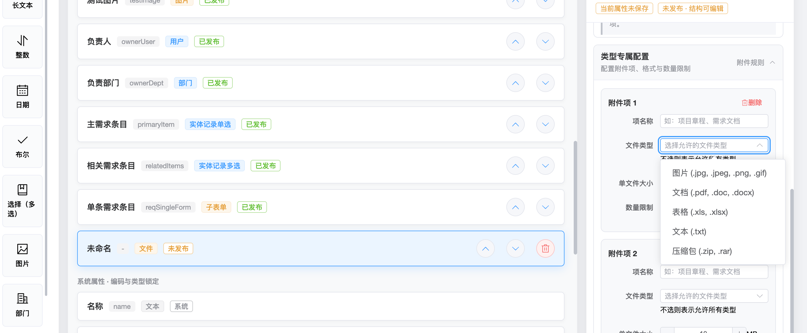
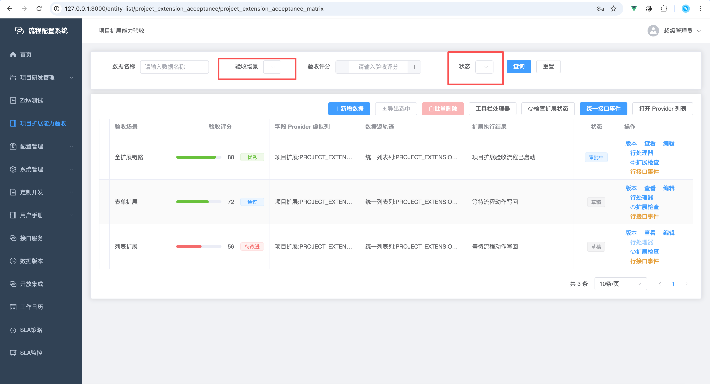

# 配置属性可理解性与操作性走查方案

> 走查日期：2026-08-12  
> 走查对象：实体、表单、列表、流程节点、按钮、事件、权限、数据版本与扩展配置  
> 目标：用户看到配置名称、当前值和说明后，能够判断“这是做什么的、什么时候需要配、留空或关闭会怎样、保存后何时生效、会影响哪里”。

## 一、结论摘要

当前配置体系的能力已经比较完整，问题主要不在“缺少配置项”，而在“信息解释的力度与属性风险不匹配”：

- 当前全量配置目录覆盖 501 个持久化配置项、33 个配置区域，没有未分类的持久化控件。
- 源码中已使用 62 处普通配置帮助、26 处 JSON 配置帮助，并按区块组织了大量设置项。
- 仍有 38 个属性直接使用“类型、实现、默认值、目标实体、状态值、启用”等泛化名称。
- 有 47 组重复标签对应不同配置字段；同一个“启用”“目标实体”“执行方式”在不同页面代表的结果并不相同。
- 有 58 个配置项的名称或解释直接包含 JSON、ID、Key、Provider、Bean、Schema、extraParams、REST、表达式等技术概念。

因此建议采用以下总体策略：

1. **低风险属性优先改名，不堆帮助图标。**
2. **业务规则属性必须说明关闭、留空和默认行为。**
3. **跨模块、高风险属性必须说明影响范围、生效时机和优先级。**
4. **JSON、表达式和扩展参数不应长期作为业务用户的主要编辑方式，应提供结构化编辑器，原始文本只保留在开发者模式。**
5. **控件显示异常属于程序问题，不能通过“让用户重新配置”规避。**

本方案建议先解决语义风险最高的属性，再扩展为一套覆盖全部 501 项配置的统一元数据规范。

## 二、走查依据与范围

### 2.1 证据来源

- 配置目录模型：`workflow-web/scripts/configuration-reference-model.mjs`
- 配置帮助：`workflow-web/src/shared/config-field-help.js`
- JSON 配置帮助：`workflow-web/src/shared/json-config-help.js`
- 帮助组件：`workflow-web/src/components/ConfigHelpLabel.vue`
- JSON 帮助组件：`workflow-web/src/components/JsonConfigLabel.vue`
- 配置区块组件：`workflow-web/src/components/SettingsSection.vue`
- 实体配置：`workflow-web/src/views/EntityDesign.vue`
- 表单配置：`workflow-web/src/views/EntityFormDesignByEntity.vue`
- 表单数据配置：`workflow-web/src/components/form-designer/FormNodeDataSettings.vue`
- 列表配置：`workflow-web/src/views/EntityListConfigDesign.vue`
- 流程节点配置：`workflow-web/src/components/NodeConfigPanel.vue`
- 按钮配置：`workflow-web/src/components/ListButtonConfigPanel.vue`
- 事件配置：`workflow-web/src/components/ui-config/EventBindingEditor.vue`
- 用户提供的现场截图。

本轮重点是配置属性的可理解性和可操作性，不是所有页面的完整视觉回归。未在登录态逐页操作的结论，均以当前源码、配置目录和用户现场截图为依据。

### 2.2 已有基础

当前实现已经具备三个值得保留的基础：

- `SettingsSection` 已能将配置按“常用、数据、规则、扩展、高级”等区块组织。
- `ConfigHelpLabel` 已能给高风险属性增加帮助入口。
- `JsonConfigLabel` 已能展示格式、示例、结果和注意事项。

后续不需要推翻这套结构，重点是补充统一的“配置元数据”和更准确的展示层级。

## 三、什么叫“见文知意”

一个合格的配置项应至少回答以下问题：

| 判断项 | 用户应能得到的答案 |
|---|---|
| 配置对象 | 它控制字段、附件项、列表、节点、按钮还是整个实体 |
| 直接作用 | 打开、关闭或选择某值后，运行时会发生什么 |
| 适用场景 | 什么业务情况下需要配置 |
| 留空或关闭 | 是继承默认、允许全部、禁止全部，还是配置无效 |
| 影响范围 | 只影响当前表单、当前列表、当前节点，还是整个实体 |
| 生效时机 | 立即保存、保存草稿、重新发布，还是仅新实例生效 |
| 优先级 | 是否会被表单模式、流程节点、权限或联动规则覆盖 |
| 风险 | 是否可能扩大权限、删除数据、跳过节点或替换默认处理 |

如果一个属性只写“默认值”“启用”“实现”“目标列表”，用户通常只能理解名词，无法预判结果。

## 四、配置说明力度分级

建议将所有配置项分为 L0 至 L4 五级。级别越高，需要展示的信息和防错能力越强。

| 级别 | 适用属性 | 页面呈现 | 示例 |
|---|---|---|---|
| L0 直观信息 | 名称、业务说明、普通标题 | 清晰标签和占位提示即可 | “实体名称”“按钮名称” |
| L1 有范围的普通属性 | 默认值、宽度、显示开关 | 对象化名称，必要时补单位或留空结果 | “新建记录默认值”“查询控件宽度（px）” |
| L2 业务规则 | 必填、唯一、选择模式、候选人 | 标签下固定一行说明，明确关闭或留空结果 | “关闭后允许不上传该附件项” |
| L3 跨模块或高风险规则 | 权限覆盖、级联删除、默认流、替代平台处理 | 结构化帮助卡、风险提示、影响范围、生效时机、当前生效摘要 | “发布后扩大列表可见范围，需先模拟验证” |
| L4 技术与扩展配置 | JSON、表达式、Provider、Bean、Key | 默认使用结构化编辑器；开发者模式才显示原始值 | 固定条件、输入输出映射、extraParams |

### 4.1 推荐帮助文案模板

L2 以上配置项不应只写一句概念解释，建议统一使用以下结构：

```text
作用：配置后会改变什么。
何时配置：什么业务场景需要设置。
留空/关闭：未配置时系统如何处理。
影响范围：影响当前字段、表单、列表、节点还是整个实体。
生效时机：保存草稿、发布后、仅新数据或仅新流程实例生效。
示例：给出一个业务化例子。
风险：仅高风险属性展示。
```

### 4.2 页面展示原则

- L0 不显示问号，避免页面噪音。
- L1 优先通过准确标签、单位、占位提示解决。
- L2 在控件下显示一行常驻说明，不依赖悬停。
- L3 使用问号帮助卡，同时在选择高风险值时显示常驻警告。
- L4 使用结构化表格、映射行、条件构建器或 Schema 表单；原始 JSON 放入“开发者模式”。

## 五、现场截图结论

### 5.1 附件配置



截图中的“单个附件项必填”和“文件类型允许自定义输入”已经具备实际能力，这是正确方向。但仍有以下语义改进空间：

- 实体字段层和附件项层都使用“是否必填”，容易让用户混淆约束层级。
- “文件类型”没有在名称中说明填写的是扩展名。
- “数量限制”没有说明是当前附件项最多上传的文件数。
- “不选表示允许所有类型”是重要安全语义，不应只依赖下方弱提示。

建议改为：

- “字段必填”用于整个附件字段。
- “该附件项必传”用于单个附件项。
- “允许的文件扩展名”替代“文件类型”。
- “最多上传文件数”替代“数量限制”。
- 未限制类型时显示黄色摘要“允许所有文件类型”，避免用户误以为系统已有默认白名单。

### 5.2 列表查询控件



截图中的下拉框只剩箭头、看不到占位文字或选中内容，这是程序布局问题，不是用户配置错误。此类问题应按以下原则判断：

- 已配置选项但控件内容不可见：程序显示问题。
- 控件能正常展开但没有选项：检查代码表、字段选项或列表发布配置。
- 保存后值丢失：保存或回显链路问题。
- 控件显示正常但匹配结果不对：检查查询方式与组件类型的兼容性。

配置系统应保证控件有稳定宽度、选中值可见、空值有占位提示，并在查询方式与输入组件不兼容时直接阻止保存或给出明确警告。

## 六、跨模块共性问题

| 编号 | 问题 | 用户影响 | 建议 | 优先级 |
|---|---|---|---|---|
| C01 | 同名属性在不同层级表达不同结果 | 用户不知道约束作用于字段、附件项、表单还是节点 | 名称必须包含作用对象，如“字段必填”“该附件项必传”“节点表单只读” | P0 |
| C02 | 泛化名称过多 | 用户能读懂字面，无法判断执行结果 | 将“类型、实现、默认值、说明、目标实体”等改为对象化名称 | P1 |
| C03 | 开关未说明关闭后的行为 | 用户担心关闭会删除配置或改变历史数据 | L2 开关固定说明开启、关闭和历史数据影响 | P0 |
| C04 | 留空语义散落在占位提示或帮助中 | 用户无法判断留空是继承、无限制还是无效 | 控件下常驻显示“留空结果”，摘要区同步展示当前有效值 | P0 |
| C05 | 保存、发布和运行时生效边界不统一 | 用户保存后立即去运行页面验证，误判功能失效 | 所有配置区显示“草稿”“发布后生效”“仅新实例生效”等状态标签 | P0 |
| C06 | 技术词直接面向业务用户 | 用户需要理解实现细节才能完成配置 | 基础模式显示业务名称；技术编码放在次级信息或开发者模式 | P1 |
| C07 | 原始 JSON 仍是主要输入方式 | 格式正确也不等于语义正确，容易静默失效 | 提供结构化编辑器、即时校验和结果预览 | P0 |
| C08 | 规则存在多级覆盖但只用长句解释 | 用户难以判断最终状态 | 展示“当前生效结果”和可展开的优先级链 | P0 |
| C09 | 高风险选项与普通选项视觉权重相同 | 用户可能无意识扩大权限、跳过节点或替换默认处理 | 高风险值二次确认，并要求预览或模拟 | P0 |
| C10 | 控件异常容易被误判为配置问题 | 用户反复改配置仍无法解决 | 建立程序问题与配置问题的诊断规则，并加入 UI 回归测试 | P1 |

## 七、属性级改进建议

### 7.1 实体字段、关系与附件

| 当前属性 | 主要问题 | 推荐名称 | 力度 | 推荐说明或交互 | 优先级 |
|---|---|---|---|---|---|
| 是否必填 | 未说明是实体写入约束，且与附件项必填重名 | 字段必填 | L2 | 开启后新增和修改均要求有值；已存在空值不自动补齐，发布前应校验存量数据 | P0 |
| 是否唯一 | 未说明唯一范围、空值处理和存量冲突 | 值在当前实体内唯一 | L3 | 说明是否忽略空值；发布前检测重复值并阻止不安全迁移 | P0 |
| 默认值 | 容易误解为给历史数据补值 | 新建记录默认值 | L2 | 仅在新建且用户未输入时使用，不修改历史记录；选项字段应通过选项选择器设置 | P0 |
| 字段长度 | “VARCHAR 长度”偏技术，未说明超长结果 | 文本最大长度（字符） | L2 | 说明保存超长内容时会阻止提交，调整已发布字段需重新发布 | P1 |
| 总位数 | 用户不理解 precision | 数值总位数 | L2 | 例如 18,2 表示最多 16 位整数和 2 位小数，旁边展示示例 | P1 |
| 小数位数 | 未说明与总位数关系 | 小数位数 | L2 | 不能大于总位数；显示允许的最大值示例 | P1 |
| 选项来源 | 只说明来源名称，未说明保存内容 | 选项数据来源 | L2 | 说明数据库保存选项编码，页面显示代码项名称；旧内嵌选项只读兼容 | P1 |
| 类型（子表单） | “类型”无法看出是关系类型 | 父子记录关系 | L2 | “一对一”表示每条父记录最多一条子记录；“一对多”允许多条 | P0 |
| 子表外键 | 技术词较重，无法判断应选哪个字段 | 子实体关联父记录的字段 | L3 | 只列出兼容字段，自动推荐；说明该字段由系统维护，不应在子表单手工编辑 | P0 |
| 级联删除 | 未直接说明破坏范围 | 删除父记录时同步删除子记录 | L3 | 开启时使用危险色，并说明只影响之后的删除操作，不会立即删除现有子记录 | P0 |
| 目标实体（子列表） | 与实体引用、按钮打开列表等场景重名 | 子列表数据实体 | L2 | 说明子列表从哪个实体读取记录，仅允许已发布实体 | P1 |
| 目标列表（子列表） | 不知道列表配置会被复用到什么程度 | 嵌入使用的已发布列表 | L3 | 常驻说明复用字段、排序、查询、数据范围、权限和按钮；显示发布版本 | P0 |
| 项名称 | 未说明运行时显示位置 | 附件项名称 | L1 | 示例“项目章程”，运行时作为上传分组标题和校验提示名称 | P1 |
| 是否必填（附件项） | 与字段必填重名 | 该附件项必传 | L2 | 开启后至少上传一个文件；字段必填与附件项必传分别展示当前关系 | P0 |
| 文件类型 | 不清楚输入的是 MIME 类型还是扩展名 | 允许的文件扩展名 | L2 | 支持选择或输入 `.dwg`；不选时明确显示“允许所有类型”风险摘要 | P0 |
| 单文件大小 | 未说明单位和超限结果 | 单个文件最大大小 | L1 | 单位固定显示 MB；超限时在上传前阻止并提示允许上限 | P1 |
| 数量限制 | 不清楚是整个字段还是当前项 | 当前附件项最多文件数 | L1 | 达到上限后禁用继续上传并显示数量 | P1 |
| 目标实体（实体引用） | 未说明保存的是记录 ID | 被引用的实体 | L2 | 说明运行时选择目标实体记录，字段保存记录 ID 或 ID 集合 | P1 |
| 显示字段 | 容易误以为改变保存值 | 选中记录的显示字段 | L2 | 只改变页面显示文本，不改变实际保存的记录 ID | P1 |
| 参与后允许查看 | “参与”范围不明确 | 参与流程后授予记录查看权 | L3 | 说明哪些流程角色算参与者、权限持续多久、只授予查看而非编辑或审批 | P0 |
| 权限覆盖级别 | 枚举含义和风险难以比较 | 团队查看权可突破的限制 | L3 | 使用三张对比选项卡展示普通叠加、越过范围、越过拒绝；最高级别需二次确认 | P0 |

### 7.2 表单与字段呈现

| 当前属性 | 主要问题 | 推荐名称 | 力度 | 推荐说明或交互 | 优先级 |
|---|---|---|---|---|---|
| 组件类型 | 只写“组件”，业务用户不知道改变什么 | 字段录入组件 | L2 | 说明只改变当前表单中的录入方式，不改变实体字段类型；仅展示兼容组件 | P1 |
| 占位提示 | 容易与默认值混淆 | 输入框内提示文字 | L1 | 常驻说明“仅提示，不会作为字段值提交” | P1 |
| 栅格宽度 | 需要理解 24 栅格 | 字段占用宽度 | L2 | 同步显示“12/24，约半行”，并在画布实时预览 | P1 |
| 列间距 | 未带单位，也未说明作用对象 | 栅格列间距（px） | L1 | 只影响当前栅格容器内各列之间的距离 | P2 |
| 默认跨度 | 不知道影响现有还是新增节点 | 容器内新增字段默认宽度 | L2 | 仅作为新放入字段的初始值，不批量修改已有字段 | P1 |
| 字段状态 | 三个开关与模式、联动、节点只读存在覆盖关系 | 默认字段状态 | L3 | 页面直接显示最终预览状态，并以可展开链路展示默认、模式、节点和联动的优先级 | P0 |
| 最小长度/最大长度 | 未说明是字符数还是文件、数组数量 | 文本最少字符数/文本最多字符数 | L1 | 按字段类型动态命名，不适用时不展示 | P1 |
| 显示字数 | 名称像限制值 | 显示已输入字数 | L1 | 说明只显示计数，不改变最大长度规则 | P2 |
| 格式 | 名称泛化 | 预设格式校验 | L2 | 选择邮箱、手机号或 URL 后展示一条通过和失败示例 | P1 |
| 正则 | 对普通用户过于技术 | 自定义格式规则（正则） | L4 | 放入开发者模式，提供测试值输入和即时匹配结果 | P1 |
| 表单布局 | 垂直、水平、网格的结果不直观 | 标签与字段排列方式 | L2 | 使用小型预览图或即时画布预览，不只显示三个名词 | P1 |
| 标签宽度 | 不知道影响哪一层 | 当前表单字段名称宽度（px） | L1 | 仅影响当前表单，超长名称仍允许换行或提示 | P2 |
| 默认表单 | 未说明在哪些入口被使用 | 设为该实体的默认表单 | L3 | 说明未显式指定表单的新增、编辑、查看或流程入口如何选择；显示当前默认表单 | P0 |
| 表单状态 | “停用”影响范围不清楚 | 允许新入口使用此表单 | L3 | 停用后不再作为新入口候选，已发布流程快照和历史实例是否继续使用需明确展示 | P0 |
| 渲染方式 | “自定义渲染”影响范围不够明确 | 表单页面渲染实现 | L3 | 切换前说明默认节点、按钮、事件和数据源仍保留，渲染组件必须兼容同一 Schema | P1 |
| 节点扩展 | 名称偏实现 | 当前节点的扩展渲染组件 | L3 | 基础用户只看到组件名称和用途；实现编码、版本和快照放次级信息 | P1 |
| 锁定模板 | “锁定”与“复制后独立”语义冲突 | 从组件模板创建并锁定版本 | L3 | 说明后续模板升级不会自动生效，需手工检查升级；清空后是否保留参数要明确 | P0 |
| 模板版本 | 只显示版本号，缺少差异 | 当前使用的模板版本 | L3 | 提供“查看差异”和“升级影响预览”，不要只给“检查升级” | P1 |
| 静态默认值 | 已比“默认值”清晰，但动态默认值关系仍需说明 | 新建时静态默认值 | L2 | 明确动态数据源成功时的覆盖优先级，以及动态失败时是否回退静态值 | P0 |
| 数据源 | 同一名称用于多个用途 | 当前用途的数据源 | L2 | 在标签中带出用途，如“选项数据源”“字段默认值数据源” | P1 |
| 接口操作 | 需要理解服务目录 | 数据源中执行的操作 | L3 | 选择数据源后只显示当前用途兼容操作，并展示输入、输出摘要 | P1 |
| 发布版本（子表单） | 不清楚为何不能跟随最新版本 | 子表单固定发布版本 | L3 | 说明父表单发布后固定快照，不自动跟随子表单后续发布；支持差异检查 | P0 |
| 显示查询/分页/工具栏/操作列 | 未强调来自目标列表 | 显示目标列表的查询区/分页/工具栏/行操作 | L2 | 每项旁显示目标列表名称，避免用户以为配置的是父表单自身控件 | P1 |

### 7.3 列表、查询与列展示

| 当前属性 | 主要问题 | 推荐名称 | 力度 | 推荐说明或交互 | 优先级 |
|---|---|---|---|---|---|
| 收起时显示条件数 | 名称较长但不够自然 | 查询区默认显示前 N 个条件 | L2 | 展开时显示全部；关闭折叠后该值不生效 | P1 |
| 查询区标签宽度 | 不知道单位和对象 | 查询条件名称宽度（px） | L1 | 只影响查询区标签，不影响表格列 | P2 |
| 数据范围模式 | 三种模式风险差异大 | 列表数据权限来源 | L3 | 用“继承实体权限、只能继续缩小、使用独立权限”三张卡片；独立权限必须模拟验证 | P0 |
| 访问权限码 | 直接暴露技术拼接规则 | 打开此列表所需权限 | L3 | 基础模式选择已有权限；自定义编码放开发者模式；留空显示实际继承权限 | P0 |
| 允许场景 | “场景”抽象，逐项保存也不直观 | 此列表可用于哪些入口 | L2 | 选项附说明，如“独立页面”“实体选择弹窗”“子列表嵌入”；显示发布后生效 | P1 |
| 选择模式 | 不清楚只在选择场景生效 | 作为选择器时允许选择 | L2 | 普通列表页面不受影响；选“不选择”时隐藏返回配置 | P1 |
| 返回值字段 | 不清楚返回给谁 | 确认选择后返回的主值 | L3 | 说明默认返回记录 ID；显示调用方将收到的示例结果 | P0 |
| 返回映射 JSON | 业务用户难以正确填写 | 附加返回字段映射 | L4 | 改为“来源字段、返回名称”两列表格；原始 JSON 仅开发者模式 | P0 |
| 固定条件 JSON | 语法正确仍可能语义错误 | 用户不可修改的固定筛选条件 | L4 | 使用条件构建器；显示自然语言摘要“状态等于已通过”；发布前预览命中数据 | P0 |
| 上下文绑定 JSON | 默认查询并不直接使用，极易误配 | 扩展组件上下文参数 | L4 | 仅选择自定义组件或扩展查询时显示；使用字段映射编辑器并注明默认查询不会读取 | P0 |
| 列表查询接口 | “保存到槽位、LIST_QUERY”偏技术 | 替代默认列表查询的数据服务 | L3 | 留空继续使用平台查询；选择后展示服务输入、输出、权限和失败策略摘要 | P0 |
| 查询组件 | 与查询方式可能不兼容 | 查询条件输入控件 | L2 | 默认自动匹配字段类型；手工选择时实时检查与运算符兼容性 | P0 |
| 查询方式 | 等于、范围、多值对控件要求不同 | 查询匹配方式 | L3 | 每个选项展示业务例子；选择多值匹配时自动切换为多选控件 | P0 |
| 占位提示（查询） | 与表单字段占位同名 | 查询输入提示 | L1 | 仅用于当前列表查询区 | P2 |
| 默认值（查询） | 易误解为字段默认值 | 打开列表时的默认筛选值 | L2 | 点击重置后恢复此值；不修改任何实体数据 | P0 |
| 列宽 | 0 表示自动依赖旁边弱提示 | 表格列宽（px） | L1 | 使用“自动/固定”分段控件，固定时再输入像素 | P1 |
| 固定位置 | 不清楚是滚动固定 | 横向滚动时固定列 | L2 | 预览中即时展示左固定或右固定；没有横向滚动时效果不明显 | P1 |
| 最小宽度 | 与固定列宽关系不清楚 | 自动列宽的最小值（px） | L2 | 仅在列宽为自动时生效，否则禁用并说明 | P1 |
| 溢出提示 | 不知道具体呈现 | 内容截断时悬停显示全文 | L1 | 同步展示截断示例 | P2 |
| 字段数据源 | “字段”与“列”混用 | 当前列的取值来源 | L3 | 实体字段列只读展示；虚拟列才能选择模板、Provider 或统一数据源 | P0 |
| 统一数据源 | 名称无法说明用途 | 计算此列值的数据服务 | L3 | 选择后强制配置兼容的列查询操作，并展示缓存与失败策略 | P0 |
| 渲染组件 | 容易误以为改变数据 | 单元格展示组件 | L2 | 明确只改变显示，不修改原始值；提供样例数据预览 | P1 |
| 自定义列表组件 | 高级能力和普通属性混在一起 | 自定义列表页面组件 | L4 | 放开发者模式，显示依赖、版本、参数 Schema 和缺失实现时的回退行为 | P1 |
| 初始化模板 | 不知道是复制还是持续继承 | 从列模板复制初始配置 | L3 | 明确是一次性复制还是版本锁定；建议与表单模板统一语义 | P0 |

### 7.4 权限与可见范围

| 当前属性 | 主要问题 | 推荐名称 | 力度 | 推荐说明或交互 | 优先级 |
|---|---|---|---|---|---|
| 适用列表 | 留空含义隐藏在占位提示 | 规则作用于哪个列表 | L3 | 留空时显示“实体默认范围，影响所有未单独覆盖的列表” | P0 |
| 规则效果 | ALLOW/DENY 需要理解合并逻辑 | 命中后允许还是排除数据 | L3 | 使用自然语言选项，旁边实时展示最终集合运算摘要 | P0 |
| 是否启用 | 不知道关闭后配置是否删除 | 启用此权限规则 | L2 | 关闭后保留规则内容但不参与计算，发布后生效 | P1 |
| 逻辑关系 | “关系”过于抽象 | 多个适用对象条件如何组合 | L2 | 选项直接写“满足任一条件”“必须满足全部条件” | P1 |
| 范围类型 | 不知道是用户范围还是数据范围 | 按哪类用户匹配规则 | L2 | 动态显示下一步需要选择用户、角色、组、部门或组织 | P1 |
| 匹配方式 | 与上层逻辑关系容易混淆 | 所选角色或用户组需满足几项 | L2 | 只在角色、用户组多选时显示，并给出当前自然语言摘要 | P1 |
| 数据范围 | 名称与“列表数据范围模式”重叠 | 命中用户可以看到哪些记录 | L3 | 将“全部、本人创建、本部门”等选项写成完整句子 | P0 |
| 状态限制 | 不知道是在原范围上追加过滤 | 再按业务状态过滤结果 | L2 | 开启后只对上方已经允许的数据继续过滤，不扩大范围 | P0 |
| 限制模式 | 名称抽象 | 保留还是排除所选状态 | L2 | 直接使用“只保留所选状态”“排除所选状态” | P1 |
| 状态值 | 未与限制模式组成完整句子 | 要保留/排除的业务状态 | L1 | 标签随限制模式动态变化 | P1 |
| 模拟可见范围 | 仍可能给用户展示 SQL 思维 | 用指定用户预览最终可见数据 | L3 | 默认展示命中规则、允许原因、拒绝原因和记录示例；SQL 只放技术详情 | P0 |

### 7.5 流程节点与办理规则

| 当前属性 | 主要问题 | 推荐名称 | 力度 | 推荐说明或交互 | 优先级 |
|---|---|---|---|---|---|
| 节点ID | 业务用户不需要首先理解技术 ID | 节点技术标识 | L3 | 放入“标识与备注”；只读展示并提供复制，不占常用区 | P2 |
| 设计备注 | 未说明运行时不可见 | 仅设计人员可见的备注 | L1 | 不会展示给流程参与人，也不影响流程执行 | P2 |
| 指定方式 | 不知道指定的是办理人来源 | 任务办理人来源 | L2 | 选项改为“固定用户、用户组成员、角色成员、流程变量、动态人员服务” | P0 |
| 执行人 | 与候选人区别依赖下方说明 | 直接分配给一个办理人 | L2 | 任务创建后直接属于该用户，无需认领 | P0 |
| 候选人 | 不知道需要认领 | 可认领此任务的用户 | L2 | 候选人中任意一人认领后，其他人不再办理 | P0 |
| 用户组/角色 | 名称没有办理语义 | 可认领任务的用户组/角色 | L2 | 组内或角色成员都可看到并认领任务 | P1 |
| 人员接口 | 技术词且未说明返回结果 | 动态办理人服务 | L3 | 运行时根据流程、节点和业务数据计算人员；显示输入上下文和返回人数预览 | P0 |
| extraParams | 业务用户无法理解 | 动态办理人服务的附加参数 | L4 | 根据所选服务 Schema 生成表单；没有 Schema 时才允许开发者编辑 JSON | P0 |
| 启用多实例 | BPMN 术语不直观 | 为每个参与人创建独立任务 | L3 | 开启后说明将生成多少个任务、并行还是串行、何时全部完成 | P0 |
| 执行方式（多人办理） | 与按钮、流程动作中的执行方式重名 | 多人任务执行顺序 | L2 | 选项使用“同时创建全部任务”“按人员顺序逐个创建” | P0 |
| 人员来源（多人办理） | “直接选择”与变量语义不一致 | 多人任务参与者来源 | L2 | 说明固定选择会锁入配置，动态服务在运行时计算 | P1 |
| 完成条件 | 表达式风险高 | 多人任务提前结束条件 | L4 | 默认“等待全部完成”；提供常用模板“任意一人通过”“超过半数通过”，原始表达式放开发者模式 | P0 |
| 集合变量 | 普通用户不应修改 | 系统生成的参与人集合变量 | L4 | 只读并默认折叠 | P2 |
| 元素变量 | 改错会影响表达式 | 当前办理人在流程中的变量名 | L4 | 默认只读；仅开发者模式允许修改，并检查引用影响 | P1 |
| 实现类型 | 可以保留，但选择后下一项仍叫“实现” | 服务任务调用方式 | L3 | 选择 Java、表达式、Spring Bean 或 REST 后，动态改变后续字段名称 | P1 |
| 实现 | 含义完全依赖上一项 | Java 类名/执行表达式/Spring Bean 名称 | L3 | 动态标签、格式校验、示例和可用实现目录；不要统一叫“实现” | P0 |
| 请求URL | 技术但含义明确，缺少安全与测试 | REST 请求地址 | L4 | 支持变量预览、域名限制、测试调用和敏感信息检查 | P0 |
| 错误处理 | “继续”和“忽略”差别不清楚 | REST 调用失败后如何流转 | L3 | 分别说明是否记录错误、是否产生结果变量、是否继续流程 | P0 |
| 结果映射 | 原始 JSON 易错 | 响应字段写入流程变量 | L4 | 使用“响应路径、流程变量名”映射表并支持样例响应测试 | P0 |
| 结果变量 | 不知道保存什么 | 保存服务调用结果的流程变量 | L3 | 说明变量可在哪些后续节点和表达式中使用 | P1 |
| 表单来源 | “自定义”与“实体”边界需要解释 | 此节点使用哪种办理表单 | L2 | 选项附说明；无表单时提示用户仍可完成任务的方式 | P1 |
| 选择表单 | 未强调版本 | 此节点使用的实体表单 | L3 | 展示表单发布版本，并说明流程发布后固定快照 | P0 |
| 强制整表只读 | 名称清晰，但覆盖关系风险高 | 此节点禁止编辑所有表单字段 | L3 | 常驻说明优先级高于字段“审批可编辑”，并在表单预览中显示最终状态 | P0 |
| 表单Key | 技术词直接暴露 | 外部表单标识 | L4 | 仅自定义表单时显示，优先从已注册外部表单目录选择 | P1 |
| 启用审批意见 | 未说明关闭后的办理界面 | 办理时要求选择审批结果 | L2 | 关闭后不显示审批意见区；仍可通过普通任务动作完成 | P1 |
| 包含当前办理人 | 不知道包含到哪里 | 将当前办理人加入知会收件人 | L2 | 只影响当前节点本次知会，不改变任务办理人 | P1 |
| 异步执行 | 与异步前、异步后关系不清楚 | 为此节点启用异步边界 | L4 | 放开发者模式，用时序图说明事务边界、重试和错误处理 | P0 |
| 异步前/异步后 | BPMN 引擎术语直接暴露 | 在节点执行前/后提交当前事务 | L4 | 与“异步执行”合并成一个结构化选择，不使用两个独立开关 | P0 |
| 跳过表达式 | 与“是否跳过”并存，语义冲突 | 满足条件时跳过节点 | L4 | 与自动跳过配置合并；默认关闭，提供条件构建器 | P0 |
| 是否跳过 | 开启即总是跳过，风险高 | 始终自动跳过此节点 | L3 | 使用危险色，说明不会创建任务或停留，发布前必须走流程模拟 | P0 |
| 日历来源 | 依赖 SLA 时间口径 | SLA 工作时间使用哪个日历 | L3 | 只有工作时间口径时展示；显示最终解析到的日历和时区 | P1 |

### 7.6 按钮、事件与扩展

| 当前属性 | 主要问题 | 推荐名称 | 力度 | 推荐说明或交互 | 优先级 |
|---|---|---|---|---|---|
| 启用 | 多个配置区都使用同名列 | 启用此按钮/启用此事件绑定 | L1 | 对象化名称；关闭后保留配置但不显示或不执行 | P1 |
| 执行方式（列表按钮） | 一列同时混合内置、自定义和打开页面 | 点击按钮后执行什么 | L2 | 先选业务动作类型，再显示该类型必需配置 | P1 |
| 函数/组件 | 技术实现直接暴露 | 已注册前端处理器/已注册展示组件 | L4 | 使用扩展目录选择器，不允许普通用户自由输入不存在的名称 | P0 |
| 权限码 | 不知道是显示权限还是执行权限 | 执行此按钮所需权限 | L3 | 明确前后端都会校验；留空时展示继承或默认策略 | P0 |
| 适用条件 | 不知道条件不满足后隐藏还是禁用 | 按钮在什么情况下可用 | L3 | 摘要同时显示条件和不可用策略，例如“草稿且本人创建，其他情况禁用并说明” | P0 |
| Link 样式 | 中英混用 | 显示为文字链接 | L1 | 只影响行按钮外观，不改变动作 | P2 |
| 目标实体（打开列表） | 与其他场景重名 | 按钮要打开的实体 | L2 | 选择后只列出该实体允许弹窗或抽屉使用的已发布列表 | P1 |
| 目标列表（打开列表） | 暴露 listKey 占位 | 按钮要打开的已发布列表 | L3 | 显示列表名称、用途场景、选择模式和发布版本 | P0 |
| 标题 | 不知道是哪一个标题 | 弹窗或抽屉标题 | L1 | 留空时显示实际默认标题预览 | P2 |
| 上下文关系 | relationKey 技术性强 | 打开列表时使用的可信关联规则 | L4 | 从已注册关系目录选择，并展示自然语言效果 | P0 |
| 选择回调 | 需要知道前端处理器注册名 | 选择完成后的处理器 | L4 | 从扩展目录选择，展示输入输出契约；普通选择回填优先使用结构化映射 | P0 |
| 继承方式 | 不知道继承什么 | 当前事件如何处理上级自定义步骤 | L3 | 选项写成“保留上级并追加”“只使用当前层”“关闭当前层自定义”，同步展示完整执行链 | P0 |
| 执行位置 | 容易误解为浏览器或服务器位置 | 此步骤相对平台默认处理的顺序 | L3 | 改为“默认处理前、替代默认处理、默认处理后”；替代模式使用危险提示 | P0 |
| 接口服务 | 留空可只做映射的语义不明显 | 此步骤调用的数据服务 | L3 | 增加显式“仅做字段映射”选项，不把留空当作隐含模式 | P1 |
| 失败策略 | 结果差异较大 | 此步骤失败后是否继续 | L3 | 选项直接写完整结果，并显示后续映射是否仍执行 | P0 |
| 启用（事件绑定） | 关闭后的完整执行链不直观 | 启用此事件绑定 | L2 | 关闭后平台默认处理是否仍执行应在摘要中明确显示 | P0 |

## 八、推荐的统一组件改造

### 8.1 配置元数据

新增统一配置元数据结构，避免名称、帮助和文档各自维护：

```js
{
  key: 'entity.field.required',
  label: '字段必填',
  level: 'L2',
  purpose: '要求新增和修改记录时必须填写该字段。',
  configureWhen: '该字段在业务上不能缺失时开启。',
  emptyOrOffResult: '关闭后允许保存空值。',
  scope: '当前实体字段，影响使用该字段的所有表单和接口写入。',
  effectiveAt: '重新发布实体后生效。',
  example: '合同编号必须填写。',
  risk: '',
  audience: 'BUSINESS'
}
```

建议由该元数据同时驱动：

- 页面标签和帮助卡。
- 全量配置说明文档。
- 配置搜索。
- 发布前检查。
- 帮助覆盖测试。

### 8.2 帮助组件

将 `ConfigHelpLabel` 从单字符串升级为结构化帮助卡：

- 第一屏只显示“作用、留空或关闭、生效时机”。
- 展开后显示“何时配置、影响范围、示例、风险”。
- 支持高风险等级，自动显示 warning 或 danger。
- 支持“查看当前生效值”，不是只解释抽象概念。

`JsonConfigLabel` 保留为开发者模式的辅助组件，但业务模式优先使用结构化编辑器。

### 8.3 当前生效摘要

每个 `SettingsSection` 的 summary 不只显示“已配置/未配置”，应显示业务结果：

- “字段必填，发布后生效”
- “继承实体数据范围”
- “仅审批模式可编辑”
- “并行创建 5 个办理任务，全部完成后继续”
- “默认处理前调用客户校验，失败时停止”
- “允许所有文件类型”

摘要应能让用户不展开区块也知道主要结果。

### 8.4 结构化编辑器

优先替换以下原始文本：

| 当前配置 | 推荐编辑方式 |
|---|---|
| 固定条件 JSON | 字段、运算符、值组成的条件构建器 |
| 返回映射 JSON | 来源字段、返回名称映射表 |
| 上下文绑定 JSON | 来源上下文、目标参数映射表 |
| 输入输出映射 | 路径选择器与映射表 |
| extraParams | 按所选服务 Schema 自动生成表单 |
| 多实例完成条件 | 常用模板加高级表达式 |
| 跳过表达式 | 条件组编辑器 |
| REST 结果映射 | 样例响应树到流程变量的可视化映射 |

所有结构化编辑器都应支持：

- 即时校验。
- 生成自然语言摘要。
- 预览最终保存内容。
- 开发者模式切换到原始 JSON。
- 原始值与结构化值双向同步。

## 九、基础模式、高级模式与开发者模式

当前系统已经在术语表中提出模式分层，建议在配置页面真正落实：

### 基础模式

面向业务配置人员，只显示：

- 业务名称和用途。
- 常用开关。
- 选择对象。
- 业务规则。
- 当前生效结果。

### 高级模式

面向系统管理员，显示：

- 权限和作用范围。
- 模式覆盖。
- 版本锁定。
- 数据源选择。
- 失败策略。
- 发布影响。

### 开发者模式

面向扩展开发人员，显示：

- 字段编码、Key、ID。
- JSON 和表达式。
- Provider、Connector、Bean 和类名。
- 输入输出 Schema。
- 技术变量和快照信息。

模式切换不能改变配置数据，只改变展示深度。高风险配置即使在开发者模式中也必须保留校验和影响提示。

## 十、程序问题与配置问题的判定规则

| 现象 | 优先判断 | 处理方式 |
|---|---|---|
| 下拉框只有箭头，文字不可见 | 程序布局问题 | 修复宽度、溢出和选中值显示，增加视觉回归测试 |
| 下拉框正常但没有任何选项 | 配置前置条件或数据加载问题 | 检查代码表、目标实体、已发布列表和接口加载错误 |
| 选中后保存，再打开值为空 | 保存或回显链路问题 | 检查请求载荷、数据库字段、响应转换和初始化覆盖 |
| 选择值仍在，但运行结果不生效 | 发布、生效时机或运行时读取问题 | 页面显示当前草稿、发布版本和运行时版本 |
| 查询控件显示正常但查询结果错误 | 查询方式或后端解析问题 | 检查运算符、值类型、多选值格式和固定条件合并 |
| JSON 可保存但没有效果 | 语义或扩展依赖问题 | 使用结构化编辑器并显示“哪个运行时组件会读取此配置” |
| 开关关闭后配置仍影响运行 | 优先级或清理问题 | 显示当前生效值并检查运行时是否仍读取旧字段 |

用户不应承担识别程序问题的责任。页面应尽可能通过空态、错误态、当前生效摘要和发布状态主动说明。

## 十一、实施顺序

### P0：先消除高风险歧义

1. 区分字段必填、附件项必传、节点表单只读等不同层级名称。
2. 为唯一、级联删除、权限覆盖、列表独立范围、默认表单、模板锁定、流程跳过、异步边界增加结构化说明和风险提示。
3. 将固定条件、返回映射、上下文绑定、extraParams、完成条件和结果映射改成结构化编辑器。
4. 让查询方式自动约束查询组件，禁止不兼容组合。
5. 所有配置区展示草稿、发布和运行时生效状态。
6. 所有高风险配置提供预览、模拟或影响检查。

### P1：统一常用属性语义

1. 批量替换 38 个泛化标签。
2. 对 47 组重复标签进行对象化命名。
3. 将技术词从基础模式移入高级或开发者模式。
4. 升级 `ConfigHelpLabel` 为结构化帮助卡。
5. 给 `SettingsSection` 增加当前生效摘要。
6. 统一按钮、列表、表单和流程中的“启用、执行方式、目标实体、目标列表、失败策略”命名。

### P2：完善细节与持续治理

1. 补单位、示例、空值状态和动态标签。
2. 增加配置搜索，可按业务词找到配置项。
3. 在预览中标记哪些效果来自草稿，哪些来自已发布版本。
4. 建立配置文案和控件布局的自动审计。

## 十二、验收标准

### 12.1 属性可理解性

- 501 个持久化配置项全部标记 L0 至 L4。
- L2 以上配置全部说明关闭或留空结果。
- L3 以上配置全部说明影响范围和生效时机。
- L4 配置全部有结构化编辑入口，原始 JSON 或表达式不是基础模式主入口。
- “类型、实现、说明、默认值、目标实体、启用”等泛化标签仅在上下文完全明确时保留。

### 12.2 操作性

- 选择前能知道前置条件。
- 选择后能看到当前生效摘要。
- 保存前能发现格式错误、依赖缺失和不兼容组合。
- 发布前能看到影响对象和版本。
- 高风险配置必须经过预览、模拟或明确确认。
- 控件在桌面和移动端均能显示占位文字和选中值，不出现只剩箭头或内容被挤没的情况。

### 12.3 自动化检查

建议增加以下测试：

- 配置目录中泛化标签数量不得增加。
- L3/L4 配置必须存在结构化帮助元数据。
- 开关型高风险配置必须声明 `offResult`。
- 发布型配置必须声明 `effectiveAt`。
- 原始 JSON 输入必须有解析错误、Schema 错误和语义错误提示。
- 查询方式与组件类型组合必须通过兼容性检查。
- 使用 Playwright 检查查询区、属性抽屉、事件编辑器在常用视口下文本可见且不重叠。
- 配置保存、重新打开、发布和运行时读取必须形成回显闭环测试。

## 十三、建议落地文件

| 改造内容 | 建议文件 |
|---|---|
| 统一配置元数据 | 新增 `workflow-web/src/shared/config-field-metadata.js` |
| 结构化帮助卡 | `workflow-web/src/components/ConfigHelpLabel.vue` |
| JSON 开发者帮助 | `workflow-web/src/components/JsonConfigLabel.vue` |
| 区块生效摘要 | `workflow-web/src/components/SettingsSection.vue` |
| 实体字段与附件文案 | `workflow-web/src/views/EntityDesign.vue` |
| 表单字段与模式优先级 | `workflow-web/src/views/EntityFormDesignByEntity.vue` |
| 子表单、子列表和数据源 | `workflow-web/src/components/form-designer/FormNodeDataSettings.vue` |
| 列表查询、权限和映射 | `workflow-web/src/views/EntityListConfigDesign.vue` |
| 流程办理人、服务任务和高级配置 | `workflow-web/src/components/NodeConfigPanel.vue` |
| 列表按钮语义 | `workflow-web/src/components/ListButtonConfigPanel.vue` |
| 事件执行链语义 | `workflow-web/src/components/ui-config/EventBindingEditor.vue` |
| 配置目录和审计 | `workflow-web/scripts/configuration-reference-model.mjs` |

## 十四、最终建议

本系统不应追求“每个属性都写很长”，而应追求“解释力度与误配代价一致”：

- 名称能解决的，不加帮助。
- 留空和关闭容易误解的，固定显示一句结果。
- 涉及权限、版本、流程、覆盖和删除的，必须说明范围、优先级和生效时机。
- 涉及 JSON、表达式和扩展实现的，必须用结构化工具降低操作门槛。
- 控件显示异常、保存丢失和回显错误，一律按程序问题处理，不让用户通过反复调整配置自救。

按本方案实施后，用户应能在不查源码、不理解数据库和 BPMN 引擎细节的情况下完成常见配置；管理员仍可进入高级模式处理权限、版本和数据源；开发者模式继续保留完整技术能力。
